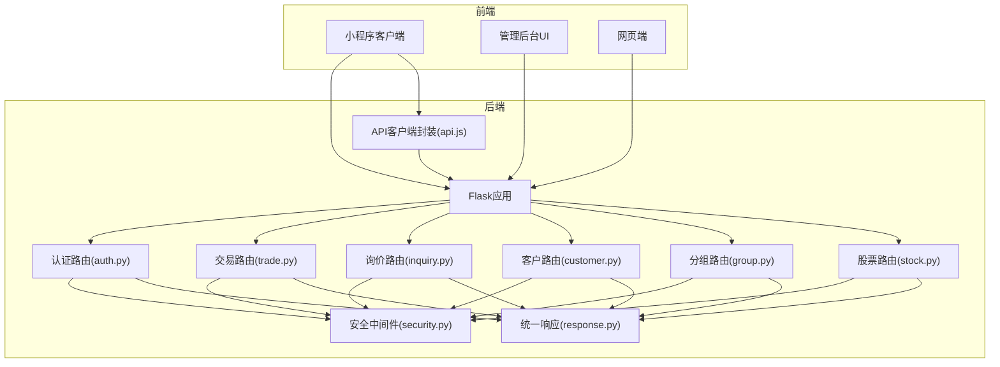
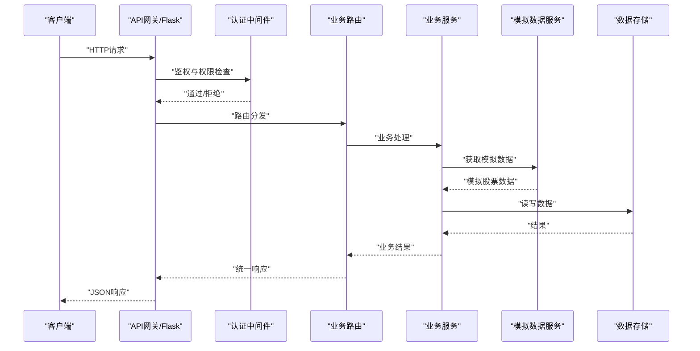
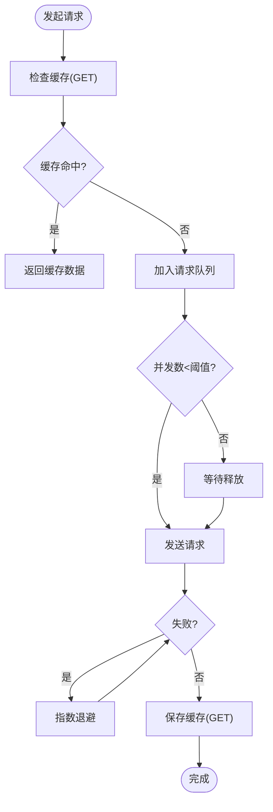
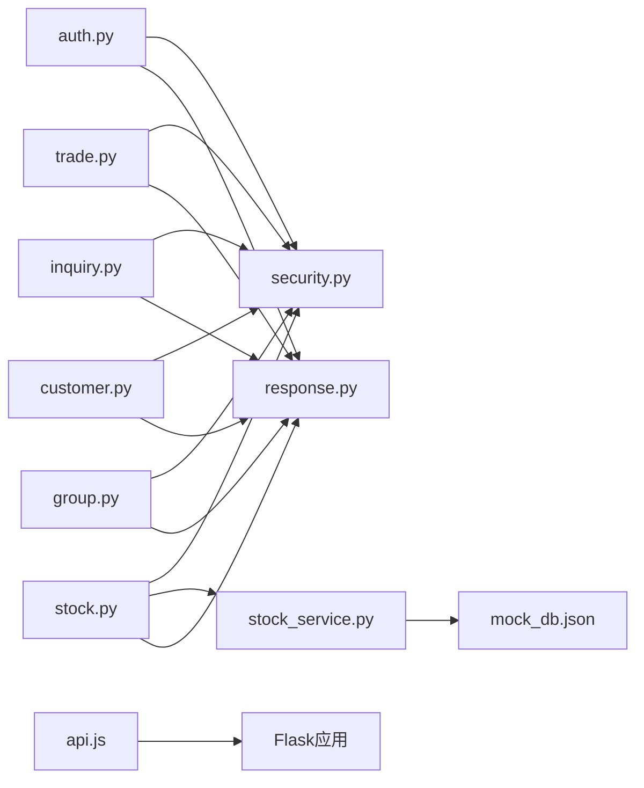

# API接口文档

<cite>
**本文档引用的文件**
- [postman_collection.json](file://postman_collection.json)
- [api.js](file://backend_utils/api.js)
- [auth.py](file://routes/auth.py)
- [customer.py](file://routes/customer.py)
- [inquiry.py](file://routes/inquiry.py)
- [trade.py](file://routes/trade.py)
- [group.py](file://routes/group.py)
- [stock.py](file://routes/stock.py)
- [response.py](file://backend_utils/response.py)
- [security.py](file://backend_utils/security.py)
- [stock_service.py](file://services/stock_service.py)
- [stock.py](file://models/stock.py)
- [quote_service.py](file://services/quote_service.py)
- [mock_db.json](file://mock_db.json)
- [app.py](file://app.py)
- [README.md](file://README.md)
- [package.json](file://package.json)
</cite>

## 更新摘要
**变更内容**
- 更新股票数据API部分，反映akshare数据源移除后的模拟数据返回机制
- 新增数据可用性声明和模拟数据特征说明
- 更新响应格式说明，明确模拟数据的结构和特点
- 增强API客户端实现指南，包含模拟数据处理建议

## 目录
1. [简介](#简介)
2. [项目结构](#项目结构)
3. [核心组件](#核心组件)
4. [架构概览](#架构概览)
5. [详细组件分析](#详细组件分析)
6. [依赖分析](#依赖分析)
7. [性能考虑](#性能考虑)
8. [故障排除指南](#故障排除指南)
9. [结论](#结论)
10. [附录](#附录)

## 简介
本API接口文档面向开发者与集成方，完整记录了基于Flask构建的场外期权交易系统的RESTful API端点规范。文档涵盖HTTP方法、URL模式、请求/响应模式、认证方式、参数定义、状态码与错误处理策略，并提供Postman集合示例、速率限制与安全考虑、客户端实现指南与性能优化建议。

**重要更新**：由于akshare数据源的移除，股票实时数据、历史数据和搜索接口现返回模拟数据而非真实市场信息。所有股票数据接口均使用模拟数据，适用于演示、测试和开发环境。

## 项目结构
系统采用前后端分离架构，后端以Flask为核心，提供RESTful API；前端包含小程序、管理后台与网页端。API统一通过蓝图组织，响应格式标准化，具备基础的认证、授权、审计与速率限制能力。

**图表来源**
- [auth.py](file://routes/auth.py#L1-L353)
- [trade.py](file://routes/trade.py#L1-L330)
- [inquiry.py](file://routes/inquiry.py#L1-L175)
- [customer.py](file://routes/customer.py#L1-L217)
- [group.py](file://routes/group.py#L1-L269)
- [stock.py](file://routes/stock.py#L1-L353)
- [security.py](file://backend_utils/security.py#L1-L117)
- [response.py](file://backend_utils/response.py#L1-L118)
- [api.js](file://backend_utils/api.js#L1-L571)

**章节来源**
- [README.md](file://README.md#L1-L90)
- [package.json](file://package.json#L1-L50)

## 核心组件
- 统一响应格式：提供成功、错误与分页响应的标准结构，便于前端一致化处理。
- 安全中间件：内置速率限制、账户锁定与审计日志装饰器，保障API安全。
- 认证与授权：基于Bearer Token的JWT认证，支持角色权限校验。
- API客户端封装：对wx.request进行封装，支持重试、并发控制、缓存与拦截器。
- **模拟数据服务**：股票数据接口现返回模拟数据，适用于演示和测试场景。

**章节来源**
- [response.py](file://backend_utils/response.py#L1-L118)
- [security.py](file://backend_utils/security.py#L1-L117)
- [api.js](file://backend_utils/api.js#L1-L571)

## 架构概览
API采用模块化蓝图组织，各业务域独立路由，共享统一的安全与响应机制。认证中间件在路由层生效，确保受保护端点的访问控制。

**图表来源**
- [auth.py](file://routes/auth.py#L33-L72)
- [response.py](file://backend_utils/response.py#L64-L118)
- [security.py](file://backend_utils/security.py#L17-L45)

## 详细组件分析

### 认证与授权
- 授权头：Authorization: Bearer <token>
- 登录方式：
  - 管理员登录：POST /auth/login（用户名+密码）
  - 邮箱登录：POST /auth/login/email（邮箱+密码）
  - 手机登录：POST /auth/login/phone（手机号+密码）
  - 微信登录：POST /auth/wechat/login（code）
  - 刷新令牌：POST /auth/token/refresh（refresh_token）
- 用户信息：GET /auth/me（获取当前用户信息）
- 密码找回：POST /auth/password/forgot（账号）
- 密码重置：POST /auth/password/reset（手机号+新密码+验证码）

请求参数与响应格式遵循统一响应结构，错误码覆盖400、401、403、404、429、500等。

**章节来源**
- [auth.py](file://routes/auth.py#L74-L353)
- [response.py](file://backend_utils/response.py#L64-L118)

### 交易与风控
- 风险检查：POST /trade/risk/check（amount）
- 希腊值计算：POST /trade/risk/greeks（S,K,T,r,sigma,type）
- 每日结算：POST /trade/settlement/daily（管理员）
- 持仓管理：GET/POST/PUT/DELETE /trade/positions（分页、创建、更新、删除）
- 持仓统计：GET /trade/positions/statistics（可按客户过滤）
- 订单管理：GET/POST/PUT /trade/orders（分页、创建、更新状态）
- 账户与资金：GET /trade/account（资产）、POST /trade/account/deposit（充值）、POST /trade/account/withdraw（提现）、GET /trade/account/transactions（流水）

权限控制：
- 风控与结算：需管理员角色
- 持仓/订单/资金：需登录用户，管理员可跨用户操作

**章节来源**
- [trade.py](file://routes/trade.py#L1-L330)

### 询价管理
- 提交询价：POST /inquiry（包含产品、期权类型、结构、期限、名义本金、行权价、联系人、电话等）
- 管理后台：GET /inquiry/admin/inquiries（分页、状态过滤）
- 更新状态：PUT /inquiry/admin/inquiries/{id}/status（status, remark）
- 批量更新：POST /inquiry/admin/inquiries/batch-update（ids, status）
- 统计信息：GET /inquiry/admin/inquiries/statistics
- 导出列表：GET /inquiry/admin/inquiries/export（status）

注意：公开提交询价接口未强制require_auth，实际访问控制以业务逻辑为准。

**章节来源**
- [inquiry.py](file://routes/inquiry.py#L1-L175)

### 客户管理
- 获取客户列表：GET /customer/customers（page, pageSize, status, keyword）
- 获取客户详情：GET /customer/customers/{customer_id}
- 创建客户：POST /customer/customers（name, phone, email, groupName等）
- 更新客户：PUT /customer/customers/{customer_id}
- 删除客户：DELETE /customer/customers/{customer_id}
- 获取客户分组：GET /customer/customer-groups
- 重命名分组：PUT /customer/customer-groups/{group_name}（name）

权限：创建/更新/删除需管理员或编辑角色。

**章节来源**
- [customer.py](file://routes/customer.py#L1-L217)

### 分组管理
- 创建分组：POST /group/groups（name）
- 获取分组列表：GET /group/groups
- 更新分组：PUT /group/groups/{group_id}
- 删除分组：DELETE /group/groups/{group_id}
- 添加成员：POST /group/groups/{group_id}/members（stock_code）
- 移除成员：DELETE /group/groups/{group_id}/members/{stock_code}
- 获取分组行情：GET /group/groups/{group_id}/quotes

系统保留分组名不可操作，删除时支持可选移除收藏。

**章节来源**
- [group.py](file://routes/group.py#L1-L269)

### 股票数据与报价
**重要更新**：由于akshare数据源移除，所有股票数据接口现返回模拟数据而非真实市场信息。

#### 股票实时数据
- 接口：GET /api/stock/realtime/{symbol}
- **数据可用性**：返回模拟数据（适用于演示和测试）
- **响应格式**：包含模拟的股票价格、涨跌幅、成交量等字段
- **模拟数据特征**：
  - 价格：固定基准价10.0元
  - 涨跌幅：固定0.0%
  - 成交量：固定10000手
  - 交易时间：实时更新但数据为模拟

#### 股票历史数据
- 接口：GET /api/stock/history/{symbol}
- 查询参数：
  - period：周期类型（daily/weekly/monthly），默认daily
  - start_date：开始日期（YYYYMMDD格式）
  - end_date：结束日期（YYYYMMDD格式）
- **数据可用性**：返回30天模拟历史数据
- **模拟数据特征**：
  - 时间范围：最近30天
  - 价格波动：固定基准价，无真实波动
  - 成交量：固定10000手

#### 股票搜索
- 接口：GET /api/stock/search?keyword=
- **数据可用性**：返回模拟搜索结果
- **模拟数据特征**：
  - 固定返回两条模拟股票记录
  - 股票代码：000001、000002
  - 股票名称：平安银行、万科A

#### 报价比较与最低报价
- 接口：GET /api/stock/quotes/compare
- 接口：GET /api/stock/quotes/lowest
- **数据可用性**：依赖云数据库配置，若未配置则返回空数组
- **模拟数据特征**：返回云数据库中的报价数据（如配置）

#### 股票列表
- 接口：GET /api/stock/list?page=&per_page=
- **数据可用性**：从本地mock_db.json文件读取
- **数据来源**：预加载的历史A股数据（约93000条记录）

**章节来源**
- [stock.py](file://routes/stock.py#L1-L353)
- [stock_service.py](file://services/stock_service.py#L1-L122)
- [stock.py](file://models/stock.py#L1-L386)
- [quote_service.py](file://services/quote_service.py#L1-L91)
- [mock_db.json](file://mock_db.json#L1-L800)

### API客户端封装（小程序）
- 基础URL：可通过环境变量或默认地址配置
- 方法：request/get/post/put/delete/upload/download
- 特性：缓存（GET默认缓存5分钟）、重试（最多3次，指数退避）、并发控制（最大6并发）、请求去重、拦截器、统计信息与缓存清理

**图表来源**
- [api.js](file://backend_utils/api.js#L42-L330)

**章节来源**
- [api.js](file://backend_utils/api.js#L1-L571)

## 依赖分析
- 统一响应：各路由通过统一响应工具输出标准格式，简化前端处理。
- 安全中间件：在认证路由与部分高频接口上应用速率限制与审计日志。
- API客户端：封装wx.request，提供稳定可靠的网络层能力。
- **模拟数据服务**：股票数据接口依赖StockService提供的模拟数据生成能力。

**图表来源**
- [auth.py](file://routes/auth.py#L1-L353)
- [trade.py](file://routes/trade.py#L1-L330)
- [inquiry.py](file://routes/inquiry.py#L1-L175)
- [customer.py](file://routes/customer.py#L1-L217)
- [group.py](file://routes/group.py#L1-L269)
- [stock.py](file://routes/stock.py#L1-L353)
- [stock_service.py](file://services/stock_service.py#L1-L122)
- [security.py](file://backend_utils/security.py#L1-L117)
- [response.py](file://backend_utils/response.py#L1-L118)
- [api.js](file://backend_utils/api.js#L1-L571)

**章节来源**
- [auth.py](file://routes/auth.py#L1-L353)
- [security.py](file://backend_utils/security.py#L1-L117)
- [response.py](file://backend_utils/response.py#L1-L118)
- [api.js](file://backend_utils/api.js#L1-L571)

## 性能考虑
- 缓存策略：GET请求默认缓存5分钟，减少重复请求与数据库压力。
- 并发控制：最大并发6，避免过度占用资源。
- 重试机制：指数退避，降低瞬时抖动影响。
- 分页接口：提供分页参数，避免一次性返回大量数据。
- 速率限制：针对高频接口（如邮箱登录、密码找回）设置窗口限流，防止滥用。
- **模拟数据优化**：股票数据接口使用内存中的模拟数据，响应速度更快。

**章节来源**
- [api.js](file://backend_utils/api.js#L8-L22)
- [api.js](file://backend_utils/api.js#L141-L190)
- [security.py](file://backend_utils/security.py#L17-L45)

## 故障排除指南
- 401 未登录/登录过期：检查Authorization头与token有效期，使用刷新接口获取新token。
- 403 权限不足：确认用户角色与目标接口所需角色匹配。
- 404 资源不存在：核对ID或参数是否正确。
- 429 请求过于频繁：降低请求频率或调整客户端重试策略。
- 5xx 服务器错误：查看后端日志，定位具体服务异常。

**股票数据相关问题**：
- **模拟数据问题**：如遇到股票数据为固定值（如10.0元），这是预期行为，因为使用的是模拟数据。
- **历史数据问题**：历史数据为30天固定模拟数据，非真实历史记录。
- **搜索结果问题**：搜索接口返回固定两条模拟股票，这是预期行为。

调试建议：
- 使用Postman集合验证端点可用性与参数格式。
- 在小程序端开启日志，观察API统计与缓存命中情况。
- 关注审计日志中的操作记录，辅助定位问题。

**章节来源**
- [postman_collection.json](file://postman_collection.json#L1-L125)
- [api.js](file://backend_utils/api.js#L258-L330)
- [security.py](file://backend_utils/security.py#L87-L117)

## 结论
本API体系以标准化响应、完善的认证授权与安全中间件为基础，结合小程序端的高性能网络封装，形成稳定可靠的场外期权交易后端能力。由于akshare数据源的移除，系统现已全面转向模拟数据服务，适用于演示、测试和开发环境。

建议在生产环境中：
- 明确API版本策略（如/v1），并严格遵守向后兼容。
- 强化速率限制与防护措施，配合CDN与负载均衡提升稳定性。
- 建立监控告警与日志分析体系，持续优化性能与用户体验。
- **模拟数据使用**：在演示和测试环境中充分利用模拟数据特性，避免对真实市场数据的依赖。

## 附录

### API版本管理
- 基础URL包含版本号：/api/v1
- 建议后续引入API版本切换与弃用策略，确保平滑迁移

**章节来源**
- [postman_collection.json](file://postman_collection.json#L120-L124)

### 速率限制与安全
- 速率限制装饰器：按IP+端点维度统计，超限返回429
- 审计日志：记录用户、IP、动作与状态，便于追踪
- 账户锁定：连续失败尝试触发临时锁定

**章节来源**
- [security.py](file://backend_utils/security.py#L17-L117)

### 客户端实现指南（小程序）
- 初始化：设置基础URL（优先使用环境变量）
- 发起请求：使用封装好的get/post/put/delete/upload/download
- 错误处理：根据状态码与消息提示进行用户反馈
- 性能优化：合理利用缓存与并发控制，避免频繁重复请求
- **模拟数据处理**：在演示环境中，股票数据可能为固定值，这是预期行为

**章节来源**
- [api.js](file://backend_utils/api.js#L521-L531)
- [api.js](file://backend_utils/api.js#L553-L571)

### Postman集合示例
- 基础功能：获取报价列表
- 用户认证：微信登录（模拟）
- 询价业务：提交询价

**章节来源**
- [postman_collection.json](file://postman_collection.json#L8-L96)

### 模拟数据特征说明
**重要更新**：所有股票数据接口现返回模拟数据，具有以下特征：

- **实时数据**：价格固定为10.0元，涨跌幅为0.0%，成交量固定为10000手
- **历史数据**：返回最近30天的模拟数据，价格保持不变
- **搜索结果**：固定返回两条模拟股票记录（平安银行、万科A）
- **数据来源**：内存中的模拟数据，不依赖外部数据源
- **适用场景**：演示、测试、开发环境

**章节来源**
- [stock_service.py](file://services/stock_service.py#L24-L122)
- [mock_db.json](file://mock_db.json#L1-L800)