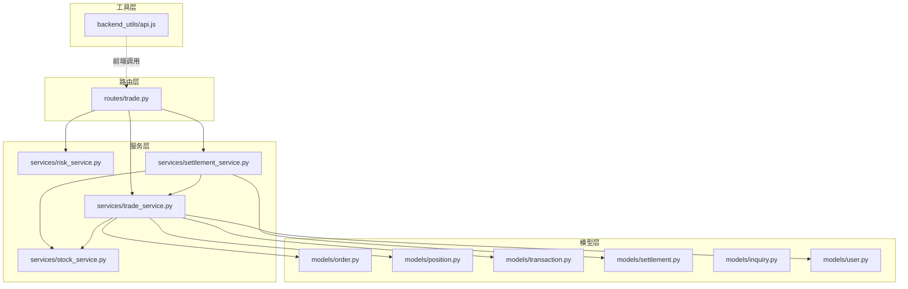
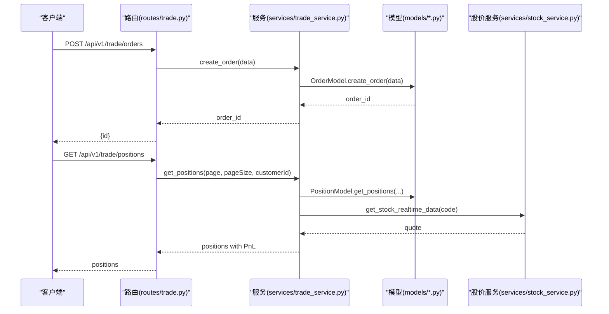
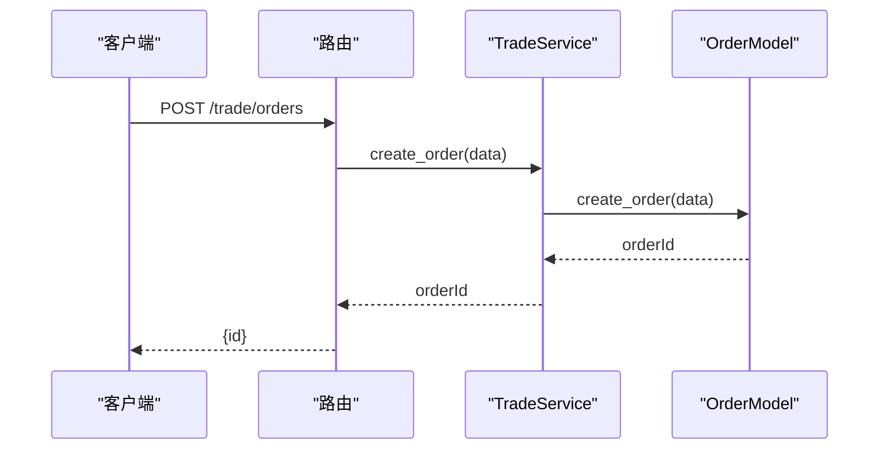
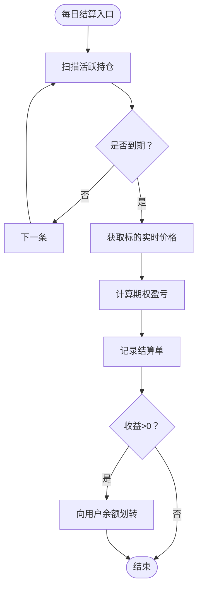
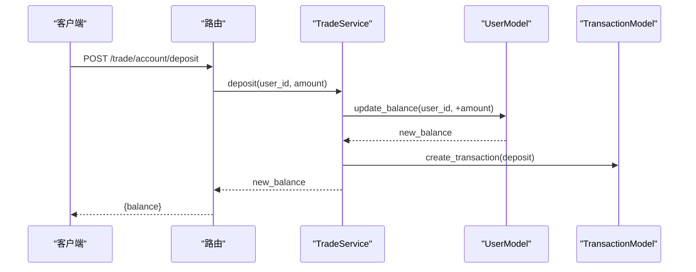
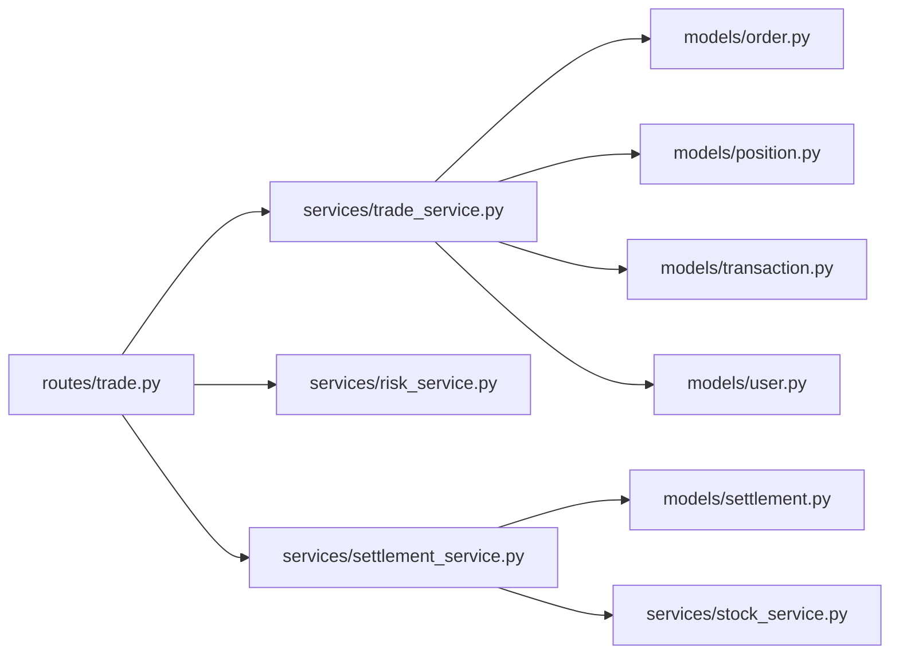

# 交易执行接口

<cite>
**本文引用的文件**   
- [routes/trade.py](file://routes/trade.py)
- [services/trade_service.py](file://services/trade_service.py)
- [models/order.py](file://models/order.py)
- [models/position.py](file://models/position.py)
- [models/transaction.py](file://models/transaction.py)
- [models/settlement.py](file://models/settlement.py)
- [services/risk_service.py](file://services/risk_service.py)
- [services/settlement_service.py](file://services/settlement_service.py)
- [services/stock_service.py](file://services/stock_service.py)
- [models/inquiry.py](file://models/inquiry.py)
- [models/user.py](file://models/user.py)
- [backend_utils/api.js](file://backend_utils/api.js)
</cite>

## 目录
1. [简介](#简介)
2. [项目结构](#项目结构)
3. [核心组件](#核心组件)
4. [架构总览](#架构总览)
5. [详细组件分析](#详细组件分析)
6. [依赖关系分析](#依赖关系分析)
7. [性能考量](#性能考量)
8. [故障排查指南](#故障排查指南)
9. [结论](#结论)
10. [附录](#附录)

## 简介
本文件面向交易执行接口，系统性梳理从订单创建、执行、查询到管理的完整流程，覆盖订单、持仓、资金流水与结算等模块。文档重点包括：
- 订单生命周期：创建、状态更新、历史查询
- 持仓管理：创建、查询、统计、平仓（到期结算）
- 风险控制：预交易风控校验、希腊字母计算
- 结算流程：每日到期结算、资金划转
- 资金管理：充值、提现、流水查询
- 异常处理与审计：统一响应封装、错误日志与重试策略

## 项目结构
交易执行相关代码主要分布在以下层次：
- 路由层：定义REST接口与鉴权/角色校验
- 服务层：编排业务逻辑、调用模型层与外部服务
- 模型层：封装数据库/云数据库访问、索引与字段规范
- 工具层：前端API工具类，提供缓存、重试、并发控制与拦截器

图表来源
- [routes/trade.py](file://routes/trade.py#L1-L330)
- [services/trade_service.py](file://services/trade_service.py#L1-L318)
- [models/order.py](file://models/order.py#L1-L119)
- [models/position.py](file://models/position.py#L1-L206)
- [models/transaction.py](file://models/transaction.py#L1-L61)
- [models/settlement.py](file://models/settlement.py#L1-L57)
- [services/risk_service.py](file://services/risk_service.py#L1-L60)
- [services/settlement_service.py](file://services/settlement_service.py#L1-L113)
- [services/stock_service.py](file://services/stock_service.py#L1-L289)
- [models/inquiry.py](file://models/inquiry.py#L1-L148)
- [models/user.py](file://models/user.py#L1-L309)
- [backend_utils/api.js](file://backend_utils/api.js#L1-L571)

章节来源
- [routes/trade.py](file://routes/trade.py#L1-L330)
- [services/trade_service.py](file://services/trade_service.py#L1-L318)

## 核心组件
- 订单模块：负责订单创建、查询与状态更新
- 持仓模块：负责持仓创建、查询、统计与生命周期管理
- 资金模块：负责账户余额、充值/提现与交易流水
- 结算模块：负责每日到期结算与资金划转
- 风控模块：负责预交易风控与希腊字母计算
- 股价服务：负责实时/历史股价数据获取
- 用户模型：负责用户信息与余额原子更新

章节来源
- [models/order.py](file://models/order.py#L1-L119)
- [models/position.py](file://models/position.py#L1-L206)
- [models/transaction.py](file://models/transaction.py#L1-L61)
- [models/settlement.py](file://models/settlement.py#L1-L57)
- [services/risk_service.py](file://services/risk_service.py#L1-L60)
- [services/settlement_service.py](file://services/settlement_service.py#L1-L113)
- [services/stock_service.py](file://services/stock_service.py#L1-L289)
- [models/user.py](file://models/user.py#L1-L309)

## 架构总览
交易执行接口采用“路由-服务-模型”三层架构，结合云数据库适配层，实现本地MongoDB与云数据库的统一访问。

图表来源
- [routes/trade.py](file://routes/trade.py#L188-L262)
- [services/trade_service.py](file://services/trade_service.py#L96-L164)
- [models/order.py](file://models/order.py#L28-L52)
- [models/position.py](file://models/position.py#L28-L63)
- [services/stock_service.py](file://services/stock_service.py#L24-L88)

## 详细组件分析

### 订单接口
- 接口定义
  - 创建订单：POST /api/v1/trade/orders
  - 查询订单：GET /api/v1/trade/orders
  - 更新订单状态：PUT /api/v1/trade/orders/{order_id}/status
- 关键行为
  - 订单创建：自动生成orderId，写入createdAt/updatedAt；支持云数据库与本地MongoDB
  - 订单查询：支持按状态与用户过滤，分页返回
  - 状态更新：仅更新status字段，保持updatedAt同步
- 数据模型要点
  - 字段：orderId、openid、createdAt、updatedAt、status等
  - 索引：orderId唯一索引、createdAt索引
- 示例
  - 下单请求体（字段示意）：{ openid, productCode, quantity, price, type, status }
  - 订单查询参数：page、pageSize、status、customerId
  - 状态更新请求体：{ status }

图表来源
- [routes/trade.py](file://routes/trade.py#L221-L242)
- [services/trade_service.py](file://services/trade_service.py#L98-L100)
- [models/order.py](file://models/order.py#L28-L52)

章节来源
- [routes/trade.py](file://routes/trade.py#L188-L262)
- [services/trade_service.py](file://services/trade_service.py#L96-L110)
- [models/order.py](file://models/order.py#L10-L53)

### 订单状态机与验证规则
- 状态机
  - 初始化：pending（待处理）
  - 变更：processing（处理中）、completed（已完成）、cancelled（已取消）、rejected（已拒绝）
- 验证规则
  - 必填字段：openid、productCode、quantity、price
  - 金额与数量：需为正数
  - 风控：预交易风控校验（余额充足）
- 价格计算逻辑
  - 市值：quantity × price
  - 盈亏：当前市值 - 成本（需结合实时行情动态计算）

章节来源
- [services/risk_service.py](file://services/risk_service.py#L52-L59)
- [services/trade_service.py](file://services/trade_service.py#L166-L178)

### 持仓管理接口
- 接口定义
  - 获取持仓列表：GET /api/v1/trade/positions
  - 创建持仓：POST /api/v1/trade/positions（管理员）
  - 更新/删除持仓：PUT/DELETE /api/v1/trade/positions/{position_id}（管理员）
  - 持仓统计：GET /api/v1/trade/positions/statistics
- 关键行为
  - 实时行情：按产品代码拉取最新价格，计算当前市值、浮动盈亏与收益率
  - 统计聚合：支持按客户聚合总市值、总盈亏与总数
- 数据模型要点
  - 字段：customerId、productCode、quantity、price、status、marketValue、profitLoss、returnRate等
  - 索引：customerId、productCode
- 平仓与到期结算
  - 到期日判断：若到期日小于等于当日则视为到期
  - 盈亏计算：按看涨/看跌期权公式计算
  - 资金划转：收益转入用户余额

图表来源
- [services/settlement_service.py](file://services/settlement_service.py#L21-L60)
- [services/stock_service.py](file://services/stock_service.py#L24-L88)
- [models/settlement.py](file://models/settlement.py#L18-L41)

章节来源
- [routes/trade.py](file://routes/trade.py#L67-L186)
- [services/trade_service.py](file://services/trade_service.py#L111-L205)
- [models/position.py](file://models/position.py#L10-L63)
- [services/settlement_service.py](file://services/settlement_service.py#L62-L113)

### 资金与流水接口
- 接口定义
  - 账户资产：GET /api/v1/trade/account
  - 充值：POST /api/v1/trade/account/deposit
  - 提现：POST /api/v1/trade/account/withdraw
  - 资金流水：GET /api/v1/trade/account/transactions
- 关键行为
  - 余额原子更新：先读取再写入，防止并发导致的负余额
  - 流水记录：deposit/withdraw/fee等类型
- 示例
  - 充值：POST { amount } → 返回新余额
  - 提现：POST { amount } → 校验余额充足后扣款并记录流水

图表来源
- [routes/trade.py](file://routes/trade.py#L265-L294)
- [services/trade_service.py](file://services/trade_service.py#L281-L294)
- [models/user.py](file://models/user.py#L291-L309)
- [models/transaction.py](file://models/transaction.py#L19-L39)

章节来源
- [routes/trade.py](file://routes/trade.py#L265-L330)
- [services/trade_service.py](file://services/trade_service.py#L240-L317)
- [models/user.py](file://models/user.py#L291-L309)
- [models/transaction.py](file://models/transaction.py#L1-L61)

### 风控与希腊字母
- 接口定义
  - 预交易风控：POST /api/v1/trade/risk/check
  - 希腊字母：POST /api/v1/trade/risk/greeks
- 关键行为
  - 预风控：校验余额是否充足
  - 希腊字母：基于Black-Scholes模型计算Delta/Gamma/Theta/Vega/Rho
- 示例
  - greeks请求体：{ S, K, T, r, sigma, type }

章节来源
- [routes/trade.py](file://routes/trade.py#L18-L52)
- [services/risk_service.py](file://services/risk_service.py#L11-L59)

### 前端API工具与异常处理
- 能力概览
  - 请求队列与并发控制、请求去重、缓存（GET）、指数退避重试
  - 统一拦截器、未授权处理、统计上报
- 适用场景
  - 交易界面高频查询、批量下单、风控计算等

章节来源
- [backend_utils/api.js](file://backend_utils/api.js#L1-L571)

## 依赖关系分析
- 路由依赖服务：trade_bp路由依赖TradeService、RiskService、SettlementService
- 服务依赖模型：TradeService按需注入OrderModel、PositionModel、TransactionModel、UserModel
- 结算依赖股价：SettlementService依赖StockService获取结算价
- 云/本地适配：各Model均支持云数据库与本地MongoDB双栈

图表来源
- [routes/trade.py](file://routes/trade.py#L1-L330)
- [services/trade_service.py](file://services/trade_service.py#L1-L318)
- [models/order.py](file://models/order.py#L1-L119)
- [models/position.py](file://models/position.py#L1-L206)
- [models/transaction.py](file://models/transaction.py#L1-L61)
- [models/user.py](file://models/user.py#L1-L309)
- [models/settlement.py](file://models/settlement.py#L1-L57)
- [services/stock_service.py](file://services/stock_service.py#L1-L289)
- [services/risk_service.py](file://services/risk_service.py#L1-L60)
- [services/settlement_service.py](file://services/settlement_service.py#L1-L113)

## 性能考量
- 分页与索引
  - 订单/持仓/流水查询使用createdAt倒序+limit/skip，建议对常用过滤字段建立复合索引
- 实时行情
  - 持仓列表动态计算市值与盈亏时，建议缓存股价或批量拉取以降低外部依赖压力
- 并发与原子性
  - 余额更新采用“读-改-写”，云数据库原子递增受限时需降级为读写分离策略
- 缓存与重试
  - GET请求默认缓存5分钟；网络波动与服务端错误支持指数退避重试

## 故障排查指南
- 常见错误与定位
  - 余额不足：风控校验失败，检查用户余额与订单金额
  - 数据为空：创建订单/持仓时必填字段缺失
  - 未授权：缺少Authorization或Token过期，触发未授权处理流程
  - 云数据库异常：Cloud DB请求失败或索引缺失，检查集合与权限
- 日志与监控
  - 服务端：统一使用logger记录错误堆栈
  - 前端：API工具统计请求次数、成功率、平均响应时间与重试次数

章节来源
- [services/trade_service.py](file://services/trade_service.py#L281-L317)
- [models/user.py](file://models/user.py#L291-L309)
- [backend_utils/api.js](file://backend_utils/api.js#L25-L571)

## 结论
本交易执行接口以清晰的三层架构实现订单、持仓、资金与结算的闭环管理，具备云/本地双栈适配能力与完善的风控与异常处理机制。建议后续在以下方面持续优化：
- 引入订单类型枚举与状态机图谱，提升可维护性
- 对高频查询引入Redis缓存与批量拉取策略
- 在云数据库场景下完善原子操作与事务一致性方案
- 补充交易回滚与审计日志的标准化流程

## 附录

### API一览与示例

- 订单
  - 创建订单：POST /api/v1/trade/orders
    - 请求体字段：openid、productCode、quantity、price、type、status
    - 响应：{ id }
  - 查询订单：GET /api/v1/trade/orders?page=&pageSize=&status=&customerId=
  - 更新状态：PUT /api/v1/trade/orders/{order_id}/status
    - 请求体：{ status }

- 持仓
  - 获取持仓：GET /api/v1/trade/positions?page=&pageSize=&customerId=
  - 创建/更新/删除（管理员）：POST/PUT/DELETE /api/v1/trade/positions/{position_id}
  - 持仓统计：GET /api/v1/trade/positions/statistics?customerId=

- 资金
  - 账户资产：GET /api/v1/trade/account
  - 充值：POST /api/v1/trade/account/deposit { amount }
  - 提现：POST /api/v1/trade/account/withdraw { amount }
  - 资金流水：GET /api/v1/trade/account/transactions?page=

- 风控
  - 预交易风控：POST /api/v1/trade/risk/check { amount }
  - 希腊字母：POST /api/v1/trade/risk/greeks { S,K,T,r,sigma,type }

- 结算
  - 触发每日结算：POST /api/v1/trade/settlement/daily（管理员）

章节来源
- [routes/trade.py](file://routes/trade.py#L18-L330)