# 持仓管理接口

<cite>
**本文档引用的文件**
- [routes/trade.py](file://routes/trade.py)
- [services/trade_service.py](file://services/trade_service.py)
- [models/position.py](file://models/position.py)
- [routes/auth.py](file://routes/auth.py)
- [backend_utils/response.py](file://backend_utils/response.py)
- [services/stock_service.py](file://services/stock_service.py)
- [services/risk_service.py](file://services/risk_service.py)
- [miniprogram/utils/accountService.js](file://miniprogram/utils/accountService.js)
- [miniprogram/pages/position/position.js](file://miniprogram/pages/position/position.js)
- [miniprogram/utils/enhanced-features.js](file://miniprogram/utils/enhanced-features.js)
</cite>

## 目录
1. [简介](#简介)
2. [项目结构](#项目结构)
3. [核心组件](#核心组件)
4. [架构概览](#架构概览)
5. [详细组件分析](#详细组件分析)
6. [依赖关系分析](#依赖关系分析)
7. [性能考虑](#性能考虑)
8. [故障排除指南](#故障排除指南)
9. [结论](#结论)

## 简介

本文档详细描述了场外期权项目中的持仓管理接口系统。该系统提供了完整的持仓生命周期管理功能，包括持仓查询、创建、更新、删除以及统计分析等核心功能。系统采用前后端分离架构，后端使用Flask框架提供RESTful API接口，前端使用小程序和Web界面提供用户交互。

## 项目结构

持仓管理系统的整体架构采用分层设计模式：

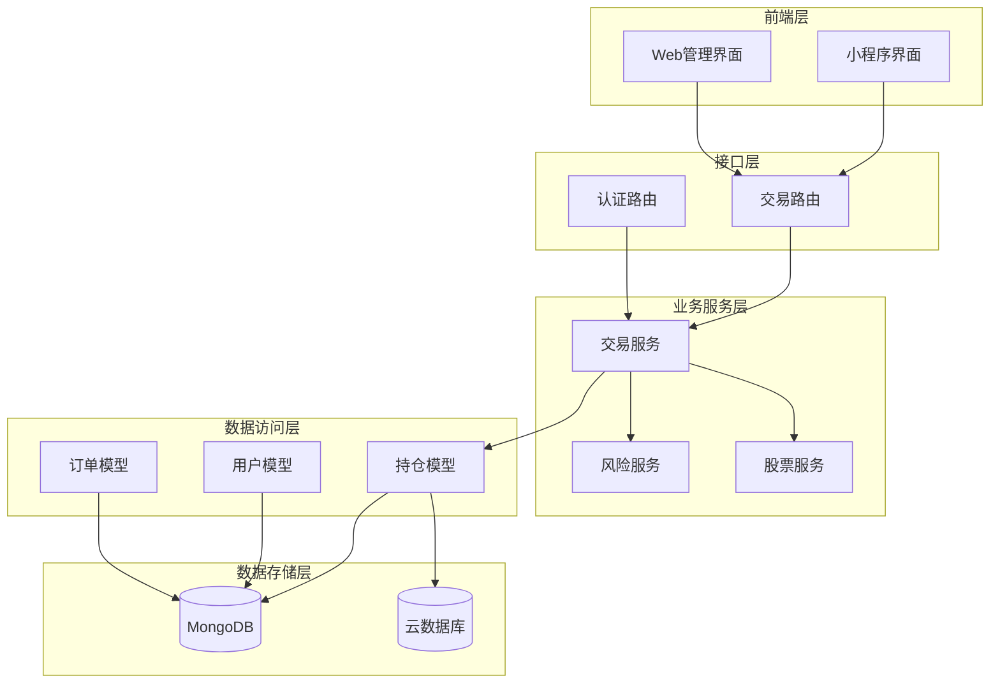

**图表来源**
- [routes/trade.py](file://routes/trade.py#L1-L330)
- [services/trade_service.py](file://services/trade_service.py#L1-L318)
- [models/position.py](file://models/position.py#L1-L206)

**章节来源**
- [routes/trade.py](file://routes/trade.py#L1-L330)
- [services/trade_service.py](file://services/trade_service.py#L1-L318)

## 核心组件

### 持仓数据模型

持仓系统的核心数据模型定义如下：

| 字段名称 | 类型 | 必填 | 描述 | 默认值 |
|---------|------|------|------|--------|
| id | ObjectId/String | 是 | 持仓唯一标识符 | 自动生成 |
| customerId | String | 是 | 客户ID | 业务主键 |
| customerName | String | 否 | 客户姓名 | 空字符串 |
| productCode | String | 是 | 产品代码 | 业务主键 |
| productName | String | 否 | 产品名称 | 空字符串 |
| quantity | Number | 是 | 持仓数量 | 0 |
| price | Number | 是 | 持仓价格 | 0 |
| marketValue | Number | 否 | 市值 | 0 |
| profitLoss | Number | 否 | 盈亏金额 | 0 |
| status | String | 否 | 持仓状态 | "active" |
| currency | String | 否 | 货币类型 | "CNY" |
| market | String | 否 | 交易市场 | "CN" |
| createdAt | DateTime | 否 | 创建时间 | 当前时间 |
| updatedAt | DateTime | 否 | 更新时间 | 当前时间 |

### 持仓状态分类

系统支持以下持仓状态：

- **active**: 活跃状态，正常交易的持仓
- **inactive**: 非活跃状态，暂停交易的持仓
- **closed**: 已平仓状态，已完成交易的持仓
- **expired**: 已到期状态，期权合约到期的持仓

### 用户角色权限

系统采用基于角色的访问控制（RBAC）机制：

- **user**: 普通用户，只能查看自己的持仓数据
- **admin**: 管理员，拥有完整的持仓管理权限
- **viewer**: 只读用户，仅能查看数据

**章节来源**
- [models/position.py](file://models/position.py#L1-L206)
- [routes/auth.py](file://routes/auth.py#L56-L72)

## 架构概览

持仓管理系统的整体架构采用经典的三层架构设计：

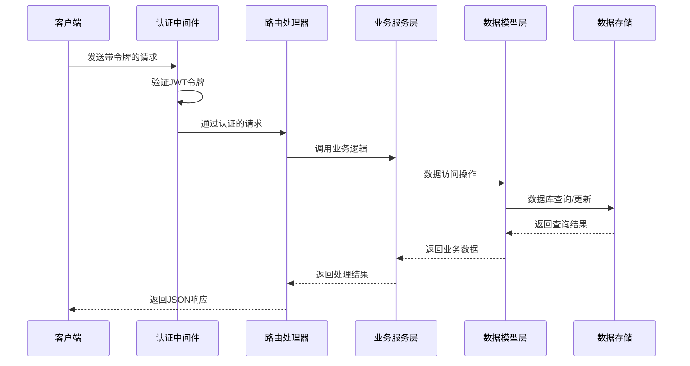

**图表来源**
- [routes/auth.py](file://routes/auth.py#L33-L54)
- [routes/trade.py](file://routes/trade.py#L67-L97)
- [services/trade_service.py](file://services/trade_service.py#L125-L164)

## 详细组件分析

### 持仓查询接口

#### 接口定义
- **URL**: `/trade/positions`
- **方法**: GET
- **认证**: 需要JWT令牌
- **权限**: user/admin

#### 请求参数

| 参数名 | 类型 | 必填 | 描述 | 示例 |
|--------|------|------|------|------|
| page | Integer | 否 | 页码，默认1 | 1 |
| pageSize | Integer | 否 | 每页大小，默认10 | 10 |
| customerId | String | 否 | 客户ID（管理员可用） | "user001" |

#### 响应格式

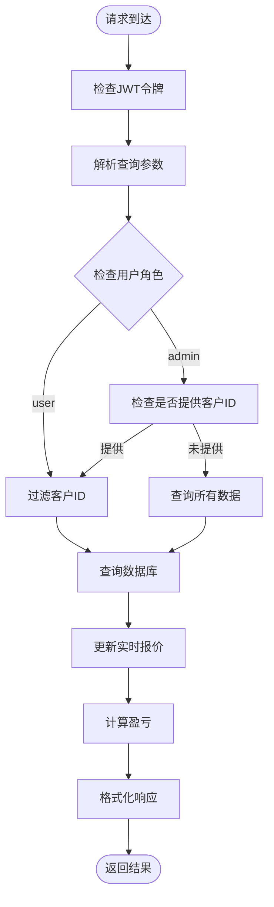

**图表来源**
- [routes/trade.py](file://routes/trade.py#L67-L97)
- [services/trade_service.py](file://services/trade_service.py#L125-L164)

#### 响应示例
```json
{
  "success": true,
  "message": "获取持仓列表成功",
  "code": 200,
  "data": {
    "items": [
      {
        "id": "654321",
        "customerId": "user001",
        "customerName": "张三",
        "productCode": "000001",
        "productName": "平安银行",
        "quantity": 1000,
        "price": 12.5,
        "marketValue": 12500.0,
        "profitLoss": 1250.0,
        "status": "active",
        "createdAt": "2024-01-01T10:00:00Z",
        "updatedAt": "2024-01-01T10:00:00Z"
      }
    ],
    "pagination": {
      "page": 1,
      "per_page": 10,
      "total": 1,
      "pages": 1
    }
  }
}
```

**章节来源**
- [routes/trade.py](file://routes/trade.py#L67-L97)
- [services/trade_service.py](file://services/trade_service.py#L125-L164)

### 持仓创建接口

#### 接口定义
- **URL**: `/trade/positions`
- **方法**: POST
- **认证**: 需要JWT令牌
- **权限**: admin

#### 请求体参数

| 参数名 | 类型 | 必填 | 描述 | 示例 |
|--------|------|------|------|------|
| customerId | String | 是 | 客户ID | "user001" |
| productCode | String | 是 | 产品代码 | "000001" |
| quantity | Number | 是 | 持仓数量 | 1000 |
| price | Number | 是 | 持仓价格 | 12.5 |
| customerName | String | 否 | 客户姓名 | "张三" |
| productName | String | 否 | 产品名称 | "平安银行" |

#### 数据验证规则

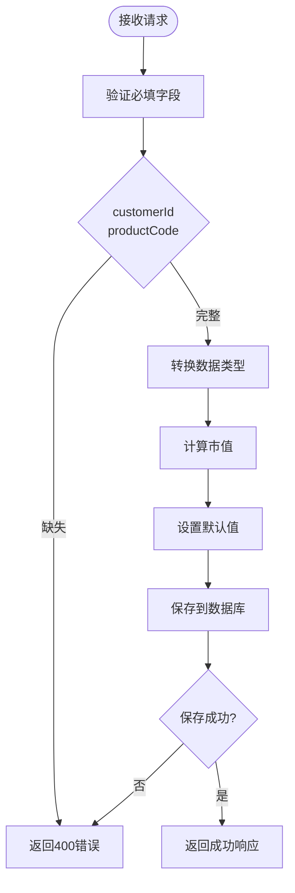

**图表来源**
- [routes/trade.py](file://routes/trade.py#L99-L118)
- [services/trade_service.py](file://services/trade_service.py#L166-L178)

#### 创建流程

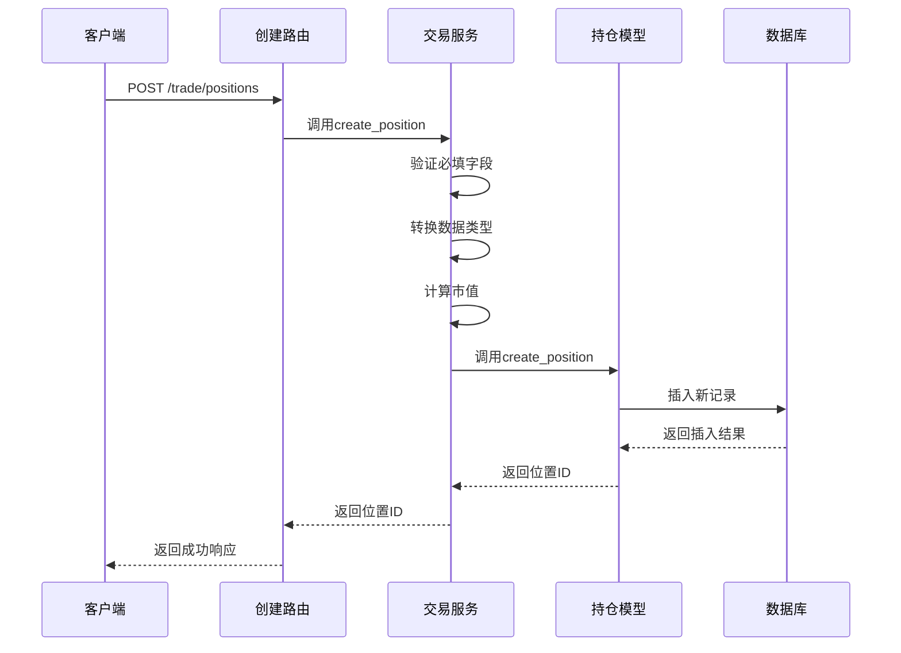

**图表来源**
- [routes/trade.py](file://routes/trade.py#L99-L118)
- [services/trade_service.py](file://services/trade_service.py#L166-L178)
- [models/position.py](file://models/position.py#L152-L170)

**章节来源**
- [routes/trade.py](file://routes/trade.py#L99-L118)
- [services/trade_service.py](file://services/trade_service.py#L166-L178)

### 持仓更新接口

#### 接口定义
- **URL**: `/trade/positions/{position_id}`
- **方法**: PUT
- **认证**: 需要JWT令牌
- **权限**: admin

#### 路径参数

| 参数名 | 类型 | 必填 | 描述 |
|--------|------|------|------|
| position_id | String | 是 | 持仓记录ID |

#### 更新字段

支持更新以下字段：
- quantity: 持仓数量
- price: 持仓价格
- status: 持仓状态
- customerName: 客户姓名
- productName: 产品名称

#### 更新流程

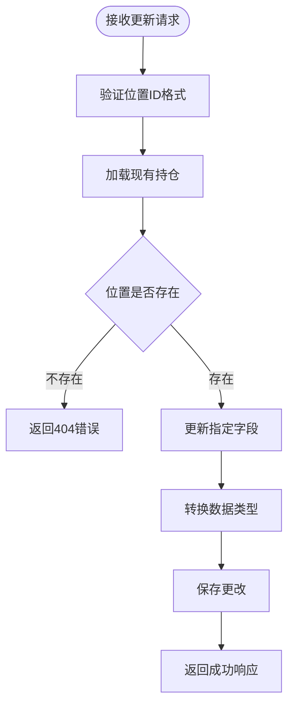

**图表来源**
- [routes/trade.py](file://routes/trade.py#L120-L134)
- [services/trade_service.py](file://services/trade_service.py#L180-L197)
- [models/position.py](file://models/position.py#L172-L191)

**章节来源**
- [routes/trade.py](file://routes/trade.py#L120-L134)
- [services/trade_service.py](file://services/trade_service.py#L180-L197)

### 持仓删除接口

#### 接口定义
- **URL**: `/trade/positions/{position_id}`
- **方法**: DELETE
- **认证**: 需要JWT令牌
- **权限**: admin

#### 删除流程

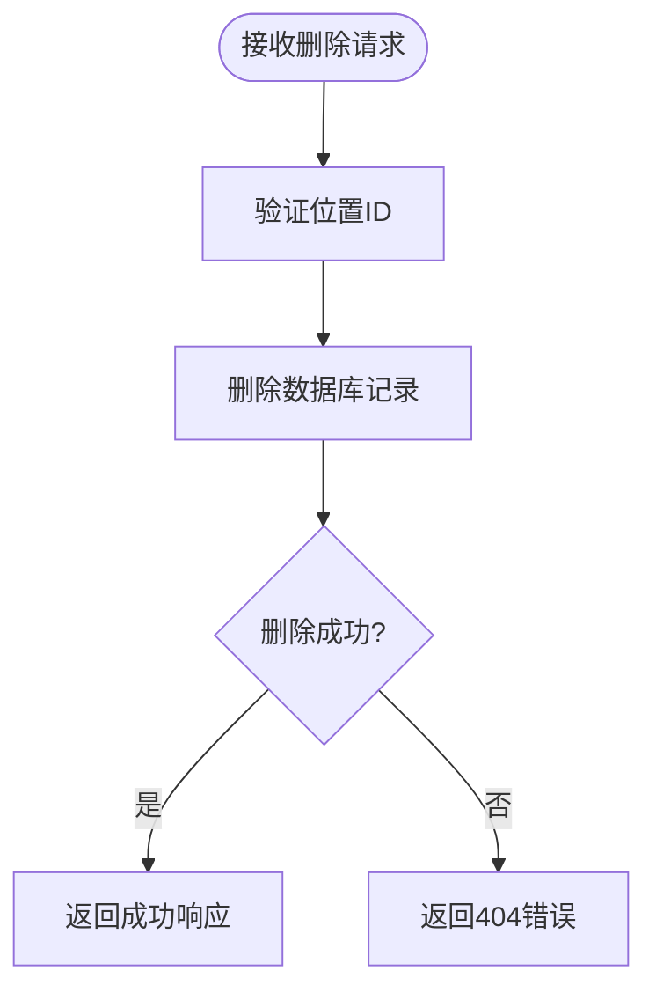

**图表来源**
- [routes/trade.py](file://routes/trade.py#L136-L149)
- [models/position.py](file://models/position.py#L193-L205)

**章节来源**
- [routes/trade.py](file://routes/trade.py#L136-L149)
- [models/position.py](file://models/position.py#L193-L205)

### 持仓统计接口

#### 接口定义
- **URL**: `/trade/positions/statistics`
- **方法**: GET
- **认证**: 需要JWT令牌

#### 统计指标

系统提供以下统计指标：

| 指标名称 | 描述 | 计算方式 |
|----------|------|----------|
| totalMarketValue | 总市值 | 所有活跃持仓市值之和 |
| totalProfitLoss | 总盈亏 | 所有活跃持仓盈亏之和 |
| totalCount | 持仓总数 | 活跃持仓数量 |

#### 统计实现

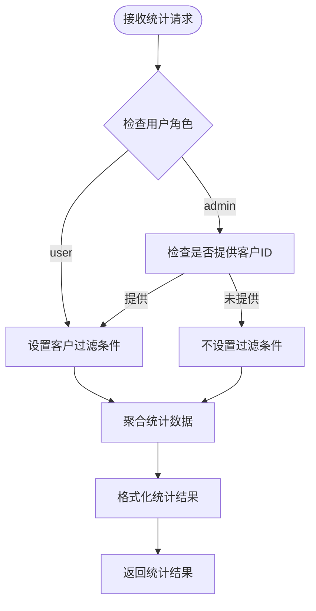

**图表来源**
- [routes/trade.py](file://routes/trade.py#L151-L170)
- [services/trade_service.py](file://services/trade_service.py#L203-L205)
- [models/position.py](file://models/position.py#L65-L118)

**章节来源**
- [routes/trade.py](file://routes/trade.py#L151-L170)
- [services/trade_service.py](file://services/trade_service.py#L203-L205)

### 持仓种子数据生成接口

#### 接口定义
- **URL**: `/trade/positions/seed`
- **方法**: POST
- **认证**: 需要JWT令牌

#### 种子数据生成逻辑

系统会生成3条测试持仓数据，涉及不同的ETF产品：

| 产品代码 | 产品名称 | 生成规则 |
|----------|----------|----------|
| 510050 | 上证50ETF | 数量: 1-10万手，价格: 2.0-5.0元 |
| 510300 | 沪深300ETF | 数量: 1-10万手，价格: 2.0-5.0元 |
| 000001 | 平安银行 | 数量: 1-10万手，价格: 2.0-5.0元 |

#### 生成流程

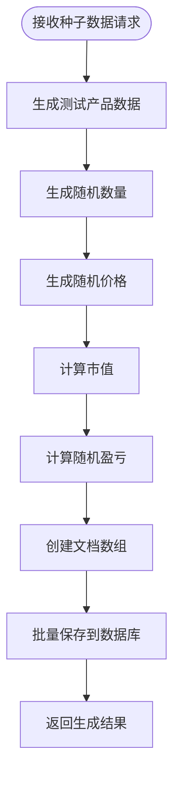

**图表来源**
- [routes/trade.py](file://routes/trade.py#L172-L186)
- [services/trade_service.py](file://services/trade_service.py#L207-L238)

**章节来源**
- [routes/trade.py](file://routes/trade.py#L172-L186)
- [services/trade_service.py](file://services/trade_service.py#L207-L238)

## 依赖关系分析

### 权限控制机制

系统采用多层权限控制确保安全性：

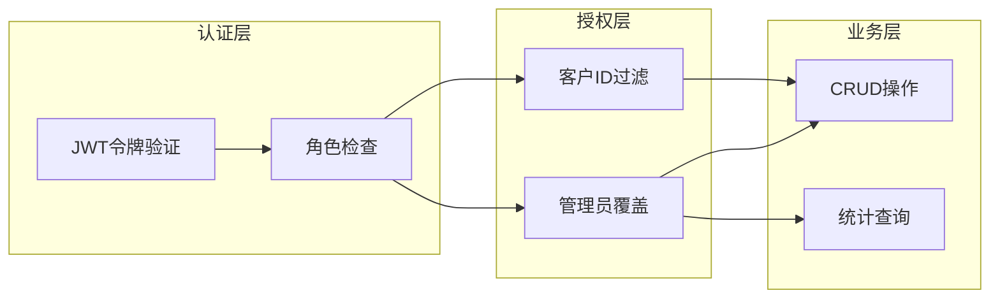

**图表来源**
- [routes/auth.py](file://routes/auth.py#L33-L72)
- [routes/trade.py](file://routes/trade.py#L72-L84)

### 数据流处理

持仓数据的完整处理流程：

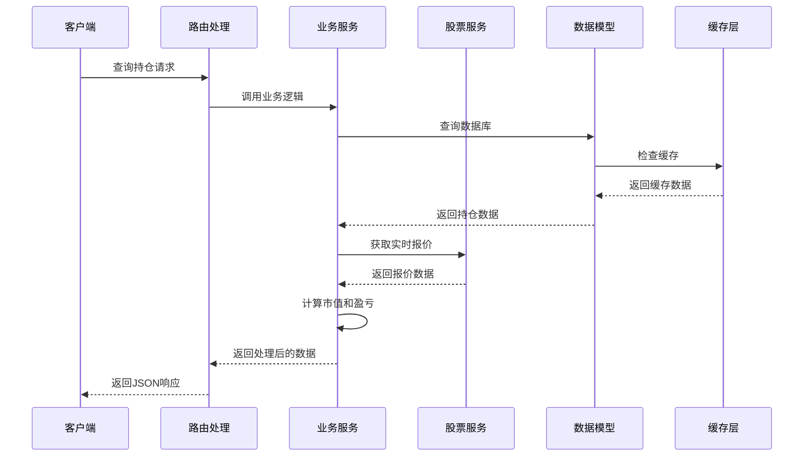

**图表来源**
- [services/trade_service.py](file://services/trade_service.py#L125-L164)
- [services/stock_service.py](file://services/stock_service.py#L24-L88)

**章节来源**
- [routes/auth.py](file://routes/auth.py#L33-L72)
- [services/trade_service.py](file://services/trade_service.py#L125-L164)

## 性能考虑

### 数据库优化

1. **索引策略**
   - 在`customerId`字段建立索引，支持快速客户数据过滤
   - 在`productCode`字段建立索引，支持产品查询
   - 在`createdAt`字段建立索引，支持时间排序查询

2. **查询优化**
   - 使用投影查询减少数据传输
   - 实现分页查询避免大数据集加载
   - 缓存热点数据减少数据库压力

### 缓存策略

系统采用多级缓存机制：

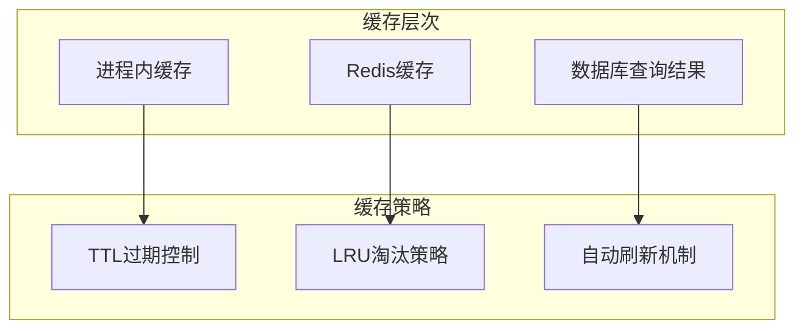

### 异步处理

对于耗时操作采用异步处理：

- 实时报价获取使用异步调用
- 大数据量统计使用后台任务
- 文件导出使用队列处理

## 故障排除指南

### 常见错误及解决方案

| 错误类型 | 错误码 | 描述 | 解决方案 |
|----------|--------|------|----------|
| 认证失败 | 401 | 未提供有效令牌 | 检查Authorization头部，重新登录获取令牌 |
| 权限不足 | 403 | 用户权限不够 | 确认用户角色，联系管理员提升权限 |
| 数据验证 | 400 | 请求数据格式错误 | 检查必填字段，确保数据类型正确 |
| 资源不存在 | 404 | 持仓记录不存在 | 确认位置ID正确，检查数据同步状态 |
| 服务器错误 | 500 | 服务器内部错误 | 查看服务器日志，检查数据库连接 |

### 日志记录

系统实现了完整的日志记录机制：

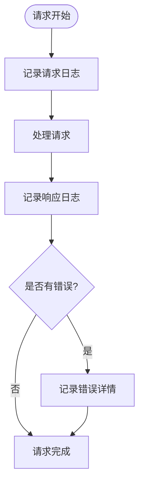

**章节来源**
- [routes/trade.py](file://routes/trade.py#L95-L97)
- [routes/trade.py](file://routes/trade.py#L114-L118)
- [routes/trade.py](file://routes/trade.py#L132-L134)

## 结论

持仓管理系统提供了完整的场外期权持仓管理功能，具有以下特点：

1. **安全性**: 采用JWT令牌认证和基于角色的权限控制
2. **完整性**: 支持完整的CRUD操作和统计分析功能
3. **扩展性**: 模块化设计便于功能扩展和维护
4. **性能**: 优化的数据库查询和缓存机制保证系统性能
5. **可靠性**: 完善的错误处理和日志记录机制

该系统为场外期权业务提供了坚实的技术基础，能够满足复杂的金融业务需求。