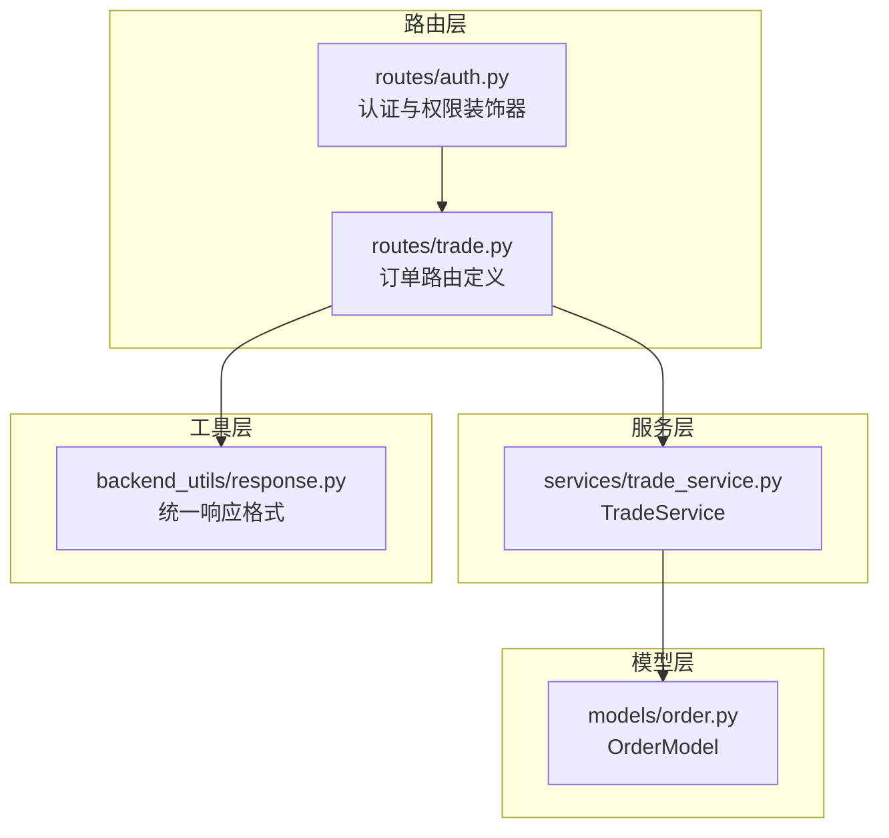
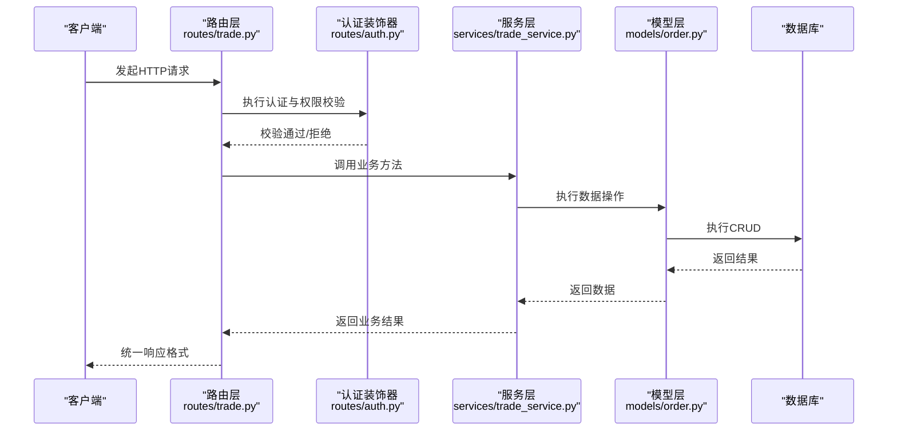
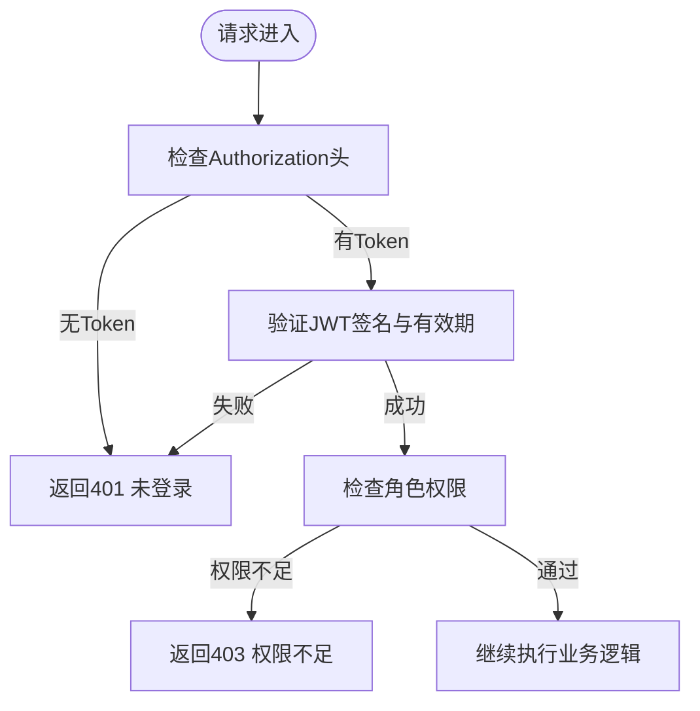
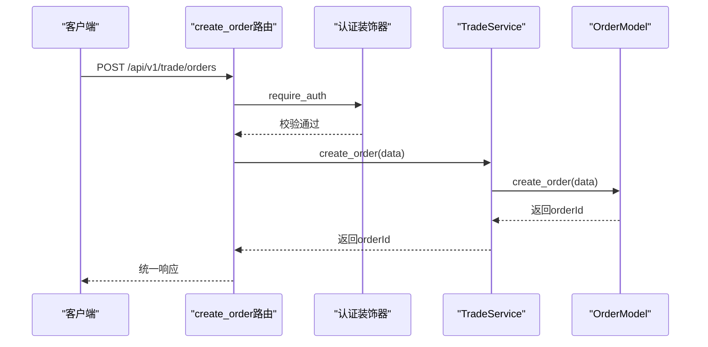
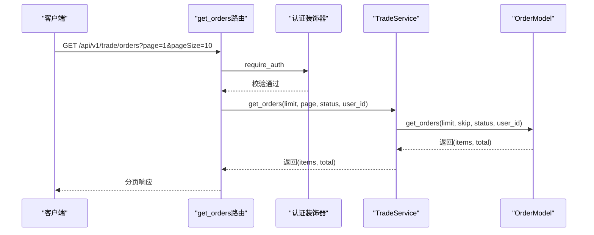
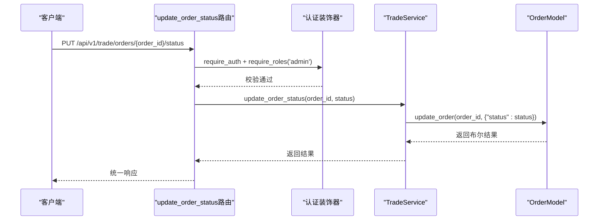
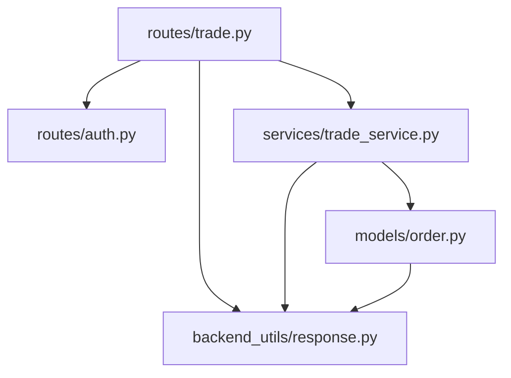

# 订单管理接口

<cite>
**本文档引用的文件**
- [routes/trade.py](file://routes/trade.py)
- [services/trade_service.py](file://services/trade_service.py)
- [models/order.py](file://models/order.py)
- [routes/auth.py](file://routes/auth.py)
- [backend_utils/response.py](file://backend_utils/response.py)
</cite>

## 目录
1. [简介](#简介)
2. [项目结构](#项目结构)
3. [核心组件](#核心组件)
4. [架构概览](#架构概览)
5. [详细组件分析](#详细组件分析)
6. [依赖关系分析](#依赖关系分析)
7. [性能考虑](#性能考虑)
8. [故障排除指南](#故障排除指南)
9. [结论](#结论)

## 简介
本文件为场外期权项目的订单管理接口详细API文档，覆盖订单从创建到状态更新的完整生命周期。文档重点说明以下接口：
- 下单接口：POST /api/v1/trade/orders
- 订单查询接口：GET /api/v1/trade/orders
- 订单状态更新接口：PUT /api/v1/trade/orders/{order_id}/status

同时，文档将详细阐述订单数据模型字段定义、订单状态枚举值、订单类型分类、验证规则、权限控制机制、分页查询与排序规则、状态流转以及异常处理等。

## 项目结构
订单管理相关代码采用典型的三层架构设计：
- 路由层(routes)：定义HTTP端点、参数解析与权限校验
- 服务层(services)：业务逻辑编排与跨模型协调
- 模型层(models)：数据持久化与查询封装

**图表来源**
- [routes/trade.py](file://routes/trade.py#L188-L262)
- [services/trade_service.py](file://services/trade_service.py#L24-L105)
- [models/order.py](file://models/order.py#L10-L24)
- [routes/auth.py](file://routes/auth.py#L33-L72)
- [backend_utils/response.py](file://backend_utils/response.py#L64-L117)

**章节来源**
- [routes/trade.py](file://routes/trade.py#L188-L262)
- [services/trade_service.py](file://services/trade_service.py#L24-L105)
- [models/order.py](file://models/order.py#L10-L24)
- [routes/auth.py](file://routes/auth.py#L33-L72)
- [backend_utils/response.py](file://backend_utils/response.py#L64-L117)

## 核心组件
- 订单路由层：负责HTTP端点定义、参数解析、权限校验与响应封装
- 订单服务层：负责业务编排，调用模型层进行数据持久化与查询
- 订单模型层：负责MongoDB集合orders的CRUD操作，支持本地MongoDB与云开发数据库
- 统一响应工具：提供标准的成功/错误/分页响应格式

**章节来源**
- [routes/trade.py](file://routes/trade.py#L188-L262)
- [services/trade_service.py](file://services/trade_service.py#L24-L105)
- [models/order.py](file://models/order.py#L10-L24)
- [backend_utils/response.py](file://backend_utils/response.py#L11-L61)

## 架构概览
订单管理接口遵循RESTful风格，采用装饰器进行认证与权限控制，通过服务层解耦业务逻辑与数据访问。

**图表来源**
- [routes/trade.py](file://routes/trade.py#L190-L261)
- [routes/auth.py](file://routes/auth.py#L33-L72)
- [services/trade_service.py](file://services/trade_service.py#L98-L109)
- [models/order.py](file://models/order.py#L28-L52)

## 详细组件分析

### 订单数据模型与字段定义
订单数据模型存储在MongoDB集合orders中，支持本地MongoDB与云开发数据库两种模式。核心字段包括：
- orderId：订单唯一标识符，若未提供则自动生成
- openid：下单用户标识
- createdAt/updatedAt：创建与更新时间戳
- status：订单状态（默认创建时未指定）
- 其他业务字段：如产品代码、数量、价格等（根据实际业务扩展）

查询与更新操作会自动处理时间戳字段，并在云数据库模式下进行ID转换。

**章节来源**
- [models/order.py](file://models/order.py#L10-L24)
- [models/order.py](file://models/order.py#L28-L52)
- [models/order.py](file://models/order.py#L54-L97)
- [models/order.py](file://models/order.py#L99-L118)

### 订单状态枚举值
- pending：待处理
- processing：处理中
- completed：已完成
- rejected：已拒绝

注：当前实现中状态字段为字符串类型，具体取值由业务方约定。建议在后续版本中引入枚举类型以增强类型安全。

**章节来源**
- [services/trade_service.py](file://services/trade_service.py#L80-L94)

### 订单类型分类
- 买入订单：用于购买期权产品
- 卖出订单：用于卖出期权产品

注：订单类型字段在当前实现中未强制约束，建议在后续版本中明确类型枚举。

**章节来源**
- [admin-web/买入.html](file://admin-web/买入.html#L367-L387)
- [admin-web/卖出.html](file://admin-web/卖出.html#L367-L387)

### 认证与权限控制
- 认证装饰器require_auth：要求Bearer Token，校验JWT签名与有效期
- 角色装饰器require_roles：支持admin角色的管理员操作
- 用户角色：
  - user：普通用户，仅能查询自己的订单
  - admin：管理员，可查询所有订单并进行状态更新

**图表来源**
- [routes/auth.py](file://routes/auth.py#L21-L72)

**章节来源**
- [routes/auth.py](file://routes/auth.py#L33-L72)

### 下单接口 (/api/v1/trade/orders POST)
- 功能：创建新订单
- 请求方式：POST
- 路径：/api/v1/trade/orders
- 认证：需要登录
- 角色：user/admin均可
- 请求体参数：
  - openid：用户标识（若未提供则使用当前用户）
  - 其他业务字段：产品代码、数量、价格等
- 响应：
  - 成功：返回订单ID
  - 失败：返回错误信息

**图表来源**
- [routes/trade.py](file://routes/trade.py#L221-L242)
- [services/trade_service.py](file://services/trade_service.py#L98-L100)
- [models/order.py](file://models/order.py#L28-L52)

**章节来源**
- [routes/trade.py](file://routes/trade.py#L221-L242)
- [services/trade_service.py](file://services/trade_service.py#L98-L100)
- [models/order.py](file://models/order.py#L28-L52)

### 订单查询接口 (/api/v1/trade/orders GET)
- 功能：分页查询订单列表
- 请求方式：GET
- 路径：/api/v1/trade/orders
- 认证：需要登录
- 角色：user/admin
- 查询参数：
  - page：页码，默认1
  - pageSize：每页大小，默认10
  - status：按状态过滤
  - customerId：按用户过滤（admin可用）
- 响应：分页结果，包含items与pagination信息

**图表来源**
- [routes/trade.py](file://routes/trade.py#L190-L219)
- [services/trade_service.py](file://services/trade_service.py#L102-L105)
- [models/order.py](file://models/order.py#L54-L97)

**章节来源**
- [routes/trade.py](file://routes/trade.py#L190-L219)
- [services/trade_service.py](file://services/trade_service.py#L102-L105)
- [models/order.py](file://models/order.py#L54-L97)

### 订单状态更新接口 (/api/v1/trade/orders/{order_id}/status PUT)
- 功能：更新订单状态
- 请求方式：PUT
- 路径：/api/v1/trade/orders/{order_id}/status
- 认证：需要登录
- 角色：admin
- 请求体参数：
  - status：新的订单状态
- 响应：成功/失败信息

**图表来源**
- [routes/trade.py](file://routes/trade.py#L244-L261)
- [services/trade_service.py](file://services/trade_service.py#L107-L109)
- [models/order.py](file://models/order.py#L99-L118)

**章节来源**
- [routes/trade.py](file://routes/trade.py#L244-L261)
- [services/trade_service.py](file://services/trade_service.py#L107-L109)
- [models/order.py](file://models/order.py#L99-L118)

### 订单验证规则与必填字段检查
- 必填字段：
  - openid：用户标识（若请求体未提供则使用当前用户）
  - 其他业务字段：根据具体业务需求定义
- 参数验证：
  - 订单查询：page/pageSize默认值与类型检查
  - 状态更新：status字段非空检查
- 数据格式验证：
  - 时间戳字段自动处理ISO格式
  - 云数据库模式下ID转换为字符串

**章节来源**
- [routes/trade.py](file://routes/trade.py#L226-L228)
- [routes/trade.py](file://routes/trade.py#L199-L201)
- [routes/trade.py](file://routes/trade.py#L249-L252)
- [models/order.py](file://models/order.py#L28-L52)
- [models/order.py](file://models/order.py#L93-L96)

### 订单权限控制机制
- 用户角色限制：
  - user：只能查询自己的订单，无法通过customerId参数过滤其他用户
  - admin：可查询所有订单，支持按customerId过滤
- 数据过滤逻辑：
  - 当前用户为user时，自动将target_user_id设置为当前用户openid
  - 当前用户为admin时，可选择性传入customerId进行过滤

**章节来源**
- [routes/trade.py](file://routes/trade.py#L203-L207)
- [routes/trade.py](file://routes/trade.py#L199-L207)

### 订单分页查询、排序规则与搜索条件
- 分页查询：
  - page：当前页码，默认1
  - pageSize：每页大小，默认10
  - skip：计算skip=(page-1)*pageSize
- 排序规则：
  - 默认按createdAt降序排列
- 搜索条件：
  - status：按状态精确匹配
  - openid：按用户标识精确匹配（云数据库模式下为openid字段）

**章节来源**
- [services/trade_service.py](file://services/trade_service.py#L102-L105)
- [models/order.py](file://models/order.py#L88-L96)

### 订单状态流转
当前实现支持通过状态更新接口直接设置订单状态。建议在后续版本中引入状态机，定义合法的状态转换路径，例如：
- pending → processing → completed/rejected
- pending → rejected（风控不通过）

**章节来源**
- [routes/trade.py](file://routes/trade.py#L244-L261)
- [services/trade_service.py](file://services/trade_service.py#L107-L109)

### 异常处理与错误码说明
- 认证相关：
  - 401 未登录或登录已过期
  - 401 无效的登录凭证
- 权限相关：
  - 403 权限不足
- 业务相关：
  - 400 数据为空/状态为空/金额必须大于0
  - 500 服务器内部错误
- 统一响应格式：
  - success：布尔值
  - message：操作消息
  - code：HTTP状态码
  - data：返回数据

**章节来源**
- [routes/auth.py](file://routes/auth.py#L37-L49)
- [routes/auth.py](file://routes/auth.py#L64-L67)
- [routes/trade.py](file://routes/trade.py#L227-L228)
- [routes/trade.py](file://routes/trade.py#L250-L252)
- [routes/trade.py](file://routes/trade.py#L288-L289)
- [backend_utils/response.py](file://backend_utils/response.py#L11-L32)

## 依赖关系分析
订单管理接口的依赖关系清晰，层次分明：

**图表来源**
- [routes/trade.py](file://routes/trade.py#L1-L16)
- [services/trade_service.py](file://services/trade_service.py#L1-L10)
- [models/order.py](file://models/order.py#L1-L8)

**章节来源**
- [routes/trade.py](file://routes/trade.py#L1-L16)
- [services/trade_service.py](file://services/trade_service.py#L1-L10)
- [models/order.py](file://models/order.py#L1-L8)

## 性能考虑
- 索引优化：订单模型已建立orderId与createdAt索引，建议根据查询场景增加复合索引
- 分页查询：合理设置pageSize，避免过大导致内存压力
- 云数据库：在云开发环境下，查询语法与本地MongoDB存在差异，需注意兼容性
- 日志记录：在生产环境中适当调整日志级别，避免影响性能

## 故障排除指南
- 认证失败：
  - 检查Authorization头格式是否为Bearer Token
  - 验证JWT签名与有效期
- 权限不足：
  - 确认用户角色是否为admin
  - 检查是否越权访问他人订单
- 数据库连接：
  - 确认MongoDB连接配置
  - 检查云开发数据库客户端初始化
- 参数错误：
  - 检查请求体JSON格式
  - 验证必需字段完整性

**章节来源**
- [routes/auth.py](file://routes/auth.py#L21-L54)
- [routes/trade.py](file://routes/trade.py#L226-L242)
- [models/order.py](file://models/order.py#L17-L23)

## 结论
本订单管理接口实现了完整的订单生命周期管理，具备清晰的认证授权机制、灵活的查询过滤能力与标准的响应格式。建议后续版本进一步完善：
- 引入订单状态机与类型枚举
- 增强输入验证与错误处理
- 优化数据库索引策略
- 添加审计日志与监控指标