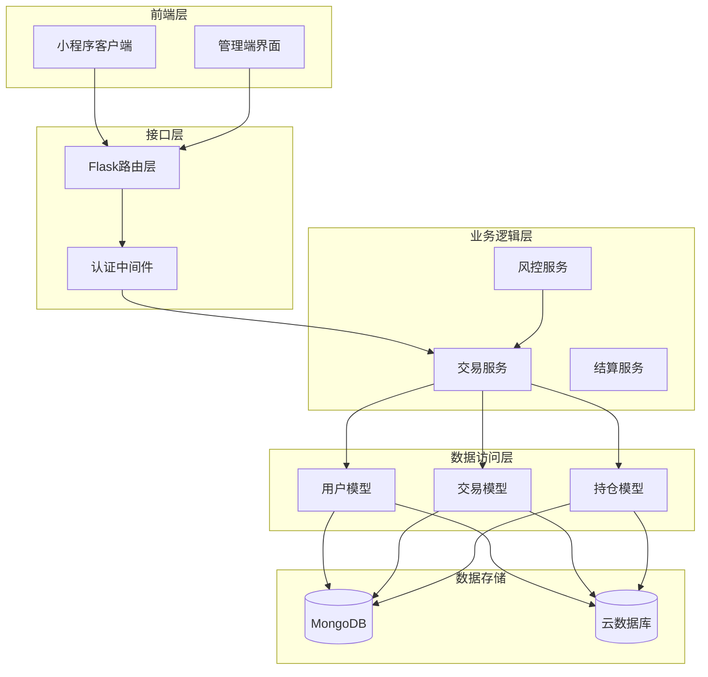
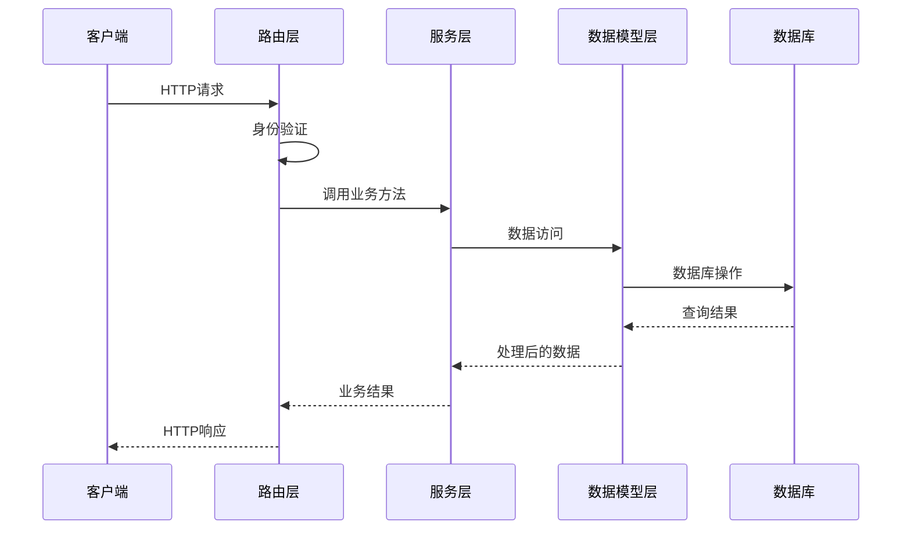
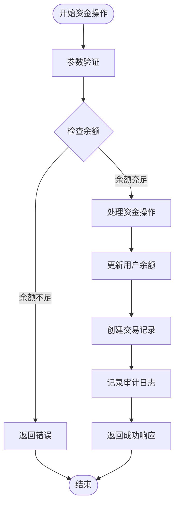
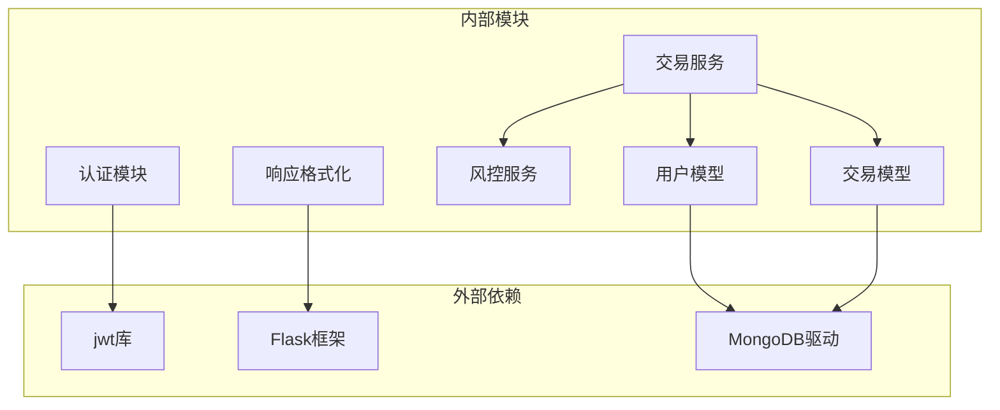

# 账户资金接口

<cite>
**本文档引用的文件**
- [routes/trade.py](file://routes/trade.py)
- [services/trade_service.py](file://services/trade_service.py)
- [models/user.py](file://models/user.py)
- [models/transaction.py](file://models/transaction.py)
- [services/risk_service.py](file://services/risk_service.py)
- [backend_utils/response.py](file://backend_utils/response.py)
- [tests/test_account.py](file://tests/test_account.py)
- [docs/archive/ACCOUNT_MODULE_REPORT.md](file://docs/archive/ACCOUNT_MODULE_REPORT.md)
- [miniprogram/pages/account/account.js](file://miniprogram/pages/account/account.js)
</cite>

## 目录
1. [简介](#简介)
2. [项目结构](#项目结构)
3. [核心组件](#核心组件)
4. [架构概览](#架构概览)
5. [详细组件分析](#详细组件分析)
6. [依赖关系分析](#依赖关系分析)
7. [性能考虑](#性能考虑)
8. [故障排除指南](#故障排除指南)
9. [结论](#结论)

## 简介

本文档详细描述了账户资金管理接口的完整API规范，包括账户信息查询、资金存取和交易流水查询等核心功能。该系统采用分层架构设计，通过Flask蓝图提供RESTful API接口，使用MongoDB作为数据存储，并实现了完整的用户认证和权限控制机制。

系统主要功能包括：
- 账户资产概览查询
- 资金充值操作
- 资金提现操作
- 资金流水查询
- 风险控制检查
- 安全验证和审计追踪

## 项目结构

账户资金管理模块在整体项目中的位置和组织方式如下：



**图表来源**
- [routes/trade.py](file://routes/trade.py#L1-L330)
- [services/trade_service.py](file://services/trade_service.py#L1-L318)
- [models/user.py](file://models/user.py#L1-L309)
- [models/transaction.py](file://models/transaction.py#L1-L61)

**章节来源**
- [routes/trade.py](file://routes/trade.py#L1-L330)
- [services/trade_service.py](file://services/trade_service.py#L1-L318)

## 核心组件

### 路由层 (Routes Layer)

路由层负责处理HTTP请求和响应，提供RESTful API接口。主要包含以下核心路由：

- `/api/v1/trade/account` - 账户信息查询
- `/api/v1/trade/account/deposit` - 资金充值
- `/api/v1/trade/account/withdraw` - 资金提现
- `/api/v1/trade/account/transactions` - 资金流水查询

每个路由都集成了认证中间件，确保只有经过身份验证的用户才能访问相关功能。

### 服务层 (Service Layer)

服务层包含业务逻辑处理，主要由TradeService类实现：

- `get_account_summary()` - 计算账户总资产
- `deposit()` - 处理资金充值
- `withdraw()` - 处理资金提现
- `get_transactions()` - 查询资金流水

### 数据模型层 (Data Model Layer)

数据模型层负责数据持久化和查询操作：

- `UserModel` - 用户信息和余额管理
- `TransactionModel` - 交易流水记录
- 支持本地MongoDB和云数据库两种存储模式

**章节来源**
- [routes/trade.py](file://routes/trade.py#L265-L330)
- [services/trade_service.py](file://services/trade_service.py#L256-L318)
- [models/user.py](file://models/user.py#L291-L309)
- [models/transaction.py](file://models/transaction.py#L19-L61)

## 架构概览

系统采用经典的三层架构设计，确保关注点分离和代码的可维护性：



**图表来源**
- [routes/trade.py](file://routes/trade.py#L265-L330)
- [services/trade_service.py](file://services/trade_service.py#L256-L318)
- [models/user.py](file://models/user.py#L291-L309)

### 数据流分析

系统的核心数据流包括资金操作的完整生命周期：



**图表来源**
- [services/trade_service.py](file://services/trade_service.py#L281-L310)
- [models/user.py](file://models/user.py#L291-L309)
- [models/transaction.py](file://models/transaction.py#L19-L40)

## 详细组件分析

### 账户信息查询接口

#### 接口定义
- **路径**: `/api/v1/trade/account`
- **方法**: GET
- **认证**: Bearer Token
- **功能**: 获取用户账户的总资产、可用余额、持仓市值和总盈亏

#### 请求参数
- 无查询参数
- 通过认证头部传递用户身份信息

#### 响应格式
```json
{
  "success": true,
  "message": "操作成功",
  "code": 200,
  "data": {
    "balance": 10000.0,
    "total_asset": 15000.0,
    "position_value": 5000.0,
    "total_profit": 200.0,
    "margin_used": 0
  }
}
```

#### 余额计算逻辑
账户总资产计算公式：
```
总资产 = 可用余额 + 持仓市值
总盈亏 = 所有持仓的累计盈亏
```

系统会动态获取最新的市场行情来计算持仓市值，确保数据的实时性。

**章节来源**
- [routes/trade.py](file://routes/trade.py#L265-L277)
- [services/trade_service.py](file://services/trade_service.py#L256-L279)
- [docs/archive/ACCOUNT_MODULE_REPORT.md](file://docs/archive/ACCOUNT_MODULE_REPORT.md#L43-L57)

### 资金充值接口

#### 接口定义
- **路径**: `/api/v1/trade/account/deposit`
- **方法**: POST
- **认证**: Bearer Token
- **功能**: 为用户账户进行资金充值

#### 请求参数
```json
{
  "amount": 10000.0
}
```

#### 响应格式
```json
{
  "success": true,
  "message": "充值成功",
  "code": 200,
  "data": {
    "balance": 10000.0
  }
}
```

#### 处理流程
1. 验证请求参数的有效性
2. 调用用户模型更新余额
3. 创建交易流水记录
4. 返回更新后的余额

#### 安全控制
- 参数必须大于0
- 使用原子操作确保数据一致性
- 记录完整的审计信息

**章节来源**
- [routes/trade.py](file://routes/trade.py#L278-L295)
- [services/trade_service.py](file://services/trade_service.py#L281-L294)
- [models/user.py](file://models/user.py#L291-L309)

### 资金提现接口

#### 接口定义
- **路径**: `/api/v1/trade/account/withdraw`
- **方法**: POST
- **认证**: Bearer Token
- **功能**: 从用户账户提取资金

#### 请求参数
```json
{
  "amount": 5000.0
}
```

#### 响应格式
```json
{
  "success": true,
  "message": "提现成功",
  "code": 200,
  "data": {
    "balance": 5000.0
  }
}
```

#### 处理流程
1. 验证请求参数的有效性
2. 检查用户余额是否充足
3. 调用用户模型扣减余额
4. 创建交易流水记录
5. 返回更新后的余额

#### 风险控制
- 自动检查余额充足性
- 异常情况返回详细的错误信息
- 支持事务回滚机制

**章节来源**
- [routes/trade.py](file://routes/trade.py#L296-L316)
- [services/trade_service.py](file://services/trade_service.py#L296-L310)
- [services/risk_service.py](file://services/risk_service.py#L52-L59)

### 资金流水查询接口

#### 接口定义
- **路径**: `/api/v1/trade/account/transactions`
- **方法**: GET
- **认证**: Bearer Token
- **功能**: 分页查询用户的资金流水记录

#### 查询参数
- `page` (可选): 页码，默认为1
- `pageSize` (可选): 每页大小，默认为20

#### 响应格式
```json
{
  "success": true,
  "message": "获取成功",
  "code": 200,
  "data": {
    "items": [
      {
        "type": "deposit",
        "amount": 1000,
        "balance_after": 1000,
        "created_at": "2024-01-01T12:00:00Z"
      }
    ],
    "pagination": {
      "page": 1,
      "per_page": 20,
      "total": 1,
      "pages": 1
    }
  }
}
```

#### 查询逻辑
- 支持分页查询
- 按时间倒序排列
- 统计总记录数用于分页计算

**章节来源**
- [routes/trade.py](file://routes/trade.py#L317-L330)
- [services/trade_service.py](file://services/trade_service.py#L312-L317)
- [models/transaction.py](file://models/transaction.py#L41-L61)

### 交易流水记录格式

资金流水记录包含以下字段：

| 字段名 | 类型 | 描述 | 示例 |
|--------|------|------|------|
| user_id | String | 用户标识 | "user_openid_123" |
| type | String | 交易类型 | "deposit", "withdraw" |
| amount | Float | 金额（正数为收入，负数为支出） | 1000.0, -500.0 |
| balance_after | Float | 交易后余额快照 | 15000.0 |
| remark | String | 备注信息 | "充值", "提现" |
| created_at | DateTime | 创建时间 | "2024-01-01T12:00:00Z" |

**章节来源**
- [models/transaction.py](file://models/transaction.py#L19-L31)
- [docs/archive/ACCOUNT_MODULE_REPORT.md](file://docs/archive/ACCOUNT_MODULE_REPORT.md#L59-L78)

## 依赖关系分析

系统各组件之间的依赖关系如下：



**图表来源**
- [routes/auth.py](file://routes/auth.py#L41-L54)
- [backend_utils/response.py](file://backend_utils/response.py#L64-L94)
- [services/trade_service.py](file://services/trade_service.py#L1-L35)

### 关键依赖链

1. **认证依赖链**: 路由层 → 认证中间件 → 业务服务
2. **数据访问依赖链**: 业务服务 → 数据模型 → 数据库
3. **响应处理依赖链**: 业务服务 → 响应格式化 → HTTP响应

**章节来源**
- [routes/trade.py](file://routes/trade.py#L6-L16)
- [services/trade_service.py](file://services/trade_service.py#L242-L254)

## 性能考虑

### 数据库优化
- 为用户ID建立索引以加速查询
- 交易流水按时间字段建立复合索引
- 实现分页查询避免大数据量扫描

### 缓存策略
- 用户资产信息可考虑短期缓存
- 热点数据如最近交易记录可缓存
- 缓存失效策略确保数据一致性

### 并发控制
- 使用原子操作更新用户余额
- 交易流水记录的事务性保证
- 防止重复提交的幂等性设计

## 故障排除指南

### 常见错误及解决方案

#### 认证失败
**症状**: 返回401未授权错误
**原因**: Token过期或无效
**解决**: 重新登录获取新的Token

#### 余额不足
**症状**: 提现操作返回余额不足错误
**原因**: 用户可用余额小于申请提现金额
**解决**: 检查账户余额后再提交提现申请

#### 参数验证错误
**症状**: 返回400参数错误
**原因**: 请求参数格式不正确或缺失
**解决**: 检查请求格式，确保amount参数为正数

#### 数据库连接错误
**症状**: 操作失败但无明确错误信息
**原因**: 数据库连接异常
**解决**: 检查数据库服务状态和网络连接

**章节来源**
- [routes/trade.py](file://routes/trade.py#L288-L315)
- [services/trade_service.py](file://services/trade_service.py#L296-L301)

### 日志和监控

系统提供了完善的日志记录机制：
- 所有API调用都有详细的访问日志
- 业务操作包含审计追踪信息
- 错误发生时记录完整的堆栈信息

**章节来源**
- [services/trade_service.py](file://services/trade_service.py#L1-L7)

## 结论

账户资金管理接口提供了完整、安全、可靠的金融交易功能。系统采用分层架构设计，确保了代码的可维护性和扩展性。通过严格的认证授权、数据验证和安全控制，系统能够满足金融应用的高要求。

主要特点包括：
- 完整的API覆盖所有核心资金管理功能
- 强大的安全控制和权限管理
- 实时的资产计算和数据同步
- 详细的审计追踪和异常处理
- 良好的性能优化和扩展性设计

未来可以进一步增强的功能包括：
- 支付网关集成
- 更精细的风险控制规则
- 资金冻结和解冻机制
- 更丰富的报表和分析功能