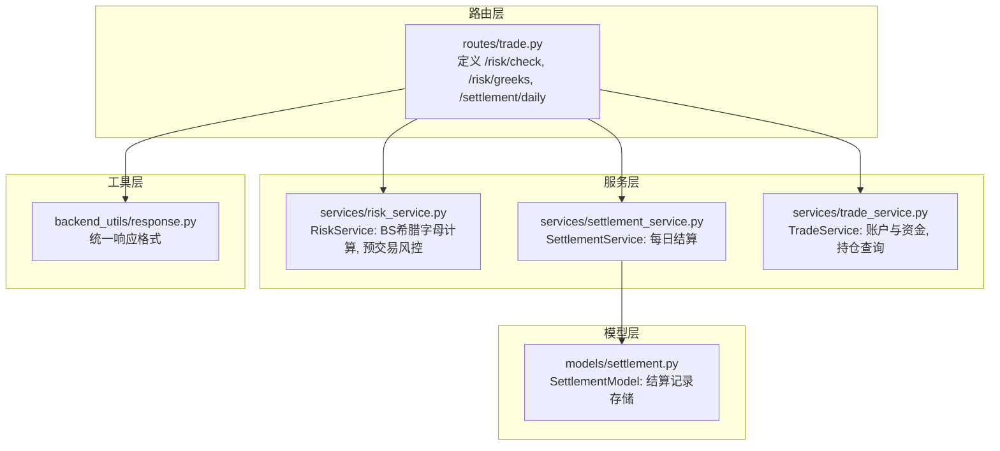
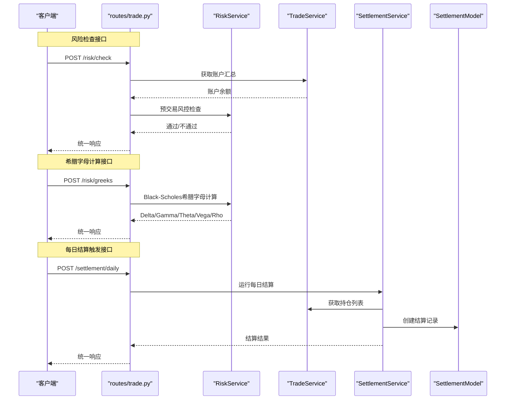
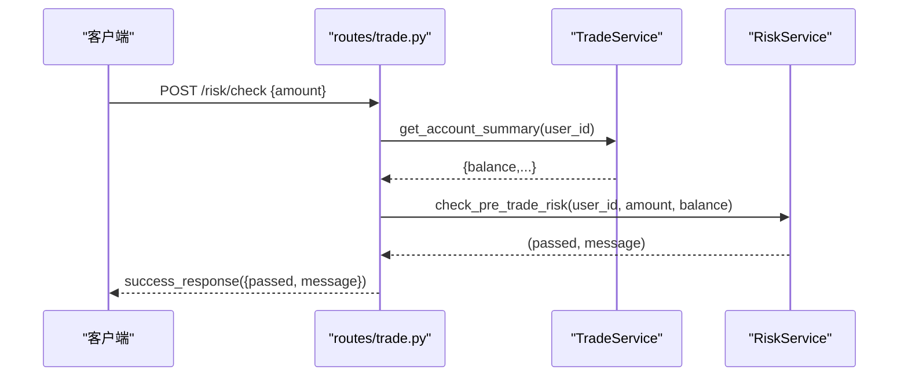
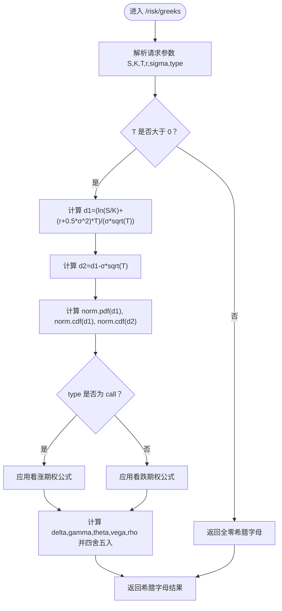
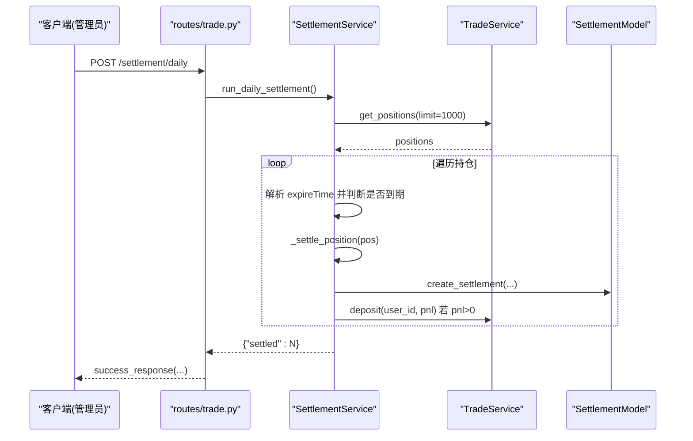
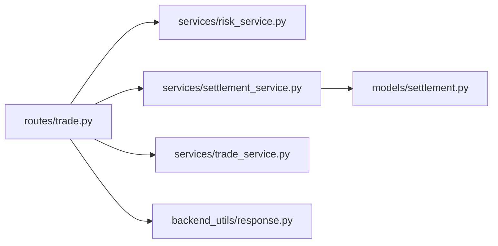

# 风控控制接口

<cite>
**本文引用的文件**
- [routes/trade.py](file://routes/trade.py)
- [services/risk_service.py](file://services/risk_service.py)
- [services/settlement_service.py](file://services/settlement_service.py)
- [models/settlement.py](file://models/settlement.py)
- [services/trade_service.py](file://services/trade_service.py)
- [backend_utils/response.py](file://backend_utils/response.py)
</cite>

## 目录
1. [简介](#简介)
2. [项目结构](#项目结构)
3. [核心组件](#核心组件)
4. [架构概览](#架构概览)
5. [详细组件分析](#详细组件分析)
6. [依赖关系分析](#依赖关系分析)
7. [性能考虑](#性能考虑)
8. [故障排除指南](#故障排除指南)
9. [结论](#结论)

## 简介
本文件面向风控控制管理接口，提供以下三类核心能力的完整API文档：
- 风险检查接口：用于预交易风险评估，校验用户余额与风险限额
- 希腊字母计算接口：基于Black-Scholes模型计算期权风险指标（Delta/Gamma/Theta/Vega/Rho）
- 每日结算触发接口：按到期日自动结算已过期期权并进行资金划转

文档同时覆盖风险控制策略、限额管理机制、异常交易拦截、风险监控指标、风险预警阈值、风险报告生成、风险数据验证、计算精度控制以及风险调整后的收益评估等主题。

## 项目结构
后端采用Flask蓝图组织交易与风控相关路由，服务层封装业务逻辑，模型层负责数据持久化，统一响应工具提供标准化返回格式。

**图表来源**
- [routes/trade.py](file://routes/trade.py#L1-L64)
- [services/risk_service.py](file://services/risk_service.py#L1-L60)
- [services/settlement_service.py](file://services/settlement_service.py#L1-L113)
- [models/settlement.py](file://models/settlement.py#L1-L57)
- [backend_utils/response.py](file://backend_utils/response.py#L1-L118)

**章节来源**
- [routes/trade.py](file://routes/trade.py#L1-L64)
- [services/risk_service.py](file://services/risk_service.py#L1-L60)
- [services/settlement_service.py](file://services/settlement_service.py#L1-L113)
- [models/settlement.py](file://models/settlement.py#L1-L57)
- [backend_utils/response.py](file://backend_utils/response.py#L1-L118)

## 核心组件
- RiskService：实现Black-Scholes希腊字母计算与预交易风控检查
- SettlementService：实现每日结算流程，处理过期期权的结算与资金划转
- TradeService：提供账户资产汇总、资金存取、交易流水查询等基础能力
- SettlementModel：封装结算记录的增删查改与云数据库适配
- 统一响应工具：标准化API返回格式

**章节来源**
- [services/risk_service.py](file://services/risk_service.py#L1-L60)
- [services/settlement_service.py](file://services/settlement_service.py#L1-L113)
- [services/trade_service.py](file://services/trade_service.py#L256-L318)
- [models/settlement.py](file://models/settlement.py#L1-L57)
- [backend_utils/response.py](file://backend_utils/response.py#L1-L118)

## 架构概览
下图展示风控相关接口的调用链路与职责分工：

**图表来源**
- [routes/trade.py](file://routes/trade.py#L19-L63)
- [services/risk_service.py](file://services/risk_service.py#L11-L60)
- [services/trade_service.py](file://services/trade_service.py#L256-L318)
- [services/settlement_service.py](file://services/settlement_service.py#L21-L113)
- [models/settlement.py](file://models/settlement.py#L18-L57)

## 详细组件分析

### 风险检查接口 /risk/check (POST)
- 接口用途：在下单前对用户余额与风险限额进行预校验，防止异常交易发生
- 请求参数
  - amount：下单金额
- 响应字段
  - passed：布尔值，是否通过风控检查
  - message：字符串，检查结果说明
- 调用流程
  - 从请求体解析金额
  - 通过g上下文获取当前用户标识
  - 调用交易服务获取账户汇总，提取可用余额
  - 调用风控服务执行预交易检查
  - 返回统一响应

**图表来源**
- [routes/trade.py](file://routes/trade.py#L19-L34)
- [services/trade_service.py](file://services/trade_service.py#L256-L279)
- [services/risk_service.py](file://services/risk_service.py#L52-L60)

**章节来源**
- [routes/trade.py](file://routes/trade.py#L19-L34)
- [services/trade_service.py](file://services/trade_service.py#L256-L279)
- [services/risk_service.py](file://services/risk_service.py#L52-L60)
- [backend_utils/response.py](file://backend_utils/response.py#L64-L93)

### 希腊字母计算接口 /risk/greeks (POST)
- 接口用途：基于Black-Scholes模型计算期权的Delta、Gamma、Theta、Vega、Rho五个希腊字母
- 请求参数
  - S：标的资产价格
  - K：行权价格
  - T：到期时间（年）
  - r：无风险利率（默认0.03）
  - sigma：波动率（默认0.2）
  - type：期权类型（默认call）
- 响应字段
  - delta、gamma、theta、vega、rho：对应希腊字母值（保留指定小数位）
- 计算逻辑要点
  - 当T<=0时，返回全零
  - 使用标准正态密度函数与累积分布函数
  - 对看涨/看跌期权分别计算不同公式
  - 计算精度：各希腊字母按固定位数四舍五入

**图表来源**
- [routes/trade.py](file://routes/trade.py#L36-L52)
- [services/risk_service.py](file://services/risk_service.py#L11-L50)

**章节来源**
- [routes/trade.py](file://routes/trade.py#L36-L52)
- [services/risk_service.py](file://services/risk_service.py#L11-L50)

### 每日结算触发接口 /settlement/daily (POST)
- 接口用途：管理员触发每日结算，自动处理已过期期权并进行资金划转
- 角色要求：需要管理员权限
- 处理流程
  - 获取所有活动持仓（限制数量以支持MVP）
  - 遍历持仓，解析到期日
  - 到期日小于等于当日则执行结算
  - 获取实时价格，计算损益
  - 写入结算记录，向用户入账（若损益为正）
  - 更新持仓状态（注释说明：实际可通过服务或模型扩展）

**图表来源**
- [routes/trade.py](file://routes/trade.py#L55-L63)
- [services/settlement_service.py](file://services/settlement_service.py#L21-L113)
- [models/settlement.py](file://models/settlement.py#L18-L41)
- [services/trade_service.py](file://services/trade_service.py#L281-L310)

**章节来源**
- [routes/trade.py](file://routes/trade.py#L55-L63)
- [services/settlement_service.py](file://services/settlement_service.py#L21-L113)
- [models/settlement.py](file://models/settlement.py#L18-L41)
- [services/trade_service.py](file://services/trade_service.py#L281-L310)

## 依赖关系分析
- 路由层依赖服务层与统一响应工具
- 风控服务依赖数学与统计库进行BS模型计算
- 结算服务依赖交易服务获取持仓与资金存取，依赖模型层写入结算记录
- 模型层兼容本地MongoDB与云数据库客户端

**图表来源**
- [routes/trade.py](file://routes/trade.py#L1-L16)
- [services/risk_service.py](file://services/risk_service.py#L1-L10)
- [services/settlement_service.py](file://services/settlement_service.py#L1-L14)
- [models/settlement.py](file://models/settlement.py#L1-L14)
- [backend_utils/response.py](file://backend_utils/response.py#L1-L10)

**章节来源**
- [routes/trade.py](file://routes/trade.py#L1-L16)
- [services/risk_service.py](file://services/risk_service.py#L1-L10)
- [services/settlement_service.py](file://services/settlement_service.py#L1-L14)
- [models/settlement.py](file://models/settlement.py#L1-L14)
- [backend_utils/response.py](file://backend_utils/response.py#L1-L10)

## 性能考虑
- 分页与批量限制：每日结算默认仅扫描限定数量的持仓，避免大规模遍历导致延迟
- 实时行情更新：持仓列表在查询时尝试注入实时价格，但失败时需降级处理
- 计算复杂度：BS希腊字母计算为常数时间复杂度，受T>0边界条件影响较小
- 数据库访问：模型层对云数据库与本地数据库做了适配，注意云数据库查询限制

[本节为通用指导，无需列出具体文件来源]

## 故障排除指南
- 风险检查失败
  - 可能原因：余额不足或风控规则未满足
  - 处理建议：确认账户余额与限额设置，检查风控服务逻辑扩展点
- 希腊字母计算异常
  - 可能原因：输入参数非法（如T<=0）、波动率或利率不在合理范围
  - 处理建议：校验请求参数类型与范围，确保单位一致（如T使用年）
- 每日结算未生效
  - 可能原因：到期日格式不正确、实时行情获取失败、资金入账异常
  - 处理建议：检查持仓数据中的到期时间字段格式，确认实时行情服务可用性，查看结算记录创建与资金存取日志

**章节来源**
- [services/risk_service.py](file://services/risk_service.py#L20-L23)
- [services/settlement_service.py](file://services/settlement_service.py#L46-L57)
- [services/trade_service.py](file://services/trade_service.py#L281-L310)

## 结论
本风控控制接口体系以清晰的分层设计实现了预交易风控、期权希腊字母计算与每日结算自动化。通过标准化响应与可扩展的服务层，能够进一步完善限额管理、风险监控与预警机制，支撑更复杂的场外期权风险管理需求。