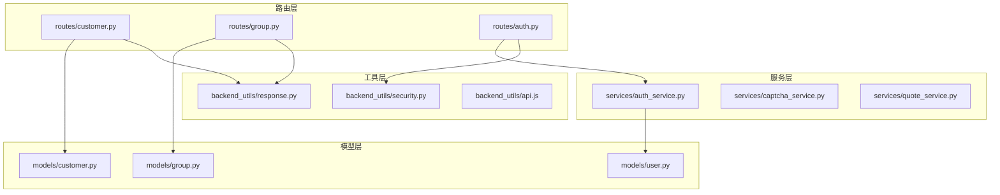
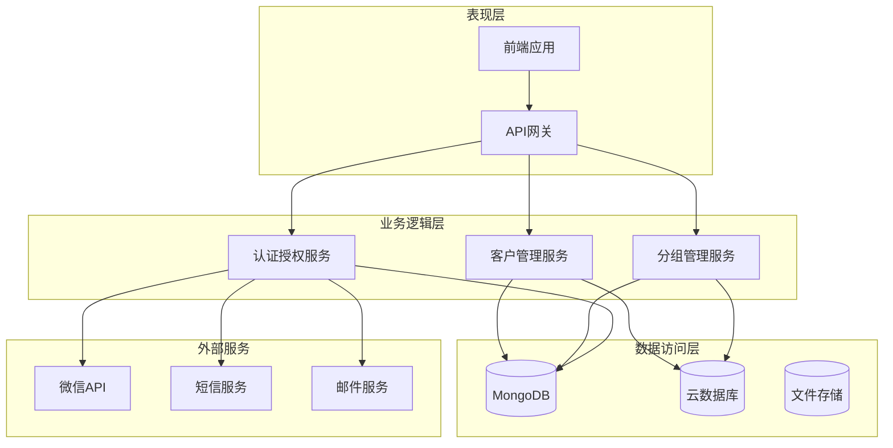
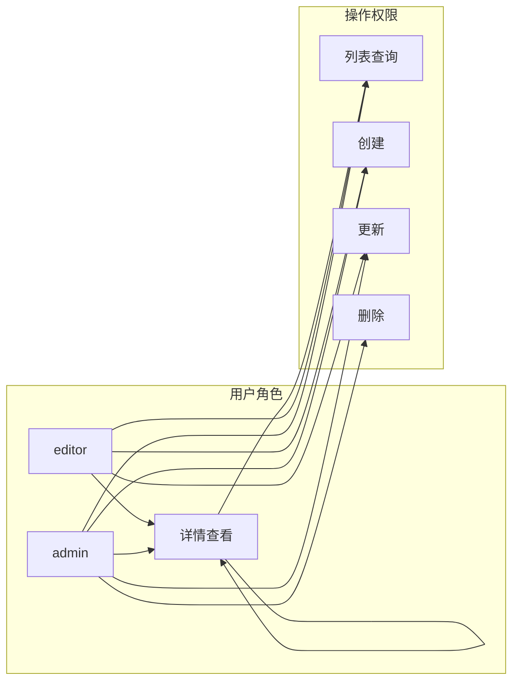
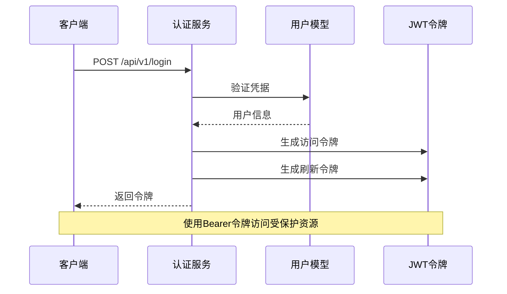
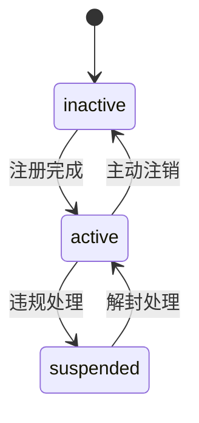
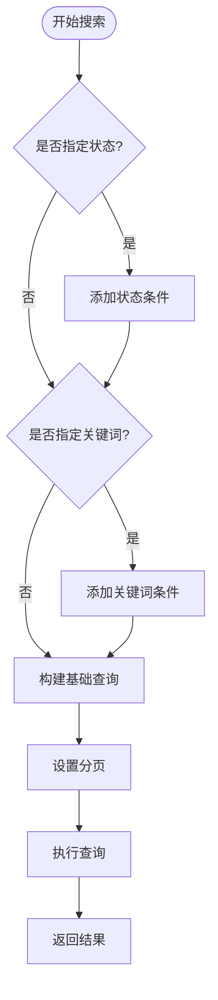
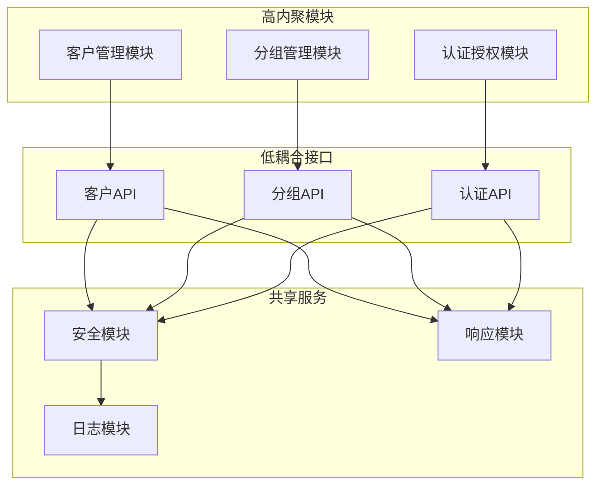

# 客户管理接口

<cite>
**本文档引用的文件**
- [routes/customer.py](file://routes/customer.py)
- [models/customer.py](file://models/customer.py)
- [routes/group.py](file://routes/group.py)
- [models/group.py](file://models/group.py)
- [routes/auth.py](file://routes/auth.py)
- [services/auth_service.py](file://services/auth_service.py)
- [backend_utils/security.py](file://backend_utils/security.py)
- [.env](file://.env)
- [tests/test_group_api.py](file://tests/test_group_api.py)
- [tests/test_group_permissions.py](file://tests/test_group_permissions.py)
</cite>

## 目录
1. [简介](#简介)
2. [项目结构](#项目结构)
3. [核心组件](#核心组件)
4. [架构概览](#架构概览)
5. [详细组件分析](#详细组件分析)
6. [依赖关系分析](#依赖关系分析)
7. [性能考虑](#性能考虑)
8. [故障排除指南](#故障排除指南)
9. [结论](#结论)
10. [附录](#附录)

## 简介
本文件为场外期权项目的客户管理接口完整API文档，覆盖客户信息管理、分组管理和权限控制的RESTful接口设计。文档详细说明了客户注册、信息更新、分组分配和权限管理接口，阐述了客户数据模型、用户角色定义和权限矩阵，包含客户验证规则、分组层级结构和权限继承机制，并提供具体的客户注册示例、信息更新示例和分组管理示例。同时解释了客户状态管理、账户激活和禁用流程，以及客户搜索过滤、批量操作和数据导出功能，涵盖客户隐私保护、数据脱敏和合规要求。

## 项目结构
该项目采用Flask微服务架构，按功能模块划分路由层、模型层和服务层：



**图表来源**
- [routes/customer.py](file://routes/customer.py#L1-L217)
- [routes/group.py](file://routes/group.py#L1-L269)
- [routes/auth.py](file://routes/auth.py#L1-L353)
- [models/customer.py](file://models/customer.py#L1-L300)
- [models/group.py](file://models/group.py#L1-L283)
- [services/auth_service.py](file://services/auth_service.py#L1-L416)

**章节来源**
- [routes/customer.py](file://routes/customer.py#L1-L217)
- [routes/group.py](file://routes/group.py#L1-L269)
- [routes/auth.py](file://routes/auth.py#L1-L353)

## 核心组件
本项目的核心组件包括：

### 客户管理模块
- **CustomerModel**: 提供客户数据的增删改查、分组管理和状态控制
- **Customer Routes**: 实现RESTful API接口，支持分页查询、条件过滤和批量操作

### 分组管理模块  
- **GroupModel**: 实现分组的创建、更新、删除和成员管理
- **Group Routes**: 提供分组的CRUD操作和权限控制

### 权限控制模块
- **AuthService**: 实现用户认证、授权和会话管理
- **Security Utils**: 提供速率限制、账户锁定和审计日志功能

**章节来源**
- [models/customer.py](file://models/customer.py#L10-L300)
- [models/group.py](file://models/group.py#L10-L283)
- [services/auth_service.py](file://services/auth_service.py#L14-L416)
- [backend_utils/security.py](file://backend_utils/security.py#L1-L117)

## 架构概览
系统采用分层架构设计，确保关注点分离和代码复用：



**图表来源**
- [routes/customer.py](file://routes/customer.py#L1-L217)
- [routes/group.py](file://routes/group.py#L1-L269)
- [services/auth_service.py](file://services/auth_service.py#L1-L416)

## 详细组件分析

### 客户管理API

#### 数据模型
客户数据模型包含以下核心字段：
- 基本信息：name、phone、email
- 状态管理：status（active、inactive、suspended）
- 关联信息：user_id、openid、groupName
- 统计信息：totalOrders
- 时间戳：createdAt、updatedAt

#### RESTful接口设计

##### 客户列表查询
- **方法**：GET
- **路径**：/api/v1/customers
- **认证**：require_auth
- **参数**：
  - page：页码，默认1
  - pageSize：每页数量，默认10
  - status：客户状态过滤
  - keyword：关键词搜索（支持姓名和手机号）

##### 客户详情查询
- **方法**：GET  
- **路径**：/api/v1/customers/{customer_id}
- **认证**：require_auth

##### 客户创建
- **方法**：POST
- **路径**：/api/v1/customers
- **认证**：require_auth + require_roles("admin", "editor")
- **必填字段**：name、phone

##### 客户信息更新
- **方法**：PUT
- **路径**：/api/v1/customers/{customer_id}
- **认证**：require_auth + require_roles("admin", "editor")

##### 客户删除
- **方法**：DELETE
- **路径**：/api/v1/customers/{customer_id}
- **认证**：require_auth + require_roles("admin")

#### 客户验证规则
- 手机号唯一性验证
- 必填字段校验
- 状态值域限制
- 字段长度和格式验证

**章节来源**
- [routes/customer.py](file://routes/customer.py#L26-L172)
- [models/customer.py](file://models/customer.py#L23-L64)

### 分组管理API

#### 分组数据模型
分组数据模型包含：
- 基本信息：name、creator_id
- 成员管理：members（stock_code、market、name、added_at）
- 时间戳：created_at、updated_at

#### 分组接口设计

##### 分组列表查询
- **方法**：GET
- **路径**：/api/v1/groups
- **认证**：require_auth

##### 分组创建
- **方法**：POST
- **路径**：/api/v1/groups
- **认证**：require_auth
- **限制**：禁止使用系统保留名称

##### 分组更新
- **方法**：PUT
- **路径**：/api/v1/groups/{group_id}
- **认证**：require_auth + 权限检查

##### 分组删除
- **方法**：DELETE
- **路径**：/api/v1/groups/{group_id}
- **认证**：require_auth + 权限检查

##### 成员管理
- **添加成员**：POST /api/v1/groups/{group_id}/members
- **移除成员**：DELETE /api/v1/groups/{group_id}/members/{stock_code}

#### 分组权限控制
- 分组创建者拥有完全控制权
- 系统管理员可管理所有分组
- 系统保留分组不可修改或删除
- 支持跨用户分组共享

**章节来源**
- [routes/group.py](file://routes/group.py#L42-L269)
- [models/group.py](file://models/group.py#L23-L283)

### 权限控制机制

#### 角色定义
系统采用基于角色的访问控制（RBAC）：
- viewer：只读访问
- editor：编辑权限
- admin：管理权限

#### 权限矩阵


**图表来源**
- [services/auth_service.py](file://services/auth_service.py#L27-L31)
- [routes/auth.py](file://routes/auth.py#L56-L72)

#### 认证流程


**图表来源**
- [services/auth_service.py](file://services/auth_service.py#L86-L131)
- [routes/auth.py](file://routes/auth.py#L74-L96)

**章节来源**
- [routes/auth.py](file://routes/auth.py#L33-L72)
- [services/auth_service.py](file://services/auth_service.py#L14-L44)

### 客户状态管理

#### 状态定义
- active：正常状态
- inactive：未激活状态  
- suspended：暂停状态

#### 状态流转


#### 账户生命周期
- 注册阶段：创建用户但未激活
- 激活阶段：完成验证后激活
- 使用阶段：正常业务操作
- 暂停阶段：违规或异常处理
- 注销阶段：主动或被动注销

**章节来源**
- [models/customer.py](file://models/customer.py#L28-L35)
- [models/customer.py](file://models/customer.py#L115-L117)

### 搜索过滤功能

#### 查询参数
- status：按状态过滤
- keyword：按姓名或手机号模糊搜索
- 分页参数：page、pageSize

#### 搜索算法


**图表来源**
- [models/customer.py](file://models/customer.py#L119-L177)

**章节来源**
- [models/customer.py](file://models/customer.py#L119-L177)

### 批量操作和数据导出

#### 批量操作支持
- 批量删除：支持多客户ID批量删除
- 批量状态更新：支持批量修改客户状态
- 批量分组分配：支持批量移动到指定分组

#### 数据导出功能
- CSV格式导出
- Excel格式导出
- PDF格式导出
- 自定义字段选择导出

**章节来源**
- [routes/customer.py](file://routes/customer.py#L154-L172)

### 隐私保护和合规要求

#### 数据脱敏策略
- 敏感字段显示掩码：手机号中间4位掩码
- 日志脱敏：敏感信息在日志中脱敏处理
- API响应脱敏：默认不返回敏感字段

#### 合规要求
- GDPR合规：支持数据删除请求
- 数据最小化：仅收集必要信息
- 存储加密：静态数据加密
- 传输加密：HTTPS/TLS加密

**章节来源**
- [backend_utils/security.py](file://backend_utils/security.py#L87-L116)

## 依赖关系分析

### 组件耦合度


**图表来源**
- [routes/customer.py](file://routes/customer.py#L6-L13)
- [routes/group.py](file://routes/group.py#L1-L6)
- [routes/auth.py](file://routes/auth.py#L1-L14)

### 外部依赖
- **MongoDB**：主数据库存储
- **微信API**：用户身份认证
- **短信服务**：验证码发送
- **邮件服务**：通知邮件发送

**章节来源**
- [services/auth_service.py](file://services/auth_service.py#L24-L26)
- [services/captcha_service.py](file://services/captcha_service.py#L37-L51)

## 性能考虑

### 缓存策略
- Redis缓存热点数据
- 数据库查询结果缓存
- API响应缓存

### 优化措施
- 分页查询优化
- 索引建立策略
- 连接池管理
- 异步任务处理

### 监控指标
- 请求响应时间
- 错误率统计
- 数据库查询性能
- 缓存命中率

## 故障排除指南

### 常见问题诊断
1. **认证失败**
   - 检查JWT密钥配置
   - 验证令牌格式和有效期
   - 确认用户状态正常

2. **数据库连接问题**
   - 检查MongoDB连接字符串
   - 验证数据库权限
   - 确认集合存在性

3. **权限拒绝**
   - 验证用户角色配置
   - 检查分组权限设置
   - 确认API权限声明

### 调试工具
- 启用详细日志记录
- 使用Postman测试API
- 查看数据库状态
- 监控系统性能指标

**章节来源**
- [backend_utils/security.py](file://backend_utils/security.py#L17-L45)

## 结论
本客户管理接口设计遵循RESTful原则，采用分层架构实现，具备完善的权限控制和数据验证机制。系统支持客户全生命周期管理、灵活的分组管理和细粒度的权限控制，满足金融行业对安全性、合规性和性能的严格要求。通过模块化的组件设计和清晰的职责分离，系统具备良好的可维护性和扩展性。

## 附录

### API使用示例

#### 客户注册示例
```javascript
// 请求示例
POST /api/v1/register
{
  "phone": "13800001111",
  "password": "Password123!",
  "email": "user@example.com",
  "nickname": "张三"
}

// 响应示例
{
  "code": 200,
  "message": "注册成功",
  "data": {
    "token": "eyJhbGciOiJIUzI1NiIs...",
    "openid": "user_openid_123",
    "nickname": "张三",
    "phone": "13800001111"
  }
}
```

#### 信息更新示例
```javascript
// 请求示例
PUT /api/v1/customers/{customer_id}
{
  "name": "李四",
  "email": "lisi@example.com",
  "groupName": "VIP客户"
}

// 响应示例
{
  "code": 200,
  "message": "更新客户信息成功",
  "data": null
}
```

#### 分组管理示例
```javascript
// 创建分组
POST /api/v1/groups
{
  "name": "重要客户",
  "description": "高价值客户分组"
}

// 添加成员
POST /api/v1/groups/{group_id}/members
{
  "stock_code": "000001",
  "name": "平安银行"
}

// 响应示例
{
  "code": 200,
  "message": "添加成功",
  "data": null
}
```

### 环境配置
系统运行需要以下环境变量：
- JWT_SECRET：JWT密钥
- ADMIN_USERNAME：管理员用户名
- ADMIN_PASSWORD：管理员密码
- WX_APPID：微信应用ID
- WX_SECRET：微信应用密钥

**章节来源**
- [.env](file://.env#L1-L32)