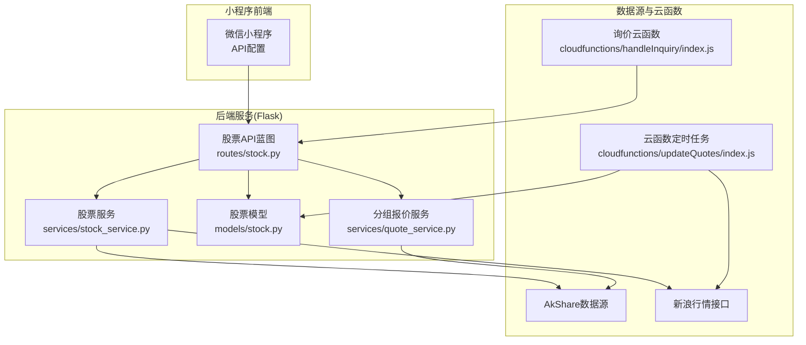
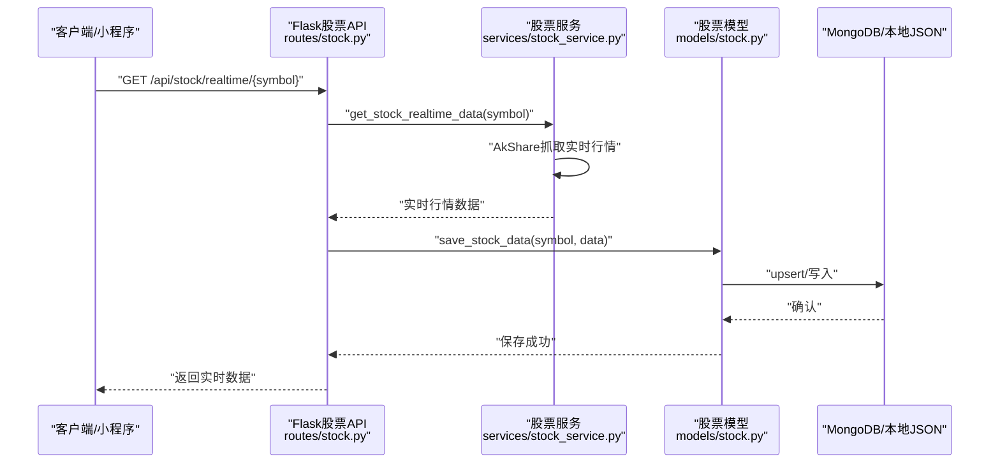
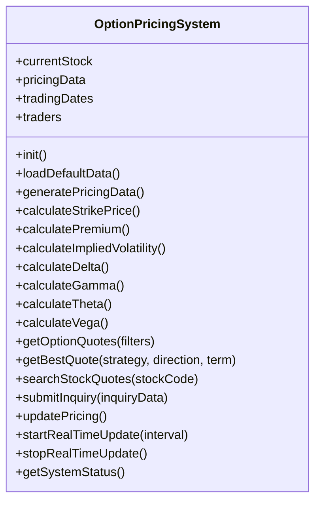
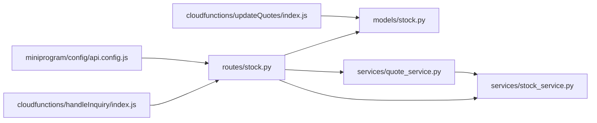

# 报价数据接口

<cite>
**本文引用的文件**
- [routes/stock.py](file://routes/stock.py)
- [services/stock_service.py](file://services/stock_service.py)
- [models/stock.py](file://models/stock.py)
- [services/quote_service.py](file://services/quote_service.py)
- [services/sina_crawler.py](file://services/sina_crawler.py)
- [cloudfunctions/updateQuotes/index.js](file://cloudfunctions/updateQuotes/index.js)
- [cloudfunctions/handleInquiry/index.js](file://cloudfunctions/handleInquiry/index.js)
- [backend_utils/option-pricing.js](file://backend_utils/option-pricing.js)
- [backend_utils/performance-optimizer.js](file://backend_utils/performance-optimizer.js)
- [miniprogram/config/api.config.js](file://miniprogram/config/api.config.js)
</cite>

## 目录
1. [简介](#简介)
2. [项目结构](#项目结构)
3. [核心组件](#核心组件)
4. [架构总览](#架构总览)
5. [详细组件分析](#详细组件分析)
6. [依赖关系分析](#依赖关系分析)
7. [性能考量](#性能考量)
8. [故障排查指南](#故障排查指南)
9. [结论](#结论)
10. [附录](#附录)

## 简介
本文件面向报价数据接口的完整技术文档，覆盖实时行情获取、期权报价与定价计算、历史数据查询、实时数据推送与历史数据下载、期权希腊字母与隐含波动率计算、风险价值（VaR）计算思路、数据质量与异常处理、数据一致性保障、API限流与缓存配置、CDN加速等主题。文档同时给出接口定义、调用序列与时序图、数据模型与算法流程，以及实际使用示例路径。

## 项目结构
后端采用 Flask 蓝图组织股票相关 API；服务层封装 AkShare 数据抓取与报价比较；模型层负责 MongoDB/本地 JSON 的持久化；云函数负责定时刷新行情与询价状态管理；小程序侧提供统一 API 配置与前端性能优化工具。

图表来源
- [routes/stock.py](file://routes/stock.py#L1-L353)
- [services/stock_service.py](file://services/stock_service.py#L1-L289)
- [models/stock.py](file://models/stock.py#L1-L386)
- [services/quote_service.py](file://services/quote_service.py#L1-L109)
- [cloudfunctions/updateQuotes/index.js](file://cloudfunctions/updateQuotes/index.js#L1-L180)
- [cloudfunctions/handleInquiry/index.js](file://cloudfunctions/handleInquiry/index.js#L1-L81)

章节来源
- [routes/stock.py](file://routes/stock.py#L1-L353)
- [services/stock_service.py](file://services/stock_service.py#L1-L289)
- [models/stock.py](file://models/stock.py#L1-L386)
- [services/quote_service.py](file://services/quote_service.py#L1-L109)
- [cloudfunctions/updateQuotes/index.js](file://cloudfunctions/updateQuotes/index.js#L1-L180)
- [cloudfunctions/handleInquiry/index.js](file://cloudfunctions/handleInquiry/index.js#L1-L81)

## 核心组件
- 股票API蓝图：提供实时行情、历史数据、搜索、报价比较与最低报价、分页列表等接口。
- 股票服务：封装 AkShare 实时/历史数据抓取、报价比较与最低报价查询、关键词搜索。
- 股票模型：MongoDB/本地 JSON 的持久化、索引、批量写入、分页查询与计数。
- 分组报价服务：基于分组成员批量获取实时行情并带缓存。
- 云函数：定时批量拉取新浪行情并写库，支持分页与并发写；询价状态管理与统计。
- 期权定价系统：小程序适配的期权报价、希腊字母与隐含波动率模拟、实时更新与回调。
- 性能优化器：小程序端懒加载、缓存、监控与告警。
- API 配置：统一管理后端与云端 API 基础地址，支持开发/生产环境切换。

章节来源
- [routes/stock.py](file://routes/stock.py#L21-L353)
- [services/stock_service.py](file://services/stock_service.py#L17-L289)
- [models/stock.py](file://models/stock.py#L23-L386)
- [services/quote_service.py](file://services/quote_service.py#L9-L109)
- [cloudfunctions/updateQuotes/index.js](file://cloudfunctions/updateQuotes/index.js#L95-L180)
- [cloudfunctions/handleInquiry/index.js](file://cloudfunctions/handleInquiry/index.js#L12-L81)
- [backend_utils/option-pricing.js](file://backend_utils/option-pricing.js#L6-L343)
- [backend_utils/performance-optimizer.js](file://backend_utils/performance-optimizer.js#L7-L817)
- [miniprogram/config/api.config.js](file://miniprogram/config/api.config.js#L11-L90)

## 架构总览
后端通过 Flask 蓝图暴露 REST 接口，服务层统一调用 AkShare 与新浪接口，模型层负责数据落盘与查询；云函数定时任务批量更新行情；小程序端通过统一 API 配置访问后端，并借助性能优化器进行前端体验优化。

图表来源
- [routes/stock.py](file://routes/stock.py#L21-L84)
- [services/stock_service.py](file://services/stock_service.py#L24-L88)
- [models/stock.py](file://models/stock.py#L135-L193)

## 详细组件分析

### 股票实时行情接口
- 接口定义
  - GET /api/stock/realtime/{symbol}
  - 查询参数：无
  - 返回字段：code、name、price、change_percent、volume、amount、open、high、low、pre_close
- 处理流程
  - 调用服务层获取实时数据
  - 保存至数据库（MongoDB/本地 JSON）
  - 返回标准响应
- 示例路径
  - [实时行情接口定义](file://routes/stock.py#L21-L84)
  - [实时数据服务实现](file://services/stock_service.py#L24-L88)
  - [数据保存模型](file://models/stock.py#L135-L193)

章节来源
- [routes/stock.py](file://routes/stock.py#L21-L84)
- [services/stock_service.py](file://services/stock_service.py#L24-L88)
- [models/stock.py](file://models/stock.py#L135-L193)

### 股票历史数据接口
- 接口定义
  - GET /api/stock/history/{symbol}
  - 查询参数：period（daily/weekly/monthly，默认daily）、start_date（YYYYMMDD）、end_date（YYYYMMDD）
  - 返回字段：date、open、high、low、close、volume、amount、change_percent
- 处理流程
  - 参数校验与映射
  - 调用服务层获取历史数据（前复权）
  - 返回标准响应
- 示例路径
  - [历史数据接口定义](file://routes/stock.py#L87-L154)
  - [历史数据服务实现](file://services/stock_service.py#L91-L178)

章节来源
- [routes/stock.py](file://routes/stock.py#L87-L154)
- [services/stock_service.py](file://services/stock_service.py#L91-L178)

### 股票搜索接口
- 接口定义
  - GET /api/stock/search?keyword=...
  - 返回字段：code、name、price、change_percent
- 处理流程
  - 调用服务层进行关键词匹配（代码或名称）
  - 限制返回前20条
- 示例路径
  - [搜索接口定义](file://routes/stock.py#L157-L216)
  - [搜索服务实现](file://services/stock_service.py#L228-L289)

章节来源
- [routes/stock.py](file://routes/stock.py#L157-L216)
- [services/stock_service.py](file://services/stock_service.py#L228-L289)

### 跨交易商报价比较与最低报价接口
- 接口定义
  - GET /api/stock/quotes/compare?stock_code=...&type=...&term=...
  - GET /api/stock/quotes/lowest?stock_code=...&type=...&term=...
- 处理流程
  - 通过云数据库查询报价集合
  - 对报价按交易商/类型/期限分组，比较最低报价
- 示例路径
  - [报价比较接口](file://routes/stock.py#L219-L251)
  - [最低报价接口](file://routes/stock.py#L254-L276)
  - [报价查询服务](file://services/stock_service.py#L181-L225)

章节来源
- [routes/stock.py](file://routes/stock.py#L219-L276)
- [services/stock_service.py](file://services/stock_service.py#L181-L225)

### 分组实时行情接口
- 接口定义
  - GET /api/stock/group/{group_id}
  - 返回字段：code、name、price、change_percent、volume、amount、open、high、low、pre_close、market
- 处理流程
  - 从分组模型获取成员列表
  - 批量抓取 A 股实时行情（AkShare），按成员过滤
  - 带 TTL 缓存（60 秒）
- 示例路径
  - [分组报价服务](file://services/quote_service.py#L28-L109)

章节来源
- [services/quote_service.py](file://services/quote_service.py#L28-L109)

### 期权报价与定价计算
- 组件职责
  - 期权报价生成：策略、方向、期限组合，生成报价矩阵
  - 定价计算：执行价、期权费率、隐含波动率、希腊字母（Delta/Gamma/Theta/Vega）
  - 实时更新：整体与单笔报价更新，回调触发
  - 询价提交：生成询价单，模拟交易商异步响应
- 示例路径
  - [期权定价系统](file://backend_utils/option-pricing.js#L6-L343)

图表来源
- [backend_utils/option-pricing.js](file://backend_utils/option-pricing.js#L6-L343)

章节来源
- [backend_utils/option-pricing.js](file://backend_utils/option-pricing.js#L6-L343)

### 实时数据推送与历史数据下载
- 实时推送
  - 云函数定时任务：分页读取股票集合，批量请求新浪行情，解析并写库
  - 并发写库：每页并发写，提高吞吐
- 历史数据下载
  - 历史接口返回前复权数据，支持日/周/月周期
- 示例路径
  - [定时更新云函数](file://cloudfunctions/updateQuotes/index.js#L95-L180)
  - [历史数据接口](file://routes/stock.py#L87-L154)

章节来源
- [cloudfunctions/updateQuotes/index.js](file://cloudfunctions/updateQuotes/index.js#L95-L180)
- [routes/stock.py](file://routes/stock.py#L87-L154)

### 询价状态管理与统计
- 云函数能力
  - 更新询价状态（含备注、操作人、更新时间）
  - 聚合统计各状态数量
- 示例路径
  - [询价云函数](file://cloudfunctions/handleInquiry/index.js#L12-L81)

章节来源
- [cloudfunctions/handleInquiry/index.js](file://cloudfunctions/handleInquiry/index.js#L12-L81)

### 数据模型与一致性
- 模型能力
  - MongoDB 索引：stock_code 唯一索引，时间索引
  - 本地 JSON 文件存储：原子写入、LRU 缓存、字典索引
  - 批量写入：UpdateOne/JSON 原子替换
  - 分页查询与计数
- 示例路径
  - [股票模型](file://models/stock.py#L23-L386)

章节来源
- [models/stock.py](file://models/stock.py#L23-L386)

### 市场数据源集成与爬虫
- 数据源
  - AkShare：A 股实时/历史行情
  - 新浪：实时行情批量抓取
- 爬虫策略
  - 批量获取股票列表与行情，分块并发，超时控制
- 示例路径
  - [A 股代码与行情抓取](file://services/sina_crawler.py#L10-L66)
  - [AkShare 历史/实时接口](file://services/stock_service.py#L51-L146)

章节来源
- [services/sina_crawler.py](file://services/sina_crawler.py#L10-L66)
- [services/stock_service.py](file://services/stock_service.py#L51-L146)

### API 限流、缓存与 CDN 加速
- 后端缓存
  - 分组报价 TTL 缓存（60 秒）
- 前端缓存
  - 性能优化器：懒加载、模块缓存、图片懒加载、分包预下载
- CDN 加速
  - 小程序 API 配置支持云端地址，便于结合云托管/CDN
- 示例路径
  - [分组报价缓存](file://services/quote_service.py#L32-L96)
  - [性能优化器](file://backend_utils/performance-optimizer.js#L7-L817)
  - [API 配置](file://miniprogram/config/api.config.js#L11-L90)

章节来源
- [services/quote_service.py](file://services/quote_service.py#L32-L96)
- [backend_utils/performance-optimizer.js](file://backend_utils/performance-optimizer.js#L7-L817)
- [miniprogram/config/api.config.js](file://miniprogram/config/api.config.js#L11-L90)

## 依赖关系分析

图表来源
- [routes/stock.py](file://routes/stock.py#L1-L353)
- [services/stock_service.py](file://services/stock_service.py#L1-L289)
- [models/stock.py](file://models/stock.py#L1-L386)
- [services/quote_service.py](file://services/quote_service.py#L1-L109)
- [cloudfunctions/updateQuotes/index.js](file://cloudfunctions/updateQuotes/index.js#L1-L180)
- [cloudfunctions/handleInquiry/index.js](file://cloudfunctions/handleInquiry/index.js#L1-L81)
- [miniprogram/config/api.config.js](file://miniprogram/config/api.config.js#L1-L90)

章节来源
- [routes/stock.py](file://routes/stock.py#L1-L353)
- [services/stock_service.py](file://services/stock_service.py#L1-L289)
- [models/stock.py](file://models/stock.py#L1-L386)
- [services/quote_service.py](file://services/quote_service.py#L1-L109)
- [cloudfunctions/updateQuotes/index.js](file://cloudfunctions/updateQuotes/index.js#L1-L180)
- [cloudfunctions/handleInquiry/index.js](file://cloudfunctions/handleInquiry/index.js#L1-L81)
- [miniprogram/config/api.config.js](file://miniprogram/config/api.config.js#L1-L90)

## 性能考量
- 后端
  - 批量获取与过滤：一次性抓取全部 A 股行情，再按成员过滤，减少多次请求
  - 分页与并发：云函数分页读取、分批请求、并发写库
  - 缓存：分组报价 60 秒 TTL
- 前端
  - 懒加载与分包预下载：降低首屏压力
  - 图片懒加载：IntersectionObserver 观察进入视窗再加载
  - 性能监控：API 响应时间、渲染时间、交互延迟、内存使用、缓存命中率
- 示例路径
  - [批量抓取与过滤](file://services/quote_service.py#L56-L96)
  - [云函数分页/并发写](file://cloudfunctions/updateQuotes/index.js#L106-L164)
  - [性能优化器](file://backend_utils/performance-optimizer.js#L7-L817)

章节来源
- [services/quote_service.py](file://services/quote_service.py#L56-L96)
- [cloudfunctions/updateQuotes/index.js](file://cloudfunctions/updateQuotes/index.js#L106-L164)
- [backend_utils/performance-optimizer.js](file://backend_utils/performance-optimizer.js#L7-L817)

## 故障排查指南
- 实时数据为空
  - 检查 AkShare 接口可用性与返回格式
  - 查看服务层日志与异常捕获
  - 示例路径：[实时数据服务](file://services/stock_service.py#L49-L88)
- 历史数据缺失
  - 校验周期参数与日期范围
  - 确认 AkShare 历史接口返回
  - 示例路径：[历史数据服务](file://services/stock_service.py#L125-L178)
- 分组报价缓存未生效
  - 检查 TTL 与缓存键
  - 示例路径：[分组报价服务](file://services/quote_service.py#L32-L96)
- 云函数超时/写库失败
  - 检查超时设置与分批并发
  - 示例路径：[云函数主流程](file://cloudfunctions/updateQuotes/index.js#L95-L180)
- 询价状态更新失败
  - 校验参数与数据库写入结果
  - 示例路径：[询价云函数](file://cloudfunctions/handleInquiry/index.js#L34-L58)

章节来源
- [services/stock_service.py](file://services/stock_service.py#L49-L88)
- [services/stock_service.py](file://services/stock_service.py#L125-L178)
- [services/quote_service.py](file://services/quote_service.py#L32-L96)
- [cloudfunctions/updateQuotes/index.js](file://cloudfunctions/updateQuotes/index.js#L95-L180)
- [cloudfunctions/handleInquiry/index.js](file://cloudfunctions/handleInquiry/index.js#L34-L58)

## 结论
本报价数据接口体系以 Flask 为核心，结合 AkShare 与新浪数据源，提供实时/历史/搜索/报价比较等完整能力；通过云函数实现定时批量更新与询价管理；前后端配合实现缓存、性能监控与用户体验优化。建议在生产环境启用 CDN 与限流策略，持续监控缓存命中率与 API 响应时间，确保数据一致性与稳定性。

## 附录

### 接口一览与示例路径
- 实时行情
  - [GET /api/stock/realtime/{symbol}](file://routes/stock.py#L21-L84)
- 历史行情
  - [GET /api/stock/history/{symbol}](file://routes/stock.py#L87-L154)
- 股票搜索
  - [GET /api/stock/search?keyword=...](file://routes/stock.py#L157-L216)
- 报价比较
  - [GET /api/stock/quotes/compare?stock_code=&type=&term=](file://routes/stock.py#L219-L251)
- 最低报价
  - [GET /api/stock/quotes/lowest?stock_code=&type=&term=](file://routes/stock.py#L254-L276)
- 分组实时行情
  - [分组报价服务](file://services/quote_service.py#L28-L109)
- 期权报价与定价
  - [期权定价系统](file://backend_utils/option-pricing.js#L6-L343)
- 询价状态管理
  - [询价云函数](file://cloudfunctions/handleInquiry/index.js#L12-L81)

### 数据模型与字段
- 股票实时数据
  - code、name、price、change_percent、volume、amount、open、high、low、pre_close
  - [字段定义参考](file://services/stock_service.py#L64-L75)
- 股票历史数据
  - date、open、high、low、close、volume、amount、change_percent
  - [字段定义参考](file://services/stock_service.py#L155-L165)
- 分组报价缓存
  - TTL=60 秒，键规则 group_quotes_{group_id}
  - [缓存实现](file://services/quote_service.py#L32-L96)

### 期权定价与希腊字母
- 执行价、期权费率、隐含波动率、Delta、Gamma、Theta、Vega
- [定价系统实现](file://backend_utils/option-pricing.js#L80-L135)

### 风险价值（VaR）计算思路
- 历史模拟法：基于历史收益率序列计算分位数
- 参数法：假设正态分布，使用均值与标准差
- 蒙特卡洛法：模拟未来价格路径，计算损益分布
- 建议结合隐含波动率与历史波动率进行校准

### 数据质量与异常处理
- 异常捕获与日志记录
- 空值与非法字符处理（如“-”转换为 0）
- 示例路径：[实时/历史/搜索服务异常处理](file://services/stock_service.py#L80-L88)

### 数据更新频率
- 实时行情：云函数定时任务（分钟级）
- 分组报价：60 秒 TTL
- 历史数据：按需查询
- 示例路径：[云函数定时更新](file://cloudfunctions/updateQuotes/index.js#L95-L180)