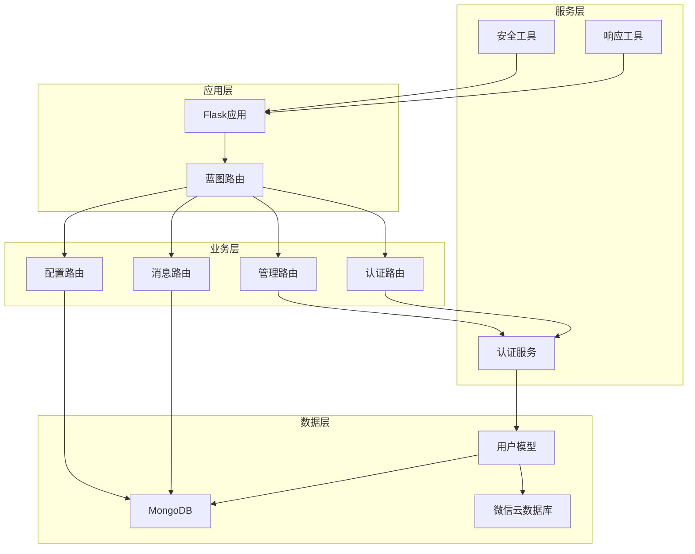
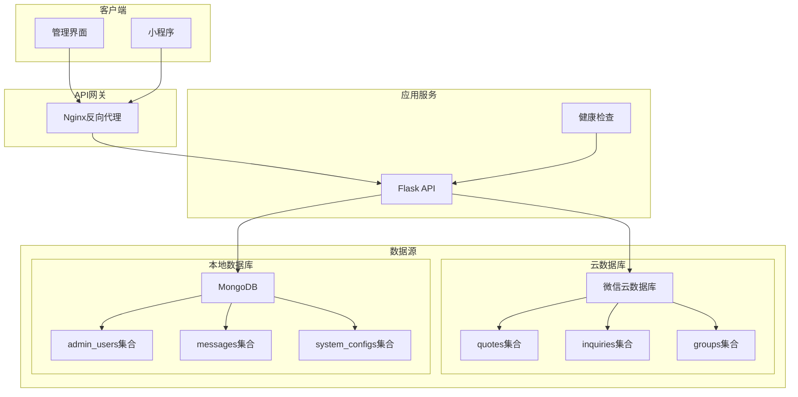
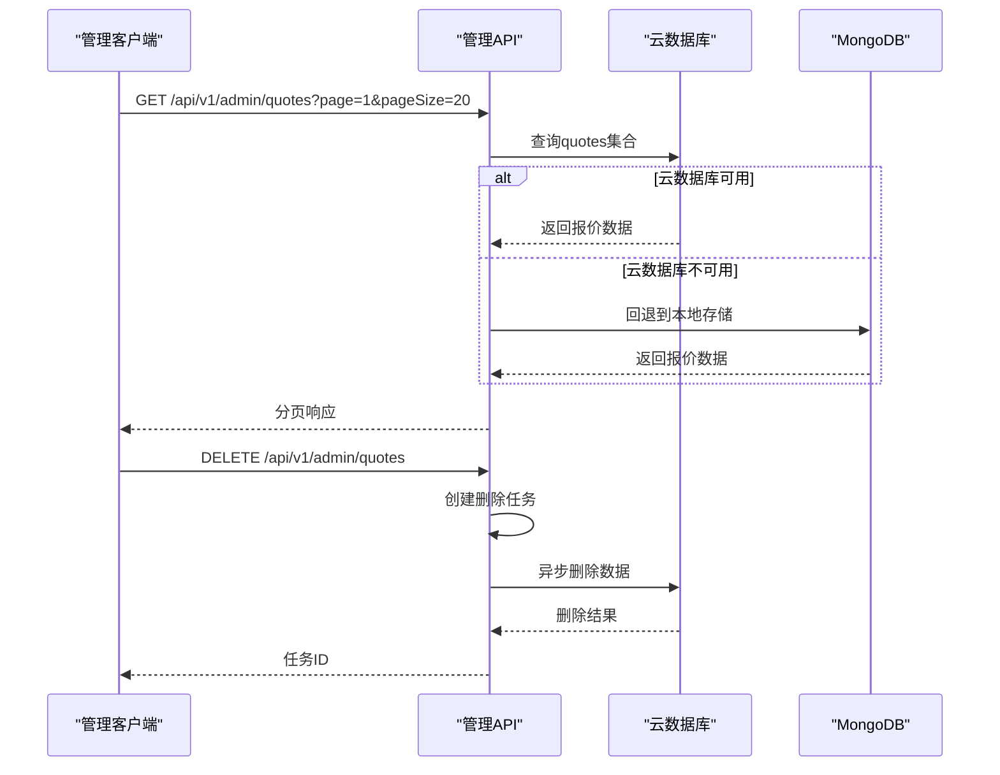
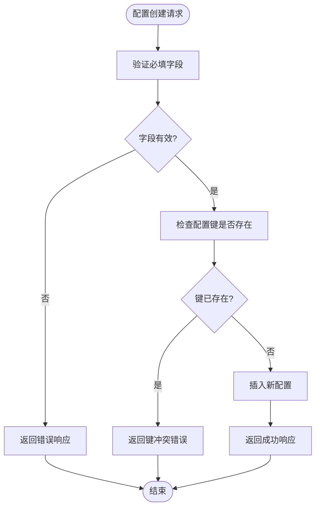
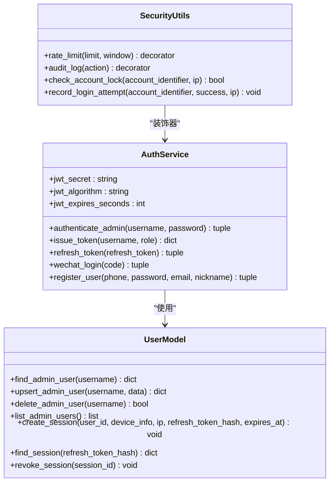
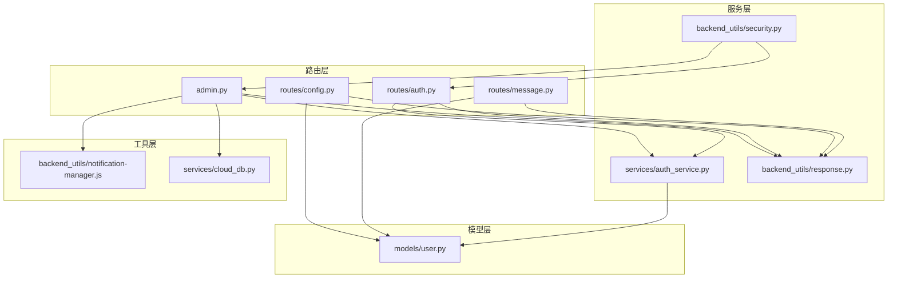

# 系统管理接口

<cite>
**本文档引用的文件**
- [routes/admin.py](file://routes/admin.py)
- [routes/config.py](file://routes/config.py)
- [routes/auth.py](file://routes/auth.py)
- [routes/message.py](file://routes/message.py)
- [backend_utils/security.py](file://backend_utils/security.py)
- [backend_utils/response.py](file://backend_utils/response.py)
- [services/auth_service.py](file://services/auth_service.py)
- [models/user.py](file://models/user.py)
- [backend_utils/notification-manager.js](file://backend_utils/notification-manager.js)
- [app.py](file://app.py)
- [config.py](file://config.py)
- [deploy/docker-compose.yml](file://deploy/docker-compose.yml)
- [CLOUD_README.md](file://CLOUD_README.md)
</cite>

## 目录
1. [简介](#简介)
2. [项目结构](#项目结构)
3. [核心组件](#核心组件)
4. [架构概览](#架构概览)
5. [详细组件分析](#详细组件分析)
6. [依赖关系分析](#依赖关系分析)
7. [性能考虑](#性能考虑)
8. [故障排除指南](#故障排除指南)
9. [结论](#结论)
10. [附录](#附录)

## 简介
本文件为系统管理接口的完整API文档，覆盖系统配置、监控告警、运维管理等核心能力。重点包括：
- 系统配置管理：配置查询、创建、更新
- 用户权限配置：管理员账户管理、角色控制
- 日志查询：同步历史查询、审计日志
- 系统监控：健康检查、性能监控指标
- 告警通知：消息模板、通知管理
- 数据管理：行情同步、批量导入、基准测试
- 运维管理：备份恢复、版本升级、维护模式

## 项目结构
系统采用Flask微服务架构，结合微信云数据库与本地MongoDB双数据源模式，支持混合部署与容器化。

**图表来源**
- [app.py](file://app.py#L103-L276)
- [routes/admin.py](file://routes/admin.py#L24-L24)
- [routes/auth.py](file://routes/auth.py#L14-L15)
- [routes/config.py](file://routes/config.py#L11-L11)
- [routes/message.py](file://routes/message.py#L11-L11)

**章节来源**
- [app.py](file://app.py#L103-L276)
- [config.py](file://config.py#L22-L132)

## 核心组件
- 管理后台路由：提供统计数据、订单管理、报价管理、同步任务等接口
- 配置管理路由：系统配置的增删改查
- 认证路由：登录、令牌刷新、用户管理
- 消息路由：消息模板与消息管理
- 安全工具：速率限制、账户锁定、审计日志
- 响应工具：统一响应格式

**章节来源**
- [routes/admin.py](file://routes/admin.py#L47-L83)
- [routes/config.py](file://routes/config.py#L13-L118)
- [routes/auth.py](file://routes/auth.py#L74-L353)
- [routes/message.py](file://routes/message.py#L13-L179)
- [backend_utils/security.py](file://backend_utils/security.py#L17-L117)
- [backend_utils/response.py](file://backend_utils/response.py#L11-L118)

## 架构概览
系统采用多数据源架构，支持云数据库优先与本地MongoDB模式切换：

**图表来源**
- [app.py](file://app.py#L121-L152)
- [config.py](file://config.py#L27-L46)
- [CLOUD_README.md](file://CLOUD_README.md#L1-L87)

**章节来源**
- [app.py](file://app.py#L121-L152)
- [config.py](file://config.py#L27-L46)
- [CLOUD_README.md](file://CLOUD_README.md#L1-L87)

## 详细组件分析

### 管理后台接口
管理后台提供完整的数据管理能力，包括统计查询、订单管理、报价管理、同步任务等。

#### 统计数据接口
- GET /api/v1/admin/stats：获取系统统计数据
- 支持数据库未连接时的降级处理

#### 订单管理接口
- GET /api/v1/admin/orders：获取订单列表（分页）
- 参数：page（默认1）、pageSize（默认20，范围1-200）

#### 报价管理接口
- GET /api/v1/admin/quotes：获取报价列表（分页）
- DELETE /api/v1/admin/quotes：删除报价（支持批量删除）
- 支持云数据库与本地数据库双模式

#### 同步任务接口
- POST /api/v1/admin/sync-quotes：触发行情同步
- POST /api/v1/admin/sync-all-quotes：触发全量行情同步（异步任务）
- GET /api/v1/admin/sync-all-quotes/status/{task_id}：查询同步任务状态

#### 基准测试接口
- POST /api/v1/admin/bench-quotes：行情基准测试
- 支持upsert、delete、roundtrip三种模式
- 可配置并发数、批大小等参数

#### 文件导入接口
- POST /api/v1/admin/upload-quotes/preview：文件预览解析
- POST /api/v1/admin/upload-quotes/confirm：确认入库
- POST /api/v1/admin/upload-quotes/bulk-local：批量本地Excel导入

#### 同步历史接口
- GET /api/v1/admin/sync-logs：获取同步历史记录（分页）

**图表来源**
- [routes/admin.py](file://routes/admin.py#L114-L155)
- [routes/admin.py](file://routes/admin.py#L157-L266)

**章节来源**
- [routes/admin.py](file://routes/admin.py#L47-L83)
- [routes/admin.py](file://routes/admin.py#L85-L155)
- [routes/admin.py](file://routes/admin.py#L157-L266)
- [routes/admin.py](file://routes/admin.py#L313-L401)
- [routes/admin.py](file://routes/admin.py#L404-L507)
- [routes/admin.py](file://routes/admin.py#L557-L685)
- [routes/admin.py](file://routes/admin.py#L510-L554)

### 配置管理接口
系统配置管理提供灵活的配置项维护能力。

#### 配置查询接口
- GET /api/v1/admin/configs：获取系统配置列表
- 参数：category（默认system）

#### 配置管理接口
- POST /api/v1/admin/configs：创建系统配置
- PUT /api/v1/admin/configs/{config_id}：更新系统配置
- 字段校验：key、value、category为必填项

**图表来源**
- [routes/config.py](file://routes/config.py#L77-L118)

**章节来源**
- [routes/config.py](file://routes/config.py#L13-L118)

### 认证与权限接口
系统提供完善的认证授权机制，支持多种登录方式和权限控制。

#### 登录接口
- POST /api/v1/auth/login：管理员登录
- POST /api/v1/auth/login/email：邮箱登录
- POST /api/v1/auth/login/phone：手机登录
- POST /api/v1/auth/wechat/login：微信登录

#### 令牌管理接口
- POST /api/v1/auth/token/refresh：刷新令牌
- POST /api/v1/auth/password/forgot：忘记密码
- POST /api/v1/auth/password/reset：重置密码

#### 用户管理接口
- GET /api/v1/auth/me：获取当前用户信息
- PUT /api/v1/auth/me：更新用户资料
- GET /api/v1/auth/users：获取管理员用户列表
- POST /api/v1/auth/users：创建/更新管理员用户
- DELETE /api/v1/auth/users/{username}：删除管理员用户

#### 权限控制机制
- require_auth：JWT令牌验证装饰器
- require_roles：角色权限验证装饰器
- 支持viewer、editor、admin三级角色

**图表来源**
- [services/auth_service.py](file://services/auth_service.py#L14-L416)
- [models/user.py](file://models/user.py#L10-L309)
- [backend_utils/security.py](file://backend_utils/security.py#L17-L117)

**章节来源**
- [routes/auth.py](file://routes/auth.py#L74-L353)
- [services/auth_service.py](file://services/auth_service.py#L14-L416)
- [models/user.py](file://models/user.py#L95-L177)
- [backend_utils/security.py](file://backend_utils/security.py#L17-L117)

### 消息与通知接口
系统提供消息模板管理和消息发送功能。

#### 消息管理接口
- GET /api/v1/admin/messages：获取消息列表（分页）
- 参数：page、pageSize、type
- POST /api/v1/admin/messages：创建消息

#### 消息模板接口
- GET /api/v1/admin/message-templates：获取消息模板列表
- POST /api/v1/admin/message-templates：创建消息模板

#### 通知管理
- 前端通知管理器：支持价格预警、询价状态通知、系统公告
- 支持通知订阅、标记已读、批量清理
- 本地存储持久化（最多100条通知）

**章节来源**
- [routes/message.py](file://routes/message.py#L13-L179)
- [backend_utils/notification-manager.js](file://backend_utils/notification-manager.js#L1-L205)

### 健康检查与监控
系统提供全面的健康检查和监控能力。

#### 健康检查接口
- GET /api/v1/health：系统健康检查
- 返回状态、数据库连接状态、版本信息

#### 性能监控
- 自动行情同步调度器
- 交易时间窗口检测（9:15-11:30, 13:00-15:00）
- 同步间隔可配置（默认10分钟）

#### 审计日志
- 装饰器记录用户操作、IP地址、状态
- 支持登录、注册、密码重置等关键操作审计

**章节来源**
- [app.py](file://app.py#L185-L197)
- [app.py](file://app.py#L279-L330)
- [backend_utils/security.py](file://backend_utils/security.py#L87-L117)

## 依赖关系分析

**图表来源**
- [routes/admin.py](file://routes/admin.py#L1-L24)
- [routes/auth.py](file://routes/auth.py#L1-L17)
- [routes/config.py](file://routes/config.py#L1-L11)
- [routes/message.py](file://routes/message.py#L1-L11)
- [services/auth_service.py](file://services/auth_service.py#L1-L44)

**章节来源**
- [routes/admin.py](file://routes/admin.py#L1-L24)
- [routes/auth.py](file://routes/auth.py#L1-L17)
- [routes/config.py](file://routes/config.py#L1-L11)
- [routes/message.py](file://routes/message.py#L1-L11)
- [services/auth_service.py](file://services/auth_service.py#L1-L44)

## 性能考虑
- 数据库连接池：MongoDB连接超时设置为1秒，避免启动阻塞
- 云数据库降级：云数据库不可用时自动回退到本地存储
- 异步任务：大量数据操作采用异步处理，支持任务状态查询
- 缓存策略：前端通知管理器本地存储，限制100条记录
- 负载均衡：Nginx反向代理，支持HTTPS证书挂载

## 故障排除指南
- 数据库连接失败：检查MONGO_URI环境变量配置
- 云数据库配置错误：验证WX_CLOUD_ENV、WX_APPID、WX_SECRET
- 权限不足：确认JWT令牌有效性与角色权限
- 速率限制：检查IP访问频率，等待冷却时间
- 文件导入失败：验证Excel文件格式与字段完整性

**章节来源**
- [app.py](file://app.py#L69-L88)
- [app.py](file://app.py#L122-L152)
- [backend_utils/security.py](file://backend_utils/security.py#L17-L45)

## 结论
本系统管理接口提供了完整的运维管理能力，具备以下特点：
- 多数据源架构，支持云数据库与本地数据库切换
- 完善的权限控制与审计日志机制
- 异步任务处理，支持大规模数据操作
- 统一的响应格式与错误处理
- 容器化部署支持，便于生产环境部署

## 附录

### 部署配置
系统支持Docker容器化部署，包含Flask应用与Nginx反向代理。

**章节来源**
- [deploy/docker-compose.yml](file://deploy/docker-compose.yml#L1-L42)

### 环境变量配置
- SECRET_KEY：JWT密钥
- MONGO_URI：MongoDB连接字符串
- WX_CLOUD_ENV：微信云环境ID
- FLASK_PORT：Flask服务端口
- ENABLE_AUTO_SYNC：启用自动同步
- AUTO_SYNC_INTERVAL_SECONDS：同步间隔（秒）

**章节来源**
- [config.py](file://config.py#L32-L62)