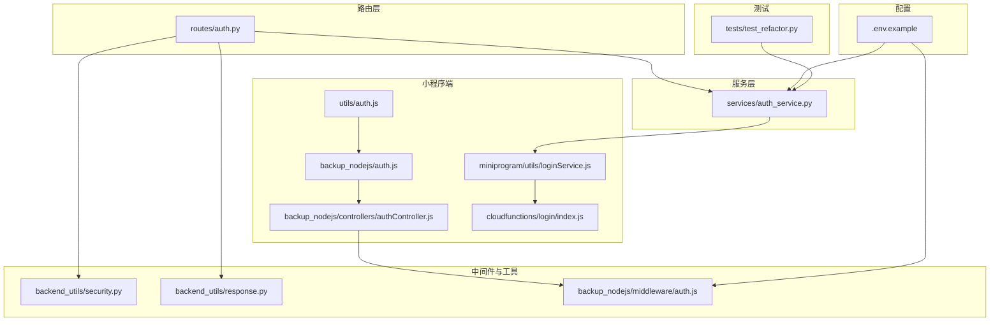
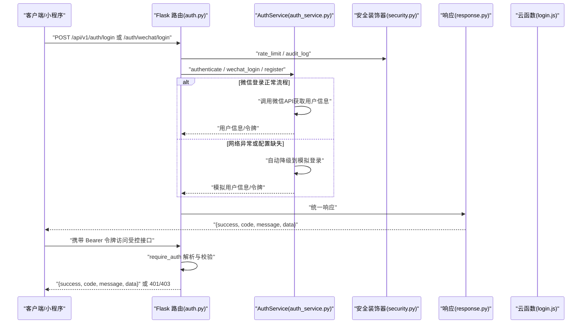
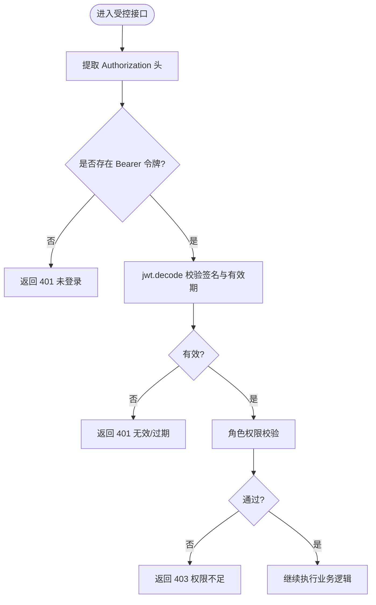
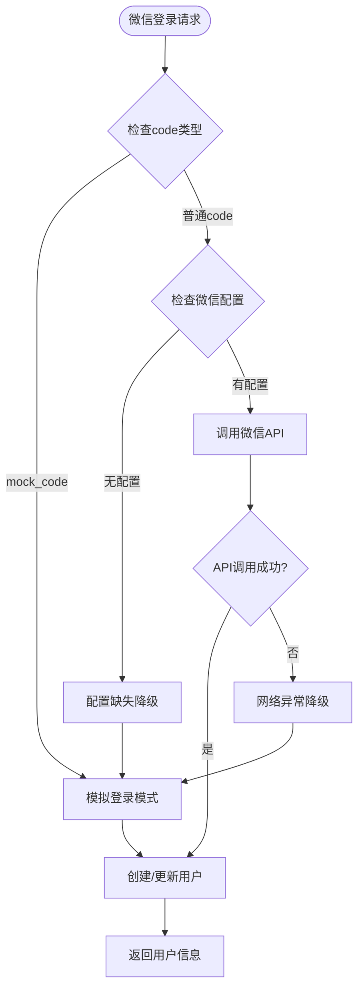
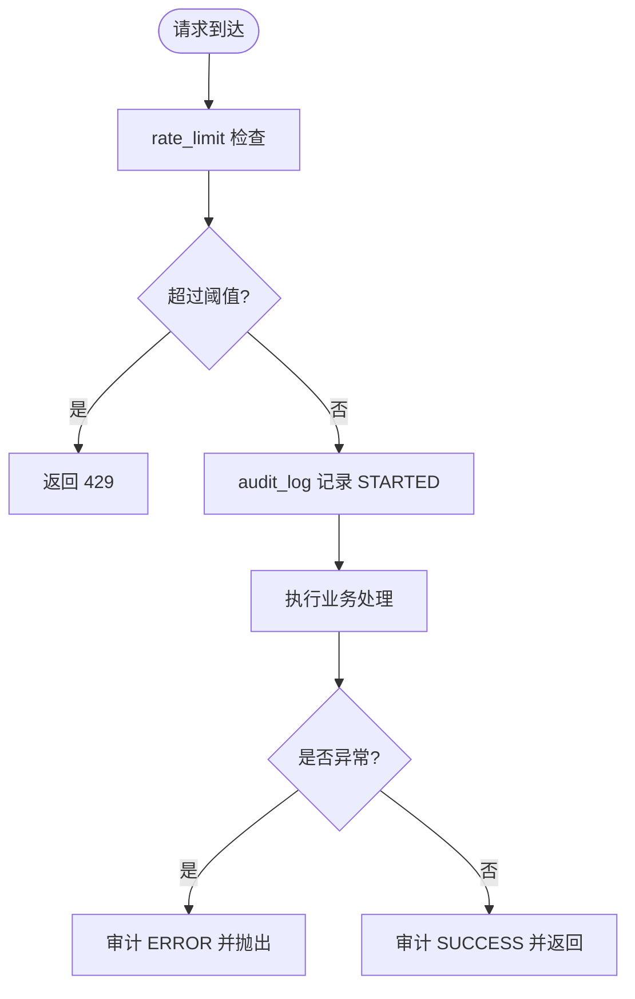
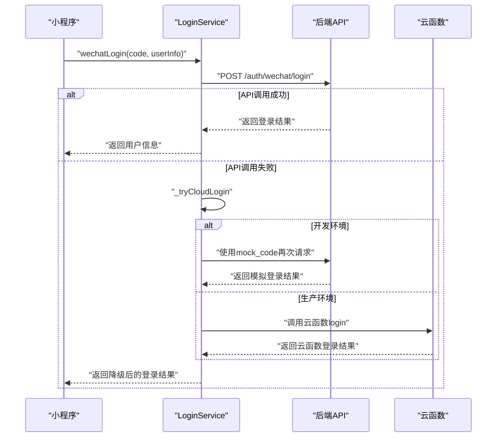
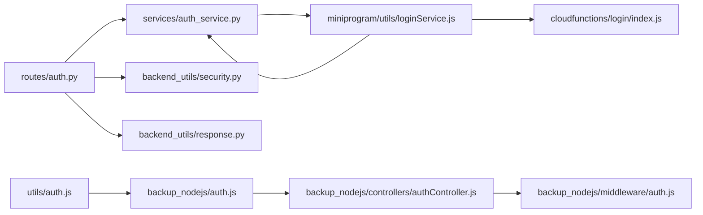

# 认证接口

<cite>
**本文引用的文件**
- [routes/auth.py](file://routes/auth.py)
- [services/auth_service.py](file://services/auth_service.py)
- [backup_nodejs/auth.js](file://backup_nodejs/auth.js)
- [backup_nodejs/controllers/authController.js](file://backup_nodejs/controllers/authController.js)
- [backup_nodejs/middleware/auth.js](file://backup_nodejs/middleware/auth.js)
- [utils/auth.js](file://utils/auth.js)
- [backend_utils/security.py](file://backend_utils/security.py)
- [backend_utils/response.py](file://backend_utils/response.py)
- [miniprogram/utils/loginService.js](file://miniprogram/utils/loginService.js)
- [cloudfunctions/login/index.js](file://cloudfunctions/login/index.js)
- [.env.example](file://.env.example)
- [tests/test_refactor.py](file://tests/test_refactor.py)
</cite>

## 更新摘要
**变更内容**
- 新增微信登录自动降级能力的详细说明
- 补充开发模式下的模拟登录支持
- 增加云函数降级方案的技术细节
- 完善网络异常情况下的容错处理机制

## 目录
1. [简介](#简介)
2. [项目结构](#项目结构)
3. [核心组件](#核心组件)
4. [架构总览](#架构总览)
5. [详细组件分析](#详细组件分析)
6. [依赖关系分析](#依赖关系分析)
7. [性能考量](#性能考量)
8. [故障排除指南](#故障排除指南)
9. [结论](#结论)
10. [附录](#附录)

## 简介
本文件面向后端与前端开发者，系统性梳理本项目的认证接口与令牌管理机制，覆盖以下要点：
- 用户登录：用户名密码、邮箱密码、手机号密码、微信授权登录
- 注册与资料管理：手机号注册、用户资料更新
- 令牌管理：JWT 访问令牌与刷新令牌的签发、轮换与失效控制
- 权限验证：基于装饰器的鉴权与角色校验
- **自动降级机制**：微信登录在网络异常时的智能降级与容错处理
- 安全机制：速率限制、账户锁定、审计日志、密钥配置
- 请求与响应规范：参数、状态码、错误处理策略
- 示例：登录、获取与刷新令牌、权限受控接口调用

## 项目结构
围绕认证的关键目录与文件如下：
- 路由层：定义认证相关接口与鉴权装饰器
- 服务层：封装登录、注册、令牌签发与刷新、微信登录等业务逻辑
- 中间件与工具：通用响应格式、安全装饰器（限流、审计）、小程序端登录工具
- **降级层**：微信登录自动降级、云函数降级、开发模式模拟登录
- 配置：密钥与算法、默认管理员账号等
- 测试：服务层与端点的基本行为验证

**图表来源**
- [routes/auth.py](file://routes/auth.py#L1-L437)
- [services/auth_service.py](file://services/auth_service.py#L1-L538)
- [miniprogram/utils/loginService.js](file://miniprogram/utils/loginService.js#L1-L492)
- [cloudfunctions/login/index.js](file://cloudfunctions/login/index.js#L1-L92)
- [tests/test_refactor.py](file://tests/test_refactor.py#L60-L83)

## 核心组件
- 路由与鉴权装饰器
  - Bearer 令牌解析与校验
  - 角色权限校验
- 服务层
  - 登录（用户名/邮箱/手机）、注册、微信登录
  - **自动降级机制**：网络异常时的智能降级策略
  - 令牌签发（Access/Refresh）、刷新令牌、会话存储
  - 密码哈希与校验
- 安全工具
  - 速率限制、账户锁定、审计日志
- 响应格式
  - 统一成功/错误响应结构
- 小程序端登录
  - **多层次降级流程**：后端API→云函数→开发模式模拟登录
  - 微信登录流程封装与本地存储

**章节来源**
- [routes/auth.py](file://routes/auth.py#L21-L72)
- [services/auth_service.py](file://services/auth_service.py#L86-L161)
- [services/auth_service.py](file://services/auth_service.py#L265-L453)
- [miniprogram/utils/loginService.js](file://miniprogram/utils/loginService.js#L12-L115)

## 架构总览
认证整体流程分为三段：登录/注册阶段、令牌签发与存储阶段、请求携带令牌访问受控资源阶段。**新增的自动降级机制**确保了在各种网络异常情况下的系统可用性。

**图表来源**
- [routes/auth.py](file://routes/auth.py#L74-L357)
- [services/auth_service.py](file://services/auth_service.py#L265-L453)
- [miniprogram/utils/loginService.js](file://miniprogram/utils/loginService.js#L12-L115)

## 详细组件分析

### 路由与鉴权装饰器
- Bearer 令牌提取与校验
  - 从 Authorization 头部提取 Bearer 令牌
  - 使用服务层配置的密钥与算法进行解码
  - 失败时返回 401
- 角色权限校验
  - require_roles 对比载荷中的角色与允许集合
  - 不满足时返回 403
- 受控接口示例
  - GET /api/v1/auth/me
  - PUT /api/v1/auth/me
  - GET/POST /api/v1/auth/users（管理员）

**图表来源**
- [routes/auth.py](file://routes/auth.py#L21-L72)

**章节来源**
- [routes/auth.py](file://routes/auth.py#L21-L72)

### 服务层：登录、注册与令牌管理
- 登录方式
  - 用户名/密码：authenticate_admin
  - 邮箱密码：login_by_email
  - 手机号密码：login_by_phone
  - **微信授权登录：wechat_login（具备自动降级能力）**
- 注册
  - register_user：手机号+密码注册，自动同步用户身份
- 令牌管理
  - issue_token：签发 Access/Refresh 令牌，存储刷新令牌哈希到会话表
  - refresh_token：校验刷新令牌、撤销旧会话、签发新令牌
- 密码安全
  - PBKDF2-HMAC-SHA256 哈希与常量时间比较
- **自动降级机制**
  - **开发模式支持**：使用 `mock_code` 触发模拟登录
  - **配置缺失降级**：缺少微信配置时自动切换到模拟模式
  - **网络异常降级**：微信API请求失败时自动降级到模拟登录
  - **数据库连接降级**：数据库不可用时返回内存中的模拟用户数据

**图表来源**
- [services/auth_service.py](file://services/auth_service.py#L265-L453)

**章节来源**
- [services/auth_service.py](file://services/auth_service.py#L86-L161)
- [services/auth_service.py](file://services/auth_service.py#L265-L453)
- [services/auth_service.py](file://services/auth_service.py#L196-L225)
- [services/auth_service.py](file://services/auth_service.py#L253-L331)
- [services/auth_service.py](file://services/auth_service.py#L356-L411)

### 安全装饰器与响应格式
- 速率限制
  - 基于 IP+端点 的滑动窗口计数
  - 超限时返回 429
- 账户锁定
  - 多次失败尝试触发 15 分钟锁定
- 审计日志
  - 记录用户、IP、动作与状态（成功/失败/错误）
- 统一响应
  - success_response/error_response/flask_success_response/flask_error_response

**图表来源**
- [backend_utils/security.py](file://backend_utils/security.py#L17-L117)
- [backend_utils/response.py](file://backend_utils/response.py#L64-L93)

**章节来源**
- [backend_utils/security.py](file://backend_utils/security.py#L17-L117)
- [backend_utils/response.py](file://backend_utils/response.py#L11-L93)

### 小程序端登录与令牌持久化
- 小程序登录流程
  - 调用 wx.login 获取临时 code
  - **优先调用后端API进行微信登录**
  - **后端失败时自动降级到云函数登录**
  - **开发模式下使用模拟登录**
  - 成功后将 token 与用户信息写入本地缓存
- **多层次降级策略**
  - **后端API登录**：优先尝试调用本地/后端API登录
  - **云函数降级**：后端API失败时尝试云函数登录（仅生产环境）
  - **开发模式模拟**：开发环境下使用特殊的 `mock_code` 触发后端模拟登录
  - **前端Mock降级**：最终降级到纯前端模拟数据
- Node.js 路由与控制器
  - /auth/wechat/login 路由映射至控制器
  - 控制器处理微信登录、更新/创建用户并签发令牌
- 传统 Web 端 JWT 中间件
  - 校验 Bearer 令牌并注入用户信息

**图表来源**
- [miniprogram/utils/loginService.js](file://miniprogram/utils/loginService.js#L12-L115)
- [cloudfunctions/login/index.js](file://cloudfunctions/login/index.js#L11-L92)

**章节来源**
- [miniprogram/utils/loginService.js](file://miniprogram/utils/loginService.js#L12-L115)
- [cloudfunctions/login/index.js](file://cloudfunctions/login/index.js#L11-L92)
- [backup_nodejs/auth.js](file://backup_nodejs/auth.js#L5-L9)
- [backup_nodejs/controllers/authController.js](file://backup_nodejs/controllers/authController.js#L28-L92)
- [backup_nodejs/middleware/auth.js](file://backup_nodejs/middleware/auth.js#L21-L30)

## 依赖关系分析
- 路由依赖服务层与安全装饰器
- 服务层依赖模型层（用户、会话）与外部微信接口
- **新增降级层**：小程序端LoginService依赖云函数和后端API
- 响应与安全工具被路由与控制器复用
- 小程序端依赖 Node.js 路由与控制器

**图表来源**
- [routes/auth.py](file://routes/auth.py#L1-L437)
- [services/auth_service.py](file://services/auth_service.py#L1-L538)
- [miniprogram/utils/loginService.js](file://miniprogram/utils/loginService.js#L1-L492)
- [cloudfunctions/login/index.js](file://cloudfunctions/login/index.js#L1-L92)

**章节来源**
- [routes/auth.py](file://routes/auth.py#L1-L437)
- [services/auth_service.py](file://services/auth_service.py#L1-L538)
- [miniprogram/utils/loginService.js](file://miniprogram/utils/loginService.js#L1-L492)
- [cloudfunctions/login/index.js](file://cloudfunctions/login/index.js#L1-L92)

## 性能考量
- 令牌有效期
  - Access 令牌：15 分钟
  - Refresh 令牌：7 天
- 速率限制
  - 登录/注册/验证码等高频接口设置合理窗口与阈值，避免暴力破解与滥用
- 会话存储
  - 刷新令牌哈希入库，支持撤销与轮换，降低泄露风险
- **自动降级性能优化**
  - **开发模式下的快速响应**：使用内存中的模拟用户数据，避免数据库查询
  - **云函数降级的异步处理**：不影响主流程，提供备用登录通道
  - **网络异常的快速失败**：减少超时等待，提升用户体验
- 建议
  - 将速率限制与账户锁定迁移到 Redis，以支持多实例部署
  - 对微信登录接口增加缓存与降级策略

## 故障排除指南
- 401 未登录或登录已过期
  - 检查 Authorization 头是否为 Bearer 令牌
  - 校验 JWT_SECRET 与算法配置
  - 确认令牌未过期
- 403 权限不足
  - 检查用户角色与接口所需角色
- 429 请求过于频繁
  - 降低请求频率或调整速率限制参数
- 账户被锁定
  - 多次失败登录导致 15 分钟锁定，等待后重试
- **微信登录异常**
  - **检查微信配置**：确认 WX_APPID 和 WX_SECRET 已正确配置
  - **网络连接问题**：验证微信API可达性
  - **开发模式降级**：使用 `mock_code` 进行开发测试
  - **云函数降级**：在生产环境检查云函数配置
- 审计日志
  - 查看日志中 AUDIT 记录，定位失败原因

**章节来源**
- [routes/auth.py](file://routes/auth.py#L33-L54)
- [services/auth_service.py](file://services/auth_service.py#L265-L453)
- [backend_utils/security.py](file://backend_utils/security.py#L17-L117)

## 结论
本项目提供了完善的认证与授权能力：支持多种登录方式、完善的令牌生命周期管理、基础的安全装饰器与审计日志，并在小程序端提供便捷的登录封装。**新增的自动降级机制**显著提升了系统的容错能力和用户体验，确保在网络异常或配置缺失的情况下仍能提供基本的登录功能。建议在生产环境中：
- 使用强密钥并妥善保管
- 引入 Redis 实现速率限制与账户锁定
- 对敏感接口启用更严格的风控策略
- **充分利用自动降级机制**：在开发和测试环境中使用模拟登录，在生产环境中配置云函数作为备用登录通道

## 附录

### 接口定义与示例

- 登录（用户名/密码）
  - 方法与路径：POST /api/v1/auth/login
  - 请求体
    - username: string（必填）
    - password: string（必填）
  - 响应
    - token: string
    - tokenType: string（固定为 Bearer）
    - expiresIn: number（秒）
    - role: string
  - 状态码：200 成功；400 参数缺失；401 登录失败
  - 示例
    - 请求：POST /api/v1/auth/login，Body: { "username": "...", "password": "..." }
    - 成功响应：{ "success": true, "data": { "token": "...", "tokenType": "Bearer", "expiresIn": 86400, "role": "..." } }

- 登录（邮箱密码）
  - 方法与路径：POST /api/v1/auth/login/email
  - 请求体
    - email: string（必填）
    - password: string（必填）
  - 响应
    - token/access_token/refresh_token: string
    - openid: string
    - nickname/avatar/phone: string
  - 状态码：200 成功；400 参数缺失；401 登录失败
  - 示例
    - 请求：POST /api/v1/auth/login/email，Body: { "email": "...", "password": "..." }
    - 成功响应：{ "success": true, "data": { "token": "...", "openid": "...", ... } }

- 登录（手机号密码）
  - 方法与路径：POST /api/v1/auth/login/phone
  - 请求体
    - phone: string（必填）
    - password: string（必填）
  - 响应
    - token/access_token/refresh_token: string
    - openid: string
    - nickname/avatar/phone: string
  - 状态码：200 成功；400 参数缺失；401 登录失败
  - 示例
    - 请求：POST /api/v1/auth/login/phone，Body: { "phone": "...", "password": "..." }
    - 成功响应：{ "success": true, "data": { "token": "...", "openid": "...", ... } }

- **微信授权登录（小程序）**
  - 方法与路径：POST /auth/wechat/login
  - 请求体
    - code: string（必填）
    - userInfo: object（可选）
  - **响应**
    - **正常模式**：token: string, openid: string, unionid: string, nickname: string, avatar: string, phone: string
    - **开发模式**：返回模拟用户信息，包含 mock_openid 前缀
    - **云函数降级**：返回云函数生成的登录结果
  - **状态码**：200 成功；400 参数缺失；500 微信登录失败
  - **示例**
    - 请求：POST /auth/wechat/login，Body: { "code": "mock_code" }
    - 成功响应：{ "success": true, "data": { "token": "...", "openid": "mock_openid_...", ... } }

- 注册（手机号）
  - 方法与路径：POST /api/v1/auth/register
  - 请求体
    - phone: string（必填）
    - password: string（必填）
    - email: string（可选）
    - nickname: string（可选）
  - 响应
    - token/access_token/refresh_token: string
    - openid: string
    - nickname/avatar/phone: string
  - 状态码：200 成功；400 注册失败（如已存在）
  - 示例
    - 请求：POST /api/v1/auth/register，Body: { "phone": "...", "password": "..." }
    - 成功响应：{ "success": true, "data": { "token": "...", "openid": "...", ... } }

- 刷新令牌
  - 方法与路径：POST /api/v1/auth/token/refresh
  - 请求体
    - refresh_token: string（必填）
  - 响应
    - token/access_token/refresh_token: string
    - expires_in: number
  - 状态码：200 成功；400 缺少 refresh_token；401 刷新失败
  - 示例
    - 请求：POST /api/v1/auth/token/refresh，Body: { "refresh_token": "..." }
    - 成功响应：{ "success": true, "data": { "access_token": "...", "refresh_token": "...", "expires_in": 900 } }

- 获取当前用户信息
  - 方法与路径：GET /api/v1/auth/me
  - 请求头
    - Authorization: Bearer <token>
  - 响应
    - username: string
    - role: string
    - nickname/avatar/phone/openid/unionid: string（当角色为 user 时）
  - 状态码：200 成功；401 未登录；403 权限不足
  - 示例
    - 请求：GET /api/v1/auth/me，Headers: { "Authorization": "Bearer ..." }
    - 成功响应：{ "success": true, "data": { "username": "...", "role": "...", ... } }

- 更新用户资料（仅用户）
  - 方法与路径：PUT /api/v1/auth/me
  - 请求头
    - Authorization: Bearer <token>
  - 请求体
    - nickname/avatar/phone: string（可选）
  - 响应
    - message: string
  - 状态码：200 成功；403 非用户角色；401 未登录
  - 示例
    - 请求：PUT /api/v1/auth/me，Headers: { "Authorization": "Bearer ..." }, Body: { "nickname": "..." }
    - 成功响应：{ "success": true, "message": "更新成功" }

- 管理员用户管理（需管理员）
  - 列表：GET /api/v1/auth/users
  - 新增/修改：POST /api/v1/auth/users
  - 删除：DELETE /api/v1/auth/users/<username>
  - 状态码：200 成功；401/403/400/404 视情况而定
  - 示例
    - 请求：POST /api/v1/auth/users，Body: { "username": "...", "password": "...", "role": "viewer" }
    - 成功响应：{ "success": true, "message": "保存成功" }

**章节来源**
- [routes/auth.py](file://routes/auth.py#L74-L357)
- [backup_nodejs/auth.js](file://backup_nodejs/auth.js#L5-L21)
- [backup_nodejs/controllers/authController.js](file://backup_nodejs/controllers/authController.js#L28-L92)
- [miniprogram/utils/loginService.js](file://miniprogram/utils/loginService.js#L12-L115)

### 令牌格式与有效期
- 令牌类型
  - Access 令牌：短期有效，用于日常受控接口访问
  - Refresh 令牌：长期有效，用于刷新 Access 令牌
- 有效期
  - Access：900 秒（15 分钟）
  - Refresh：604800 秒（7 天）
- 存储与轮换
  - 刷新令牌哈希入库，刷新时撤销旧会话并签发新令牌

**章节来源**
- [services/auth_service.py](file://services/auth_service.py#L86-L131)
- [services/auth_service.py](file://services/auth_service.py#L133-L161)

### 安全考虑与最佳实践
- 密钥与算法
  - 生产环境务必设置 JWT_SECRET，算法建议 HS256
- CSRF 防护
  - 本项目采用 Bearer 令牌，天然规避 CSRF；仍建议对敏感操作启用二次验证或验证码
- 会话管理
  - 刷新令牌轮换与撤销，缩短 Access 令牌有效期
- 速率限制与账户锁定
  - 登录/注册/验证码接口已内置限流与锁定策略
- 审计日志
  - 记录登录、注册、密码重置等关键动作，便于追踪与审计
- **自动降级安全**
  - **开发模式模拟登录**：仅用于开发测试，不涉及真实用户数据
  - **云函数降级**：生产环境的备用登录通道，确保系统可用性
  - **降级日志记录**：详细记录降级触发条件和处理结果

**章节来源**
- [.env.example](file://.env.example#L13-L17)
- [services/auth_service.py](file://services/auth_service.py#L265-L453)
- [backend_utils/security.py](file://backend_utils/security.py#L17-L117)

### 微信登录自动降级机制

#### 后端服务层降级策略
- **开发模式支持**
  - 使用 `mock_code` 触发模拟登录，适用于开发和测试环境
  - 返回内存中的模拟用户数据，避免数据库依赖
- **配置缺失降级**
  - 当缺少微信配置时自动切换到模拟登录模式
  - 支持生产环境的测试场景
- **网络异常降级**
  - 微信API请求失败时自动降级到模拟登录
  - 返回带有 "(离线)" 标识的模拟用户信息
- **数据库连接降级**
  - 数据库不可用时返回内存中的用户数据
  - 确保系统在数据库故障时仍可运行

#### 小程序端降级流程
- **优先级策略**
  1. 首先尝试调用后端API进行微信登录
  2. 后端API失败时尝试云函数登录（仅生产环境）
  3. 开发环境下使用 `mock_code` 触发后端模拟登录
  4. 最终降级到纯前端模拟数据
- **环境检测**
  - 自动检测小程序运行环境（开发/体验/正式）
  - 根据环境选择合适的降级策略
- **用户提示**
  - 在降级过程中向用户提供清晰的状态提示
  - 允许用户选择是否使用模拟数据继续

#### 云函数降级方案
- **云函数实现**
  - 提供独立的云函数登录入口
  - 支持用户信息的云端存储和管理
- **应用场景**
  - 生产环境的备用登录通道
  - 网络不稳定时的临时解决方案
  - 数据库连接异常时的应急措施

**章节来源**
- [services/auth_service.py](file://services/auth_service.py#L265-L453)
- [miniprogram/utils/loginService.js](file://miniprogram/utils/loginService.js#L12-L115)
- [cloudfunctions/login/index.js](file://cloudfunctions/login/index.js#L11-L92)

### 测试参考
- 单元测试要点
  - 密码哈希与校验
  - 令牌签发结构校验
  - 管理员登录端点返回 JSON 结构
  - **微信登录降级功能测试**
- 建议
  - 使用 Mock 模拟数据库与微信接口，提升测试稳定性
  - **测试开发模式下的模拟登录**
  - **测试网络异常时的降级行为**
  - **测试云函数降级场景**

**章节来源**
- [tests/test_refactor.py](file://tests/test_refactor.py#L68-L83)