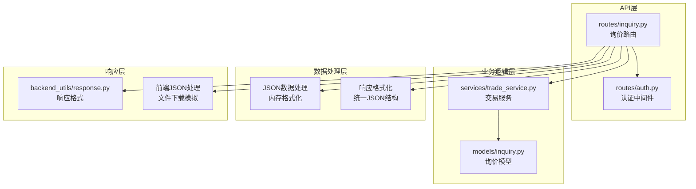
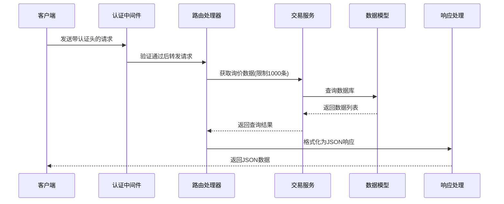
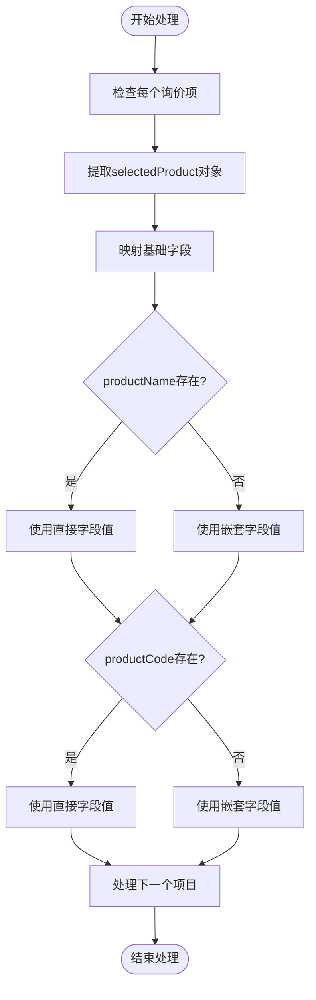
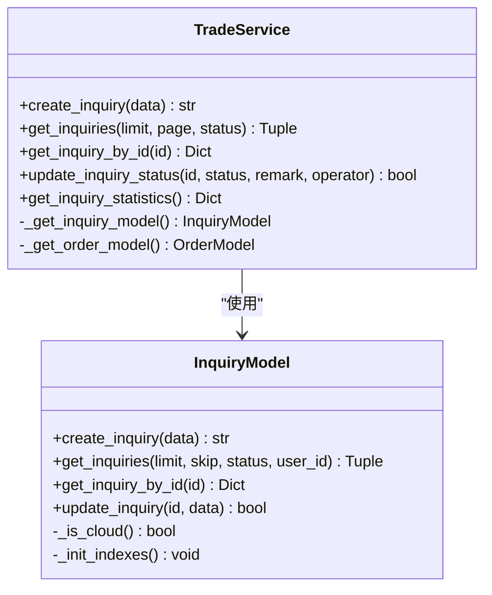
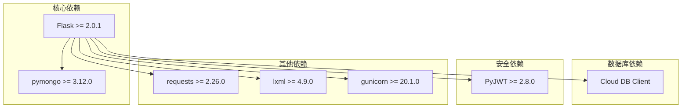
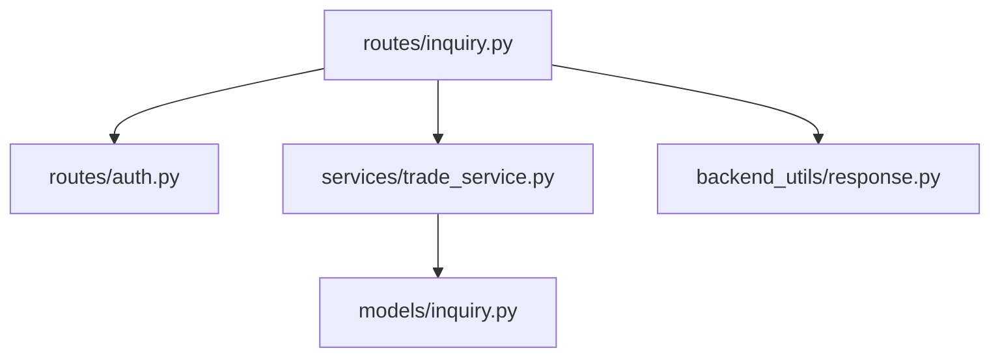
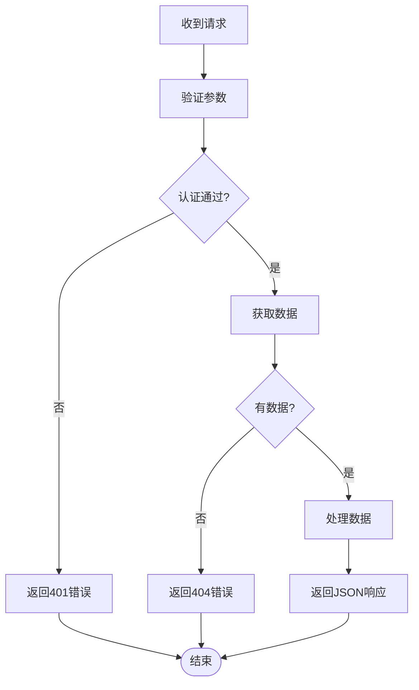

# 询价导出接口

<cite>
**本文档引用的文件**
- [routes/inquiry.py](file://routes/inquiry.py)
- [models/inquiry.py](file://models/inquiry.py)
- [services/trade_service.py](file://services/trade_service.py)
- [backend_utils/response.py](file://backend_utils/response.py)
- [routes/auth.py](file://routes/auth.py)
- [requirements.txt](file://requirements.txt)
- [admin-ui/src/pages/Inquiries.tsx](file://admin-ui/src/pages/Inquiries.tsx)
</cite>

## 更新摘要
**变更内容**
- 询价导出功能从Excel文件导出改为JSON响应格式
- 移除了pandas和openpyxl依赖
- 适配云托管环境部署需求
- 前端导出逻辑从文件下载改为JSON数据处理

## 目录
1. [简介](#简介)
2. [项目结构](#项目结构)
3. [核心组件](#核心组件)
4. [架构概览](#架构概览)
5. [详细组件分析](#详细组件分析)
6. [依赖关系分析](#依赖关系分析)
7. [性能考虑](#性能考虑)
8. [故障排除指南](#故障排除指南)
9. [结论](#结论)

## 简介

本文档详细记录了场外期权系统的询价导出接口API，该接口实现了将询价数据导出为JSON格式的功能。该功能支持按状态筛选导出，并包含完整的数据映射、格式化规则和错误处理机制。

**更新** 该功能已从Excel文件导出迁移到JSON响应格式，移除了对pandas和openpyxl库的依赖，更好地适应云托管环境部署需求。

## 项目结构

询价导出功能涉及以下关键组件：

**图表来源**
- [routes/inquiry.py](file://routes/inquiry.py#L1-L165)
- [services/trade_service.py](file://services/trade_service.py#L1-L318)
- [models/inquiry.py](file://models/inquiry.py#L1-L148)

**章节来源**
- [routes/inquiry.py](file://routes/inquiry.py#L1-L165)
- [services/trade_service.py](file://services/trade_service.py#L1-L318)
- [models/inquiry.py](file://models/inquiry.py#L1-L148)

## 核心组件

### API端点定义

询价导出接口的核心定义如下：

- **HTTP方法**: GET
- **端点路径**: `/api/v1/admin/inquiries/export`
- **认证要求**: 需要管理员身份验证
- **功能描述**: 导出询价列表数据为JSON格式

### 请求参数

| 参数名 | 类型 | 必需 | 默认值 | 描述 |
|--------|------|------|--------|------|
| status | string | 否 | null | 询价状态过滤条件 |
| page | integer | 否 | 1 | 页码（固定为1） |
| limit | integer | 否 | 1000 | 导出记录限制 |

### 响应格式

系统支持JSON响应格式：
- **JSON响应**: 包含导出数据和元信息
- **错误响应**: 标准化的错误格式

**章节来源**
- [routes/inquiry.py](file://routes/inquiry.py#L124-L165)

## 架构概览

询价导出功能采用分层架构设计，确保职责分离和代码可维护性：

**图表来源**
- [routes/inquiry.py](file://routes/inquiry.py#L124-L165)
- [services/trade_service.py](file://services/trade_service.py#L42-L45)
- [models/inquiry.py](file://models/inquiry.py#L55-L101)

## 详细组件分析

### 路由处理器组件

路由处理器负责处理HTTP请求和响应，包含完整的错误处理机制：

#### 主要功能特性

1. **认证验证**: 使用`@require_auth`装饰器确保只有授权用户可以访问
2. **参数处理**: 解析查询参数并应用默认值
3. **数据限制**: 强制执行1000条记录的导出限制
4. **JSON生成**: 直接生成JSON响应格式
5. **错误处理**: 完整的异常捕获和错误响应

#### 数据映射规则

导出数据包含以下字段映射：

| 导出字段 | 源数据字段 | 映射规则 |
|----------|------------|----------|
| ID | `_id` | 直接映射 |
| 提交时间 | `createdAt` | 直接映射 |
| 客户姓名 | `contactName` | 直接映射 |
| 电话 | `phone` | 直接映射 |
| 产品名称 | `productName` 或 `selectedProduct.name` | 优先使用直接字段，否则使用嵌套字段 |
| 代码 | `productCode` or `selectedProduct.code` | 优先使用直接字段，否则使用嵌套字段 |
| 方向 | `optionType` | 直接映射 |
| 结构 | `structure` | 直接映射 |
| 期限 | `term` | 直接映射 |
| 名义本金(万) | `notionalAmount` | 直接映射 |
| 行权价(%) | `strikePrice` | 直接映射 |
| 状态 | `status` | 直接映射 |
| 备注 | `remark` | 直接映射 |

#### 嵌套字段展开处理

系统实现了智能的嵌套字段处理机制：

**图表来源**
- [routes/inquiry.py](file://routes/inquiry.py#L136-L154)

**章节来源**
- [routes/inquiry.py](file://routes/inquiry.py#L124-L165)

### 服务层组件

交易服务层提供了数据访问和业务逻辑处理：

#### 数据访问模式

服务层采用延迟加载模式，根据应用配置动态选择数据库连接：

**图表来源**
- [services/trade_service.py](file://services/trade_service.py#L8-L94)
- [models/inquiry.py](file://models/inquiry.py#L10-L148)

**章节来源**
- [services/trade_service.py](file://services/trade_service.py#L1-L318)

### 数据模型组件

数据模型层处理底层数据存储和查询逻辑：

#### 数据库适配层

系统支持两种数据库模式：

1. **云数据库模式**: 使用云开发客户端进行查询
2. **本地MongoDB模式**: 使用标准MongoDB驱动

#### 查询优化

模型层实现了索引优化和查询优化：

- `createdAt` 索引用于时间排序
- `status` 索引用于状态过滤  
- `phone` 索引用于电话号码查询

**章节来源**
- [models/inquiry.py](file://models/inquiry.py#L24-L31)

### 库依赖组件

**更新** 系统已移除了对pandas和openpyxl库的依赖，改用原生JSON处理：

#### 依赖变化

- **移除**: pandas库（>= 1.3.3）
- **移除**: openpyxl库（>= 3.0.9）
- **保留**: Flask、PyMongo、PyJWT等核心依赖

#### 内存管理

系统采用内存流处理方式：

**图表来源**
- [routes/inquiry.py](file://routes/inquiry.py#L156-L161)

**章节来源**
- [requirements.txt](file://requirements.txt#L1-L12)

## 依赖关系分析

### 外部依赖

系统对外部库的依赖关系如下：

**图表来源**
- [requirements.txt](file://requirements.txt#L1-L12)

### 内部依赖

系统内部组件之间的依赖关系：

**图表来源**
- [routes/inquiry.py](file://routes/inquiry.py#L1-L9)
- [services/trade_service.py](file://services/trade_service.py#L12-L22)

**章节来源**
- [requirements.txt](file://requirements.txt#L1-L12)

## 性能考虑

### 导出限制机制

系统实施了严格的导出限制以确保性能和稳定性：

- **记录限制**: 最大导出1000条记录
- **内存控制**: 直接生成JSON响应，避免额外的文件处理开销
- **网络传输**: JSON数据直接在网络上传输

### 性能优化策略

1. **数据库查询优化**: 使用索引和适当的查询条件
2. **内存管理**: 直接生成JSON响应，减少中间处理步骤
3. **并发处理**: 支持多用户同时导出操作
4. **缓存机制**: 对常用查询结果进行缓存

### 大数据量处理

对于大量数据导出，建议采用以下策略：

1. **分页导出**: 使用分页参数分批获取数据
2. **流式处理**: 前端实现流式JSON处理
3. **异步处理**: 实现后台任务队列处理大型导出
4. **压缩传输**: 对导出数据进行压缩以减少传输时间

## 故障排除指南

### 常见错误及解决方案

#### 认证失败

**错误表现**: 返回401未授权错误
**可能原因**: 
- 缺少Authorization头部
- 令牌过期或无效
**解决方法**: 
- 确保请求包含有效的Bearer令牌
- 重新登录获取新令牌

#### 数据为空

**错误表现**: 返回404没有数据可导出
**可能原因**:
- 查询条件过于严格
- 数据库中没有符合条件的记录
**解决方法**:
- 检查查询参数是否正确
- 尝试放宽查询条件

#### 导出失败

**错误表现**: 导出过程中出现异常
**可能原因**:
- 数据库连接问题
- 内存不足
- 数据格式异常
**解决方法**:
- 检查数据库连接状态
- 减少导出记录数量
- 验证数据完整性

### 错误处理机制

系统实现了多层次的错误处理：

**图表来源**
- [routes/inquiry.py](file://routes/inquiry.py#L128-L164)

**章节来源**
- [routes/inquiry.py](file://routes/inquiry.py#L128-L164)

## 结论

询价导出接口实现了高效、可靠的JSON数据导出功能。通过移除对pandas和openpyxl库的依赖，该功能更好地适应了云托管环境部署需求，同时保持了良好的性能和可靠性。

### 关键优势

1. **安全性**: 完整的认证和授权机制
2. **性能**: 导出限制和直接JSON响应
3. **可靠性**: 全面的错误处理和日志记录
4. **云适配**: 移除外部库依赖，更好适应云环境
5. **扩展性**: 模块化设计便于功能扩展

### 改进建议

1. **异步处理**: 实现后台导出任务以处理大数据量
2. **格式定制**: 支持多种导出格式（CSV、PDF等）
3. **进度反馈**: 提供导出进度和状态反馈
4. **缓存优化**: 实现查询结果缓存以提高性能
5. **前端优化**: 改进前端JSON处理和下载体验