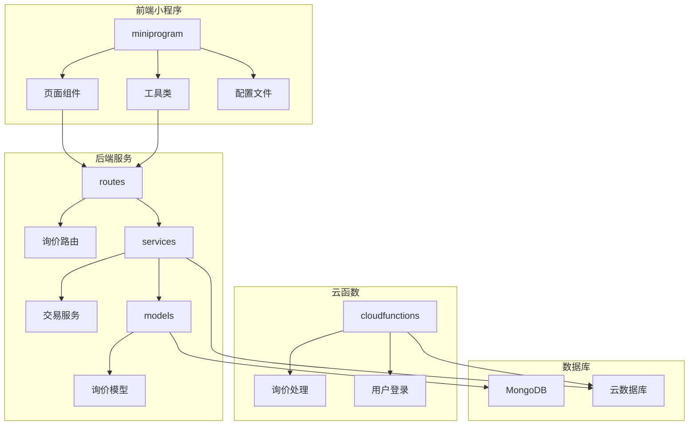
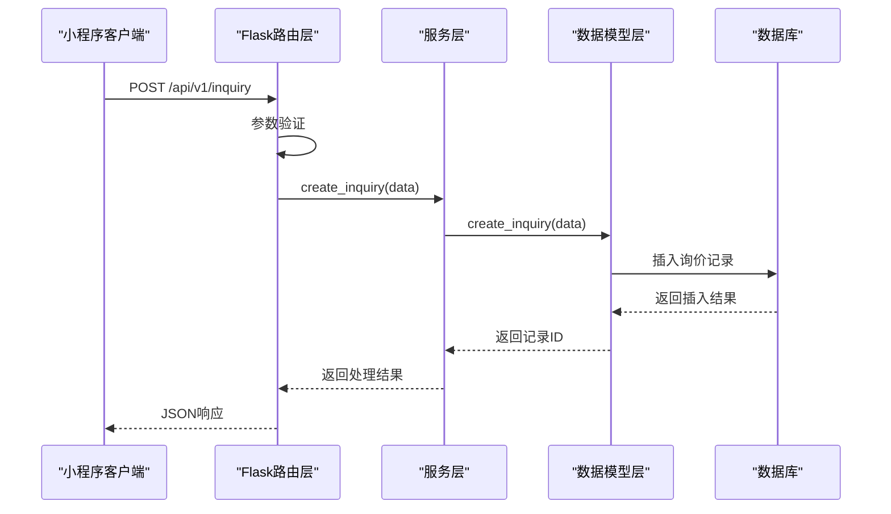
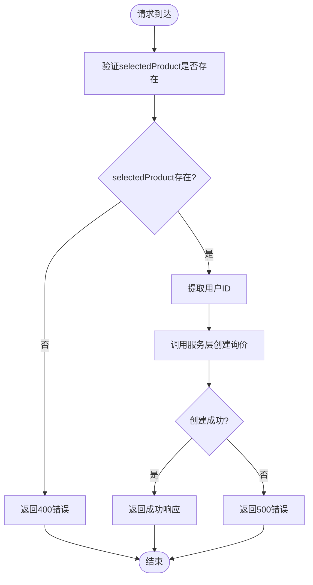
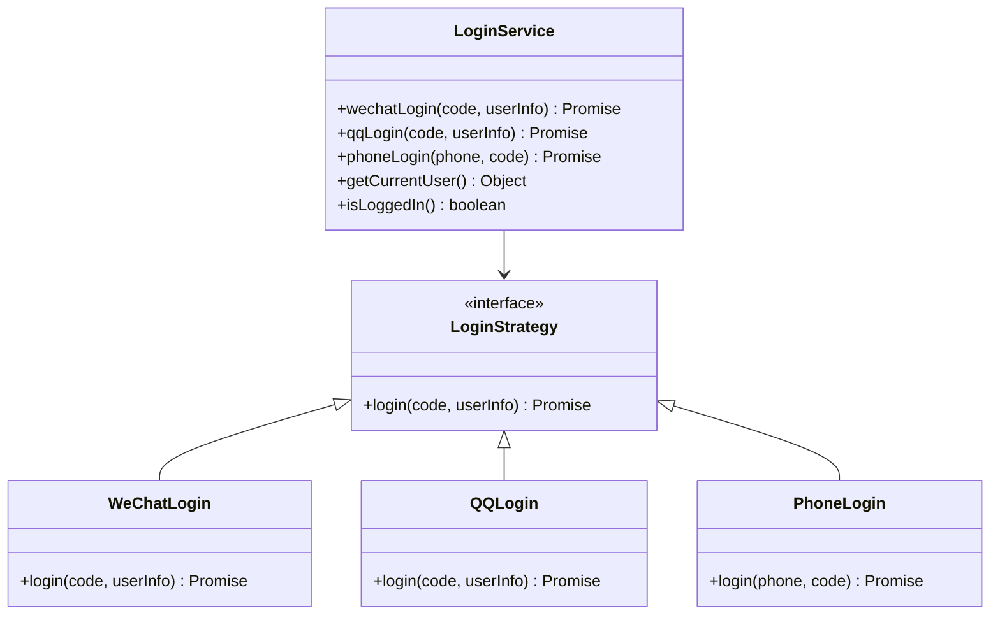
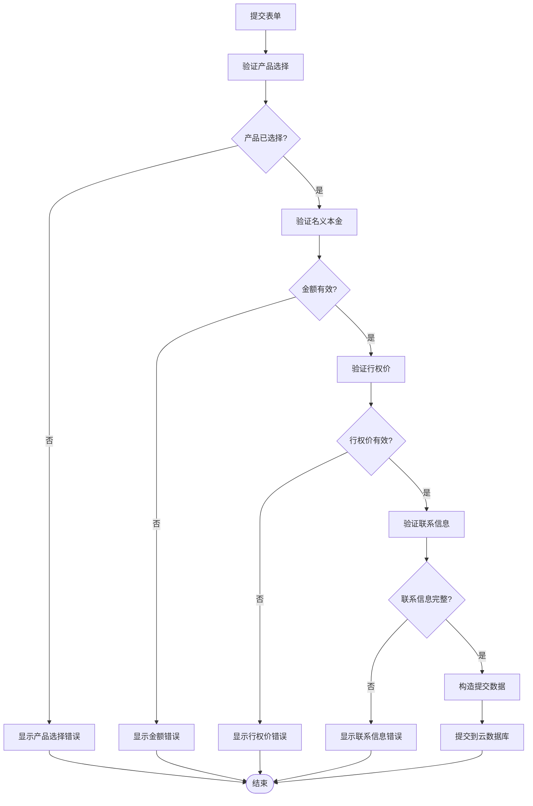
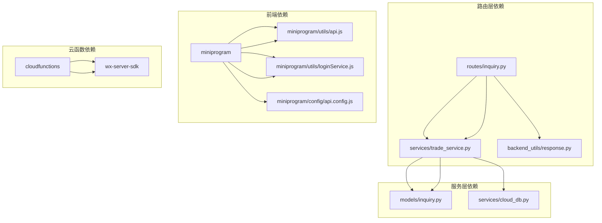

# 询价提交接口

<cite>
**本文档引用的文件**
- [routes/inquiry.py](file://routes/inquiry.py)
- [models/inquiry.py](file://models/inquiry.py)
- [services/trade_service.py](file://services/trade_service.py)
- [miniprogram/pages/inquiry/inquiry.js](file://miniprogram/pages/inquiry/inquiry.js)
- [miniprogram/utils/api.js](file://miniprogram/utils/api.js)
- [miniprogram/utils/loginService.js](file://miniprogram/utils/loginService.js)
- [cloudfunctions/handleInquiry/index.js](file://cloudfunctions/handleInquiry/index.js)
- [cloudfunctions/login/index.js](file://cloudfunctions/login/index.js)
- [INQUIRY_ENHANCEMENT_REPORT.md](file://INQUIRY_ENHANCEMENT_REPORT.md)
- [miniprogram/config/api.config.js](file://miniprogram/config/api.config.js)
</cite>

## 目录
1. [简介](#简介)
2. [项目结构](#项目结构)
3. [核心组件](#核心组件)
4. [架构概览](#架构概览)
5. [详细组件分析](#详细组件分析)
6. [依赖关系分析](#依赖关系分析)
7. [性能考虑](#性能考虑)
8. [故障排除指南](#故障排除指南)
9. [结论](#结论)

## 简介

本文档详细描述了场外期权交易系统中的询价提交接口，重点分析POST /api/v1/inquiry接口的完整实现。该接口允许用户提交期权询价请求，系统会验证请求参数、处理业务逻辑并将数据存储到数据库中。

该系统采用前后端分离架构，前端为微信小程序，后端为Python Flask服务，数据存储使用MongoDB。系统支持多种登录方式，包括微信登录、QQ登录和手机号登录，并提供了完整的用户身份识别和openid关联机制。

## 项目结构

系统采用模块化设计，主要包含以下核心模块：

**图表来源**
- [routes/inquiry.py](file://routes/inquiry.py#L1-L175)
- [services/trade_service.py](file://services/trade_service.py#L38-L105)
- [models/inquiry.py](file://models/inquiry.py#L10-L148)

**章节来源**
- [routes/inquiry.py](file://routes/inquiry.py#L1-L175)
- [services/trade_service.py](file://services/trade_service.py#L38-L105)
- [models/inquiry.py](file://models/inquiry.py#L10-L148)

## 核心组件

### 接口路由层
路由层负责接收HTTP请求、参数验证和响应处理。POST /api/v1/inquiry接口实现了基本的请求验证和错误处理机制。

### 服务层
服务层封装了业务逻辑，提供统一的接口供路由层调用。TradeService类负责协调各个模型的操作。

### 数据模型层
模型层处理数据持久化，支持本地MongoDB和云数据库两种存储方式。InquiryModel类提供了完整的CRUD操作。

### 前端交互层
小程序前端提供了完整的用户界面和交互逻辑，包括表单验证、数据提交和状态管理。

**章节来源**
- [routes/inquiry.py](file://routes/inquiry.py#L11-L35)
- [services/trade_service.py](file://services/trade_service.py#L38-L40)
- [models/inquiry.py](file://models/inquiry.py#L32-L53)

## 架构概览

系统采用三层架构设计，确保了良好的可维护性和扩展性：

**图表来源**
- [routes/inquiry.py](file://routes/inquiry.py#L11-L35)
- [services/trade_service.py](file://services/trade_service.py#L38-L40)
- [models/inquiry.py](file://models/inquiry.py#L32-L53)

## 详细组件分析

### 询价提交接口实现

#### 接口定义
POST /api/v1/inquiry - 提交新的期权询价请求

#### 请求参数验证
接口实现了基本的参数验证逻辑：

**图表来源**
- [routes/inquiry.py](file://routes/inquiry.py#L11-L35)

#### 数据模型字段定义

询价数据模型包含以下核心字段：

| 字段名 | 类型 | 必填 | 描述 | 默认值 |
|--------|------|------|------|--------|
| selectedProduct | Object | 是 | 产品信息 | - |
| optionType | String | 否 | 期权类型(call/put) | 'call' |
| structure | String | 否 | 产品结构 | 'vanilla' |
| term | String | 否 | 期限 | '1M' |
| notionalAmount | Number | 否 | 名义本金(万元) | - |
| strikePrice | Number | 否 | 行权价(%) | '100' |
| selectedDealers | Array | 否 | 选中的交易商 | [] |
| contactName | String | 否 | 联系人姓名 | - |
| phone | String | 否 | 联系电话 | - |
| contactEmail | String | 否 | 联系邮箱 | '' |
| notes | String | 否 | 备注信息 | '' |
| status | String | 否 | 状态 | 'pending' |
| createdAt | Date | 否 | 创建时间 | 当前时间 |
| updatedAt | Date | 否 | 更新时间 | 当前时间 |
| userId | String | 否 | 用户ID | 'anonymous_' + 时间戳 |
| userName | String | 否 | 用户名 | '匿名用户' |
| openid | String | 否 | 用户openid | 'anonymous' |
| source | String | 否 | 数据来源 | 'miniprogram' |
| history | Array | 否 | 历史记录 | [] |

#### 业务逻辑处理

系统支持多种用户身份识别机制：

**图表来源**
- [miniprogram/utils/loginService.js](file://miniprogram/utils/loginService.js#L12-L33)
- [cloudfunctions/login/index.js](file://cloudfunctions/login/index.js#L54-L92)

**章节来源**
- [routes/inquiry.py](file://routes/inquiry.py#L11-L35)
- [models/inquiry.py](file://models/inquiry.py#L32-L53)
- [miniprogram/utils/loginService.js](file://miniprogram/utils/loginService.js#L12-L33)

### 前端实现分析

#### 表单验证逻辑
小程序前端实现了完整的表单验证机制：

**图表来源**
- [miniprogram/pages/inquiry/inquiry.js](file://miniprogram/pages/inquiry/inquiry.js#L500-L640)

#### 用户身份识别机制
系统支持多种登录方式，通过LoginService统一管理：

**章节来源**
- [miniprogram/pages/inquiry/inquiry.js](file://miniprogram/pages/inquiry/inquiry.js#L500-L640)
- [miniprogram/utils/loginService.js](file://miniprogram/utils/loginService.js#L12-L33)

### 数据验证规则

#### 必填字段检查
- `selectedProduct`: 必须包含产品名称和代码
- `contactName`: 联系人姓名必须存在
- `contactPhone`: 联系电话必须存在且符合手机号格式

#### 参数格式要求
- 电话号码: 11位数字，以1开头
- 数量: 正整数，最大不超过1,000,000
- 行权价: 数字格式，百分比表示
- 邮箱: 符合标准邮箱格式

#### 业务规则
- 状态默认为'pending'
- 创建时间和更新时间自动设置
- 用户ID支持匿名用户标识

**章节来源**
- [miniprogram/pages/inquiry/inquiry.js](file://miniprogram/pages/inquiry/inquiry.js#L500-L640)

## 依赖关系分析

系统各组件之间的依赖关系如下：

**图表来源**
- [routes/inquiry.py](file://routes/inquiry.py#L1-L10)
- [services/trade_service.py](file://services/trade_service.py#L1-L10)
- [models/inquiry.py](file://models/inquiry.py#L1-L10)

**章节来源**
- [routes/inquiry.py](file://routes/inquiry.py#L1-L10)
- [services/trade_service.py](file://services/trade_service.py#L1-L10)
- [models/inquiry.py](file://models/inquiry.py#L1-L10)

## 性能考虑

### 数据库索引优化
系统实现了多项数据库索引以提升查询性能：

| 索引类型 | 字段 | 性能提升 | 用途 |
|----------|------|----------|------|
| 单字段索引 | createdAt | 60-80% | 时间排序 |
| 单字段索引 | status | 60-80% | 状态筛选 |
| 单字段索引 | phone | 60-80% | 电话查询 |
| 复合索引 | (contactName, status) | 60-80% | 组合查询 |
| 全文索引 | selectedProduct.name | 60-80% | 产品搜索 |
| 全文索引 | selectedProduct.code | 60-80% | 产品代码搜索 |

### 缓存机制
- API响应缓存：5分钟TTL
- 请求队列：支持并发控制和请求去重
- 缓存统计：提供缓存命中率监控

### 并发处理策略
- 最大并发请求数：6个
- 请求优先级：high/normal/low三级
- 请求去重：基于请求方法、URL和参数的组合键
- 指数退避重试：最多3次重试，延迟时间呈指数增长

**章节来源**
- [INQUIRY_ENHANCEMENT_REPORT.md](file://INQUIRY_ENHANCEMENT_REPORT.md#L152-L167)
- [miniprogram/utils/api.js](file://miniprogram/utils/api.js#L10-L20)

## 故障排除指南

### 常见错误类型

#### 1. 参数验证错误
- **错误码**: 400 Bad Request
- **原因**: 缺少必需字段或字段格式不正确
- **解决方案**: 检查请求体中的字段完整性

#### 2. 数据库操作错误
- **错误码**: 500 Internal Server Error
- **原因**: 数据库连接失败或操作异常
- **解决方案**: 检查数据库连接配置和网络状况

#### 3. 用户认证错误
- **错误码**: 401 Unauthorized
- **原因**: Token失效或用户未登录
- **解决方案**: 重新登录获取有效Token

### 调试建议

1. **前端调试**: 使用微信开发者工具的Network面板查看请求详情
2. **后端日志**: 检查Flask应用的日志输出
3. **数据库状态**: 验证MongoDB连接和集合状态
4. **云函数**: 检查云函数的执行日志和错误信息

**章节来源**
- [routes/inquiry.py](file://routes/inquiry.py#L32-L34)
- [miniprogram/utils/api.js](file://miniprogram/utils/api.js#L407-L419)

## 结论

询价提交接口实现了完整的前后端交互流程，具有以下特点：

1. **完整的验证机制**: 前端和后端双重验证确保数据质量
2. **灵活的身份识别**: 支持多种登录方式，提供统一的用户管理
3. **高性能设计**: 通过索引优化、缓存机制和并发控制提升系统性能
4. **良好的扩展性**: 模块化设计便于功能扩展和维护

该接口为场外期权交易系统提供了稳定可靠的询价功能，为后续的功能扩展奠定了坚实的基础。