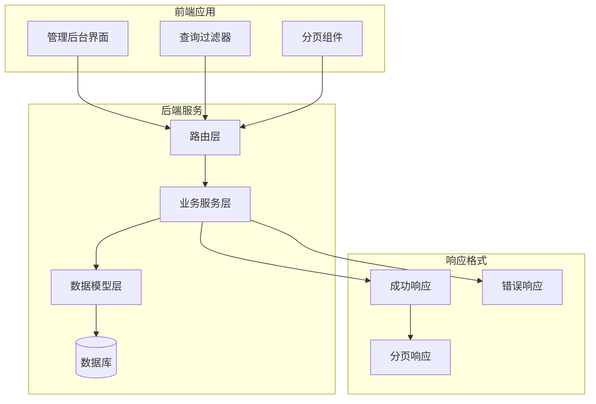
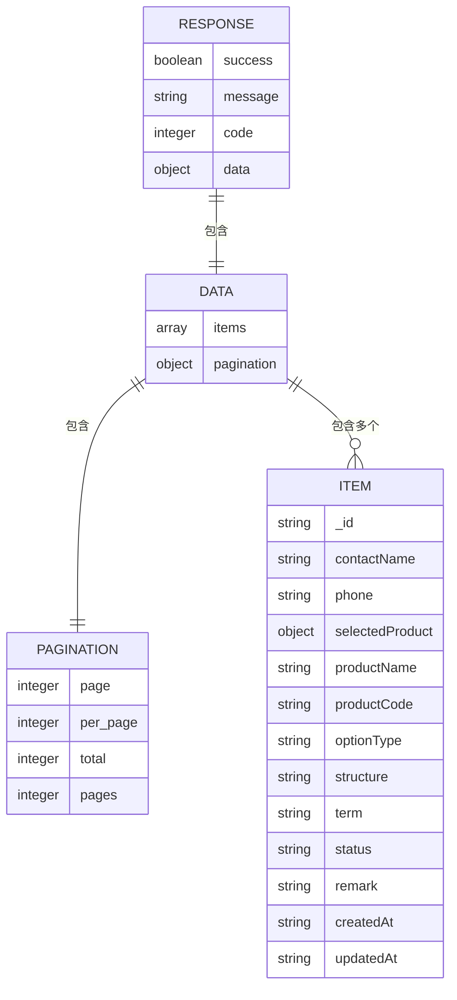
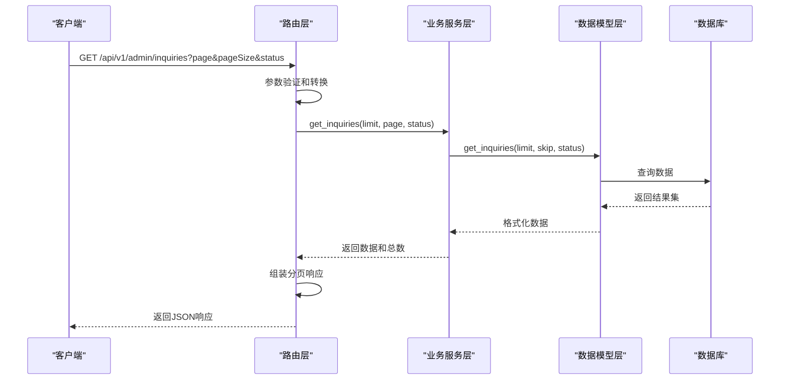
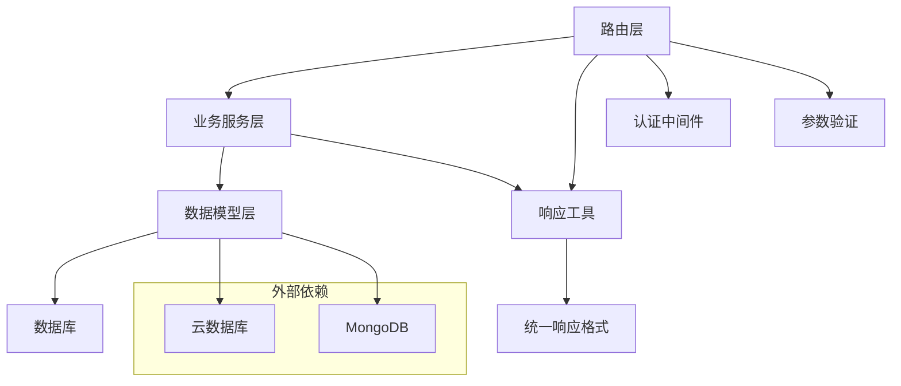
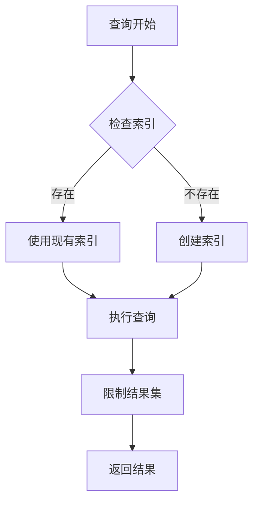

# 询价查询接口

<cite>
**本文档引用的文件**
- [routes/inquiry.py](file://routes/inquiry.py)
- [models/inquiry.py](file://models/inquiry.py)
- [services/trade_service.py](file://services/trade_service.py)
- [backend_utils/response.py](file://backend_utils/response.py)
- [admin-ui/src/pages/Inquiries.tsx](file://admin-ui/src/pages/Inquiries.tsx)
- [tests/test_refactor.py](file://tests/test_refactor.py)
</cite>

## 目录
1. [简介](#简介)
2. [项目结构](#项目结构)
3. [核心组件](#核心组件)
4. [架构概览](#架构概览)
5. [详细组件分析](#详细组件分析)
6. [依赖关系分析](#依赖关系分析)
7. [性能考虑](#性能考虑)
8. [故障排除指南](#故障排除指南)
9. [结论](#结论)

## 简介

本文档详细记录了管理后台询价查询接口的完整API文档。该接口支持分页查询、状态过滤和数据格式化，为后台管理系统提供了完整的询价列表管理功能。

## 项目结构

该功能涉及前后端分离的架构设计：



**图表来源**
- [routes/inquiry.py](file://routes/inquiry.py#L36-L58)
- [services/trade_service.py](file://services/trade_service.py#L42-L45)
- [models/inquiry.py](file://models/inquiry.py#L55-L101)

## 核心组件

### 接口规范

**基础URL**: `/api/v1/admin/inquiries`

**请求方法**: GET

**认证要求**: 需要管理员权限令牌

**查询参数**:

| 参数名 | 类型 | 必填 | 默认值 | 说明 |
|--------|------|------|--------|------|
| page | integer | 否 | 1 | 页码，必须为正整数 |
| pageSize | integer | 否 | 20 | 每页数量，范围1-200 |
| status | string | 否 | 无 | 状态筛选条件 |

**响应格式**:



**图表来源**
- [backend_utils/response.py](file://backend_utils/response.py#L35-L61)
- [admin-ui/src/pages/Inquiries.tsx](file://admin-ui/src/pages/Inquiries.tsx#L47-L55)

**章节来源**
- [routes/inquiry.py](file://routes/inquiry.py#L36-L58)
- [backend_utils/response.py](file://backend_utils/response.py#L96-L117)

## 架构概览

整个查询流程采用经典的三层架构模式：



**图表来源**
- [routes/inquiry.py](file://routes/inquiry.py#L36-L58)
- [services/trade_service.py](file://services/trade_service.py#L42-L45)
- [models/inquiry.py](file://models/inquiry.py#L55-L101)

## 详细组件分析

### 路由层实现

路由层负责参数解析和响应格式化：

**参数解析逻辑**:
- `page`: 默认值1，必须为正整数
- `pageSize`: 默认值20，范围1-200
- `status`: 可选的状态过滤条件

**错误处理**:
- 参数类型错误时返回400状态码
- 查询异常时返回500状态码

**章节来源**
- [routes/inquiry.py](file://routes/inquiry.py#L36-L58)

### 业务服务层

服务层提供业务逻辑封装：

**核心方法**:
- `get_inquiries()`: 执行查询逻辑
- `_get_inquiry_model()`: 获取数据模型实例

**分页计算**:
- `skip = (page - 1) * limit`

**章节来源**
- [services/trade_service.py](file://services/trade_service.py#L42-L45)

### 数据模型层

模型层负责数据访问和查询：

**查询实现**:
- 支持MongoDB和云数据库两种模式
- 自动创建必要的索引
- 支持状态过滤和用户ID过滤

**索引策略**:
- `createdAt`: 时间排序索引
- `status`: 状态查询索引  
- `phone`: 电话号码索引

**章节来源**
- [models/inquiry.py](file://models/inquiry.py#L24-L30)
- [models/inquiry.py](file://models/inquiry.py#L55-L101)

### 响应格式化

统一响应格式确保API的一致性：

**分页响应结构**:
```json
{
  "success": true,
  "message": "获取成功",
  "code": 200,
  "data": {
    "items": [...],
    "pagination": {
      "page": 1,
      "per_page": 20,
      "total": 100,
      "pages": 5
    }
  }
}
```

**章节来源**
- [backend_utils/response.py](file://backend_utils/response.py#L35-L61)

### 前端集成

前端组件支持完整的查询功能：

**查询参数传递**:
- 自动传递 `page`、`pageSize` 和 `status`
- 支持动态过滤器更新

**分页组件**:
- 支持页码切换
- 支持每页数量调整
- 显示总数和页码信息

**章节来源**
- [admin-ui/src/pages/Inquiries.tsx](file://admin-ui/src/pages/Inquiries.tsx#L96-L132)

## 依赖关系分析



**图表来源**
- [routes/inquiry.py](file://routes/inquiry.py#L1-L10)
- [services/trade_service.py](file://services/trade_service.py#L12-L22)
- [models/inquiry.py](file://models/inquiry.py#L11-L22)

**章节来源**
- [routes/inquiry.py](file://routes/inquiry.py#L1-L10)
- [services/trade_service.py](file://services/trade_service.py#L12-L22)

## 性能考虑

### 查询优化策略

1. **索引优化**
   - 在 `status` 字段建立索引以支持快速状态查询
   - 在 `createdAt` 字段建立索引以支持时间排序
   - 在 `phone` 字段建立索引以支持电话号码查询

2. **分页优化**
   - 使用 `skip()` 和 `limit()` 方法实现高效分页
   - 避免深度分页，建议限制最大页码

3. **查询优化**
   - 仅查询必要的字段
   - 使用投影减少数据传输

### 索引使用建议



**图表来源**
- [models/inquiry.py](file://models/inquiry.py#L24-L30)

## 故障排除指南

### 常见问题及解决方案

**1. 参数验证错误**
- 问题: `page` 或 `pageSize` 格式不正确
- 解决: 确保传入有效的整数值，`page` ≥ 1，`pageSize` 在1-200范围内

**2. 数据库连接问题**
- 问题: 云数据库配置错误
- 解决: 检查环境变量配置，确保数据库凭据正确

**3. 权限不足**
- 问题: 未提供有效的管理员令牌
- 解决: 确保请求头包含正确的 `Authorization: Bearer <token>`

**章节来源**
- [routes/inquiry.py](file://routes/inquiry.py#L36-L58)
- [tests/test_refactor.py](file://tests/test_refactor.py#L96-L111)

## 结论

询价查询接口提供了完整的管理后台查询功能，具有以下特点：

1. **完整的分页支持**: 支持自定义页码和每页数量
2. **灵活的过滤**: 支持状态过滤和未来扩展的多字段过滤
3. **统一的响应格式**: 标准化的JSON响应结构
4. **良好的性能**: 通过索引和优化查询提升响应速度
5. **完善的错误处理**: 详细的错误信息和状态码

该接口为管理后台提供了稳定可靠的询价列表查询能力，支持高效的后台管理和数据分析需求。