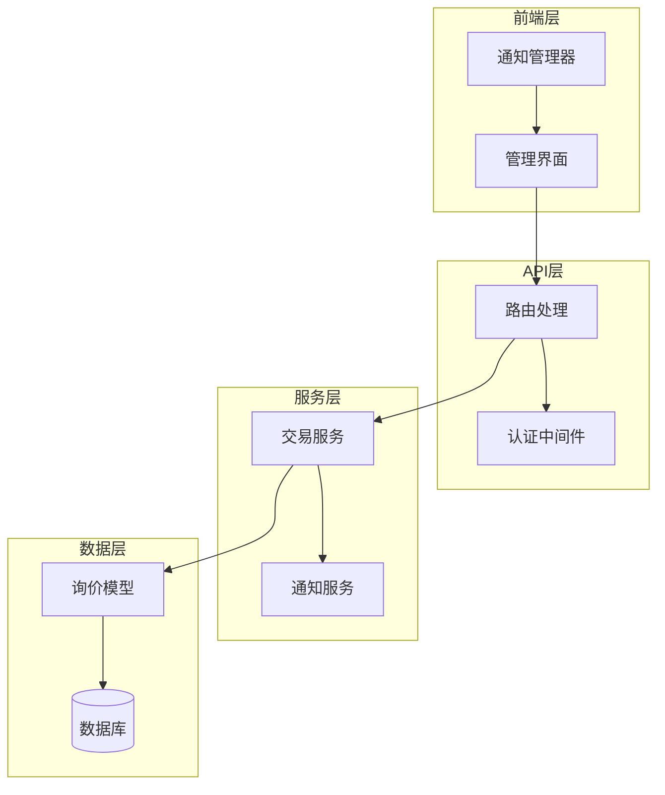
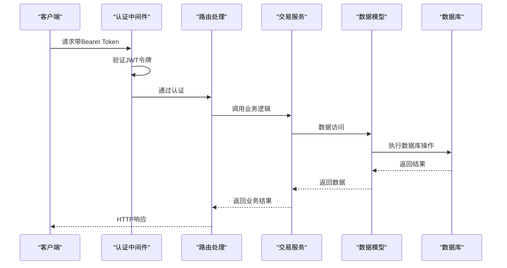
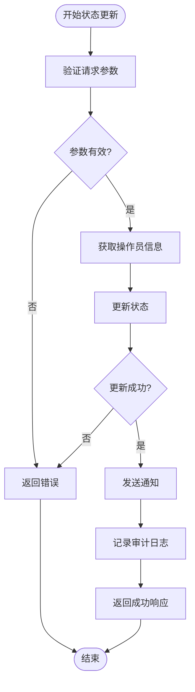
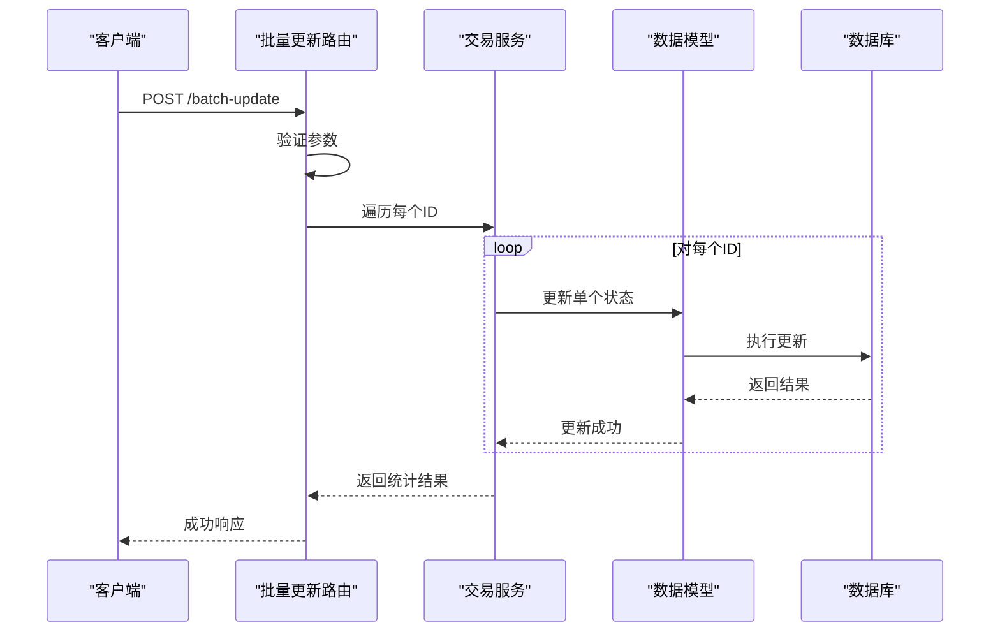
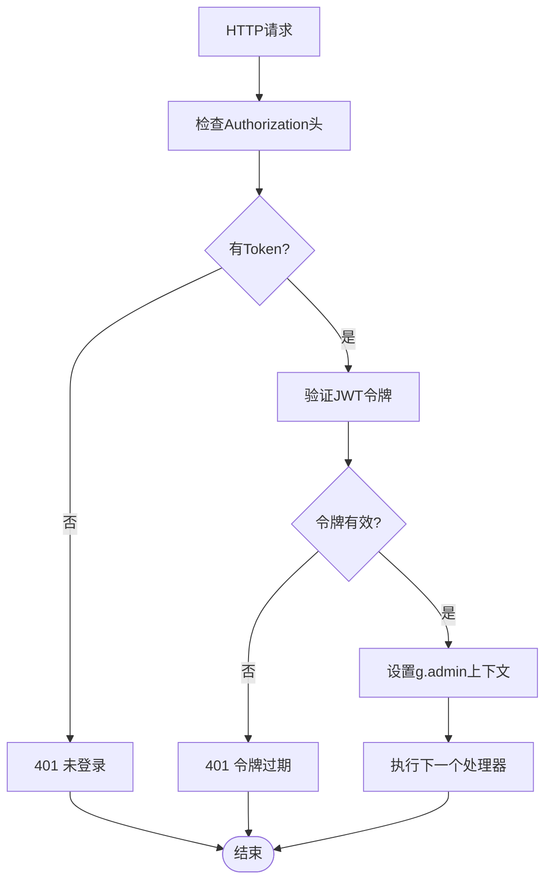
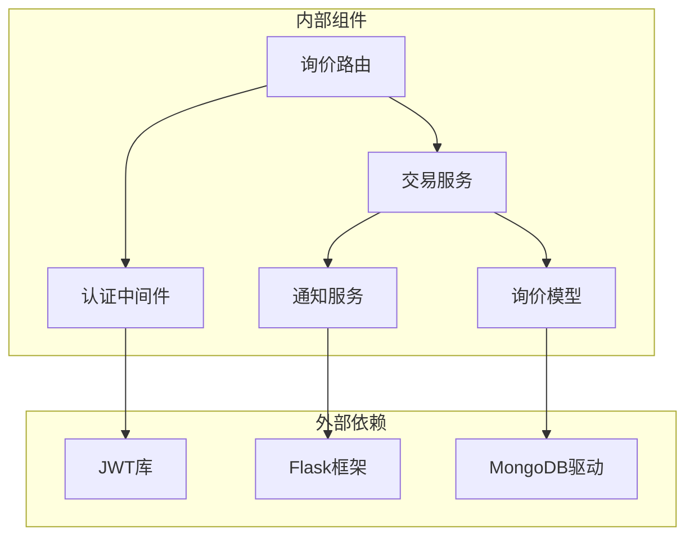

# 询价状态管理接口

<cite>
**本文档引用的文件**
- [routes/inquiry.py](file://routes/inquiry.py)
- [models/inquiry.py](file://models/inquiry.py)
- [services/trade_service.py](file://services/trade_service.py)
- [routes/auth.py](file://routes/auth.py)
- [admin-ui/src/pages/Inquiries.tsx](file://admin-ui/src/pages/Inquiries.tsx)
- [admin-ui/src/utils/notification.ts](file://admin-ui/src/utils/notification.ts)
- [services/notification_service.py](file://services/notification_service.py)
- [INQUIRY_ENHANCEMENT_REPORT.md](file://INQUIRY_ENHANCEMENT_REPORT.md)
</cite>

## 目录
1. [简介](#简介)
2. [项目结构](#项目结构)
3. [核心组件](#核心组件)
4. [架构概览](#架构概览)
5. [详细组件分析](#详细组件分析)
6. [依赖关系分析](#依赖关系分析)
7. [性能考虑](#性能考虑)
8. [故障排除指南](#故障排除指南)
9. [结论](#结论)

## 简介

本文档详细介绍了场外期权交易系统中的询价状态管理接口。该系统提供了两个核心的HTTP接口用于管理询价状态：

- **单条状态更新接口**：PUT /api/v1/admin/inquiries/<id>/status
- **批量状态更新接口**：POST /api/v1/admin/inquiries/batch-update

这些接口支持完整的状态管理功能，包括状态流转控制、操作员身份验证、备注记录、状态变更通知和审计日志记录。

## 项目结构

系统采用分层架构设计，主要包含以下层次：



**图表来源**
- [routes/inquiry.py](file://routes/inquiry.py#L1-L175)
- [services/trade_service.py](file://services/trade_service.py#L38-L68)
- [models/inquiry.py](file://models/inquiry.py#L10-L148)

**章节来源**
- [routes/inquiry.py](file://routes/inquiry.py#L1-L175)
- [models/inquiry.py](file://models/inquiry.py#L1-L148)

## 核心组件

### 认证与授权中间件

系统使用基于JWT的认证机制，通过`require_auth`装饰器确保只有经过身份验证的管理员才能访问管理接口。

### 交易服务层

`TradeService`作为核心业务逻辑层，负责：
- 询价状态更新
- 统计数据计算
- 业务逻辑协调

### 数据模型层

`InquiryModel`提供数据访问抽象，支持本地MongoDB和云数据库两种模式。

**章节来源**
- [routes/auth.py](file://routes/auth.py#L33-L72)
- [services/trade_service.py](file://services/trade_service.py#L38-L68)
- [models/inquiry.py](file://models/inquiry.py#L10-L148)

## 架构概览

系统采用RESTful API设计，遵循HTTP标准和最佳实践：



**图表来源**
- [routes/inquiry.py](file://routes/inquiry.py#L60-L84)
- [routes/auth.py](file://routes/auth.py#L33-L54)

## 详细组件分析

### 单条状态更新接口

#### 接口定义
- **方法**：PUT
- **路径**：`/api/v1/admin/inquiries/{id}/status`
- **认证**：需要管理员权限
- **功能**：更新指定询价单的状态

#### 请求参数
```json
{
  "status": "string",
  "remark": "string"
}
```

#### 响应格式
```json
{
  "success": true,
  "message": "状态更新成功",
  "data": null
}
```

#### 状态更新流程



**图表来源**
- [routes/inquiry.py](file://routes/inquiry.py#L60-L84)
- [services/trade_service.py](file://services/trade_service.py#L51-L68)

#### 操作员标识机制

系统通过`g.admin`上下文获取当前操作员信息：
- 从JWT载荷中提取`sub`字段作为操作员ID
- 默认操作员名为"system"
- 支持多种角色的管理员访问

#### 状态枚举定义

系统支持以下状态枚举值：
- `pending`：待处理
- `processing`：处理中  
- `completed`：已完成
- `rejected`：已拒绝

**章节来源**
- [routes/inquiry.py](file://routes/inquiry.py#L60-L84)
- [services/trade_service.py](file://services/trade_service.py#L51-L68)
- [admin-ui/src/utils/notification.ts](file://admin-ui/src/utils/notification.ts#L39-L50)

### 批量状态更新接口

#### 接口定义
- **方法**：POST
- **路径**：`/api/v1/admin/inquiries/batch-update`
- **认证**：需要管理员权限
- **功能**：批量更新多个询价单的状态

#### 请求参数
```json
{
  "ids": ["id1", "id2", "id3"],
  "status": "completed"
}
```

#### 响应格式
```json
{
  "success": true,
  "message": "成功更新 X 条记录",
  "data": null
}
```

#### 批量处理流程



**图表来源**
- [routes/inquiry.py](file://routes/inquiry.py#L97-L122)
- [services/trade_service.py](file://services/trade_service.py#L51-L68)

**章节来源**
- [routes/inquiry.py](file://routes/inquiry.py#L97-L122)
- [services/trade_service.py](file://services/trade_service.py#L51-L68)

### 状态变更通知机制

系统集成了实时通知功能，支持状态变更的即时通知：

#### 通知类型
- **询价状态变更通知**：状态更新时自动发送
- **新询价通知**：新询价提交时发送
- **系统公告**：重要系统信息通知

#### 通知内容格式
```typescript
{
  title: string;           // 通知标题
  message: string;         // 通知内容
  type: 'info' | 'success' | 'warning' | 'error'; // 通知类型
  duration?: number;       // 显示持续时间
  onClick?: () => void;    // 点击回调
}
```

**章节来源**
- [admin-ui/src/utils/notification.ts](file://admin-ui/src/utils/notification.ts#L1-L50)
- [services/notification_service.py](file://services/notification_service.py#L9-L15)

### 权限验证与g.admin上下文

#### 认证流程



**图表来源**
- [routes/auth.py](file://routes/auth.py#L33-L54)

#### g.admin上下文结构
- `sub`: 操作员唯一标识
- `role`: 用户角色
- `exp`: 令牌过期时间

**章节来源**
- [routes/auth.py](file://routes/auth.py#L33-L54)
- [routes/inquiry.py](file://routes/inquiry.py#L72-L76)

## 依赖关系分析

系统采用松耦合的设计，各组件之间的依赖关系如下：



**图表来源**
- [routes/inquiry.py](file://routes/inquiry.py#L1-L10)
- [services/trade_service.py](file://services/trade_service.py#L1-L10)
- [models/inquiry.py](file://models/inquiry.py#L1-L10)

**章节来源**
- [routes/inquiry.py](file://routes/inquiry.py#L1-L10)
- [services/trade_service.py](file://services/trade_service.py#L1-L10)
- [models/inquiry.py](file://models/inquiry.py#L1-L10)

## 性能考虑

### 数据库优化

系统实现了多项性能优化措施：

1. **索引优化**：为常用查询字段建立索引
   - `createdAt`：按时间排序查询
   - `status`：状态筛选查询  
   - `phone`：电话号码查询

2. **批量操作**：支持批量状态更新，减少数据库往返次数

3. **缓存机制**：实现查询结果缓存，提高重复查询性能

### 前端性能优化

- **自动刷新机制**：30秒自动刷新，避免手动刷新
- **静默刷新**：避免加载状态闪烁
- **批量操作优化**：提供批量状态更新功能

## 故障排除指南

### 常见错误及解决方案

#### 认证相关错误
- **401 未登录或登录已过期**：检查Authorization头是否正确设置Bearer Token
- **403 权限不足**：确认用户角色是否具有管理员权限
- **400 参数错误**：检查请求体格式是否正确

#### 业务逻辑错误
- **状态更新失败**：检查状态枚举值是否正确
- **批量更新部分失败**：查看返回的成功计数，检查失败的ID列表

#### 数据库相关错误
- **查询超时**：检查数据库连接和索引配置
- **更新失败**：确认文档ID是否存在

**章节来源**
- [routes/inquiry.py](file://routes/inquiry.py#L69-L84)
- [routes/inquiry.py](file://routes/inquiry.py#L106-L122)

## 结论

本系统提供了完整、健壮的询价状态管理功能，具有以下特点：

1. **完整的状态管理**：支持四种标准状态和自定义备注
2. **安全的权限控制**：基于JWT的认证和授权机制
3. **实时通知系统**：状态变更的即时通知功能
4. **高性能设计**：数据库索引优化和批量操作支持
5. **良好的扩展性**：模块化设计便于功能扩展

系统通过清晰的架构设计和完善的错误处理机制，为场外期权交易提供了可靠的询价状态管理解决方案。