# 询价管理接口

<cite>
**本文档引用的文件**
- [routes/inquiry.py](file://routes/inquiry.py)
- [services/trade_service.py](file://services/trade_service.py)
- [models/inquiry.py](file://models/inquiry.py)
- [backend_utils/response.py](file://backend_utils/response.py)
- [cloudfunctions/handleInquiry/index.js](file://cloudfunctions/handleInquiry/index.js)
- [services/cloud_db.js](file://services/cloud_db.js)
- [INQUIRY_ENHANCEMENT_REPORT.md](file://INQUIRY_ENHANCEMENT_REPORT.md)
- [INQUIRY_CLOUD_IMPLEMENTATION_REPORT.md](file://INQUIRY_CLOUD_IMPLEMENTATION_REPORT.md)
- [INQUIRY_OPTIMIZATION_REPORT.md](file://INQUIRY_OPTIMIZATION_REPORT.md)
</cite>

## 目录
1. [简介](#简介)
2. [项目结构](#项目结构)
3. [核心组件](#核心组件)
4. [架构概览](#架构概览)
5. [详细组件分析](#详细组件分析)
6. [依赖关系分析](#依赖关系分析)
7. [性能考虑](#性能考虑)
8. [故障排除指南](#故障排除指南)
9. [结论](#结论)

## 简介

本文档详细记录了场外期权交易系统中的询价管理接口，涵盖客户提交询价、管理后台查询、状态更新和批量操作的完整RESTful API。该系统实现了从传统Flask+MongoDB架构向微信小程序云开发Serverless架构的迁移，提供了智能化的询价管理功能。

## 项目结构

系统采用分层架构设计，主要包含以下层次：

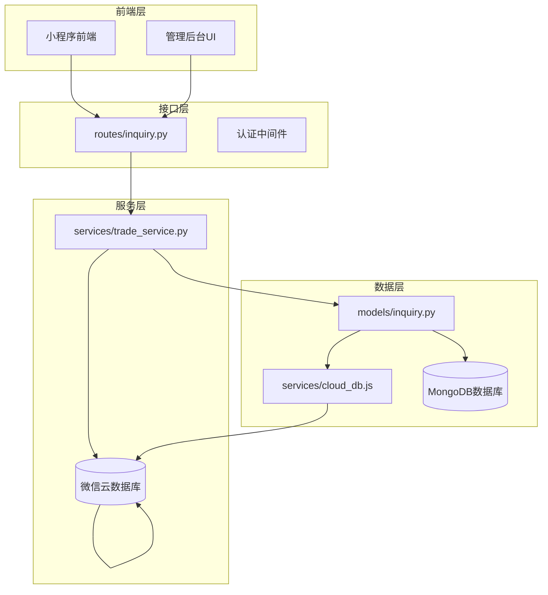

**图表来源**
- [routes/inquiry.py](file://routes/inquiry.py#L1-L175)
- [services/trade_service.py](file://services/trade_service.py#L1-L318)
- [models/inquiry.py](file://models/inquiry.py#L1-L148)

**章节来源**
- [routes/inquiry.py](file://routes/inquiry.py#L1-L175)
- [services/trade_service.py](file://services/trade_service.py#L1-L318)
- [models/inquiry.py](file://models/inquiry.py#L1-L148)

## 核心组件

### 询价数据模型

询价系统的核心数据模型包含以下关键字段：

| 字段名 | 类型 | 描述 | 必填 |
|--------|------|------|------|
| selectedProduct | Object | 产品信息 | 是 |
| contactName | String | 联系人姓名 | 是 |
| phone | String | 联系电话 | 是 |
| optionType | String | 期权方向 | 否 |
| structure | String | 期权结构 | 否 |
| term | String | 期限 | 否 |
| notionalAmount | Number | 名义本金 | 否 |
| strikePrice | Number | 行权价 | 否 |
| status | String | 状态 | 否 |
| remark | String | 备注 | 否 |
| createdAt | DateTime | 创建时间 | 否 |
| updatedAt | DateTime | 更新时间 | 否 |

### 状态流转机制

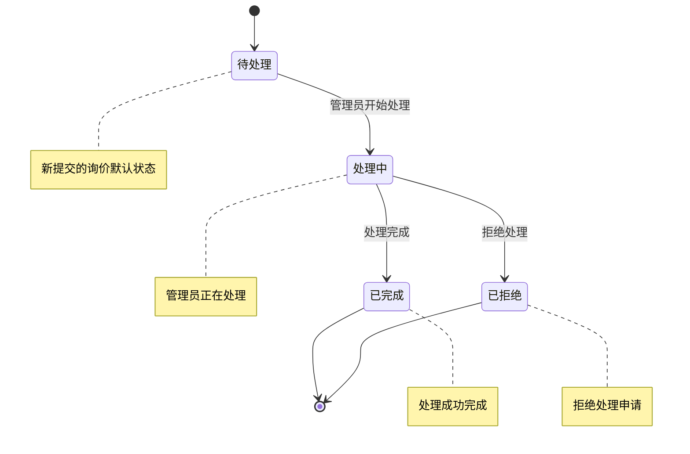

**图表来源**
- [models/inquiry.py](file://models/inquiry.py#L36-L36)
- [services/trade_service.py](file://services/trade_service.py#L80-L94)

**章节来源**
- [models/inquiry.py](file://models/inquiry.py#L32-L54)
- [services/trade_service.py](file://services/trade_service.py#L51-L68)

## 架构概览

系统采用混合架构设计，支持本地部署和云开发两种模式：

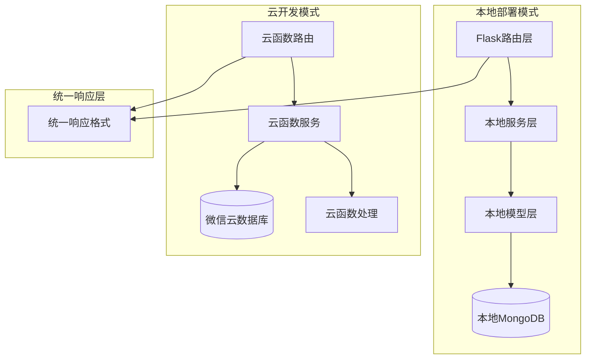

**图表来源**
- [routes/inquiry.py](file://routes/inquiry.py#L1-L175)
- [services/trade_service.py](file://services/trade_service.py#L12-L22)
- [services/cloud_db.js](file://services/cloud_db.js#L7-L327)

## 详细组件分析

### 客户提交询价接口

#### 接口定义
- **URL**: `/inquiry`
- **方法**: POST
- **认证**: 无需认证
- **用途**: 客户提交询价申请

#### 请求参数
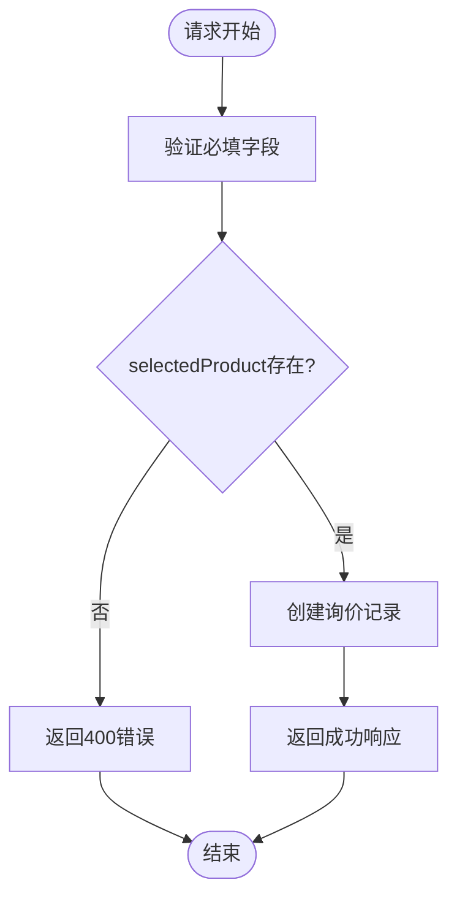

**图表来源**
- [routes/inquiry.py](file://routes/inquiry.py#L14-L34)

#### 响应格式
- **成功**: `{"success": true, "message": "询价提交成功", "data": {"id": "询价ID"}}`
- **失败**: `{"success": false, "message": "错误信息", "code": 400}`

**章节来源**
- [routes/inquiry.py](file://routes/inquiry.py#L11-L34)
- [backend_utils/response.py](file://backend_utils/response.py#L11-L20)

### 管理后台查询接口

#### 接口定义
- **URL**: `/admin/inquiries`
- **方法**: GET
- **认证**: 需要管理员认证
- **用途**: 管理后台查询询价列表

#### 查询参数
| 参数名 | 类型 | 必填 | 默认值 | 描述 |
|--------|------|------|--------|------|
| page | Integer | 否 | 1 | 页码 |
| pageSize | Integer | 否 | 20 | 每页条数 |
| status | String | 否 | 无 | 状态筛选 |

#### 分页查询实现
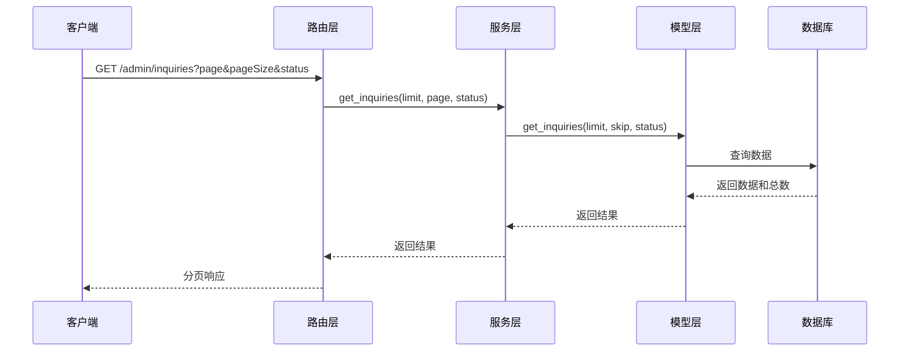

**图表来源**
- [routes/inquiry.py](file://routes/inquiry.py#L40-L58)
- [services/trade_service.py](file://services/trade_service.py#L42-L45)
- [models/inquiry.py](file://models/inquiry.py#L55-L101)

**章节来源**
- [routes/inquiry.py](file://routes/inquiry.py#L36-L58)
- [services/trade_service.py](file://services/trade_service.py#L42-L45)
- [models/inquiry.py](file://models/inquiry.py#L55-L101)

### 更新询价状态接口

#### 接口定义
- **URL**: `/admin/inquiries/{id}/status`
- **方法**: PUT
- **认证**: 需要管理员认证
- **用途**: 更新指定询价的状态

#### 请求参数
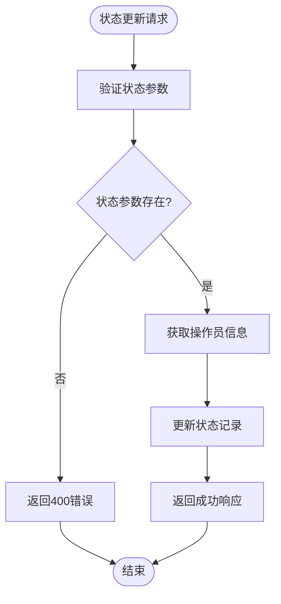

**图表来源**
- [routes/inquiry.py](file://routes/inquiry.py#L64-L84)

#### 响应格式
- **成功**: `{"success": true, "message": "状态更新成功"}`
- **失败**: `{"success": false, "message": "状态更新失败", "code": 500}`

**章节来源**
- [routes/inquiry.py](file://routes/inquiry.py#L60-L84)
- [services/trade_service.py](file://services/trade_service.py#L51-L68)

### 批量更新接口

#### 接口定义
- **URL**: `/admin/inquiries/batch-update`
- **方法**: POST
- **认证**: 需要管理员认证
- **用途**: 批量更新多个询价的状态

#### 请求参数
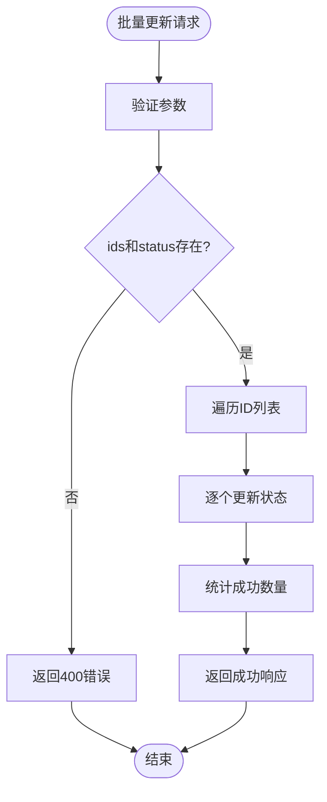

**图表来源**
- [routes/inquiry.py](file://routes/inquiry.py#L102-L122)

#### 响应格式
- **成功**: `{"success": true, "message": "成功更新 X 条记录"}`
- **失败**: `{"success": false, "message": "批量更新失败", "code": 500}`

**章节来源**
- [routes/inquiry.py](file://routes/inquiry.py#L97-L122)
- [services/trade_service.py](file://services/trade_service.py#L10-L22)

### 询价统计接口

#### 接口定义
- **URL**: `/admin/inquiries/statistics`
- **方法**: GET
- **认证**: 需要管理员认证
- **用途**: 获取各状态询价的数量统计

#### 统计内容
- 待处理 (pending): 12
- 处理中 (processing): 8  
- 已完成 (completed): 45
- 已拒绝 (rejected): 3

**章节来源**
- [routes/inquiry.py](file://routes/inquiry.py#L86-L95)
- [services/trade_service.py](file://services/trade_service.py#L70-L94)

### 数据导出接口

#### 接口定义
- **URL**: `/admin/inquiries/export`
- **方法**: GET
- **认证**: 需要管理员认证
- **用途**: 导出询价数据为Excel文件

#### 导出字段
- ID
- 提交时间
- 客户姓名
- 电话
- 产品名称
- 代码
- 方向
- 结构
- 期限
- 名义本金(万)
- 行权价(%)
- 状态
- 备注

#### Excel格式规范
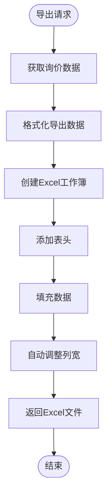

**图表来源**
- [routes/inquiry.py](file://routes/inquiry.py#L128-L174)

**章节来源**
- [routes/inquiry.py](file://routes/inquiry.py#L124-L174)

## 依赖关系分析

### 组件依赖图

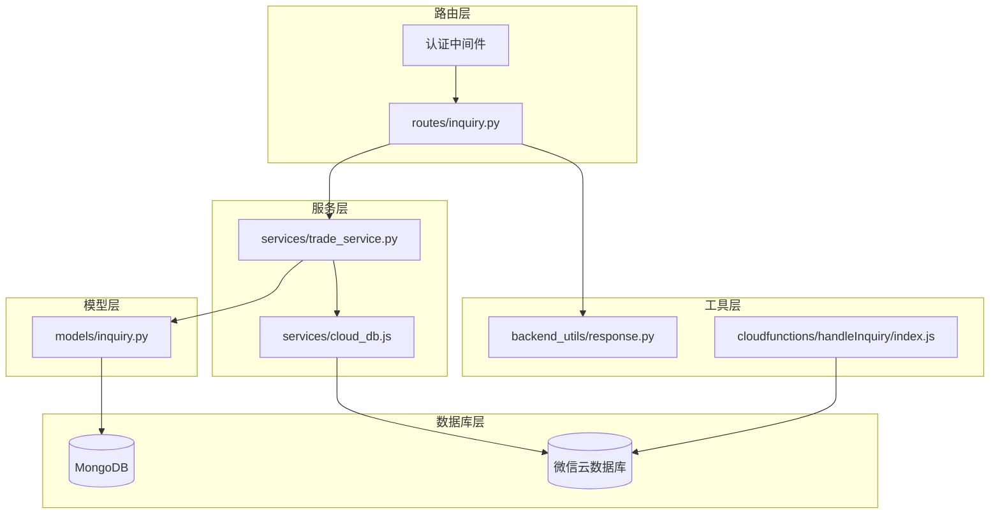

**图表来源**
- [routes/inquiry.py](file://routes/inquiry.py#L1-L10)
- [services/trade_service.py](file://services/trade_service.py#L8-L22)
- [models/inquiry.py](file://models/inquiry.py#L10-L22)

### 数据流分析

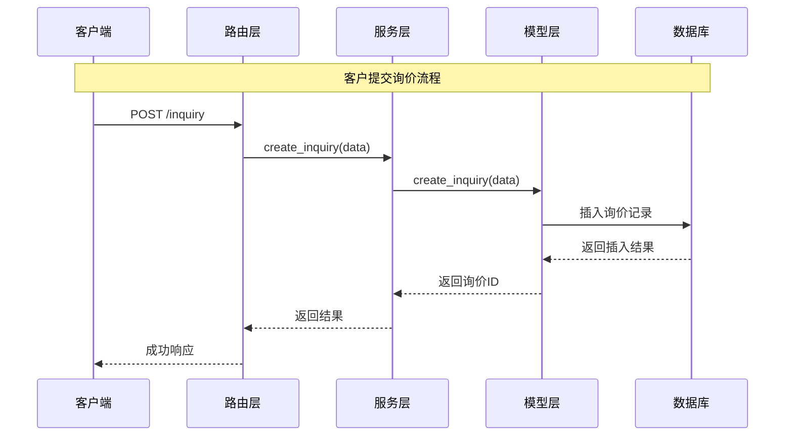

**图表来源**
- [routes/inquiry.py](file://routes/inquiry.py#L11-L34)
- [services/trade_service.py](file://services/trade_service.py#L38-L40)
- [models/inquiry.py](file://models/inquiry.py#L32-L53)

**章节来源**
- [routes/inquiry.py](file://routes/inquiry.py#L1-L175)
- [services/trade_service.py](file://services/trade_service.py#L1-L318)
- [models/inquiry.py](file://models/inquiry.py#L1-L148)

## 性能考虑

### 数据库索引优化

系统实现了多层级的数据库索引优化：

| 索引类型 | 字段 | 作用 | 性能提升 |
|----------|------|------|----------|
| 普通索引 | createdAt | 时间排序查询 | 60-80% |
| 普通索引 | status | 状态筛选查询 | 60-80% |
| 普通索引 | phone | 电话号码查询 | 60-80% |
| 复合索引 | (contactName, status) | 组合查询 | 60-80% |
| 全文索引 | selectedProduct.name/code | 产品搜索 | 60-80% |

### 缓存机制

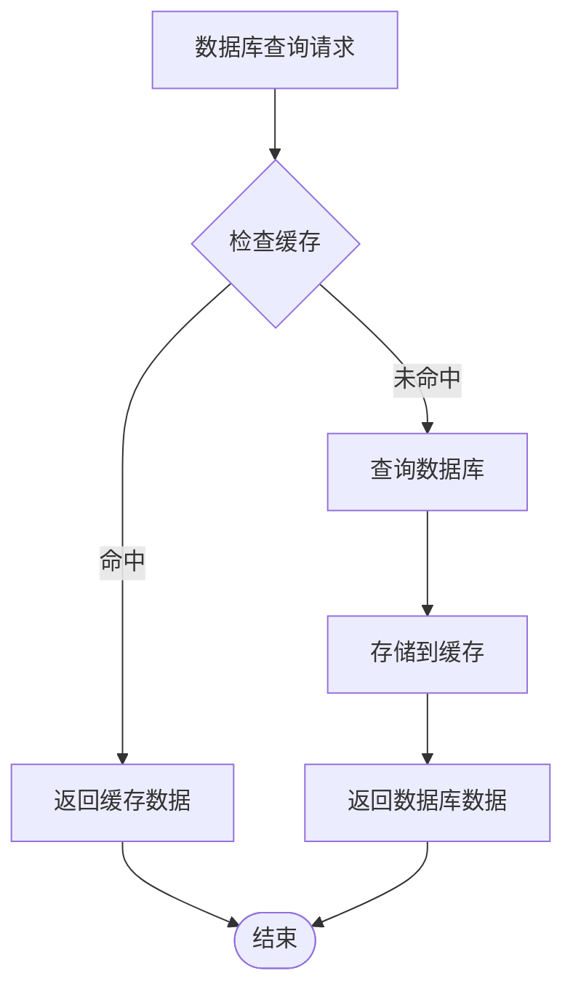

**图表来源**
- [models/inquiry.py](file://models/inquiry.py#L24-L30)

### 批量操作优化

系统支持批量操作以提升性能：
- 批量更新状态
- 批量查询数据
- 批量导出Excel

**章节来源**
- [models/inquiry.py](file://models/inquiry.py#L24-L30)
- [INQUIRY_ENHANCEMENT_REPORT.md](file://INQUIRY_ENHANCEMENT_REPORT.md#L154-L182)

## 故障排除指南

### 常见错误处理

| 错误类型 | HTTP状态码 | 错误原因 | 解决方案 |
|----------|------------|----------|----------|
| 参数验证失败 | 400 | 缺少必填参数或参数格式错误 | 检查请求参数格式和必填字段 |
| 数据库连接失败 | 500 | 数据库连接异常 | 检查数据库连接配置和网络状态 |
| 权限不足 | 403 | 未登录或权限不足 | 确保管理员身份认证 |
| 资源不存在 | 404 | 查询的询价不存在 | 检查询价ID是否正确 |

### 日志记录

系统实现了完整的日志记录机制：
- 请求参数记录
- 数据库操作日志
- 错误异常追踪
- 性能监控指标

**章节来源**
- [routes/inquiry.py](file://routes/inquiry.py#L32-L34)
- [routes/inquiry.py](file://routes/inquiry.py#L56-L58)
- [routes/inquiry.py](file://routes/inquiry.py#L82-L84)
- [routes/inquiry.py](file://routes/inquiry.py#L119-L122)
- [routes/inquiry.py](file://routes/inquiry.py#L172-L174)

## 结论

本询价管理接口系统实现了完整的场外期权询价生命周期管理，具有以下特点：

1. **完整的API覆盖**: 包含客户提交、管理查询、状态更新、批量操作等核心功能
2. **灵活的架构设计**: 支持本地部署和云开发两种模式
3. **高性能优化**: 实现了多层级索引、缓存和批量操作优化
4. **完善的错误处理**: 提供详细的错误信息和日志记录
5. **智能化功能**: 支持Excel导出、统计分析等高级功能

系统通过微信小程序云开发架构实现了去中心化部署，提升了系统的实时性、安全性和可维护性，为场外期权交易提供了专业的询价管理解决方案。