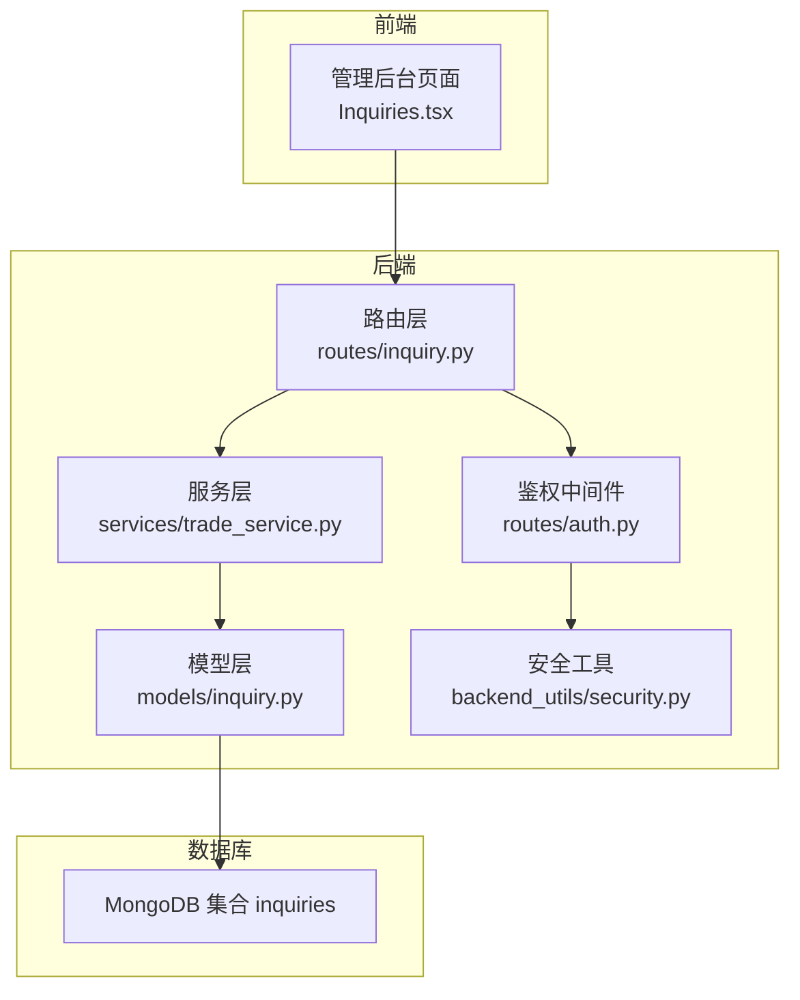
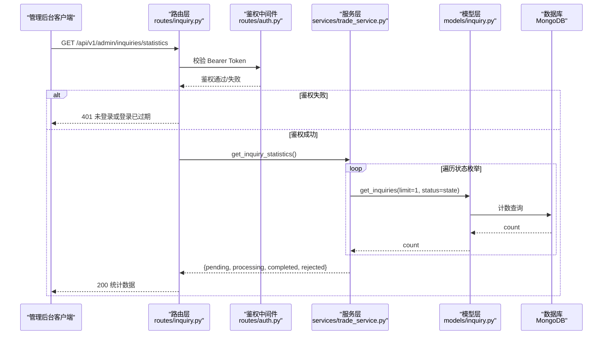
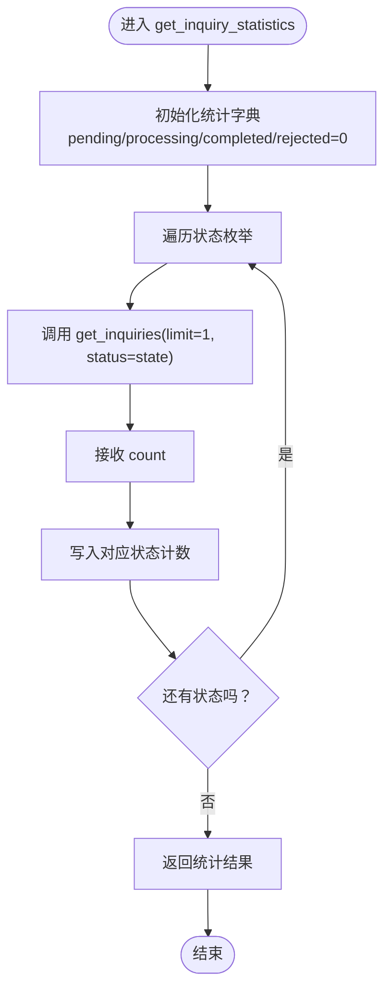
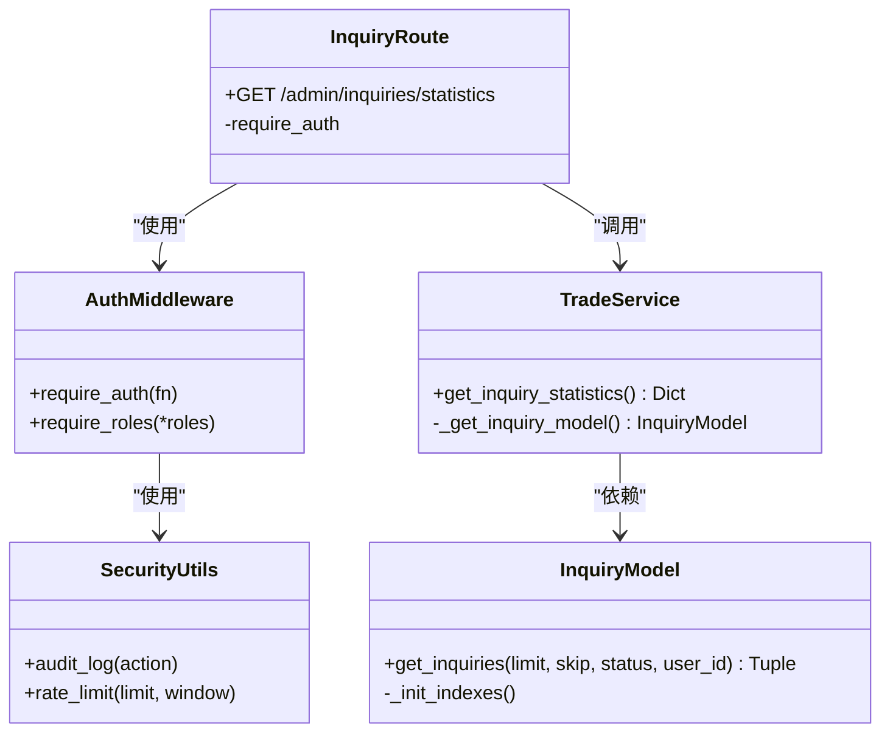

# 询价统计接口

<cite>
**本文档引用的文件**
- [routes/inquiry.py](file://routes/inquiry.py)
- [services/trade_service.py](file://services/trade_service.py)
- [models/inquiry.py](file://models/inquiry.py)
- [routes/auth.py](file://routes/auth.py)
- [backend_utils/security.py](file://backend_utils/security.py)
- [backend_utils/api.js](file://backend_utils/api.js)
- [admin-ui/src/pages/Inquiries.tsx](file://admin-ui/src/pages/Inquiries.tsx)
- [INQUIRY_ENHANCEMENT_REPORT.md](file://INQUIRY_ENHANCEMENT_REPORT.md)
- [test_inquiries_api.py](file://test_inquiries_api.py)
</cite>

## 目录
1. [简介](#简介)
2. [项目结构](#项目结构)
3. [核心组件](#核心组件)
4. [架构概览](#架构概览)
5. [详细组件分析](#详细组件分析)
6. [依赖关系分析](#依赖关系分析)
7. [性能考量](#性能考量)
8. [故障排除指南](#故障排除指南)
9. [结论](#结论)

## 简介
本文件针对 `/api/v1/admin/inquiries/statistics` 统计接口进行全面的技术文档化，涵盖接口实现、数据结构、计算逻辑、缓存策略、性能优化、安全控制以及扩展能力。该接口用于返回各状态询价数量统计，支撑管理后台的实时监控与决策。

## 项目结构
该功能涉及后端路由、服务层、模型层以及前端页面的协同：
- 后端路由层：定义 `/api/v1/admin/inquiries/statistics` 接口，使用鉴权装饰器保护
- 服务层：封装统计逻辑，调用模型层进行数据聚合
- 模型层：提供数据库查询与索引优化
- 前端页面：展示统计卡片并定时刷新
- 安全模块：提供 JWT 鉴权与审计日志



**图表来源**
- [routes/inquiry.py](file://routes/inquiry.py#L86-L95)
- [services/trade_service.py](file://services/trade_service.py#L70-L94)
- [models/inquiry.py](file://models/inquiry.py#L55-L101)
- [routes/auth.py](file://routes/auth.py#L33-L54)
- [backend_utils/security.py](file://backend_utils/security.py#L87-L116)

**章节来源**
- [routes/inquiry.py](file://routes/inquiry.py#L1-L175)
- [services/trade_service.py](file://services/trade_service.py#L1-L318)
- [models/inquiry.py](file://models/inquiry.py#L1-L148)
- [routes/auth.py](file://routes/auth.py#L1-L432)
- [backend_utils/security.py](file://backend_utils/security.py#L1-L117)

## 核心组件
- 路由接口：`GET /api/v1/admin/inquiries/statistics`，使用 `@require_auth` 装饰器进行鉴权
- 服务方法：`TradeService.get_inquiry_statistics()`，返回各状态询价数量
- 模型方法：`InquiryModel.get_inquiries()`，支持按状态计数查询
- 前端组件：`Inquiries.tsx` 展示统计卡片并定时刷新

**章节来源**
- [routes/inquiry.py](file://routes/inquiry.py#L86-L95)
- [services/trade_service.py](file://services/trade_service.py#L70-L94)
- [models/inquiry.py](file://models/inquiry.py#L55-L101)
- [admin-ui/src/pages/Inquiries.tsx](file://admin-ui/src/pages/Inquiries.tsx#L380-L410)

## 架构概览
接口调用链路如下：



**图表来源**
- [routes/inquiry.py](file://routes/inquiry.py#L86-L95)
- [routes/auth.py](file://routes/auth.py#L33-L54)
- [services/trade_service.py](file://services/trade_service.py#L70-L94)
- [models/inquiry.py](file://models/inquiry.py#L55-L101)

## 详细组件分析

### 接口定义与实现
- 接口路径：`GET /api/v1/admin/inquiries/statistics`
- 鉴权要求：必须携带有效的 Bearer Token
- 返回数据：包含各状态询价数量的对象
- 错误处理：异常捕获并返回统一错误响应

**章节来源**
- [routes/inquiry.py](file://routes/inquiry.py#L86-L95)
- [routes/auth.py](file://routes/auth.py#L33-L54)
- [INQUIRY_ENHANCEMENT_REPORT.md](file://INQUIRY_ENHANCEMENT_REPORT.md#L68-L83)

### 服务层统计逻辑
- 统计维度：`pending`、`processing`、`completed`、`rejected`
- 计算策略：遍历状态枚举，分别调用 `get_inquiries(limit=1, status=state)` 进行计数
- 性能现状：存在多次数据库往返，适合结合缓存优化



**图表来源**
- [services/trade_service.py](file://services/trade_service.py#L70-L94)
- [models/inquiry.py](file://models/inquiry.py#L55-L101)

**章节来源**
- [services/trade_service.py](file://services/trade_service.py#L70-L94)

### 模型层查询与索引
- 查询方法：`get_inquiries(limit, skip, status, user_id)` 支持按状态过滤
- 索引优化：已在 `createdAt`、`status`、`phone` 等字段建立索引
- 云数据库兼容：同时支持本地 MongoDB 与云数据库查询语法

**章节来源**
- [models/inquiry.py](file://models/inquiry.py#L24-L30)
- [models/inquiry.py](file://models/inquiry.py#L55-L101)

### 前端展示与刷新
- 统计卡片：展示待处理、处理中、已完成、已拒绝的数量
- 自动刷新：每30秒静默刷新统计数据
- 交互设计：卡片带图标与颜色区分，提升可读性

**章节来源**
- [admin-ui/src/pages/Inquiries.tsx](file://admin-ui/src/pages/Inquiries.tsx#L380-L410)
- [INQUIRY_ENHANCEMENT_REPORT.md](file://INQUIRY_ENHANCEMENT_REPORT.md#L25-L31)

### 统计数据结构与字段说明
- 返回结构：包含四个状态字段的整数值
- 字段含义：
  - `pending`：待处理数量
  - `processing`：处理中数量
  - `completed`：已完成数量
  - `rejected`：已拒绝数量

示例数据结构（JSON Schema）：
```json
{
  "code": 200,
  "success": true,
  "message": "统计成功",
  "data": {
    "pending": 12,
    "processing": 8,
    "completed": 45,
    "rejected": 3
  },
  "timestamp": "2026-01-14T10:00:00Z"
}
```

**章节来源**
- [INQUIRY_ENHANCEMENT_REPORT.md](file://INQUIRY_ENHANCEMENT_REPORT.md#L72-L82)
- [routes/inquiry.py](file://routes/inquiry.py#L86-L95)

### 安全控制与访问权限
- 鉴权机制：`require_auth` 装饰器校验 Bearer Token，支持过期与无效令牌处理
- 角色控制：可通过 `require_roles` 扩展细粒度权限（如仅管理员可见）
- 审计日志：统一审计装饰器记录用户行为与状态
- 前端安全：API 基础地址通过环境变量配置，生产环境强制使用 HTTPS

**章节来源**
- [routes/auth.py](file://routes/auth.py#L33-L72)
- [routes/auth.py](file://routes/auth.py#L148-L186)
- [backend_utils/security.py](file://backend_utils/security.py#L87-L116)
- [backend_utils/api.js](file://backend_utils/api.js#L4-L10)

### 缓存策略与性能优化
- 现状：服务层未实现统计缓存，每次请求都会发起多次计数查询
- 建议策略：
  - TTL 缓存：为统计结果设置 5 分钟 TTL
  - 缓存键：基于状态集合的哈希值或版本号
  - 失效策略：状态变更时主动失效相关缓存
- 前端缓存：API 工具类内置 5 分钟缓存与并发控制

**章节来源**
- [INQUIRY_ENHANCEMENT_REPORT.md](file://INQUIRY_ENHANCEMENT_REPORT.md#L166-L174)
- [backend_utils/api.js](file://backend_utils/api.js#L8-L10)

### 统计维度扩展与自定义报表
- 扩展维度建议：
  - 时间分布：按日/周/月统计各状态数量趋势
  - 产品维度：按产品名称/代码统计询价分布
  - 交易商维度：按交易商统计处理量
  - 客户维度：按客户/渠道统计询价来源
- 自定义报表：
  - 导出接口：参考现有 `/admin/inquiries/export`，支持 Excel 下载
  - 高级筛选：支持多条件组合筛选与保存筛选方案
  - 可视化图表：集成 ECharts/Recharts 展示趋势与分布

**章节来源**
- [routes/inquiry.py](file://routes/inquiry.py#L124-L175)
- [INQUIRY_ENHANCEMENT_REPORT.md](file://INQUIRY_ENHANCEMENT_REPORT.md#L426-L447)

## 依赖关系分析



**图表来源**
- [routes/inquiry.py](file://routes/inquiry.py#L86-L95)
- [services/trade_service.py](file://services/trade_service.py#L12-L22)
- [models/inquiry.py](file://models/inquiry.py#L10-L20)
- [routes/auth.py](file://routes/auth.py#L33-L72)
- [backend_utils/security.py](file://backend_utils/security.py#L87-L116)

**章节来源**
- [routes/inquiry.py](file://routes/inquiry.py#L1-L175)
- [services/trade_service.py](file://services/trade_service.py#L1-L318)
- [models/inquiry.py](file://models/inquiry.py#L1-L148)
- [routes/auth.py](file://routes/auth.py#L1-L432)
- [backend_utils/security.py](file://backend_utils/security.py#L1-L117)

## 性能考量
- 查询性能：数据库已建立 `status` 等关键字段索引，统计查询具备基础性能保障
- 服务层瓶颈：当前实现对每个状态发起一次计数查询，建议引入缓存与批量聚合
- 前端体验：自动刷新采用静默模式，避免频繁加载状态闪烁
- 建议优化：
  - 引入 Redis/Memcached 缓存统计结果
  - 使用数据库聚合管道一次性统计多状态
  - 增加重试与并发控制，提升稳定性

**章节来源**
- [INQUIRY_ENHANCEMENT_REPORT.md](file://INQUIRY_ENHANCEMENT_REPORT.md#L154-L164)
- [INQUIRY_ENHANCEMENT_REPORT.md](file://INQUIRY_ENHANCEMENT_REPORT.md#L313-L339)
- [backend_utils/api.js](file://backend_utils/api.js#L12-L22)

## 故障排除指南
- 常见错误与处理：
  - 401 未登录/登录过期：检查 Authorization 头部是否包含有效 Bearer Token
  - 403 权限不足：确认用户角色是否满足接口要求
  - 500 服务器错误：查看后端日志定位具体异常
- 调试建议：
  - 使用测试脚本验证接口可用性
  - 检查数据库索引是否存在
  - 前端确认定时刷新逻辑与网络请求状态

**章节来源**
- [routes/auth.py](file://routes/auth.py#L37-L50)
- [test_inquiries_api.py](file://test_inquiries_api.py#L56-L85)

## 结论
`/api/v1/admin/inquiries/statistics` 接口提供了简洁高效的询价状态统计能力，配合前端实时刷新与统一鉴权机制，能够满足管理后台的日常监控需求。建议尽快引入缓存与聚合优化，并扩展更多统计维度与可视化能力，以进一步提升系统的可观测性与决策支持水平。