# 行政管理工具

<cite>
**本文档引用的文件**
- [admin-ui/src/main.tsx](file://admin-ui/src/main.tsx)
- [admin-ui/src/App.tsx](file://admin-ui/src/App.tsx)
- [admin-ui/package.json](file://admin-ui/package.json)
- [admin-ui/src/pages/Dashboard.tsx](file://admin-ui/src/pages/Dashboard.tsx)
- [admin-ui/src/pages/Quotes.tsx](file://admin-ui/src/pages/Quotes.tsx)
- [admin-ui/src/pages/CustomerList.tsx](file://admin-ui/src/pages/CustomerList.tsx)
- [admin-ui/src/components/AdminLayout.tsx](file://admin-ui/src/components/AdminLayout.tsx)
- [admin-ui/src/components/AuthGuard.tsx](file://admin-ui/src/components/AuthGuard.tsx)
- [routes/admin.py](file://routes/admin.py)
- [backend_utils/api.js](file://backend_utils/api.js)
- [backend_utils/db.js](file://backend_utils/db.js)
- [backend_utils/loginService.js](file://backend_utils/loginService.js)
- [backend_utils/storage-manager.js](file://backend_utils/storage-manager.js)
- [backend_utils/notification-manager.js](file://backend_utils/notification-manager.js)
- [models/customer.py](file://models/customer.py)
- [models/order.py](file://models/order.py)
</cite>

## 目录
1. [项目概述](#项目概述)
2. [项目结构](#项目结构)
3. [核心组件](#核心组件)
4. [架构概览](#架构概览)
5. [详细组件分析](#详细组件分析)
6. [依赖关系分析](#依赖关系分析)
7. [性能考虑](#性能考虑)
8. [故障排除指南](#故障排除指南)
9. [结论](#结论)

## 项目概述

本项目是一个基于React的场外期权后台管理系统，专门为期权交易提供全面的行政管理功能。系统采用前后端分离架构，前端使用React + Ant Design构建现代化的管理界面，后端基于Flask提供RESTful API服务。

该系统主要面向期权交易员和管理员，提供以下核心功能：
- 行情管理（实时行情、历史行情、板块管理）
- 客户管理（客户列表、分组管理）
- 交易管理（订单管理、询价管理、持仓管理）
- 费用管理（费用列表、统计分析）
- 消息管理（消息列表、模板管理）
- 系统配置（系统配置、用户管理）

## 项目结构

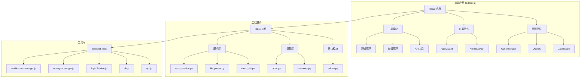

**图表来源**
- [admin-ui/src/main.tsx](file://admin-ui/src/main.tsx#L1-L14)
- [admin-ui/src/App.tsx](file://admin-ui/src/App.tsx#L1-L65)
- [routes/admin.py](file://routes/admin.py#L1-L800)

**章节来源**
- [admin-ui/src/main.tsx](file://admin-ui/src/main.tsx#L1-L14)
- [admin-ui/src/App.tsx](file://admin-ui/src/App.tsx#L1-L65)
- [admin-ui/package.json](file://admin-ui/package.json#L1-L38)

## 核心组件

### 前端核心组件

#### 应用入口和路由配置
应用采用React Router进行路由管理，支持嵌套路由和权限控制：

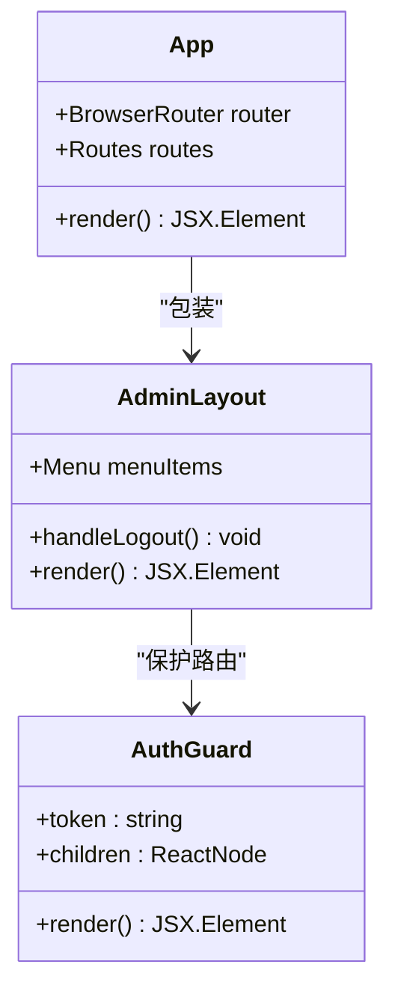

**图表来源**
- [admin-ui/src/App.tsx](file://admin-ui/src/App.tsx#L25-L62)
- [admin-ui/src/components/AdminLayout.tsx](file://admin-ui/src/components/AdminLayout.tsx#L19-L180)
- [admin-ui/src/components/AuthGuard.tsx](file://admin-ui/src/components/AuthGuard.tsx#L8-L17)

#### 页面组件架构
每个页面组件都遵循统一的模式，包含数据获取、状态管理和用户交互：

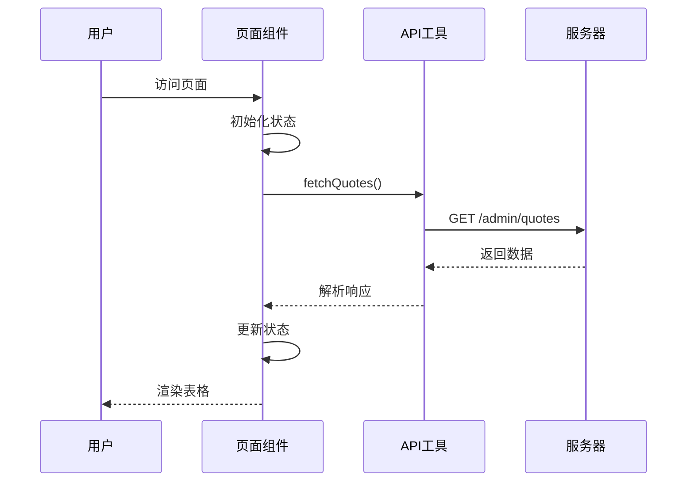

**图表来源**
- [admin-ui/src/pages/Quotes.tsx](file://admin-ui/src/pages/Quotes.tsx#L153-L183)
- [admin-ui/src/pages/Dashboard.tsx](file://admin-ui/src/pages/Dashboard.tsx#L29-L46)

**章节来源**
- [admin-ui/src/App.tsx](file://admin-ui/src/App.tsx#L25-L62)
- [admin-ui/src/components/AdminLayout.tsx](file://admin-ui/src/components/AdminLayout.tsx#L42-L99)
- [admin-ui/src/components/AuthGuard.tsx](file://admin-ui/src/components/AuthGuard.tsx#L8-L17)

### 后端核心组件

#### Flask路由模块
后端采用蓝图(BP)模式组织路由，提供完整的管理功能：

```mermaid
graph TD
A[admin_bp] --> B[统计接口]
A --> C[行情接口]
A --> D[客户接口]
A --> E[订单接口]
A --> F[文件上传接口]
A --> G[同步接口]
B --> B1[/stats]
C --> C1[/quotes]
C --> C2[/sync-quotes]
C --> C3[/upload-quotes]
D --> D1[/customers]
E --> E1[/orders]
F --> F1[/upload-quotes/preview]
F --> F2[/upload-quotes/confirm]
G --> G1[/sync-quotes]
G --> G2[/sync-all-quotes]
```

**图表来源**
- [routes/admin.py](file://routes/admin.py#L47-L84)
- [routes/admin.py](file://routes/admin.py#L114-L156)
- [routes/admin.py](file://routes/admin.py#L557-L583)

**章节来源**
- [routes/admin.py](file://routes/admin.py#L24-L84)
- [routes/admin.py](file://routes/admin.py#L114-L156)
- [routes/admin.py](file://routes/admin.py#L557-L583)

## 架构概览

### 整体架构设计

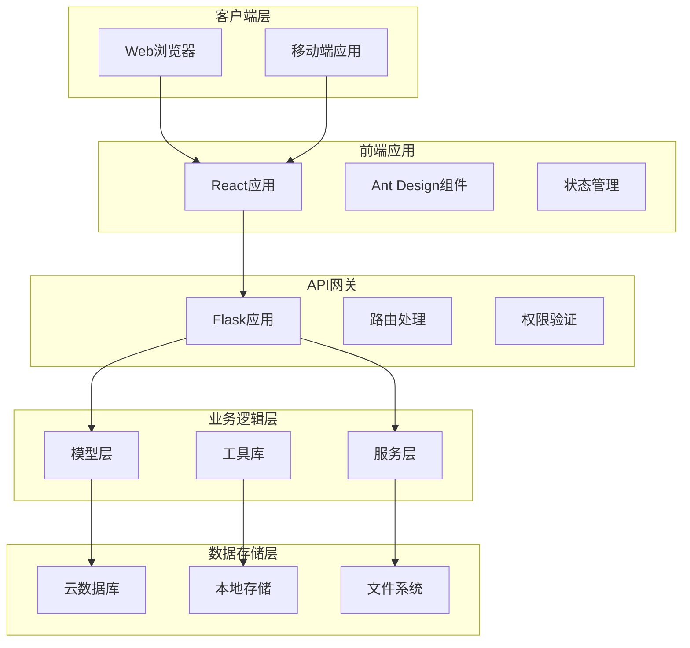

**图表来源**
- [backend_utils/api.js](file://backend_utils/api.js#L42-L102)
- [backend_utils/db.js](file://backend_utils/db.js#L5-L11)
- [routes/admin.py](file://routes/admin.py#L1-L24)

### 数据流处理

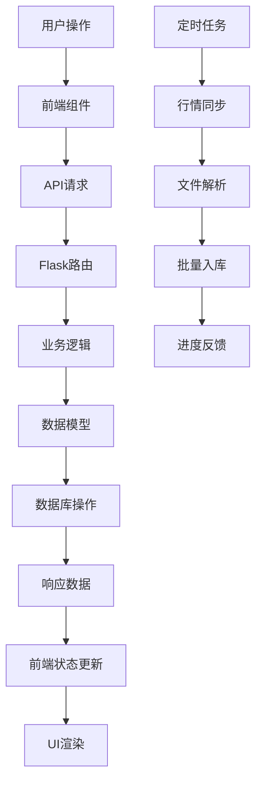

**图表来源**
- [admin-ui/src/pages/Quotes.tsx](file://admin-ui/src/pages/Quotes.tsx#L267-L320)
- [routes/admin.py](file://routes/admin.py#L687-L720)

**章节来源**
- [backend_utils/api.js](file://backend_utils/api.js#L141-L190)
- [backend_utils/db.js](file://backend_utils/db.js#L38-L55)

## 详细组件分析

### 行情管理组件

#### 行情表格组件
行情管理页面提供了完整的行情数据展示和操作功能：

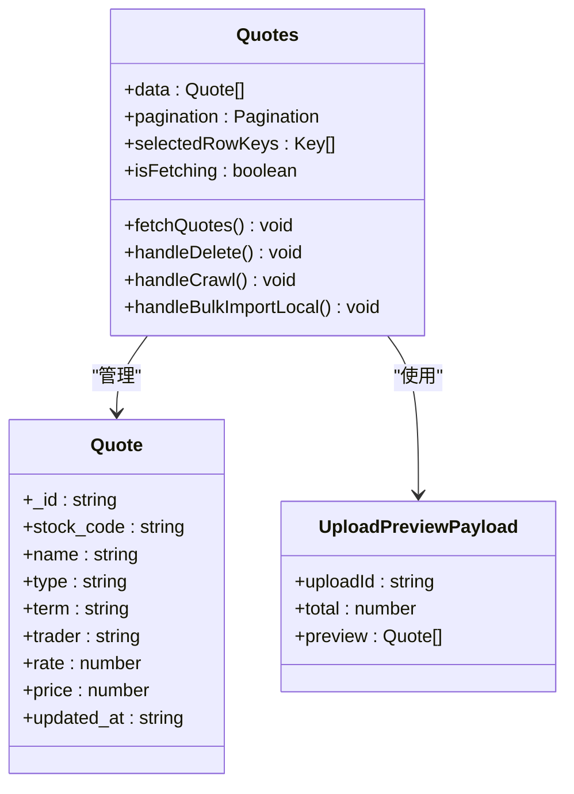

**图表来源**
- [admin-ui/src/pages/Quotes.tsx](file://admin-ui/src/pages/Quotes.tsx#L25-L94)
- [admin-ui/src/pages/Quotes.tsx](file://admin-ui/src/pages/Quotes.tsx#L129-L203)

#### 文件上传和批量导入流程

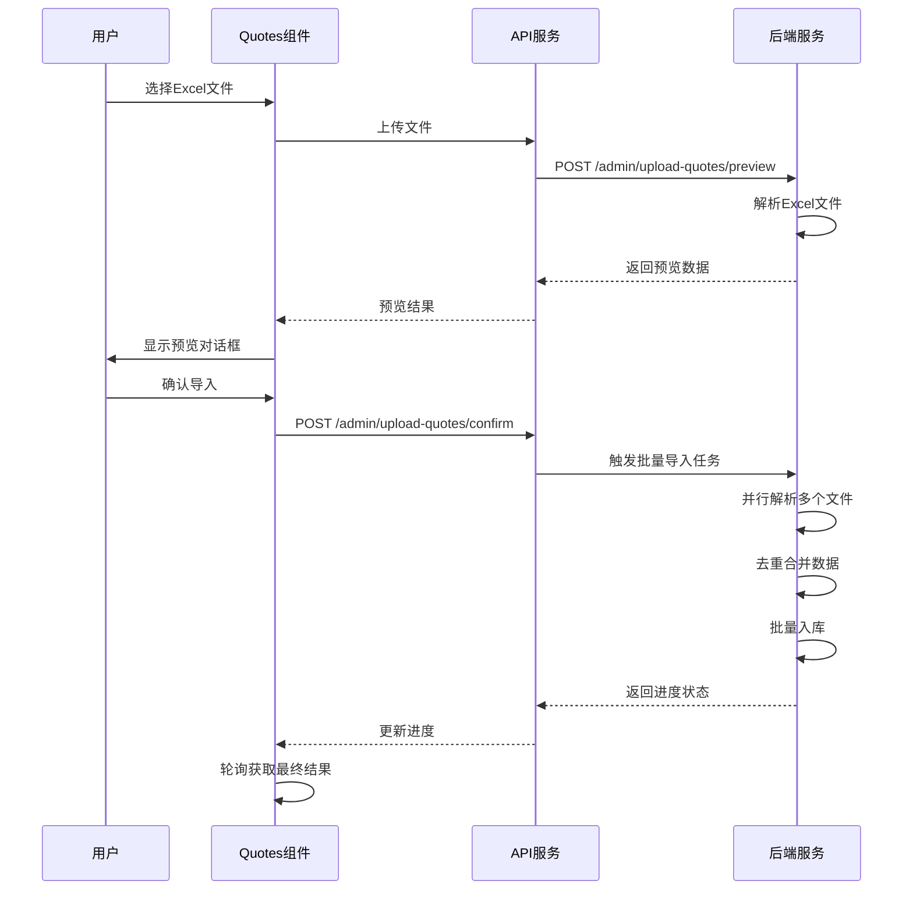

**图表来源**
- [admin-ui/src/pages/Quotes.tsx](file://admin-ui/src/pages/Quotes.tsx#L536-L560)
- [admin-ui/src/pages/Quotes.tsx](file://admin-ui/src/pages/Quotes.tsx#L562-L634)

**章节来源**
- [admin-ui/src/pages/Quotes.tsx](file://admin-ui/src/pages/Quotes.tsx#L129-L456)
- [routes/admin.py](file://routes/admin.py#L557-L686)

### 客户管理组件

#### 客户列表管理
客户管理页面提供了完整的客户信息维护功能：

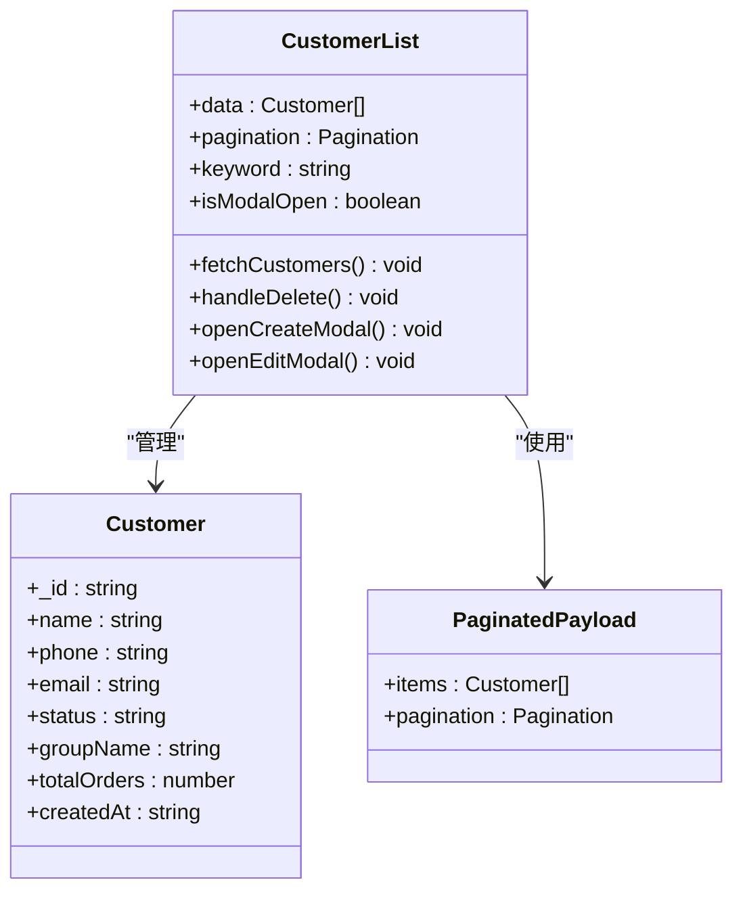

**图表来源**
- [admin-ui/src/pages/CustomerList.tsx](file://admin-ui/src/pages/CustomerList.tsx#L8-L26)
- [admin-ui/src/pages/CustomerList.tsx](file://admin-ui/src/pages/CustomerList.tsx#L28-L84)

**章节来源**
- [admin-ui/src/pages/CustomerList.tsx](file://admin-ui/src/pages/CustomerList.tsx#L28-L313)
- [models/customer.py](file://models/customer.py#L10-L304)

### 登录和权限管理

#### 登录服务架构
系统提供了多种登录方式和完善的权限管理：

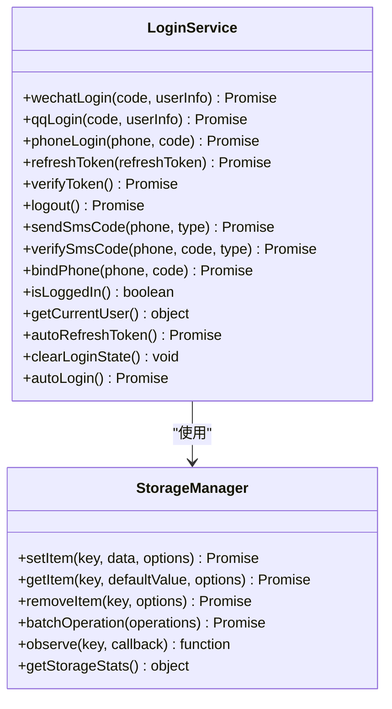

**图表来源**
- [backend_utils/loginService.js](file://backend_utils/loginService.js#L4-L325)
- [backend_utils/storage-manager.js](file://backend_utils/storage-manager.js#L7-L776)

**章节来源**
- [backend_utils/loginService.js](file://backend_utils/loginService.js#L4-L325)
- [backend_utils/storage-manager.js](file://backend_utils/storage-manager.js#L7-L776)

### 通知管理系统

#### 通知管理架构
系统实现了完整的通知管理功能，支持多种通知类型：

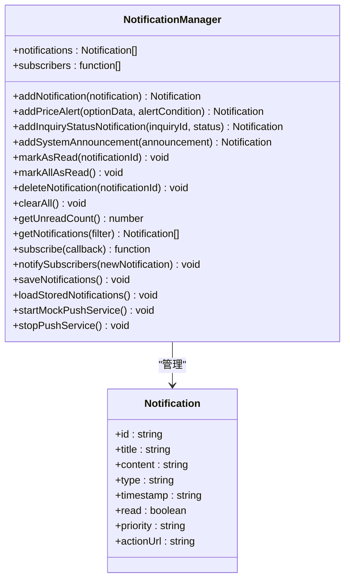

**图表来源**
- [backend_utils/notification-manager.js](file://backend_utils/notification-manager.js#L2-L205)

**章节来源**
- [backend_utils/notification-manager.js](file://backend_utils/notification-manager.js#L2-L205)

## 依赖关系分析

### 前端依赖关系

```mermaid
graph TB
subgraph "React应用依赖"
A[react] --> B[react-dom]
C[antd] --> D[@ant-design/icons]
E[react-router-dom] --> F[history]
G[axios] --> H[axios]
end
subgraph "开发依赖"
I[vite] --> J[@vitejs/plugin-react]
K[typescript] --> L[@types/react]
M[eslint] --> N[eslint-plugin-react]
O[vitest] --> P[jsdom]
end
```

**图表来源**
- [admin-ui/package.json](file://admin-ui/package.json#L13-L36)

### 后端依赖关系

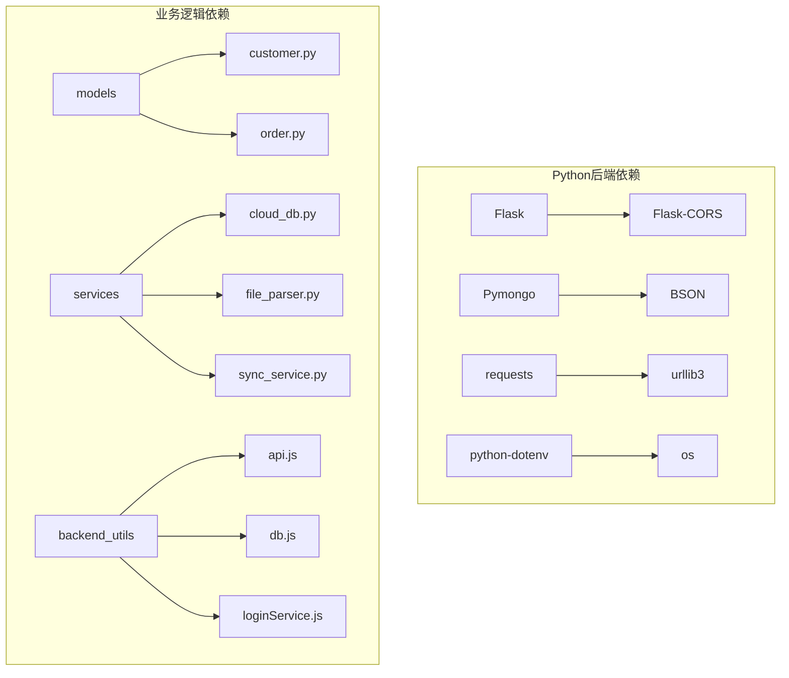

**图表来源**
- [routes/admin.py](file://routes/admin.py#L1-L24)
- [models/customer.py](file://models/customer.py#L1-L8)
- [models/order.py](file://models/order.py#L1-L8)

**章节来源**
- [admin-ui/package.json](file://admin-ui/package.json#L13-L36)
- [routes/admin.py](file://routes/admin.py#L1-L24)

## 性能考虑

### 前端性能优化

#### 请求队列和并发控制
API工具实现了智能的请求队列管理：

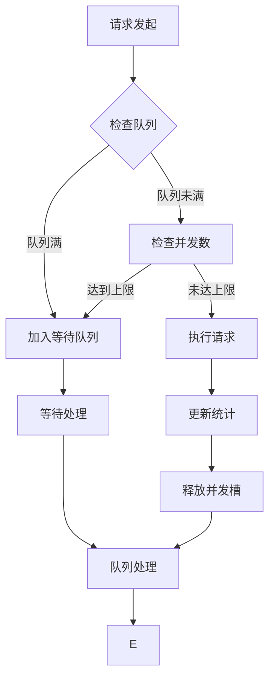

**图表来源**
- [backend_utils/api.js](file://backend_utils/api.js#L141-L190)

#### 缓存策略
系统实现了多层缓存机制：

1. **内存缓存**: 使用Map存储最近访问的数据
2. **本地存储**: 在小程序环境中使用wx.setStorageSync
3. **API缓存**: 对GET请求进行智能缓存管理
4. **LRU淘汰**: 自动清理最久未使用的缓存项

**章节来源**
- [backend_utils/api.js](file://backend_utils/api.js#L8-L31)
- [backend_utils/storage-manager.js](file://backend_utils/storage-manager.js#L13-L31)

### 后端性能优化

#### 异步任务处理
系统采用异步方式处理耗时操作：

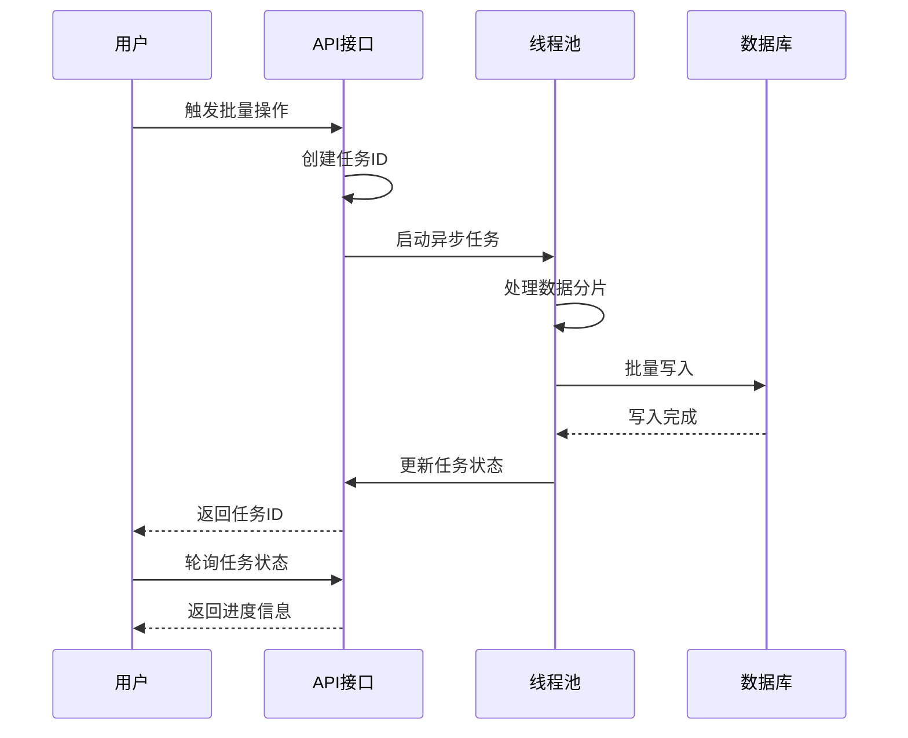

**图表来源**
- [routes/admin.py](file://routes/admin.py#L338-L387)
- [routes/admin.py](file://routes/admin.py#L687-L720)

**章节来源**
- [routes/admin.py](file://routes/admin.py#L338-L387)
- [routes/admin.py](file://routes/admin.py#L687-L720)

## 故障排除指南

### 常见问题诊断

#### API请求失败
当API请求失败时，系统提供了详细的错误处理机制：

1. **网络错误**: 检查网络连接和代理设置
2. **认证失败**: 验证token有效性，必要时刷新token
3. **服务器错误**: 查看服务器日志，检查数据库连接
4. **超时错误**: 调整超时参数或优化网络环境

#### 数据同步问题
批量数据导入可能出现的问题：

1. **文件格式错误**: 确保Excel文件格式正确
2. **数据重复**: 系统会自动去重，但可能影响性能
3. **导入失败**: 检查数据格式和必填字段
4. **进度卡住**: 检查服务器负载和数据库连接

**章节来源**
- [backend_utils/api.js](file://backend_utils/api.js#L258-L330)
- [admin-ui/src/pages/Quotes.tsx](file://admin-ui/src/pages/Quotes.tsx#L282-L313)

### 调试工具

#### 日志记录
系统实现了多层次的日志记录机制：

1. **前端日志**: 使用console.log记录关键操作
2. **后端日志**: 使用logging模块记录服务器操作
3. **错误日志**: 捕获异常并记录详细信息
4. **性能日志**: 记录API响应时间和错误率

#### 监控指标
系统提供了基本的性能监控功能：

- API请求统计
- 缓存命中率
- 错误率统计
- 响应时间分析

**章节来源**
- [backend_utils/api.js](file://backend_utils/api.js#L200-L252)
- [backend_utils/storage-manager.js](file://backend_utils/storage-manager.js#L529-L536)

## 结论

本行政管理工具系统具有以下特点：

### 优势
1. **模块化设计**: 前后端分离，职责清晰
2. **用户体验**: 基于Ant Design的现代化界面
3. **功能完整**: 覆盖期权交易管理的各个方面
4. **性能优化**: 多层缓存和异步处理机制
5. **扩展性强**: 插件化的架构设计

### 改进建议
1. **安全增强**: 添加更严格的权限控制和审计日志
2. **监控完善**: 集成专业的APM监控工具
3. **测试覆盖**: 增加单元测试和集成测试
4. **文档完善**: 补充API文档和开发指南
5. **国际化**: 支持多语言界面

该系统为场外期权交易提供了完整的管理解决方案，具有良好的可维护性和扩展性，能够满足不同规模企业的需求。