# 行政管理工具

<cite>
**本文档引用的文件**
- [admin-ui/src/main.tsx](file://admin-ui/src/main.tsx)
- [admin-ui/src/App.tsx](file://admin-ui/src/App.tsx)
- [admin-ui/package.json](file://admin-ui/package.json)
- [admin-ui/src/pages/Dashboard.tsx](file://admin-ui/src/pages/Dashboard.tsx)
- [admin-ui/src/pages/Quotes.tsx](file://admin-ui/src/pages/Quotes.tsx)
- [admin-ui/src/pages/CustomerList.tsx](file://admin-ui/src/pages/CustomerList.tsx)
- [admin-ui/src/components/AdminLayout.tsx](file://admin-ui/src/components/AdminLayout.tsx)
- [admin-ui/src/components/AuthGuard.tsx](file://admin-ui/src/components/AuthGuard.tsx)
- [routes/admin.py](file://routes/admin.py)
- [backend_utils/api.js](file://backend_utils/api.js)
- [backend_utils/db.js](file://backend_utils/db.js)
- [backend_utils/loginService.js](file://backend_utils/loginService.js)
- [backend_utils/storage-manager.js](file://backend_utils/storage-manager.js)
- [backend_utils/notification-manager.js](file://backend_utils/notification-manager.js)
- [models/customer.py](file://models/customer.py)
- [models/order.py](file://models/order.py)
- [scripts/create-collections.js](file://scripts/create-collections.js)
- [scripts/init_indexes.py](file://scripts/init_indexes.py)
- [cloudfunctions/cleanupTestData/index.js](file://cloudfunctions/cleanupTestData/index.js)
- [cloudfunctions/dataCleanup/index.js](file://cloudfunctions/dataCleanup/index.js)
- [cloudfunctions/dataImporter/index.js](file://cloudfunctions/dataImporter/index.js)
- [scripts/init-cloud-admin.js](file://scripts/init-cloud-admin.js)
- [scripts/init-cloud-data.js](file://scripts/init-cloud-data.js)
- [scripts/import-data.js](file://scripts/import-data.js)
- [scripts/deploy-cloudfunctions.js](file://scripts/deploy-cloudfunctions.js)
- [scripts/monitor-cloudfunctions.js](file://scripts/monitor-cloudfunctions.js)
</cite>

## 更新摘要
**所做更改**
- 新增运维自动化工具章节，涵盖数据清理、集合初始化、索引创建等运维功能
- 更新架构概览，增加云函数和运维工具的集成
- 新增云函数部署和监控章节
- 更新依赖关系分析，包含运维脚本和云函数
- 新增运维工具的详细使用指南和最佳实践

## 目录
1. [项目概述](#项目概述)
2. [项目结构](#项目结构)
3. [核心组件](#核心组件)
4. [架构概览](#架构概览)
5. [详细组件分析](#详细组件分析)
6. [运维自动化工具](#运维自动化工具)
7. [云函数部署与监控](#云函数部署与监控)
8. [依赖关系分析](#依赖关系分析)
9. [性能考虑](#性能考虑)
10. [故障排除指南](#故障排除指南)
11. [结论](#结论)

## 项目概述

本项目是一个基于React的场外期权后台管理系统，专门为期权交易提供全面的行政管理功能。系统采用前后端分离架构，前端使用React + Ant Design构建现代化的管理界面，后端基于Flask提供RESTful API服务。

该系统主要面向期权交易员和管理员，提供以下核心功能：
- 行情管理（实时行情、历史行情、板块管理）
- 客户管理（客户列表、分组管理）
- 交易管理（订单管理、询价管理、持仓管理）
- 费用管理（费用列表、统计分析）
- 消息管理（消息列表、模板管理）
- 系统配置（系统配置、用户管理）

**新增** 系统还集成了完整的运维自动化工具，包括数据清理、集合初始化、索引创建、云函数部署和监控等功能，为系统的稳定运行提供保障。

## 项目结构

```mermaid
graph TB
subgraph "前端应用 (admin-ui)"
A[React 应用] --> B[页面组件]
A --> C[布局组件]
A --> D[工具模块]
B --> B1[Dashboard]
B --> B2[Quotes]
B --> B3[CustomerList]
C --> C1[AdminLayout]
C --> C2[AuthGuard]
D --> D1[API工具]
D --> D2[存储管理]
D --> D3[通知管理]
end
subgraph "后端服务"
E[Flask 应用] --> F[路由模块]
E --> G[模型层]
E --> H[服务层]
F --> F1[admin.py]
G --> G1[customer.py]
G --> G2[order.py]
H --> H1[cloud_db.py]
H --> H2[file_parser.py]
H --> H3[sync_service.py]
end
subgraph "运维工具"
I[scripts/] --> I1[create-collections.js]
I --> I2[init_indexes.py]
I --> I3[deploy-cloudfunctions.js]
I --> I4[monitor-cloudfunctions.js]
I --> I5[init-cloud-admin.js]
I --> I6[init-cloud-data.js]
end
subgraph "云函数"
J[cloudfunctions/] --> J1[cleanupTestData]
J --> J2[dataCleanup]
J --> J3[dataImporter]
J --> J4[updateQuotes]
end
subgraph "工具库"
K[backend_utils] --> K1[api.js]
K --> K2[db.js]
K --> K3[loginService.js]
K --> K4[storage-manager.js]
K --> K5[notification-manager.js]
end
A --> E
E --> K
I --> J
```

**图表来源**
- [admin-ui/src/main.tsx:1-14](file://admin-ui/src/main.tsx#L1-L14)
- [admin-ui/src/App.tsx:1-65](file://admin-ui/src/App.tsx#L1-L65)
- [routes/admin.py:1-800](file://routes/admin.py#L1-L800)
- [scripts/create-collections.js:1-59](file://scripts/create-collections.js#L1-L59)
- [cloudfunctions/cleanupTestData/index.js:1-373](file://cloudfunctions/cleanupTestData/index.js#L1-L373)

**章节来源**
- [admin-ui/src/main.tsx:1-14](file://admin-ui/src/main.tsx#L1-L14)
- [admin-ui/src/App.tsx:1-65](file://admin-ui/src/App.tsx#L1-L65)
- [admin-ui/package.json:1-38](file://admin-ui/package.json#L1-L38)

## 核心组件

### 前端核心组件

#### 应用入口和路由配置
应用采用React Router进行路由管理，支持嵌套路由和权限控制：

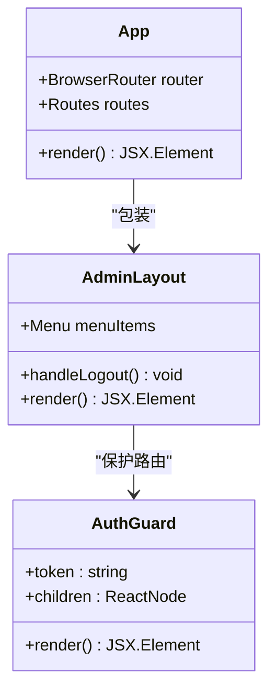
```mermaid
classDiagram
class App {
+BrowserRouter router
+Routes routes
+render() JSX.Element
}
class AdminLayout {
+Menu menuItems
+handleLogout() void
+render() JSX.Element
}
class AuthGuard {
+token : string
+children : ReactNode
+render() JSX.Element
}
App --> AdminLayout : "包装"
AdminLayout --> AuthGuard : "保护路由"
```

**图表来源**
- [admin-ui/src/App.tsx:25-62](file://admin-ui/src/App.tsx#L25-L62)
- [admin-ui/src/components/AdminLayout.tsx:19-180](file://admin-ui/src/components/AdminLayout.tsx#L19-L180)
- [admin-ui/src/components/AuthGuard.tsx:8-17](file://admin-ui/src/components/AuthGuard.tsx#L8-L17)

#### 页面组件架构
每个页面组件都遵循统一的模式，包含数据获取、状态管理和用户交互：

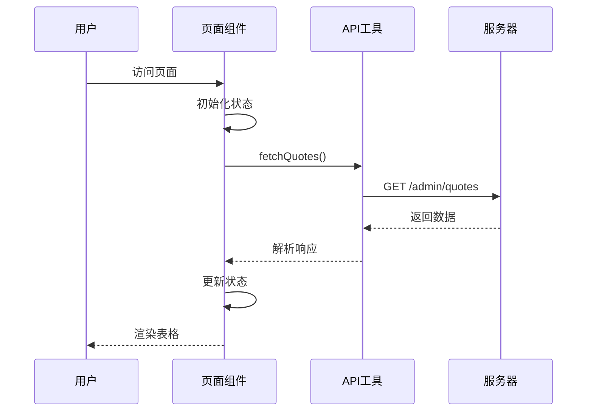
```mermaid
sequenceDiagram
participant U as 用户
participant P as 页面组件
participant A as API工具
participant S as 服务器
U->>P : 访问页面
P->>P : 初始化状态
P->>A : fetchQuotes()
A->>S : GET /admin/quotes
S-->>A : 返回数据
A-->>P : 解析响应
P->>P : 更新状态
P-->>U : 渲染表格
```

**图表来源**
- [admin-ui/src/pages/Quotes.tsx:153-183](file://admin-ui/src/pages/Quotes.tsx#L153-L183)
- [admin-ui/src/pages/Dashboard.tsx:29-46](file://admin-ui/src/pages/Dashboard.tsx#L29-L46)

**章节来源**
- [admin-ui/src/App.tsx:25-62](file://admin-ui/src/App.tsx#L25-L62)
- [admin-ui/src/components/AdminLayout.tsx:42-99](file://admin-ui/src/components/AdminLayout.tsx#L42-L99)
- [admin-ui/src/components/AuthGuard.tsx:8-17](file://admin-ui/src/components/AuthGuard.tsx#L8-L17)

### 后端核心组件

#### Flask路由模块
后端采用蓝图(BP)模式组织路由，提供完整的管理功能：

```mermaid
graph TD
A[admin_bp] --> B[统计接口]
A --> C[行情接口]
A --> D[客户接口]
A --> E[订单接口]
A --> F[文件上传接口]
A --> G[同步接口]
B --> B1[/stats]
C --> C1[/quotes]
C --> C2[/sync-quotes]
C --> C3[/upload-quotes]
D --> D1[/customers]
E --> E1[/orders]
F --> F1[/upload-quotes/preview]
F --> F2[/upload-quotes/confirm]
G --> G1[/sync-quotes]
G --> G2[/sync-all-quotes]
```

**图表来源**
- [routes/admin.py:47-84](file://routes/admin.py#L47-L84)
- [routes/admin.py:114-156](file://routes/admin.py#L114-L156)
- [routes/admin.py:557-583](file://routes/admin.py#L557-L583)

**章节来源**
- [routes/admin.py:24-84](file://routes/admin.py#L24-L84)
- [routes/admin.py:114-156](file://routes/admin.py#L114-L156)
- [routes/admin.py:557-583](file://routes/admin.py#L557-L583)

## 架构概览

### 整体架构设计

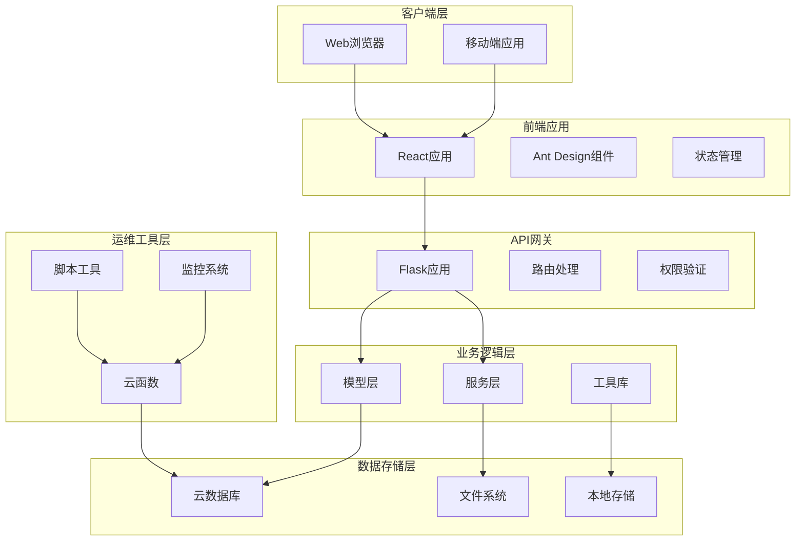
```mermaid
graph TB
subgraph "客户端层"
A[Web浏览器]
B[移动端应用]
end
subgraph "前端应用"
C[React应用]
D[Ant Design组件]
E[状态管理]
end
subgraph "API网关"
F[Flask应用]
G[路由处理]
H[权限验证]
end
subgraph "业务逻辑层"
I[模型层]
J[服务层]
K[工具库]
end
subgraph "数据存储层"
L[云数据库]
M[本地存储]
N[文件系统]
end
subgraph "运维工具层"
O[脚本工具]
P[云函数]
Q[监控系统]
end
A --> C
B --> C
C --> F
F --> I
F --> J
I --> L
J --> N
K --> M
O --> P
P --> L
Q --> P
```

**图表来源**
- [backend_utils/api.js:42-102](file://backend_utils/api.js#L42-L102)
- [backend_utils/db.js:5-11](file://backend_utils/db.js#L5-L11)
- [routes/admin.py:1-24](file://routes/admin.py#L1-L24)
- [scripts/deploy-cloudfunctions.js:1-260](file://scripts/deploy-cloudfunctions.js#L1-L260)

### 数据流处理

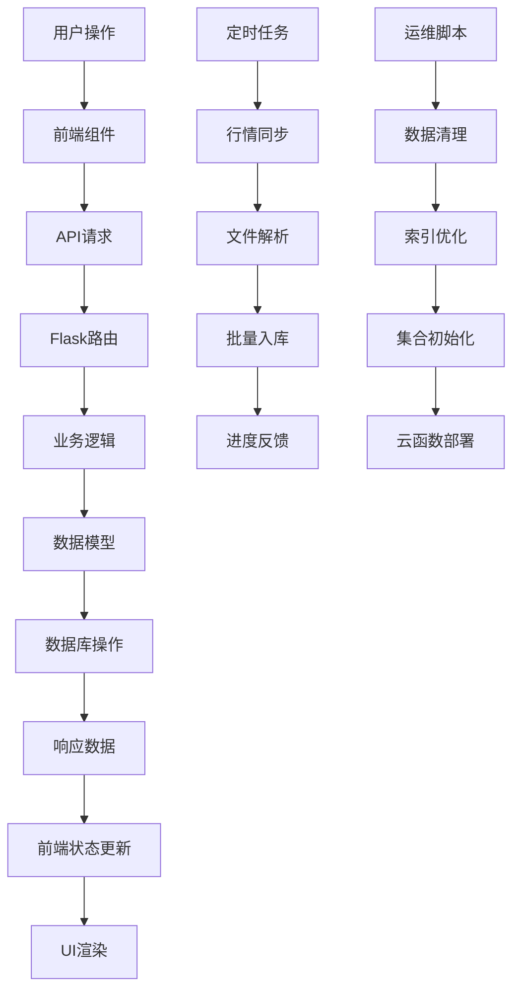
```mermaid
flowchart TD
A[用户操作] --> B[前端组件]
B --> C[API请求]
C --> D[Flask路由]
D --> E[业务逻辑]
E --> F[数据模型]
F --> G[数据库操作]
G --> H[响应数据]
H --> I[前端状态更新]
I --> J[UI渲染]
K[定时任务] --> L[行情同步]
L --> M[文件解析]
M --> N[批量入库]
N --> O[进度反馈]
P[运维脚本] --> Q[数据清理]
Q --> R[索引优化]
R --> S[集合初始化]
S --> T[云函数部署]
```

**图表来源**
- [admin-ui/src/pages/Quotes.tsx:267-320](file://admin-ui/src/pages/Quotes.tsx#L267-L320)
- [routes/admin.py:687-720](file://routes/admin.py#L687-L720)
- [scripts/init_indexes.py:1-347](file://scripts/init_indexes.py#L1-L347)

**章节来源**
- [backend_utils/api.js:141-190](file://backend_utils/api.js#L141-L190)
- [backend_utils/db.js:38-55](file://backend_utils/db.js#L38-L55)

## 详细组件分析

### 行情管理组件

#### 行情表格组件
行情管理页面提供了完整的行情数据展示和操作功能：

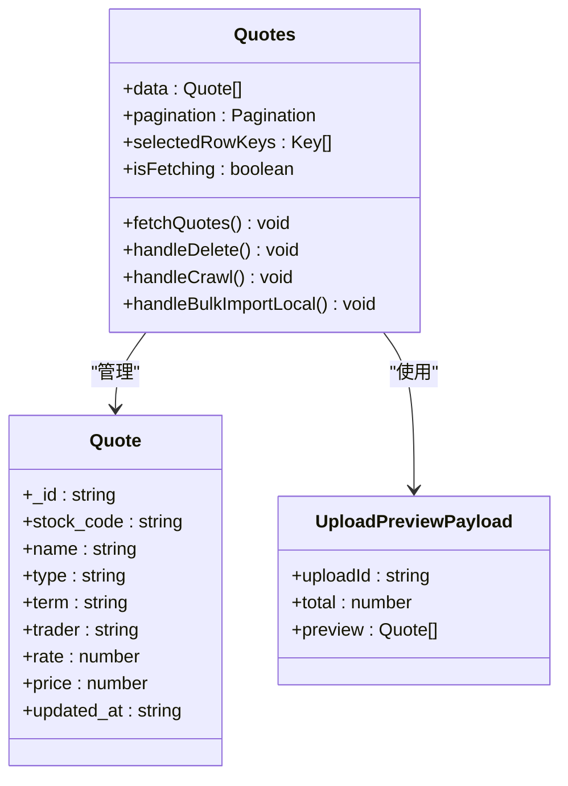
```mermaid
classDiagram
class Quotes {
+data : Quote[]
+pagination : Pagination
+selectedRowKeys : Key[]
+isFetching : boolean
+fetchQuotes() void
+handleDelete() void
+handleCrawl() void
+handleBulkImportLocal() void
}
class Quote {
+_id : string
+stock_code : string
+name : string
+type : string
+term : string
+trader : string
+rate : number
+price : number
+updated_at : string
}
class UploadPreviewPayload {
+uploadId : string
+total : number
+preview : Quote[]
}
Quotes --> Quote : "管理"
Quotes --> UploadPreviewPayload : "使用"
```

**图表来源**
- [admin-ui/src/pages/Quotes.tsx:25-94](file://admin-ui/src/pages/Quotes.tsx#L25-L94)
- [admin-ui/src/pages/Quotes.tsx:129-203](file://admin-ui/src/pages/Quotes.tsx#L129-L203)

#### 文件上传和批量导入流程

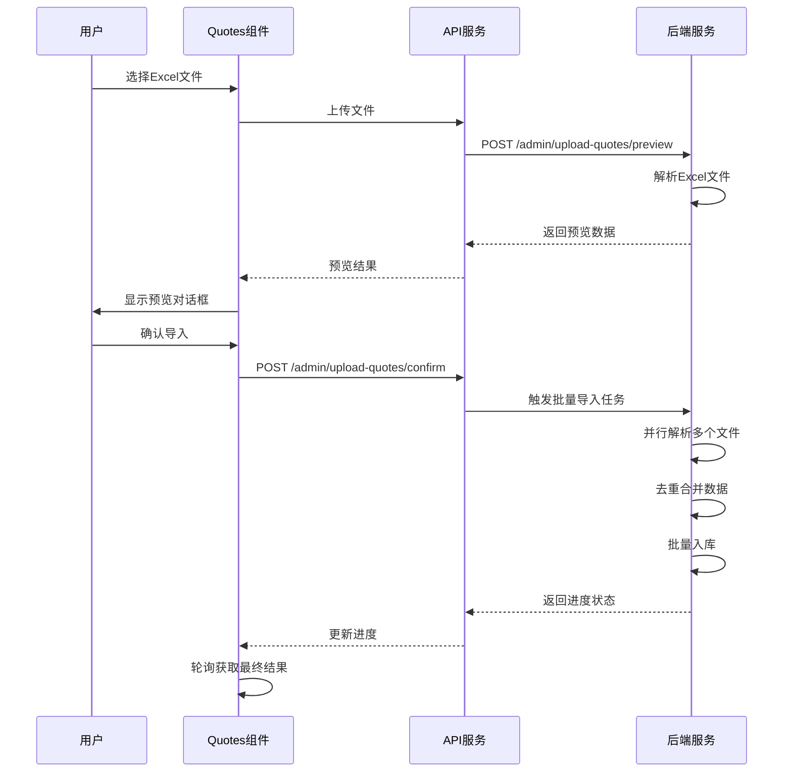
```mermaid
sequenceDiagram
participant U as 用户
participant P as Quotes组件
participant API as API服务
participant S as 后端服务
U->>P : 选择Excel文件
P->>API : 上传文件
API->>S : POST /admin/upload-quotes/preview
S->>S : 解析Excel文件
S-->>API : 返回预览数据
API-->>P : 预览结果
P->>U : 显示预览对话框
U->>P : 确认导入
P->>API : POST /admin/upload-quotes/confirm
API->>S : 触发批量导入任务
S->>S : 并行解析多个文件
S->>S : 去重合并数据
S->>S : 批量入库
S-->>API : 返回进度状态
API-->>P : 更新进度
P->>P : 轮询获取最终结果
```

**图表来源**
- [admin-ui/src/pages/Quotes.tsx:536-560](file://admin-ui/src/pages/Quotes.tsx#L536-L560)
- [admin-ui/src/pages/Quotes.tsx:562-634](file://admin-ui/src/pages/Quotes.tsx#L562-L634)

**章节来源**
- [admin-ui/src/pages/Quotes.tsx:129-456](file://admin-ui/src/pages/Quotes.tsx#L129-L456)
- [routes/admin.py:557-686](file://routes/admin.py#L557-L686)

### 客户管理组件

#### 客户列表管理
客户管理页面提供了完整的客户信息维护功能：

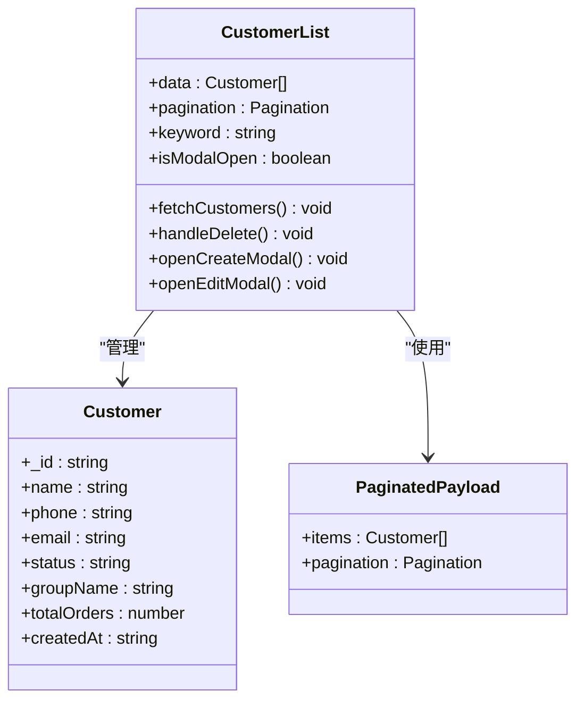
```mermaid
classDiagram
class CustomerList {
+data : Customer[]
+pagination : Pagination
+keyword : string
+isModalOpen : boolean
+fetchCustomers() void
+handleDelete() void
+openCreateModal() void
+openEditModal() void
}
class Customer {
+_id : string
+name : string
+phone : string
+email : string
+status : string
+groupName : string
+totalOrders : number
+createdAt : string
}
class PaginatedPayload {
+items : Customer[]
+pagination : Pagination
}
CustomerList --> Customer : "管理"
CustomerList --> PaginatedPayload : "使用"
```

**图表来源**
- [admin-ui/src/pages/CustomerList.tsx:8-26](file://admin-ui/src/pages/CustomerList.tsx#L8-L26)
- [admin-ui/src/pages/CustomerList.tsx:28-84](file://admin-ui/src/pages/CustomerList.tsx#L28-L84)

**章节来源**
- [admin-ui/src/pages/CustomerList.tsx:28-313](file://admin-ui/src/pages/CustomerList.tsx#L28-L313)
- [models/customer.py:10-304](file://models/customer.py#L10-L304)

### 登录和权限管理

#### 登录服务架构
系统提供了多种登录方式和完善的权限管理：

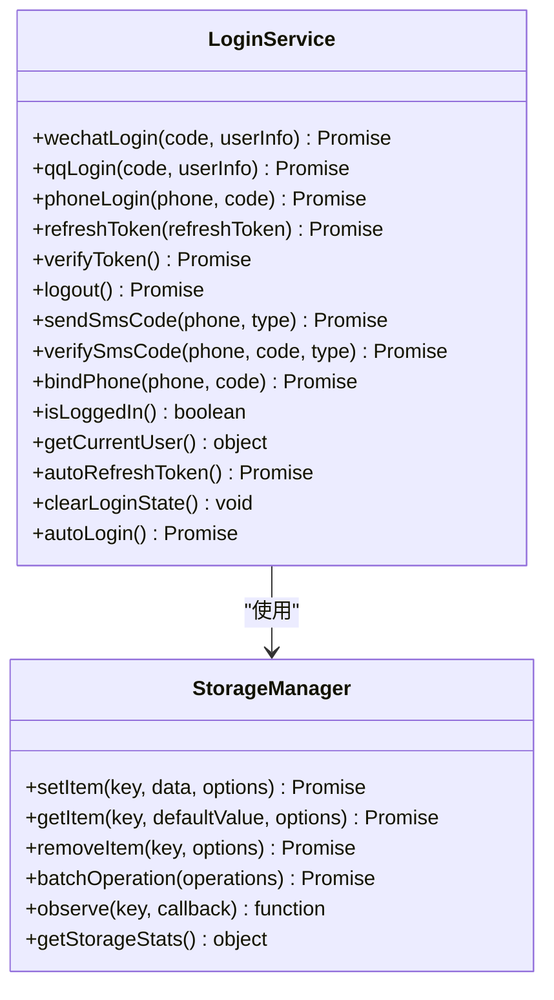
```mermaid
classDiagram
class LoginService {
+wechatLogin(code, userInfo) Promise
+qqLogin(code, userInfo) Promise
+phoneLogin(phone, code) Promise
+refreshToken(refreshToken) Promise
+verifyToken() Promise
+logout() Promise
+sendSmsCode(phone, type) Promise
+verifySmsCode(phone, code, type) Promise
+bindPhone(phone, code) Promise
+isLoggedIn() boolean
+getCurrentUser() object
+autoRefreshToken() Promise
+clearLoginState() void
+autoLogin() Promise
}
class StorageManager {
+setItem(key, data, options) Promise
+getItem(key, defaultValue, options) Promise
+removeItem(key, options) Promise
+batchOperation(operations) Promise
+observe(key, callback) function
+getStorageStats() object
}
LoginService --> StorageManager : "使用"
```

**图表来源**
- [backend_utils/loginService.js:4-325](file://backend_utils/loginService.js#L4-L325)
- [backend_utils/storage-manager.js:7-776](file://backend_utils/storage-manager.js#L7-L776)

**章节来源**
- [backend_utils/loginService.js:4-325](file://backend_utils/loginService.js#L4-L325)
- [backend_utils/storage-manager.js:7-776](file://backend_utils/storage-manager.js#L7-L776)

### 通知管理系统

#### 通知管理架构
系统实现了完整的通知管理功能，支持多种通知类型：

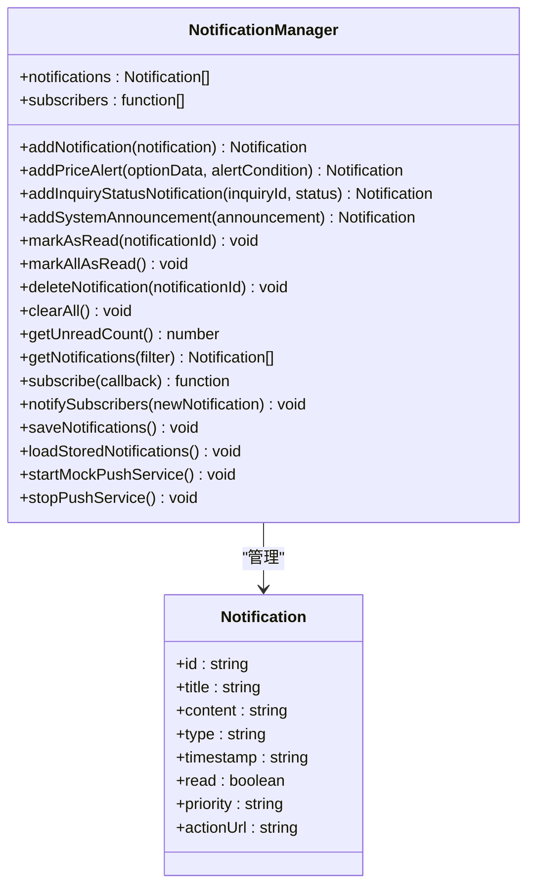
```mermaid
classDiagram
class NotificationManager {
+notifications : Notification[]
+subscribers : function[]
+addNotification(notification) Notification
+addPriceAlert(optionData, alertCondition) Notification
+addInquiryStatusNotification(inquiryId, status) Notification
+addSystemAnnouncement(announcement) Notification
+markAsRead(notificationId) void
+markAllAsRead() void
+deleteNotification(notificationId) void
+clearAll() void
+getUnreadCount() number
+getNotifications(filter) Notification[]
+subscribe(callback) function
+notifySubscribers(newNotification) void
+saveNotifications() void
+loadStoredNotifications() void
+startMockPushService() void
+stopPushService() void
}
class Notification {
+id : string
+title : string
+content : string
+type : string
+timestamp : string
+read : boolean
+priority : string
+actionUrl : string
}
NotificationManager --> Notification : "管理"
```

**图表来源**
- [backend_utils/notification-manager.js:2-205](file://backend_utils/notification-manager.js#L2-L205)

**章节来源**
- [backend_utils/notification-manager.js:2-205](file://backend_utils/notification-manager.js#L2-L205)

## 运维自动化工具

### 数据清理工具

#### 测试数据清理云函数
系统提供了强大的数据清理功能，专门用于清理测试环境中的数据：

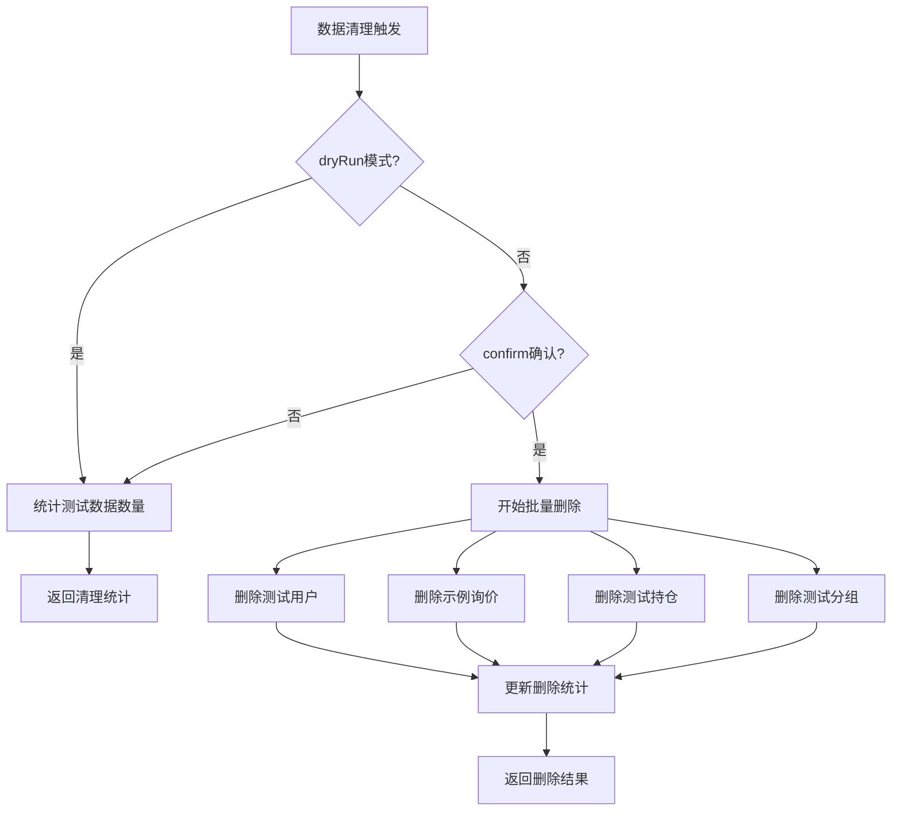
```mermaid
flowchart TD
A[数据清理触发] --> B{dryRun模式?}
B --> |是| C[统计测试数据数量]
B --> |否| D{confirm确认?}
D --> |否| C
D --> |是| E[开始批量删除]
C --> F[返回清理统计]
E --> G[删除测试用户]
E --> H[删除示例询价]
E --> I[删除测试持仓]
E --> J[删除测试分组]
G --> K[更新删除统计]
H --> K
I --> K
J --> K
K --> L[返回删除结果]
```

**图表来源**
- [cloudfunctions/cleanupTestData/index.js:270-373](file://cloudfunctions/cleanupTestData/index.js#L270-L373)

#### 数据清理规则
系统采用智能的数据识别规则来区分测试数据和生产数据：

1. **测试用户识别**：用户名包含 test、demo、example、测试、示例等关键字
2. **示例询价识别**：产品名称包含测试关键字或明确标记为测试数据
3. **测试持仓识别**：明确标记为测试或包含测试关键字的产品
4. **测试分组识别**：分组名称包含测试关键字或明确标记为测试

#### 批量删除机制
系统实现了安全的批量删除机制，防止大规模数据删除造成的影响：

- **批量限制**：每次最多删除20条记录
- **循环删除**：自动检测剩余数据并继续删除
- **事务保证**：确保删除操作的原子性
- **进度跟踪**：实时跟踪删除进度和统计信息

**章节来源**
- [cloudfunctions/cleanupTestData/index.js:1-373](file://cloudfunctions/cleanupTestData/index.js#L1-L373)

### 集合初始化工具

#### 集合创建指南
系统提供了完整的集合创建指南，确保数据库结构的正确性：

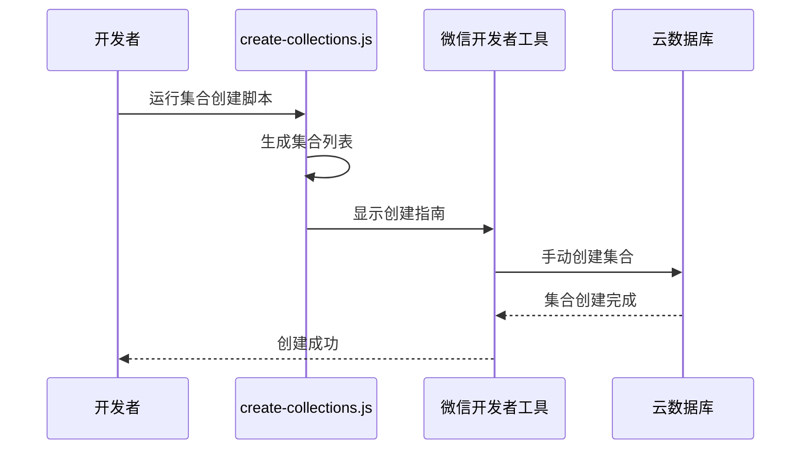
```mermaid
sequenceDiagram
participant A as 开发者
participant B as create-collections.js
participant C as 微信开发者工具
participant D as 云数据库
A->>B : 运行集合创建脚本
B->>B : 生成集合列表
B->>C : 显示创建指南
C->>D : 手动创建集合
D-->>C : 集合创建完成
C-->>A : 创建成功
```

**图表来源**
- [scripts/create-collections.js:1-59](file://scripts/create-collections.js#L1-L59)

#### 必需集合说明
系统要求创建以下必需集合以确保功能正常运行：

1. **users**：用户信息集合
2. **admin_users**：管理员用户集合
3. **inquiries**：询价记录集合
4. **quotes**：行情数据集合
5. **options**：期权产品集合
6. **positions**：持仓记录集合（必需）
7. **orders**：订单记录集合
8. **groups**：产品分组集合
9. **settings**：系统配置集合
10. **messages**：消息记录集合
11. **_schema_versions**：数据库版本集合

**章节来源**
- [scripts/create-collections.js:1-59](file://scripts/create-collections.js#L1-L59)

### 索引创建工具

#### 索引管理脚本
系统提供了智能化的索引管理功能，优化数据库查询性能：

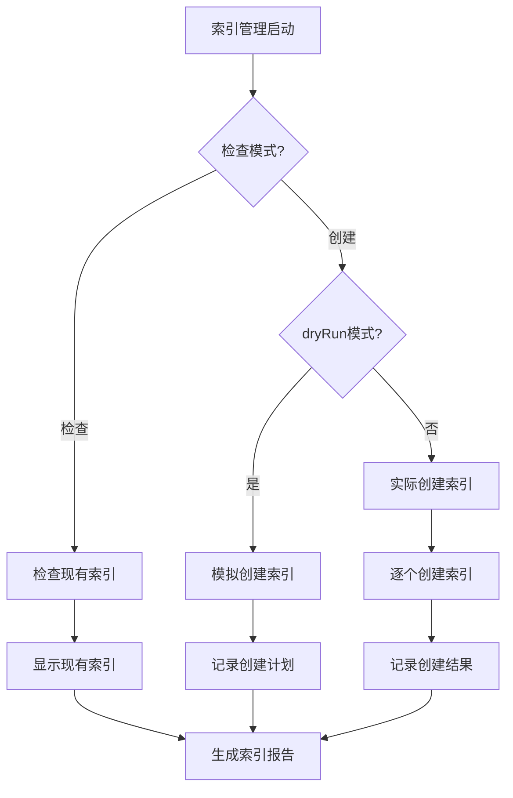
```mermaid
flowchart TD
A[索引管理启动] --> B{检查模式?}
B --> |检查| C[检查现有索引]
B --> |创建| D{dryRun模式?}
C --> E[显示现有索引]
D --> |是| F[模拟创建索引]
D --> |否| G[实际创建索引]
F --> H[记录创建计划]
G --> I[逐个创建索引]
I --> J[记录创建结果]
E --> K[生成索引报告]
H --> K
J --> K
```

**图表来源**
- [scripts/init_indexes.py:192-293](file://scripts/init_indexes.py#L192-L293)

#### 索引配置策略
系统针对不同集合制定了专门的索引配置策略：

1. **单字段索引**：用于常用查询条件的快速检索
2. **复合索引**：用于多条件组合查询的优化
3. **TTL索引**：用于自动清理过期数据
4. **稀疏索引**：仅对存在特定字段的文档建立索引

**章节来源**
- [scripts/init_indexes.py:1-347](file://scripts/init_indexes.py#L1-L347)

### 管理员初始化工具

#### 云托管管理员配置
系统提供了多种管理员账号初始化方式：

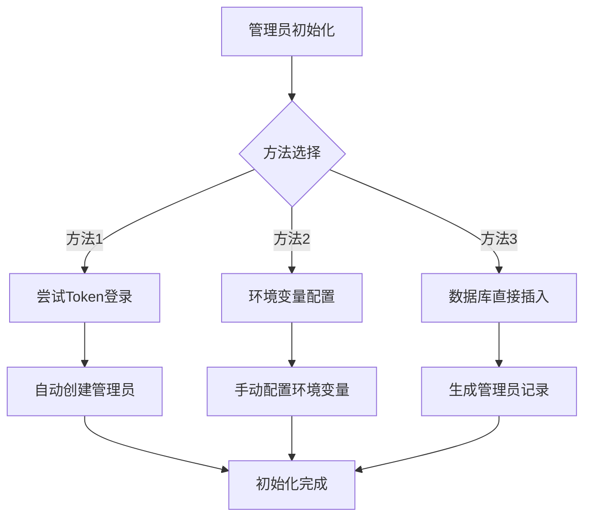
```mermaid
flowchart TD
A[管理员初始化] --> B{方法选择}
B --> |方法1| C[尝试Token登录]
B --> |方法2| D[环境变量配置]
B --> |方法3| E[数据库直接插入]
C --> F[自动创建管理员]
D --> G[手动配置环境变量]
E --> H[生成管理员记录]
F --> I[初始化完成]
G --> I
H --> I
```

**图表来源**
- [scripts/init-cloud-admin.js:73-143](file://scripts/init-cloud-admin.js#L73-L143)

#### 初始化流程
系统提供了三种管理员初始化方法：

1. **自动方法**：通过初始管理员Token自动创建新管理员
2. **环境变量方法**：在云托管控制台设置环境变量
3. **数据库方法**：直接在数据库中插入管理员记录

**章节来源**
- [scripts/init-cloud-admin.js:1-224](file://scripts/init-cloud-admin.js#L1-L224)

### 数据导入工具

#### 云数据库初始化
系统提供了完整的数据导入解决方案：

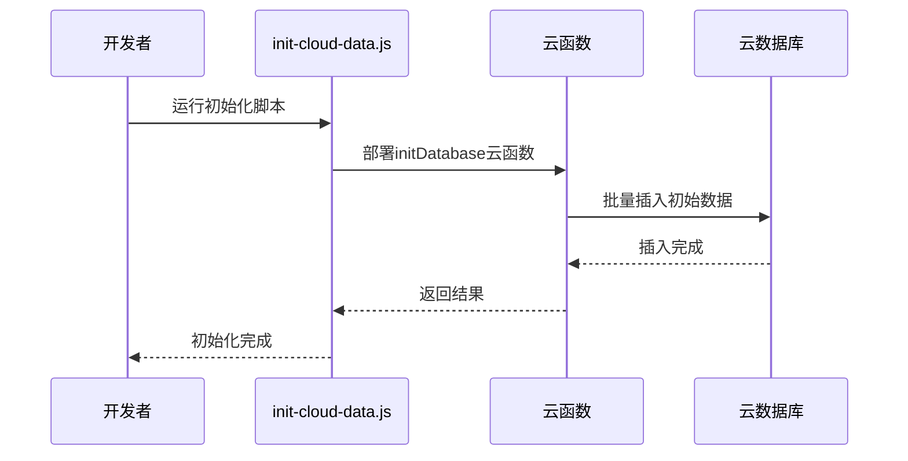
```mermaid
sequenceDiagram
participant A as 开发者
participant B as init-cloud-data.js
participant C as 云函数
participant D as 云数据库
A->>B : 运行初始化脚本
B->>C : 部署initDatabase云函数
C->>D : 批量插入初始数据
D-->>C : 插入完成
C-->>B : 返回结果
B-->>A : 初始化完成
```

**图表来源**
- [scripts/init-cloud-data.js:278-313](file://scripts/init-cloud-data.js#L278-L313)

#### 支持的数据类型
系统支持多种数据类型的初始化：

1. **行情数据**：包含指数、ETF、股票等基础行情数据
2. **期权数据**：包含各种期权产品的示例数据
3. **分组数据**：产品分类和组织结构数据
4. **系统配置**：平台基本配置和交易时间设置

**章节来源**
- [scripts/init-cloud-data.js:1-313](file://scripts/init-cloud-data.js#L1-L313)

## 云函数部署与监控

### 云函数部署工具

#### 一键部署脚本
系统提供了强大的云函数部署工具，支持批量部署和环境管理：

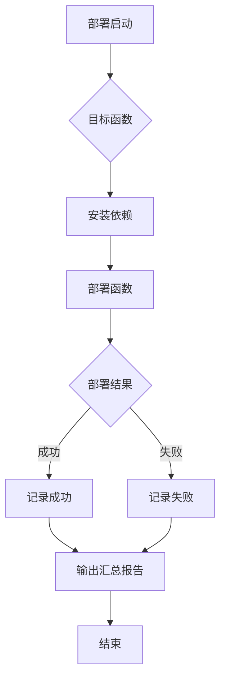
```mermaid
flowchart TD
A[部署启动] --> B{目标函数}
B --> C[安装依赖]
C --> D[部署函数]
D --> E{部署结果}
E --> |成功| F[记录成功]
E --> |失败| G[记录失败]
F --> H[输出汇总报告]
G --> H
H --> I[结束]
```

**图表来源**
- [scripts/deploy-cloudfunctions.js:113-171](file://scripts/deploy-cloudfunctions.js#L113-L171)

#### 支持的云函数
系统支持以下云函数的部署和管理：

1. **dataImporter**：数据导入服务
2. **updateQuotes**：行情更新服务
3. **reportError**：错误上报服务
4. **dataCleanup**：数据清理服务
5. **login**：用户登录服务
6. **submitInquiry**：提交询价服务
7. **handleInquiry**：处理询价服务

**章节来源**
- [scripts/deploy-cloudfunctions.js:1-260](file://scripts/deploy-cloudfunctions.js#L1-L260)

### 云函数监控系统

#### 健康检查工具
系统提供了全面的云函数监控和健康检查功能：

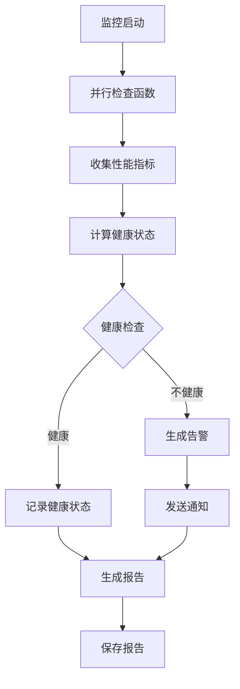
```mermaid
flowchart TD
A[监控启动] --> B[并行检查函数]
B --> C[收集性能指标]
C --> D[计算健康状态]
D --> E{健康检查}
E --> |健康| F[记录健康状态]
E --> |不健康| G[生成告警]
F --> H[生成报告]
G --> I[发送通知]
I --> H
H --> J[保存报告]
```

**图表来源**
- [scripts/monitor-cloudfunctions.js:325-380](file://scripts/monitor-cloudfunctions.js#L325-L380)

#### 监控指标
系统监控以下关键性能指标：

1. **错误率**：函数调用失败的比例
2. **响应时间**：函数执行的平均时间
3. **成功率**：函数调用成功的比例
4. **吞吐量**：单位时间内处理的请求数
5. **资源使用**：内存和CPU使用情况

**章节来源**
- [scripts/monitor-cloudfunctions.js:1-480](file://scripts/monitor-cloudfunctions.js#L1-L480)

## 依赖关系分析

### 前端依赖关系

```mermaid
graph TB
subgraph "React应用依赖"
A[react] --> B[react-dom]
C[antd] --> D[@ant-design/icons]
E[react-router-dom] --> F[history]
G[axios] --> H[axios]
end
subgraph "开发依赖"
I[vite] --> J[@vitejs/plugin-react]
K[typescript] --> L[@types/react]
M[eslint] --> N[eslint-plugin-react]
O[vitest] --> P[jsdom]
end
```

**图表来源**
- [admin-ui/package.json:13-36](file://admin-ui/package.json#L13-L36)

### 后端依赖关系

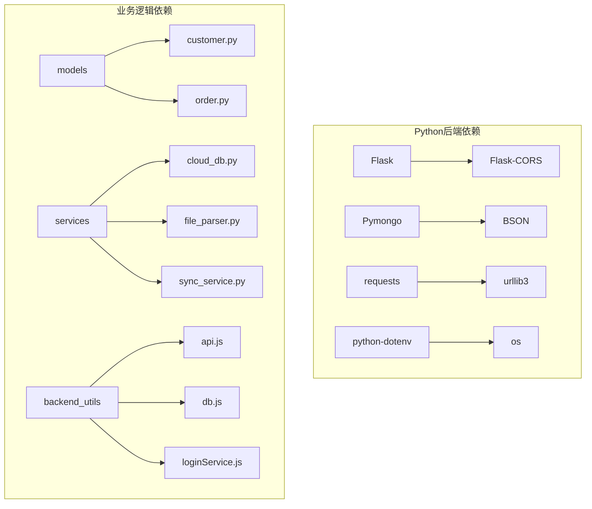
```mermaid
graph TB
subgraph "Python后端依赖"
A[Flask] --> B[Flask-CORS]
C[Pymongo] --> D[BSON]
E[requests] --> F[urllib3]
G[python-dotenv] --> H[os]
end
subgraph "业务逻辑依赖"
I[models] --> J[customer.py]
I --> K[order.py]
L[services] --> M[cloud_db.py]
L --> N[file_parser.py]
L --> O[sync_service.py]
P[backend_utils] --> Q[api.js]
P --> R[db.js]
P --> S[loginService.js]
end
```

**图表来源**
- [routes/admin.py:1-24](file://routes/admin.py#L1-L24)
- [models/customer.py:1-8](file://models/customer.py#L1-L8)
- [models/order.py:1-8](file://models/order.py#L1-L8)

### 运维工具依赖关系

```mermaid
graph TB
subgraph "Node.js运维工具"
A[scripts/] --> B[create-collections.js]
A --> C[init_indexes.py]
A --> D[deploy-cloudfunctions.js]
A --> E[monitor-cloudfunctions.js]
A --> F[init-cloud-admin.js]
A --> G[init-cloud-data.js]
A --> H[import-data.js]
end
subgraph "Python运维工具"
I[cloudfunctions/] --> J[cleanupTestData]
I --> K[dataCleanup]
I --> L[dataImporter]
end
subgraph "外部依赖"
M[微信开发者工具] --> N[云函数部署]
O[云数据库] --> P[数据操作]
Q[监控服务] --> R[告警通知]
end
```

**图表来源**
- [scripts/create-collections.js:1-59](file://scripts/create-collections.js#L1-L59)
- [scripts/init_indexes.py:1-347](file://scripts/init_indexes.py#L1-L347)
- [cloudfunctions/cleanupTestData/index.js:1-373](file://cloudfunctions/cleanupTestData/index.js#L1-L373)

**章节来源**
- [admin-ui/package.json:13-36](file://admin-ui/package.json#L13-L36)
- [routes/admin.py:1-24](file://routes/admin.py#L1-L24)

## 性能考虑

### 前端性能优化

#### 请求队列和并发控制
API工具实现了智能的请求队列管理：

```mermaid
flowchart TD
A[请求发起] --> B{检查队列}
B --> |队列满| C[加入等待队列]
B --> |队列未满| D[检查并发数]
D --> |达到上限| C
D --> |未达上限| E[执行请求]
C --> F[等待处理]
F --> G[队列处理]
G --> H[E]
E --> I[更新统计]
I --> J[释放并发槽]
J --> G
```

**图表来源**
- [backend_utils/api.js:141-190](file://backend_utils/api.js#L141-L190)

#### 缓存策略
系统实现了多层缓存机制：

1. **内存缓存**: 使用Map存储最近访问的数据
2. **本地存储**: 在小程序环境中使用wx.setStorageSync
3. **API缓存**: 对GET请求进行智能缓存管理
4. **LRU淘汰**: 自动清理最久未使用的缓存项

**章节来源**
- [backend_utils/api.js:8-31](file://backend_utils/api.js#L8-L31)
- [backend_utils/storage-manager.js:13-31](file://backend_utils/storage-manager.js#L13-L31)

### 后端性能优化

#### 异步任务处理
系统采用异步方式处理耗时操作：

```mermaid
sequenceDiagram
participant U as 用户
participant API as API接口
participant T as 线程池
participant DB as 数据库
U->>API : 触发批量操作
API->>API : 创建任务ID
API->>T : 启动异步任务
T->>T : 处理数据分片
T->>DB : 批量写入
DB-->>T : 写入完成
T->>API : 更新任务状态
API-->>U : 返回任务ID
U->>API : 轮询任务状态
API-->>U : 返回进度信息
```

**图表来源**
- [routes/admin.py:338-387](file://routes/admin.py#L338-L387)
- [routes/admin.py:687-720](file://routes/admin.py#L687-L720)

### 运维工具性能优化

#### 批量操作优化
运维工具采用了多项性能优化措施：

1. **批量删除**：每次最多删除20条记录，避免数据库压力过大
2. **并行处理**：监控系统并行检查多个云函数的状态
3. **智能重试**：部署工具支持失败重试和错误处理
4. **进度跟踪**：实时显示操作进度和统计信息

**章节来源**
- [cloudfunctions/cleanupTestData/index.js:24-74](file://cloudfunctions/cleanupTestData/index.js#L24-L74)
- [scripts/monitor-cloudfunctions.js:332-345](file://scripts/monitor-cloudfunctions.js#L332-L345)

## 故障排除指南

### 常见问题诊断

#### API请求失败
当API请求失败时，系统提供了详细的错误处理机制：

1. **网络错误**: 检查网络连接和代理设置
2. **认证失败**: 验证token有效性，必要时刷新token
3. **服务器错误**: 查看服务器日志，检查数据库连接
4. **超时错误**: 调整超时参数或优化网络环境

#### 数据同步问题
批量数据导入可能出现的问题：

1. **文件格式错误**: 确保Excel文件格式正确
2. **数据重复**: 系统会自动去重，但可能影响性能
3. **导入失败**: 检查数据格式和必填字段
4. **进度卡住**: 检查服务器负载和数据库连接

#### 运维工具问题
运维工具可能出现的问题：

1. **云函数部署失败**: 检查依赖安装和环境配置
2. **数据清理不彻底**: 确认测试数据识别规则和批量删除设置
3. **索引创建失败**: 检查数据库连接和权限设置
4. **监控告警异常**: 验证阈值设置和通知配置

**章节来源**
- [backend_utils/api.js:258-330](file://backend_utils/api.js#L258-L330)
- [admin-ui/src/pages/Quotes.tsx:282-313](file://admin-ui/src/pages/Quotes.tsx#L282-L313)

### 调试工具

#### 日志记录
系统实现了多层次的日志记录机制：

1. **前端日志**: 使用console.log记录关键操作
2. **后端日志**: 使用logging模块记录服务器操作
3. **错误日志**: 捕获异常并记录详细信息
4. **性能日志**: 记录API响应时间和错误率
5. **运维日志**: 记录脚本执行和云函数调用

#### 监控指标
系统提供了基本的性能监控功能：

- API请求统计
- 缓存命中率
- 错误率统计
- 响应时间分析
- 云函数健康状态

**章节来源**
- [backend_utils/api.js:200-252](file://backend_utils/api.js#L200-L252)
- [backend_utils/storage-manager.js:529-536](file://backend_utils/storage-manager.js#L529-L536)

## 结论

本行政管理工具系统具有以下特点：

### 优势
1. **模块化设计**: 前后端分离，职责清晰
2. **用户体验**: 基于Ant Design的现代化界面
3. **功能完整**: 覆盖期权交易管理的各个方面
4. **性能优化**: 多层缓存和异步处理机制
5. **扩展性强**: 插件化的架构设计
6. **运维自动化**: 完善的运维工具链
7. **监控完善**: 全面的健康检查和告警机制

### 改进建议
1. **安全增强**: 添加更严格的权限控制和审计日志
2. **监控完善**: 集成专业的APM监控工具
3. **测试覆盖**: 增加单元测试和集成测试
4. **文档完善**: 补充API文档和开发指南
5. **国际化**: 支持多语言界面
6. **自动化**: 增强CI/CD和自动化部署能力

### 运维工具价值
新增的运维自动化工具显著提升了系统的可维护性和稳定性：

1. **数据清理**：自动识别和清理测试数据，确保生产环境整洁
2. **集合初始化**：标准化数据库结构创建流程
3. **索引优化**：智能化的索引管理和性能优化
4. **云函数管理**：一键部署和监控云函数
5. **健康检查**：全面的系统健康状态监控

该系统为场外期权交易提供了完整的管理解决方案，具有良好的可维护性和扩展性，能够满足不同规模企业的需求。新增的运维自动化工具进一步增强了系统的稳定性和可靠性，为长期运营提供了有力保障。