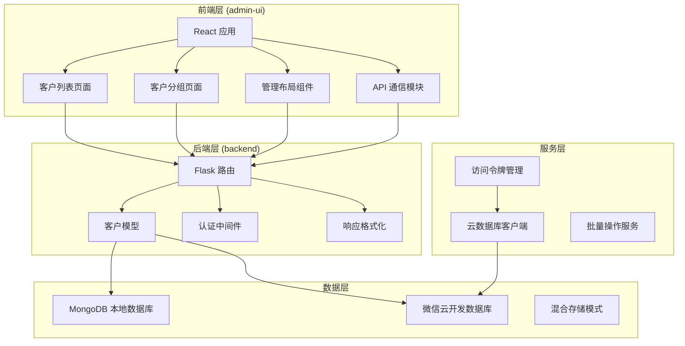
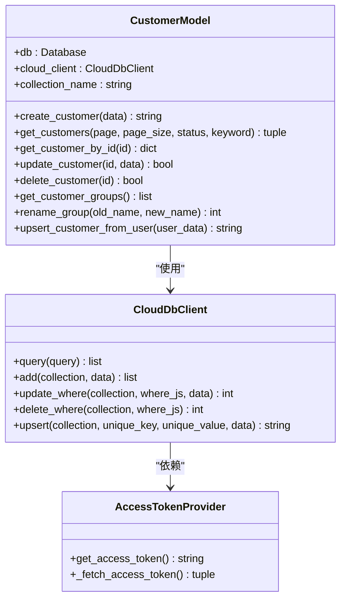
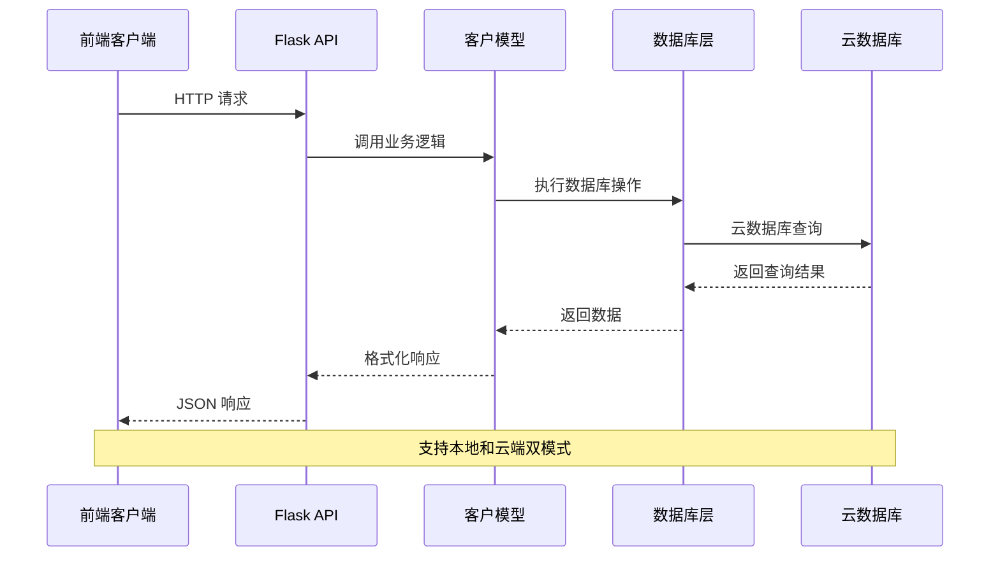
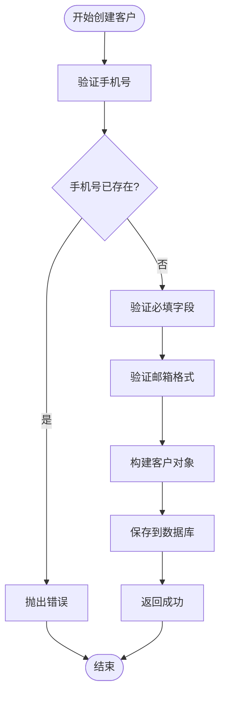
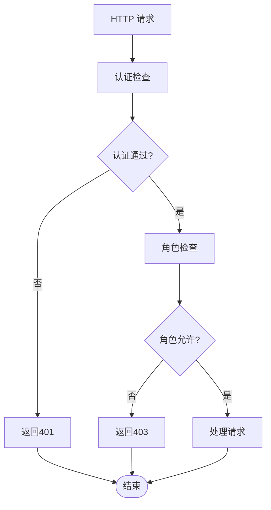
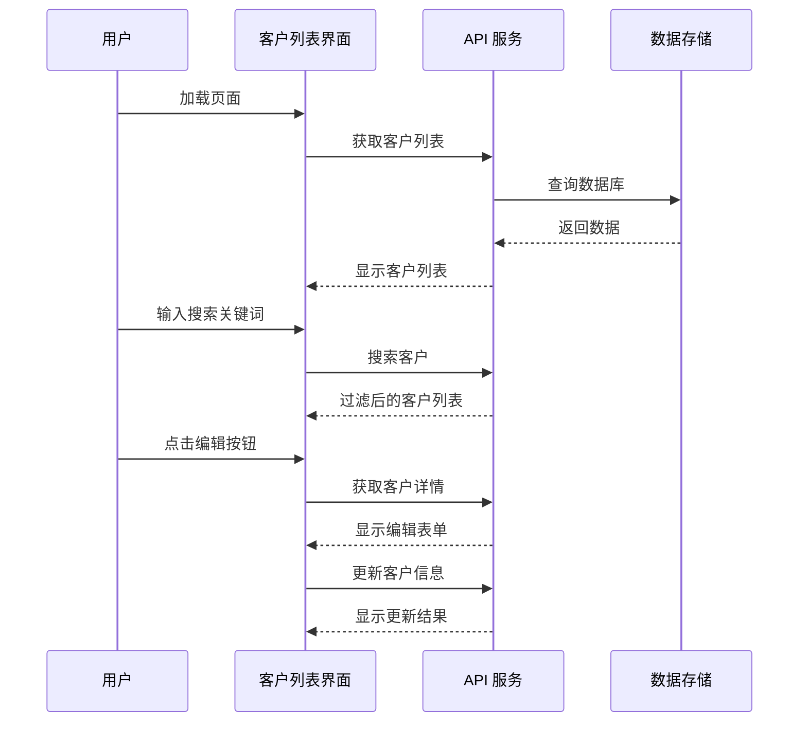
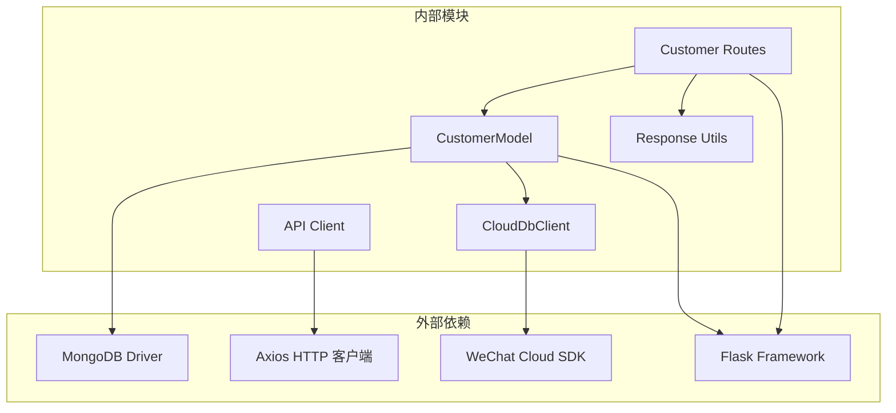

# 客户模型

<cite>
**本文档引用的文件**
- [models/customer.py](file://models/customer.py)
- [routes/customer.py](file://routes/customer.py)
- [services/cloud_db.py](file://services/cloud_db.py)
- [backend_utils/response.py](file://backend_utils/response.py)
- [admin-ui/src/App.tsx](file://admin-ui/src/App.tsx)
- [admin-ui/src/pages/CustomerList.tsx](file://admin-ui/src/pages/CustomerList.tsx)
- [admin-ui/src/pages/CustomerGroups.tsx](file://admin-ui/src/pages/CustomerGroups.tsx)
- [admin-ui/src/utils/api.ts](file://admin-ui/src/utils/api.ts)
- [admin-ui/src/components/AdminLayout.tsx](file://admin-ui/src/components/AdminLayout.tsx)
</cite>

## 目录
1. [简介](#简介)
2. [项目结构](#项目结构)
3. [核心组件](#核心组件)
4. [架构概览](#架构概览)
5. [详细组件分析](#详细组件分析)
6. [依赖关系分析](#依赖关系分析)
7. [性能考虑](#性能考虑)
8. [故障排除指南](#故障排除指南)
9. [结论](#结论)

## 简介

客户模型是场外期权管理系统中的核心业务组件，负责管理客户信息的完整生命周期。该系统采用前后端分离架构，后端使用Python Flask框架，前端使用React技术栈，支持本地MongoDB数据库和微信云开发两种数据存储模式。

系统提供了完整的客户管理功能，包括客户信息的增删改查、客户分组管理、权限控制等特性，支持多角色用户（管理员、编辑者、普通用户）的不同操作权限。

## 项目结构

该项目采用模块化的组织结构，主要分为以下几个核心部分：

**图表来源**
- [admin-ui/src/App.tsx](file://admin-ui/src/App.tsx#L17-L53)
- [routes/customer.py](file://routes/customer.py#L15-L24)
- [models/customer.py](file://models/customer.py#L10-L19)

**章节来源**
- [admin-ui/src/App.tsx](file://admin-ui/src/App.tsx#L1-L57)
- [routes/customer.py](file://routes/customer.py#L1-L25)
- [models/customer.py](file://models/customer.py#L1-L30)

## 核心组件

### 客户模型 (CustomerModel)

客户模型是系统的核心业务逻辑组件，实现了完整的CRUD操作和数据验证功能。该模型支持双存储模式，可以同时连接本地MongoDB和微信云开发数据库。

**主要特性：**
- **双存储支持**：自动检测并适配不同的数据库环境
- **数据验证**：完整的输入验证和错误处理机制
- **权限控制**：基于角色的操作权限管理
- **分组管理**：客户分组的创建、查询和重命名功能

**数据结构：**

**图表来源**
- [models/customer.py](file://models/customer.py#L10-L300)
- [services/cloud_db.py](file://services/cloud_db.py#L108-L533)

**章节来源**
- [models/customer.py](file://models/customer.py#L10-L300)

### Flask 路由 (Customer Routes)

后端路由层提供了RESTful API接口，实现了客户管理的所有功能。每个路由都包含适当的认证和授权检查。

**主要路由：**
- `GET /customers` - 获取客户列表
- `GET /customers/<id>` - 获取客户详情
- `POST /customers` - 创建新客户
- `PUT /customers/<id>` - 更新客户信息
- `DELETE /customers/<id>` - 删除客户
- `GET /customer-groups` - 获取分组列表
- `PUT /customer-groups/<name>` - 重命名分组

**章节来源**
- [routes/customer.py](file://routes/customer.py#L26-L217)

### 前端管理界面

前端使用React和Ant Design构建了现代化的管理界面，提供了直观的用户交互体验。

**主要页面：**
- **客户列表页面**：展示客户信息表格，支持搜索、分页、编辑、删除操作
- **客户分组页面**：管理客户分组，支持分组重命名
- **管理布局组件**：提供侧边栏导航和权限控制

**章节来源**
- [admin-ui/src/pages/CustomerList.tsx](file://admin-ui/src/pages/CustomerList.tsx#L1-L313)
- [admin-ui/src/pages/CustomerGroups.tsx](file://admin-ui/src/pages/CustomerGroups.tsx#L1-L125)
- [admin-ui/src/components/AdminLayout.tsx](file://admin-ui/src/components/AdminLayout.tsx#L1-L180)

## 架构概览

系统采用分层架构设计，清晰分离了关注点并提高了可维护性：

**图表来源**
- [routes/customer.py](file://routes/customer.py#L26-L131)
- [models/customer.py](file://models/customer.py#L23-L64)
- [services/cloud_db.py](file://services/cloud_db.py#L209-L330)

**章节来源**
- [routes/customer.py](file://routes/customer.py#L1-L217)
- [models/customer.py](file://models/customer.py#L1-L300)

## 详细组件分析

### 客户数据模型

客户数据模型定义了完整的客户信息结构，支持多种数据类型的存储和处理。

**核心字段：**
- `_id`: 客户唯一标识符
- `name`: 客户姓名
- `phone`: 联系电话（唯一索引）
- `email`: 电子邮箱
- `status`: 客户状态（active/inactive）
- `groupName`: 客户分组
- `user_id`: 关联用户ID
- `openid`: 微信用户标识
- `totalOrders`: 订单总数
- `createdAt`: 创建时间
- `updatedAt`: 更新时间

**数据验证流程：**

**图表来源**
- [models/customer.py](file://models/customer.py#L23-L64)

**章节来源**
- [models/customer.py](file://models/customer.py#L23-L64)

### 权限控制系统

系统实现了基于角色的权限控制机制，确保不同用户只能执行相应的操作。

**角色权限矩阵：**
- **普通用户**：只能查看客户信息
- **编辑者**：可创建、更新客户信息
- **管理员**：拥有完全访问权限，可删除客户

**权限检查流程：**

**图表来源**
- [routes/customer.py](file://routes/customer.py#L102-L152)

**章节来源**
- [routes/customer.py](file://routes/customer.py#L10-L217)

### 前端交互流程

前端管理界面提供了完整的客户管理功能，包括数据展示、搜索过滤、表单验证等。

**客户列表交互流程：**

**图表来源**
- [admin-ui/src/pages/CustomerList.tsx](file://admin-ui/src/pages/CustomerList.tsx#L62-L84)
- [admin-ui/src/utils/api.ts](file://admin-ui/src/utils/api.ts#L57-L60)

**章节来源**
- [admin-ui/src/pages/CustomerList.tsx](file://admin-ui/src/pages/CustomerList.tsx#L1-L313)
- [admin-ui/src/utils/api.ts](file://admin-ui/src/utils/api.ts#L1-L125)

## 依赖关系分析

系统各组件之间的依赖关系清晰明确，遵循了单一职责原则和依赖倒置原则。

**图表来源**
- [routes/customer.py](file://routes/customer.py#L6-L11)
- [models/customer.py](file://models/customer.py#L1-L8)
- [admin-ui/src/utils/api.ts](file://admin-ui/src/utils/api.ts#L1-L7)

**章节来源**
- [routes/customer.py](file://routes/customer.py#L1-L13)
- [models/customer.py](file://models/customer.py#L1-L8)
- [admin-ui/src/utils/api.ts](file://admin-ui/src/utils/api.ts#L1-L15)

## 性能考虑

系统在设计时充分考虑了性能优化，采用了多种策略来提升响应速度和用户体验。

**性能优化策略：**

1. **数据库查询优化**
   - 使用索引优化常用查询字段（phone、groupName）
   - 实现分页查询避免大数据集加载
   - 支持模糊搜索的正则表达式优化

2. **缓存策略**
   - 前端页面状态缓存
   - API响应缓存机制
   - 图片和静态资源缓存

3. **并发处理**
   - 异步API调用
   - 批量数据处理
   - 连接池管理

4. **网络优化**
   - 请求去重和防抖
   - 错误重试机制
   - 超时控制

## 故障排除指南

### 常见问题及解决方案

**数据库连接问题：**
- 检查数据库连接字符串配置
- 验证网络连通性和防火墙设置
- 确认数据库服务状态

**权限认证问题：**
- 验证用户登录状态
- 检查角色权限配置
- 确认Token有效性

**API响应错误：**
- 查看详细的错误日志
- 验证请求参数格式
- 检查网络连接状态

**章节来源**
- [routes/customer.py](file://routes/customer.py#L67-L69)
- [models/customer.py](file://models/customer.py#L56-L58)

## 结论

客户模型作为场外期权管理系统的核心组件，展现了良好的架构设计和实现质量。系统通过清晰的分层结构、完善的权限控制、灵活的存储模式支持，为用户提供了可靠的客户管理功能。

**主要优势：**
- **模块化设计**：各组件职责明确，易于维护和扩展
- **双存储支持**：适应不同的部署环境需求
- **权限控制**：基于角色的安全访问管理
- **前端友好**：现代化的用户界面和交互体验
- **性能优化**：多方面的性能提升策略

**未来改进方向：**
- 增加更多的数据验证规则
- 实现更细粒度的权限控制
- 优化大数据量场景下的查询性能
- 增强错误处理和日志记录功能