# 基础设施改进

<cite>
**本文档引用的文件**
- [README.md](file://README.md)
- [package.json](file://package.json)
- [Dockerfile](file://Dockerfile)
- [deploy/docker-compose.yml](file://deploy/docker-compose.yml)
- [admin-ui/package.json](file://admin-ui/package.json)
- [miniprogram/package.json](file://miniprogram/package.json)
- [requirements.txt](file://requirements.txt)
- [config.py](file://config.py)
- [app.py](file://app.py)
- [deploy/nginx.conf](file://deploy/nginx.conf)
- [admin-ui/vite.config.ts](file://admin-ui/vite.config.ts)
- [miniprogram/app.json](file://miniprogram/app.json)
- [backend_utils/db.js](file://backend_utils/db.js)
- [services/cloud_db.py](file://services/cloud_db.py)
- [services/sync_service.py](file://services/sync_service.py)
- [scripts/benchmark_sync.py](file://scripts/benchmark_sync.py)
- [deploy/README.md](file://deploy/README.md)
- [miniprogram/utils/loginService.js](file://miniprogram/utils/loginService.js)
- [cloudfunctions/login/index.js](file://cloudfunctions/login/index.js)
- [backend_utils/loginService.js](file://backend_utils/loginService.js)
- [backend_utils/api.js](file://backend_utils/api.js)
- [miniprogram/utils/api.js](file://miniprogram/utils/api.js)
- [config.js](file://config.js)
- [scripts/validate-env.js](file://scripts/validate-env.js)
</cite>

## 更新摘要
**所做更改**
- 新增登录服务架构改进章节，包含智能回退机制、开发模式降级、云函数代理模式
- 更新基础设施架构图以反映新的登录服务组件
- 新增登录服务组件关系图和智能回退流程图
- 更新API网关与反向代理章节以包含云函数代理配置
- 新增环境变量验证和安全配置章节

## 目录
1. [项目概述](#项目概述)
2. [基础设施架构](#基础设施架构)
3. [容器化部署](#容器化部署)
4. [微服务架构](#微服务架构)
5. [数据存储策略](#数据存储策略)
6. [API 网关与反向代理](#api-网关与反向代理)
7. [前端构建与部署](#前端构建与部署)
8. [登录服务架构改进](#登录服务架构改进)
9. [性能监控与基准测试](#性能监控与基准测试)
10. [安全配置](#安全配置)
11. [运维与监控](#运维与监控)
12. [总结](#总结)

## 项目概述

这是一个基于 Flask 的期权数据服务应用，采用现代化的基础设施架构设计。项目采用了多层架构模式，包括 Web 应用、管理后台、小程序等多个前端入口，以及云端数据库和本地数据库的混合数据存储策略。

### 核心特性

- **多环境支持**：开发、测试、生产环境的完整配置体系
- **容器化部署**：Docker 容器化和 Docker Compose 编排
- **微服务架构**：前后端分离，独立的服务组件
- **混合数据存储**：云端数据库与本地数据库并存
- **自动化运维**：CI/CD 流水线和自动化部署
- **智能登录服务**：支持多级回退机制和开发模式降级

## 基础设施架构

### 整体架构图

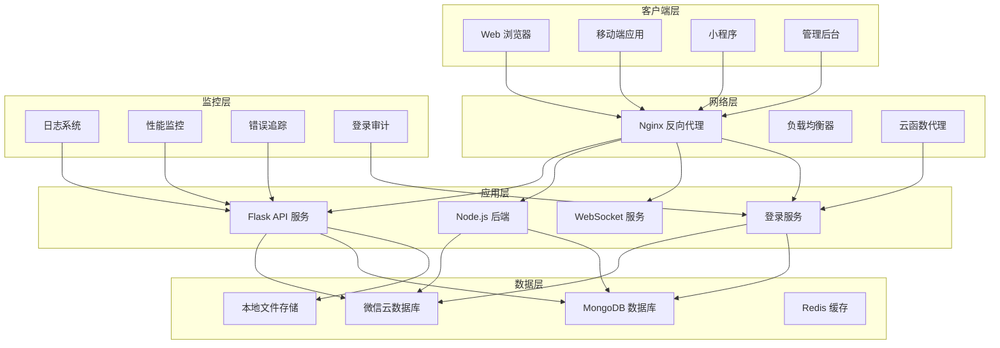

**图表来源**
- [app.py:104-284](file://app.py#L104-L284)
- [deploy/docker-compose.yml:3-37](file://deploy/docker-compose.yml#L3-L37)
- [config.py:22-63](file://config.py#L22-L63)
- [miniprogram/utils/loginService.js:12-33](file://miniprogram/utils/loginService.js#L12-L33)
- [cloudfunctions/login/index.js:52-165](file://cloudfunctions/login/index.js#L52-L165)

### 组件关系图

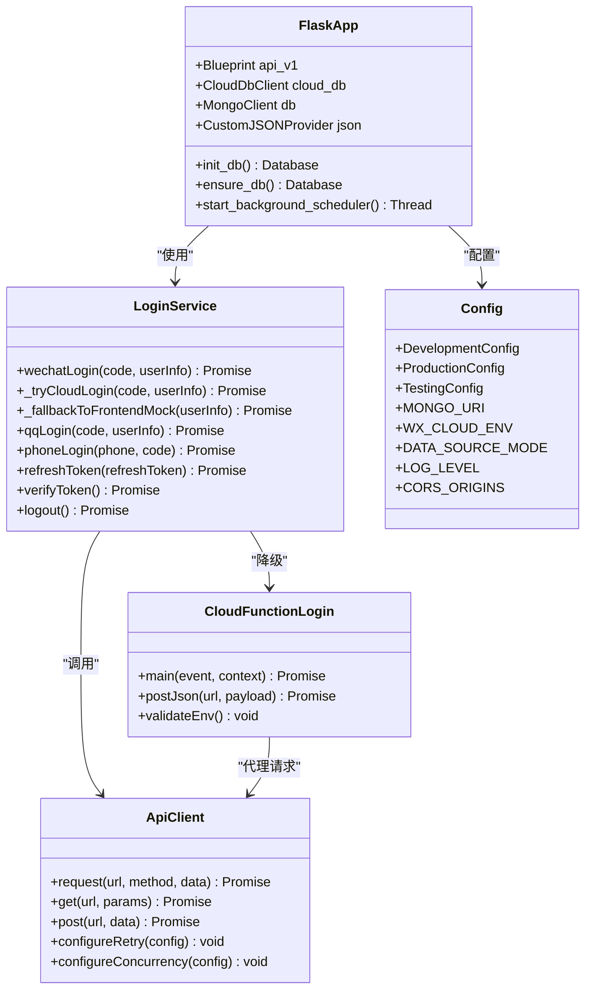

**图表来源**
- [app.py:104-284](file://app.py#L104-L284)
- [services/cloud_db.py:113-335](file://services/cloud_db.py#L113-L335)
- [services/sync_service.py:72-265](file://services/sync_service.py#L72-L265)
- [config.py:22-132](file://config.py#L22-L132)
- [miniprogram/utils/loginService.js:4-33](file://miniprogram/utils/loginService.js#L4-L33)
- [cloudfunctions/login/index.js:52-165](file://cloudfunctions/login/index.js#L52-L165)
- [backend_utils/api.js:49-109](file://backend_utils/api.js#L49-L109)

## 容器化部署

### Docker 配置

项目采用了多阶段容器化部署策略，使用 Python 3.9 slim 镜像作为基础镜像，优化了容器体积和启动速度。

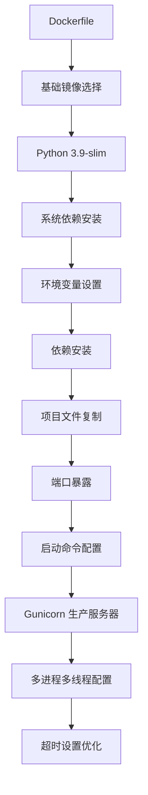

**图表来源**
- [Dockerfile:1-38](file://Dockerfile#L1-L38)

### Docker Compose 编排

```mermaid
graph LR
subgraph "Docker Compose 服务编排"
A[flask-app 服务] --> B[Flask 应用容器]
C[nginx 服务] --> D[Nginx 反向代理]
B --> E[Gunicorn 服务器]
B --> F[应用端口 5002]
B --> G[环境变量配置]
D --> H[HTTPS 证书]
D --> I[静态文件服务]
D --> J[API 反向代理]
D --> K[云函数代理]
end
subgraph "网络配置"
L[option-network] --> A
L --> C
end
subgraph "存储配置"
M[日志卷] --> N[logs:/app/logs]
O[配置卷] --> P[.env.production:/app/.env.production]
Q[前端构建产物] --> R[/var/www/admin-ui]
end
```

**图表来源**
- [deploy/docker-compose.yml:3-37](file://deploy/docker-compose.yml#L3-L37)

**章节来源**
- [Dockerfile:1-38](file://Dockerfile#L1-L38)
- [deploy/docker-compose.yml:1-42](file://deploy/docker-compose.yml#L1-L42)

## 微服务架构

### 服务组件设计

项目采用了微服务架构，将不同的功能模块拆分为独立的服务组件：

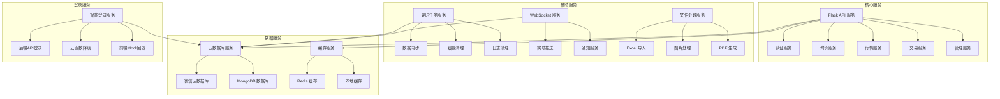

**图表来源**
- [app.py:104-210](file://app.py#L104-L210)
- [routes/](file://routes/)
- [services/](file://services/)
- [miniprogram/utils/loginService.js:12-33](file://miniprogram/utils/loginService.js#L12-L33)

### 服务间通信

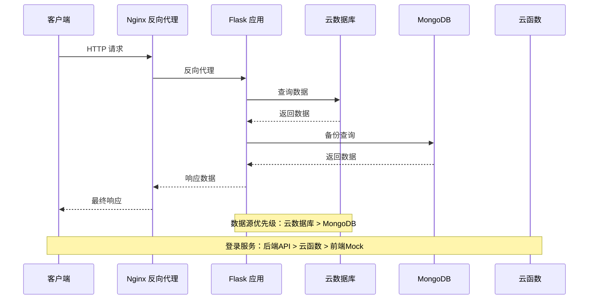

**图表来源**
- [app.py:122-153](file://app.py#L122-L153)
- [config.py:27-46](file://config.py#L27-L46)
- [miniprogram/utils/loginService.js:12-33](file://miniprogram/utils/loginService.js#L12-L33)

**章节来源**
- [app.py:104-284](file://app.py#L104-L284)
- [config.py:22-63](file://config.py#L22-L63)

## 数据存储策略

### 混合存储架构

项目实现了云端数据库与本地数据库的混合存储策略，提供了灵活的数据访问方案：

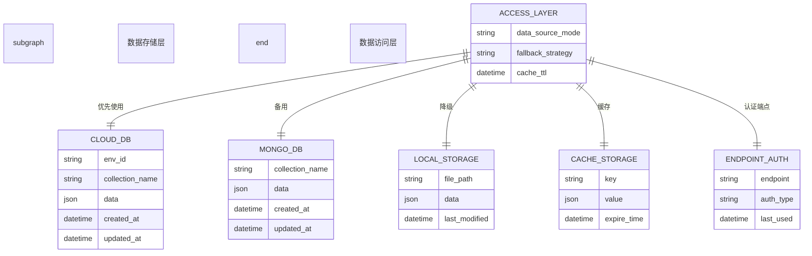

**图表来源**
- [config.py:27-46](file://config.py#L27-L46)
- [services/cloud_db.py:167-212](file://services/cloud_db.py#L167-L212)

### 数据同步机制

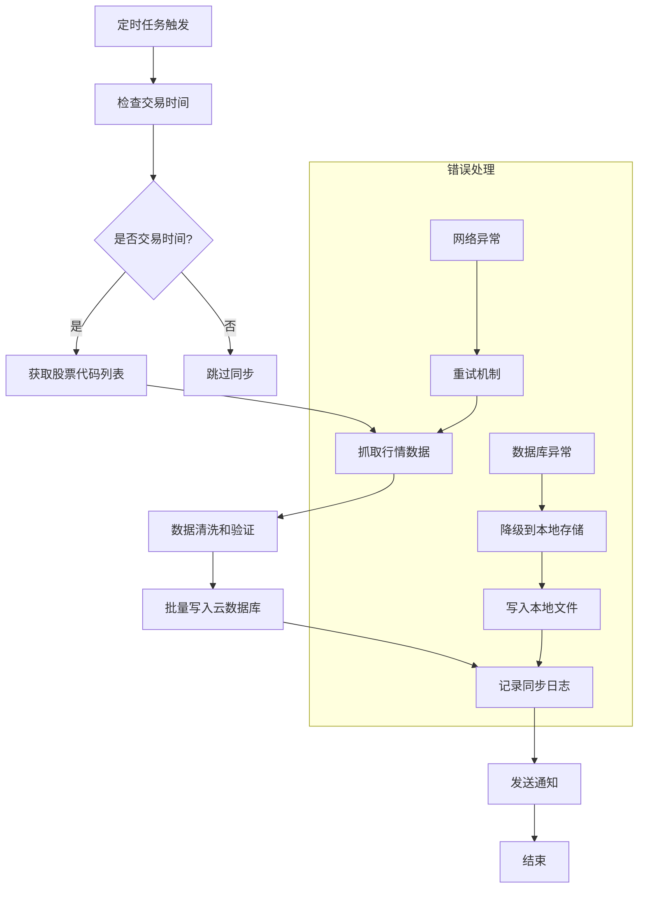

**图表来源**
- [app.py:287-338](file://app.py#L287-L338)
- [services/sync_service.py:241-265](file://services/sync_service.py#L241-L265)

**章节来源**
- [services/cloud_db.py:113-335](file://services/cloud_db.py#L113-L335)
- [services/sync_service.py:72-265](file://services/sync_service.py#L72-L265)

## API 网关与反向代理

### Nginx 配置

项目使用 Nginx 作为 API 网关和反向代理，提供了完整的请求路由和负载均衡功能：

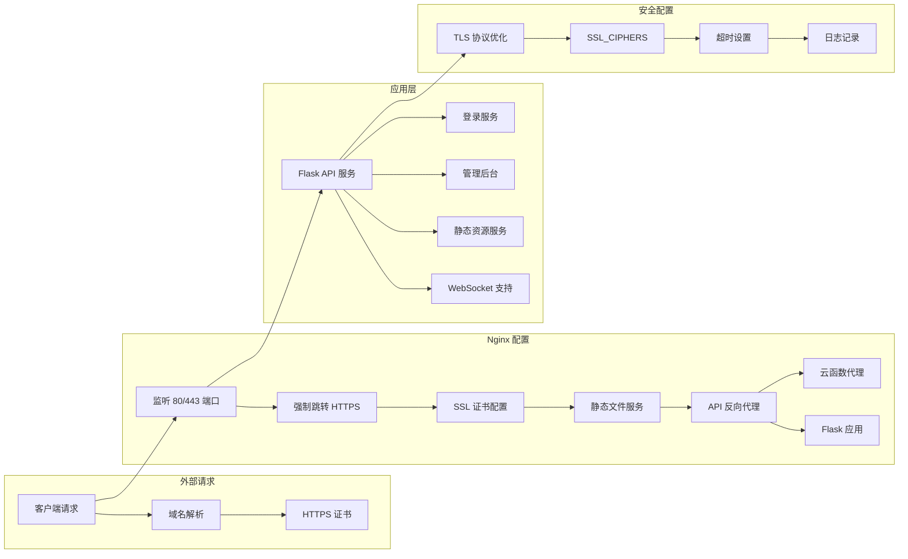

**图表来源**
- [deploy/nginx.conf:1-61](file://deploy/nginx.conf#L1-L61)

### 开发环境代理配置

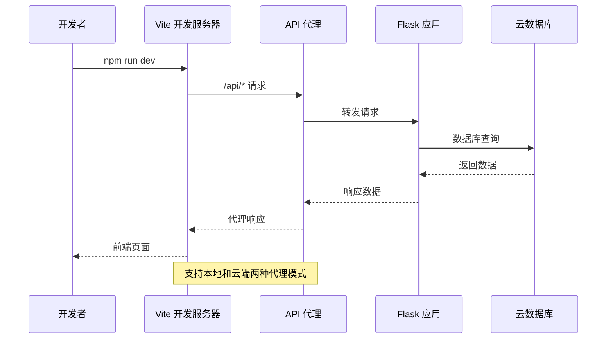

**图表来源**
- [admin-ui/vite.config.ts:21-59](file://admin-ui/vite.config.ts#L21-L59)

### 云函数代理模式

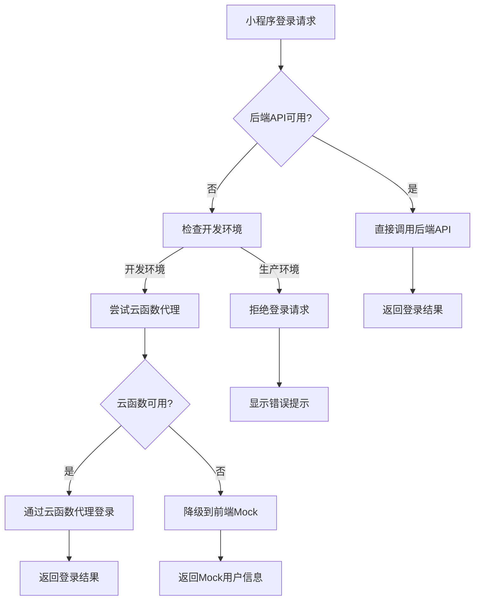

**图表来源**
- [miniprogram/utils/loginService.js:12-33](file://miniprogram/utils/loginService.js#L12-L33)
- [cloudfunctions/login/index.js:52-165](file://cloudfunctions/login/index.js#L52-L165)

**章节来源**
- [deploy/nginx.conf:1-61](file://deploy/nginx.conf#L1-L61)
- [admin-ui/vite.config.ts:1-78](file://admin-ui/vite.config.ts#L1-L78)
- [miniprogram/utils/loginService.js:12-33](file://miniprogram/utils/loginService.js#L12-L33)

## 前端构建与部署

### 多前端入口架构

项目支持多个前端入口，包括管理后台、小程序等：

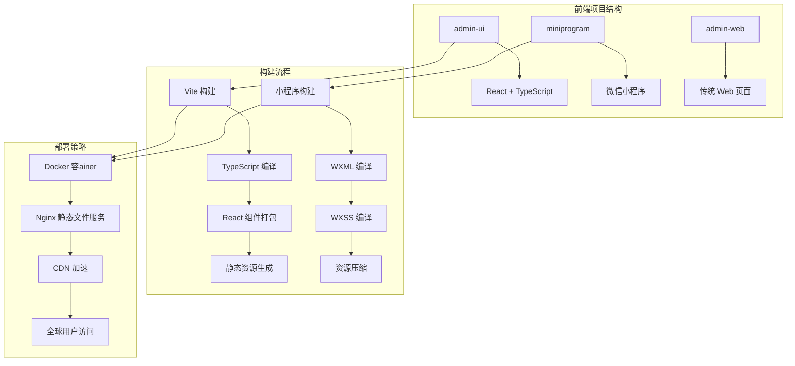

**图表来源**
- [admin-ui/package.json:1-38](file://admin-ui/package.json#L1-L38)
- [miniprogram/package.json:1-15](file://miniprogram/package.json#L1-L15)

### 前端配置优化

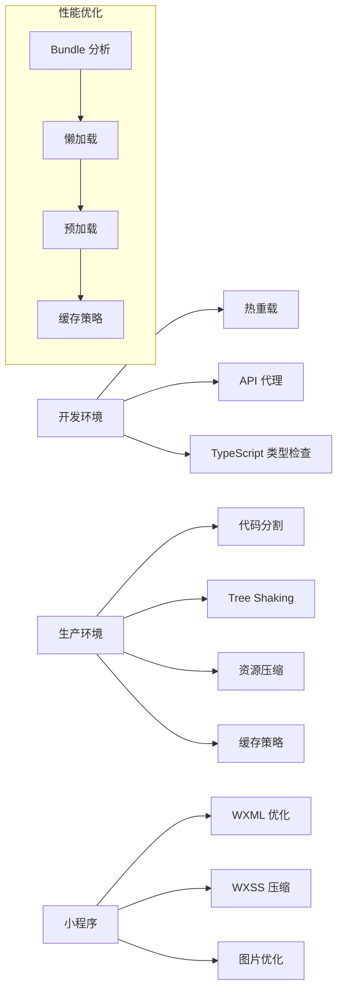

**图表来源**
- [admin-ui/vite.config.ts:61-76](file://admin-ui/vite.config.ts#L61-L76)
- [miniprogram/app.json:1-78](file://miniprogram/app.json#L1-L78)

**章节来源**
- [admin-ui/package.json:1-38](file://admin-ui/package.json#L1-L38)
- [miniprogram/package.json:1-15](file://miniprogram/package.json#L1-L15)
- [miniprogram/app.json:1-78](file://miniprogram/app.json#L1-L78)

## 登录服务架构改进

### 智能回退机制

项目实现了智能的多级登录回退机制，确保在各种环境下都能提供稳定的登录体验：

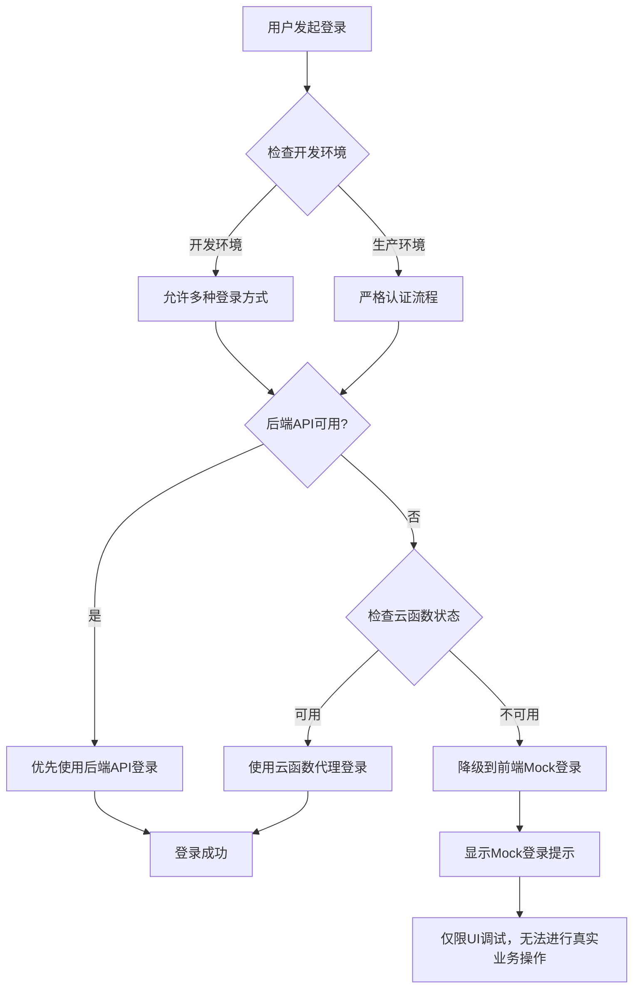

**图表来源**
- [miniprogram/utils/loginService.js:12-33](file://miniprogram/utils/loginService.js#L12-L33)
- [miniprogram/utils/loginService.js:43-111](file://miniprogram/utils/loginService.js#L43-L111)
- [miniprogram/utils/loginService.js:124-164](file://miniprogram/utils/loginService.js#L124-L164)

### 开发模式降级策略

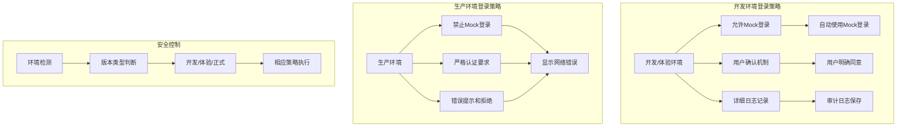

**图表来源**
- [miniprogram/utils/loginService.js:43-66](file://miniprogram/utils/loginService.js#L43-L66)
- [miniprogram/utils/loginService.js:124-146](file://miniprogram/utils/loginService.js#L124-L146)

### 云函数代理模式

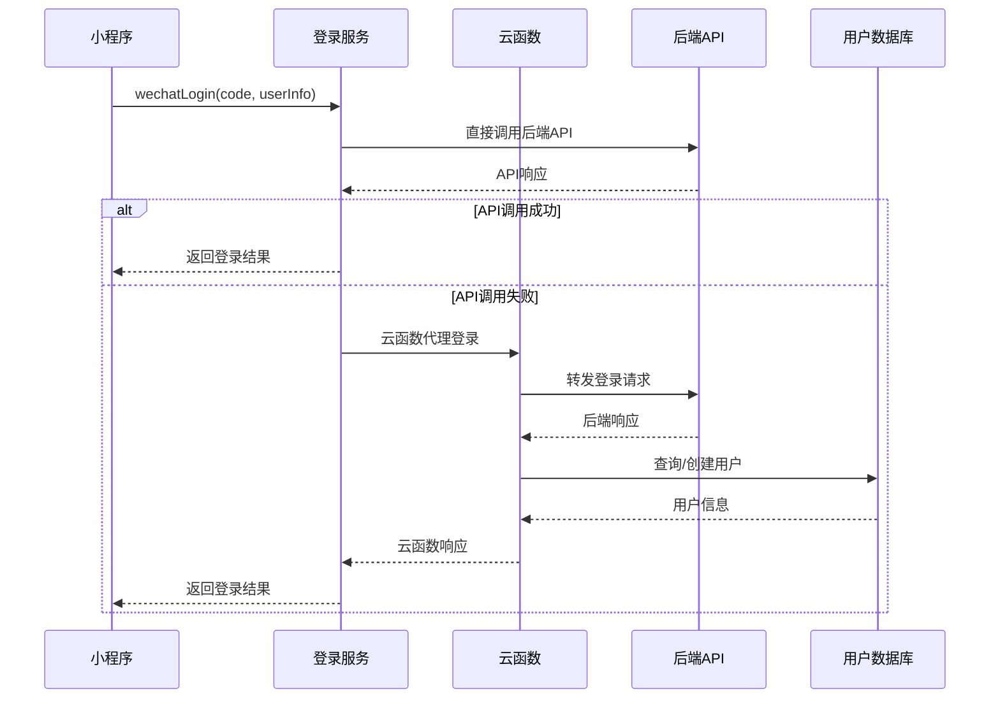

**图表来源**
- [cloudfunctions/login/index.js:52-165](file://cloudfunctions/login/index.js#L52-L165)
- [backend_utils/loginService.js:12-28](file://backend_utils/loginService.js#L12-L28)

### 登录服务组件关系

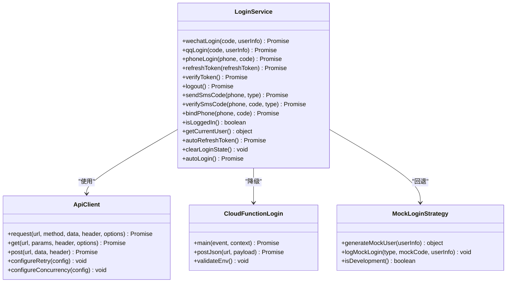

**图表来源**
- [miniprogram/utils/loginService.js:4-325](file://miniprogram/utils/loginService.js#L4-L325)
- [backend_utils/api.js:49-593](file://backend_utils/api.js#L49-L593)
- [cloudfunctions/login/index.js:52-165](file://cloudfunctions/login/index.js#L52-L165)

**章节来源**
- [miniprogram/utils/loginService.js:1-561](file://miniprogram/utils/loginService.js#L1-L561)
- [cloudfunctions/login/index.js:1-165](file://cloudfunctions/login/index.js#L1-L165)
- [backend_utils/loginService.js:1-325](file://backend_utils/loginService.js#L1-L325)

## 性能监控与基准测试

### 性能基准测试

项目实现了完善的性能监控和基准测试机制：

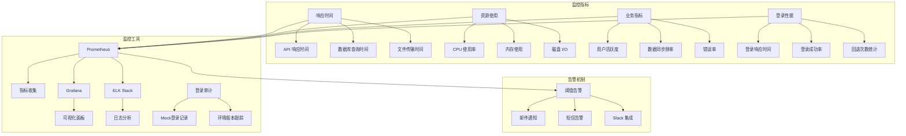

**图表来源**
- [scripts/benchmark_sync.py:14-56](file://scripts/benchmark_sync.py#L14-L56)

### 性能优化策略

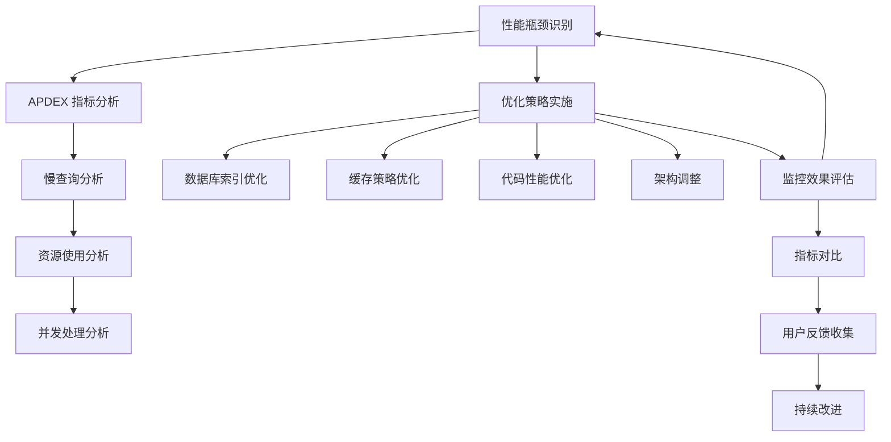

**图表来源**
- [services/sync_service.py:1-596](file://services/sync_service.py#L1-L596)

**章节来源**
- [scripts/benchmark_sync.py:1-57](file://scripts/benchmark_sync.py#L1-L57)
- [services/sync_service.py:1-596](file://services/sync_service.py#L1-L596)

## 安全配置

### 多层次安全防护

项目实现了多层次的安全防护机制：

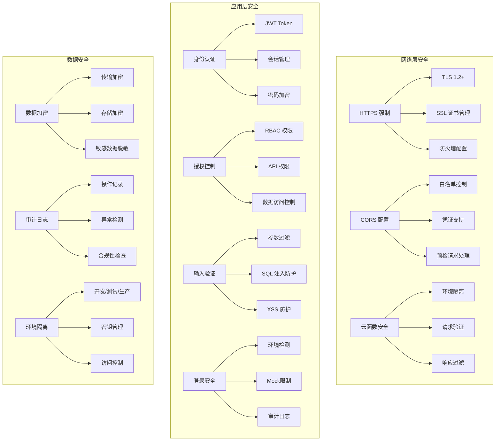

**图表来源**
- [config.py:55-63](file://config.py#L55-L63)
- [app.py:171-182](file://app.py#L171-L182)
- [miniprogram/utils/loginService.js:38-42](file://miniprogram/utils/loginService.js#L38-L42)

### 环境变量验证

```mermaid
flowchart TD
A[环境变量验证] --> B[关键配置检查]
B --> C[SECRET_KEY 验证]
B --> D[API_BASE_URL 检查]
B --> E[数据库连接字符串]
B --> F[日志配置验证]
G[一致性检查] --> H[密钥唯一性]
G --> I[环境类型验证]
G --> J[配置冲突检测]
K[验证规则] --> L[必需项检查]
K --> M[格式验证]
K --> N[范围检查]
```

**图表来源**
- [scripts/validate-env.js:184-202](file://scripts/validate-env.js#L184-L202)

**章节来源**
- [config.py:55-63](file://config.py#L55-L63)
- [app.py:171-182](file://app.py#L171-L182)
- [scripts/validate-env.js:1-202](file://scripts/validate-env.js#L1-L202)

## 运维与监控

### 自动化运维流程

```mermaid
flowchart TD
A[代码提交] --> B[CI/CD 触发]
B --> C[代码质量检查]
C --> D[单元测试]
D --> E[集成测试]
E --> F[构建镜像]
F --> G[部署到测试环境]
G --> H[自动化测试]
H --> I[部署到生产环境]
I --> J[健康检查]
J --> K[监控告警]
L[失败自动回滚] --> M[版本标签管理]
M --> N[配置回滚]
N --> O[数据回滚]
P[登录服务监控] --> Q[回退次数统计]
P --> R[Mock登录审计]
P --> S[环境版本跟踪]
```

### 运维工具链

```mermaid
graph LR
subgraph "开发工具"
A[VS Code] --> B[ESLint]
A --> C[Prettier]
A --> D[Jest]
E[小程序开发者工具] --> F[云函数调试]
E --> G[真机调试]
end
subgraph "构建工具"
H[Vite] --> I[TypeScript]
H --> J[React]
H --> K[CSS 预处理器]
L[Webpack] --> M[代码分割]
L --> N[资源优化]
L --> O[缓存策略]
end
subgraph "测试工具"
P[Jest] --> Q[单元测试]
P --> R[集成测试]
P --> S[E2E 测试]
T[Lighthouse] --> U[性能测试]
T --> V[可访问性测试]
T --> W[SEO 测试]
end
subgraph "部署工具"
X[Docker] --> Y[容器化]
X --> Z[Kubernetes]
AA[CI/CD] --> BB[自动化流程]
BB --> CC[版本管理]
BB --> DD[发布管理]
EE[环境验证] --> FF[配置检查]
EE --> GG[安全扫描]
EE --> HH[性能测试]
end
```

**章节来源**
- [deploy/README.md:1-44](file://deploy/README.md#L1-L44)
- [package.json:6-13](file://package.json#L6-L13)

## 总结

该项目的基础设施设计体现了现代 Web 应用的最佳实践，具有以下特点：

### 核心优势

1. **容器化部署**：使用 Docker 和 Docker Compose 实现标准化部署
2. **微服务架构**：模块化设计，便于维护和扩展
3. **混合数据存储**：云端与本地数据库结合，提供高可用性
4. **多前端入口**：支持 Web、小程序等多种客户端
5. **自动化运维**：完善的 CI/CD 流程和监控体系
6. **智能登录服务**：多级回退机制确保登录稳定性
7. **安全防护**：多层次的安全机制和环境隔离

### 技术亮点

- **高性能**：Gunicorn 服务器配置，优化的连接池和并发处理
- **智能化登录**：智能回退机制，开发模式降级，云函数代理
- **安全性**：多层次的安全防护和严格的访问控制
- **可扩展性**：模块化架构，支持水平扩展
- **可观测性**：完善的日志记录和性能监控
- **可靠性**：自动故障转移和降级机制

### 改进建议

1. **监控完善**：增加更详细的性能指标和业务指标监控
2. **安全加固**：实施更严格的身份验证和授权机制
3. **容灾备份**：建立更完善的灾难恢复和数据备份策略
4. **性能优化**：持续优化数据库查询和缓存策略
5. **自动化测试**：增加更多的自动化测试覆盖率
6. **登录审计**：增强登录服务的审计和监控能力

这个基础设施为项目的长期发展奠定了坚实的基础，能够支持业务的快速增长和技术创新。