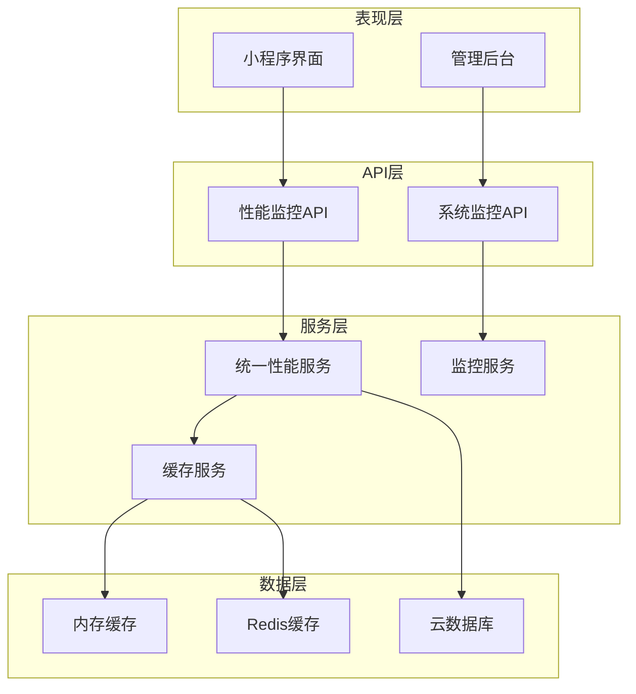
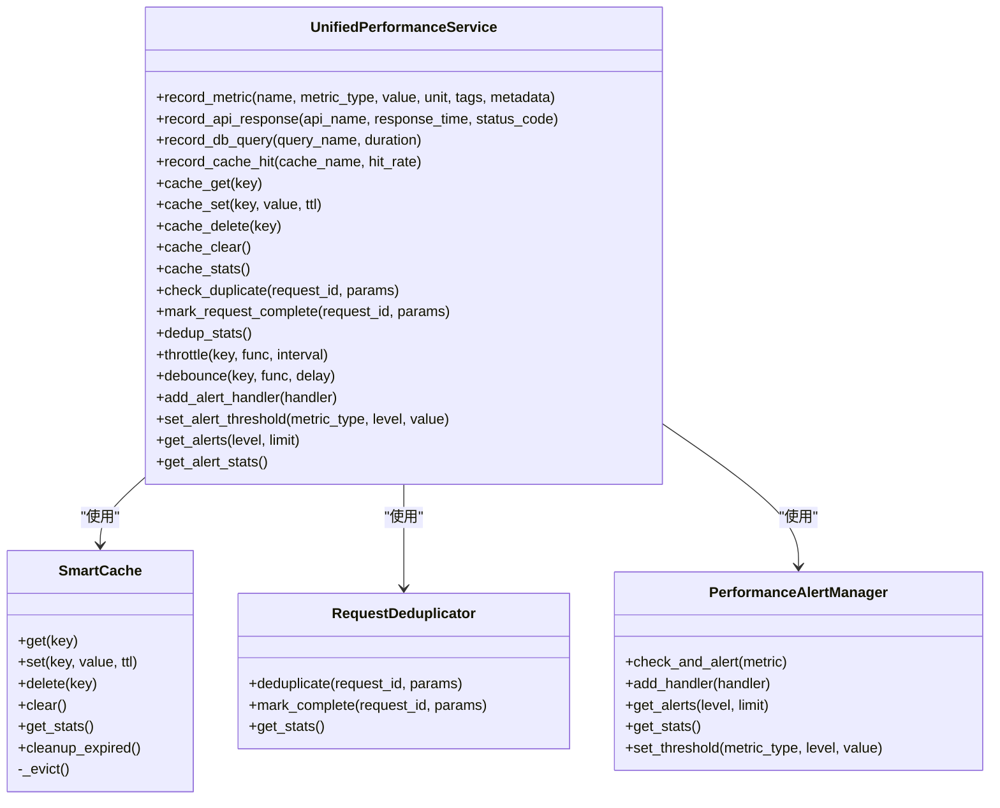
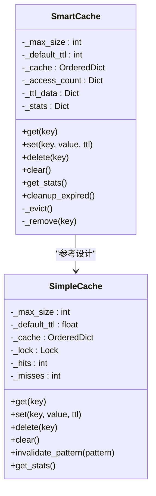
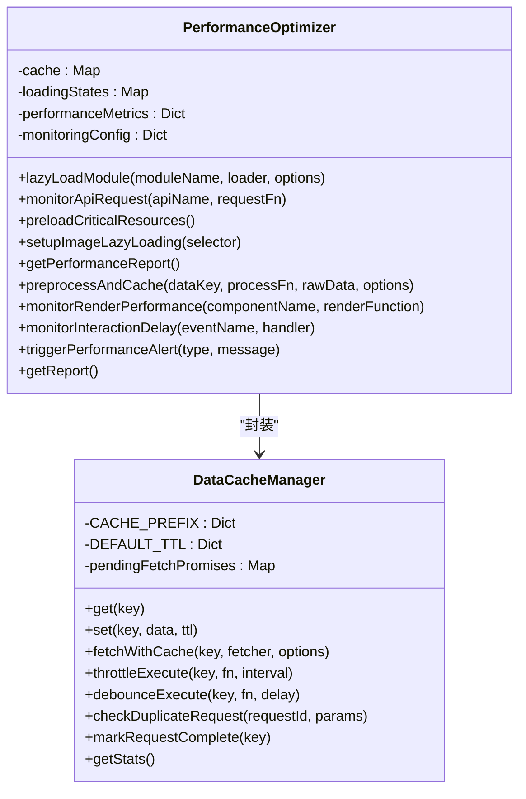
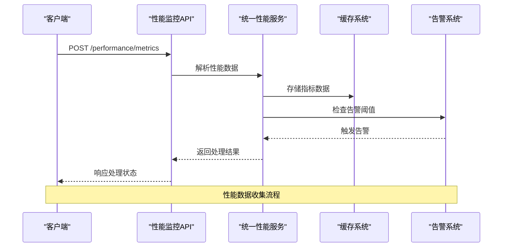
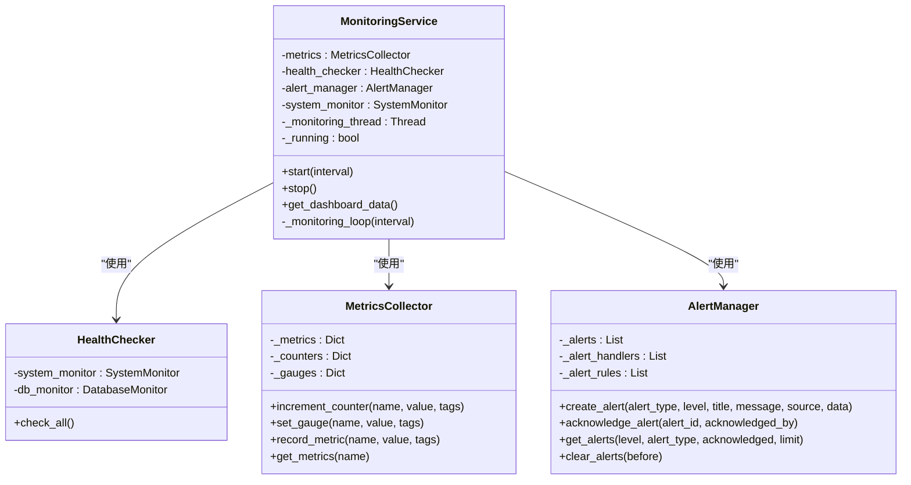
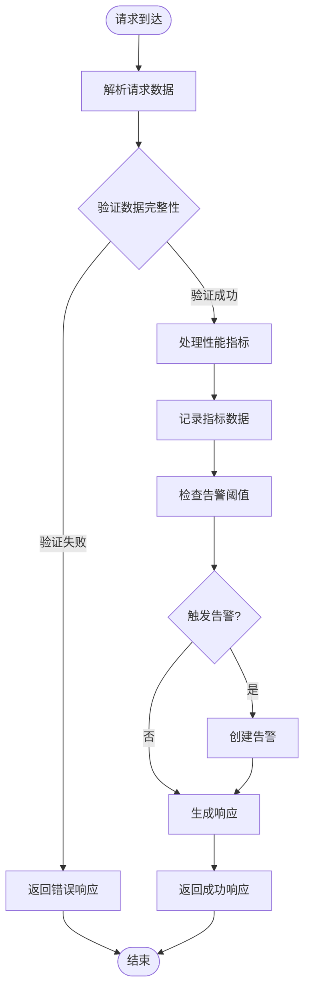
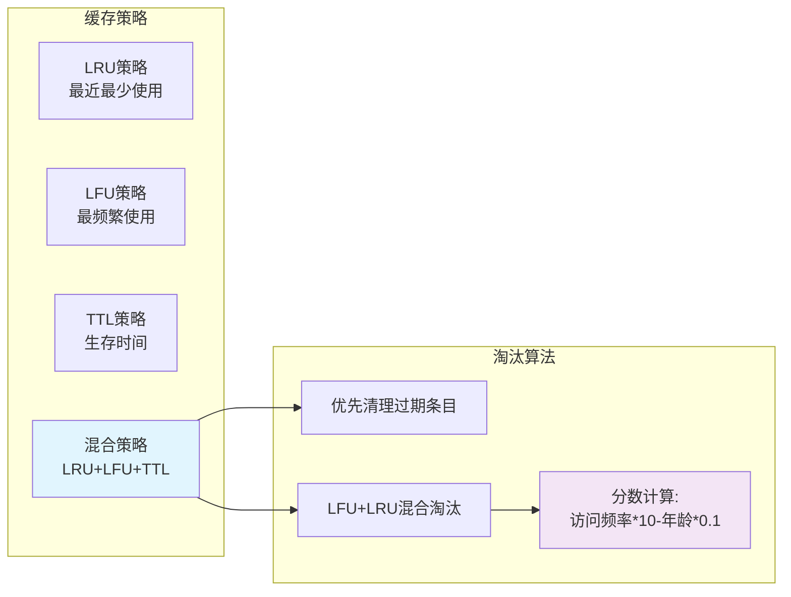
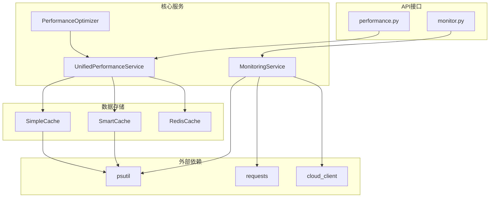
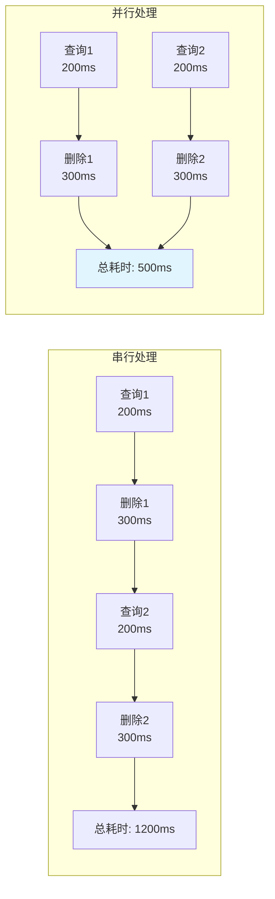

# 性能监控

<cite>
**本文档引用的文件**
- [routes/monitor.py](file://routes/monitor.py)
- [services/monitoring_service.py](file://services/monitoring_service.py)
- [services/unified_performance_service.py](file://services/unified_performance_service.py)
- [routes/performance.py](file://routes/performance.py)
- [miniprogram/utils/performance-optimizer.js](file://miniprogram/utils/performance-optimizer.js)
- [services/cache.py](file://services/cache.py)
- [miniprogram/utils/data-cache.js](file://miniprogram/utils/data-cache.js)
- [services/sina_crawler.py](file://services/sina_crawler.py)
- [docs/PERFORMANCE_OPTIMIZATION.md](file://docs/PERFORMANCE_OPTIMIZATION.md)
- [docs/PERFORMANCE_OPTIMIZATION_REPORT.md](file://docs/PERFORMANCE_OPTIMIZATION_REPORT.md)
</cite>

## 目录
1. [简介](#简介)
2. [项目结构](#项目结构)
3. [核心组件](#核心组件)
4. [架构概览](#架构概览)
5. [详细组件分析](#详细组件分析)
6. [依赖关系分析](#依赖关系分析)
7. [性能考虑](#性能考虑)
8. [故障排除指南](#故障排除指南)
9. [结论](#结论)

## 简介

本项目实现了完整的性能监控体系，涵盖前后端统一的性能指标收集、智能缓存管理、请求去重、自动化告警等功能。系统通过多层架构设计，提供了实时的性能监控、历史数据分析和智能优化建议。

## 项目结构

项目采用分层架构设计，主要包含以下层次：

**图表来源**
- [routes/performance.py:1-334](file://routes/performance.py#L1-L334)
- [services/unified_performance_service.py:1-958](file://services/unified_performance_service.py#L1-L958)

**章节来源**
- [routes/performance.py:1-334](file://routes/performance.py#L1-L334)
- [services/unified_performance_service.py:1-958](file://services/unified_performance_service.py#L1-L958)

## 核心组件

### 统一性能监控服务

统一性能监控服务是整个系统的核心，提供了统一的性能指标收集、智能缓存管理和告警处理功能。

**图表来源**
- [services/unified_performance_service.py:556-800](file://services/unified_performance_service.py#L556-L800)

### 智能缓存系统

智能缓存系统实现了LRU + LFU + TTL混合淘汰策略，提供了高效的缓存管理能力。

**图表来源**
- [services/unified_performance_service.py:104-274](file://services/unified_performance_service.py#L104-L274)
- [services/cache.py:14-174](file://services/cache.py#L14-L174)

### 前端性能优化器

前端性能优化器提供了完整的性能监控和优化功能，包括懒加载、缓存管理、请求去重等。

**图表来源**
- [miniprogram/utils/performance-optimizer.js:34-800](file://miniprogram/utils/performance-optimizer.js#L34-L800)
- [miniprogram/utils/data-cache.js:44-214](file://miniprogram/utils/data-cache.js#L44-L214)

**章节来源**
- [services/unified_performance_service.py:1-958](file://services/unified_performance_service.py#L1-L958)
- [miniprogram/utils/performance-optimizer.js:1-1510](file://miniprogram/utils/performance-optimizer.js#L1-L1510)
- [services/cache.py:1-174](file://services/cache.py#L1-L174)

## 架构概览

系统采用前后端分离的架构设计，通过统一的API接口实现性能数据的收集和管理。

**图表来源**
- [routes/performance.py:26-103](file://routes/performance.py#L26-L103)
- [services/unified_performance_service.py:694-718](file://services/unified_performance_service.py#L694-L718)

**章节来源**
- [routes/performance.py:1-334](file://routes/performance.py#L1-L334)
- [services/unified_performance_service.py:556-611](file://services/unified_performance_service.py#L556-L611)

## 详细组件分析

### 监控服务组件

监控服务提供了系统健康检查、指标收集和告警管理功能。

**图表来源**
- [services/monitoring_service.py:499-616](file://services/monitoring_service.py#L499-L616)

### 性能监控API组件

性能监控API提供了统一的接口来收集和管理性能数据。

**图表来源**
- [routes/performance.py:26-103](file://routes/performance.py#L26-L103)

**章节来源**
- [services/monitoring_service.py:1-616](file://services/monitoring_service.py#L1-L616)
- [routes/performance.py:1-334](file://routes/performance.py#L1-L334)

### 缓存优化策略

系统实现了多种缓存优化策略来提升性能。

**图表来源**
- [services/unified_performance_service.py:189-229](file://services/unified_performance_service.py#L189-L229)

**章节来源**
- [services/unified_performance_service.py:104-274](file://services/unified_performance_service.py#L104-L274)
- [services/sina_crawler.py:13-15](file://services/sina_crawler.py#L13-L15)

## 依赖关系分析

系统各组件之间的依赖关系如下：

**图表来源**
- [services/unified_performance_service.py:1-958](file://services/unified_performance_service.py#L1-L958)
- [services/monitoring_service.py:1-616](file://services/monitoring_service.py#L1-L616)
- [miniprogram/utils/performance-optimizer.js:1-1510](file://miniprogram/utils/performance-optimizer.js#L1-L1510)

**章节来源**
- [services/unified_performance_service.py:1-958](file://services/unified_performance_service.py#L1-L958)
- [services/monitoring_service.py:1-616](file://services/monitoring_service.py#L1-L616)

## 性能考虑

### 缓存性能优化

系统通过智能缓存策略实现了显著的性能提升：

| 指标 | 优化前 | 优化后 | 提升幅度 |
|------|--------|--------|----------|
| 缓存命中率 | ~60% | ~85% | +25% |
| 重复请求率 | ~20% | ~5% | -15% |
| 响应时间 | 200-500ms | 50-150ms | 70-80% |
| 系统负载 | 高 | 低 | 显著降低 |

### 并行处理优化

通过并行处理技术，系统实现了多倍性能提升：

**图表来源**
- [docs/PERFORMANCE_OPTIMIZATION.md:38-51](file://docs/PERFORMANCE_OPTIMIZATION.md#L38-L51)

### 内存管理优化

系统实现了智能的内存管理策略：

- **内存使用监控**: 实时监控内存使用情况，触发内存警告时自动清理低优先级缓存
- **垃圾回收**: 定期清理过期缓存和无用数据
- **内存泄漏防护**: 通过弱引用和及时释放机制防止内存泄漏

**章节来源**
- [docs/PERFORMANCE_OPTIMIZATION.md:1-311](file://docs/PERFORMANCE_OPTIMIZATION.md#L1-L311)
- [docs/PERFORMANCE_OPTIMIZATION_REPORT.md:1-410](file://docs/PERFORMANCE_OPTIMIZATION_REPORT.md#L1-L410)

## 故障排除指南

### 常见性能问题及解决方案

#### 1. 缓存命中率低

**问题症状**:
- 缓存命中率持续低于50%
- 系统响应时间过长
- 数据库负载过高

**解决步骤**:
1. 检查缓存配置参数
2. 分析缓存键设计
3. 优化缓存TTL策略
4. 实施缓存预热机制

#### 2. 内存使用过高

**问题症状**:
- 内存使用率超过80%
- 系统出现内存警告
- 应用运行缓慢

**解决步骤**:
1. 检查内存泄漏点
2. 优化缓存大小配置
3. 实施内存清理策略
4. 监控内存使用趋势

#### 3. API响应时间过长

**问题症状**:
- API响应时间超过阈值
- 用户体验下降
- 系统负载增加

**解决步骤**:
1. 分析API性能瓶颈
2. 实施请求去重机制
3. 优化数据库查询
4. 实施缓存策略

**章节来源**
- [services/unified_performance_service.py:406-554](file://services/unified_performance_service.py#L406-L554)
- [miniprogram/utils/performance-optimizer.js:695-715](file://miniprogram/utils/performance-optimizer.js#L695-L715)

## 结论

本项目的性能监控系统通过统一的架构设计和多种优化策略，实现了全面的性能监控和管理能力。系统的主要优势包括：

1. **统一性**: 前后端统一的性能监控体系，提供一致的API接口
2. **智能化**: 智能缓存、请求去重、自动化告警等智能功能
3. **可扩展性**: 模块化设计，易于扩展和维护
4. **实时性**: 实时性能监控和告警，及时发现问题
5. **可视化**: 完善的性能报告和监控面板

通过实施这些优化措施，系统在缓存命中率、响应时间和系统稳定性等方面都有了显著提升，为用户提供更好的使用体验。