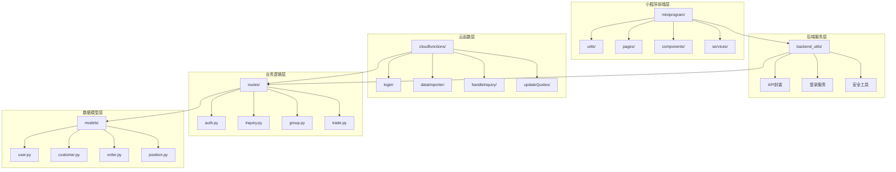
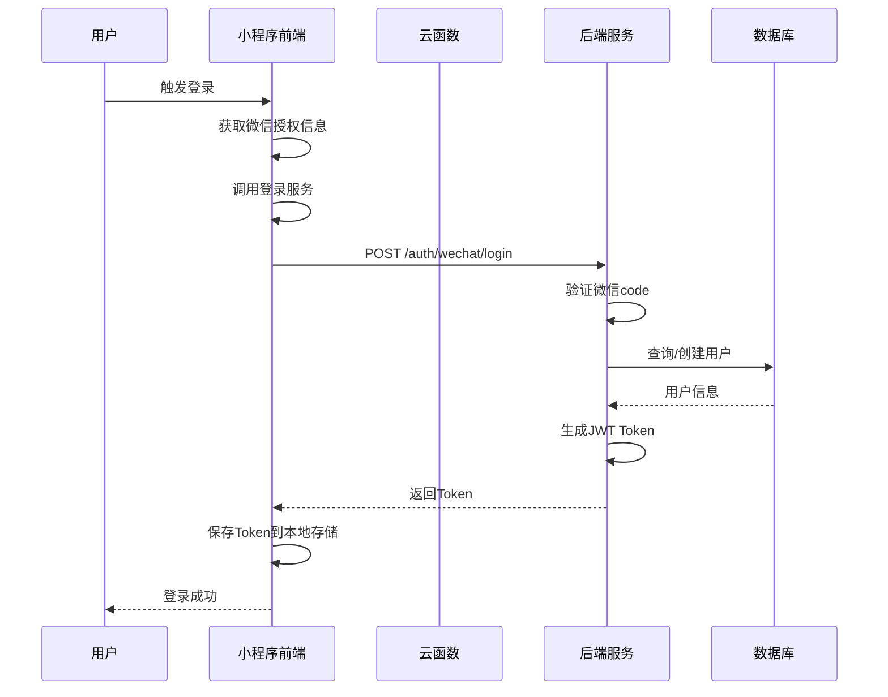
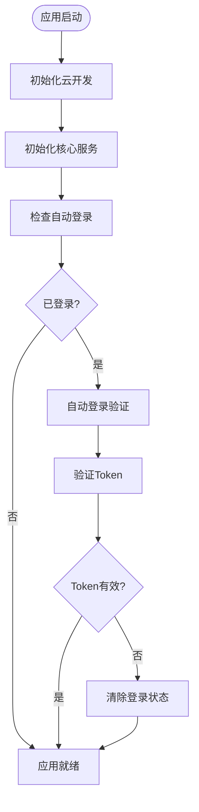
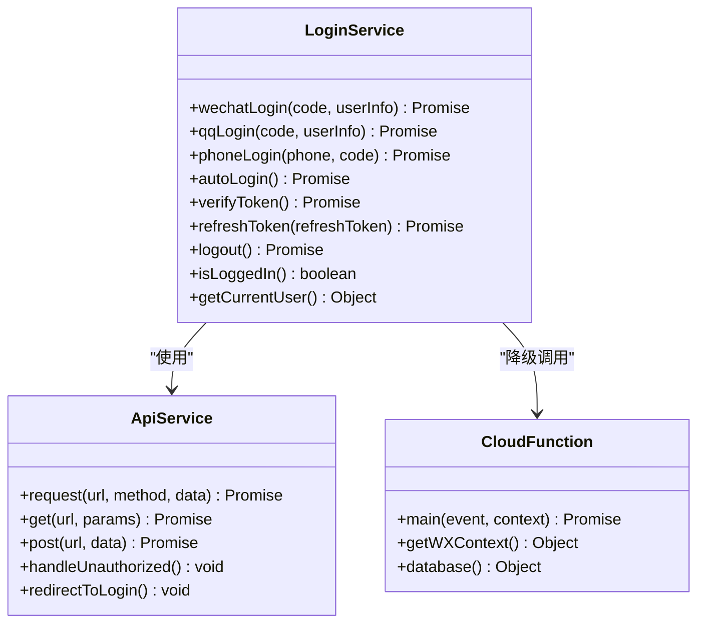
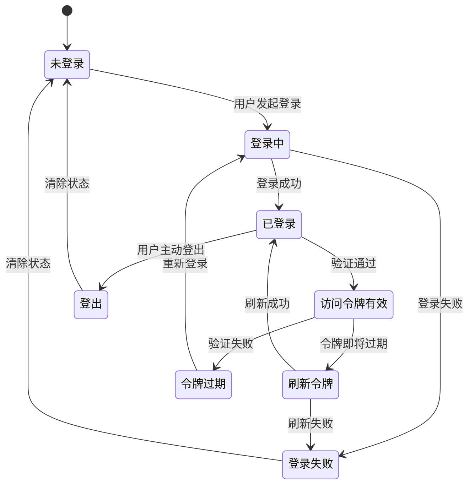
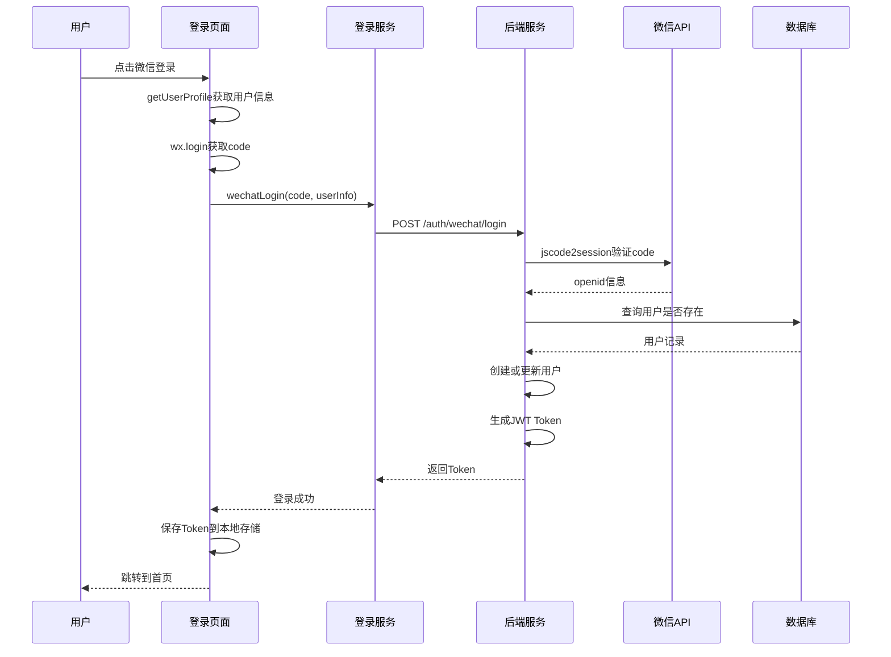
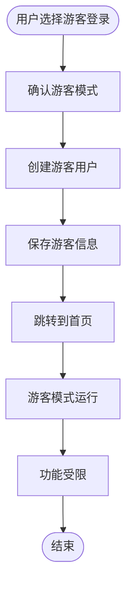
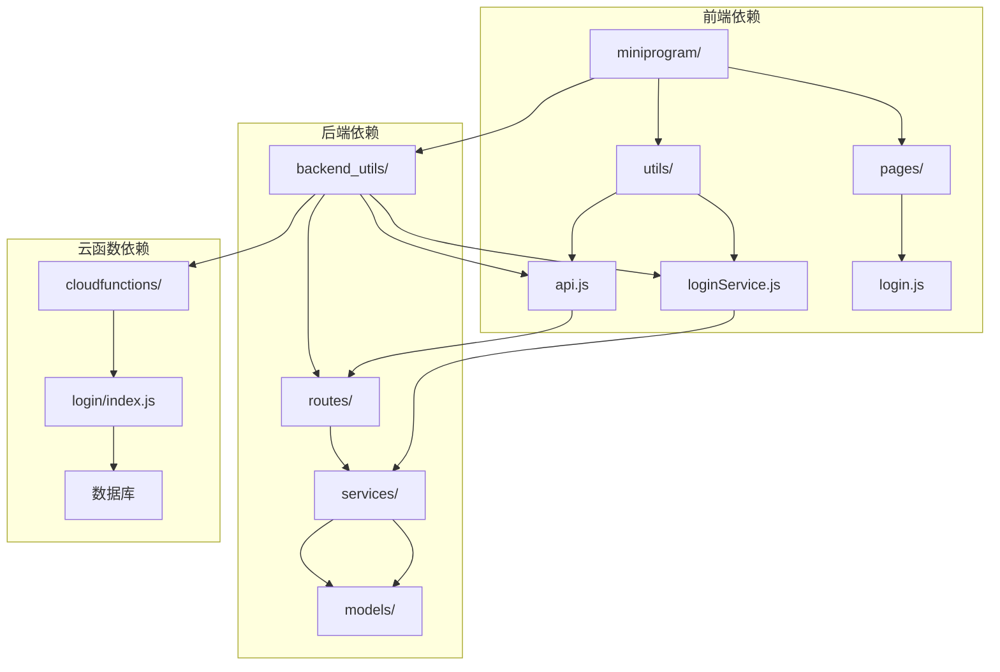
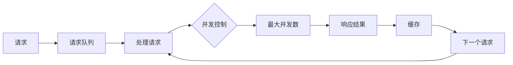

# 小程序认证流程文档

<cite>
**本文档引用的文件**
- [miniprogram/app.js](file://miniprogram/app.js)
- [miniprogram/app.json](file://miniprogram/app.json)
- [miniprogram/pages/login/login.js](file://miniprogram/pages/login/login.js)
- [miniprogram/utils/loginService.js](file://miniprogram/utils/loginService.js)
- [miniprogram/utils/api.js](file://miniprogram/utils/api.js)
- [cloudfunctions/login/index.js](file://cloudfunctions/login/index.js)
- [backend_utils/loginService.js](file://backend_utils/loginService.js)
- [backend_utils/api.js](file://backend_utils/api.js)
- [routes/auth.py](file://routes/auth.py)
- [services/auth_service.py](file://services/auth_service.py)
- [models/user.py](file://models/user.py)
- [services/cloud_db.py](file://services/cloud_db.py)
</cite>

## 目录
1. [简介](#简介)
2. [项目结构概览](#项目结构概览)
3. [认证架构总览](#认证架构总览)
4. [核心组件分析](#核心组件分析)
5. [详细认证流程](#详细认证流程)
6. [依赖关系分析](#依赖关系分析)
7. [性能考虑](#性能考虑)
8. [故障排除指南](#故障排除指南)
9. [总结](#总结)

## 简介

本文件详细分析了基于微信小程序的认证系统架构和实现细节。该系统采用前后端分离的设计，结合微信云开发能力和自研后端服务，提供了完整的用户认证解决方案，包括微信登录、手机号登录、游客模式等多种登录方式。

## 项目结构概览

该项目采用模块化设计，主要分为以下几个层次：

**图表来源**
- [miniprogram/app.js](file://miniprogram/app.js#L1-L225)
- [backend_utils/api.js](file://backend_utils/api.js#L1-L571)
- [routes/auth.py](file://routes/auth.py#L1-L516)

**章节来源**
- [miniprogram/app.js](file://miniprogram/app.js#L1-L225)
- [miniprogram/app.json](file://miniprogram/app.json#L1-L78)

## 认证架构总览

系统采用多层认证架构，确保安全性、可靠性和用户体验：

**图表来源**
- [miniprogram/pages/login/login.js](file://miniprogram/pages/login/login.js#L67-L141)
- [miniprogram/utils/loginService.js](file://miniprogram/utils/loginService.js#L12-L33)
- [routes/auth.py](file://routes/auth.py#L406-L436)

## 核心组件分析

### 1. 应用初始化与认证检查

小程序启动时会进行初始化和自动登录检查：

**图表来源**
- [miniprogram/app.js](file://miniprogram/app.js#L25-L141)

**章节来源**
- [miniprogram/app.js](file://miniprogram/app.js#L25-L141)

### 2. 登录服务架构

登录服务采用双路径设计，确保在各种环境下都能正常工作：

**图表来源**
- [miniprogram/utils/loginService.js](file://miniprogram/utils/loginService.js#L4-L492)
- [backend_utils/api.js](file://backend_utils/api.js#L42-L102)

**章节来源**
- [miniprogram/utils/loginService.js](file://miniprogram/utils/loginService.js#L4-L492)
- [backend_utils/api.js](file://backend_utils/api.js#L1-L571)

### 3. JWT Token 管理

系统使用JWT进行身份验证，支持访问令牌和刷新令牌：

**图表来源**
- [services/auth_service.py](file://services/auth_service.py#L115-L199)
- [miniprogram/utils/loginService.js](file://miniprogram/utils/loginService.js#L461-L488)

**章节来源**
- [services/auth_service.py](file://services/auth_service.py#L115-L199)
- [miniprogram/utils/loginService.js](file://miniprogram/utils/loginService.js#L461-L488)

## 详细认证流程

### 1. 微信登录流程

微信登录是最常用的认证方式，支持多种登录场景：

**图表来源**
- [miniprogram/pages/login/login.js](file://miniprogram/pages/login/login.js#L67-L141)
- [routes/auth.py](file://routes/auth.py#L406-L436)
- [services/auth_service.py](file://services/auth_service.py#L303-L491)

**章节来源**
- [miniprogram/pages/login/login.js](file://miniprogram/pages/login/login.js#L67-L141)
- [routes/auth.py](file://routes/auth.py#L406-L436)
- [services/auth_service.py](file://services/auth_service.py#L303-L491)

### 2. 手机号登录流程

手机号登录提供便捷的身份验证方式：

**图表来源**
- [miniprogram/pages/login/login.js](file://miniprogram/pages/login/login.js#L262-L304)
- [routes/auth.py](file://routes/auth.py#L317-L342)

**章节来源**
- [miniprogram/pages/login/login.js](file://miniprogram/pages/login/login.js#L262-L304)
- [routes/auth.py](file://routes/auth.py#L317-L342)

### 3. 游客模式流程

游客模式提供临时访问能力：

**图表来源**
- [miniprogram/pages/login/login.js](file://miniprogram/pages/login/login.js#L306-L351)

**章节来源**
- [miniprogram/pages/login/login.js](file://miniprogram/pages/login/login.js#L306-L351)

## 依赖关系分析

系统各组件之间的依赖关系如下：

**图表来源**
- [miniprogram/utils/api.js](file://miniprogram/utils/api.js#L1-L727)
- [backend_utils/api.js](file://backend_utils/api.js#L1-L571)
- [routes/auth.py](file://routes/auth.py#L1-L516)

**章节来源**
- [miniprogram/utils/api.js](file://miniprogram/utils/api.js#L1-L727)
- [backend_utils/api.js](file://backend_utils/api.js#L1-L571)
- [routes/auth.py](file://routes/auth.py#L1-L516)

## 性能考虑

系统在多个层面进行了性能优化：

### 1. 请求队列和并发控制

**图表来源**
- [backend_utils/api.js](file://backend_utils/api.js#L141-L190)
- [miniprogram/utils/api.js](file://miniprogram/utils/api.js#L265-L314)

### 2. 缓存策略

系统实现了多层次的缓存机制：

- **API缓存**: 5分钟缓存策略，减少重复请求
- **请求去重**: 防止相同请求的重复执行
- **本地存储**: Token和用户信息的持久化存储

**章节来源**
- [backend_utils/api.js](file://backend_utils/api.js#L6-L31)
- [miniprogram/utils/api.js](file://miniprogram/utils/api.js#L6-L29)

## 故障排除指南

### 1. 常见登录问题

| 问题类型 | 可能原因 | 解决方案 |
|---------|---------|---------|
| 登录失败 | 微信code过期 | 重新获取微信授权 |
| Token过期 | 访问令牌过期 | 自动刷新或重新登录 |
| 网络错误 | 网络连接不稳定 | 检查网络设置，重试请求 |
| 数据库连接失败 | 云数据库不可用 | 使用降级方案或等待恢复 |

### 2. 调试技巧

- **启用详细日志**: 在开发环境中查看详细的错误信息
- **检查Token状态**: 确认Token的有效性和过期时间
- **验证API响应**: 检查后端API的响应格式和状态码

**章节来源**
- [miniprogram/utils/loginService.js](file://miniprogram/utils/loginService.js#L38-L115)
- [backend_utils/api.js](file://backend_utils/api.js#L107-L127)

## 总结

本认证系统采用了现代化的架构设计，具有以下特点：

1. **多层架构**: 前端、后端、云函数三层分离，职责清晰
2. **高可用性**: 支持多种登录方式和降级方案
3. **安全性**: JWT令牌机制，支持访问和刷新令牌
4. **性能优化**: 请求队列、缓存、并发控制等多重优化
5. **可扩展性**: 模块化设计，易于功能扩展和维护

该系统为小程序提供了完整的用户认证解决方案，既保证了用户体验，又确保了系统的安全性和可靠性。