# 小程序认证流程文档

<cite>
**本文档引用的文件**
- [miniprogram/app.js](file://miniprogram/app.js)
- [miniprogram/pages/login/login.js](file://miniprogram/pages/login/login.js)
- [miniprogram/utils/loginService.js](file://miniprogram/utils/loginService.js)
- [miniprogram/utils/api.js](file://miniprogram/utils/api.js)
- [miniprogram/config/api.config.js](file://miniprogram/config/api.config.js)
- [cloudfunctions/login/index.js](file://cloudfunctions/login/index.js)
- [backend_utils/loginService.js](file://backend_utils/loginService.js)
- [backend_utils/api.js](file://backend_utils/api.js)
- [routes/auth.py](file://routes/auth.py)
- [services/auth_service.py](file://services/auth_service.py)
- [models/user.py](file://models/user.py)
- [services/cloud_db.py](file://services/cloud_db.py)
</cite>

## 更新摘要
**所做的更改**
- 更新了认证系统的重构和改进，包含新的认证组件和流程
- 新增了Mock登录控制机制和安全配置
- 更新了JWT Token管理和游客模式流程
- 增强了错误处理和性能监控功能
- 优化了API配置中心和环境适配机制

## 目录
1. [简介](#简介)
2. [项目结构概览](#项目结构概览)
3. [认证架构总览](#认证架构总览)
4. [核心组件分析](#核心组件分析)
5. [详细认证流程](#详细认证流程)
6. [依赖关系分析](#依赖关系分析)
7. [性能考虑](#性能考虑)
8. [故障排除指南](#故障排除指南)
9. [总结](#总结)

## 简介

本文件详细分析了基于微信小程序的认证系统架构和实现细节。该系统采用前后端分离的设计，结合微信云开发能力和自研后端服务，提供了完整的用户认证解决方案，包括微信登录、手机号登录、游客模式等多种登录方式。系统经过重构和改进，新增了Mock登录控制机制、安全配置管理和增强的错误处理功能。

## 项目结构概览

该项目采用模块化设计，主要分为以下几个层次：

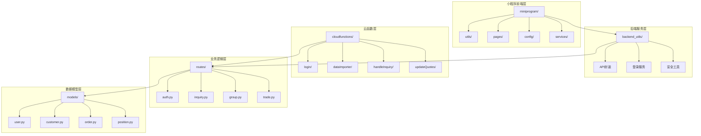

**图表来源**
- [miniprogram/app.js:1-578](file://miniprogram/app.js#L1-L578)
- [backend_utils/api.js:1-593](file://backend_utils/api.js#L1-L593)
- [routes/auth.py:1-800](file://routes/auth.py#L1-L800)

**章节来源**
- [miniprogram/app.js:1-578](file://miniprogram/app.js#L1-L578)
- [miniprogram/config/api.config.js:1-175](file://miniprogram/config/api.config.js#L1-L175)

## 认证架构总览

系统采用多层认证架构，确保安全性、可靠性和用户体验：

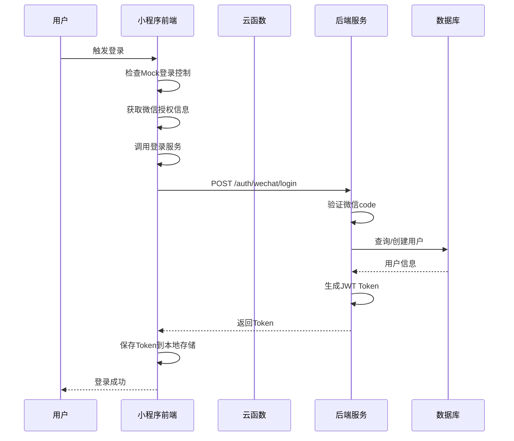

**图表来源**
- [miniprogram/pages/login/login.js:67-141](file://miniprogram/pages/login/login.js#L67-L141)
- [miniprogram/utils/loginService.js:12-33](file://miniprogram/utils/loginService.js#L12-L33)
- [routes/auth.py:406-436](file://routes/auth.py#L406-L436)

## 核心组件分析

### 1. 应用初始化与认证检查

小程序启动时会进行初始化和自动登录检查：

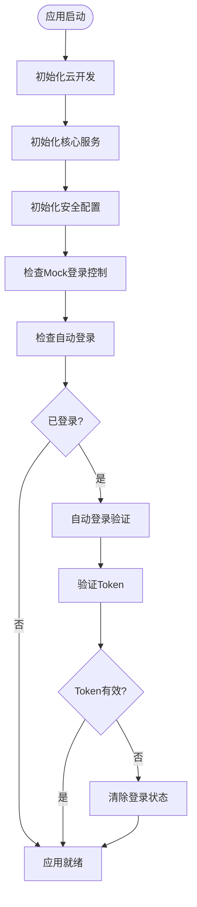

**图表来源**
- [miniprogram/app.js:46-277](file://miniprogram/app.js#L46-L277)

**章节来源**
- [miniprogram/app.js:46-277](file://miniprogram/app.js#L46-L277)

### 2. 登录服务架构

登录服务采用双路径设计，确保在各种环境下都能正常工作：

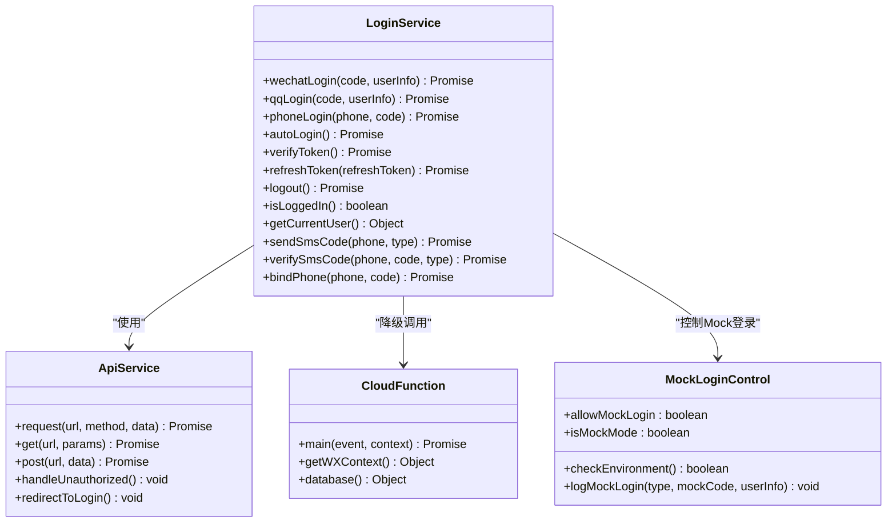

**图表来源**
- [miniprogram/utils/loginService.js:4-561](file://miniprogram/utils/loginService.js#L4-L561)
- [backend_utils/api.js:42-102](file://backend_utils/api.js#L42-L102)

**章节来源**
- [miniprogram/utils/loginService.js:4-561](file://miniprogram/utils/loginService.js#L4-L561)
- [backend_utils/api.js:1-593](file://backend_utils/api.js#L1-L593)

### 3. JWT Token 管理

系统使用JWT进行身份验证，支持访问令牌和刷新令牌：

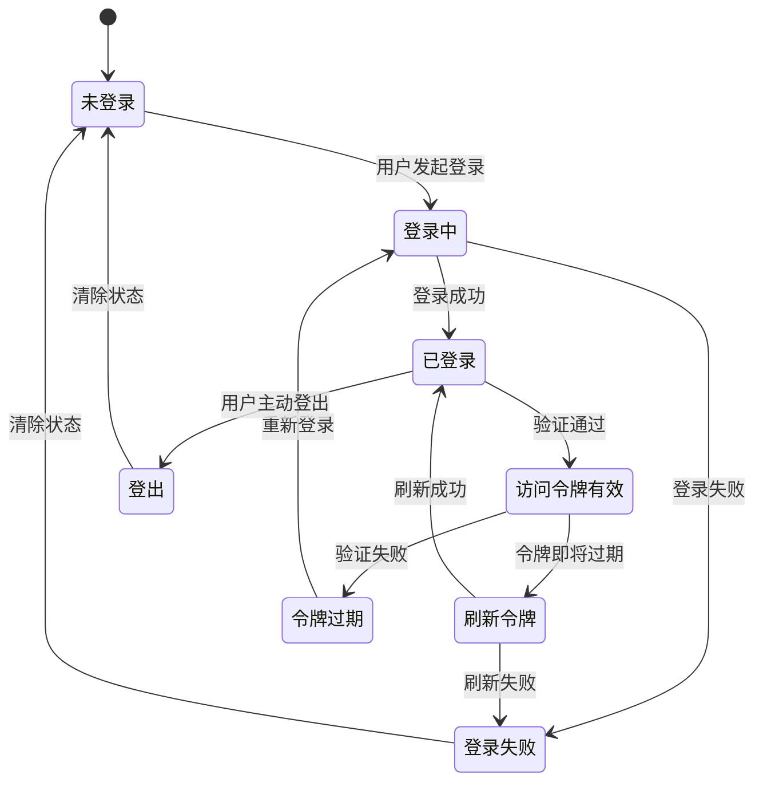

**图表来源**
- [services/auth_service.py:122-206](file://services/auth_service.py#L122-L206)
- [miniprogram/utils/loginService.js:491-515](file://miniprogram/utils/loginService.js#L491-L515)

**章节来源**
- [services/auth_service.py:122-206](file://services/auth_service.py#L122-L206)
- [miniprogram/utils/loginService.js:491-515](file://miniprogram/utils/loginService.js#L491-L515)

### 4. Mock登录控制系统

系统新增了Mock登录控制机制，确保开发和生产环境的安全性：

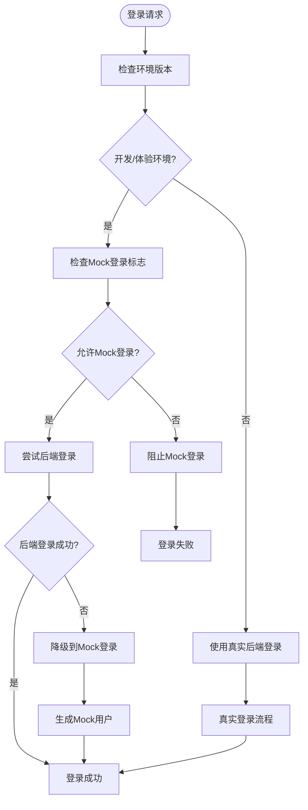

**图表来源**
- [miniprogram/utils/loginService.js:43-164](file://miniprogram/utils/loginService.js#L43-L164)

**章节来源**
- [miniprogram/utils/loginService.js:43-164](file://miniprogram/utils/loginService.js#L43-L164)

## 详细认证流程

### 1. 微信登录流程

微信登录是最常用的认证方式，支持多种登录场景：

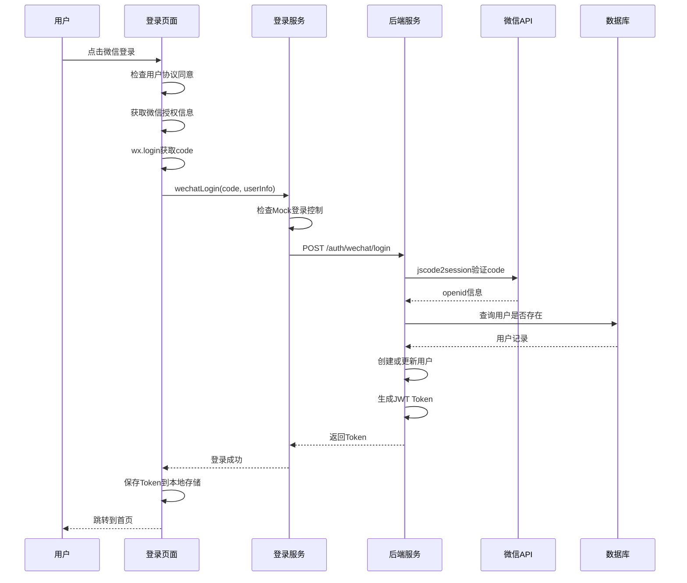

**图表来源**
- [miniprogram/pages/login/login.js:67-141](file://miniprogram/pages/login/login.js#L67-L141)
- [routes/auth.py:406-436](file://routes/auth.py#L406-L436)
- [services/auth_service.py:327-464](file://services/auth_service.py#L327-L464)

**章节来源**
- [miniprogram/pages/login/login.js:67-141](file://miniprogram/pages/login/login.js#L67-L141)
- [routes/auth.py:406-436](file://routes/auth.py#L406-L436)
- [services/auth_service.py:327-464](file://services/auth_service.py#L327-L464)

### 2. 手机号登录流程

手机号登录提供便捷的身份验证方式：

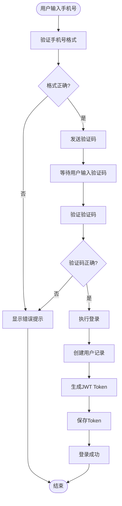

**图表来源**
- [miniprogram/pages/login/login.js:255-344](file://miniprogram/pages/login/login.js#L255-L344)
- [routes/auth.py:317-342](file://routes/auth.py#L317-L342)

**章节来源**
- [miniprogram/pages/login/login.js:255-344](file://miniprogram/pages/login/login.js#L255-L344)
- [routes/auth.py:317-342](file://routes/auth.py#L317-L342)

### 3. 游客模式流程

游客模式提供临时访问能力：

**图表来源**
- [miniprogram/pages/login/login.js:346-421](file://miniprogram/pages/login/login.js#L346-L421)

**章节来源**
- [miniprogram/pages/login/login.js:346-421](file://miniprogram/pages/login/login.js#L346-L421)

### 4. Mock登录流程

Mock登录流程用于开发和测试环境：

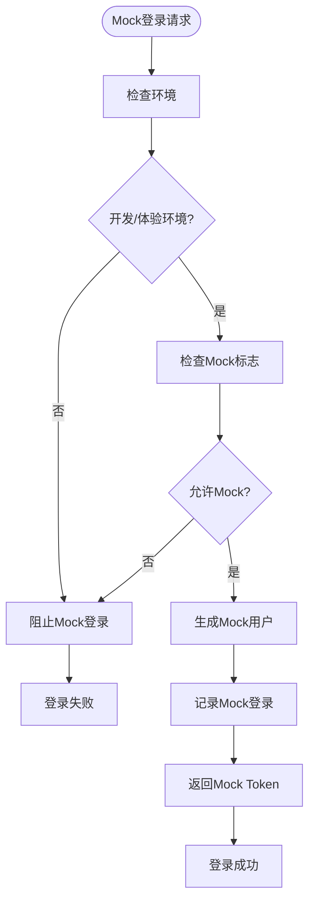

**图表来源**
- [miniprogram/utils/loginService.js:124-164](file://miniprogram/utils/loginService.js#L124-L164)

**章节来源**
- [miniprogram/utils/loginService.js:124-164](file://miniprogram/utils/loginService.js#L124-L164)

## 依赖关系分析

系统各组件之间的依赖关系如下：

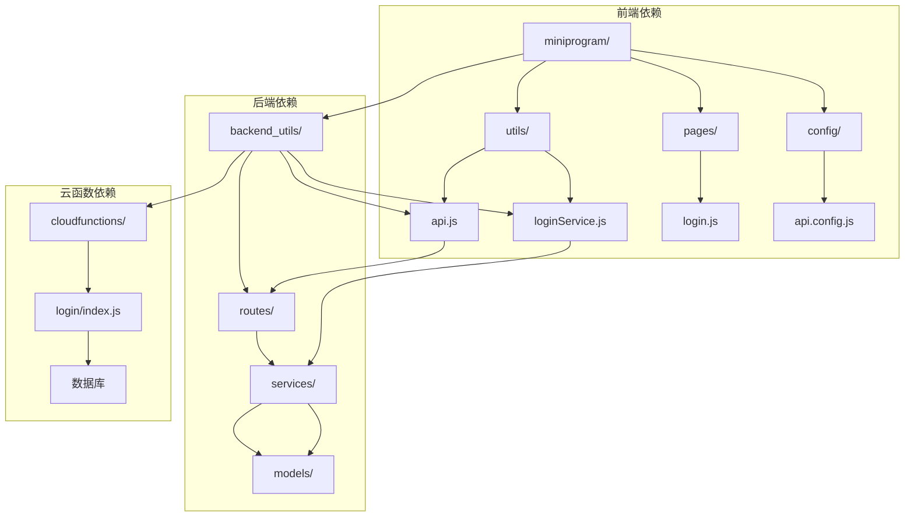

**图表来源**
- [miniprogram/utils/api.js:1-800](file://miniprogram/utils/api.js#L1-L800)
- [backend_utils/api.js:1-593](file://backend_utils/api.js#L1-L593)
- [routes/auth.py:1-800](file://routes/auth.py#L1-L800)

**章节来源**
- [miniprogram/utils/api.js:1-800](file://miniprogram/utils/api.js#L1-L800)
- [backend_utils/api.js:1-593](file://backend_utils/api.js#L1-L593)
- [routes/auth.py:1-800](file://routes/auth.py#L1-L800)

## 性能考虑

系统在多个层面进行了性能优化：

### 1. 请求队列和并发控制

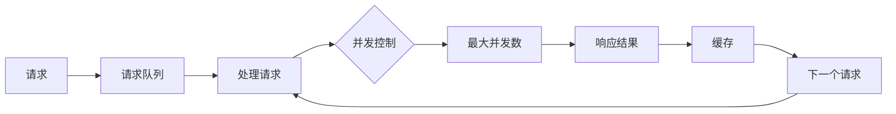

**图表来源**
- [backend_utils/api.js:14-30](file://backend_utils/api.js#L14-L30)
- [miniprogram/utils/api.js:142-153](file://miniprogram/utils/api.js#L142-L153)

### 2. 缓存策略

系统实现了多层次的缓存机制：

- **API缓存**: 5分钟缓存策略，减少重复请求
- **请求去重**: 防止相同请求的重复执行
- **本地存储**: Token和用户信息的持久化存储
- **Mock登录缓存**: 记录Mock登录日志用于审计

**章节来源**
- [backend_utils/api.js:8-11](file://backend_utils/api.js#L8-L11)
- [miniprogram/utils/api.js:135-140](file://miniprogram/utils/api.js#L135-L140)

### 3. 错误处理和重试机制

系统实现了智能的错误处理和重试机制：

- **可重试错误**: 数据库错误、限流错误、系统错误
- **指数退避重试**: 智能延迟策略
- **错误分类统计**: 详细的错误分类和统计
- **用户友好提示**: 显示易懂的错误信息

**章节来源**
- [miniprogram/utils/api.js:70-113](file://miniprogram/utils/api.js#L70-L113)
- [miniprogram/utils/api.js:674-701](file://miniprogram/utils/api.js#L674-L701)

## 故障排除指南

### 1. 常见登录问题

| 问题类型 | 可能原因 | 解决方案 |
|---------|---------|---------|
| 登录失败 | 微信code过期 | 重新获取微信授权 |
| Token过期 | 访问令牌过期 | 自动刷新或重新登录 |
| Mock登录失败 | 环境配置错误 | 检查Mock登录控制设置 |
| 网络错误 | 网络连接不稳定 | 检查网络设置，重试请求 |
| 数据库连接失败 | 云数据库不可用 | 使用降级方案或等待恢复 |

### 2. Mock登录调试技巧

- **启用Mock登录**: 在开发环境中允许Mock登录
- **检查Mock日志**: 查看Mock登录记录用于审计
- **环境检测**: 确认当前环境版本和配置
- **安全控制**: 生产环境自动阻止Mock登录

**章节来源**
- [miniprogram/utils/loginService.js:35-115](file://miniprogram/utils/loginService.js#L35-L115)
- [miniprogram/utils/loginService.js:173-193](file://miniprogram/utils/loginService.js#L173-L193)

### 3. API配置问题

- **环境检测**: 检查当前小程序环境版本
- **地址切换**: 支持本地和云端地址切换
- **域名配置**: 确保合法域名设置正确
- **调试工具**: 使用全局函数进行环境切换

**章节来源**
- [miniprogram/config/api.config.js:54-87](file://miniprogram/config/api.config.js#L54-L87)
- [miniprogram/config/api.config.js:134-153](file://miniprogram/config/api.config.js#L134-L153)

## 总结

本认证系统经过重构和改进，采用了现代化的架构设计，具有以下特点：

1. **多层架构**: 前端、后端、云函数三层分离，职责清晰
2. **高可用性**: 支持多种登录方式和降级方案
3. **安全性**: JWT令牌机制，支持访问和刷新令牌
4. **Mock登录控制**: 新增的Mock登录控制机制，确保开发和生产环境安全
5. **智能错误处理**: 智能的错误分类、重试和用户友好提示
6. **性能优化**: 请求队列、缓存、并发控制等多重优化
7. **可扩展性**: 模块化设计，易于功能扩展和维护
8. **环境适配**: 智能的API配置中心，支持多环境切换

该系统为小程序提供了完整的用户认证解决方案，既保证了用户体验，又确保了系统的安全性和可靠性。新增的Mock登录控制和智能错误处理功能进一步提升了系统的健壮性和可维护性。