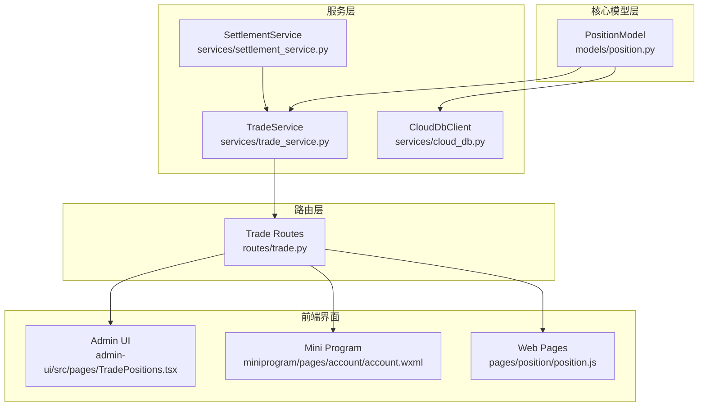
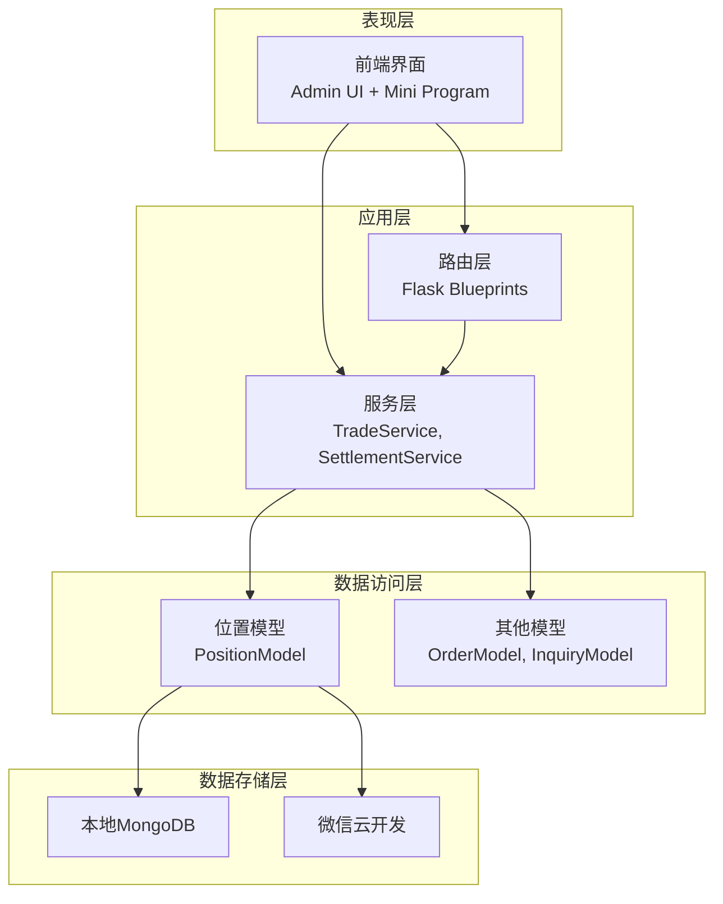
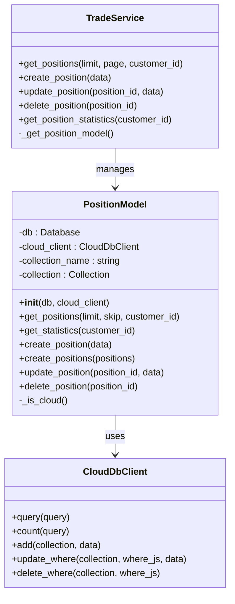
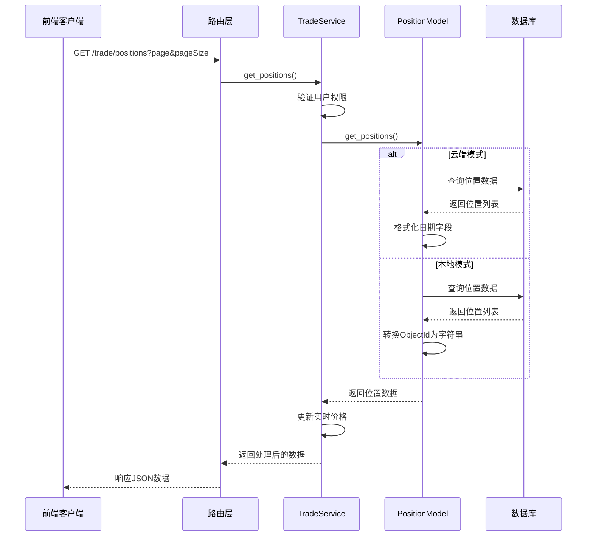
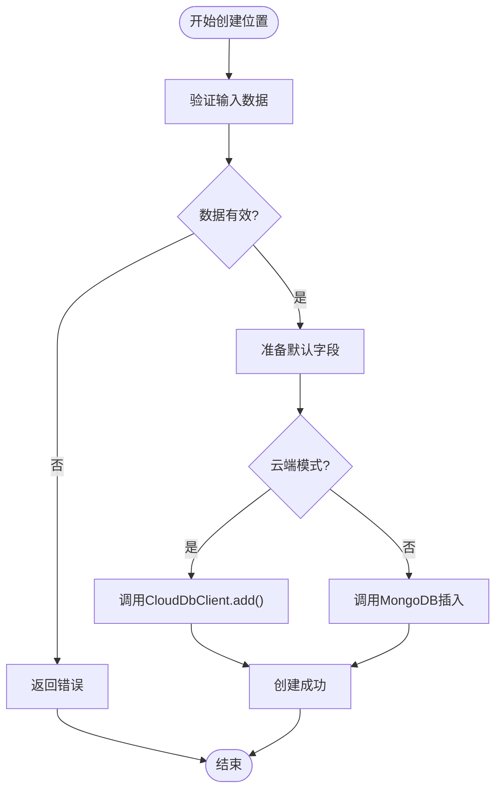
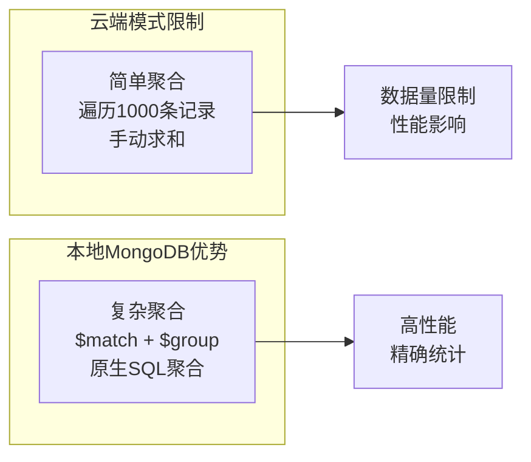
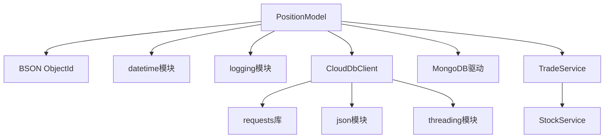
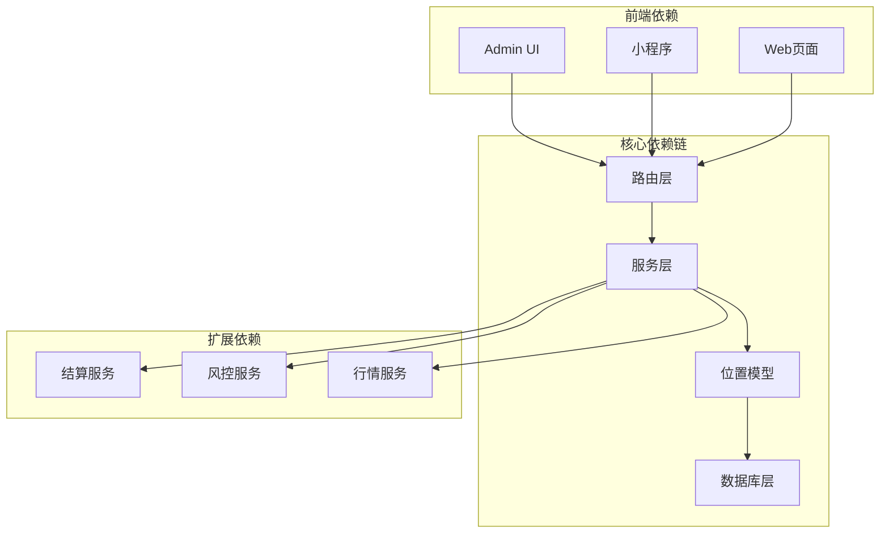
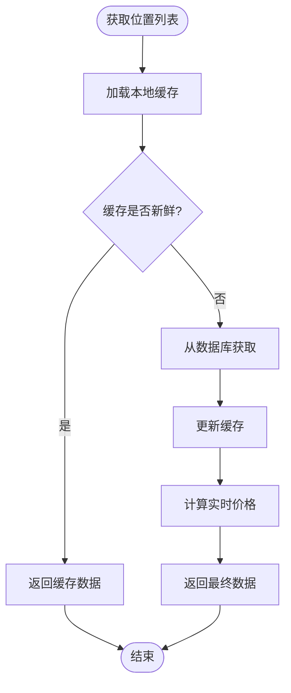
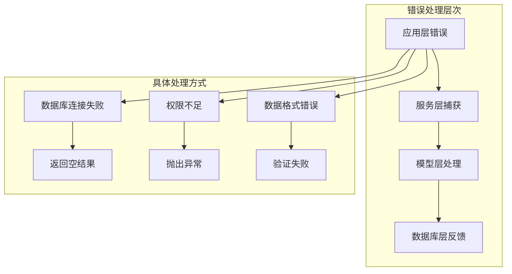

# 位置模型

<cite>
**本文档引用的文件**
- [models/position.py](file://models/position.py)
- [services/trade_service.py](file://services/trade_service.py)
- [routes/trade.py](file://routes/trade.py)
- [services/cloud_db.py](file://services/cloud_db.py)
- [services/settlement_service.py](file://services/settlement_service.py)
- [admin-ui/src/pages/TradePositions.tsx](file://admin-ui/src/pages/TradePositions.tsx)
- [miniprogram/pages/account/account.wxml](file://miniprogram/pages/account/account.wxml)
- [pages/position/position.js](file://pages/position/position.js)
</cite>

## 目录
1. [简介](#简介)
2. [项目结构](#项目结构)
3. [核心组件](#核心组件)
4. [架构概览](#架构概览)
5. [详细组件分析](#详细组件分析)
6. [依赖关系分析](#依赖关系分析)
7. [性能考虑](#性能考虑)
8. [故障排除指南](#故障排除指南)
9. [结论](#结论)

## 简介

位置模型（Position Model）是场外期权交易系统中的核心数据模型，负责管理客户的期权持仓信息。该模型提供了完整的CRUD操作、统计查询、实时价格更新等功能，支持本地MongoDB和微信云开发两种数据存储方式。

系统通过位置模型实现了对客户持仓的完整生命周期管理，包括开仓、持仓监控、平仓结算等关键业务流程。位置模型的设计充分考虑了期权产品的特殊性，提供了灵活的扩展性和良好的性能表现。

## 项目结构

基于代码库的组织结构，位置模型相关的组件分布在以下目录中：

**图表来源**
- [models/position.py](file://models/position.py#L10-L206)
- [services/trade_service.py](file://services/trade_service.py#L113-L123)
- [routes/trade.py](file://routes/trade.py#L67-L94)

**章节来源**
- [models/position.py](file://models/position.py#L1-L206)
- [services/trade_service.py](file://services/trade_service.py#L1-L318)
- [routes/trade.py](file://routes/trade.py#L1-L330)

## 核心组件

### PositionModel 类

PositionModel 是位置模型的核心类，提供了完整的数据库操作接口：

**主要功能特性：**
- 支持本地MongoDB和云端数据库双模式运行
- 提供标准的CRUD操作接口
- 支持分页查询和统计计算
- 自动处理时间戳和默认字段

**核心方法：**
- `get_positions()`: 获取持仓列表，支持分页和过滤
- `get_statistics()`: 计算持仓统计信息
- `create_position()`: 创建新持仓
- `update_position()`: 更新现有持仓
- `delete_position()`: 删除持仓记录

**章节来源**
- [models/position.py](file://models/position.py#L10-L206)

### TradeService 服务

TradeService 作为业务服务层，封装了位置模型的操作，并提供了额外的业务逻辑：

**主要职责：**
- 位置数据的业务验证和处理
- 实时价格更新和盈亏计算
- 用户权限控制和数据过滤
- 与其他服务的协调调用

**关键功能：**
- `get_positions()`: 获取带实时价格的位置列表
- `create_position()`: 创建位置并进行业务验证
- `update_position()`: 更新位置并重新计算相关指标

**章节来源**
- [services/trade_service.py](file://services/trade_service.py#L113-L205)

### 路由接口

路由层提供了RESTful API接口，供前端应用调用：

**主要接口：**
- `GET /trade/positions`: 获取位置列表
- `POST /trade/positions`: 创建新位置
- `PUT /trade/positions/:id`: 更新位置
- `DELETE /trade/positions/:id`: 删除位置
- `GET /trade/positions/statistics`: 获取统计信息

**章节来源**
- [routes/trade.py](file://routes/trade.py#L67-L170)

## 架构概览

系统采用分层架构设计，各层职责明确，耦合度低：

**图表来源**
- [routes/trade.py](file://routes/trade.py#L13-L16)
- [services/trade_service.py](file://services/trade_service.py#L8-L34)
- [models/position.py](file://models/position.py#L11-L23)

## 详细组件分析

### 位置模型类图

**图表来源**
- [models/position.py](file://models/position.py#L10-L206)
- [services/trade_service.py](file://services/trade_service.py#L113-L123)
- [services/cloud_db.py](file://services/cloud_db.py#L108-L303)

### 位置查询流程

**图表来源**
- [routes/trade.py](file://routes/trade.py#L67-L94)
- [services/trade_service.py](file://services/trade_service.py#L125-L164)
- [models/position.py](file://models/position.py#L28-L63)

### 位置创建流程

**图表来源**
- [services/trade_service.py](file://services/trade_service.py#L166-L178)
- [models/position.py](file://models/position.py#L120-L150)

**章节来源**
- [models/position.py](file://models/position.py#L28-L150)
- [services/trade_service.py](file://services/trade_service.py#L125-L178)

### 统计计算机制

位置模型提供了两种统计计算方式：

**图表来源**
- [models/position.py](file://models/position.py#L65-L118)

**章节来源**
- [models/position.py](file://models/position.py#L65-L118)

## 依赖关系分析

### 外部依赖

位置模型的主要外部依赖包括：

**图表来源**
- [models/position.py](file://models/position.py#L1-L8)
- [services/cloud_db.py](file://services/cloud_db.py#L1-L12)

### 内部依赖关系

**图表来源**
- [routes/trade.py](file://routes/trade.py#L9-L16)
- [services/trade_service.py](file://services/trade_service.py#L1-L10)

**章节来源**
- [routes/trade.py](file://routes/trade.py#L1-L330)
- [services/trade_service.py](file://services/trade_service.py#L1-L318)

## 性能考虑

### 数据库优化策略

1. **索引优化**
   - 为 `customerId` 和 `productCode` 字段建立索引
   - 支持高频查询场景下的快速检索

2. **分页查询**
   - 默认每页20条记录
   - 支持跳过和限制参数控制查询范围

3. **云端限制**
   - 云端模式下统计查询限制为1000条记录
   - 大数据量场景建议使用本地MongoDB

### 缓存和实时更新

**章节来源**
- [models/position.py](file://models/position.py#L18-L21)
- [services/trade_service.py](file://services/trade_service.py#L130-L164)

## 故障排除指南

### 常见问题及解决方案

1. **数据库连接问题**
   - 检查 `db` 参数是否正确初始化
   - 验证MongoDB服务状态
   - 确认集合名称配置正确

2. **云端访问权限**
   - 验证微信云开发环境变量配置
   - 检查access_token获取是否成功
   - 确认集合存在且可访问

3. **数据类型转换错误**
   - 确保数量和价格字段为数值类型
   - 验证日期字段格式正确
   - 检查ObjectId转换是否正常

**章节来源**
- [models/position.py](file://models/position.py#L167-L191)
- [services/cloud_db.py](file://services/cloud_db.py#L197-L207)

### 错误处理机制

位置模型采用了多层次的错误处理策略：

**章节来源**
- [models/position.py](file://models/position.py#L136-L145)
- [services/cloud_db.py](file://services/cloud_db.py#L241-L247)

## 结论

位置模型作为场外期权交易系统的核心组件，展现了良好的架构设计和实现质量。其主要特点包括：

1. **双模式支持**：同时支持本地MongoDB和云端数据库，适应不同部署需求
2. **完整的CRUD操作**：提供了标准的数据操作接口，满足业务需求
3. **实时价格更新**：集成了实时行情数据，提供准确的盈亏计算
4. **权限控制**：通过路由层实现用户权限验证，确保数据安全
5. **性能优化**：采用索引、分页等技术手段提升查询性能

未来可以考虑的改进方向：
- 扩展统计功能，支持更复杂的聚合查询
- 增强错误处理和日志记录机制
- 优化大数据量场景下的查询性能
- 添加更多的业务规则验证

该位置模型为整个期权交易系统的稳定运行奠定了坚实的基础，是系统架构中的重要组成部分。