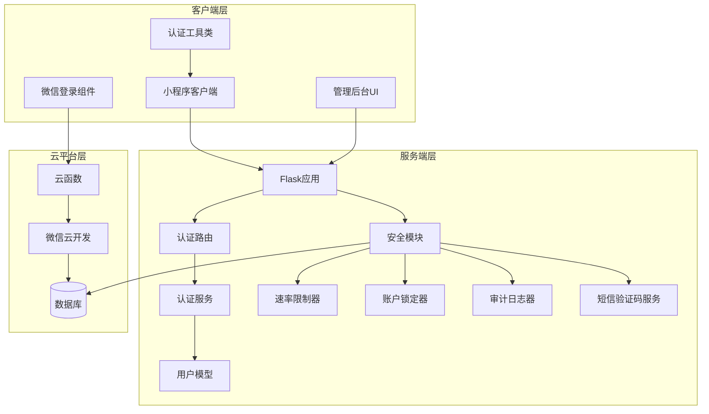
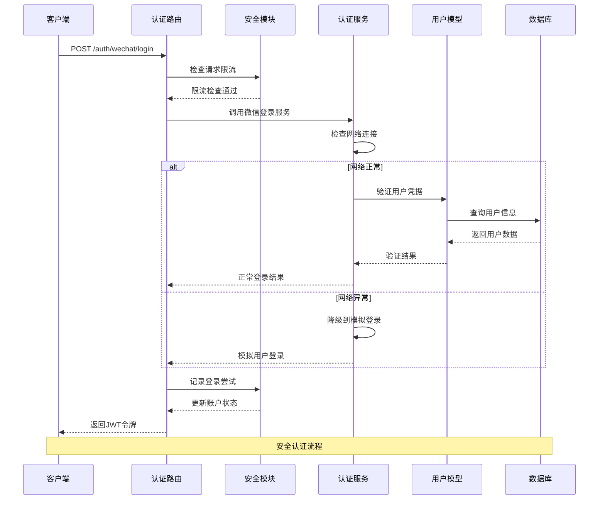
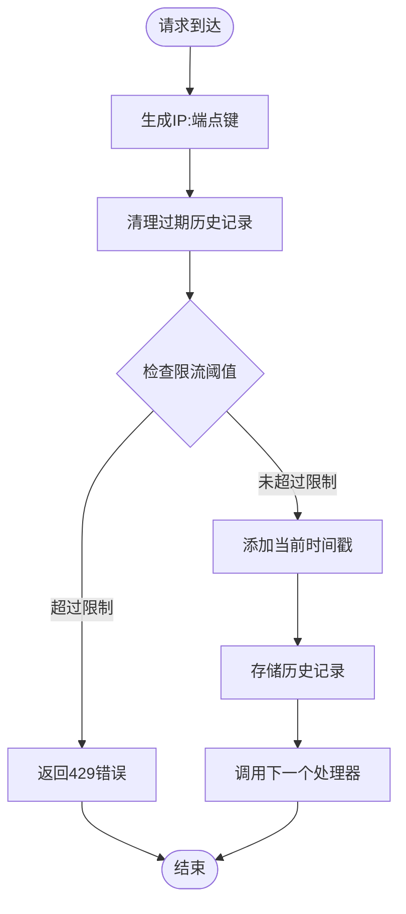
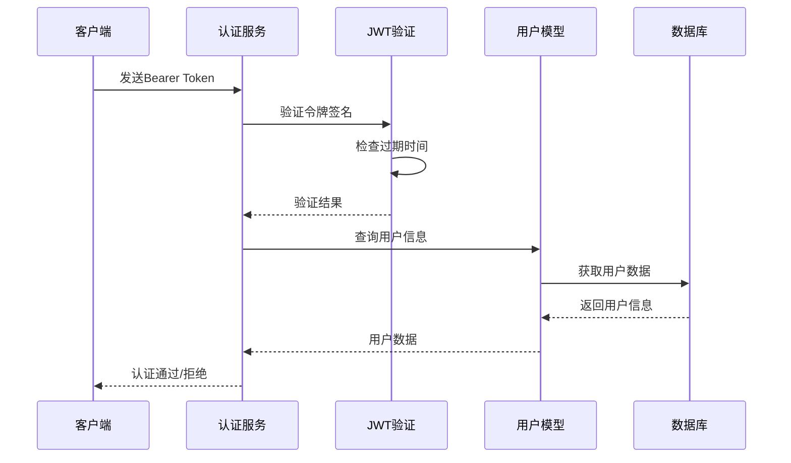
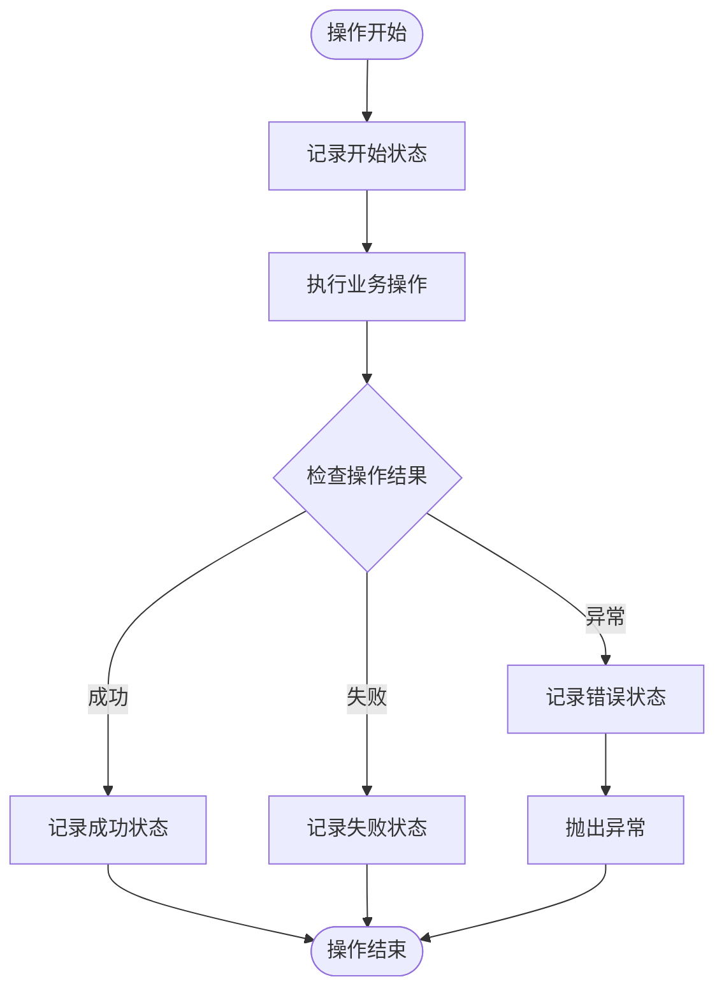
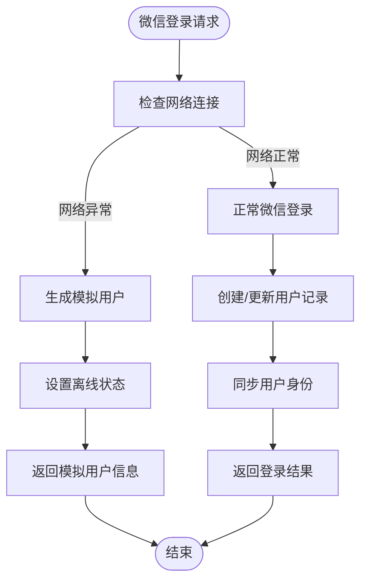
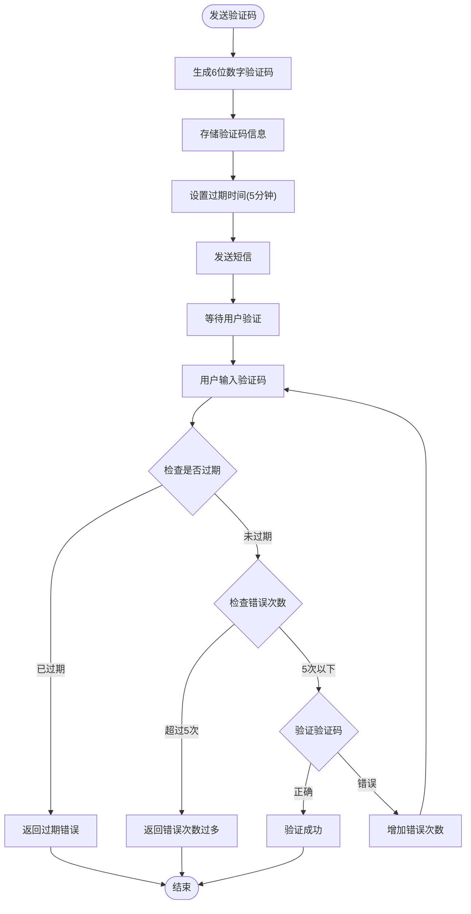
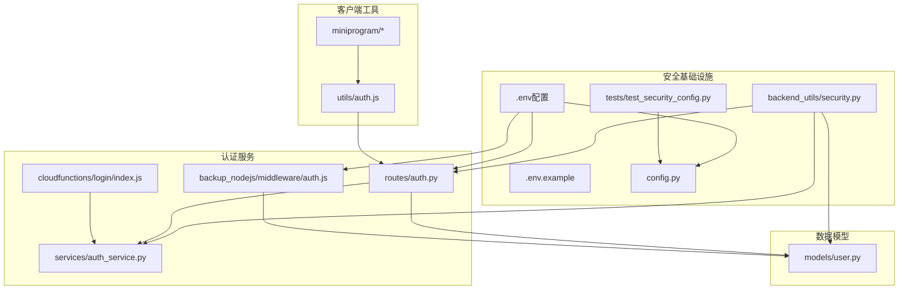

# 安全增强

<cite>
**本文档引用的文件**
- [backend_utils/security.py](file://backend_utils/security.py)
- [routes/auth.py](file://routes/auth.py)
- [utils/auth.js](file://utils/auth.js)
- [models/user.py](file://models/user.py)
- [services/auth_service.py](file://services/auth_service.py)
- [cloudfunctions/login/index.js](file://cloudfunctions/login/index.js)
- [backup_nodejs/middleware/auth.js](file://backup_nodejs/middleware/auth.js)
- [tests/test_security_config.py](file://tests/test_security_config.py)
- [config.py](file://config.py)
</cite>

## 更新摘要
**所做更改**
- 新增微信登录自动降级机制的完整实现分析
- 更新速率限制和账户锁定机制的技术细节
- 完善审计日志系统的功能描述和实现方式
- 增加短信验证码安全机制的详细说明
- 补充生产环境安全配置的验证机制

## 目录
1. [简介](#简介)
2. [项目结构](#项目结构)
3. [核心组件](#核心组件)
4. [架构概览](#架构概览)
5. [详细组件分析](#详细组件分析)
6. [依赖关系分析](#依赖关系分析)
7. [性能考虑](#性能考虑)
8. [故障排除指南](#故障排除指南)
9. [结论](#结论)

## 简介

本项目是一个场外期权交易系统，包含小程序前端、管理后台、后端服务和云函数等多个组件。本文档重点分析系统的安全增强功能，包括身份认证、授权控制、访问限制、审计日志等安全机制。

系统采用多层安全防护策略，涵盖客户端、服务端和云平台三个层面的安全保障。通过JWT令牌认证、IP地址限制、账户锁定机制、操作审计、微信登录降级等多功能的安全防护体系，构建了完整的安全解决方案。

## 项目结构

项目采用前后端分离架构，主要包含以下安全相关组件：

**图表来源**
- [routes/auth.py:1-632](file://routes/auth.py#L1-L632)
- [backend_utils/security.py:1-144](file://backend_utils/security.py#L1-L144)
- [services/auth_service.py:1-562](file://services/auth_service.py#L1-L562)
- [models/user.py:1-309](file://models/user.py#L1-L309)

**章节来源**
- [routes/auth.py:1-632](file://routes/auth.py#L1-L632)
- [backend_utils/security.py:1-144](file://backend_utils/security.py#L1-L144)
- [services/auth_service.py:1-562](file://services/auth_service.py#L1-L562)
- [models/user.py:1-309](file://models/user.py#L1-L309)

## 核心组件

### 安全模块 (Security Module)

安全模块提供了基础的安全功能，包括请求限流、账户锁定、审计日志和短信验证码管理。

#### 请求限流机制
- 支持基于IP地址和端点的双重限流
- 内存存储历史请求时间戳
- 可配置的限流阈值和时间窗口
- 实现429状态码的限流响应

#### 账户锁定机制
- 失败登录尝试计数
- 15分钟锁定策略
- IP地址和账户组合锁定
- 自动解锁机制

#### 审计日志
- 操作开始和结束状态记录
- 用户ID和IP地址追踪
- 异常错误信息记录
- 多种操作类型的日志分类

#### 短信验证码安全
- 验证码生成和存储
- 过期时间管理和错误次数限制
- 多类型验证码支持（登录、注册、重置）
- 安全的验证码验证流程

**章节来源**
- [backend_utils/security.py:18-144](file://backend_utils/security.py#L18-L144)

### 认证路由 (Auth Routes)

认证路由模块实现了完整的用户认证和授权流程：

#### 多种登录方式
- 管理员账号登录
- 邮箱登录
- 手机号登录（支持验证码和密码）
- 微信一键登录
- 游客模式

#### 权限控制
- Bearer Token认证
- 角色权限验证
- 游客模式限制
- 刷新令牌机制

#### 安全措施
- 密码重置验证码
- 短信验证码发送
- 登录失败处理
- 会话管理

**章节来源**
- [routes/auth.py:79-464](file://routes/auth.py#L79-L464)

### 用户模型 (User Model)

用户模型提供了用户数据管理和会话控制功能：

#### 用户数据管理
- 用户信息查询和更新
- 密码哈希存储
- 用户状态管理
- 余额操作支持

#### 会话管理
- 多设备会话跟踪
- 会话撤销功能
- 设备信息记录
- 过期时间管理

#### 安全特性
- 云端和本地数据库支持
- 原子性操作保证
- 错误处理机制
- 数据完整性检查

**章节来源**
- [models/user.py:1-309](file://models/user.py#L1-L309)

### 认证服务 (Auth Service)

认证服务提供了高级安全功能，包括微信登录降级机制：

#### 微信登录降级
- 网络异常时的模拟登录
- 统一的用户标识管理
- 用户信息同步机制
- 错误恢复和降级处理

#### 用户管理
- 用户注册和登录
- 密码强度验证
- 用户资料更新
- 身份同步服务

**章节来源**
- [services/auth_service.py:389-440](file://services/auth_service.py#L389-L440)

## 架构概览

系统采用分层安全架构，确保每个层面都有相应的安全防护：

**图表来源**
- [routes/auth.py:478-522](file://routes/auth.py#L478-L522)
- [services/auth_service.py:411-440](file://services/auth_service.py#L411-L440)
- [backend_utils/security.py:63-86](file://backend_utils/security.py#L63-L86)

## 详细组件分析

### 安全模块详细分析

#### 请求限流算法

**图表来源**
- [backend_utils/security.py:24-46](file://backend_utils/security.py#L24-L46)

#### 账户锁定机制
系统实现了一个智能的账户锁定机制，当同一IP地址对同一账户的登录尝试超过5次时，账户将被锁定15分钟。

**章节来源**
- [backend_utils/security.py:48-86](file://backend_utils/security.py#L48-L86)

### 认证流程分析

#### JWT令牌认证流程

**图表来源**
- [routes/auth.py:33-59](file://routes/auth.py#L33-L59)
- [backup_nodejs/middleware/auth.js:35-80](file://backup_nodejs/middleware/auth.js#L35-L80)

#### 多渠道登录支持
系统支持多种登录方式，每种方式都有相应的安全处理：

**章节来源**
- [routes/auth.py:452-464](file://routes/auth.py#L452-L464)
- [cloudfunctions/login/index.js:140-165](file://cloudfunctions/login/index.js#L140-L165)

### 审计日志系统

审计日志系统提供了完整的操作追踪能力：

#### 审计日志记录流程

**图表来源**
- [backend_utils/security.py:88-117](file://backend_utils/security.py#L88-L117)

**章节来源**
- [backend_utils/security.py:88-117](file://backend_utils/security.py#L88-L117)

### 微信登录降级机制

#### 降级流程设计

**图表来源**
- [services/auth_service.py:411-440](file://services/auth_service.py#L411-L440)

**章节来源**
- [services/auth_service.py:411-440](file://services/auth_service.py#L411-L440)

### 短信验证码安全机制

#### 验证码生命周期管理

**图表来源**
- [backend_utils/security.py:119-144](file://backend_utils/security.py#L119-L144)

**章节来源**
- [backend_utils/security.py:119-144](file://backend_utils/security.py#L119-L144)

## 依赖关系分析

系统安全组件之间的依赖关系如下：

**图表来源**
- [backend_utils/security.py:1-144](file://backend_utils/security.py#L1-L144)
- [routes/auth.py:1-632](file://routes/auth.py#L1-L632)
- [services/auth_service.py:1-562](file://services/auth_service.py#L1-L562)
- [models/user.py:1-309](file://models/user.py#L1-L309)

**章节来源**
- [backend_utils/security.py:1-144](file://backend_utils/security.py#L1-L144)
- [routes/auth.py:1-632](file://routes/auth.py#L1-L632)
- [services/auth_service.py:1-562](file://services/auth_service.py#L1-L562)
- [models/user.py:1-309](file://models/user.py#L1-L309)

## 性能考虑

### 安全机制的性能影响

#### 内存存储优化
- 限流和账户锁定状态存储在内存中
- 使用字典结构实现O(1)查找复杂度
- 定期清理过期数据减少内存占用

#### 数据库查询优化
- 用户信息查询使用索引字段
- 会话管理支持云端和本地数据库
- 批量操作减少数据库往返次数

#### 缓存策略
- JWT令牌验证结果缓存
- 用户权限信息缓存
- 配置信息缓存

#### 微信登录降级优化
- 网络异常时的快速降级响应
- 模拟用户的轻量级处理
- 最小化的数据库操作

## 故障排除指南

### 常见安全问题诊断

#### 认证失败问题
1. **检查JWT密钥配置**
   - 确认`.env`文件中的`SECRET_KEY`设置
   - 验证密钥长度和复杂度要求

2. **验证令牌格式**
   - 确保请求头包含正确的`Authorization: Bearer`格式
   - 检查令牌是否过期

3. **检查用户状态**
   - 验证用户是否存在且激活
   - 确认用户角色权限

#### 限流问题
1. **检查限流配置**
   - 验证请求限流阈值设置
   - 确认时间窗口配置

2. **监控限流触发**
   - 查看日志中的限流警告信息
   - 分析IP地址和端点的访问模式

#### 审计日志问题
1. **验证日志配置**
   - 检查日志级别设置
   - 确认日志输出目标

2. **调试审计流程**
   - 查看操作开始和结束的日志记录
   - 检查异常情况的错误日志

#### 微信登录降级问题
1. **检查网络连接**
   - 验证API_BASE_URL配置
   - 确认网络连通性

2. **调试降级流程**
   - 查看降级日志信息
   - 验证模拟用户创建过程

**章节来源**
- [.env:8-11](file://.env#L8-L11)
- [.env.example:13-17](file://.env.example#L13-L17)
- [routes/auth.py:33-59](file://routes/auth.py#L33-L59)
- [services/auth_service.py:411-440](file://services/auth_service.py#L411-L440)

## 结论

本项目建立了多层次的安全防护体系，涵盖了从客户端到服务端的完整安全链路。主要安全特性包括：

### 核心安全优势
- **多重认证机制**：支持多种登录方式，满足不同场景需求
- **完善的权限控制**：基于角色的访问控制和细粒度权限管理
- **智能限流保护**：防止暴力破解和DDoS攻击
- **全面审计追踪**：完整的操作日志和异常监控
- **灵活的部署配置**：支持开发、测试、生产环境的不同安全需求
- **鲁棒的降级机制**：网络异常时的优雅降级和用户体验保障
- **短信验证码安全**：完整的验证码生命周期管理和安全验证

### 安全改进建议
1. **增强令牌安全**
   - 实现JWT刷新令牌机制
   - 添加令牌撤销列表
   - 实施令牌绑定设备信息

2. **加强数据保护**
   - 实现敏感数据加密存储
   - 添加数据传输加密
   - 实施数据备份和恢复

3. **完善监控告警**
   - 添加实时安全监控
   - 实现异常行为检测
   - 建立安全事件响应机制

4. **扩展安全功能**
   - 实现IP白名单和黑名单
   - 添加多因素认证
   - 增强日志审计功能

该安全体系为场外期权交易系统提供了坚实的安全基础，能够有效防范常见的安全威胁，保障用户数据和交易安全。通过持续的安全改进和监控，系统能够适应不断变化的安全挑战，为用户提供可靠的服务保障。