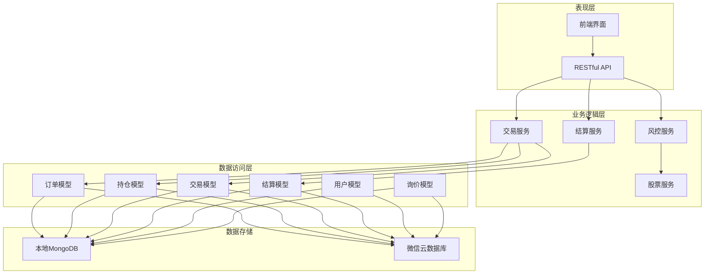
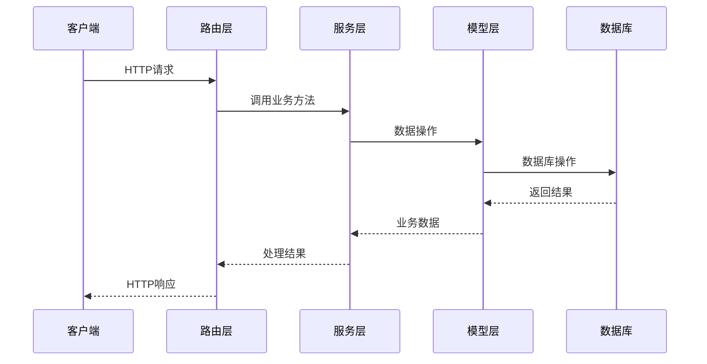
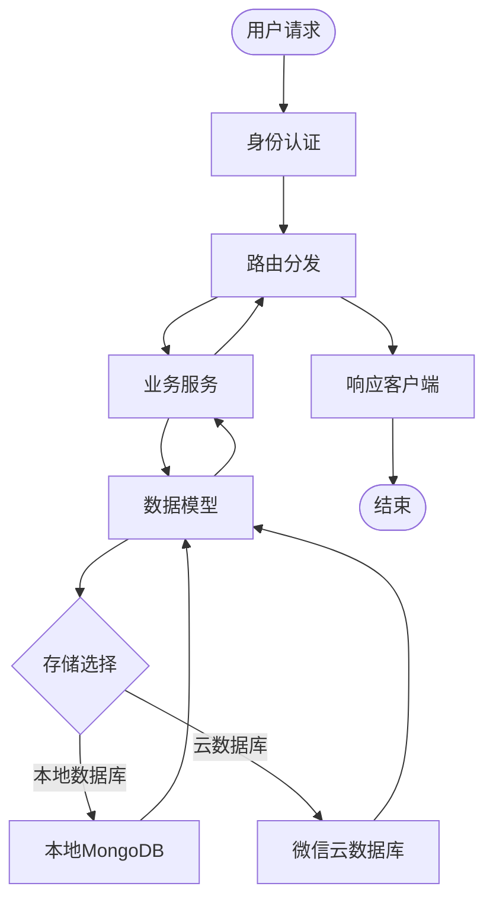
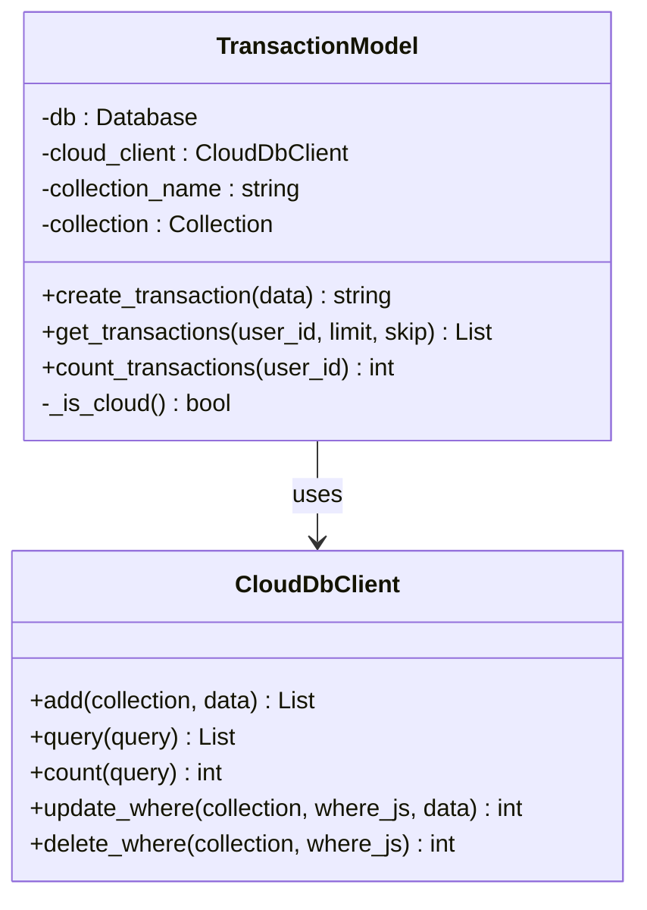
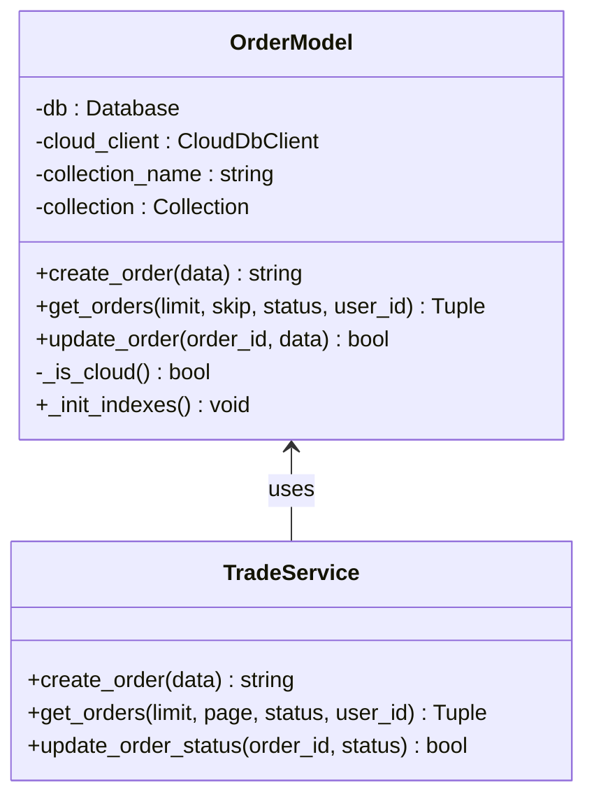
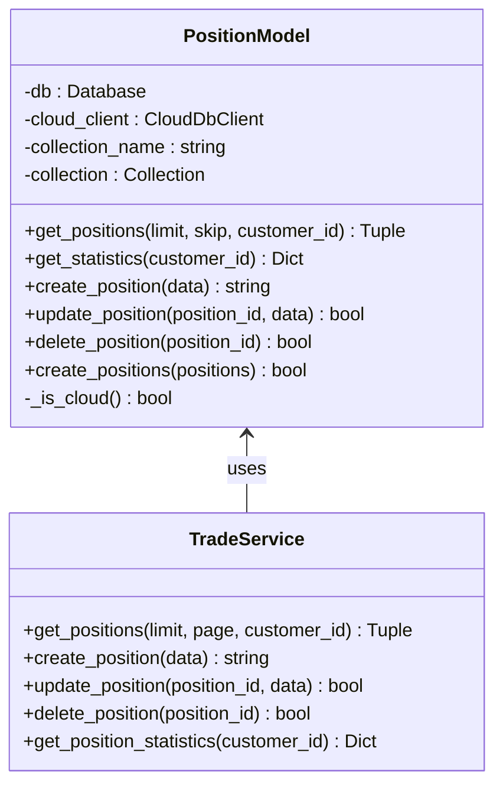
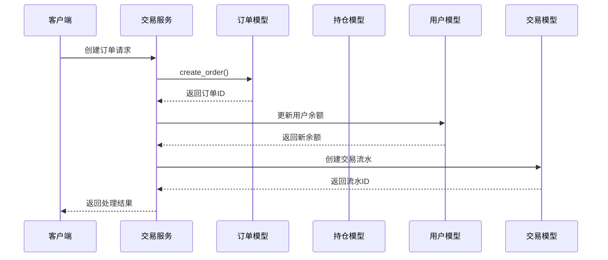
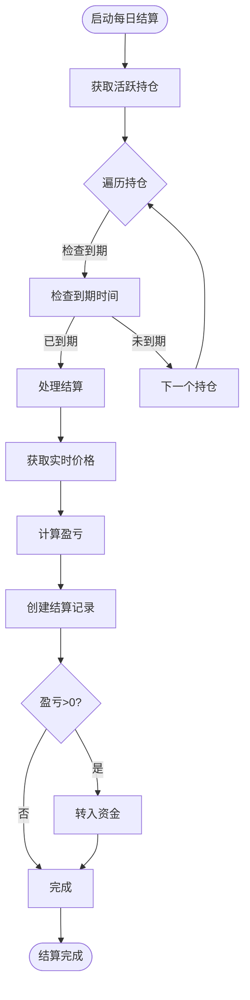
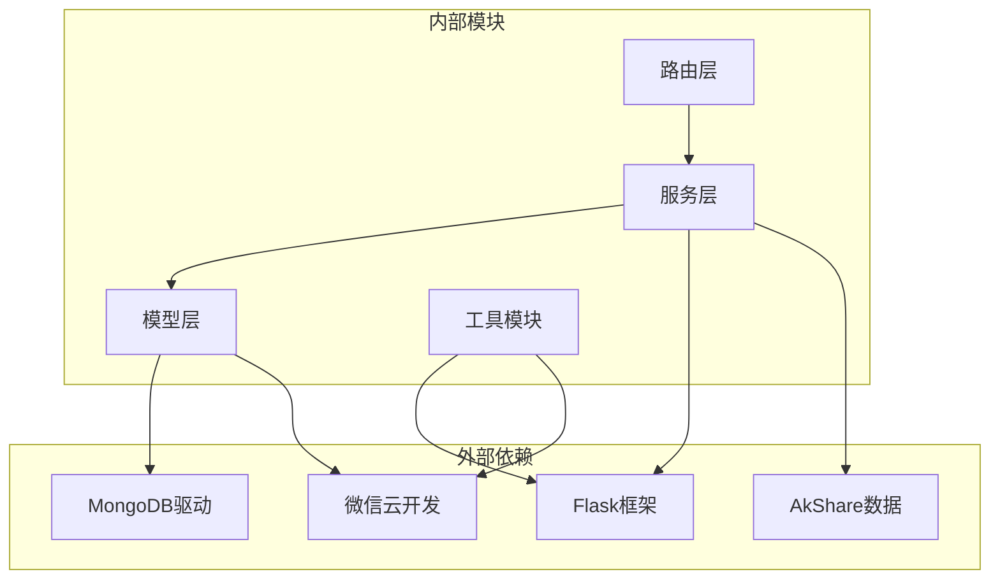

# 交易模型

<cite>
**本文档引用的文件**
- [models/transaction.py](file://models/transaction.py)
- [models/order.py](file://models/order.py)
- [models/settlement.py](file://models/settlement.py)
- [models/inquiry.py](file://models/inquiry.py)
- [models/position.py](file://models/position.py)
- [models/user.py](file://models/user.py)
- [routes/trade.py](file://routes/trade.py)
- [services/trade_service.py](file://services/trade_service.py)
- [services/settlement_service.py](file://services/settlement_service.py)
- [services/risk_service.py](file://services/risk_service.py)
- [services/cloud_db.py](file://services/cloud_db.py)
- [services/stock_service.py](file://services/stock_service.py)
</cite>

## 目录
1. [简介](#简介)
2. [项目结构](#项目结构)
3. [核心组件](#核心组件)
4. [架构概览](#架构概览)
5. [详细组件分析](#详细组件分析)
6. [依赖关系分析](#依赖关系分析)
7. [性能考虑](#性能考虑)
8. [故障排除指南](#故障排除指南)
9. [结论](#结论)

## 简介

这是一个基于微信云开发的场外期权交易系统，采用Python Flask后端和前后端分离架构。系统实现了完整的交易生命周期管理，包括订单管理、持仓管理、资金流水、结算管理和风险管理等功能。

该系统的核心特点是支持本地MongoDB和微信云数据库两种存储模式，通过统一的模型层抽象实现数据访问的一致性。系统提供了丰富的API接口，支持管理员和普通用户的差异化权限控制。

## 项目结构

系统采用模块化的三层架构设计：



**图表来源**
- [routes/trade.py](file://routes/trade.py#L1-L330)
- [services/trade_service.py](file://services/trade_service.py#L1-L318)
- [services/settlement_service.py](file://services/settlement_service.py#L1-L113)
- [services/risk_service.py](file://services/risk_service.py#L1-L60)

**章节来源**
- [routes/trade.py](file://routes/trade.py#L1-L330)
- [services/trade_service.py](file://services/trade_service.py#L1-L318)

## 核心组件

### 交易模型层

系统实现了五个核心数据模型，每个模型都支持本地数据库和云数据库两种存储方式：

1. **TransactionModel**: 资金流水记录模型
2. **OrderModel**: 交易订单模型  
3. **PositionModel**: 持仓管理模型
4. **SettlementModel**: 结算记录模型
5. **UserModel**: 用户账户模型

### 服务层

服务层提供业务逻辑封装，包含：

1. **TradeService**: 交易核心服务，协调各个模型的操作
2. **SettlementService**: 日常结算服务
3. **RiskService**: 风险管理服务，包含Black-Scholes希腊字母计算
4. **StockService**: 股票行情数据服务

### 路由层

路由层定义了完整的API接口：

- `/trade/risk/*`: 风险管理相关接口
- `/trade/settlement/*`: 结算管理接口  
- `/trade/positions/*`: 持仓管理接口
- `/trade/orders/*`: 订单管理接口
- `/trade/account/*`: 账户资金接口

**章节来源**
- [models/transaction.py](file://models/transaction.py#L1-L61)
- [models/order.py](file://models/order.py#L1-L119)
- [models/settlement.py](file://models/settlement.py#L1-L57)
- [models/position.py](file://models/position.py#L1-L206)
- [models/user.py](file://models/user.py#L1-L309)

## 架构概览

系统采用微服务架构，通过清晰的分层设计实现关注点分离：



**图表来源**
- [routes/trade.py](file://routes/trade.py#L18-L330)
- [services/trade_service.py](file://services/trade_service.py#L1-L318)

### 数据流架构



**图表来源**
- [services/cloud_db.py](file://services/cloud_db.py#L108-L533)
- [models/transaction.py](file://models/transaction.py#L16-L17)

## 详细组件分析

### 交易模型分析

#### TransactionModel - 资金流水模型

TransactionModel负责管理用户的资金流水记录，支持存款、取款、买卖等各类交易类型的流水记录。



**图表来源**
- [models/transaction.py](file://models/transaction.py#L6-L61)
- [services/cloud_db.py](file://services/cloud_db.py#L108-L330)

#### OrderModel - 订单管理模型

OrderModel处理交易订单的完整生命周期，包括订单创建、状态更新、查询等功能。



**图表来源**
- [models/order.py](file://models/order.py#L10-L119)
- [services/trade_service.py](file://services/trade_service.py#L98-L109)

#### PositionModel - 持仓管理模型

PositionModel管理用户的持仓情况，支持实时行情更新和盈亏计算。



**图表来源**
- [models/position.py](file://models/position.py#L10-L206)
- [services/trade_service.py](file://services/trade_service.py#L125-L201)

### 服务层组件

#### TradeService - 交易核心服务

TradeService作为业务逻辑的核心协调者，整合了多个数据模型的操作：



**图表来源**
- [services/trade_service.py](file://services/trade_service.py#L98-L109)
- [services/trade_service.py](file://services/trade_service.py#L281-L310)

#### SettlementService - 结算服务

SettlementService负责每日结算逻辑，自动处理到期期权的结算和资金划转：



**图表来源**
- [services/settlement_service.py](file://services/settlement_service.py#L21-L60)
- [services/settlement_service.py](file://services/settlement_service.py#L62-L113)

### 路由层设计

路由层采用Flask Blueprint组织，实现了清晰的权限控制和业务分层：

```mermaid
graph LR
subgraph "风险控制路由"
RiskCheck[/trade/risk/check]
GreeksCalc[/trade/risk/greeks]
end
subgraph "结算路由"
DailySettlement[/trade/settlement/daily]
end
subgraph "持仓路由"
GetPositions[/trade/positions GET]
CreatePosition[/trade/positions POST]
UpdatePosition[/trade/positions/:id PUT]
DeletePosition[/trade/positions/:id DELETE]
GetStats[/trade/positions/statistics GET]
SeedData[/trade/positions/seed POST]
end
subgraph "订单路由"
GetOrders[/trade/orders GET]
CreateOrder[/trade/orders POST]
UpdateStatus[/trade/orders/:id/status PUT]
end
subgraph "账户路由"
GetAccount[/trade/account GET]
Deposit[/trade/account/deposit POST]
Withdraw[/trade/account/withdraw POST]
GetTransactions[/trade/account/transactions GET]
end
```

**图表来源**
- [routes/trade.py](file://routes/trade.py#L18-L330)

**章节来源**
- [routes/trade.py](file://routes/trade.py#L1-L330)
- [services/trade_service.py](file://services/trade_service.py#L1-L318)
- [services/settlement_service.py](file://services/settlement_service.py#L1-L113)

## 依赖关系分析

系统采用松耦合的设计，各组件之间的依赖关系清晰明确：



**图表来源**
- [services/cloud_db.py](file://services/cloud_db.py#L1-L533)
- [services/stock_service.py](file://services/stock_service.py#L1-L289)

### 关键依赖特性

1. **数据库抽象**: 所有模型都支持本地和云端两种存储模式
2. **服务解耦**: 服务层独立于具体的数据访问实现
3. **权限控制**: 路由层实现了细粒度的权限管理
4. **错误处理**: 统一的异常处理和日志记录机制

**章节来源**
- [services/cloud_db.py](file://services/cloud_db.py#L108-L533)
- [models/order.py](file://models/order.py#L24-L26)

## 性能考虑

### 数据库优化策略

1. **索引优化**: 模型初始化时自动创建常用查询索引
2. **分页查询**: 支持大数据量的分页查询，避免全表扫描
3. **批量操作**: 支持批量插入和更新操作
4. **连接池**: 云数据库使用连接池提高并发性能

### 缓存策略

1. **实时行情缓存**: 持仓查询时动态获取实时股价
2. **会话管理**: 用户会话信息的快速查找和验证
3. **配置缓存**: 系统配置的集中管理和缓存

### 并发处理

1. **线程安全**: 云数据库客户端支持多线程并发访问
2. **请求限流**: 云数据库API调用的速率限制和重试机制
3. **异步处理**: 大数据量操作的异步处理能力

## 故障排除指南

### 常见问题及解决方案

#### 数据库连接问题

**问题**: 云数据库连接失败
**原因**: 环境变量配置错误或网络问题
**解决方案**: 
1. 检查WX_CLOUD_ENV、WX_APPID、WX_SECRET环境变量
2. 验证网络连接和防火墙设置
3. 查看日志中的具体错误信息

#### 权限认证问题

**问题**: API调用返回401错误
**原因**: 用户令牌过期或权限不足
**解决方案**:
1. 检查用户登录状态
2. 验证用户角色和权限
3. 重新获取访问令牌

#### 数据一致性问题

**问题**: 交易完成后余额不正确
**原因**: 原子性操作未正确执行
**解决方案**:
1. 检查事务处理逻辑
2. 验证数据库约束条件
3. 查看操作日志追踪

**章节来源**
- [services/cloud_db.py](file://services/cloud_db.py#L19-L21)
- [models/user.py](file://models/user.py#L291-L309)

## 结论

该场外期权交易系统采用了成熟的技术架构和设计模式，实现了以下核心优势：

1. **架构清晰**: 分层设计使得代码结构清晰，易于维护和扩展
2. **存储灵活**: 支持本地和云端两种存储模式，适应不同部署场景
3. **功能完整**: 覆盖了期权交易的完整生命周期管理
4. **安全可靠**: 实现了完善的权限控制和数据安全保障
5. **性能优化**: 采用多种优化策略确保系统的高性能运行

系统为场外期权交易提供了坚实的技术基础，支持业务的持续发展和扩展需求。通过模块化的架构设计，未来可以方便地添加新的功能模块和集成新的第三方服务。