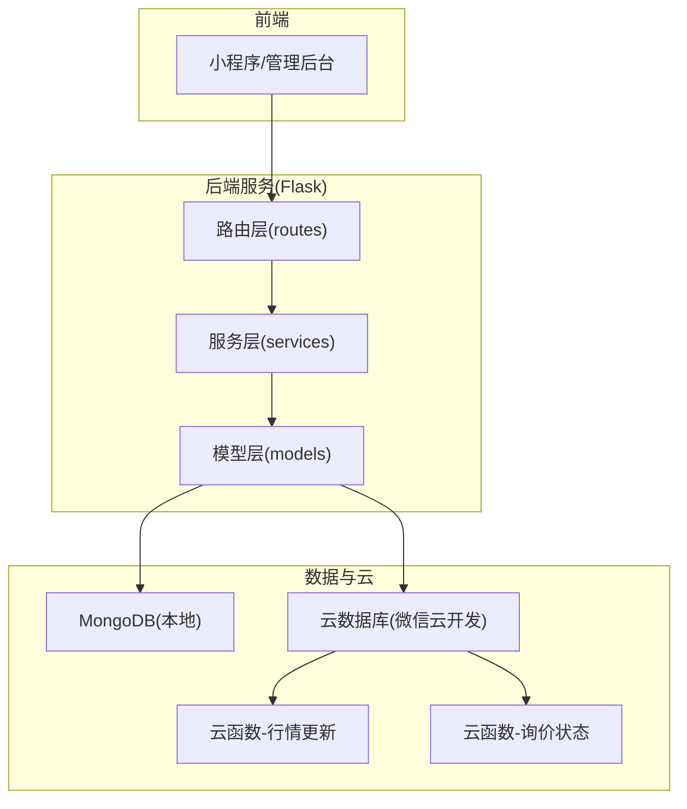
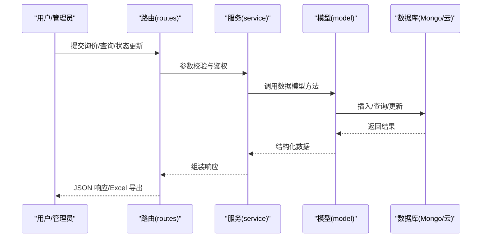
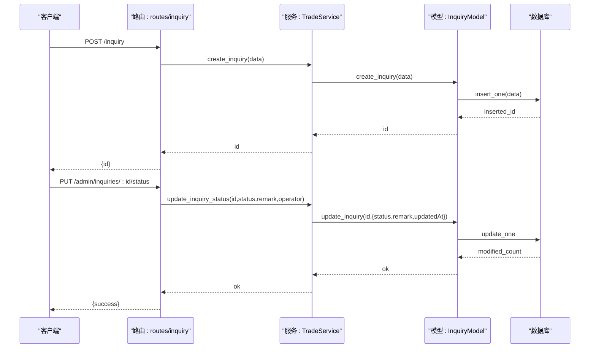
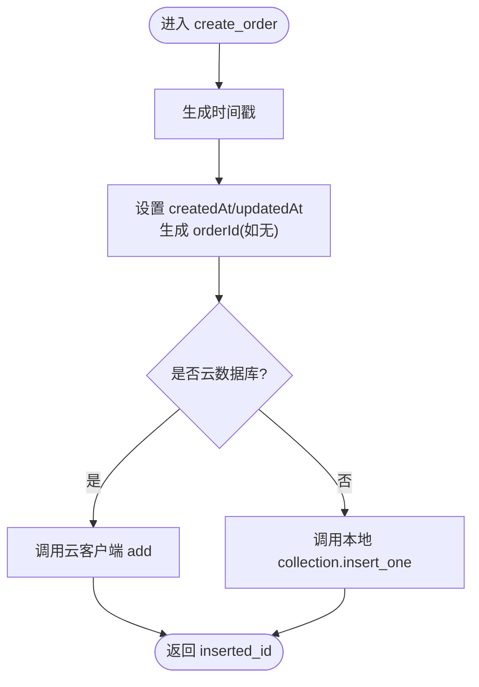
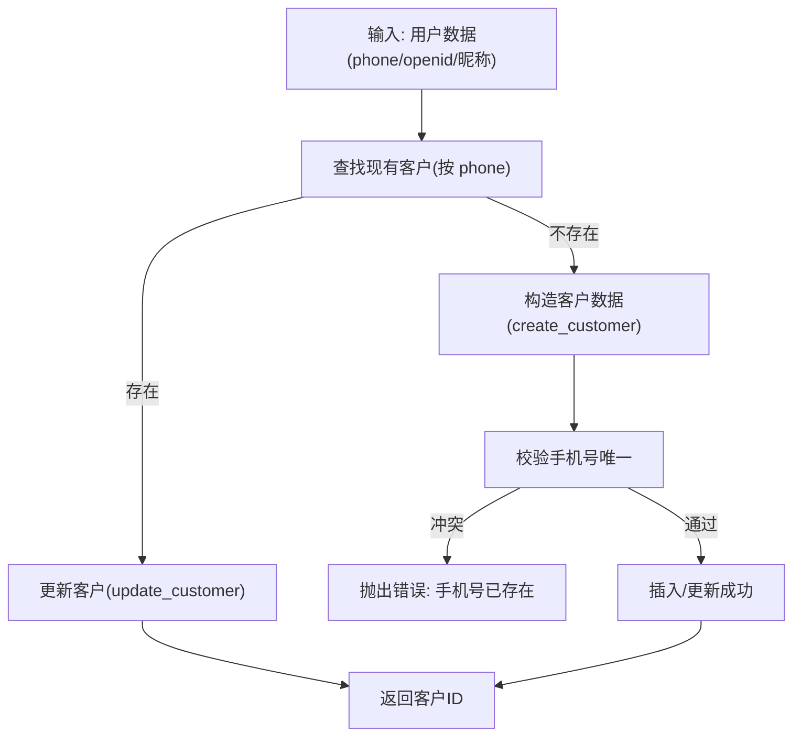
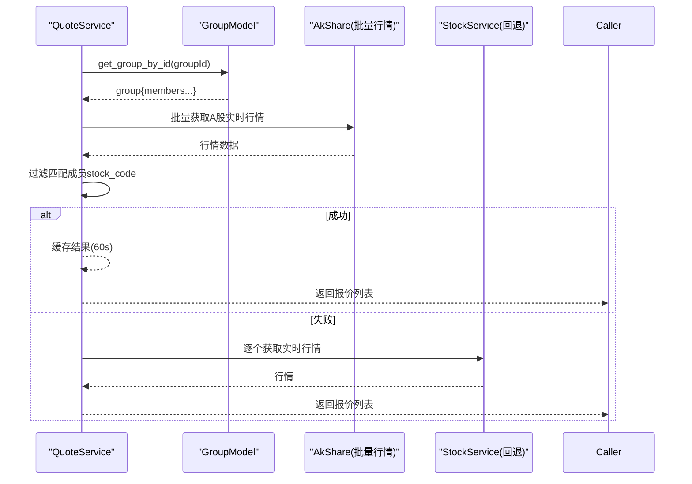
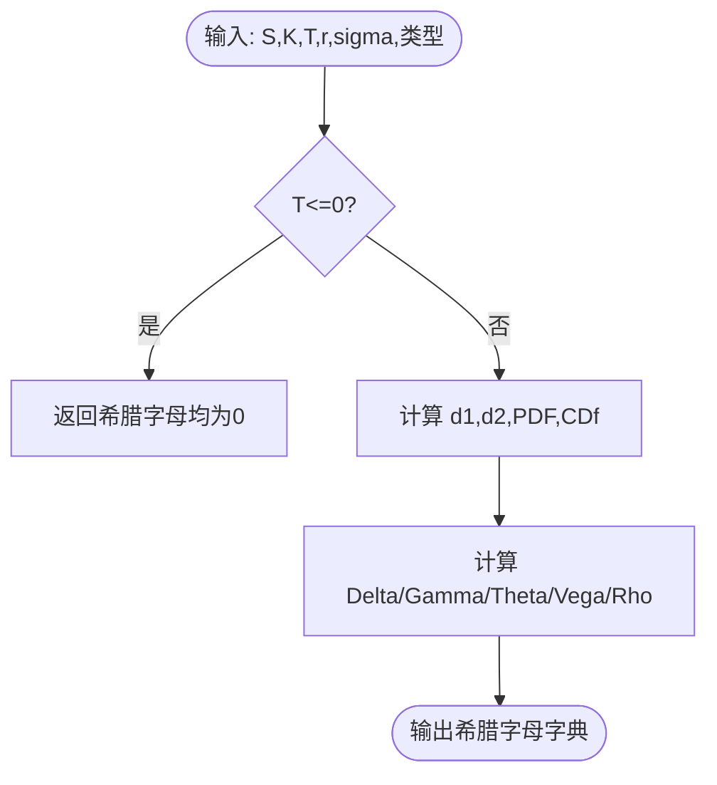
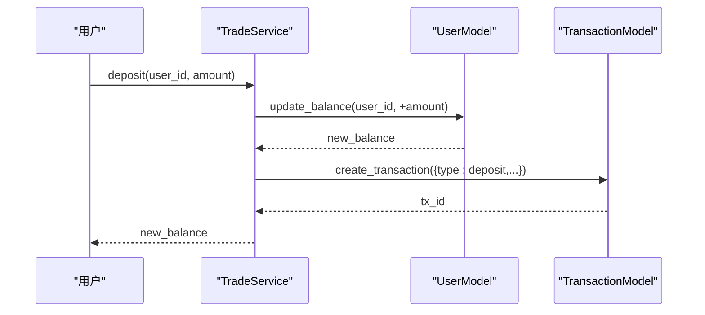
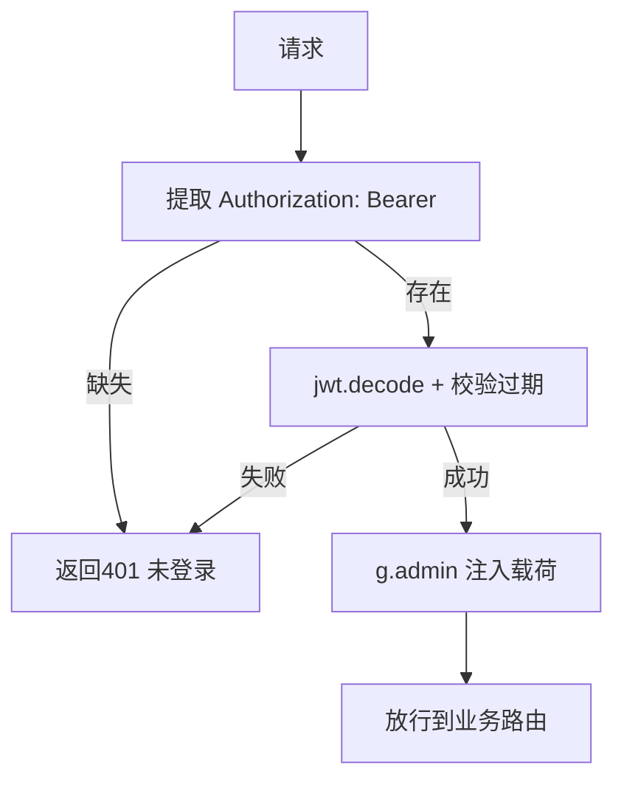
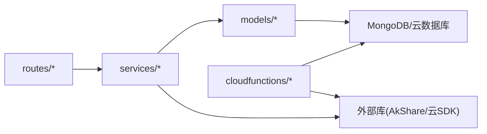

# 业务功能模块

<cite>
**本文引用的文件**
- [README.md](file://README.md)
- [models/inquiry.py](file://models/inquiry.py)
- [models/order.py](file://models/order.py)
- [models/customer.py](file://models/customer.py)
- [models/group.py](file://models/group.py)
- [models/position.py](file://models/position.py)
- [models/user.py](file://models/user.py)
- [models/transaction.py](file://models/transaction.py)
- [routes/inquiry.py](file://routes/inquiry.py)
- [routes/auth.py](file://routes/auth.py)
- [services/trade_service.py](file://services/trade_service.py)
- [services/risk_service.py](file://services/risk_service.py)
- [services/quote_service.py](file://services/quote_service.py)
- [cloudfunctions/handleInquiry/index.js](file://cloudfunctions/handleInquiry/index.js)
- [cloudfunctions/updateQuotes/index.js](file://cloudfunctions/updateQuotes/index.js)
</cite>

## 目录
1. [简介](#简介)
2. [项目结构](#项目结构)
3. [核心组件](#核心组件)
4. [架构总览](#架构总览)
5. [详细组件分析](#详细组件分析)
6. [依赖分析](#依赖分析)
7. [性能考虑](#性能考虑)
8. [故障排查指南](#故障排查指南)
9. [结论](#结论)
10. [附录](#附录)

## 简介
本文件面向场外期权交易系统，系统采用前后端分离与云开发协同的架构，围绕“询价管理、订单处理、风险管理、报价服务、客户管理”五大业务模块展开，覆盖从用户提交询价、后台审核、订单生成、持仓管理、资金流水到实时行情的完整闭环。文档重点阐述：
- 业务流程与状态管理
- 数据模型与数据流转
- 业务规则、约束与异常处理
- 模块间协作关系与接口契约
- 业务场景示例、使用流程与最佳实践
- 性能优化与扩展点、定制化配置与维护策略

## 项目结构
系统由后端服务（Flask）、模型层（MongoDB/云数据库）、路由层（蓝图）、服务层（业务编排）、云函数（云数据库与行情定时任务）以及前端（小程序/管理后台）组成。核心目录与职责概览如下：
- models：封装数据模型与集合操作（询价、订单、客户、分组、持仓、用户、交易流水）
- routes：HTTP 路由与鉴权装饰器（询价、认证）
- services：业务服务编排（交易、风控、报价）
- cloudfunctions：云函数（询价状态更新、行情定时更新）
- README.md：项目说明与运行指引

图表来源
- [routes/inquiry.py](file://routes/inquiry.py#L1-L175)
- [routes/auth.py](file://routes/auth.py#L1-L353)
- [services/trade_service.py](file://services/trade_service.py#L1-L318)
- [services/risk_service.py](file://services/risk_service.py#L1-L60)
- [services/quote_service.py](file://services/quote_service.py#L1-L109)
- [models/inquiry.py](file://models/inquiry.py#L1-L148)
- [models/order.py](file://models/order.py#L1-L119)
- [models/customer.py](file://models/customer.py#L1-L300)
- [models/group.py](file://models/group.py#L1-L283)
- [models/position.py](file://models/position.py#L1-L206)
- [models/user.py](file://models/user.py#L1-L309)
- [models/transaction.py](file://models/transaction.py#L1-L61)
- [cloudfunctions/handleInquiry/index.js](file://cloudfunctions/handleInquiry/index.js#L1-L81)
- [cloudfunctions/updateQuotes/index.js](file://cloudfunctions/updateQuotes/index.js#L1-L180)

章节来源
- [README.md](file://README.md#L1-L90)

## 核心组件
- 询价管理（Inquiry）
  - 数据模型：InquiryModel（支持本地/云数据库，索引 createdAt/status/phone）
  - 路由：提交询价、后台查询、批量更新状态、导出
  - 云函数：后台状态更新与统计
- 订单处理（Order）
  - 数据模型：OrderModel（唯一 orderId，索引 createdAt）
  - 服务：创建订单、分页查询、状态更新
- 客户管理（Customer）
  - 数据模型：CustomerModel（去重手机号、分组、关键字搜索）
  - 用户统一：upsert_customer_from_user（基于 openid/phone）
- 分组与报价（Group/Quote）
  - GroupModel：分组创建、成员增删、查询
  - QuoteService：分组内股票批量行情缓存与获取
- 风险管理（Risk）
  - RiskService：BS希腊字母计算、交易前风控校验
- 交易与账户（Trade/Account）
  - TradeService：询价/订单/持仓/账户汇总/出入金/流水
  - UserModel/TransactionModel：用户会话、登录态、余额原子更新、流水
- 认证与鉴权（Auth）
  - 装饰器 require_auth、角色校验、登录/注册/刷新/微信登录等

章节来源
- [models/inquiry.py](file://models/inquiry.py#L1-L148)
- [routes/inquiry.py](file://routes/inquiry.py#L1-L175)
- [cloudfunctions/handleInquiry/index.js](file://cloudfunctions/handleInquiry/index.js#L1-L81)
- [models/order.py](file://models/order.py#L1-L119)
- [services/trade_service.py](file://services/trade_service.py#L1-L318)
- [models/customer.py](file://models/customer.py#L1-L300)
- [models/group.py](file://models/group.py#L1-L283)
- [services/quote_service.py](file://services/quote_service.py#L1-L109)
- [services/risk_service.py](file://services/risk_service.py#L1-L60)
- [models/user.py](file://models/user.py#L1-L309)
- [models/transaction.py](file://models/transaction.py#L1-L61)
- [routes/auth.py](file://routes/auth.py#L1-L353)

## 架构总览
系统采用“路由-服务-模型-数据源”的分层设计，支持本地 MongoDB 与微信云数据库双栈。云函数承担后台高频任务（行情定时更新、询价状态批量更新）。前端通过 HTTP 与云函数交互，实现询价提交、后台管理、行情展示与风控校验。

图表来源
- [routes/inquiry.py](file://routes/inquiry.py#L11-L175)
- [services/trade_service.py](file://services/trade_service.py#L38-L94)
- [models/inquiry.py](file://models/inquiry.py#L32-L148)

## 详细组件分析

### 询价管理模块
- 业务流程
  - 用户提交询价 → 服务层创建 → 返回 id
  - 管理员后台按状态/分页查询 → 批量更新状态 → 导出 Excel
  - 云函数支持状态更新与统计
- 状态管理
  - 默认状态 pending；支持 processing/completed/rejected
  - remark 字段用于备注；云函数记录 operatorOpenid
- 数据模型
  - 支持本地与云数据库；自动创建索引；时间字段统一格式化
- 异常处理
  - 参数缺失、创建失败、查询失败均返回错误响应
- 接口定义
  - POST /inquiry：提交询价
  - GET /admin/inquiries：分页查询
  - PUT /admin/inquiries/<id>/status：更新状态
  - POST /admin/inquiries/batch-update：批量更新
  - GET /admin/inquiries/export：导出 Excel

图表来源
- [routes/inquiry.py](file://routes/inquiry.py#L11-L122)
- [services/trade_service.py](file://services/trade_service.py#L38-L68)
- [models/inquiry.py](file://models/inquiry.py#L32-L148)
- [cloudfunctions/handleInquiry/index.js](file://cloudfunctions/handleInquiry/index.js#L34-L58)

章节来源
- [routes/inquiry.py](file://routes/inquiry.py#L1-L175)
- [services/trade_service.py](file://services/trade_service.py#L38-L94)
- [models/inquiry.py](file://models/inquiry.py#L1-L148)
- [cloudfunctions/handleInquiry/index.js](file://cloudfunctions/handleInquiry/index.js#L1-L81)

### 订单处理模块
- 业务流程
  - 服务层创建订单（自动生成 orderId）→ 查询/分页/状态更新
- 数据模型
  - 唯一索引 orderId；createdAt 索引；支持本地/云数据库
- 业务规则
  - 订单号格式：ORD+毫秒时间戳
  - 更新时统一更新 updatedAt
- 异常处理
  - 创建失败/查询失败/更新失败均记录日志并返回错误

图表来源
- [models/order.py](file://models/order.py#L28-L52)
- [services/trade_service.py](file://services/trade_service.py#L98-L100)

章节来源
- [models/order.py](file://models/order.py#L1-L119)
- [services/trade_service.py](file://services/trade_service.py#L98-L110)

### 客户管理模块
- 业务流程
  - 创建客户（手机号唯一）→ 关联用户（openid/phone）→ 分页查询/按关键字搜索/分组管理
- 数据模型
  - 去重手机号；支持按 status/keyword 查询；分组字段 groupName
  - upsert_customer_from_user：根据 phone/openid 同步用户画像
- 业务规则
  - 创建前校验手机号唯一；更新字段白名单
- 异常处理
  - 云数据库集合不存在提示；本地数据库未连接错误

图表来源
- [models/customer.py](file://models/customer.py#L66-L118)
- [models/customer.py](file://models/customer.py#L23-L64)

章节来源
- [models/customer.py](file://models/customer.py#L1-L300)

### 分组与报价模块
- 分组管理
  - 创建/查询/更新/删除分组；成员增删（按 stock_code 去重）
- 报价服务
  - QuoteService：按分组批量获取股票行情，带缓存（60 秒 TTL）
  - 优化：优先一次性拉取所有行情，再按成员过滤，减少多次请求

图表来源
- [services/quote_service.py](file://services/quote_service.py#L28-L109)
- [models/group.py](file://models/group.py#L113-L145)

章节来源
- [models/group.py](file://models/group.py#L1-L283)
- [services/quote_service.py](file://services/quote_service.py#L1-L109)

### 风险管理模块
- 业务规则
  - Black-Scholes 希腊字母计算（Delta/Gamma/Theta/Vega/Rho）
  - 交易前风控：余额校验（可扩展日累计/头寸限额）
- 最佳实践
  - 在下单前调用风控校验，拒绝余额不足或超限订单

图表来源
- [services/risk_service.py](file://services/risk_service.py#L11-L50)

章节来源
- [services/risk_service.py](file://services/risk_service.py#L1-L60)

### 交易与账户模块
- 交易服务
  - 询价/订单/持仓 CRUD；账户汇总（余额/资产/持仓总值/浮动盈亏）
  - 出入金：原子更新余额 + 生成流水
- 用户与流水
  - UserModel：会话管理、登录态、余额原子更新
  - TransactionModel：流水创建、分页查询、计数

图表来源
- [services/trade_service.py](file://services/trade_service.py#L281-L294)
- [models/user.py](file://models/user.py#L291-L309)
- [models/transaction.py](file://models/transaction.py#L19-L39)

章节来源
- [services/trade_service.py](file://services/trade_service.py#L240-L318)
- [models/user.py](file://models/user.py#L1-L309)
- [models/transaction.py](file://models/transaction.py#L1-L61)

### 认证与鉴权模块
- 鉴权
  - require_auth：Bearer Token 解码与过期校验
  - require_roles：角色白名单校验
- 登录/注册/刷新/微信登录
  - 支持用户名密码、邮箱、手机、微信等多种登录方式
- 安全增强
  - 登录接口限流、审计日志

图表来源
- [routes/auth.py](file://routes/auth.py#L33-L54)

章节来源
- [routes/auth.py](file://routes/auth.py#L1-L353)

## 依赖分析
- 模块耦合
  - routes 仅负责参数解析与响应封装，业务逻辑集中在 services
  - services 通过 models 访问数据源，支持本地与云数据库切换
  - cloudfunctions 作为后台任务与管理能力补充
- 外部依赖
  - AkShare（行情批量获取）
  - 微信云开发 SDK（云数据库、云函数）
  - Flask/JWT/限流/审计等中间件

图表来源
- [services/quote_service.py](file://services/quote_service.py#L56-L60)
- [cloudfunctions/updateQuotes/index.js](file://cloudfunctions/updateQuotes/index.js#L33-L56)

章节来源
- [services/quote_service.py](file://services/quote_service.py#L1-L109)
- [cloudfunctions/updateQuotes/index.js](file://cloudfunctions/updateQuotes/index.js#L1-L180)

## 性能考虑
- 缓存策略
  - QuoteService：分组行情缓存（60 秒），降低频繁请求
- 批量优化
  - QuoteService：批量获取行情后按成员过滤，避免 N 次请求
  - 云函数行情更新：分页 + 并发写库（并发池），避免 OOM 与写入阻塞
- 数据库索引
  - InquiryModel/OrderModel/PositionModel 建立常用查询索引，提升分页与筛选效率
- 云函数优化
  - withConcurrency 控制写入并发，提高吞吐
  - 分页读取 + 流式处理，避免一次性加载过多数据

章节来源
- [services/quote_service.py](file://services/quote_service.py#L10-L109)
- [cloudfunctions/updateQuotes/index.js](file://cloudfunctions/updateQuotes/index.js#L20-L30)
- [cloudfunctions/updateQuotes/index.js](file://cloudfunctions/updateQuotes/index.js#L101-L164)
- [models/inquiry.py](file://models/inquiry.py#L24-L30)
- [models/order.py](file://models/order.py#L17-L21)
- [models/position.py](file://models/position.py#L17-L21)

## 故障排查指南
- 常见错误与定位
  - 云数据库集合不存在：创建对应集合或修正集合名
  - 本地数据库未连接：确认连接初始化与 ensure_db
  - 手机号重复：创建客户前先查询去重
  - 余额不足：风控校验失败，需检查用户余额与限额
- 日志与告警
  - 路由层与服务层均有错误日志记录，便于定位
  - 云函数超时：调整超时阈值或优化批量写入并发
- 快速恢复
  - 重启云函数或后端服务
  - 校验鉴权头与 Token 有效性

章节来源
- [models/customer.py](file://models/customer.py#L48-L54)
- [models/customer.py](file://models/customer.py#L59-L61)
- [services/risk_service.py](file://services/risk_service.py#L52-L60)
- [cloudfunctions/updateQuotes/index.js](file://cloudfunctions/updateQuotes/index.js#L50-L55)

## 结论
本系统通过清晰的分层设计与云原生能力，实现了从询价到订单、从风控到报价的完整业务闭环。模块间职责明确、接口稳定，具备良好的扩展性与可维护性。建议持续完善：
- 引入更细粒度的状态历史与审批流
- 增强风控规则引擎与限额配置中心
- 优化云函数的可观测性与告警
- 完善测试与压测体系

## 附录
- 业务场景示例
  - 场景一：客户提交期权询价 → 管理员审核通过 → 生成订单 → 持仓管理与实时浮盈浮亏计算
  - 场景二：交易员批量更新询价状态 → 导出报表 → 云函数定时刷新行情
- 最佳实践
  - 所有写操作统一走服务层，避免绕过校验
  - 云数据库与本地数据库路径一致，便于迁移
  - 报价与风控前置，减少无效下单
- 扩展点与定制化
  - 新增产品类型：在询价/订单模型中扩展字段与校验
  - 新增风控指标：在 RiskService 中增加新维度计算
  - 新增报价源：在 QuoteService 中接入新行情接口
- 维护策略
  - 定期清理过期会话与冗余数据
  - 监控云函数执行耗时与失败率
  - 数据库定期备份与索引维护