# 客户管理模块

<cite>
**本文档引用的文件**
- [models/customer.py](file://models/customer.py)
- [routes/customer.py](file://routes/customer.py)
- [services/auth_service.py](file://services/auth_service.py)
- [routes/auth.py](file://routes/auth.py)
- [models/user.py](file://models/user.py)
- [models/order.py](file://models/order.py)
- [models/inquiry.py](file://models/inquiry.py)
- [models/position.py](file://models/position.py)
- [services/cloud_db.py](file://services/cloud_db.py)
- [app.py](file://app.py)
- [config.py](file://config.py)
- [backend_utils/security.py](file://backend_utils/security.py)
</cite>

## 目录
1. [简介](#简介)
2. [项目结构](#项目结构)
3. [核心组件](#核心组件)
4. [架构概览](#架构概览)
5. [详细组件分析](#详细组件分析)
6. [依赖关系分析](#依赖关系分析)
7. [性能考虑](#性能考虑)
8. [故障排除指南](#故障排除指南)
9. [结论](#结论)

## 简介

客户管理模块是场外期权交易系统的核心组成部分，负责管理客户信息、身份认证、权限控制和客户生命周期管理。该模块实现了统一的身份识别系统，支持多种登录方式，并提供了完整的客户数据管理功能。

本模块采用现代化的微服务架构设计，支持本地MongoDB和微信云数据库两种数据存储模式，具备良好的扩展性和可靠性。系统集成了完整的权限管理体系，支持基于角色的访问控制(RBAC)，确保数据安全和操作合规性。

## 项目结构

客户管理模块在项目中的组织结构如下：

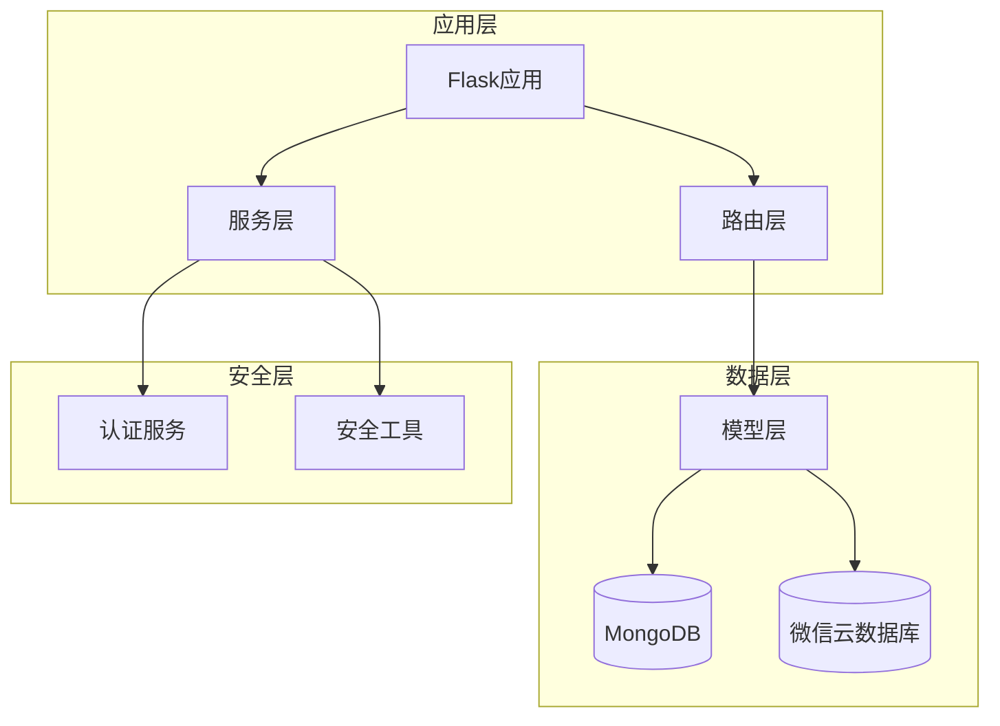

**图表来源**
- [app.py](file://app.py#L103-L276)
- [routes/customer.py](file://routes/customer.py#L1-L217)
- [models/customer.py](file://models/customer.py#L1-L300)

**章节来源**
- [app.py](file://app.py#L103-L276)
- [config.py](file://config.py#L22-L63)

## 核心组件

### 客户模型(CustomerModel)

客户模型是客户管理的核心数据抽象，负责客户信息的CRUD操作和业务逻辑处理。

**主要功能特性：**
- 统一身份识别：支持手机号、微信OpenID等多种标识方式
- 分组管理：支持客户分组和标签管理
- 状态管理：维护客户活跃状态和生命周期
- 多数据源支持：兼容本地MongoDB和微信云数据库

**数据模型设计：**
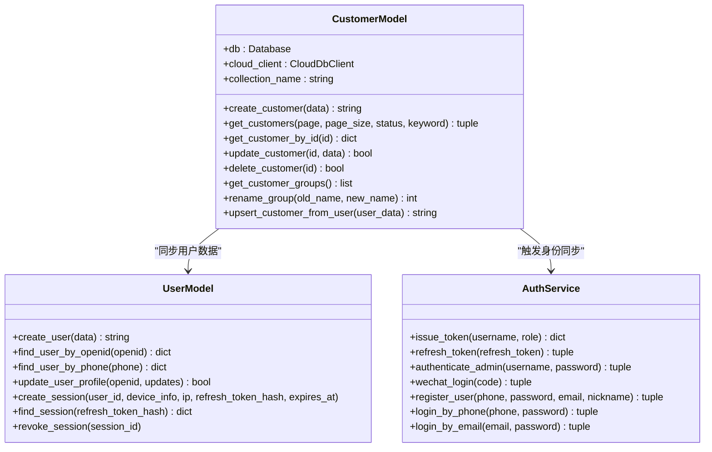

**图表来源**
- [models/customer.py](file://models/customer.py#L10-L300)
- [models/user.py](file://models/user.py#L10-L309)
- [services/auth_service.py](file://services/auth_service.py#L14-L416)

**章节来源**
- [models/customer.py](file://models/customer.py#L10-L300)
- [models/user.py](file://models/user.py#L10-L309)

### 认证与授权服务

系统实现了多层次的安全防护机制，包括JWT令牌管理、会话控制和权限验证。

**认证流程：**
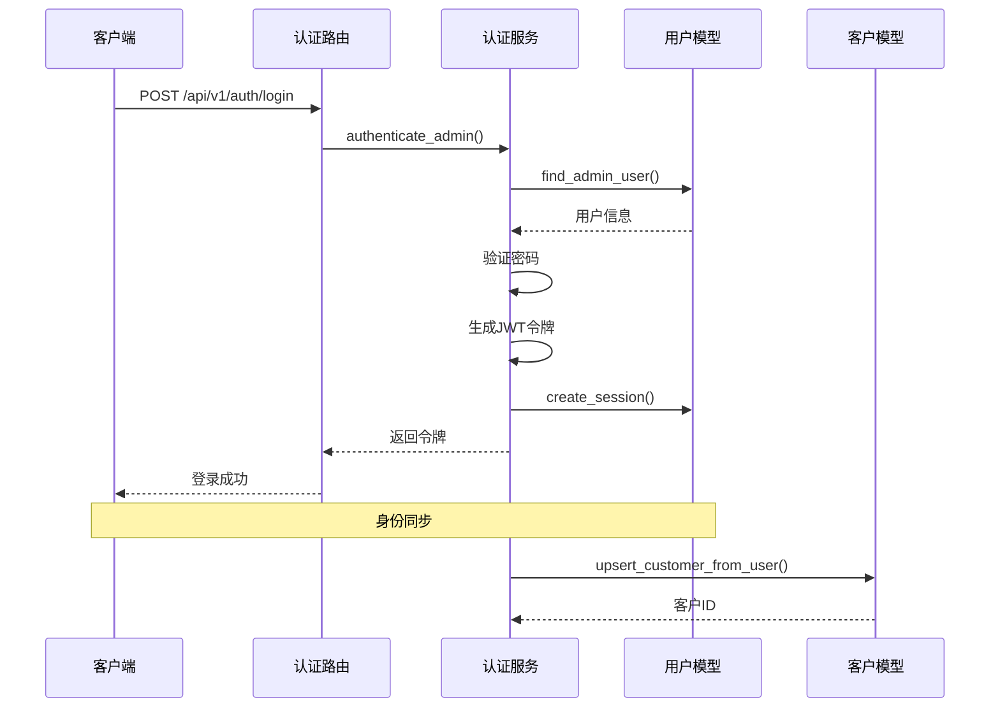

**图表来源**
- [routes/auth.py](file://routes/auth.py#L74-L96)
- [services/auth_service.py](file://services/auth_service.py#L196-L225)
- [models/user.py](file://models/user.py#L95-L147)
- [models/customer.py](file://models/customer.py#L66-L117)

**章节来源**
- [routes/auth.py](file://routes/auth.py#L33-L72)
- [services/auth_service.py](file://services/auth_service.py#L14-L416)

### 数据模型与关系映射

客户管理模块涉及多个核心数据模型，它们之间建立了清晰的关联关系：

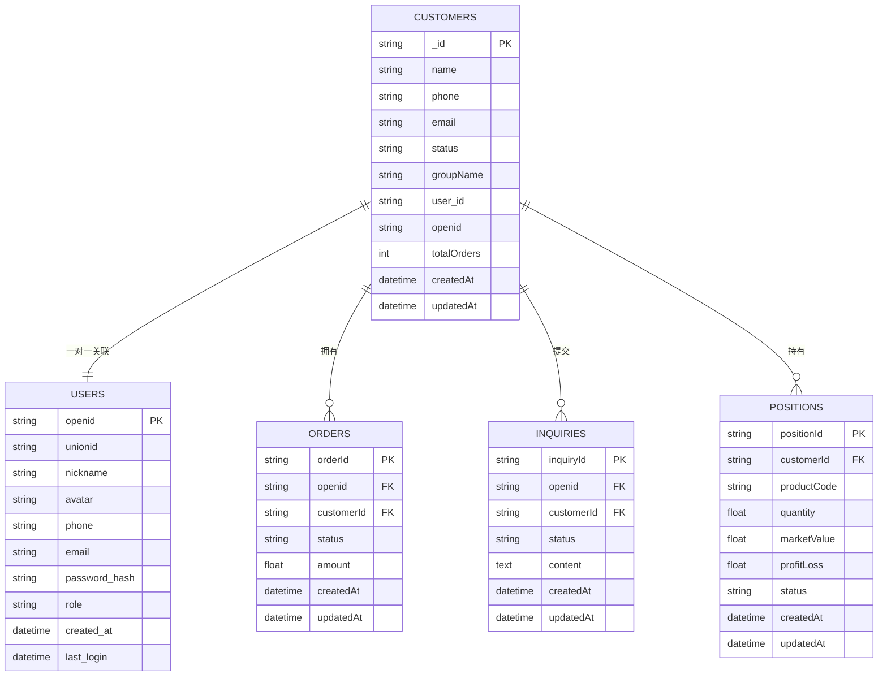

**图表来源**
- [models/customer.py](file://models/customer.py#L25-L36)
- [models/user.py](file://models/user.py#L199-L217)
- [models/order.py](file://models/order.py#L28-L53)
- [models/inquiry.py](file://models/inquiry.py#L32-L53)
- [models/position.py](file://models/position.py#L152-L170)

**章节来源**
- [models/customer.py](file://models/customer.py#L25-L36)
- [models/order.py](file://models/order.py#L28-L53)
- [models/inquiry.py](file://models/inquiry.py#L32-L53)
- [models/position.py](file://models/position.py#L152-L170)

## 架构概览

客户管理模块采用分层架构设计，确保了良好的可维护性和扩展性：

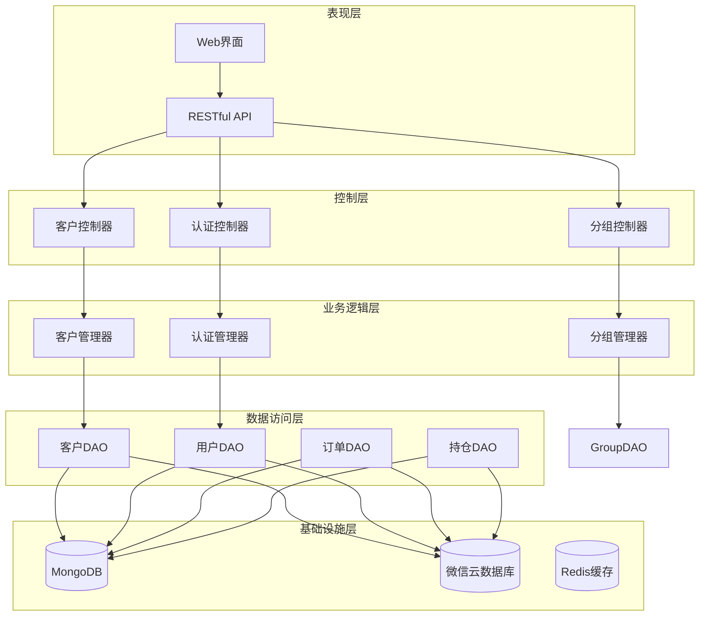

**图表来源**
- [app.py](file://app.py#L103-L210)
- [routes/customer.py](file://routes/customer.py#L15-L24)
- [routes/auth.py](file://routes/auth.py#L17-L17)

**章节来源**
- [app.py](file://app.py#L103-L210)
- [config.py](file://config.py#L27-L46)

## 详细组件分析

### 客户注册流程

客户注册是客户生命周期管理的第一步，系统支持多种注册方式：

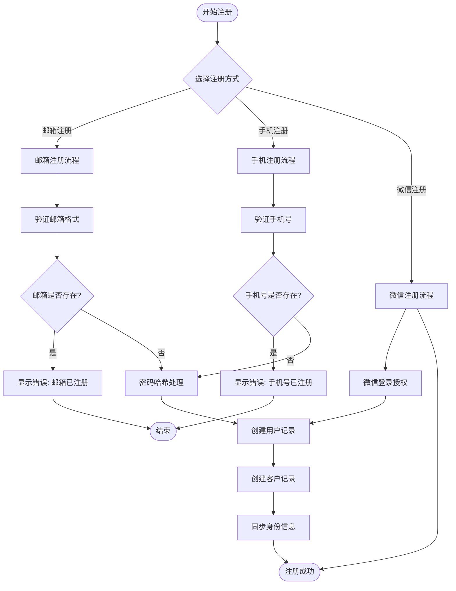

**图表来源**
- [services/auth_service.py](file://services/auth_service.py#L356-L391)
- [models/user.py](file://models/user.py#L199-L217)
- [models/customer.py](file://models/customer.py#L23-L64)

**章节来源**
- [services/auth_service.py](file://services/auth_service.py#L356-L391)
- [routes/auth.py](file://routes/auth.py#L247-L276)

### 客户信息更新机制

系统提供了灵活的客户信息更新机制，支持增量更新和批量更新：

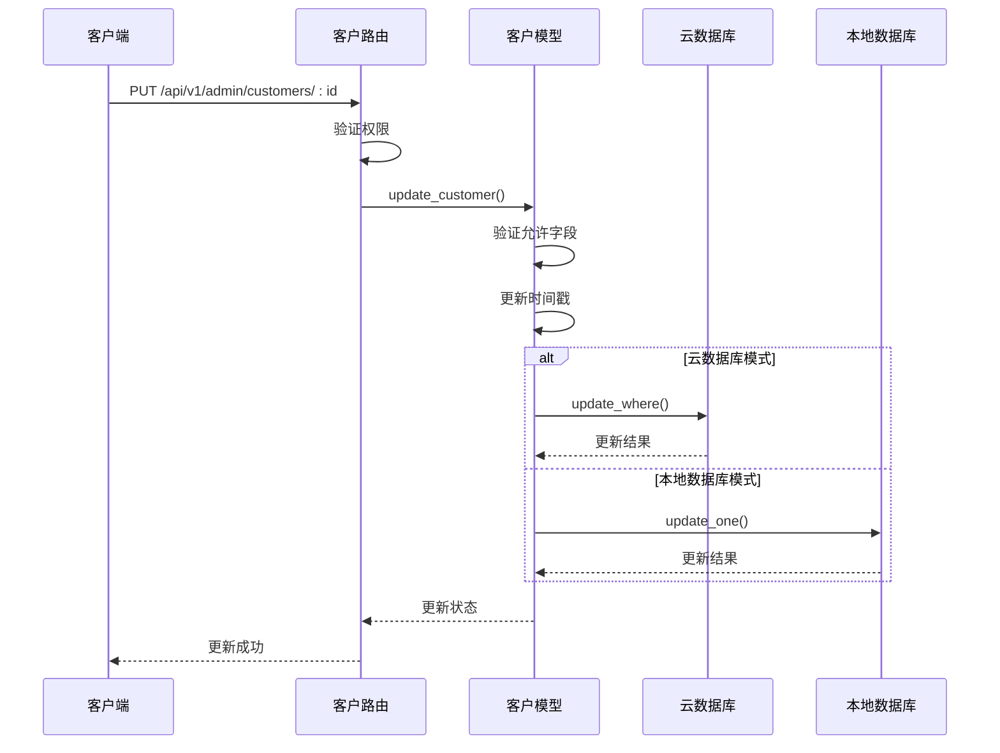

**图表来源**
- [routes/customer.py](file://routes/customer.py#L133-L152)
- [models/customer.py](file://models/customer.py#L219-L244)

**章节来源**
- [routes/customer.py](file://routes/customer.py#L133-L152)
- [models/customer.py](file://models/customer.py#L219-L244)

### 权限控制系统

系统实现了基于角色的访问控制(RBAC)，支持多层级权限管理：

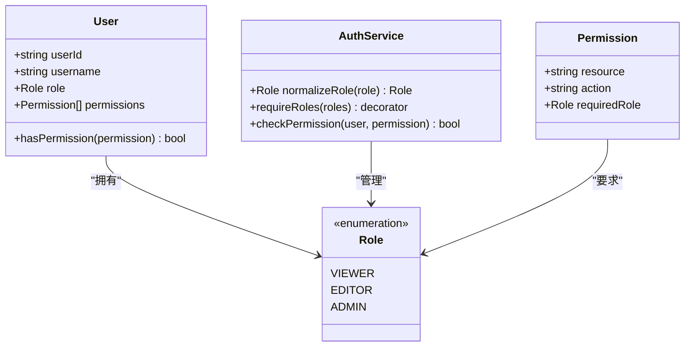

**图表来源**
- [services/auth_service.py](file://services/auth_service.py#L27-L31)
- [routes/auth.py](file://routes/auth.py#L56-L72)

**章节来源**
- [services/auth_service.py](file://services/auth_service.py#L27-L31)
- [routes/auth.py](file://routes/auth.py#L56-L72)

### 客户分组机制

系统支持灵活的客户分组管理，便于进行客户细分和营销活动：

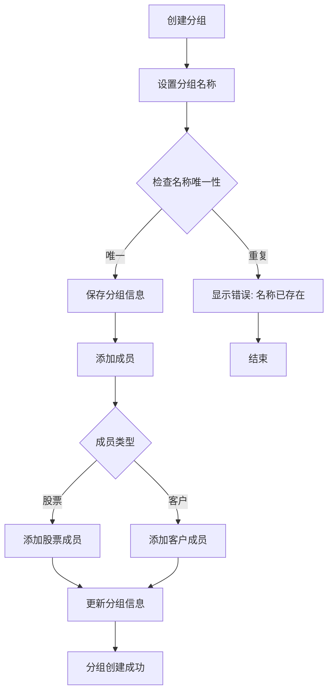

**图表来源**
- [models/group.py](file://models/group.py#L23-L50)
- [models/group.py](file://models/group.py#L192-L253)

**章节来源**
- [models/group.py](file://models/group.py#L23-L50)
- [routes/group.py](file://routes/group.py#L42-L66)

### 数据同步策略

系统支持多数据源之间的数据同步，确保数据一致性：

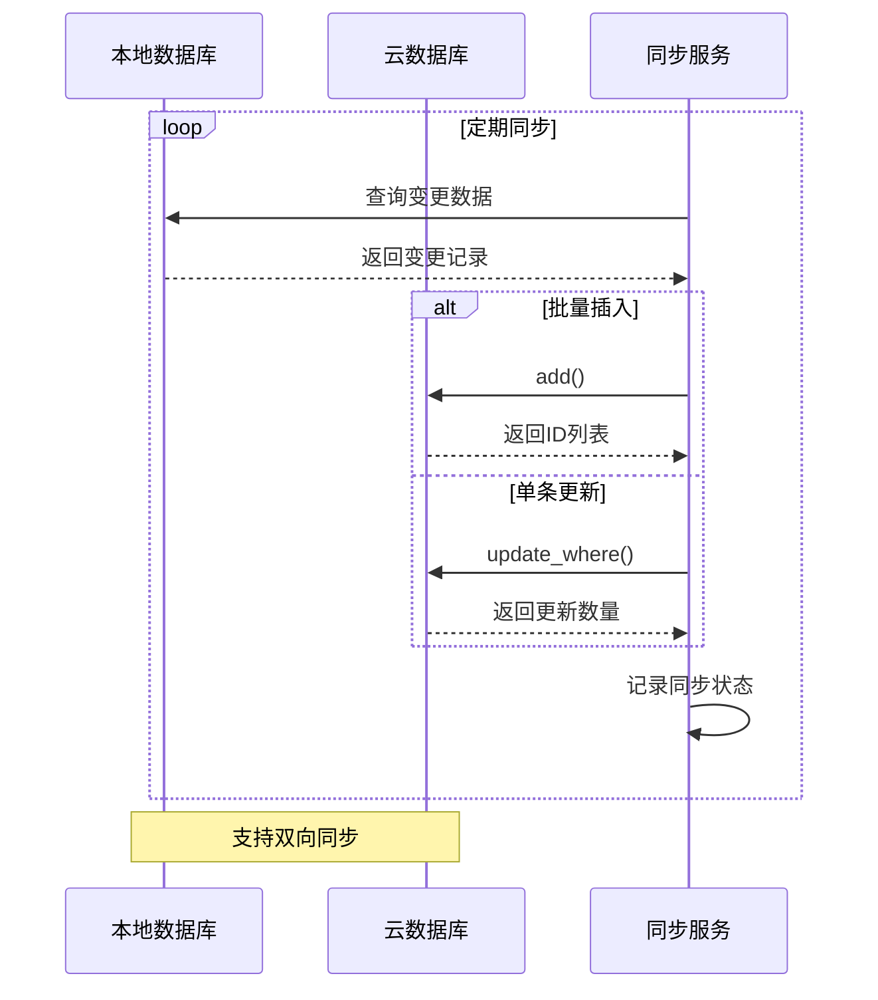

**图表来源**
- [services/cloud_db.py](file://services/cloud_db.py#L272-L283)
- [services/cloud_db.py](file://services/cloud_db.py#L285-L294)

**章节来源**
- [services/cloud_db.py](file://services/cloud_db.py#L272-L294)
- [app.py](file://app.py#L279-L330)

## 依赖关系分析

客户管理模块的依赖关系体现了清晰的分层架构：

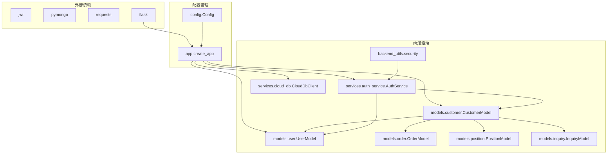

**图表来源**
- [app.py](file://app.py#L103-L114)
- [models/customer.py](file://models/customer.py#L11-L18)
- [services/auth_service.py](file://services/auth_service.py#L33-L43)

**章节来源**
- [app.py](file://app.py#L103-L114)
- [models/customer.py](file://models/customer.py#L11-L18)

## 性能考虑

### 数据库优化

系统针对客户管理场景进行了专门的性能优化：

**索引策略：**
- 客户集合：按`phone`、`createdAt`建立复合索引
- 用户集合：按`openid`、`phone`、`email`建立唯一索引
- 订单集合：按`openid`、`createdAt`建立索引
- 持仓集合：按`customerId`、`productCode`建立索引

**查询优化：**
- 使用投影查询减少数据传输
- 实现分页查询避免大数据集加载
- 缓存常用查询结果

### 缓存策略

系统采用多层缓存机制提升性能：

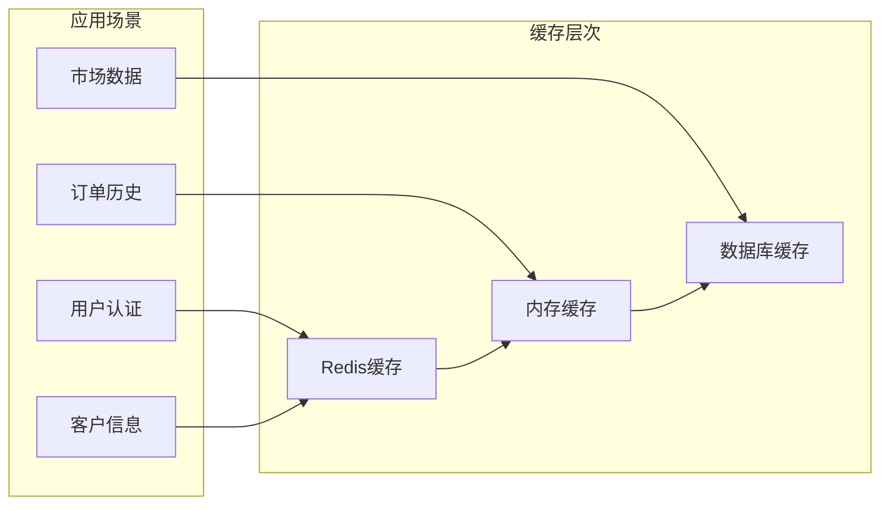

### 异步处理

对于耗时操作，系统采用异步处理机制：

- 文件上传和处理
- 大数据导出
- 邮件发送
- 数据同步

## 故障排除指南

### 常见问题诊断

**数据库连接问题：**
1. 检查MongoDB连接字符串配置
2. 验证数据库服务状态
3. 确认网络连通性
4. 查看连接超时设置

**认证失败问题：**
1. 验证JWT密钥配置
2. 检查令牌过期时间
3. 确认用户账户状态
4. 查看会话管理状态

**权限控制问题：**
1. 检查用户角色配置
2. 验证权限规则设置
3. 确认中间件配置
4. 查看审计日志

### 性能监控

系统提供了完善的监控和诊断功能：

**关键指标：**
- API响应时间
- 数据库查询性能
- 缓存命中率
- 内存使用情况
- 并发连接数

**诊断工具：**
- 日志分析工具
- 性能剖析器
- 数据库慢查询分析
- 网络延迟检测

**章节来源**
- [backend_utils/security.py](file://backend_utils/security.py#L17-L45)
- [app.py](file://app.py#L252-L274)

## 结论

客户管理模块是一个功能完整、架构清晰的客户关系管理系统。它通过统一的身份识别、灵活的权限控制和高效的数据管理，为场外期权交易系统提供了坚实的基础。

**主要优势：**
1. **统一身份管理**：支持多种登录方式，实现真正的统一身份识别
2. **灵活的权限控制**：基于角色的访问控制，支持细粒度权限管理
3. **多数据源支持**：兼容本地数据库和云数据库，具备良好的扩展性
4. **完善的生命周期管理**：从注册到注销的全流程客户管理
5. **强大的数据关联**：与订单、询价、持仓等业务数据深度集成

**未来改进方向：**
1. 增强数据分析能力，提供更丰富的客户洞察
2. 优化移动端用户体验
3. 扩展第三方系统集成能力
4. 加强数据安全和隐私保护
5. 提升系统的可观测性和可维护性

该模块为整个期权交易系统奠定了坚实的客户基础，是系统成功的关键组成部分。