# 报价服务模块

<cite>
**本文档引用的文件**
- [services/quote_service.py](file://services/quote_service.py)
- [services/risk_service.py](file://services/risk_service.py)
- [services/sina_crawler.py](file://services/sina_crawler.py)
- [sina_quotes.py](file://sina_quotes.py)
- [cloudfunctions/updateQuotes/index.js](file://cloudfunctions/updateQuotes/index.js)
- [services/stock_service.py](file://services/stock_service.py)
- [miniprogram/utils/option-pricing.js](file://miniprogram/utils/option-pricing.js)
- [miniprogram/pages/quotes/quotes.js](file://miniprogram/pages/quotes/quotes.js)
- [miniprogram/pages/quote/index.js](file://miniprogram/pages/quote/index.js)
</cite>

## 更新摘要
**变更内容**
- 更新了QuoteService的实现机制，从akshare批量处理重构为逐个调用模式
- 移除了复杂的批量获取和缓存优化逻辑
- 更新了StockService的模拟数据实现
- 调整了架构图以反映新的数据流

## 目录
1. [简介](#简介)
2. [项目结构](#项目结构)
3. [核心组件](#核心组件)
4. [架构概览](#架构概览)
5. [详细组件分析](#详细组件分析)
6. [依赖关系分析](#依赖关系分析)
7. [性能考虑](#性能考虑)
8. [故障排除指南](#故障排除指南)
9. [结论](#结论)
10. [附录](#附录)

## 简介

报价服务模块是场外期权交易系统的核心组成部分，负责实时行情获取、期权定价计算和报价数据管理。该模块实现了完整的期权定价算法，包括Black-Scholes模型、希腊字母计算和隐含波动率估算，同时提供了高效的数据抓取机制和实时推送功能。

**更新** 本模块已重构为使用StockService.get_stock_realtime_data()的逐个调用模式，移除了复杂的akshare批量处理逻辑，采用更简洁的实现方式。

本模块采用多层架构设计，结合Python后端服务、微信小程序前端和云函数实现，为用户提供实时的期权报价服务。系统支持多种期权结构（香草期权、雪球结构），提供灵活的参数配置和精确的数值计算。

## 项目结构

报价服务模块主要分布在以下目录中：

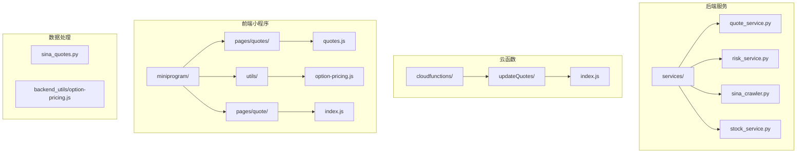

**图表来源**
- [services/quote_service.py](file://services/quote_service.py#L1-L91)
- [cloudfunctions/updateQuotes/index.js](file://cloudfunctions/updateQuotes/index.js#L1-L180)
- [miniprogram/utils/option-pricing.js](file://miniprogram/utils/option-pricing.js#L1-L347)

**章节来源**
- [services/quote_service.py](file://services/quote_service.py#L1-L91)
- [services/risk_service.py](file://services/risk_service.py#L1-L60)
- [services/sina_crawler.py](file://services/sina_crawler.py#L1-L43)

## 核心组件

### 行情服务组件

**更新** 行情服务组件已重构为使用StockService.get_stock_realtime_data()的逐个调用模式，移除了复杂的批量获取和缓存优化逻辑。

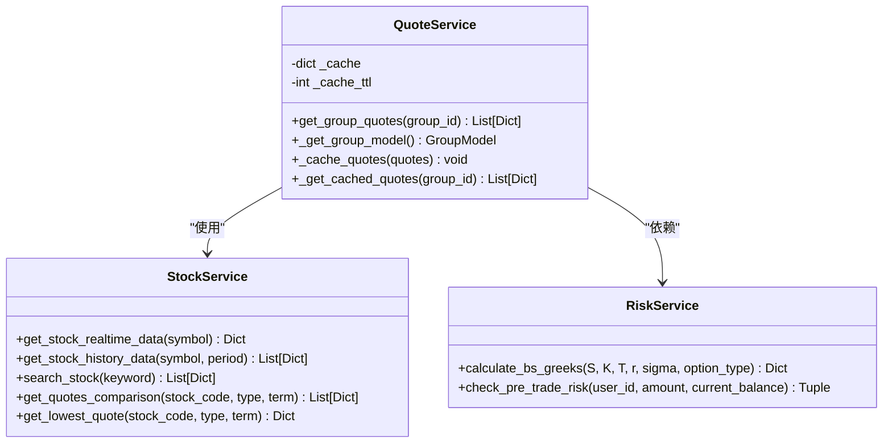

**图表来源**
- [services/quote_service.py](file://services/quote_service.py#L9-L91)
- [services/stock_service.py](file://services/stock_service.py#L17-L122)
- [services/risk_service.py](file://services/risk_service.py#L7-L60)

### 期权定价组件

期权定价组件实现了完整的Black-Scholes模型和希腊字母计算，支持多种期权结构的定价需求。

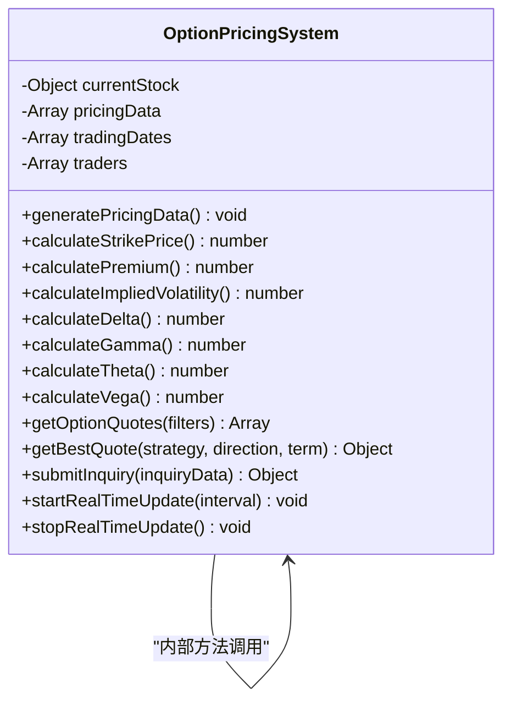

**图表来源**
- [miniprogram/utils/option-pricing.js](file://miniprogram/utils/option-pricing.js#L6-L347)

### 数据抓取组件

**更新** 数据抓取组件现在提供简化的股票行情获取机制，支持逐个股票数据获取。

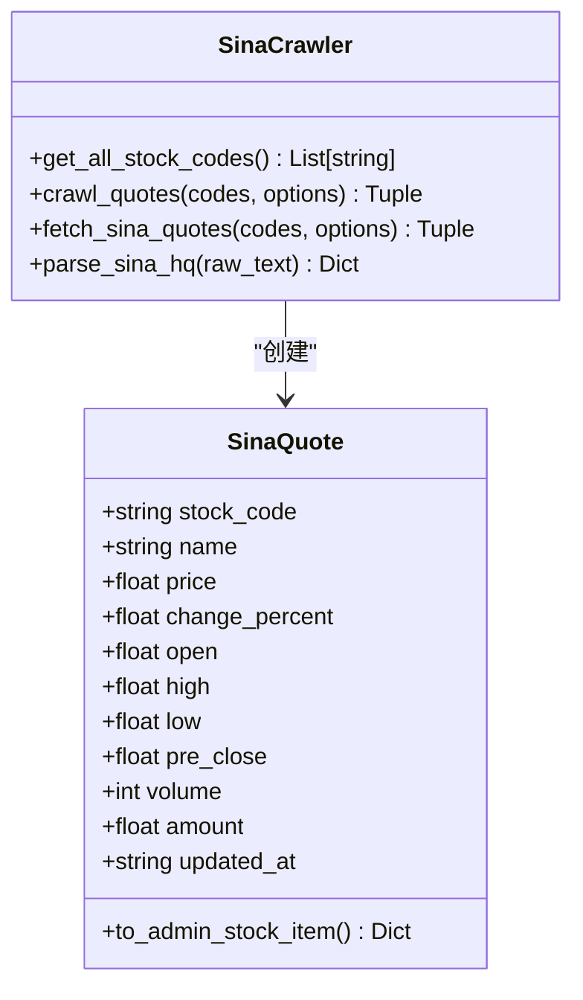

**图表来源**
- [sina_quotes.py](file://sina_quotes.py#L65-L153)
- [services/sina_crawler.py](file://services/sina_crawler.py#L22-L43)

**章节来源**
- [services/quote_service.py](file://services/quote_service.py#L28-L91)
- [services/stock_service.py](file://services/stock_service.py#L23-L122)
- [services/risk_service.py](file://services/risk_service.py#L11-L60)

## 架构概览

**更新** 报价服务模块采用简化的分层架构设计，实现了前后端分离和数据流分离：

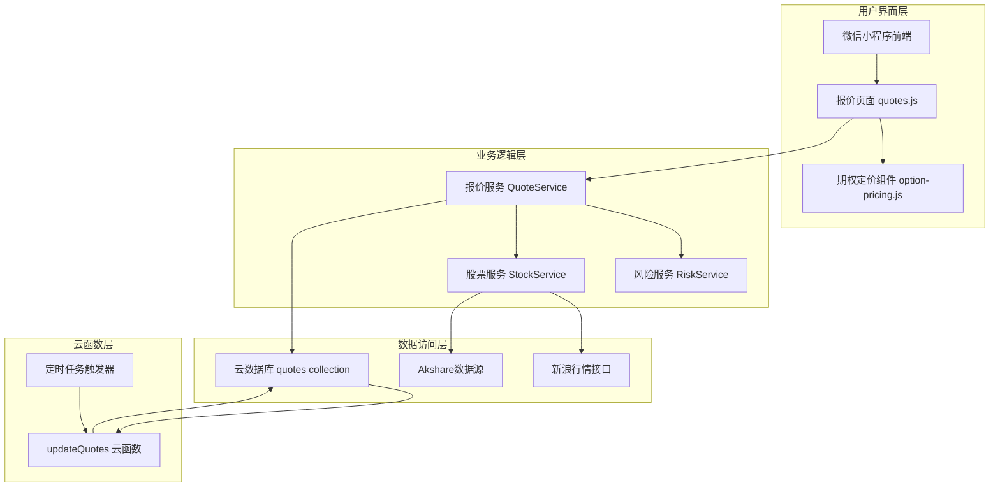

**图表来源**
- [miniprogram/pages/quotes/quotes.js](file://miniprogram/pages/quotes/quotes.js#L1-L800)
- [services/quote_service.py](file://services/quote_service.py#L1-L91)
- [cloudfunctions/updateQuotes/index.js](file://cloudfunctions/updateQuotes/index.js#L95-L180)

### 数据流处理

**更新** 系统采用简化的数据处理架构，每个股票单独获取数据：

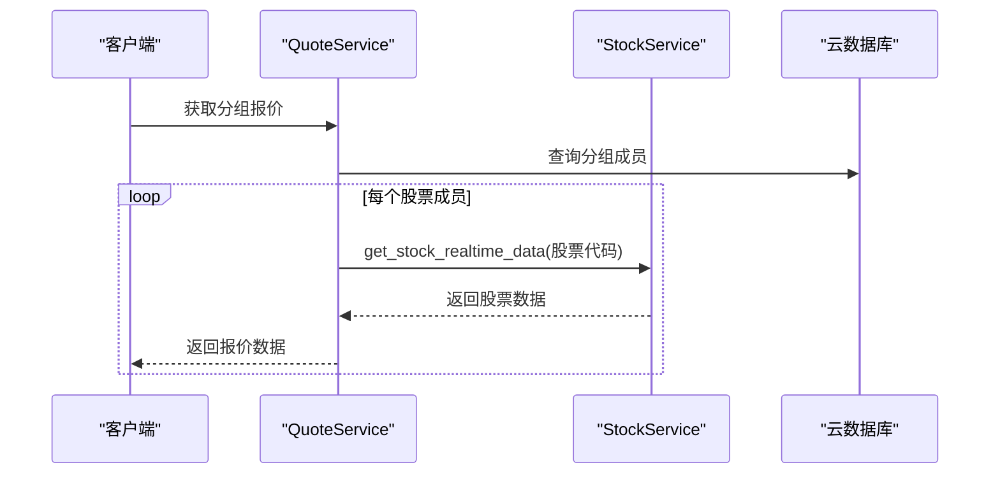

**图表来源**
- [services/quote_service.py](file://services/quote_service.py#L55-L90)

**章节来源**
- [cloudfunctions/updateQuotes/index.js](file://cloudfunctions/updateQuotes/index.js#L95-L180)

## 详细组件分析

### 行情获取与缓存机制

**更新** 报价服务的核心是简化的行情获取和缓存机制。系统通过逐个获取和智能缓存策略来优化性能：

#### 缓存策略实现

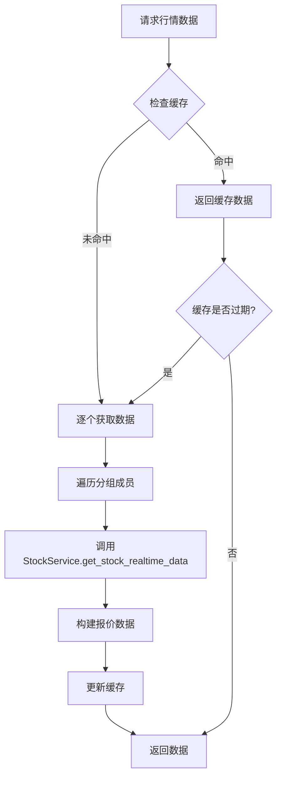

**图表来源**
- [services/quote_service.py](file://services/quote_service.py#L28-L90)

#### 简化获取优化

**更新** 系统采用逐个获取策略，避免复杂的批量处理：

1. **逐个获取所有A股数据**：使用StockService.get_stock_realtime_data()逐个获取
2. **本地构建报价**：在内存中构建完整的报价数据
3. **降级处理**：逐个获取失败时回退到错误处理

**章节来源**
- [services/quote_service.py](file://services/quote_service.py#L55-L90)

### Black-Scholes期权定价算法

风险服务模块实现了完整的Black-Scholes期权定价模型，支持希腊字母计算：

#### 期权定价计算流程

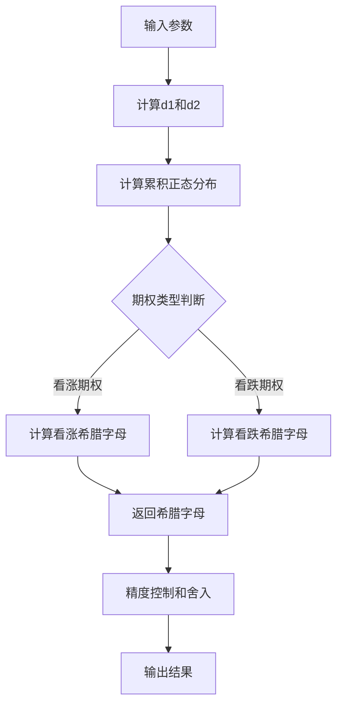

**图表来源**
- [services/risk_service.py](file://services/risk_service.py#L11-L50)

#### 希腊字母计算实现

系统支持以下希腊字母的计算：

| 希腊字母 | 物理含义 | 计算公式 | 精度控制 |
|---------|---------|---------|---------|
| Delta | 价格敏感性 | ∂V/∂S | 4位小数 |
| Gamma | Delta敏感性 | ∂²V/∂S² | 6位小数 |
| Theta | 时间衰减 | ∂V/∂t | 4位小数 |
| Vega | 波动率敏感性 | ∂V/∂σ | 4位小数 |
| Rho | 利率敏感性 | ∂V/∂r | 4位小数 |

**章节来源**
- [services/risk_service.py](file://services/risk_service.py#L11-L50)

### 实时行情更新机制

**更新** 云函数实现了定时批量更新机制，确保报价数据的实时性和准确性：

#### 批量更新流程

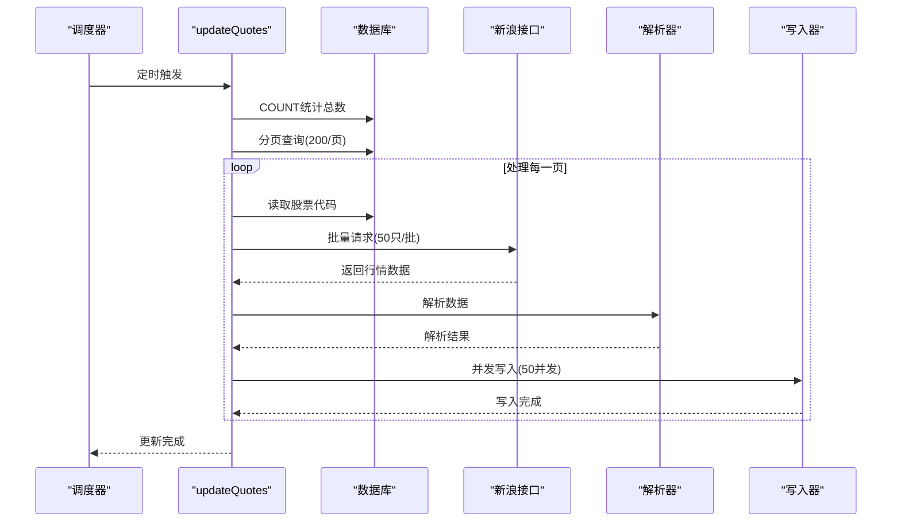

**图表来源**
- [cloudfunctions/updateQuotes/index.js](file://cloudfunctions/updateQuotes/index.js#L101-L164)

#### 性能优化策略

1. **分页处理**：避免一次性加载所有数据导致内存溢出
2. **并发写入**：使用并发池提高写入效率
3. **批量请求**：减少网络请求次数
4. **超时控制**：设置8秒超时防止请求挂起

**章节来源**
- [cloudfunctions/updateQuotes/index.js](file://cloudfunctions/updateQuotes/index.js#L101-L164)

### 前端展示与实时推送

小程序前端实现了完整的报价展示和实时更新功能：

#### 报价页面数据流

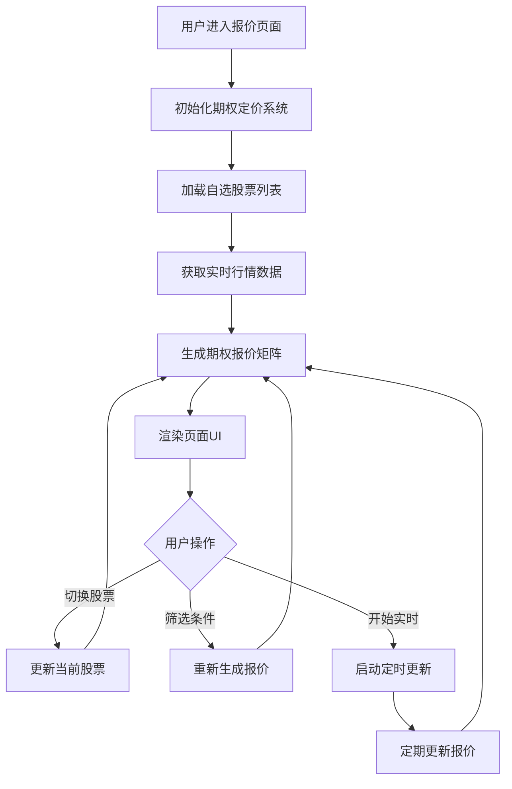

**图表来源**
- [miniprogram/pages/quotes/quotes.js](file://miniprogram/pages/quotes/quotes.js#L168-L220)

#### 实时更新机制

前端采用了多层次的实时更新策略：

1. **定时更新**：每3秒更新一次整体报价
2. **单点更新**：每1秒更新一个随机报价
3. **回调机制**：通过回调函数通知UI更新

**章节来源**
- [miniprogram/pages/quotes/quotes.js](file://miniprogram/pages/quotes/quotes.js#L168-L220)
- [miniprogram/utils/option-pricing.js](file://miniprogram/utils/option-pricing.js#L280-L333)

## 依赖关系分析

**更新** 报价服务模块的依赖关系呈现简化的层次结构：

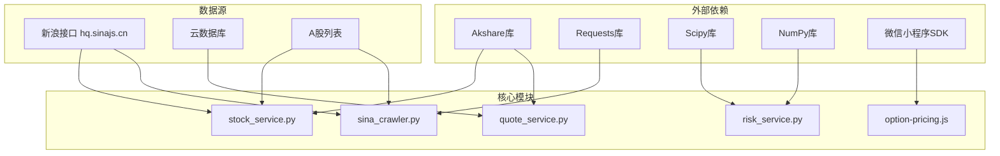

**图表来源**
- [services/quote_service.py](file://services/quote_service.py#L1-L7)
- [services/risk_service.py](file://services/risk_service.py#L1-L3)
- [services/sina_crawler.py](file://services/sina_crawler.py#L1-L5)

### 关键依赖特性

1. **Akshare库**：提供A股行情数据获取能力（云托管环境已移除）
2. **Scipy库**：提供统计分布函数支持
3. **Requests库**：提供HTTP请求功能
4. **微信小程序SDK**：提供云开发和实时通信能力

**章节来源**
- [services/quote_service.py](file://services/quote_service.py#L1-L7)
- [services/risk_service.py](file://services/risk_service.py#L1-L3)

## 性能考虑

### 缓存策略优化

**更新** 系统采用了简化的缓存策略来提升性能：

1. **内存缓存**：QuoteService内部缓存，60秒TTL
2. **逐个获取**：避免复杂的批量处理逻辑
3. **智能降级**：缓存失效时的快速回退机制

### 并发处理优化

**更新** 系统采用了简化的并发处理策略：

1. **顺序处理**：逐个获取股票数据，避免并发问题
2. **缓存复用**：利用内存缓存减少重复请求
3. **异常处理**：每个股票获取都有独立的错误处理

### 网络请求优化

**更新** 系统采用了简化的网络请求策略：

1. **逐个请求**：每个股票单独请求，避免批量请求复杂性
2. **超时控制**：每个请求都有独立的超时控制
3. **重试机制**：最多3次重试

## 故障排除指南

### 常见问题及解决方案

#### 行情获取失败

**问题现象**：报价数据为空或获取失败

**可能原因**：
1. 网络连接异常
2. StockService.get_stock_realtime_data()返回None
3. 股票代码格式错误

**解决步骤**：
1. 检查网络连接状态
2. 验证股票代码格式
3. 查看日志错误信息
4. 使用降级方案逐个获取

#### 定时更新异常

**问题现象**：报价长时间不更新

**可能原因**：
1. 云函数触发器配置错误
2. 数据库连接异常
3. 超时设置不当

**解决步骤**：
1. 检查云函数配置
2. 验证数据库权限
3. 调整超时参数
4. 查看执行日志

#### 前端显示异常

**问题现象**：报价页面显示异常或更新缓慢

**可能原因**：
1. JavaScript执行超时
2. 内存泄漏
3. 网络请求阻塞

**解决步骤**：
1. 检查JavaScript语法
2. 监控内存使用情况
3. 优化数据处理逻辑
4. 实现错误边界处理

**章节来源**
- [services/quote_service.py](file://services/quote_service.py#L80-L90)
- [cloudfunctions/updateQuotes/index.js](file://cloudfunctions/updateQuotes/index.js#L133-L136)

## 结论

**更新** 报价服务模块通过简化的架构设计和优化策略，实现了高性能、高可用的期权报价服务。系统具备以下特点：

1. **简化的数据获取**：采用逐个获取策略，避免复杂的批量处理逻辑
2. **准确的定价计算**：实现完整的Black-Scholes模型和希腊字母计算
3. **实时的数据更新**：通过云函数实现定时批量更新
4. **丰富的前端展示**：提供直观的报价矩阵和实时更新功能
5. **完善的错误处理**：具备完整的异常处理和降级机制

该模块为场外期权交易提供了坚实的技术基础，能够满足高频交易和实时报价的需求。

## 附录

### 配置参数说明

| 参数名称 | 类型 | 默认值 | 说明 |
|---------|------|--------|------|
| cache_ttl | int | 60秒 | 缓存有效期 |
| timeout | float | 8.0秒 | 网络请求超时 |
| retries | int | 3次 | 请求重试次数 |
| chunk_size | int | 50只 | 批量请求大小 |
| max_workers | int | 16线程 | 最大并发线程数 |
| page_size | int | 200条 | 分页大小 |
| write_concurrency | int | 50并发 | 写入并发数 |

### API接口定义

#### 行情获取接口
- **URL**: `/api/quotes/group/:group_id`
- **方法**: GET
- **参数**: group_id (路径参数)
- **返回**: 股票报价数组

#### 期权定价接口
- **URL**: `/api/pricing/quotes`
- **方法**: POST
- **参数**: 期权参数对象
- **返回**: 期权报价数组

### 数据存储结构

#### 股票报价数据结构
```json
{
  "code": "string",
  "name": "string", 
  "price": "number",
  "change_percent": "number",
  "volume": "integer",
  "amount": "number",
  "open": "number",
  "high": "number",
  "low": "number",
  "pre_close": "number",
  "market": "string",
  "updated_at": "timestamp"
}
```

#### 期权报价数据结构
```json
{
  "strategy": "string",
  "direction": "string",
  "term": "string",
  "strike_price": "number",
  "premium": "number",
  "implied_volatility": "number",
  "delta": "number",
  "gamma": "number",
  "theta": "number",
  "vega": "number",
  "trader": "object",
  "timestamp": "timestamp"
}
```