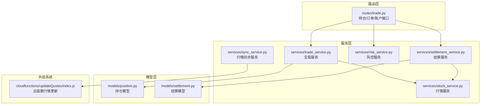
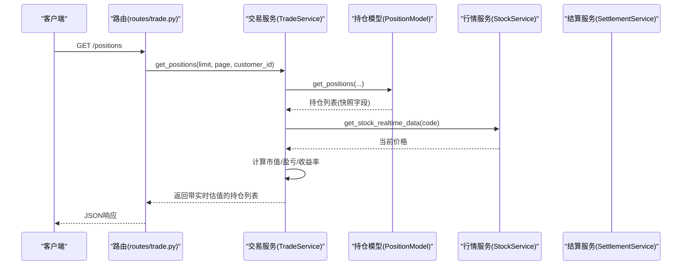
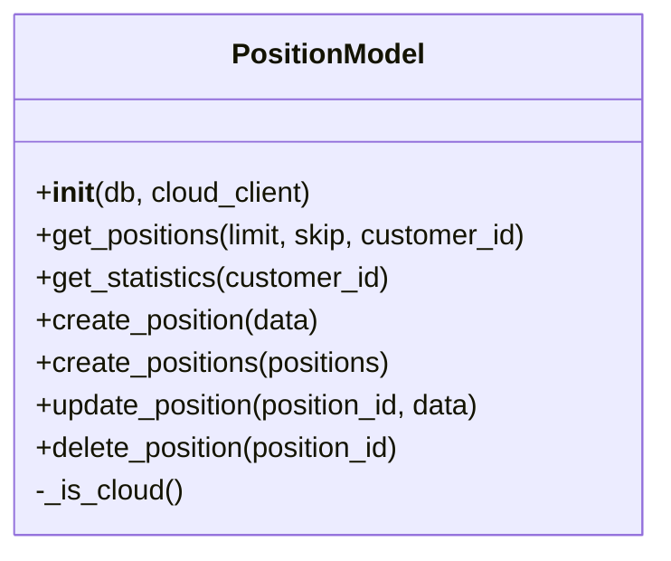
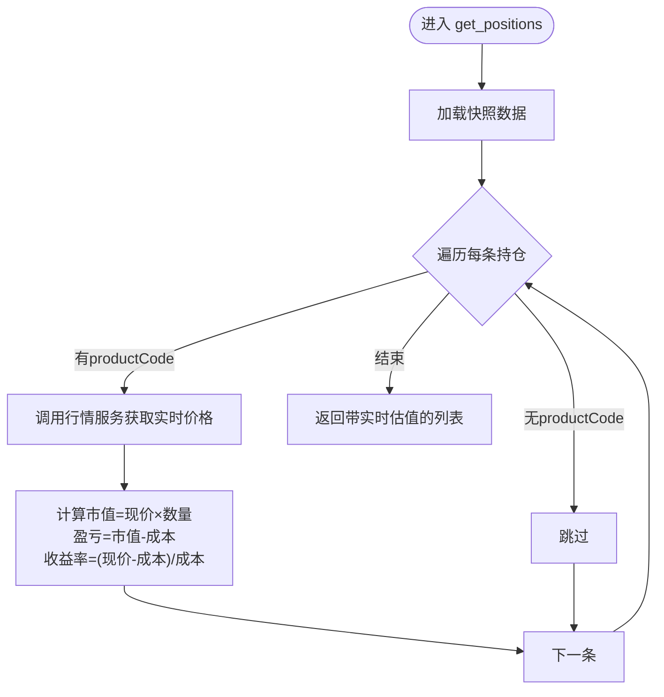
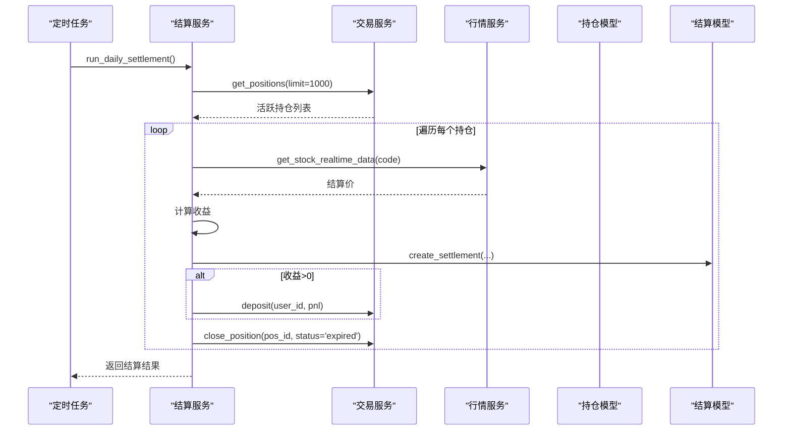
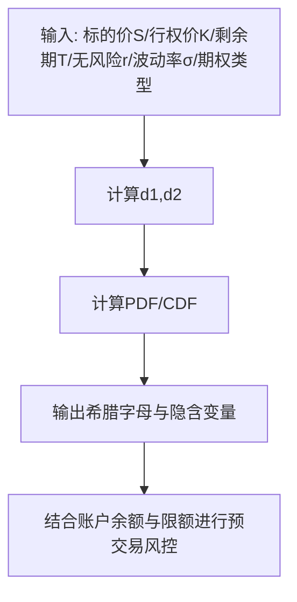
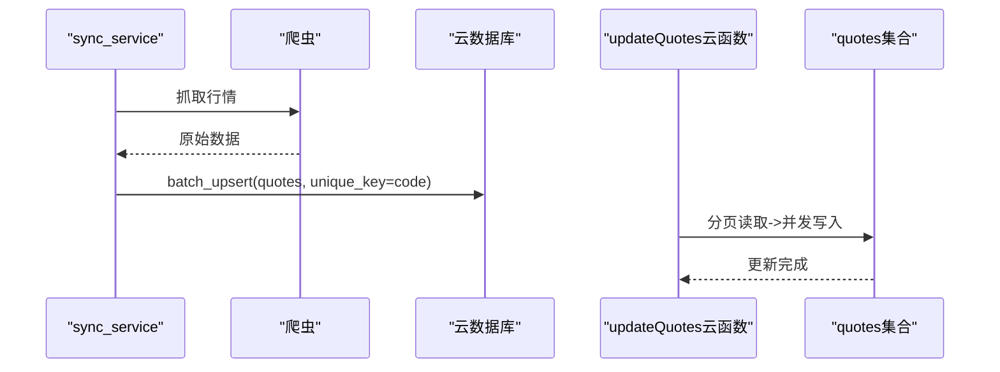
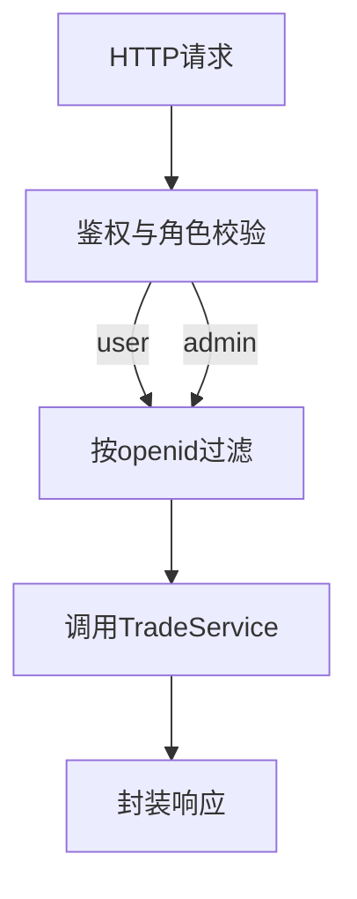
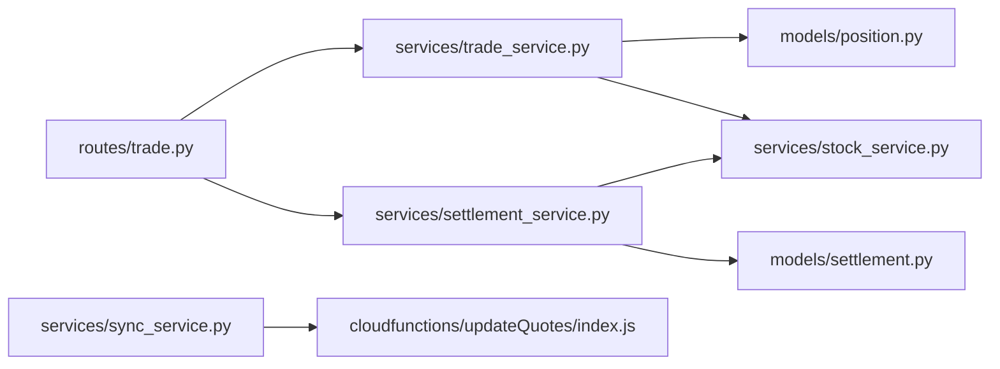

# 持仓管理模块

<cite>
**本文档引用的文件**
- [models/position.py](file://models/position.py)
- [services/trade_service.py](file://services/trade_service.py)
- [routes/trade.py](file://routes/trade.py)
- [services/stock_service.py](file://services/stock_service.py)
- [services/settlement_service.py](file://services/settlement_service.py)
- [models/settlement.py](file://models/settlement.py)
- [services/risk_service.py](file://services/risk_service.py)
- [services/sync_service.py](file://services/sync_service.py)
- [cloudfunctions/updateQuotes/index.js](file://cloudfunctions/updateQuotes/index.js)
</cite>

## 目录
1. [引言](#引言)
2. [项目结构](#项目结构)
3. [核心组件](#核心组件)
4. [架构总览](#架构总览)
5. [详细组件分析](#详细组件分析)
6. [依赖关系分析](#依赖关系分析)
7. [性能考虑](#性能考虑)
8. [故障排除指南](#故障排除指南)
9. [结论](#结论)

## 引言
本文件面向“场外期权”系统的持仓管理模块，系统性阐述持仓数据模型设计、实时估值与盈亏计算、与市场行情的联动机制、增删改查与批量处理、数据同步策略、统计分析与风险度量、组合优化思路、冻结/解冻与强制平仓的业务逻辑、历史追踪与财务报表生成、性能优化与并发控制，以及与资金管理、风控系统的集成方式。文档以代码为依据，辅以可视化图表帮助读者快速建立整体认知。

## 项目结构
围绕持仓管理的关键代码分布在以下层次：
- 路由层：定义对外接口，负责鉴权、参数校验与响应封装
- 服务层：编排业务流程，协调模型与外部服务
- 模型层：抽象持久化与聚合统计
- 外部服务：行情抓取、结算、风控等

**图表来源**
- [routes/trade.py](file://routes/trade.py#L1-L330)
- [services/trade_service.py](file://services/trade_service.py#L1-L318)
- [services/stock_service.py](file://services/stock_service.py#L1-L289)
- [services/settlement_service.py](file://services/settlement_service.py#L1-L113)
- [models/position.py](file://models/position.py#L1-L206)
- [models/settlement.py](file://models/settlement.py#L1-L57)
- [services/sync_service.py](file://services/sync_service.py#L1-L596)
- [cloudfunctions/updateQuotes/index.js](file://cloudfunctions/updateQuotes/index.js#L1-L180)

**章节来源**
- [routes/trade.py](file://routes/trade.py#L1-L330)
- [services/trade_service.py](file://services/trade_service.py#L1-L318)
- [models/position.py](file://models/position.py#L1-L206)

## 核心组件
- 持仓模型(PositionModel)：提供持仓的增删改查、统计聚合、分页查询；兼容本地Mongo与云开发客户端
- 交易服务(TradeService)：编排持仓生命周期，动态注入实时行情、计算市值与盈亏、账户资产汇总
- 行情服务(StockService)：提供实时/历史行情获取与报价比较
- 结算服务(SettlementService)：每日到期结算、资金划转、状态更新
- 风控服务(RiskService)：BS希腊字母计算、交易前风控校验
- 行情同步服务(sync_service)：爬虫抓取、批量入库、分片与并发控制
- 云函数(updateQuotes)：定时批量更新quotes集合，带并发池与超时保护

**章节来源**
- [models/position.py](file://models/position.py#L10-L206)
- [services/trade_service.py](file://services/trade_service.py#L8-L318)
- [services/stock_service.py](file://services/stock_service.py#L17-L289)
- [services/settlement_service.py](file://services/settlement_service.py#L10-L113)
- [services/risk_service.py](file://services/risk_service.py#L7-L60)
- [services/sync_service.py](file://services/sync_service.py#L72-L596)
- [cloudfunctions/updateQuotes/index.js](file://cloudfunctions/updateQuotes/index.js#L1-L180)

## 架构总览
持仓管理采用“路由-服务-模型-外部系统”的分层架构，核心流程如下：
- 路由接收请求，鉴权后调用服务层
- 服务层根据需要访问模型层与外部服务（行情、结算、风控）
- 模型层负责数据持久化与聚合统计
- 外部系统提供实时行情与定时任务

**图表来源**
- [routes/trade.py](file://routes/trade.py#L67-L98)
- [services/trade_service.py](file://services/trade_service.py#L125-L164)
- [models/position.py](file://models/position.py#L28-L63)
- [services/stock_service.py](file://services/stock_service.py#L24-L88)

## 详细组件分析

### 持仓数据模型(PositionModel)
- 设计要点
  - 统一字段：customerId、productCode、quantity、price、status、currency、market、createdAt、updatedAt
  - 快照字段：marketValue、profitLoss、returnRate用于离线展示
  - 实时字段：currentPrice在查询时动态注入
- 支持能力
  - 分页查询与总数统计
  - 创建单个/批量持仓，自动填充时间戳与默认值
  - 更新与删除，支持云开发与本地Mongo
  - 统计聚合：活跃持仓的总市值、总盈亏、数量
- 云/本地适配
  - 通过_cloud_client判断运行环境，使用对应查询/更新语法
  - 云开发客户端对复杂聚合有限制，统计采用“拉取上限条目再聚合”的折衷方案

**图表来源**
- [models/position.py](file://models/position.py#L10-L206)

**章节来源**
- [models/position.py](file://models/position.py#L10-L206)

### 交易服务(TradeService)与实时估值
- 生命周期编排
  - 创建：校验必填字段，计算初始marketValue与profitLoss
  - 查询：拉取快照数据后，逐条注入currentPrice并计算实时市值、盈亏与收益率
  - 更新：对数量/价格变更进行类型转换，实时MV由查询时动态计算
  - 删除：删除指定持仓
- 资产汇总
  - 账户总资产 = 余额 + 持仓市值总和
  - 总浮动盈亏 = 所有持仓盈亏之和
- 与路由集成
  - 提供分页、权限过滤、统计接口

**图表来源**
- [services/trade_service.py](file://services/trade_service.py#L125-L164)
- [services/stock_service.py](file://services/stock_service.py#L24-L88)

**章节来源**
- [services/trade_service.py](file://services/trade_service.py#L113-L205)

### 结算服务(SettlementService)与强制平仓
- 日常结算
  - 扫描活跃持仓，检查到期日
  - 获取标的实时价格作为结算价
  - 计算期权收益并记入结算记录
  - 若收益为正则向用户入账
  - 状态更新（注释中提示可通过交易服务关闭仓位）
- 强制平仓
  - 当前实现聚焦到期结算；若需引入强平，可在风控阈触发时调用交易服务的仓位关闭接口

**图表来源**
- [services/settlement_service.py](file://services/settlement_service.py#L21-L113)
- [services/trade_service.py](file://services/trade_service.py#L113-L205)
- [models/settlement.py](file://models/settlement.py#L18-L41)

**章节来源**
- [services/settlement_service.py](file://services/settlement_service.py#L10-L113)
- [models/settlement.py](file://models/settlement.py#L5-L57)

### 风控服务(RiskService)与组合优化
- 希腊字母计算：基于Black-Scholes模型计算Delta/Gamma/Theta/Vega/Rho
- 交易前风控：余额校验、限额校验（可扩展日累计/持仓限额）

**图表来源**
- [services/risk_service.py](file://services/risk_service.py#L11-L60)

**章节来源**
- [services/risk_service.py](file://services/risk_service.py#L7-L60)

### 行情同步与实时联动
- 爬虫与批量入库
  - 并行抓取、分片处理、批量Upsert，支持分片索引与并发上限
  - 失败重试、进度回调、错误统计
- 云函数定时更新
  - 分页流式处理、并发写库、超时保护
- 实时联动
  - 查询时按productCode调用行情服务，注入currentPrice并计算实时指标

**图表来源**
- [services/sync_service.py](file://services/sync_service.py#L72-L238)
- [cloudfunctions/updateQuotes/index.js](file://cloudfunctions/updateQuotes/index.js#L95-L179)

**章节来源**
- [services/sync_service.py](file://services/sync_service.py#L72-L596)
- [cloudfunctions/updateQuotes/index.js](file://cloudfunctions/updateQuotes/index.js#L1-L180)

### 路由与权限控制
- 持仓接口：分页查询、创建、更新、删除、统计、种子数据
- 账户接口：资产汇总、充值、提现、资金流水
- 权限：用户仅可见自身，管理员可跨客户过滤

**图表来源**
- [routes/trade.py](file://routes/trade.py#L67-L186)

**章节来源**
- [routes/trade.py](file://routes/trade.py#L1-L330)

## 依赖关系分析
- 路由依赖服务层，服务层依赖模型层与外部服务
- 持仓模型同时兼容云开发与本地Mongo，降低部署耦合
- 结算服务依赖交易服务与行情服务，形成闭环
- 行情同步服务与云函数共同保障quotes集合的实时性

**图表来源**
- [routes/trade.py](file://routes/trade.py#L1-L330)
- [services/trade_service.py](file://services/trade_service.py#L1-L318)
- [models/position.py](file://models/position.py#L1-L206)
- [services/settlement_service.py](file://services/settlement_service.py#L1-L113)
- [models/settlement.py](file://models/settlement.py#L1-L57)
- [services/sync_service.py](file://services/sync_service.py#L1-L596)
- [cloudfunctions/updateQuotes/index.js](file://cloudfunctions/updateQuotes/index.js#L1-L180)

**章节来源**
- [routes/trade.py](file://routes/trade.py#L1-L330)
- [services/trade_service.py](file://services/trade_service.py#L1-L318)
- [models/position.py](file://models/position.py#L1-L206)

## 性能考虑
- 查询性能
  - 持仓查询使用索引(customerId/productCode)，减少扫描
  - 云开发统计采用“拉取上限条目再聚合”，避免复杂聚合的性能瓶颈
- 实时估值
  - 查询时逐条调用行情服务，建议前端做批量去重与缓存
- 行情同步
  - 分页流式处理、并发写入、分片与重试，避免一次性写满导致超时
  - 云函数设置超时保护，避免长时间阻塞
- 并发控制
  - sync_service使用线程池与批量Upsert，云函数使用并发池
  - updateQuotes云函数通过withConcurrency限制并发，避免数据库压力过大

**章节来源**
- [models/position.py](file://models/position.py#L18-L21)
- [services/sync_service.py](file://services/sync_service.py#L132-L163)
- [cloudfunctions/updateQuotes/index.js](file://cloudfunctions/updateQuotes/index.js#L20-L30)

## 故障排除指南
- 云数据库异常
  - 集合不存在：创建对应集合或检查初始化脚本
  - 请求错误：检查网络、超时与配额限制
- 行情获取失败
  - 网络异常：重试与降级（返回空值），记录日志
  - 数据格式异常：捕获异常并跳过无效项
- 结算失败
  - 标的价格不可用：记录错误并跳过该笔结算
  - 资金入账失败：重试或人工干预
- 权限问题
  - 用户只能查看自身数据，管理员可跨客户过滤

**章节来源**
- [models/position.py](file://models/position.py#L38-L54)
- [services/stock_service.py](file://services/stock_service.py#L80-L88)
- [services/settlement_service.py](file://services/settlement_service.py#L74-L77)

## 结论
本模块以清晰的分层架构实现了持仓的全生命周期管理：从数据模型、实时估值、统计分析到结算与风控闭环，配合高性能的行情同步与并发控制，满足场外期权场景下的业务需求。后续可在强平机制、组合优化、冻结/解冻等方面进一步增强，以提升系统弹性与用户体验。