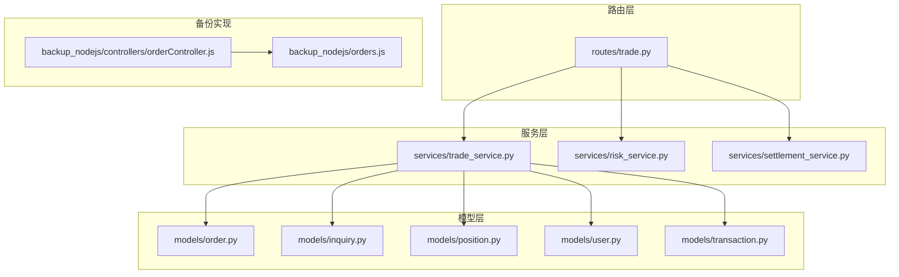
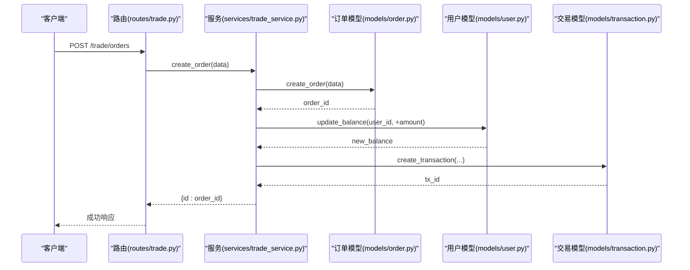
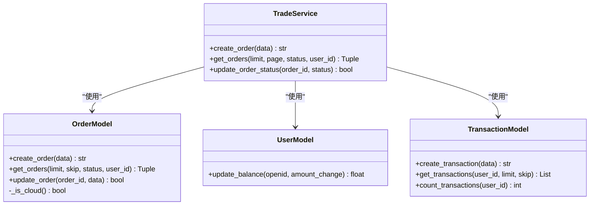
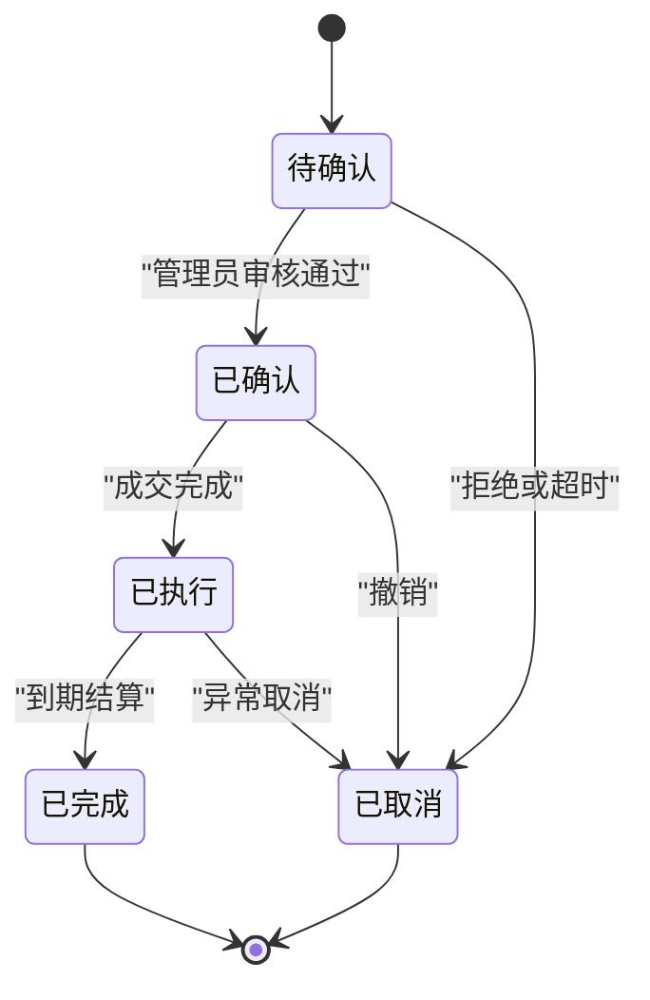
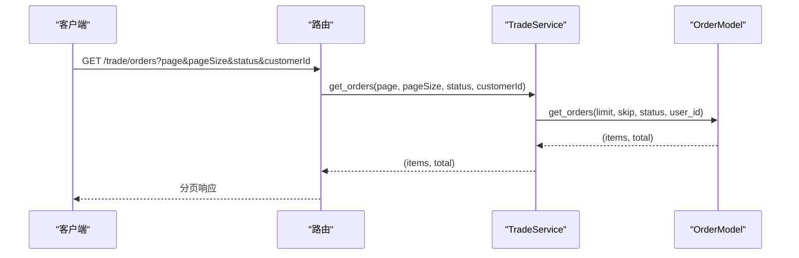
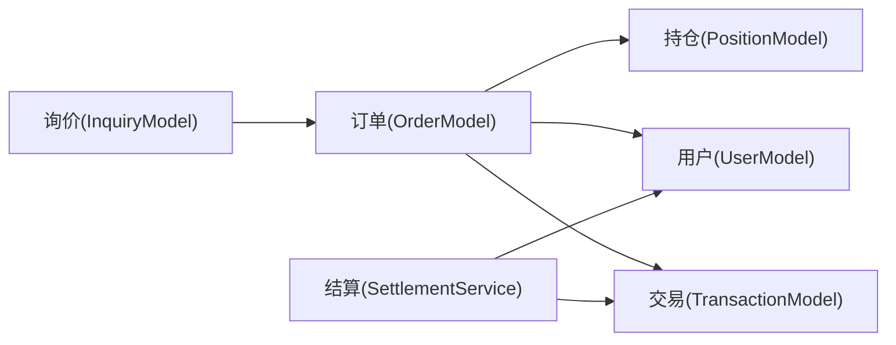
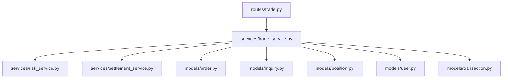

# 订单处理模块

<cite>
**本文档引用的文件**
- [models/order.py](file://models/order.py)
- [routes/trade.py](file://routes/trade.py)
- [services/trade_service.py](file://services/trade_service.py)
- [services/risk_service.py](file://services/risk_service.py)
- [services/settlement_service.py](file://services/settlement_service.py)
- [models/inquiry.py](file://models/inquiry.py)
- [models/position.py](file://models/position.py)
- [models/user.py](file://models/user.py)
- [models/transaction.py](file://models/transaction.py)
- [backup_nodejs/controllers/orderController.js](file://backup_nodejs/controllers/orderController.js)
- [backup_nodejs/orders.js](file://backup_nodejs/orders.js)
</cite>

## 目录
1. [简介](#简介)
2. [项目结构](#项目结构)
3. [核心组件](#核心组件)
4. [架构概览](#架构概览)
5. [详细组件分析](#详细组件分析)
6. [依赖关系分析](#依赖关系分析)
7. [性能考虑](#性能考虑)
8. [故障排除指南](#故障排除指南)
9. [结论](#结论)

## 简介
本文件为场外期权项目中的订单处理模块提供全面的技术文档。内容涵盖订单生命周期管理（创建、状态更新、执行跟踪、历史记录）、数据模型字段结构、业务逻辑与验证规则、状态转换机制与自动化规则、查询接口与批量操作、条件筛选、与询价/持仓/资金管理的关系，以及性能优化、并发控制、事务管理、风险控制集成、合规检查和审计日志等。

## 项目结构
订单处理模块由三层组成：
- 路由层：定义REST API端点，负责请求解析、鉴权与响应封装
- 服务层：编排业务流程，协调模型层与外部服务
- 模型层：抽象数据访问，支持本地MongoDB与微信云数据库两种后端

图表来源
- [routes/trade.py](file://routes/trade.py#L1-L330)
- [services/trade_service.py](file://services/trade_service.py#L1-L318)
- [models/order.py](file://models/order.py#L1-L119)
- [backup_nodejs/controllers/orderController.js](file://backup_nodejs/controllers/orderController.js#L1-L127)

章节来源
- [routes/trade.py](file://routes/trade.py#L1-L330)
- [services/trade_service.py](file://services/trade_service.py#L1-L318)
- [models/order.py](file://models/order.py#L1-L119)

## 核心组件
- 订单模型(OrderModel)：封装订单的创建、查询、更新，支持本地MongoDB与云数据库
- 交易服务(TradeService)：编排订单、询价、持仓、资金流水等业务流程
- 风控服务(RiskService)：提供希腊字母计算与交易前风控检查
- 结算服务(SettlementService)：每日结算过期期权并处理资金划转
- 用户模型(UserModel)：账户余额原子性更新与资金流水记录
- 交易模型(TransactionModel)：资金流水的增删查计数
- 询价模型(InquiryModel)：询价数据的增删查计数
- 持仓模型(PositionModel)：持仓的增删查计数与统计

章节来源
- [models/order.py](file://models/order.py#L10-L119)
- [services/trade_service.py](file://services/trade_service.py#L8-L318)
- [services/risk_service.py](file://services/risk_service.py#L7-L60)
- [services/settlement_service.py](file://services/settlement_service.py#L10-L113)
- [models/user.py](file://models/user.py#L291-L309)
- [models/transaction.py](file://models/transaction.py#L6-L61)
- [models/inquiry.py](file://models/inquiry.py#L10-L148)
- [models/position.py](file://models/position.py#L10-L206)

## 架构概览
订单处理模块采用经典的三层架构，路由层负责HTTP协议与鉴权，服务层负责业务编排，模型层负责数据持久化与查询。模块间通过服务层解耦，便于扩展与维护。

图表来源
- [routes/trade.py](file://routes/trade.py#L221-L242)
- [services/trade_service.py](file://services/trade_service.py#L98-L100)
- [models/order.py](file://models/order.py#L28-L52)
- [models/user.py](file://models/user.py#L291-L309)
- [models/transaction.py](file://models/transaction.py#L19-L39)

## 详细组件分析

### 订单数据模型与字段结构
- 支持字段
  - 订单标识：orderId（唯一）
  - 用户标识：openid
  - 时间戳：createdAt、updatedAt
  - 状态：status（如待确认、已确认、已执行、已取消、已完成）
  - 业务字段：根据具体业务扩展（如产品代码、数量、价格等）
- 查询与筛选
  - 支持按状态(status)与用户(openid)过滤
  - 支持分页与倒序排序
- 更新机制
  - 统一更新updatedAt时间戳
  - 支持云端与本地数据库

图表来源
- [models/order.py](file://models/order.py#L10-L119)
- [services/trade_service.py](file://services/trade_service.py#L98-L109)
- [models/user.py](file://models/user.py#L291-L309)
- [models/transaction.py](file://models/transaction.py#L19-L61)

章节来源
- [models/order.py](file://models/order.py#L28-L97)

### 订单生命周期与状态转换
- 生命周期阶段
  - 创建：生成orderId，设置默认状态与时间戳
  - 确认：管理员或系统触发状态变更
  - 执行：与结算/资金划转关联
  - 取消：撤销订单并回滚资金
  - 完成：到期结算或平仓完成
- 状态转换规则
  - 仅允许合法状态变更（如从“待确认”到“已确认”）
  - 与风控检查结合，确保余额充足
  - 与结算服务联动，处理过期订单
- 自动化规则
  - 每日结算扫描过期期权并计算收益
  - 资金流水自动记录充值/提现/结算收益

图表来源
- [services/risk_service.py](file://services/risk_service.py#L52-L60)
- [services/settlement_service.py](file://services/settlement_service.py#L21-L60)

章节来源
- [services/risk_service.py](file://services/risk_service.py#L52-L60)
- [services/settlement_service.py](file://services/settlement_service.py#L21-L113)

### 订单查询接口与批量操作
- 接口
  - GET /trade/orders：分页查询，支持status与customerId过滤
  - POST /trade/orders：创建订单
  - PUT /trade/orders/{order_id}/status：更新订单状态
- 批量操作
  - 通过服务层聚合多个订单操作
  - 注意：当前实现以单订单为主，批量需在服务层组合
- 条件筛选
  - 支持按状态、用户ID、分页参数进行筛选

图表来源
- [routes/trade.py](file://routes/trade.py#L190-L219)
- [services/trade_service.py](file://services/trade_service.py#L102-L105)
- [models/order.py](file://models/order.py#L54-L97)

章节来源
- [routes/trade.py](file://routes/trade.py#L190-L261)
- [services/trade_service.py](file://services/trade_service.py#L102-L109)

### 与询价、持仓、资金管理的关系
- 与询价(InquiryModel)
  - 订单创建前通常需要询价结果
  - 询价状态变化与订单执行存在关联
- 与持仓(PositionModel)
  - 订单执行后生成或更新持仓
  - 持仓实时行情用于盈亏计算
- 与资金(UserModel/TransactionModel)
  - 交易前风控检查余额
  - 充值/提现/结算收益写入资金流水

图表来源
- [models/order.py](file://models/order.py#L10-L119)
- [models/position.py](file://models/position.py#L10-L206)
- [models/user.py](file://models/user.py#L291-L309)
- [models/transaction.py](file://models/transaction.py#L19-L61)
- [models/inquiry.py](file://models/inquiry.py#L10-L148)
- [services/settlement_service.py](file://services/settlement_service.py#L62-L113)

章节来源
- [services/trade_service.py](file://services/trade_service.py#L113-L205)
- [services/settlement_service.py](file://services/settlement_service.py#L21-L113)

### 风险控制与合规检查
- 风控服务
  - Black-Scholes希腊字母计算
  - 交易前余额校验
- 合规检查
  - 通过路由鉴权中间件与角色校验
  - 对管理员操作进行权限控制

章节来源
- [services/risk_service.py](file://services/risk_service.py#L11-L60)
- [routes/trade.py](file://routes/trade.py#L18-L34)

### 审计日志与事务管理
- 审计日志
  - 路由层统一记录错误日志
  - 模型层对关键操作记录异常
- 事务管理
  - 用户余额更新采用“读取-校验-写入”保证原子性
  - 资金流水与余额更新成对出现

章节来源
- [routes/trade.py](file://routes/trade.py#L217-L242)
- [models/user.py](file://models/user.py#L291-L309)
- [models/transaction.py](file://models/transaction.py#L19-L61)

### 备份实现（Node.js）
- 提供基于SQLite的订单创建与查询示例
- 字段包含productId、quantity、price、optionType、strikePrice、expiryDate等
- 作为历史实现参考，当前主干使用Python+Flask

章节来源
- [backup_nodejs/controllers/orderController.js](file://backup_nodejs/controllers/orderController.js#L11-L62)
- [backup_nodejs/orders.js](file://backup_nodejs/orders.js#L6-L11)

## 依赖关系分析
- 路由依赖服务层，服务层依赖模型层
- 风控与结算服务独立于路由，被交易服务调用
- 模型层同时兼容本地MongoDB与云数据库

图表来源
- [routes/trade.py](file://routes/trade.py#L1-L330)
- [services/trade_service.py](file://services/trade_service.py#L1-L318)

章节来源
- [routes/trade.py](file://routes/trade.py#L1-L330)
- [services/trade_service.py](file://services/trade_service.py#L1-L318)

## 性能考虑
- 索引优化
  - 订单集合建立orderId唯一索引与createdAt索引
  - 询价、持仓集合建立常用查询字段索引
- 查询优化
  - 使用分页与倒序排序减少一次性返回数据量
  - 云端数据库使用where条件与count分离查询
- 并发控制
  - 用户余额更新采用“读取-校验-写入”，避免负余额
  - 资金流水与余额更新成对出现，保证一致性
- 事务管理
  - 当前实现为多步操作，建议在支持事务的数据库中合并关键操作

章节来源
- [models/order.py](file://models/order.py#L17-L21)
- [models/inquiry.py](file://models/inquiry.py#L24-L30)
- [models/position.py](file://models/position.py#L17-L21)
- [models/user.py](file://models/user.py#L291-L309)

## 故障排除指南
- 订单创建失败
  - 检查数据库连接与集合初始化
  - 查看路由层错误响应与模型层日志
- 订单查询无结果
  - 确认过滤参数（status、openid）是否正确
  - 检查索引是否存在
- 余额不足
  - 核对风控检查逻辑与用户余额
  - 确认资金流水是否正确记录

章节来源
- [routes/trade.py](file://routes/trade.py#L217-L242)
- [services/risk_service.py](file://services/risk_service.py#L52-L60)
- [models/user.py](file://models/user.py#L291-L309)

## 结论
订单处理模块通过清晰的三层架构实现了从创建到结算的完整闭环，具备良好的扩展性与可维护性。建议后续增强：
- 订单状态机的严格约束与审计轨迹
- 批量操作的事务封装
- 云端数据库聚合查询能力的提升
- 更完善的风控与合规检查机制