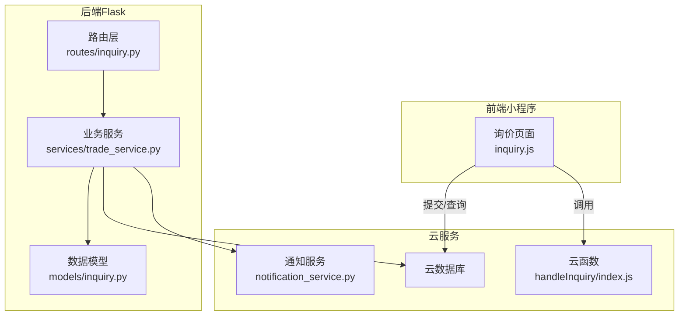
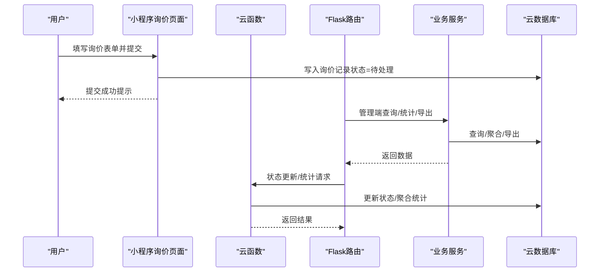
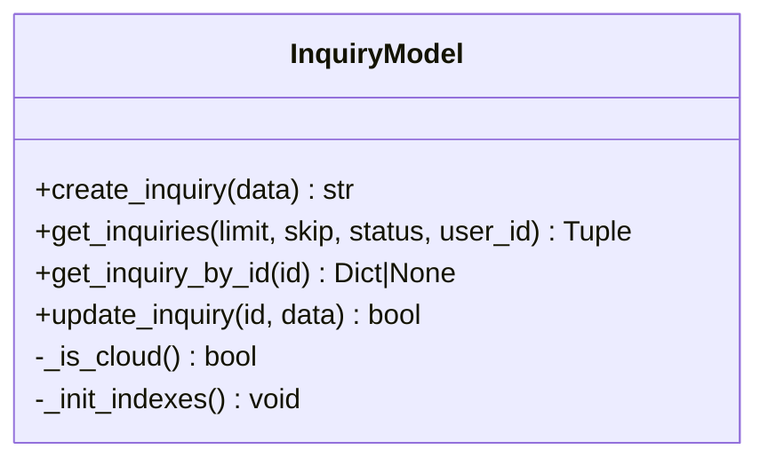
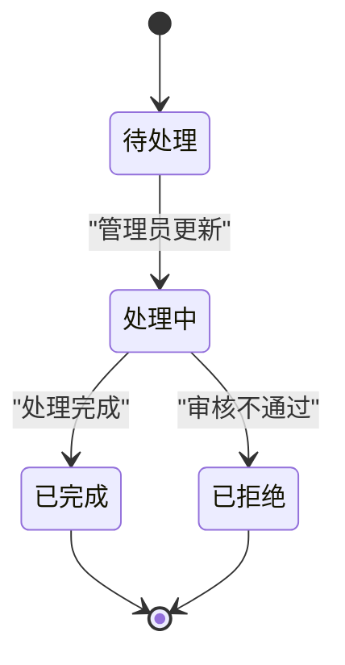
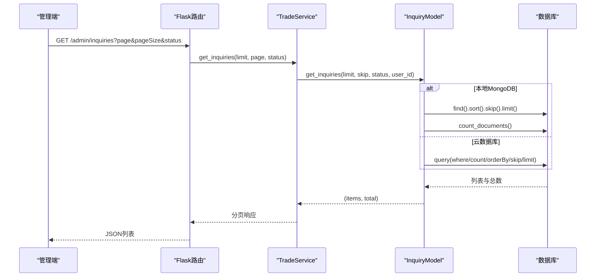
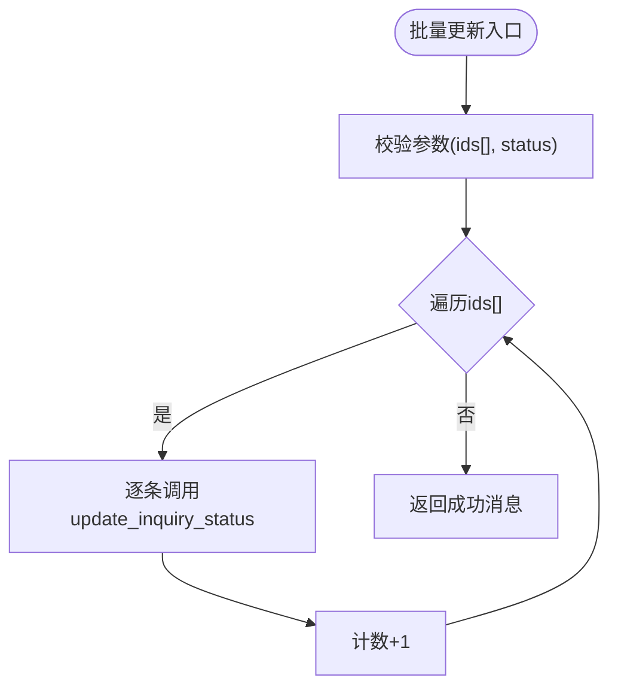
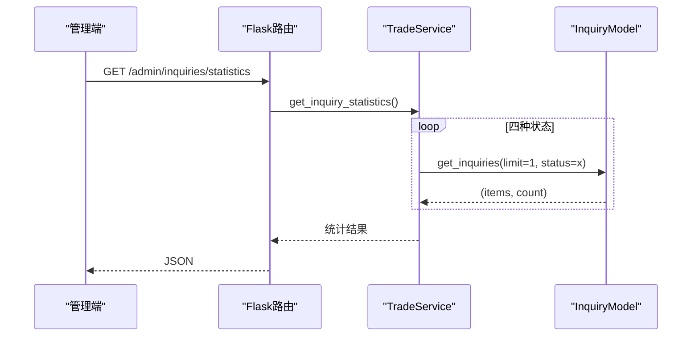
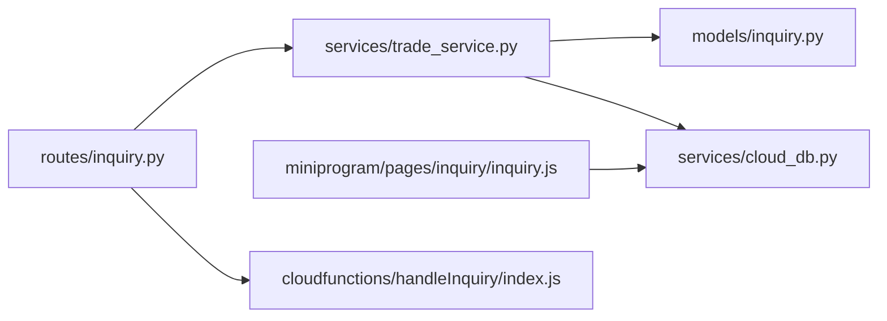

# 询价管理模块

<cite>
**本文档引用的文件**
- [models/inquiry.py](file://models/inquiry.py)
- [routes/inquiry.py](file://routes/inquiry.py)
- [services/trade_service.py](file://services/trade_service.py)
- [services/notification_service.py](file://services/notification_service.py)
- [cloudfunctions/handleInquiry/index.js](file://cloudfunctions/handleInquiry/index.js)
- [services/cloud_db.py](file://services/cloud_db.py)
- [miniprogram/pages/inquiry/inquiry.js](file://miniprogram/pages/inquiry/inquiry.js)
- [__tests__/inquiry-logic.test.js](file://__tests__/inquiry-logic.test.js)
- [docs/inquiry-group-edit.md](file://docs/inquiry-group-edit.md)
- [models/order.py](file://models/order.py)
- [routes/customer.py](file://routes/customer.py)
</cite>

## 目录
1. [简介](#简介)
2. [项目结构](#项目结构)
3. [核心组件](#核心组件)
4. [架构总览](#架构总览)
5. [详细组件分析](#详细组件分析)
6. [依赖关系分析](#依赖关系分析)
7. [性能考量](#性能考量)
8. [故障排查指南](#故障排查指南)
9. [结论](#结论)
10. [附录](#附录)

## 简介
本模块围绕“询价管理”展开，覆盖从用户提交询价、后台管理、状态流转、批量处理、通知机制到与订单管理、客户管理的集成。文档重点包括：
- 业务流程：创建、状态管理（待处理、处理中、已完成、已拒绝）、批量处理、通知
- 数据模型字段、业务规则与约束
- 查询接口、分页与过滤
- 统计功能与性能优化
- 最佳实践、异常处理与错误恢复
- 与订单、客户、通知系统的集成

## 项目结构
本模块涉及前后端与云函数协同：
- 前端（小程序）：负责用户交互、表单校验、提交至云数据库
- 后端（Flask）：提供REST接口、业务编排、统计与导出
- 云数据库：存储询价、报价、分组等数据
- 云函数：提供状态更新、统计聚合等能力
- 服务层：封装通用数据库访问与业务逻辑

图表来源
- [routes/inquiry.py](file://routes/inquiry.py#L1-L175)
- [services/trade_service.py](file://services/trade_service.py#L1-L318)
- [models/inquiry.py](file://models/inquiry.py#L1-L148)
- [cloudfunctions/handleInquiry/index.js](file://cloudfunctions/handleInquiry/index.js#L1-L81)
- [services/notification_service.py](file://services/notification_service.py#L1-L16)

章节来源
- [routes/inquiry.py](file://routes/inquiry.py#L1-L175)
- [services/trade_service.py](file://services/trade_service.py#L1-L318)
- [models/inquiry.py](file://models/inquiry.py#L1-L148)
- [cloudfunctions/handleInquiry/index.js](file://cloudfunctions/handleInquiry/index.js#L1-L81)
- [services/notification_service.py](file://services/notification_service.py#L1-L16)

## 核心组件
- 数据模型（InquiryModel）：封装询价的创建、查询、按ID查询、更新等操作，支持本地MongoDB与微信云数据库双形态
- 业务服务（TradeService）：统一获取模型实例、封装业务逻辑（创建询价、查询、更新状态、统计、导出）
- 路由层（routes/inquiry.py）：暴露REST接口，包括创建、列表查询、状态更新、批量更新、统计、导出
- 云函数（handleInquiry/index.js）：提供云侧状态更新与统计聚合
- 通知服务（notification_service.py）：占位的通知发送接口
- 前端页面（miniprogram/pages/inquiry/inquiry.js）：用户交互、表单校验、提交到云数据库
- 分组逻辑与测试（docs/inquiry-group-edit.md、__tests__/inquiry-logic.test.js）：分组管理、重命名、删除、迁移等

章节来源
- [models/inquiry.py](file://models/inquiry.py#L10-L148)
- [services/trade_service.py](file://services/trade_service.py#L8-L94)
- [routes/inquiry.py](file://routes/inquiry.py#L11-L175)
- [cloudfunctions/handleInquiry/index.js](file://cloudfunctions/handleInquiry/index.js#L12-L81)
- [services/notification_service.py](file://services/notification_service.py#L5-L16)
- [miniprogram/pages/inquiry/inquiry.js](file://miniprogram/pages/inquiry/inquiry.js#L500-L640)
- [docs/inquiry-group-edit.md](file://docs/inquiry-group-edit.md#L1-L230)
- [__tests__/inquiry-logic.test.js](file://__tests__/inquiry-logic.test.js#L1-L174)

## 架构总览
整体采用“前端直连云数据库 + 后端REST + 云函数”的混合架构，既满足小程序快速迭代，又通过后端统一治理业务流程。

图表来源
- [miniprogram/pages/inquiry/inquiry.js](file://miniprogram/pages/inquiry/inquiry.js#L596-L640)
- [routes/inquiry.py](file://routes/inquiry.py#L36-L175)
- [services/trade_service.py](file://services/trade_service.py#L38-L94)
- [cloudfunctions/handleInquiry/index.js](file://cloudfunctions/handleInquiry/index.js#L12-L81)

## 详细组件分析

### 数据模型与字段定义
- 集合：inquiries
- 关键字段（示例，实际以具体文档为准）：
  - selectedProduct/productName/productCode：产品信息
  - optionType/structure/term：期权类型、结构、期限
  - notionalAmount/strikePrice：名义本金、行权价
  - contactName/contactPhone/contactEmail/notes：联系信息与备注
  - status：状态（默认待处理）
  - createdAt/updatedAt：创建与更新时间
  - userId/userName/openid：用户标识
  - source/history：来源与历史
  - remark/operatorOpenid：备注与操作者（云函数场景）
- 索引：createdAt、status、phone（本地MongoDB）

图表来源
- [models/inquiry.py](file://models/inquiry.py#L10-L148)

章节来源
- [models/inquiry.py](file://models/inquiry.py#L24-L54)
- [models/inquiry.py](file://models/inquiry.py#L55-L101)
- [models/inquiry.py](file://models/inquiry.py#L103-L148)

### 业务流程与状态管理
- 创建：前端提交后写入云数据库，默认状态为“待处理”
- 状态流转：
  - 待处理（pending）→ 处理中（processing）→ 已完成（completed） 或 已拒绝（rejected）
- 触发条件：
  - 管理员在后台更新状态
  - 云函数按需更新（如批量更新）
- 历史与备注：可在更新时附加备注与操作者信息

图表来源
- [routes/inquiry.py](file://routes/inquiry.py#L60-L84)
- [cloudfunctions/handleInquiry/index.js](file://cloudfunctions/handleInquiry/index.js#L34-L58)

章节来源
- [routes/inquiry.py](file://routes/inquiry.py#L11-L35)
- [routes/inquiry.py](file://routes/inquiry.py#L60-L84)
- [cloudfunctions/handleInquiry/index.js](file://cloudfunctions/handleInquiry/index.js#L16-L26)

### 查询接口、分页与过滤
- 列表查询（管理端）：
  - GET /admin/inquiries?page=&pageSize=&status=
  - 支持按状态过滤；分页通过page/pageSize转换为skip/limit
- 按ID查询：
  - get_inquiry_by_id：支持本地与云数据库
- 查询实现要点：
  - 本地MongoDB：使用sort/skip/limit与count_documents
  - 云数据库：构造JS查询语句，支持where/count/orderBy/skip/limit

图表来源
- [routes/inquiry.py](file://routes/inquiry.py#L36-L58)
- [services/trade_service.py](file://services/trade_service.py#L42-L45)
- [models/inquiry.py](file://models/inquiry.py#L55-L101)

章节来源
- [routes/inquiry.py](file://routes/inquiry.py#L36-L58)
- [services/trade_service.py](file://services/trade_service.py#L42-L45)
- [models/inquiry.py](file://models/inquiry.py#L55-L101)

### 批量处理与导出
- 批量更新：
  - POST /admin/inquiries/batch-update（ids[], status）
  - 循环逐条更新，生产环境建议优化为批量操作
- 导出：
  - GET /admin/inquiries/export?status=（限制1000条）
  - 格式化字段并输出Excel

图表来源
- [routes/inquiry.py](file://routes/inquiry.py#L97-L122)

章节来源
- [routes/inquiry.py](file://routes/inquiry.py#L97-L122)

### 统计功能
- 管理端统计：
  - GET /admin/inquiries/statistics
  - TradeService内对四种状态分别调用get_inquiries(limit=1, status=...)计数
- 云函数统计：
  - 云函数提供聚合统计接口，适合复杂聚合场景

图表来源
- [routes/inquiry.py](file://routes/inquiry.py#L86-L95)
- [services/trade_service.py](file://services/trade_service.py#L70-L94)

章节来源
- [routes/inquiry.py](file://routes/inquiry.py#L86-L95)
- [services/trade_service.py](file://services/trade_service.py#L70-L94)

### 通知机制
- 通知服务为占位实现，日志输出模拟通知发送
- 实际部署中可对接微信/邮件等渠道

章节来源
- [services/notification_service.py](file://services/notification_service.py#L9-L16)

### 与订单管理、客户管理的集成
- 订单管理：
  - 订单模型与询价模型类似，均支持本地与云数据库
  - 订单状态更新接口：PUT /admin/orders/<id>/status
- 客户管理：
  - 客户路由提供分组重命名等管理能力，便于与询价来源用户关联

章节来源
- [models/order.py](file://models/order.py#L10-L119)
- [routes/customer.py](file://routes/customer.py#L174-L217)

## 依赖关系分析
- 模块耦合：
  - routes依赖service，service依赖model与云数据库客户端
  - 前端直接依赖云数据库，亦可通过云函数间接调用
- 外部依赖：
  - 微信云数据库SDK与HTTP API
  - 微信AccessTokenProvider用于鉴权

图表来源
- [routes/inquiry.py](file://routes/inquiry.py#L1-L10)
- [services/trade_service.py](file://services/trade_service.py#L12-L22)
- [models/inquiry.py](file://models/inquiry.py#L11-L14)
- [services/cloud_db.py](file://services/cloud_db.py#L108-L208)
- [miniprogram/pages/inquiry/inquiry.js](file://miniprogram/pages/inquiry/inquiry.js#L186-L208)
- [cloudfunctions/handleInquiry/index.js](file://cloudfunctions/handleInquiry/index.js#L12-L27)

章节来源
- [routes/inquiry.py](file://routes/inquiry.py#L1-L10)
- [services/trade_service.py](file://services/trade_service.py#L12-L22)
- [models/inquiry.py](file://models/inquiry.py#L11-L14)
- [services/cloud_db.py](file://services/cloud_db.py#L108-L208)
- [miniprogram/pages/inquiry/inquiry.js](file://miniprogram/pages/inquiry/inquiry.js#L186-L208)
- [cloudfunctions/handleInquiry/index.js](file://cloudfunctions/handleInquiry/index.js#L12-L27)

## 性能考量
- 查询性能：
  - 本地MongoDB：已建立createdAt/status/phone索引
  - 云数据库：使用where/count/orderBy/skip/limit组合，注意集合存在性与权限
- 批量更新：
  - 当前循环逐条更新，建议改为批量更新以降低网络往返与API调用次数
- 统计：
  - 当前对四种状态各做一次count，可合并为一次聚合查询（云函数场景更易实现）
- 并发与限流：
  - 云数据库客户端内置信号量与重试策略，合理配置最大并发与重试次数

章节来源
- [models/inquiry.py](file://models/inquiry.py#L24-L31)
- [routes/inquiry.py](file://routes/inquiry.py#L113-L118)
- [services/cloud_db.py](file://services/cloud_db.py#L137-L160)
- [services/cloud_db.py](file://services/cloud_db.py#L486-L533)

## 故障排查指南
- 常见错误与定位：
  - 云数据库集合不存在：检查集合是否创建、环境变量是否正确
  - 请求格式错误：确认查询语句与where/count/orderBy/skip/limit拼接
  - 访问令牌失效：AccessTokenProvider会自动刷新，检查AppID/Secret配置
- 前端提交失败：
  - 检查表单必填字段与云数据库写入权限
  - 查看控制台日志与Toast提示
- 后端接口异常：
  - 查看Flask日志与错误响应
  - 确认认证中间件与权限角色

章节来源
- [services/cloud_db.py](file://services/cloud_db.py#L241-L247)
- [services/cloud_db.py](file://services/cloud_db.py#L512-L520)
- [miniprogram/pages/inquiry/inquiry.js](file://miniprogram/pages/inquiry/inquiry.js#L630-L639)
- [routes/inquiry.py](file://routes/inquiry.py#L32-L34)

## 结论
本模块通过“前端直连 + 后端治理 + 云函数增强”的架构实现了询价全流程管理。在保证灵活性的同时，建议后续优化批量更新、聚合统计与通知通道，以提升吞吐与可观测性，并完善状态历史与审计追踪。

## 附录

### 业务规则与约束
- 必填字段：selectedProduct、notionalAmount、strikePrice、contactName、contactPhone
- 状态枚举：pending/processing/completed/rejected
- 默认状态：创建时为pending
- 用户标识：支持userId/openid，便于与客户管理关联

章节来源
- [miniprogram/pages/inquiry/inquiry.js](file://miniprogram/pages/inquiry/inquiry.js#L506-L526)
- [routes/inquiry.py](file://routes/inquiry.py#L16-L18)
- [models/inquiry.py](file://models/inquiry.py#L32-L36)

### 最佳实践
- 前端：
  - 表单校验前置，减少无效请求
  - 提交成功后重置表单并提示
- 后端：
  - 批量更新走云函数或数据库事务，避免循环更新
  - 统计使用聚合查询，减少多次count
- 云数据库：
  - 合理设置并发与重试，关注QPS限制
  - 集合与索引提前规划

### 错误恢复机制
- 云数据库请求失败具备重试与退避策略
- 认证令牌自动刷新，异常时记录详细日志
- 前端提交失败提供明确提示并允许重试

章节来源
- [services/cloud_db.py](file://services/cloud_db.py#L491-L533)
- [services/cloud_db.py](file://services/cloud_db.py#L69-L105)