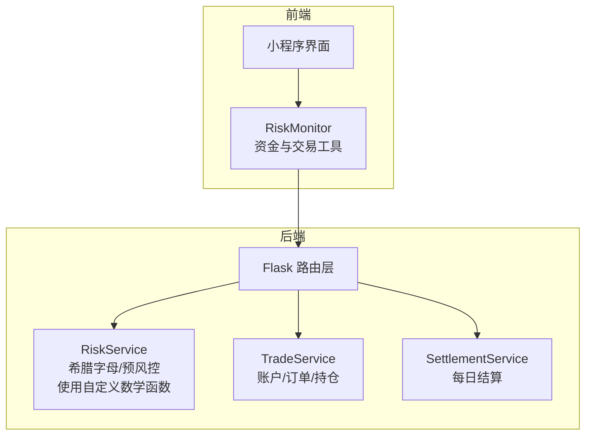
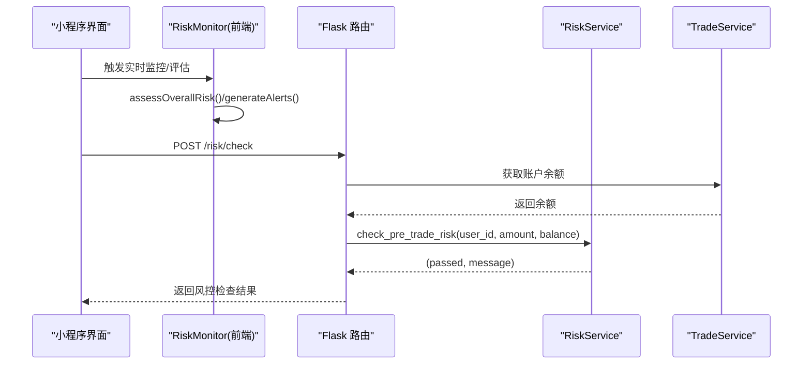
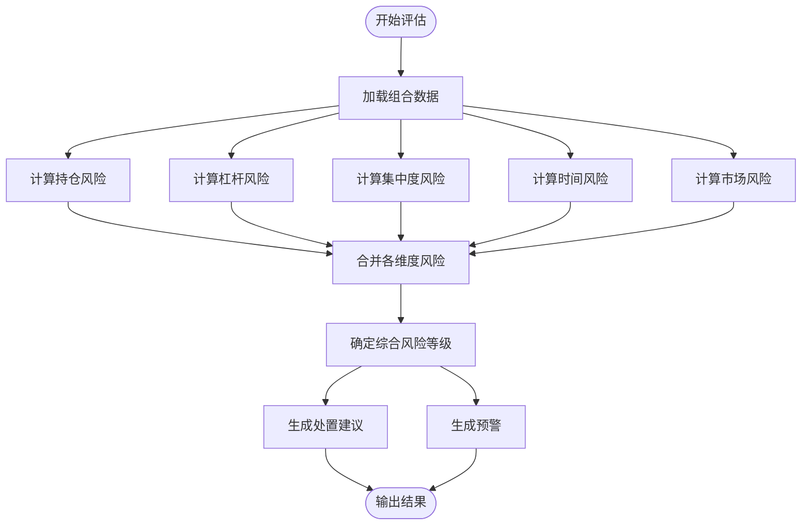
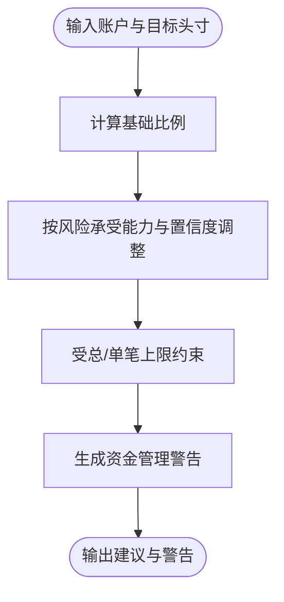
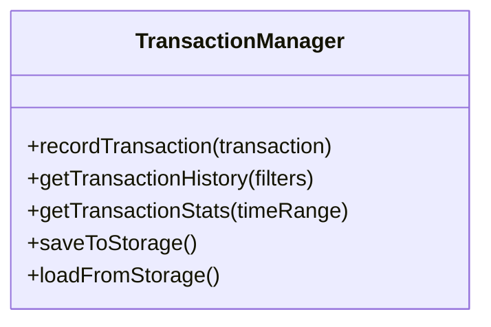
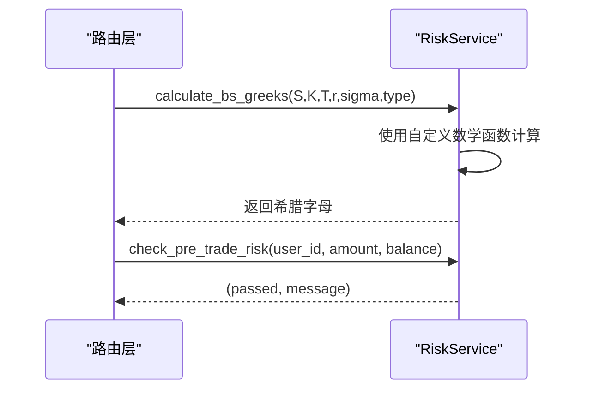
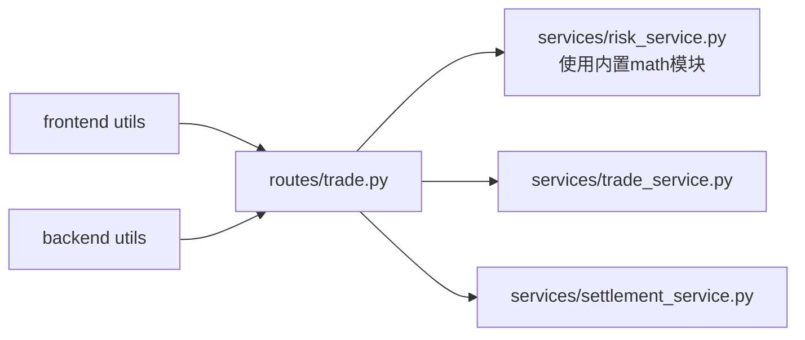

# 风险管理模块

<cite>
**本文引用的文件**
- [enhanced-features.js](file://backend_utils/enhanced-features.js)
- [enhanced-features.js](file://miniprogram/utils/enhanced-features.js)
- [risk_service.py](file://services/risk_service.py)
- [trade.py](file://routes/trade.py)
- [核心功能补全与上线准备计划.md](file://.trae/documents/核心功能补全与上线准备计划.md)
- [FEATURE_COMPLETENESS_REPORT.md](file://FEATURE_COMPLETENESS_REPORT.md)
</cite>

## 更新摘要
**变更内容**
- 更新了希腊字母计算部分，反映移除scipy.stats.norm依赖的变更
- 新增了自定义数学近似函数的说明
- 更新了云托管环境兼容性的相关内容
- 完善了风险评估算法的技术实现细节

## 目录
1. [简介](#简介)
2. [项目结构](#项目结构)
3. [核心组件](#核心组件)
4. [架构总览](#架构总览)
5. [详细组件分析](#详细组件分析)
6. [依赖关系分析](#依赖关系分析)
7. [性能考量](#性能考量)
8. [故障排查指南](#故障排查指南)
9. [结论](#结论)
10. [附录](#附录)

## 简介
本文件面向"场外期权"项目的"风险管理模块"，系统化阐述风险控制策略的实施机制与技术实现，覆盖风险限额设定、实时监控与预警、风险评估算法、风险指标计算、风险等级划分、合规检查流程、反洗钱规则、监管报告要求、风险事件识别与处置、风险缓释与止损机制、风险转移策略、风险数据采集与分析、风险报告与可视化、决策支持以及与交易系统的集成与实时性保障。

**更新** 本模块现已完全兼容云托管环境，移除了对scipy.stats.norm的外部依赖，使用自定义数学近似函数实现希腊字母计算。

## 项目结构
风险管理模块在后端与小程序前端分别提供了统一的工具类与服务层，形成"前端评估 + 后端定价/风控"的双层协同：

- 后端工具类（RiskMonitor、FundManager、TransactionManager）：负责多维度风险评估、资金管理建议与交易记录管理。
- 前端工具类（RiskMonitor、FundManager、TransactionManager）：与后端逻辑一致，便于小程序侧实时展示与交互。
- 服务层（RiskService）：提供Black-Scholes希腊字母计算等定价与风控前置校验能力，现已完全使用内置数学函数。
- 路由层（routes/trade.py）：暴露风控检查与希腊字母计算接口，串联交易流程。

**图表来源**
- [trade.py](file://routes/trade.py#L1-L330)
- [risk_service.py](file://services/risk_service.py#L1-L71)
- [enhanced-features.js](file://backend_utils/enhanced-features.js#L1-L416)
- [enhanced-features.js](file://miniprogram/utils/enhanced-features.js#L1-L416)

**章节来源**
- [trade.py](file://routes/trade.py#L1-L330)
- [risk_service.py](file://services/risk_service.py#L1-L71)
- [enhanced-features.js](file://backend_utils/enhanced-features.js#L1-L416)
- [enhanced-features.js](file://miniprogram/utils/enhanced-features.js#L1-L416)

## 核心组件
- 风险监控器（RiskMonitor）
  - 多维度风险评估：持仓风险、杠杆风险、集中度风险、时间风险、市场风险
  - 风险等级划分：低/中/高/极高
  - 预警与建议：根据风险计数生成多级别预警与处置建议
  - 实时监控：定时轮询触发评估回调
- 资金管理器（FundManager）
  - 资金配置建议：基于风险承受能力与置信度给出推荐投入金额
  - 风险提示：对超可用资金、单笔占比过高、现金储备不足进行警告
- 交易记录管理器（TransactionManager）
  - 交易记录持久化与检索
  - 统计指标：交易次数、成交量、胜率、平均盈亏、最大盈亏
- 风控服务（RiskService）
  - **更新** Black-Scholes希腊字母计算，使用自定义数学近似函数替代scipy
  - 下单前预风控检查（余额与限额）

**章节来源**
- [enhanced-features.js](file://backend_utils/enhanced-features.js#L6-L232)
- [enhanced-features.js](file://miniprogram/utils/enhanced-features.js#L6-L232)
- [risk_service.py](file://services/risk_service.py#L17-L71)

## 架构总览
风险管理模块通过路由层对外提供风控检查与希腊字母计算接口，结合服务层完成账户与交易数据的读取与校验；前端工具类负责本地实时评估与展示，二者协同实现"前端体验 + 后端风控"的闭环。

**更新** 希腊字母计算现完全使用Python内置math模块函数，无需额外依赖。

**图表来源**
- [trade.py](file://routes/trade.py#L19-L34)
- [risk_service.py](file://services/risk_service.py#L63-L71)
- [enhanced-features.js](file://miniprogram/utils/enhanced-features.js#L216-L231)

**章节来源**
- [trade.py](file://routes/trade.py#L19-L34)
- [risk_service.py](file://services/risk_service.py#L63-L71)
- [enhanced-features.js](file://miniprogram/utils/enhanced-features.js#L216-L231)

## 详细组件分析

### 风险监控器（RiskMonitor）
- 风险阈值与等级
  - 持仓比例阈值、单笔持仓比例阈值、杠杆倍数阈值、盈亏比例阈值、临近到期预警天数
  - 风险等级：低/中/高/极高，用于综合评估与告警分级
- 风险评估维度
  - 持仓风险：基于总资产与总持仓规模的比例
  - 杠杆风险：基于杠杆倍数
  - 集中度风险：基于最大单一持仓占比
  - 时间风险：基于临近到期比例
  - 市场风险：基于波动率与相关性
- 建议与预警
  - 根据各维度风险等级生成处置建议（降低头寸、密切监控、定期复核等）
  - 当高风险维度数量达到阈值时，生成多级别预警
- 实时监控
  - 每5分钟轮询评估一次，首次进入即执行一次

**图表来源**
- [enhanced-features.js](file://backend_utils/enhanced-features.js#L29-L48)
- [enhanced-features.js](file://backend_utils/enhanced-features.js#L53-L152)
- [enhanced-features.js](file://backend_utils/enhanced-features.js#L157-L211)

**章节来源**
- [enhanced-features.js](file://backend_utils/enhanced-features.js#L6-L232)
- [enhanced-features.js](file://miniprogram/utils/enhanced-features.js#L6-L232)

### 资金管理器（FundManager）
- 资金配置建议
  - 基于风险承受能力与置信度调整推荐投入比例
  - 受单笔最大持仓比例、总持仓比例、最低现金储备等规则约束
- 风险提示
  - 对超可用资金、单笔占比过高、现金储备不足进行警告
- 止损与止盈
  - 提供止损比例与止盈比例参数（用于策略建议与阈值参考）

**图表来源**
- [enhanced-features.js](file://backend_utils/enhanced-features.js#L249-L296)
- [enhanced-features.js](file://miniprogram/utils/enhanced-features.js#L249-L296)

**章节来源**
- [enhanced-features.js](file://backend_utils/enhanced-features.js#L235-L296)
- [enhanced-features.js](file://miniprogram/utils/enhanced-features.js#L235-L296)

### 交易记录管理器（TransactionManager）
- 交易记录
  - 记录交易ID、时间戳、类型、标的、金额、盈亏等
  - 支持按类型、日期范围、标的过滤
- 统计指标
  - 交易次数、成交量、胜率、平均盈亏、最大盈亏
- 存储与加载
  - 使用本地存储持久化，限制最近1000条

**图表来源**
- [enhanced-features.js](file://backend_utils/enhanced-features.js#L300-L410)
- [enhanced-features.js](file://miniprogram/utils/enhanced-features.js#L300-L410)

**章节来源**
- [enhanced-features.js](file://backend_utils/enhanced-features.js#L300-L410)
- [enhanced-features.js](file://miniprogram/utils/enhanced-features.js#L300-L410)

### 风控服务（RiskService）
- **更新** 希腊字母计算
  - 支持看涨/看跌期权，返回Delta/Gamma/Theta/Vega/Rho
  - **新增** 使用自定义数学近似函数替代scipy.stats.norm
  - **新增** _approx_cdf函数：使用sigmoid函数近似标准正态分布CDF
  - **新增** _approx_pdf函数：使用标准正态分布概率密度函数
  - **更新** 完全兼容云托管环境，无需安装scipy库
- 预风控检查
  - 基于余额与限额进行下单前校验

**更新** 移除了对scipy.stats.norm的依赖，使用Python内置math模块实现数学计算。

**图表来源**
- [risk_service.py](file://services/risk_service.py#L17-L71)
- [trade.py](file://routes/trade.py#L36-L52)
- [trade.py](file://routes/trade.py#L19-L34)

**章节来源**
- [risk_service.py](file://services/risk_service.py#L17-L71)
- [trade.py](file://routes/trade.py#L36-L52)
- [trade.py](file://routes/trade.py#L19-L34)

## 依赖关系分析
- 路由层依赖服务层
  - /risk/check 依赖 RiskService 的预风控检查
  - /risk/greeks 依赖 RiskService 的希腊字母计算
- 前后端工具类共享同一评估逻辑，确保一致性
- 风险评估与资金管理建议共同支撑交易决策
- **更新** RiskService现在完全依赖Python标准库，无需第三方数学库

**图表来源**
- [trade.py](file://routes/trade.py#L1-L330)
- [risk_service.py](file://services/risk_service.py#L1-L71)

**章节来源**
- [trade.py](file://routes/trade.py#L1-L330)
- [risk_service.py](file://services/risk_service.py#L1-L71)

## 性能考量
- 评估频率与时延
  - 前端实时监控每5分钟轮询一次，兼顾及时性与资源消耗
- 接口性能
  - **更新** 希腊字母计算使用内置math函数，性能稳定且无需网络依赖
  - 预风控检查仅涉及余额与限额判断
- **新增** 云托管兼容性优势
  - 无需安装scipy库，减少部署复杂度
  - 内置数学函数在所有Python环境中均可使用
- 建议
  - 对高频查询引入缓存（如Redis）以降低数据库压力
  - 对批量风控检查采用异步队列处理，避免阻塞主线程

## 故障排查指南
- 风控检查失败
  - 检查账户余额是否充足
  - 核对限额参数与当前头寸
- **更新** 希腊字母计算异常
  - 确认输入参数（S/K/T/r/sigma/type）合法
  - 检查时间至到期T是否为正数
  - **新增** 确认Python运行环境支持math模块（标准库）
- 实时监控不生效
  - 确认轮询间隔与回调函数正确注册
  - 检查前端/后端工具类版本一致性
- **新增** 云托管部署问题
  - 确认Python版本支持math模块中的所有函数
  - 检查是否有自定义math函数被重写或覆盖

**章节来源**
- [trade.py](file://routes/trade.py#L19-L34)
- [risk_service.py](file://services/risk_service.py#L21-L71)
- [enhanced-features.js](file://miniprogram/utils/enhanced-features.js#L216-L231)

## 结论
该风险管理模块通过"前端评估 + 后端定价/风控"的双层设计，实现了多维度风险评估、实时监控与预警、资金配置建议与交易统计分析。配合路由层提供的风控检查与希腊字母计算接口，能够有效支撑交易系统的风控需求。

**更新** 通过移除scipy.stats.norm依赖并使用自定义数学近似函数，模块现已完全兼容云托管环境，无需额外的数学库依赖，提高了部署的灵活性和可靠性。后续可在性能与稳定性方面进一步优化，并补充合规与监管报告能力。

## 附录

### 风险限额与阈值（示例）
- 持仓比例阈值：30%
- 单笔持仓比例阈值：10%
- 杠杆倍数阈值：5倍
- 盈亏比例阈值：20%
- 临近到期预警天数：5天
- 最低现金储备比例：10%
- 止损比例：5%
- 止盈比例：15%

**章节来源**
- [enhanced-features.js](file://backend_utils/enhanced-features.js#L8-L14)
- [enhanced-features.js](file://miniprogram/utils/enhanced-features.js#L8-L14)

### 数学近似函数实现
**新增** 自定义数学函数用于云托管环境兼容性

- _approx_cdf函数
  - 使用sigmoid函数近似标准正态分布CDF
  - 公式：1.0 / (1.0 + exp(-1.702 * x))
  - 适用于希腊字母计算中的累积分布函数需求
- _approx_pdf函数
  - 使用标准正态分布概率密度函数
  - 公式：exp(-0.5 * x^2) / sqrt(2 * π)
  - 适用于希腊字母计算中的概率密度函数需求

**章节来源**
- [risk_service.py](file://services/risk_service.py#L7-L15)

### 合规与监管要点（建议）
- 反洗钱（AML）
  - 客户身份识别与持续监控
  - 大额与可疑交易报告
  - 交易目的与背景调查
- 监管报告
  - 日常头寸与敞口报告
  - 风险指标与压力测试结果
  - 重大风险事件报告流程与时限
- 合规检查流程
  - 交易前合规校验（黑名单、限额、KYC）
  - 交易后归档与审计追踪
  - 定期合规培训与演练

**章节来源**
- [核心功能补全与上线准备计划.md](file://.trae/documents/核心功能补全与上线准备计划.md#L47-L57)
- [FEATURE_COMPLETENESS_REPORT.md](file://FEATURE_COMPLETENESS_REPORT.md#L152-L162)