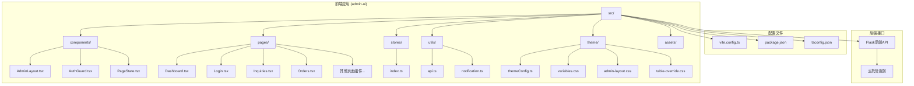
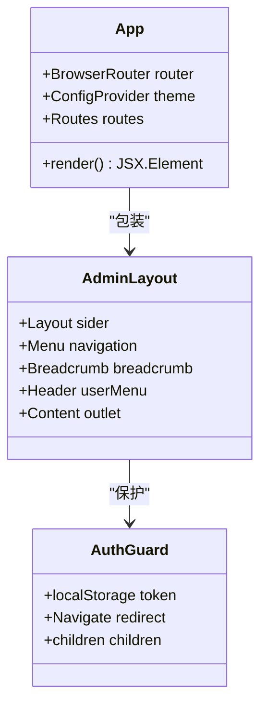
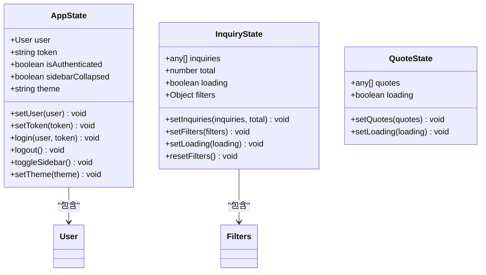
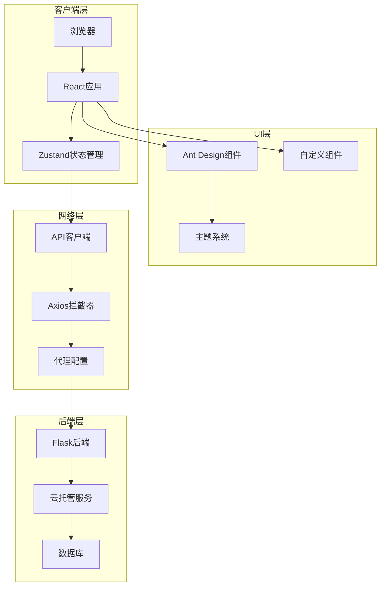
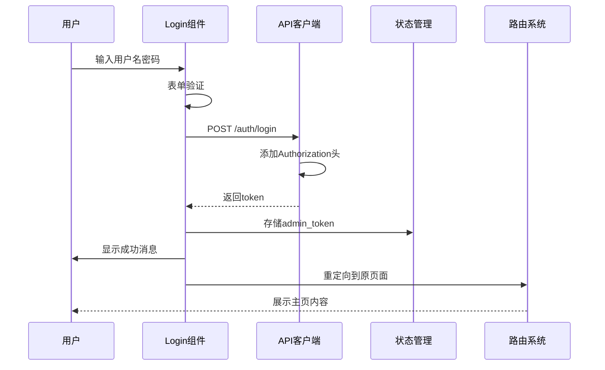
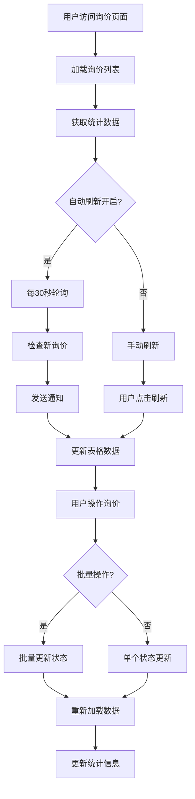
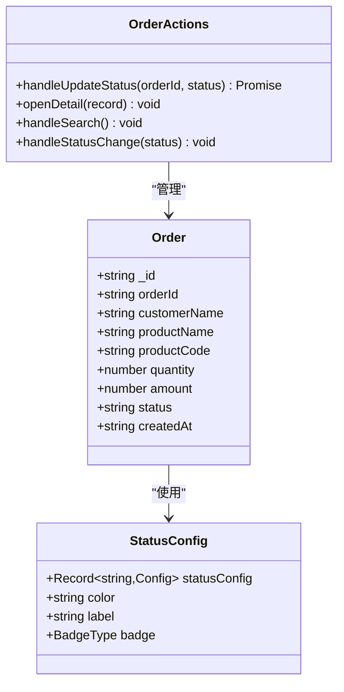
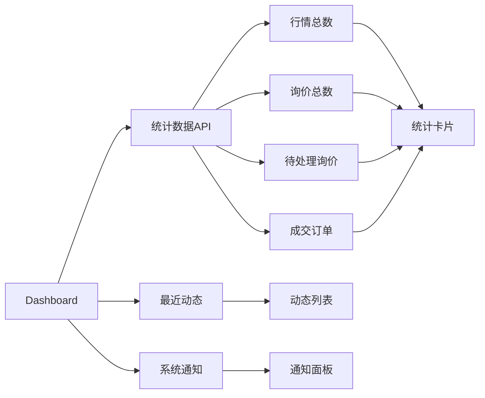

# React管理后台

<cite>
**本文档引用的文件**
- [package.json](file://admin-ui/package.json)
- [App.tsx](file://admin-ui/src/App.tsx)
- [main.tsx](file://admin-ui/src/main.tsx)
- [vite.config.ts](file://admin-ui/vite.config.ts)
- [index.ts](file://admin-ui/src/stores/index.ts)
- [AdminLayout.tsx](file://admin-ui/src/components/AdminLayout.tsx)
- [AuthGuard.tsx](file://admin-ui/src/components/AuthGuard.tsx)
- [api.ts](file://admin-ui/src/utils/api.ts)
- [Dashboard.tsx](file://admin-ui/src/pages/Dashboard.tsx)
- [Login.tsx](file://admin-ui/src/pages/Login.tsx)
- [Inquiries.tsx](file://admin-ui/src/pages/Inquiries.tsx)
- [Orders.tsx](file://admin-ui/src/pages/Orders.tsx)
- [themeConfig.ts](file://admin-ui/src/theme/themeConfig.ts)
- [notification.ts](file://admin-ui/src/utils/notification.ts)
- [PageState.tsx](file://admin-ui/src/components/PageState.tsx)
</cite>

## 目录
1. [项目概述](#项目概述)
2. [项目结构](#项目结构)
3. [核心组件](#核心组件)
4. [架构概览](#架构概览)
5. [详细组件分析](#详细组件分析)
6. [依赖关系分析](#依赖关系分析)
7. [性能考虑](#性能考虑)
8. [故障排除指南](#故障排除指南)
9. [结论](#结论)

## 项目概述

这是一个基于React 19和Ant Design 6构建的期权后台管理系统。该系统采用现代化的前端技术栈，提供了完整的后台管理功能，包括用户认证、数据展示、业务管理等模块。

### 主要特性
- **现代化技术栈**: React 19 + TypeScript + Vite
- **状态管理**: Zustand替代Redux，提供轻量级状态管理
- **UI框架**: Ant Design 6，提供丰富的组件库
- **路由管理**: React Router 7.11.0，支持嵌套路由
- **主题定制**: 完整的Ant Design主题配置
- **实时通知**: 基于WebSocket的通知系统

## 项目结构



**图表来源**
- [package.json:1-39](file://admin-ui/package.json#L1-L39)
- [vite.config.ts:1-78](file://admin-ui/vite.config.ts#L1-L78)

**章节来源**
- [package.json:1-39](file://admin-ui/package.json#L1-L39)
- [main.tsx:1-14](file://admin-ui/src/main.tsx#L1-L14)

## 核心组件

### 应用入口组件

应用的主入口组件负责整个应用的初始化和路由配置：



**图表来源**
- [App.tsx:33-72](file://admin-ui/src/App.tsx#L33-L72)
- [AdminLayout.tsx:123-301](file://admin-ui/src/components/AdminLayout.tsx#L123-L301)
- [AuthGuard.tsx:8-17](file://admin-ui/src/components/AuthGuard.tsx#L8-L17)

### 状态管理系统

系统采用Zustand实现全局状态管理，提供用户状态、询价状态和行情状态的统一管理：



**图表来源**
- [index.ts:20-116](file://admin-ui/src/stores/index.ts#L20-L116)
- [index.ts:128-156](file://admin-ui/src/stores/index.ts#L128-L156)

**章节来源**
- [index.ts:1-214](file://admin-ui/src/stores/index.ts#L1-L214)

## 架构概览

系统采用前后端分离架构，前端使用React构建单页应用，通过API与后端通信：



**图表来源**
- [api.ts:62-125](file://admin-ui/src/utils/api.ts#L62-L125)
- [vite.config.ts:21-59](file://admin-ui/vite.config.ts#L21-L59)

## 详细组件分析

### 登录认证组件

登录组件实现了完整的用户认证流程，包括表单验证、API调用和状态管理：



**图表来源**
- [Login.tsx:28-47](file://admin-ui/src/pages/Login.tsx#L28-L47)
- [api.ts:68-81](file://admin-ui/src/utils/api.ts#L68-L81)

**章节来源**
- [Login.tsx:1-78](file://admin-ui/src/pages/Login.tsx#L1-L78)

### 询价管理组件

询价管理组件提供了完整的询价处理功能，包括列表展示、状态更新、批量操作等：



**图表来源**
- [Inquiries.tsx:158-176](file://admin-ui/src/pages/Inquiries.tsx#L158-L176)
- [Inquiries.tsx:211-231](file://admin-ui/src/pages/Inquiries.tsx#L211-L231)

**章节来源**
- [Inquiries.tsx:1-580](file://admin-ui/src/pages/Inquiries.tsx#L1-L580)

### 订单管理组件

订单管理组件实现了订单的完整生命周期管理：



**图表来源**
- [Orders.tsx:10-47](file://admin-ui/src/pages/Orders.tsx#L10-L47)
- [Orders.tsx:39-47](file://admin-ui/src/pages/Orders.tsx#L39-L47)

**章节来源**
- [Orders.tsx:1-360](file://admin-ui/src/pages/Orders.tsx#L1-L360)

### 仪表板组件

仪表板提供了系统的概览信息和统计数据：



**图表来源**
- [Dashboard.tsx:20-46](file://admin-ui/src/pages/Dashboard.tsx#L20-L46)

**章节来源**
- [Dashboard.tsx:1-134](file://admin-ui/src/pages/Dashboard.tsx#L1-L134)

## 依赖关系分析

系统的核心依赖关系如下：

```mermaid
graph TB
subgraph "运行时依赖"
A[react@^19.2.0]
B[react-dom@^19.2.0]
C[react-router-dom@^7.11.0]
D[antd@^6.1.1]
E[@ant-design/icons@^6.1.0]
F[zustand@^5.0.0]
G[axios@^1.13.2]
end
subgraph "开发依赖"
H[@vitejs/plugin-react@^5.1.1]
I[vite@^7.2.4]
J[typescript@~5.9.3]
K[@types/react@^19.2.5]
L[@types/react-dom@^19.2.3]
M[vitest@^3.2.4]
end
A --> C
A --> F
D --> E
G --> A
H --> A
I --> H
```

**图表来源**
- [package.json:13-37](file://admin-ui/package.json#L13-L37)

**章节来源**
- [package.json:1-39](file://admin-ui/package.json#L1-L39)

## 性能考虑

### 状态管理优化
- 使用Zustand替代Redux，减少不必要的重渲染
- 本地存储持久化关键状态，提升用户体验
- 组件级状态隔离，避免全局状态污染

### 网络请求优化
- Axios拦截器统一处理认证和错误
- API代理配置支持开发和生产环境切换
- 请求超时和重试机制

### UI性能优化
- Ant Design组件按需加载
- 表格虚拟滚动支持大数据集
- 图片懒加载和资源压缩

## 故障排除指南

### 常见问题及解决方案

**登录失败**
- 检查后端API是否正常运行
- 验证网络连接和代理配置
- 确认用户名密码正确性

**数据加载失败**
- 查看浏览器开发者工具Network标签
- 检查API响应状态码
- 验证Token有效性

**页面空白**
- 检查控制台错误信息
- 验证TypeScript编译结果
- 确认静态资源路径正确

**章节来源**
- [api.ts:84-125](file://admin-ui/src/utils/api.ts#L84-L125)
- [vite.config.ts:26-59](file://admin-ui/vite.config.ts#L26-L59)

## 结论

这个React管理后台项目展现了现代前端开发的最佳实践，具有以下特点：

1. **技术栈先进**: 采用React 19、TypeScript、Vite等最新技术
2. **架构清晰**: 前后端分离，职责明确
3. **用户体验优秀**: Ant Design提供一致的UI体验
4. **可维护性强**: 模块化设计，良好的代码组织
5. **扩展性好**: 插件化架构，易于功能扩展

项目在期权后台管理领域提供了完整的解决方案，具备良好的商业价值和技术参考价值。