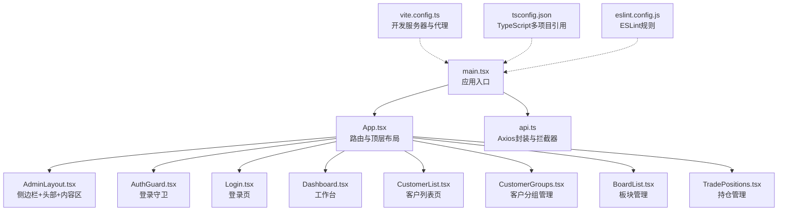
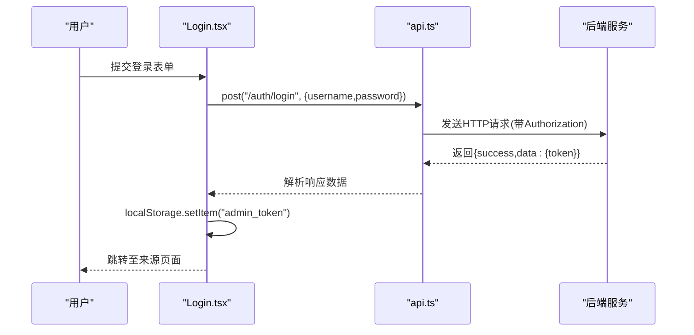
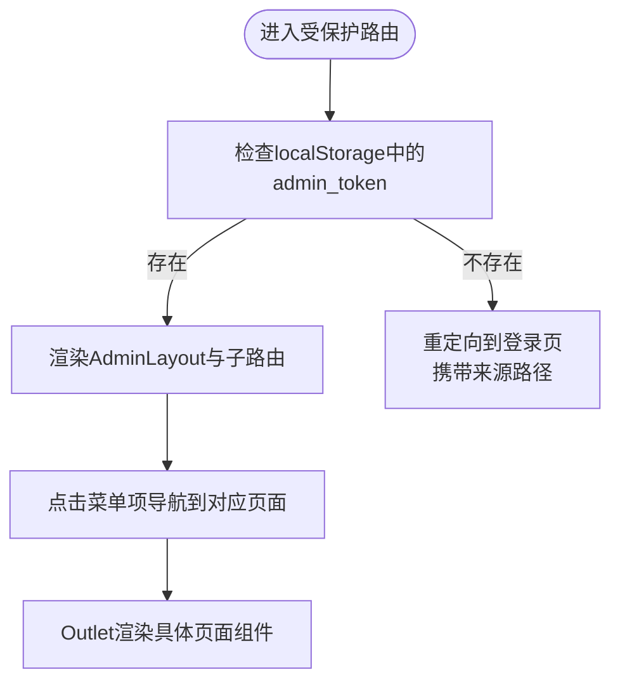
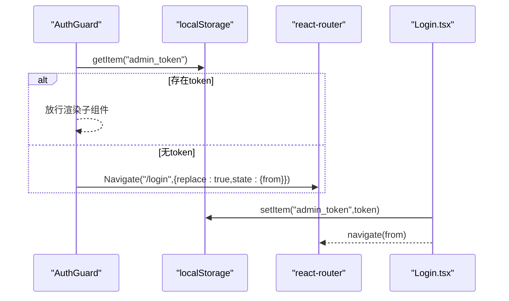
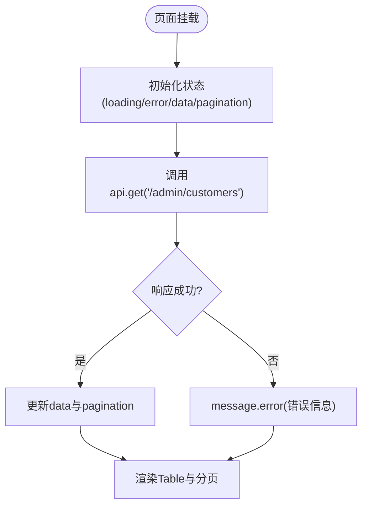
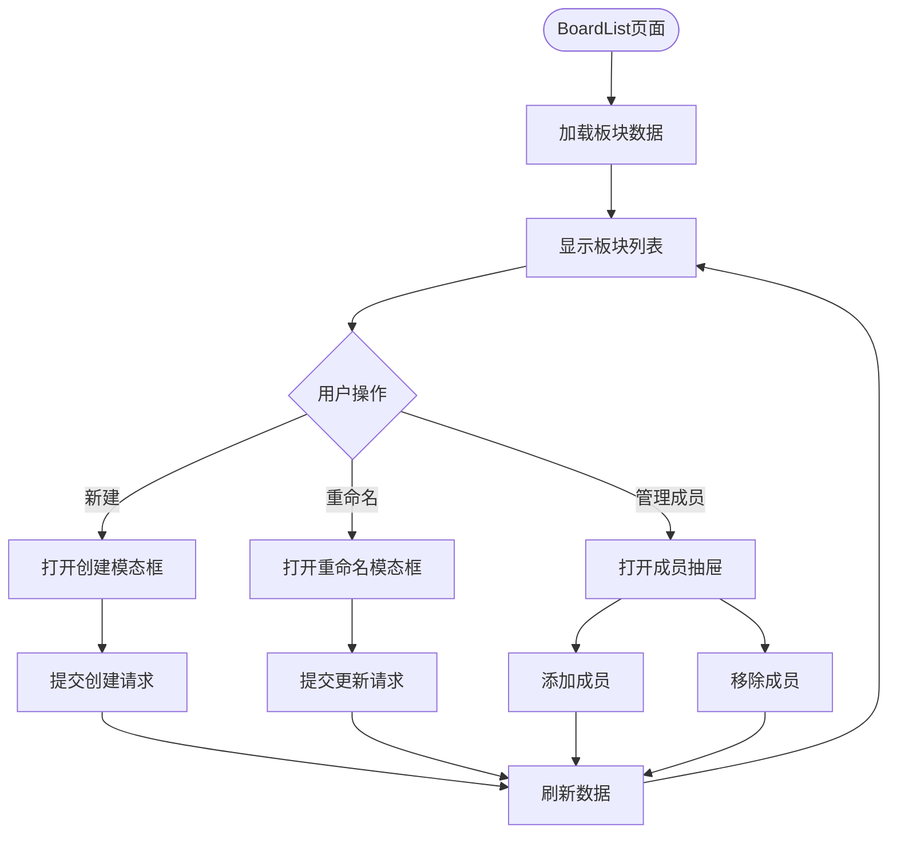
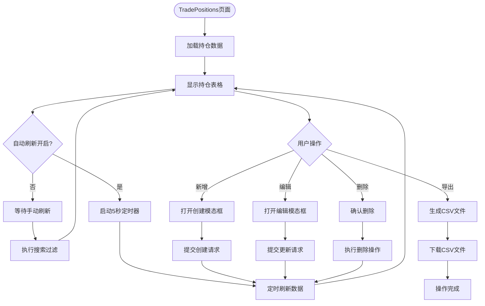
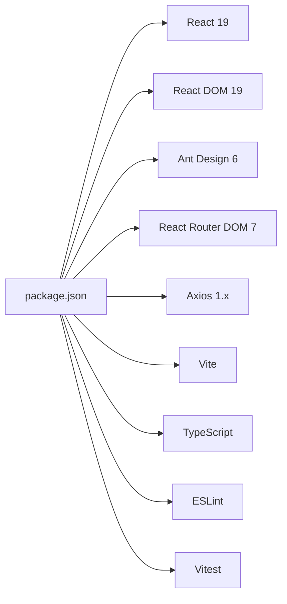

# React管理后台

<cite>
**本文引用的文件**
- [package.json](file://admin-ui/package.json)
- [vite.config.ts](file://admin-ui/vite.config.ts)
- [main.tsx](file://admin-ui/src/main.tsx)
- [App.tsx](file://admin-ui/src/App.tsx)
- [tsconfig.json](file://admin-ui/tsconfig.json)
- [eslint.config.js](file://admin-ui/eslint.config.js)
- [AdminLayout.tsx](file://admin-ui/src/components/AdminLayout.tsx)
- [AuthGuard.tsx](file://admin-ui/src/components/AuthGuard.tsx)
- [Dashboard.tsx](file://admin-ui/src/pages/Dashboard.tsx)
- [Login.tsx](file://admin-ui/src/pages/Login.tsx)
- [CustomerList.tsx](file://admin-ui/src/pages/CustomerList.tsx)
- [CustomerGroups.tsx](file://admin-ui/src/pages/CustomerGroups.tsx)
- [BoardList.tsx](file://admin-ui/src/pages/BoardList.tsx)
- [TradePositions.tsx](file://admin-ui/src/pages/TradePositions.tsx)
- [Orders.tsx](file://admin-ui/src/pages/Orders.tsx)
- [Inquiries.tsx](file://admin-ui/src/pages/Inquiries.tsx)
- [Quotes.tsx](file://admin-ui/src/pages/Quotes.tsx)
- [api.ts](file://admin-ui/src/utils/api.ts)
</cite>

## 更新摘要
**所做更改**
- 新增BoardList板块管理页面，支持股票板块的创建、重命名和成员管理
- 重大重构TradePositions持仓管理页面，从150行扩展到391行，增强功能和用户体验
- 增强CustomerList客户管理功能，新增分组管理和搜索优化
- 新增TradeOrders和TradeInquiries路由别名页面
- 更新路由配置以支持新的板块管理和持仓管理功能

## 目录
1. [简介](#简介)
2. [项目结构](#项目结构)
3. [核心组件](#核心组件)
4. [架构总览](#架构总览)
5. [详细组件分析](#详细组件分析)
6. [新增功能详解](#新增功能详解)
7. [依赖关系分析](#依赖关系分析)
8. [性能考虑](#性能考虑)
9. [故障排除指南](#故障排除指南)
10. [结论](#结论)
11. [附录](#附录)

## 简介
本项目为基于React 19、TypeScript、Vite与Ant Design的管理后台前端工程，采用现代化工具链与组件化架构，提供登录认证、权限守卫、路由布局、状态管理与数据流管理等能力。项目通过Vite提供开发服务器与构建打包，Axios封装统一API调用，Ant Design提供UI组件与主题体系，支持响应式布局与良好的用户体验。

**更新** 本次更新大幅增强了管理后台的核心功能，新增板块管理能力和重构了持仓管理功能，提升了系统的完整性和用户体验。

## 项目结构
- 应用入口与根组件：main.tsx负责挂载应用，App.tsx定义路由与顶层布局。
- 组件层：AdminLayout提供侧边栏导航与头部区域；AuthGuard用于路由级权限校验。
- 页面层：Dashboard、Login、CustomerList、CustomerGroups、BoardList、TradePositions等页面组件，展示业务功能。
- 工具层：api.ts封装Axios客户端、请求/响应拦截器与错误处理。
- 构建与配置：package.json脚本、vite.config.ts代理与开发服务器、tsconfig与eslint配置。

**图表来源**
- [main.tsx](file://admin-ui/src/main.tsx#L1-L14)
- [App.tsx](file://admin-ui/src/App.tsx#L1-L57)
- [AdminLayout.tsx](file://admin-ui/src/components/AdminLayout.tsx#L1-L180)
- [AuthGuard.tsx](file://admin-ui/src/components/AuthGuard.tsx#L1-L20)
- [Login.tsx](file://admin-ui/src/pages/Login.tsx#L1-L78)
- [Dashboard.tsx](file://admin-ui/src/pages/Dashboard.tsx#L1-L134)
- [CustomerList.tsx](file://admin-ui/src/pages/CustomerList.tsx#L1-L313)
- [CustomerGroups.tsx](file://admin-ui/src/pages/CustomerGroups.tsx#L1-L125)
- [BoardList.tsx](file://admin-ui/src/pages/BoardList.tsx#L1-L261)
- [TradePositions.tsx](file://admin-ui/src/pages/TradePositions.tsx#L1-L391)
- [api.ts](file://admin-ui/src/utils/api.ts#L1-L125)
- [vite.config.ts](file://admin-ui/vite.config.ts#L1-L78)
- [tsconfig.json](file://admin-ui/tsconfig.json#L1-L8)
- [eslint.config.js](file://admin-ui/eslint.config.js#L1-L24)

**章节来源**
- [package.json](file://admin-ui/package.json#L1-L38)
- [vite.config.ts](file://admin-ui/vite.config.ts#L1-L78)
- [main.tsx](file://admin-ui/src/main.tsx#L1-L14)
- [App.tsx](file://admin-ui/src/App.tsx#L1-L57)
- [tsconfig.json](file://admin-ui/tsconfig.json#L1-L8)
- [eslint.config.js](file://admin-ui/eslint.config.js#L1-L24)

## 核心组件
- 应用入口与渲染
  - main.tsx使用React 19的createRoot挂载应用，包裹AntdApp以启用通知等全局能力，渲染根组件App。
- 根路由与布局
  - App.tsx使用react-router-dom的BrowserRouter与Routes定义多级路由，顶层由AuthGuard保护，AdminLayout作为受保护区域的容器。
- 布局组件
  - AdminLayout.tsx提供Sider折叠菜单、Header头部区域与Content内容区，内置通知订阅、菜单项与登出逻辑。
- 认证守卫
  - AuthGuard.tsx读取localStorage中的admin_token，无token则跳转至登录页并保留来源路径。
- 登录页
  - Login.tsx使用Ant Design表单进行用户名/密码校验，调用api.post发起登录请求，成功后写入token并跳转。
- 数据访问层
  - api.ts基于Axios创建客户端，设置baseURL与超时，注入请求拦截器携带Authorization，响应拦截器统一处理401与错误信息。
- 页面示例
  - Dashboard.tsx展示统计数据与动态列表，CustomerList.tsx演示分页、搜索、增删改与模态框交互，BoardList.tsx新增板块管理功能。

**章节来源**
- [main.tsx](file://admin-ui/src/main.tsx#L1-L14)
- [App.tsx](file://admin-ui/src/App.tsx#L1-L57)
- [AdminLayout.tsx](file://admin-ui/src/components/AdminLayout.tsx#L1-L180)
- [AuthGuard.tsx](file://admin-ui/src/components/AuthGuard.tsx#L1-L20)
- [Login.tsx](file://admin-ui/src/pages/Login.tsx#L1-L78)
- [Dashboard.tsx](file://admin-ui/src/pages/Dashboard.tsx#L1-L134)
- [CustomerList.tsx](file://admin-ui/src/pages/CustomerList.tsx#L1-L313)
- [BoardList.tsx](file://admin-ui/src/pages/BoardList.tsx#L1-L261)
- [TradePositions.tsx](file://admin-ui/src/pages/TradePositions.tsx#L1-L391)
- [api.ts](file://admin-ui/src/utils/api.ts#L1-L125)

## 架构总览
整体采用"入口渲染 → 路由与守卫 → 布局容器 → 页面组件"的分层架构。数据流自页面组件经api.ts封装的Axios客户端流向后端，响应通过拦截器统一处理，错误信息反馈给用户提示。

**图表来源**
- [Login.tsx](file://admin-ui/src/pages/Login.tsx#L28-L47)
- [api.ts](file://admin-ui/src/utils/api.ts#L57-L80)

**章节来源**
- [App.tsx](file://admin-ui/src/App.tsx#L1-L57)
- [AuthGuard.tsx](file://admin-ui/src/components/AuthGuard.tsx#L1-L20)
- [AdminLayout.tsx](file://admin-ui/src/components/AdminLayout.tsx#L1-L180)
- [api.ts](file://admin-ui/src/utils/api.ts#L1-L125)

## 详细组件分析

### 路由与布局组件
- 路由配置
  - App.tsx在BrowserRouter下定义多级嵌套路由，顶层"/"由AuthGuard保护，内部包含费用管理、客户管理、行情管理、交易管理、消息管理与配置管理等子路由。
- 布局设计
  - AdminLayout.tsx使用Ant Design Layout组件，左侧Sider可折叠，菜单项按模块分组，Header包含折叠按钮与登出操作，Content区域通过Outlet渲染子路由内容。
- 通知系统
  - 通过notificationManager订阅消息并在Header区域显示，提升用户反馈体验。

**图表来源**
- [App.tsx](file://admin-ui/src/App.tsx#L17-L54)
- [AdminLayout.tsx](file://admin-ui/src/components/AdminLayout.tsx#L19-L177)
- [AuthGuard.tsx](file://admin-ui/src/components/AuthGuard.tsx#L8-L17)

**章节来源**
- [App.tsx](file://admin-ui/src/App.tsx#L1-L57)
- [AdminLayout.tsx](file://admin-ui/src/components/AdminLayout.tsx#L1-L180)
- [AuthGuard.tsx](file://admin-ui/src/components/AuthGuard.tsx#L1-L20)

### 认证守卫与权限控制
- 令牌存储与校验
  - AuthGuard读取localStorage中的admin_token，若缺失则重定向至登录页，并通过state记录来源位置。
- 登录流程
  - Login.tsx提交凭据，成功后写入token并跳转至来源页面；失败时通过getApiErrorMessage输出友好错误。
- 会话失效处理
  - api.ts响应拦截器对401进行处理：清除本地token并触发路由跳转至登录页，保证会话安全。

**图表来源**
- [AuthGuard.tsx](file://admin-ui/src/components/AuthGuard.tsx#L8-L17)
- [Login.tsx](file://admin-ui/src/pages/Login.tsx#L28-L47)
- [api.ts](file://admin-ui/src/utils/api.ts#L89-L96)

**章节来源**
- [AuthGuard.tsx](file://admin-ui/src/components/AuthGuard.tsx#L1-L20)
- [Login.tsx](file://admin-ui/src/pages/Login.tsx#L1-L78)
- [api.ts](file://admin-ui/src/utils/api.ts#L1-L125)

### 页面状态管理与数据流
- 状态模式
  - Dashboard使用useState维护统计数据，useEffect在微任务中触发首次拉取，避免重复渲染开销。
  - CustomerList使用useState管理表格数据、分页、搜索关键词与模态框状态，通过useCallback稳定回调，减少子组件重渲染。
  - BoardList新增复杂的分组管理状态，包括模态框状态、抽屉状态和成员管理状态。
  - TradePositions重构后包含自动刷新、搜索过滤、CSV导出等高级功能的状态管理。
- 数据流
  - 页面组件通过api.ts发起HTTP请求，统一错误处理与用户提示；分页参数通过params传递，返回数据映射到表格与分页控件。
- 错误处理
  - getApiErrorMessage根据Axios错误类型与后端返回字段生成用户可读的错误信息，结合Ant Design的message组件反馈。

**图表来源**
- [Dashboard.tsx](file://admin-ui/src/pages/Dashboard.tsx#L29-L46)
- [CustomerList.tsx](file://admin-ui/src/pages/CustomerList.tsx#L62-L84)
- [api.ts](file://admin-ui/src/utils/api.ts#L35-L55)

**章节来源**
- [Dashboard.tsx](file://admin-ui/src/pages/Dashboard.tsx#L1-L134)
- [CustomerList.tsx](file://admin-ui/src/pages/CustomerList.tsx#L1-L313)
- [BoardList.tsx](file://admin-ui/src/pages/BoardList.tsx#L1-L261)
- [TradePositions.tsx](file://admin-ui/src/pages/TradePositions.tsx#L1-L391)
- [api.ts](file://admin-ui/src/utils/api.ts#L1-L125)

### 组件设计模式
- 布局与路由分离：AdminLayout专注于UI布局与导航，App集中定义路由与守卫，职责清晰。
- 受控组件与表单：Login与CustomerList均使用Ant Design表单组件，配合Form.useForm与validateFields实现受控输入与校验。
- 模态框与抽屉：CustomerList通过Modal承载新增/编辑表单，BoardList使用Drawer管理成员列表，减少页面跳转，提升交互效率。
- 通知与反馈：AdminLayout订阅notificationManager，Login与各页面通过message组件即时反馈结果。

**章节来源**
- [AdminLayout.tsx](file://admin-ui/src/components/AdminLayout.tsx#L1-L180)
- [Login.tsx](file://admin-ui/src/pages/Login.tsx#L1-L78)
- [CustomerList.tsx](file://admin-ui/src/pages/CustomerList.tsx#L1-L313)
- [BoardList.tsx](file://admin-ui/src/pages/BoardList.tsx#L1-L261)

### API调用封装与错误处理
- Axios客户端
  - baseURL设为"/api/v1"，统一超时时间；请求拦截器自动附加Authorization头；响应拦截器统一提取data并处理401跳转。
- 错误映射
  - getApiErrorMessage优先从后端返回体提取message字段，其次根据Axios错误类型与状态码生成用户提示，最后回退到默认消息。
- 取消与超时
  - 对请求取消与超时场景进行特殊处理，确保用户获得明确反馈。

**章节来源**
- [api.ts](file://admin-ui/src/utils/api.ts#L1-L125)

## 新增功能详解

### BoardList板块管理功能
BoardList页面提供了完整的股票板块管理能力：

- **板块基础管理**
  - 支持创建新板块、重命名现有板块、删除板块
  - 实时刷新机制，确保数据一致性
  - 响应式表格设计，支持成员数量显示

- **成员管理功能**
  - 通过Drawer抽屉管理板块成员
  - 支持添加股票代码、名称和市场信息
  - 提供成员移除功能，支持批量操作
  - 成员列表以List组件展示，包含操作按钮

- **状态管理**
  - 使用多个useState管理模态框、抽屉和表单状态
  - 通过useCallback优化表单验证和API调用
  - 实现乐观更新，提升用户体验

**图表来源**
- [BoardList.tsx](file://admin-ui/src/pages/BoardList.tsx#L25-L131)

**章节来源**
- [BoardList.tsx](file://admin-ui/src/pages/BoardList.tsx#L1-L261)

### TradePositions持仓管理重构
TradePositions页面经历了重大重构，从简单的列表展示发展为功能完整的持仓管理系统：

- **核心功能增强**
  - 自动刷新机制，支持5秒定时刷新
  - 搜索功能支持客户ID过滤
  - CSV导出功能，支持批量数据下载
  - 完整的增删改查操作

- **高级特性**
  - 实时盈亏计算和收益率显示
  - 成本价与现价对比显示
  - 市值和盈亏的彩色标识
  - 状态标签化显示

- **表单设计**
  - 新增和编辑使用同一套表单
  - 支持多市场（CN/HK/US）和多币种（CNY/USD/HKD）
  - 默认值预填充，提升用户体验
  - 输入验证和错误处理

**图表来源**
- [TradePositions.tsx](file://admin-ui/src/pages/TradePositions.tsx#L27-L103)

**章节来源**
- [TradePositions.tsx](file://admin-ui/src/pages/TradePositions.tsx#L1-L391)

### CustomerList功能增强
CustomerList页面新增了重要的分组管理功能：

- **分组管理集成**
  - 自动加载分组列表，支持动态更新
  - 下拉选择框支持分组标签化显示
  - 创建客户时自动刷新分组列表

- **搜索优化**
  - 支持姓名和手机号双重搜索
  - 实时搜索过滤，提升用户体验
  - 搜索关键词状态管理

- **表单增强**
  - 支持邮箱格式验证
  - 状态选择下拉框
  - 响应式布局设计

**章节来源**
- [CustomerList.tsx](file://admin-ui/src/pages/CustomerList.tsx#L1-L313)

## 依赖关系分析
- 运行时依赖
  - React 19、React DOM 19、Ant Design 6、React Router DOM 7、Axios 1.x。
- 开发依赖
  - Vite、@vitejs/plugin-react、TypeScript、ESLint及其插件、Vitest与jsdom。
- 项目脚本
  - dev、build、lint、test、preview分别对应开发、构建、代码检查、测试与预览。

**图表来源**
- [package.json](file://admin-ui/package.json#L13-L36)

**章节来源**
- [package.json](file://admin-ui/package.json#L1-L38)

## 性能考虑
- 代码分割与懒加载
  - 建议将大型页面组件按路由进行动态导入，减少首屏包体积。
- 图标与组件按需引入
  - 使用Ant Design图标库时按需引入，避免全量引入导致体积增大。
- 请求缓存与防抖
  - 对频繁查询的接口增加本地缓存与防抖策略，降低网络压力。
- 构建优化
  - 在生产构建中开启压缩与Tree Shaking，合理拆分vendor包，利用浏览器缓存策略。
- 状态管理优化
  - 使用useCallback稳定回调函数，减少不必要的组件重渲染。
  - 合理使用useRef管理定时器等外部资源。

## 故障排除指南
- 登录失败
  - 检查后端是否启动、端口配置是否正确；确认代理配置指向正确的后端地址；查看浏览器Network面板与控制台错误。
- 401未授权
  - 确认token是否过期或被清除；检查响应拦截器是否正确触发跳转；确保请求头Authorization正确附加。
- API代理失败
  - 查看vite.config.ts中代理目标与模式配置；开发环境下代理错误会返回JSON格式的错误信息，便于定位问题。
- TypeScript类型错误
  - 检查tsconfig.json的多项目引用配置；确保类型声明与第三方库版本匹配；运行lint检查潜在问题。
- 新增页面功能异常
  - 检查路由配置是否正确；确认API端点是否可用；验证表单验证规则是否正确。
- 自动刷新问题
  - 检查定时器清理逻辑；确认组件卸载时的清理操作；验证API调用频率限制。

**章节来源**
- [vite.config.ts](file://admin-ui/vite.config.ts#L17-L59)
- [api.ts](file://admin-ui/src/utils/api.ts#L78-L120)
- [eslint.config.js](file://admin-ui/eslint.config.js#L1-L24)

## 结论
本项目采用现代前端技术栈，具备清晰的分层架构与完善的认证与数据流机制。通过Ant Design提供一致的UI体验，Axios封装统一API调用，Vite提供高效开发与构建体验。

**更新** 本次重大更新显著增强了管理后台的功能完整性，新增的BoardList板块管理和重构的TradePositions持仓管理页面，为用户提供了更强大的数据管理能力。建议后续在大型页面上引入动态导入与缓存策略，进一步优化性能与用户体验。

## 附录
- 开发与构建命令
  - 开发：npm run dev
  - 构建：npm run build
  - 代码检查：npm run lint
  - 测试：npm run test
  - 预览：npm run preview
- 代理与环境变量
  - 通过VITE_PROXY_MODE切换本地或云端代理目标；FLASK_PORT控制本地后端端口；NODE_ENV影响日志与错误提示。
- 新增页面说明
  - BoardList：股票板块管理，支持创建、重命名、成员管理
  - TradePositions：持仓管理，支持自动刷新、搜索、导出、增删改查
  - CustomerList：客户管理，新增分组功能和搜索优化

**章节来源**
- [package.json](file://admin-ui/package.json#L6-L12)
- [vite.config.ts](file://admin-ui/vite.config.ts#L1-L78)