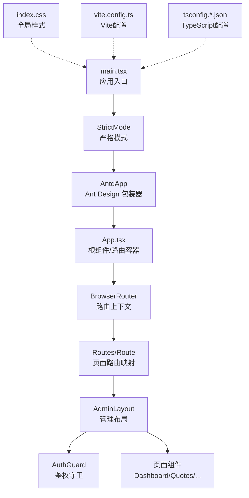
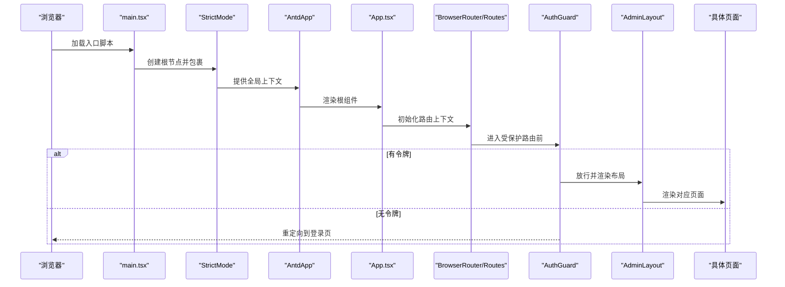

# 应用架构设计

<cite>
**本文引用的文件**
- [main.tsx](file://admin-ui/src/main.tsx)
- [App.tsx](file://admin-ui/src/App.tsx)
- [index.css](file://admin-ui/src/index.css)
- [vite.config.ts](file://admin-ui/vite.config.ts)
- [package.json](file://admin-ui/package.json)
- [tsconfig.json](file://admin-ui/tsconfig.json)
- [tsconfig.app.json](file://admin-ui/tsconfig.app.json)
- [tsconfig.node.json](file://admin-ui/tsconfig.node.json)
- [AdminLayout.tsx](file://admin-ui/src/components/AdminLayout.tsx)
- [AuthGuard.tsx](file://admin-ui/src/components/AuthGuard.tsx)
- [Login.tsx](file://admin-ui/src/pages/Login.tsx)
</cite>

## 目录
1. [引言](#引言)
2. [项目结构](#项目结构)
3. [核心组件](#核心组件)
4. [架构总览](#架构总览)
5. [详细组件分析](#详细组件分析)
6. [依赖分析](#依赖分析)
7. [性能考虑](#性能考虑)
8. [故障排除指南](#故障排除指南)
9. [结论](#结论)
10. [附录](#附录)

## 引言
本文件面向React管理后台应用的架构设计，围绕应用入口点、Ant Design包装器、StrictMode使用、根组件设计模式、应用初始化流程、全局样式与状态配置、Vite构建与TypeScript编译、开发服务器与代理、包管理与依赖版本、构建优化策略、启动流程、性能监控与错误边界等主题进行系统化阐述。文档同时给出架构决策说明、技术选型理由与扩展性考虑，帮助开发者在现有基础上进行维护与演进。

## 项目结构
admin-ui为独立的前端工程，采用Vite + React 19 + TypeScript + Ant Design 6的技术栈。项目通过多配置文件组织开发与构建环境，入口文件负责挂载根组件并包裹AntdApp与StrictMode；路由在根组件中集中声明，配合鉴权守卫与布局组件形成清晰的页面导航与权限控制。

图表来源
- [main.tsx](file://admin-ui/src/main.tsx#L1-L14)
- [App.tsx](file://admin-ui/src/App.tsx#L1-L57)
- [index.css](file://admin-ui/src/index.css#L1-L25)
- [vite.config.ts](file://admin-ui/vite.config.ts#L1-L78)
- [tsconfig.app.json](file://admin-ui/tsconfig.app.json#L1-L30)
- [tsconfig.node.json](file://admin-ui/tsconfig.node.json#L1-L27)

章节来源
- [main.tsx](file://admin-ui/src/main.tsx#L1-L14)
- [App.tsx](file://admin-ui/src/App.tsx#L1-L57)
- [index.css](file://admin-ui/src/index.css#L1-L25)
- [vite.config.ts](file://admin-ui/vite.config.ts#L1-L78)
- [tsconfig.json](file://admin-ui/tsconfig.json#L1-L8)
- [tsconfig.app.json](file://admin-ui/tsconfig.app.json#L1-L30)
- [tsconfig.node.json](file://admin-ui/tsconfig.node.json#L1-L27)

## 核心组件
- 应用入口与渲染链路
  - main.tsx负责创建根节点并以StrictMode包裹，内部再由AntdApp提供全局主题与通知上下文，最终渲染App根组件。
  - 该顺序确保AntdApp的全局能力（如通知、消息、主题）在应用生命周期内可用，并通过StrictMode提升开发期代码质量。
- 根组件与路由体系
  - App.tsx集中声明所有页面路由，包含登录、费用管理、客户管理、行情管理、交易管理、消息管理、配置管理等模块。
  - 使用BrowserRouter与嵌套路由，结合AuthGuard对受保护页面进行鉴权拦截。
- 布局与鉴权
  - AdminLayout提供侧边菜单、顶部栏与内容区Outlet，承载各页面内容。
  - AuthGuard从localStorage读取令牌，无令牌则重定向至登录页。

章节来源
- [main.tsx](file://admin-ui/src/main.tsx#L1-L14)
- [App.tsx](file://admin-ui/src/App.tsx#L1-L57)
- [AdminLayout.tsx](file://admin-ui/src/components/AdminLayout.tsx#L1-L179)
- [AuthGuard.tsx](file://admin-ui/src/components/AuthGuard.tsx#L1-L19)

## 架构总览
下图展示从浏览器加载到页面渲染的关键交互路径，包括入口挂载、路由解析、鉴权判断与页面渲染。

图表来源
- [main.tsx](file://admin-ui/src/main.tsx#L1-L14)
- [App.tsx](file://admin-ui/src/App.tsx#L1-L57)
- [AuthGuard.tsx](file://admin-ui/src/components/AuthGuard.tsx#L1-L19)
- [AdminLayout.tsx](file://admin-ui/src/components/AdminLayout.tsx#L1-L179)

## 详细组件分析

### 应用入口与渲染链路（main.tsx）
- 关键点
  - 使用createRoot在id为root的DOM节点上挂载应用。
  - 通过StrictMode启用额外的开发期校验，有助于提前发现潜在问题。
  - AntdApp作为全局上下文提供者，确保通知、消息等能力在整树生效。
- 设计考量
  - 将AntdApp置于StrictMode内部，既保证了开发期严格检查，又确保Antd全局能力覆盖全应用。
  - 入口仅做“挂载”职责，不承担业务逻辑，便于后续扩展与测试。

章节来源
- [main.tsx](file://admin-ui/src/main.tsx#L1-L14)

### 根组件与路由体系（App.tsx）
- 关键点
  - 使用BrowserRouter与Routes集中声明所有页面路由，支持多模块（费用、客户、行情、交易、消息、配置）。
  - 对登录页提供两条路径，兼顾不同入口。
  - 旧路由兼容保留，便于平滑迁移。
- 设计考量
  - 将路由集中在一处，有利于统一治理与变更追踪。
  - 嵌套路由与子页面组件解耦，便于按模块拆分与维护。

章节来源
- [App.tsx](file://admin-ui/src/App.tsx#L1-L57)

### 布局组件（AdminLayout）
- 关键点
  - 提供折叠/展开的侧边菜单、顶部操作区与内容区Outlet。
  - 使用Ant Design主题与通知上下文，订阅notificationManager推送消息并在顶部右上角显示。
  - 通过useNavigate与useLocation驱动菜单点击与路由跳转。
- 设计考量
  - 将布局与通知机制解耦，利于复用与替换。
  - 顶部区域预留管理员信息与退出登录按钮，便于扩展用户中心。

章节来源
- [AdminLayout.tsx](file://admin-ui/src/components/AdminLayout.tsx#L1-L179)

### 鉴权守卫（AuthGuard）
- 关键点
  - 从localStorage读取令牌，无令牌则重定向至登录页并携带来源地址。
  - 作为路由嵌套的保护层，确保受保护页面不会被未授权访问。
- 设计考量
  - 令牌存储于localStorage，便于前后端分离场景下的会话保持。
  - 可扩展为基于Context或自定义Hook的全局状态管理。

章节来源
- [AuthGuard.tsx](file://admin-ui/src/components/AuthGuard.tsx#L1-L19)

### 登录页（Login）
- 关键点
  - 使用Ant Design表单组件，提交后调用后端认证接口，成功后写入本地令牌并跳转来源页。
  - 使用App.useApp提供的消息组件反馈结果。
- 设计考量
  - 将登录逻辑与UI解耦，便于替换认证方式或对接不同后端。
  - 错误信息通过统一的API错误处理工具函数获取，提升一致性。

章节来源
- [Login.tsx](file://admin-ui/src/pages/Login.tsx#L1-L77)

### Vite 构建与开发服务器配置（vite.config.ts）
- 关键点
  - 插件：使用@vitejs/plugin-react以获得快速刷新与按需编译。
  - 代理：支持本地与云端两种代理模式，自动选择后端目标，超时与错误处理友好。
  - 解析：dedupe去重react与react-dom，避免重复打包。
  - 测试：配置jsdom环境用于单元测试。
  - 开发日志：开发环境下打印API代理目标，便于调试。
- 设计考量
  - 代理配置支持多环境切换，降低联调成本。
  - 通过错误事件回调返回结构化的错误响应，便于前端提示与定位。

章节来源
- [vite.config.ts](file://admin-ui/vite.config.ts#L1-L78)

### TypeScript 编译配置（tsconfig.*）
- 关键点
  - tsconfig.json通过references聚合多个子配置。
  - tsconfig.app.json针对应用源码，启用严格模式与react-jsx。
  - tsconfig.node.json针对Vite配置文件，同样启用严格模式。
- 设计考量
  - 分离应用与Node配置，避免相互影响，提升类型检查准确性。
  - bundler模式与verbatimModuleSyntax确保与现代打包器兼容。

章节来源
- [tsconfig.json](file://admin-ui/tsconfig.json#L1-L8)
- [tsconfig.app.json](file://admin-ui/tsconfig.app.json#L1-L30)
- [tsconfig.node.json](file://admin-ui/tsconfig.node.json#L1-L27)

### 全局样式（index.css）
- 关键点
  - 设置基础字体、抗锯齿与最小宽度。
  - 将html/body/#root高度设为100%，保证布局一致性。
  - body设置背景色与最小宽度，适配移动端与小屏设备。
- 设计考量
  - 采用系统字体链，兼顾跨平台一致性。
  - 为后续引入Antd主题变量留出空间。

章节来源
- [index.css](file://admin-ui/src/index.css#L1-L25)

## 依赖分析
- 运行时依赖
  - React 19、React DOM 19：提供组件模型与渲染能力。
  - react-router-dom 7：提供声明式路由与导航能力。
  - antd 6、@ant-design/icons：提供UI组件库与图标集。
  - axios：提供HTTP客户端能力。
- 开发依赖
  - Vite 7、@vitejs/plugin-react：提供快速开发与热更新。
  - TypeScript ~5.9、@types/*：提供类型支持。
  - ESLint及相关插件：提供代码规范与静态检查。
  - Vitest与jsdom：提供单元测试能力。
- 设计考量
  - 依赖版本均采用语义化版本约束，便于升级与锁定。
  - 通过package.json脚本统一开发、构建、测试与预览流程。

章节来源
- [package.json](file://admin-ui/package.json#L1-L38)

## 性能考虑
- 构建与打包
  - 使用Vite的原生ES模块与按需编译，减少冷启动时间。
  - 通过dedupe去重react与react-dom，避免重复包体积。
- 运行时
  - AntdApp提供全局上下文，减少重复实例化开销。
  - 路由按需加载页面组件，避免一次性加载全部页面。
- 开发体验
  - 代理超时与错误回调提升联调效率，减少等待与困惑。
- 扩展建议
  - 引入懒加载与代码分割，进一步优化首屏加载。
  - 在生产环境开启压缩与资源指纹，提升缓存命中率。

## 故障排除指南
- 代理连接失败
  - 现象：开发环境下出现502错误，提示API代理连接失败。
  - 排查：确认后端服务是否启动、端口是否正确、代理模式是否匹配。
  - 处理：根据错误响应中的目标地址与错误详情调整FLASK_PORT或VITE_PROXY_MODE。
- 登录失败
  - 现象：登录页提示失败或异常。
  - 排查：检查网络请求、后端返回结构与错误信息处理。
  - 处理：使用统一的API错误处理工具函数获取可读错误信息。
- 页面空白或布局错位
  - 现象：页面无法渲染或布局异常。
  - 排查：检查index.css全局样式与Antd主题变量是否冲突。
  - 处理：确认全局样式未被局部样式覆盖，必要时引入CSS Modules或命名空间。

章节来源
- [vite.config.ts](file://admin-ui/vite.config.ts#L21-L59)
- [Login.tsx](file://admin-ui/src/pages/Login.tsx#L28-L47)

## 结论
本架构以Vite+React+Antd为核心，通过严格的入口挂载顺序、集中路由与鉴权守卫、全局样式与上下文包装，构建出清晰、可维护且易于扩展的管理后台前端框架。开发期的代理与错误处理、构建期的模块解析与类型检查，共同保障了开发效率与运行稳定性。后续可在路由懒加载、主题定制、国际化与状态管理等方面继续深化，以满足更复杂的业务需求。

## 附录
- 架构决策说明
  - 选择React 19与Antd 6：兼顾生态成熟度与新特性支持。
  - 选择Vite：提升开发体验与构建速度。
  - 选择StrictMode：强化开发期代码质量。
- 技术选型理由
  - React 19提供更好的并发与性能特性。
  - Antd 6提供丰富的管理后台组件与主题能力。
  - Vite提供更快的冷启动与热更新。
- 扩展性考虑
  - 路由与页面模块化：便于团队协作与功能迭代。
  - 全局上下文与通知：便于统一错误提示与状态管理。
  - 代理与环境变量：便于多环境联调与部署。