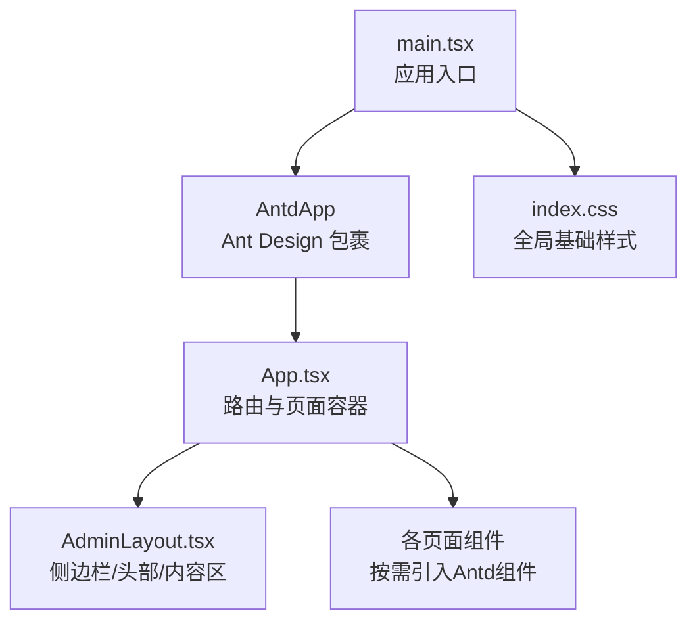
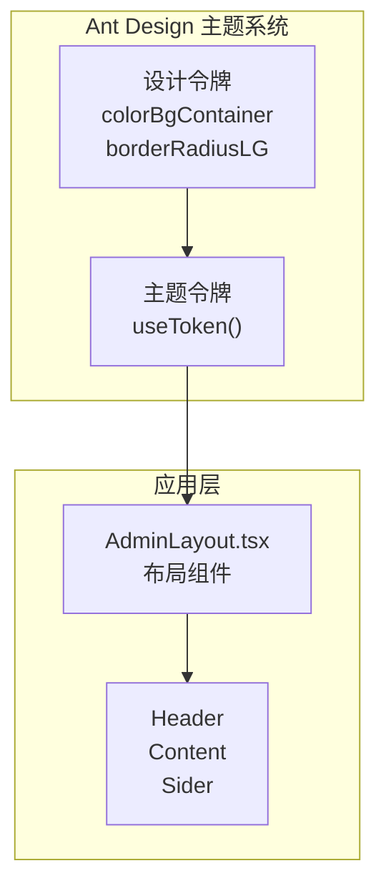
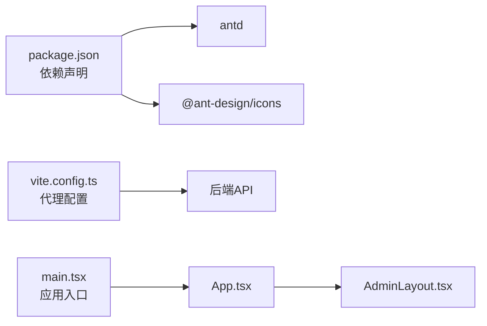

# 样式与主题

<cite>
**本文引用的文件**
- [package.json](file://admin-ui/package.json)
- [vite.config.ts](file://admin-ui/vite.config.ts)
- [main.tsx](file://admin-ui/src/main.tsx)
- [App.tsx](file://admin-ui/src/App.tsx)
- [index.css](file://admin-ui/src/index.css)
- [App.css](file://admin-ui/src/App.css)
- [AdminLayout.tsx](file://admin-ui/src/components/AdminLayout.tsx)
</cite>

## 目录
1. [简介](#简介)
2. [项目结构](#项目结构)
3. [核心组件](#核心组件)
4. [架构总览](#架构总览)
5. [详细组件分析](#详细组件分析)
6. [依赖关系分析](#依赖关系分析)
7. [性能考量](#性能考量)
8. [故障排查指南](#故障排查指南)
9. [结论](#结论)
10. [附录](#附录)

## 简介
本文件面向React管理后台的样式与主题体系，系统梳理CSS架构设计、样式组织原则、主题定制机制与动态切换方案；阐明全局样式配置、组件样式隔离与继承规则；文档化Ant Design主题变量使用方式、自定义主题配置与动态主题切换实践；解释响应式设计实现、媒体查询使用与移动端适配策略；并提供样式性能优化、CSS-in-JS使用与样式调试技巧，以及样式开发规范、命名约定与维护指南，同时覆盖动画效果、过渡效果与视觉反馈设计。

## 项目结构
管理后台采用Vite + React + TypeScript构建，Ant Design作为UI基础库。样式入口位于应用根节点，通过AntdApp包裹应用，Antd内部提供主题令牌与设计规范支持。页面布局由AdminLayout统一承载，菜单、头部与内容区域均使用Ant Design组件，并结合Ant Design提供的主题令牌进行样式定制。

图表来源
- [main.tsx](file://admin-ui/src/main.tsx#L1-L14)
- [App.tsx](file://admin-ui/src/App.tsx#L1-L57)
- [AdminLayout.tsx](file://admin-ui/src/components/AdminLayout.tsx#L1-L180)
- [index.css](file://admin-ui/src/index.css#L1-L25)

章节来源
- [package.json](file://admin-ui/package.json#L1-L38)
- [vite.config.ts](file://admin-ui/vite.config.ts#L1-L78)
- [main.tsx](file://admin-ui/src/main.tsx#L1-L14)
- [App.tsx](file://admin-ui/src/App.tsx#L1-L57)
- [index.css](file://admin-ui/src/index.css#L1-L25)

## 核心组件
- AntdApp：在应用根部包裹AntdApp，确保全局主题上下文生效，为后续主题令牌与组件样式提供统一环境。
- AdminLayout：负责整体布局与主题令牌的使用，包括侧边栏、顶部导航、内容区背景与圆角等，均通过Ant Design提供的主题令牌实现一致的视觉风格。
- 页面路由：App.tsx集中声明所有路由，AdminLayout通过Outlet渲染对应页面内容，形成“布局 + 页面”的组合模式。

章节来源
- [main.tsx](file://admin-ui/src/main.tsx#L1-L14)
- [AdminLayout.tsx](file://admin-ui/src/components/AdminLayout.tsx#L1-L180)
- [App.tsx](file://admin-ui/src/App.tsx#L1-L57)

## 架构总览
Ant Design主题系统通过设计令牌（design tokens）抽象颜色、尺寸、字体、阴影等视觉属性，开发者可在编译期或运行时通过主题配置覆盖默认令牌值，从而实现统一的主题风格与动态切换能力。在本项目中，AdminLayout直接使用theme.useToken()获取当前主题令牌，并将其应用于布局元素的背景、圆角等样式属性，确保与Antd整体风格保持一致。

图表来源
- [AdminLayout.tsx](file://admin-ui/src/components/AdminLayout.tsx#L24-L26)
- [AdminLayout.tsx](file://admin-ui/src/components/AdminLayout.tsx#L162-L170)

## 详细组件分析

### 全局样式与基础配置
- 全局字体与渲染优化：通过:root与body设置字体族、行高、抗锯齿与文本渲染优化，保证跨平台一致性。
- 视口与根元素：#root、html、body高度与宽度均为100%，最小宽度约束，背景色统一为浅灰，便于后续组件覆盖。
- 样式入口：index.css作为全局样式入口，在main.tsx中被应用，AntdApp包裹确保主题上下文生效。

章节来源
- [index.css](file://admin-ui/src/index.css#L1-L25)
- [main.tsx](file://admin-ui/src/main.tsx#L1-L14)

### 组件样式隔离与继承规则
- 样式隔离：Antd组件自带样式边界，配合AntdApp与useToken()的使用，避免样式相互污染。
- 继承规则：AdminLayout通过theme.useToken()获取colorBgContainer与borderRadiusLG等令牌，分别用于内容区背景与圆角，确保与Antd设计系统一致。

章节来源
- [AdminLayout.tsx](file://admin-ui/src/components/AdminLayout.tsx#L24-L26)
- [AdminLayout.tsx](file://admin-ui/src/components/AdminLayout.tsx#L162-L170)

### Ant Design主题变量使用与自定义
- 设计令牌使用：在AdminLayout中直接读取token.colorBgContainer与token.borderRadiusLG，用于内容区背景与圆角，体现Antd设计令牌的使用方式。
- 主题令牌获取：通过theme.useToken()在组件内获取当前主题令牌，无需额外主题Provider即可生效。
- 自定义主题配置：可通过Antd的ConfigProvider或主题编译工具在构建期注入自定义令牌，实现品牌化主题。

章节来源
- [AdminLayout.tsx](file://admin-ui/src/components/AdminLayout.tsx#L24-L26)
- [AdminLayout.tsx](file://admin-ui/src/components/AdminLayout.tsx#L162-L170)

### 动态主题切换机制
- 运行时切换思路：通过Context或状态管理保存当前主题令牌，当用户切换主题时，更新令牌对象并触发组件重渲染，从而实现动态主题切换。
- 构建期切换思路：利用Antd主题编译工具在打包阶段生成不同主题的CSS资源，运行时按需加载对应资源文件。
- 注意事项：动态切换应避免影响第三方组件样式，优先通过令牌覆盖与CSS变量映射实现。

（本节为概念性说明，不直接分析具体文件）

### 响应式设计与移动端适配
- 移动端最小宽度：body设置最小宽度320px，保证小屏设备可正常显示。
- 布局自适应：AdminLayout使用Antd Layout组件，配合flex布局与Antd栅格系统，实现内容区滚动与侧边栏折叠。
- 媒体查询：建议在业务组件中按需添加媒体查询，针对不同断点调整布局密度与字号，以提升移动端体验。

章节来源
- [index.css](file://admin-ui/src/index.css#L22-L24)
- [AdminLayout.tsx](file://admin-ui/src/components/AdminLayout.tsx#L107-L176)

### 样式性能优化
- 减少全局样式冲突：优先使用Antd组件与令牌，避免在全局样式中硬编码颜色与尺寸。
- 按需引入：仅引入所需Antd组件样式，减少打包体积。
- CSS变量与主题令牌：通过令牌与CSS变量实现主题复用，降低重复样式定义。
- 选择器复杂度控制：避免深层后代选择器，提高样式命中效率。

（本节为通用指导，不直接分析具体文件）

### CSS-in-JS 使用与样式调试
- CSS-in-JS建议：在需要动态样式的场景（如根据令牌计算的圆角、背景色）可采用内联样式或styled-components等方案，但需注意与Antd样式体系的协调。
- 调试技巧：使用浏览器开发者工具检查Antd组件的CSS变量映射，定位样式冲突；通过Antd DevTools或日志辅助定位主题令牌使用问题。

（本节为通用指导，不直接分析具体文件）

### 动画效果、过渡与视觉反馈
- 过渡与动画：在布局切换（如侧边栏折叠）与交互反馈（如按钮点击、通知弹出）中，合理使用过渡与动画增强用户体验。
- 视觉反馈：结合Antd的notification与message组件，提供即时、明确的反馈信息。

章节来源
- [AdminLayout.tsx](file://admin-ui/src/components/AdminLayout.tsx#L101-L104)
- [AdminLayout.tsx](file://admin-ui/src/components/AdminLayout.tsx#L28-L40)

## 依赖关系分析
- Ant Design依赖：项目通过package.json引入antd与@ant-design/icons，为UI组件与图标提供基础。
- Vite代理：vite.config.ts配置API代理，保障开发环境下的接口连通性，间接影响样式调试中的网络请求与资源加载。
- 应用入口：main.tsx通过AntdApp包裹App，确保Antd主题上下文贯穿整个应用树。

图表来源
- [package.json](file://admin-ui/package.json#L13-L20)
- [vite.config.ts](file://admin-ui/vite.config.ts#L21-L59)
- [main.tsx](file://admin-ui/src/main.tsx#L1-L14)
- [App.tsx](file://admin-ui/src/App.tsx#L1-L57)
- [AdminLayout.tsx](file://admin-ui/src/components/AdminLayout.tsx#L1-L180)

章节来源
- [package.json](file://admin-ui/package.json#L1-L38)
- [vite.config.ts](file://admin-ui/vite.config.ts#L1-L78)
- [main.tsx](file://admin-ui/src/main.tsx#L1-L14)
- [App.tsx](file://admin-ui/src/App.tsx#L1-L57)

## 性能考量
- 打包体积：按需引入Antd组件与图标，避免引入整库导致体积膨胀。
- 样式体积：减少全局样式与重复样式，优先使用Antd令牌与CSS变量。
- 渲染性能：控制选择器复杂度，避免深度嵌套；在高频交互中使用CSS过渡而非JavaScript动画。

（本节为通用指导，不直接分析具体文件）

## 故障排查指南
- 主题不生效：确认AntdApp是否包裹在main.tsx中；检查AdminLayout中theme.useToken()调用是否正确；核对浏览器CSS变量映射。
- 样式冲突：优先使用Antd组件与令牌，避免在全局样式中硬编码颜色与尺寸；必要时通过局部作用域或CSS Modules隔离。
- 移动端显示异常：检查最小宽度设置与布局容器高度；在业务组件中补充媒体查询断点。

章节来源
- [main.tsx](file://admin-ui/src/main.tsx#L1-L14)
- [AdminLayout.tsx](file://admin-ui/src/components/AdminLayout.tsx#L24-L26)
- [index.css](file://admin-ui/src/index.css#L22-L24)

## 结论
本项目基于Ant Design的设计令牌体系，通过AntdApp与theme.useToken()实现统一的主题风格与组件样式隔离。AdminLayout作为核心布局组件，将主题令牌应用于背景与圆角等关键样式，确保整体视觉一致性。建议在后续迭代中完善动态主题切换、响应式断点与动画反馈，持续优化样式性能与可维护性。

## 附录
- 开发规范与命名约定
  - 组件样式命名：采用语义化命名，避免使用与Antd冲突的类名；优先使用Antd提供的样式类。
  - 变量命名：CSS变量以双短横线前缀，与Antd令牌保持一致；颜色、尺寸、字体等使用语义化变量名。
  - 文件组织：按功能模块划分样式文件，避免全局样式过度耦合。
- 维护指南
  - 定期审查全局样式与第三方组件样式，减少冲突。
  - 在新增页面时，遵循AdminLayout的样式约定，确保主题一致性。
  - 对于动态样式需求，优先考虑Antd令牌与CSS变量，必要时再引入CSS-in-JS方案。

（本节为通用指导，不直接分析具体文件）