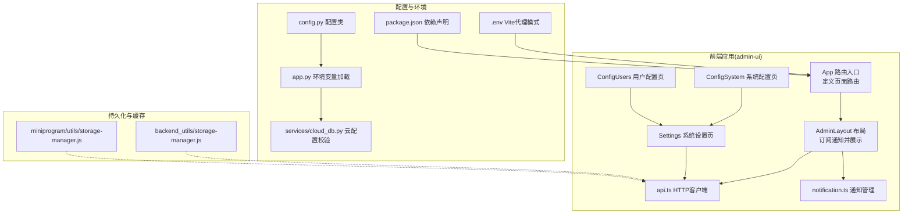
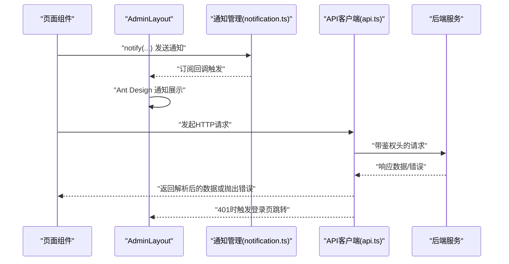
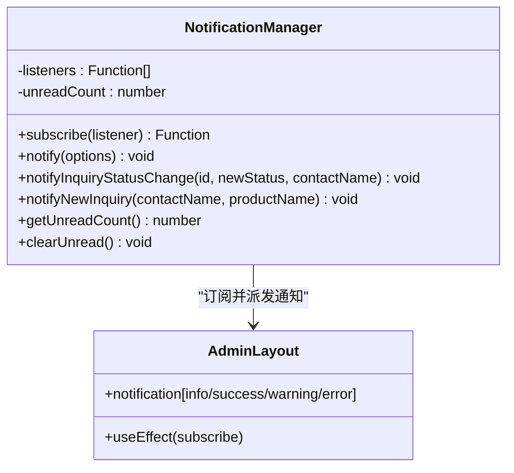
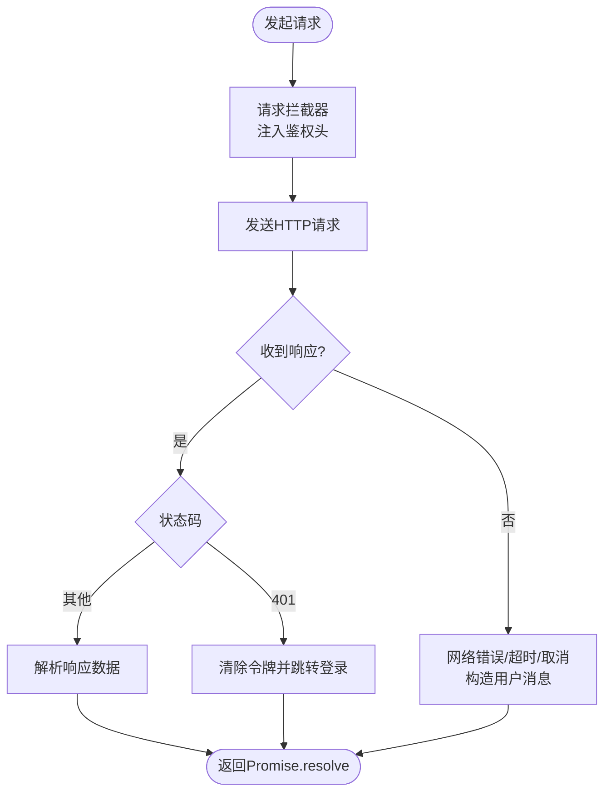
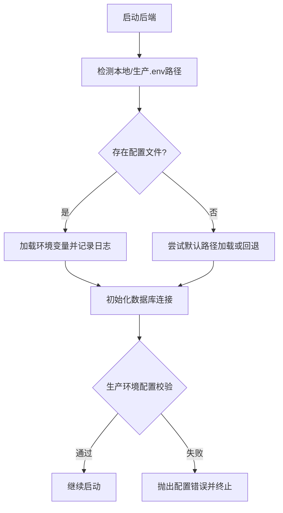
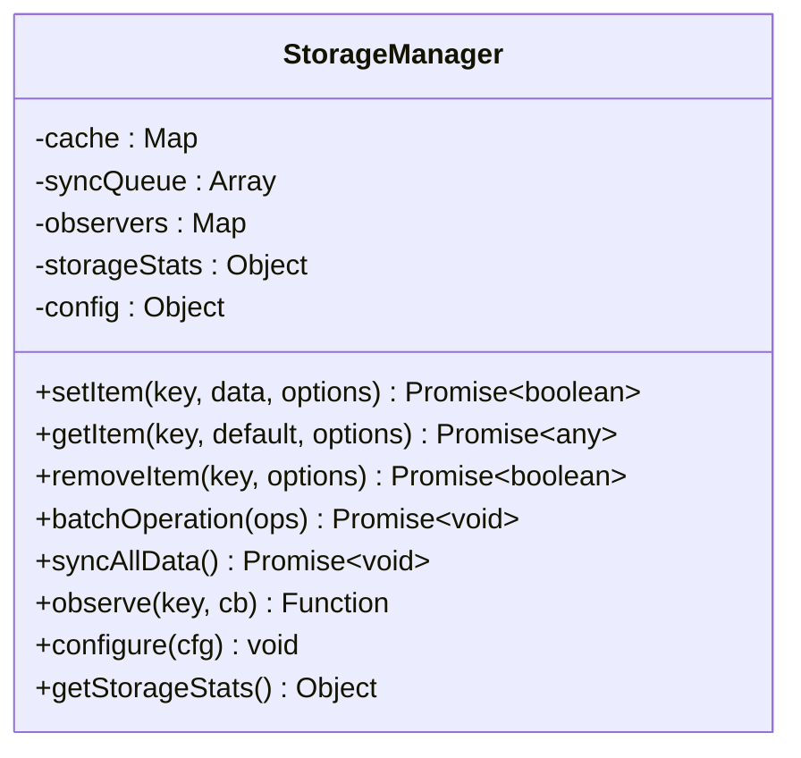
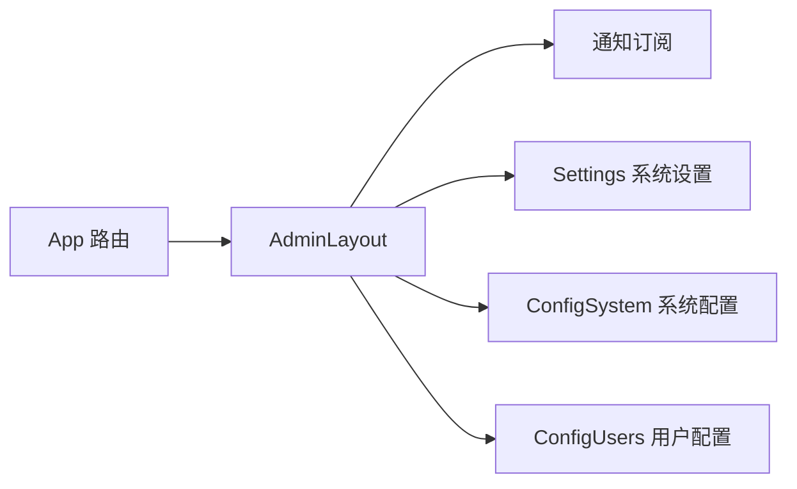
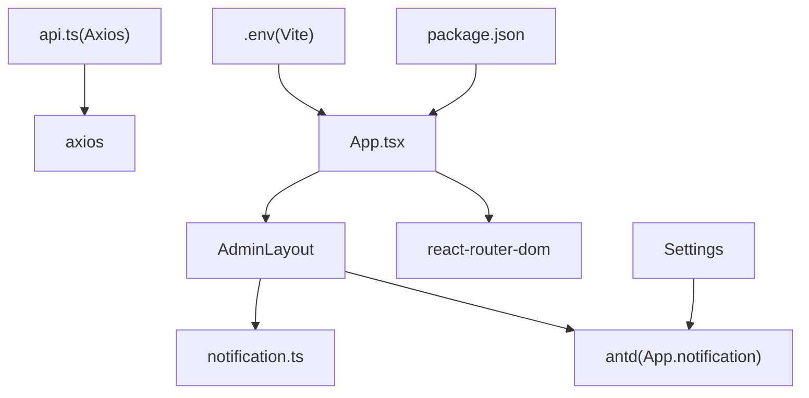

# 状态管理

<cite>
**本文引用的文件**
- [admin-ui/src/App.tsx](file://admin-ui/src/App.tsx)
- [admin-ui/src/components/AdminLayout.tsx](file://admin-ui/src/components/AdminLayout.tsx)
- [admin-ui/src/utils/api.ts](file://admin-ui/src/utils/api.ts)
- [admin-ui/src/utils/notification.ts](file://admin-ui/src/utils/notification.ts)
- [admin-ui/src/pages/Settings.tsx](file://admin-ui/src/pages/Settings.tsx)
- [admin-ui/src/pages/ConfigSystem.tsx](file://admin-ui/src/pages/ConfigSystem.tsx)
- [admin-ui/src/pages/ConfigUsers.tsx](file://admin-ui/src/pages/ConfigUsers.tsx)
- [admin-ui/.env](file://admin-ui/.env)
- [admin-ui/package.json](file://admin-ui/package.json)
- [config.py](file://config.py)
- [app.py](file://app.py)
- [services/cloud_db.py](file://services/cloud_db.py)
- [backend_utils/storage-manager.js](file://backend_utils/storage-manager.js)
- [miniprogram/utils/storage-manager.js](file://miniprogram/utils/storage-manager.js)
</cite>

## 目录
1. [简介](#简介)
2. [项目结构](#项目结构)
3. [核心组件](#核心组件)
4. [架构总览](#架构总览)
5. [详细组件分析](#详细组件分析)
6. [依赖关系分析](#依赖关系分析)
7. [性能考量](#性能考量)
8. [故障排查指南](#故障排查指南)
9. [结论](#结论)
10. [附录](#附录)

## 简介
本文件面向React管理后台，系统性梳理状态管理策略与实现，覆盖以下主题：
- 全局状态管理策略：集中式通知中心、本地状态与远程状态的协调
- API工具模块设计：HTTP请求封装、响应拦截与错误处理
- 通知系统：消息提示机制、订阅与展示层解耦
- 配置管理：环境变量、运行时配置与后端云数据库配置
- 状态持久化与缓存：本地存储、缓存策略与数据同步
- 最佳实践：Context API、自定义Hook、状态订阅模式
- 性能优化与调试方法

## 项目结构
React管理后台位于 admin-ui 目录，采用前端路由组织页面；状态管理相关能力主要由工具模块与布局组件协同实现。

图表来源
- [admin-ui/src/App.tsx](file://admin-ui/src/App.tsx#L1-L57)
- [admin-ui/src/components/AdminLayout.tsx](file://admin-ui/src/components/AdminLayout.tsx#L1-L180)
- [admin-ui/src/utils/api.ts](file://admin-ui/src/utils/api.ts#L1-L125)
- [admin-ui/src/utils/notification.ts](file://admin-ui/src/utils/notification.ts#L1-L84)
- [admin-ui/src/pages/Settings.tsx](file://admin-ui/src/pages/Settings.tsx#L1-L49)
- [admin-ui/src/pages/ConfigSystem.tsx](file://admin-ui/src/pages/ConfigSystem.tsx#L1-L8)
- [admin-ui/src/pages/ConfigUsers.tsx](file://admin-ui/src/pages/ConfigUsers.tsx#L1-L8)
- [admin-ui/.env](file://admin-ui/.env#L1-L2)
- [admin-ui/package.json](file://admin-ui/package.json#L1-L38)
- [config.py](file://config.py#L102-L132)
- [app.py](file://app.py#L43-L72)
- [services/cloud_db.py](file://services/cloud_db.py#L178-L207)
- [backend_utils/storage-manager.js](file://backend_utils/storage-manager.js#L1-L776)
- [miniprogram/utils/storage-manager.js](file://miniprogram/utils/storage-manager.js#L1-L776)

章节来源
- [admin-ui/src/App.tsx](file://admin-ui/src/App.tsx#L1-L57)
- [admin-ui/src/components/AdminLayout.tsx](file://admin-ui/src/components/AdminLayout.tsx#L1-L180)
- [admin-ui/src/utils/api.ts](file://admin-ui/src/utils/api.ts#L1-L125)
- [admin-ui/src/utils/notification.ts](file://admin-ui/src/utils/notification.ts#L1-L84)
- [admin-ui/src/pages/Settings.tsx](file://admin-ui/src/pages/Settings.tsx#L1-L49)
- [admin-ui/src/pages/ConfigSystem.tsx](file://admin-ui/src/pages/ConfigSystem.tsx#L1-L8)
- [admin-ui/src/pages/ConfigUsers.tsx](file://admin-ui/src/pages/ConfigUsers.tsx#L1-L8)
- [admin-ui/.env](file://admin-ui/.env#L1-L2)
- [admin-ui/package.json](file://admin-ui/package.json#L1-L38)
- [config.py](file://config.py#L102-L132)
- [app.py](file://app.py#L43-L72)
- [services/cloud_db.py](file://services/cloud_db.py#L178-L207)
- [backend_utils/storage-manager.js](file://backend_utils/storage-manager.js#L1-L776)
- [miniprogram/utils/storage-manager.js](file://miniprogram/utils/storage-manager.js#L1-L776)

## 核心组件
- 路由与页面组织：通过路由定义页面集合，统一在布局组件中注入通知订阅与展示。
- 通知系统：集中式通知管理器，支持订阅、发送、未读计数与类型化提示。
- API客户端：基于Axios封装，内置请求/响应拦截器、鉴权头注入、401自动跳转、错误消息提取与统一处理。
- 配置与环境：前端通过Vite环境变量控制代理模式；后端通过Flask配置类与环境变量加载，生产环境强制密钥与数据库配置。
- 持久化与缓存：提供通用存储管理器，支持内存缓存、TTL、LRU淘汰、批量操作、同步队列与观察者模式。

章节来源
- [admin-ui/src/App.tsx](file://admin-ui/src/App.tsx#L17-L54)
- [admin-ui/src/components/AdminLayout.tsx](file://admin-ui/src/components/AdminLayout.tsx#L19-L40)
- [admin-ui/src/utils/notification.ts](file://admin-ui/src/utils/notification.ts#L14-L84)
- [admin-ui/src/utils/api.ts](file://admin-ui/src/utils/api.ts#L57-L125)
- [admin-ui/.env](file://admin-ui/.env#L1-L2)
- [config.py](file://config.py#L102-L132)
- [app.py](file://app.py#L43-L72)
- [backend_utils/storage-manager.js](file://backend_utils/storage-manager.js#L7-L34)
- [miniprogram/utils/storage-manager.js](file://miniprogram/utils/storage-manager.js#L7-L34)

## 架构总览
前端采用“布局组件订阅通知 + 页面组件调用API”的模式；通知与API作为横切关注点被注入到布局层，页面组件通过工具模块与后端交互。

图表来源
- [admin-ui/src/components/AdminLayout.tsx](file://admin-ui/src/components/AdminLayout.tsx#L28-L40)
- [admin-ui/src/utils/notification.ts](file://admin-ui/src/utils/notification.ts#L31-L34)
- [admin-ui/src/utils/api.ts](file://admin-ui/src/utils/api.ts#L78-L120)

## 详细组件分析

### 通知系统与消息提示机制
- 设计要点
  - 通知管理器提供订阅接口，布局组件在挂载时订阅，统一消费通知事件并映射到UI组件。
  - 支持不同类型的通知（信息、成功、警告、错误），并可配置持续时间与点击回调。
  - 维护未读计数，便于在导航栏等位置展示。
- 使用方式
  - 页面组件通过通知管理器发送通知，布局组件负责展示。
  - 支持特定场景通知（如询价状态变更、新询价提醒）。

图表来源
- [admin-ui/src/utils/notification.ts](file://admin-ui/src/utils/notification.ts#L14-L84)
- [admin-ui/src/components/AdminLayout.tsx](file://admin-ui/src/components/AdminLayout.tsx#L28-L40)

章节来源
- [admin-ui/src/utils/notification.ts](file://admin-ui/src/utils/notification.ts#L14-L84)
- [admin-ui/src/components/AdminLayout.tsx](file://admin-ui/src/components/AdminLayout.tsx#L28-L40)

### API工具模块与HTTP请求封装
- 设计要点
  - 基于Axios创建客户端，统一基础URL与超时。
  - 请求拦截器：从本地存储读取令牌并注入Authorization头。
  - 响应拦截器：统一解析响应数据、处理401自动跳转、提取友好错误消息、记录错误上下文。
  - 错误处理：区分网络错误、超时、取消、后端错误，并提供统一的用户消息。
- 关键行为
  - 统一的错误消息提取与回退策略。
  - 对取消请求进行特殊标记，避免误报为业务错误。
  - 在无响应时给出明确的网络连接提示。

图表来源
- [admin-ui/src/utils/api.ts](file://admin-ui/src/utils/api.ts#L57-L125)

章节来源
- [admin-ui/src/utils/api.ts](file://admin-ui/src/utils/api.ts#L1-L125)

### 配置管理与环境变量处理
- 前端
  - Vite环境变量：通过.env控制代理模式等运行参数。
  - 依赖声明：前端依赖包括React、Ant Design、Axios、路由等。
- 后端
  - Flask配置类：开发、生产、测试三套配置，生产环境强制密钥与数据库配置。
  - 环境变量加载：优先加载本地/生产配置文件，否则回退到默认路径；记录日志并输出关键变量状态。
  - 云数据库配置：从环境变量读取并校验，缺失或格式不合法时抛出异常。

图表来源
- [app.py](file://app.py#L43-L72)
- [config.py](file://config.py#L102-L132)
- [services/cloud_db.py](file://services/cloud_db.py#L178-L207)

章节来源
- [admin-ui/.env](file://admin-ui/.env#L1-L2)
- [admin-ui/package.json](file://admin-ui/package.json#L13-L36)
- [app.py](file://app.py#L43-L72)
- [config.py](file://config.py#L102-L132)
- [services/cloud_db.py](file://services/cloud_db.py#L178-L207)

### 状态持久化、缓存策略与数据同步
- 存储管理器
  - 内存缓存 + TTL：支持默认TTL、最大缓存条目、LRU淘汰。
  - 同步队列：定时批量同步到持久化存储，支持重试与统计。
  - 观察者模式：对数据变化进行观察与通知。
  - 批量操作：支持批量写入、删除与同步。
  - 统计指标：命中、未命中、错误、同步成功/失败等。
- 应用场景
  - 前端页面可结合存储管理器做本地缓存与离线兜底。
  - 后端工具模块可作为通用持久化与同步能力复用。

图表来源
- [backend_utils/storage-manager.js](file://backend_utils/storage-manager.js#L7-L34)
- [miniprogram/utils/storage-manager.js](file://miniprogram/utils/storage-manager.js#L7-L34)

章节来源
- [backend_utils/storage-manager.js](file://backend_utils/storage-manager.js#L1-L776)
- [miniprogram/utils/storage-manager.js](file://miniprogram/utils/storage-manager.js#L1-L776)

### 页面与路由中的状态协调
- 路由入口：集中定义页面路由，统一包裹认证守卫与布局。
- 设置页：系统设置表单，演示保存按钮的提示（演示模式下不实际保存）。
- 配置页：系统配置与用户配置页面，均复用设置组件。

图表来源
- [admin-ui/src/App.tsx](file://admin-ui/src/App.tsx#L17-L54)
- [admin-ui/src/components/AdminLayout.tsx](file://admin-ui/src/components/AdminLayout.tsx#L19-L40)
- [admin-ui/src/pages/Settings.tsx](file://admin-ui/src/pages/Settings.tsx#L6-L13)
- [admin-ui/src/pages/ConfigSystem.tsx](file://admin-ui/src/pages/ConfigSystem.tsx#L1-L8)
- [admin-ui/src/pages/ConfigUsers.tsx](file://admin-ui/src/pages/ConfigUsers.tsx#L1-L8)

章节来源
- [admin-ui/src/App.tsx](file://admin-ui/src/App.tsx#L1-L57)
- [admin-ui/src/pages/Settings.tsx](file://admin-ui/src/pages/Settings.tsx#L1-L49)
- [admin-ui/src/pages/ConfigSystem.tsx](file://admin-ui/src/pages/ConfigSystem.tsx#L1-L8)
- [admin-ui/src/pages/ConfigUsers.tsx](file://admin-ui/src/pages/ConfigUsers.tsx#L1-L8)

## 依赖关系分析
- 组件耦合
  - AdminLayout 依赖通知管理器，形成“通知发布-订阅”解耦。
  - 页面组件通过API工具模块与后端交互，避免在各页面重复封装。
- 外部依赖
  - Axios：HTTP请求与拦截器。
  - Ant Design：通知与表单组件。
  - React Router：页面路由与导航。
- 运行时配置
  - 前端：Vite环境变量控制代理模式。
  - 后端：Flask配置类按环境切换，生产环境强制密钥与数据库配置。

图表来源
- [admin-ui/src/utils/api.ts](file://admin-ui/src/utils/api.ts#L1-L1)
- [admin-ui/src/components/AdminLayout.tsx](file://admin-ui/src/components/AdminLayout.tsx#L1-L23)
- [admin-ui/src/App.tsx](file://admin-ui/src/App.tsx#L1-L16)
- [admin-ui/src/pages/Settings.tsx](file://admin-ui/src/pages/Settings.tsx#L1-L7)
- [admin-ui/.env](file://admin-ui/.env#L1-L2)
- [admin-ui/package.json](file://admin-ui/package.json#L13-L36)

章节来源
- [admin-ui/src/utils/api.ts](file://admin-ui/src/utils/api.ts#L1-L125)
- [admin-ui/src/components/AdminLayout.tsx](file://admin-ui/src/components/AdminLayout.tsx#L1-L180)
- [admin-ui/src/App.tsx](file://admin-ui/src/App.tsx#L1-L57)
- [admin-ui/src/pages/Settings.tsx](file://admin-ui/src/pages/Settings.tsx#L1-L49)
- [admin-ui/.env](file://admin-ui/.env#L1-L2)
- [admin-ui/package.json](file://admin-ui/package.json#L1-L38)

## 性能考量
- 请求与响应拦截
  - 合理设置超时与重试策略，避免长时间阻塞UI。
  - 在响应拦截器中尽早解析数据，减少后续组件的二次转换开销。
- 缓存与同步
  - 使用TTL与LRU控制内存占用，避免无限增长。
  - 批量同步与重试策略降低网络抖动带来的影响。
- UI渲染
  - 通知订阅在布局组件中集中处理，避免每个页面重复绑定。
  - 表单保存演示模式提示，减少不必要的网络请求。

## 故障排查指南
- API错误定位
  - 查看响应拦截器输出的错误上下文（状态码、方法、URL、用户消息）。
  - 区分网络错误、超时、取消与后端错误，依据错误类型采取不同处理。
- 登录态失效
  - 401时会自动清除本地令牌并跳转登录页，检查令牌是否过期或被撤销。
- 环境变量问题
  - 后端启动日志会打印环境变量加载情况，确认密钥与数据库配置是否满足生产环境要求。
  - 云数据库配置缺失或格式不合法会抛出异常，检查WX_CLOUD_ENV、WX_APPID、WX_SECRET。

章节来源
- [admin-ui/src/utils/api.ts](file://admin-ui/src/utils/api.ts#L78-L120)
- [app.py](file://app.py#L43-L72)
- [config.py](file://config.py#L102-L132)
- [services/cloud_db.py](file://services/cloud_db.py#L178-L207)

## 结论
本项目通过“布局组件订阅通知 + 工具模块封装API”的方式，实现了清晰的全局状态与消息提示机制；配合Axios拦截器与统一错误处理，提升了前后端交互的一致性与可靠性。后端配置与环境变量加载确保了生产环境的安全与稳定。持久化与缓存模块提供了可扩展的数据持久化能力，适合在前端或后端场景复用。

## 附录
- 最佳实践
  - 使用自定义Hook封装API调用与状态订阅，提升复用性与可测试性。
  - 对高频请求启用缓存与去重，避免重复网络请求。
  - 在布局层集中处理全局通知与权限跳转，保持页面组件职责单一。
- 调试方法
  - 利用响应拦截器输出的错误上下文快速定位问题。
  - 在开发环境开启严格模式与日志，生产环境保留必要的错误上报。