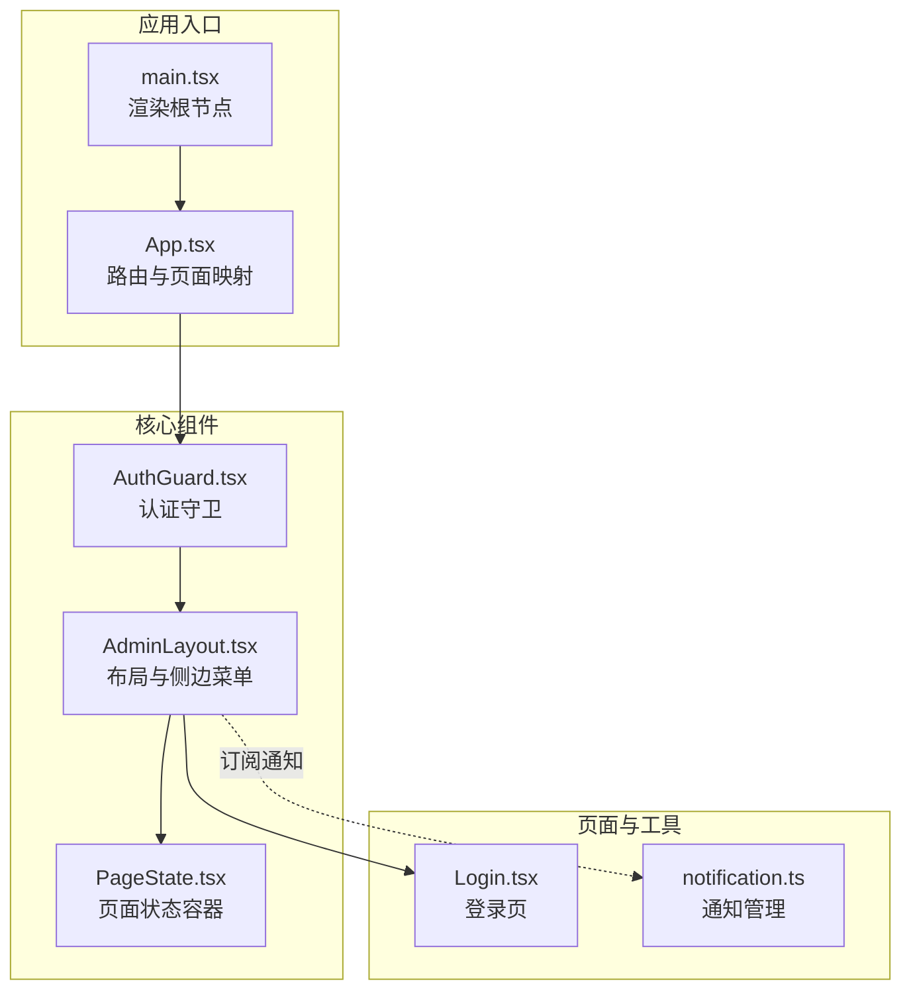
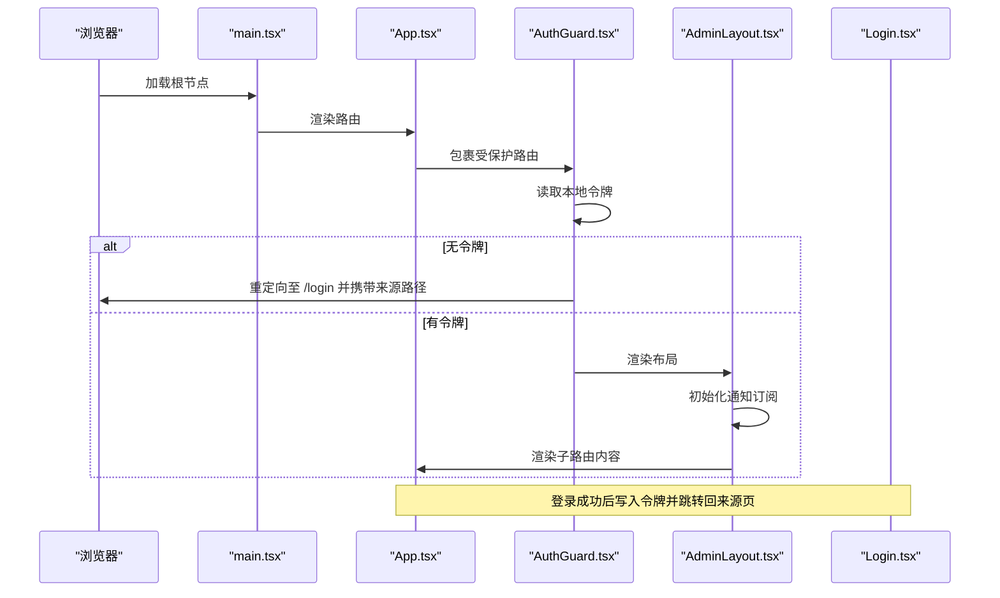
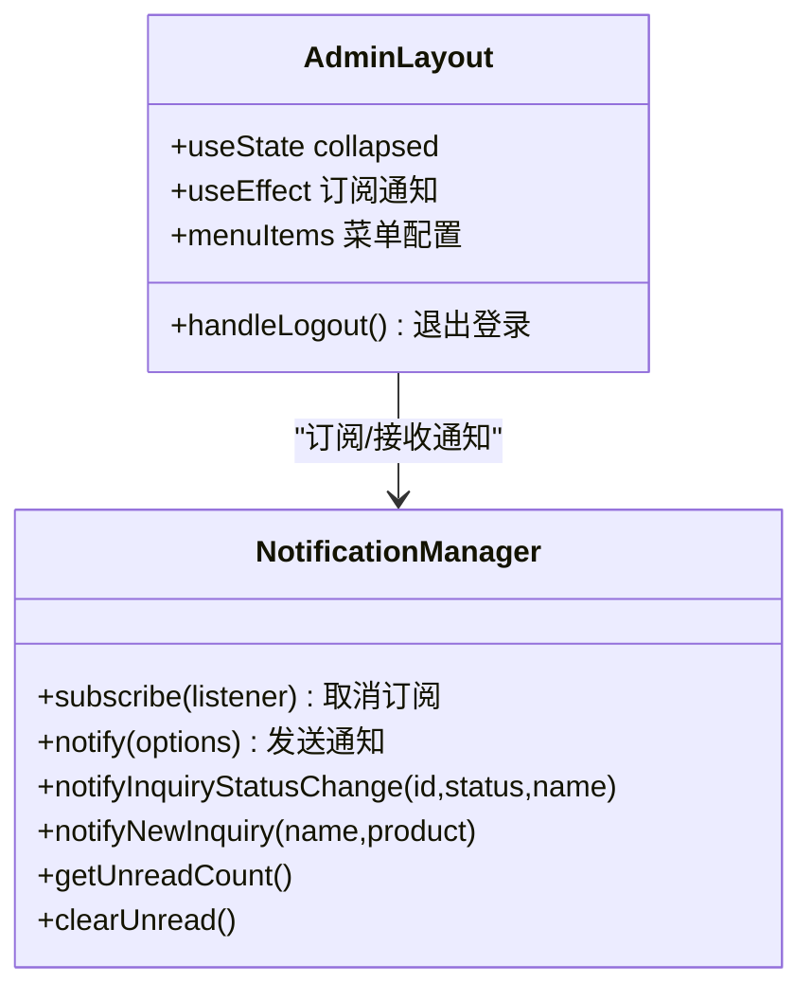
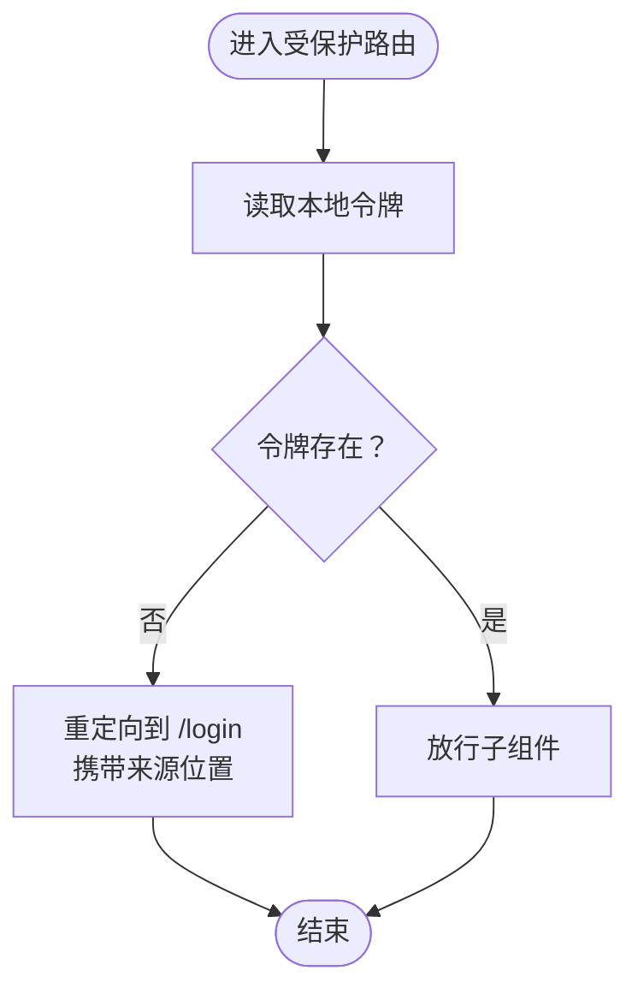
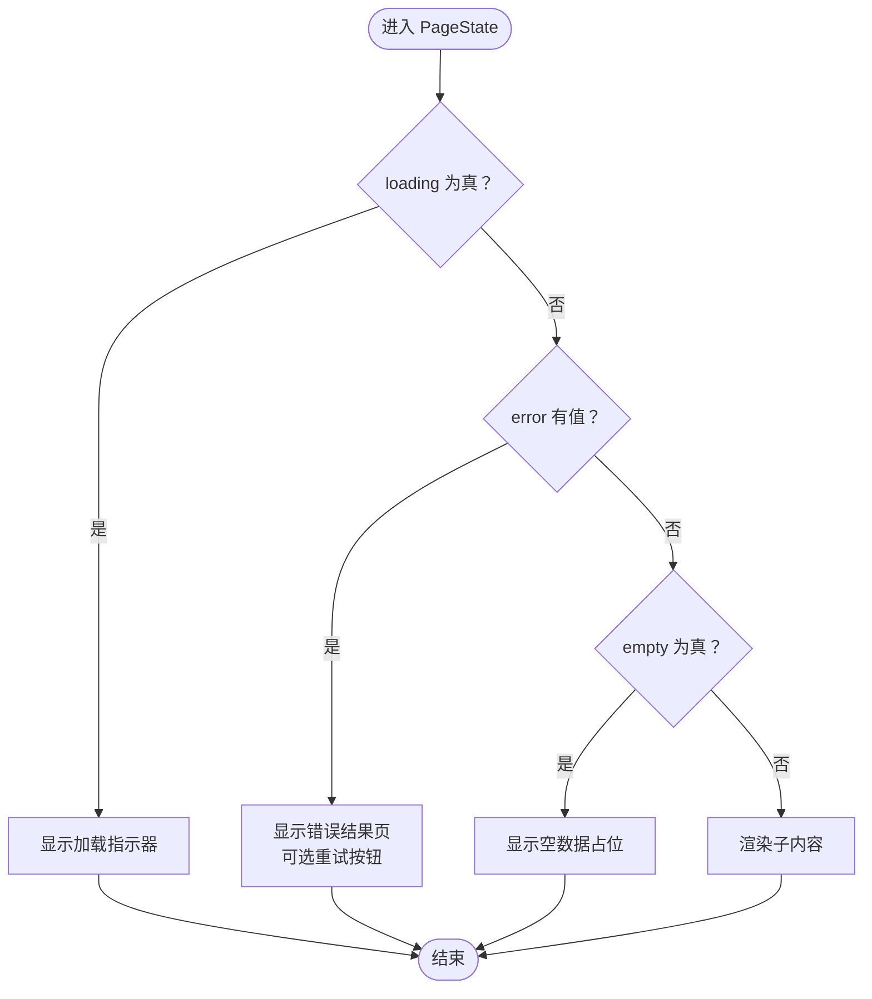
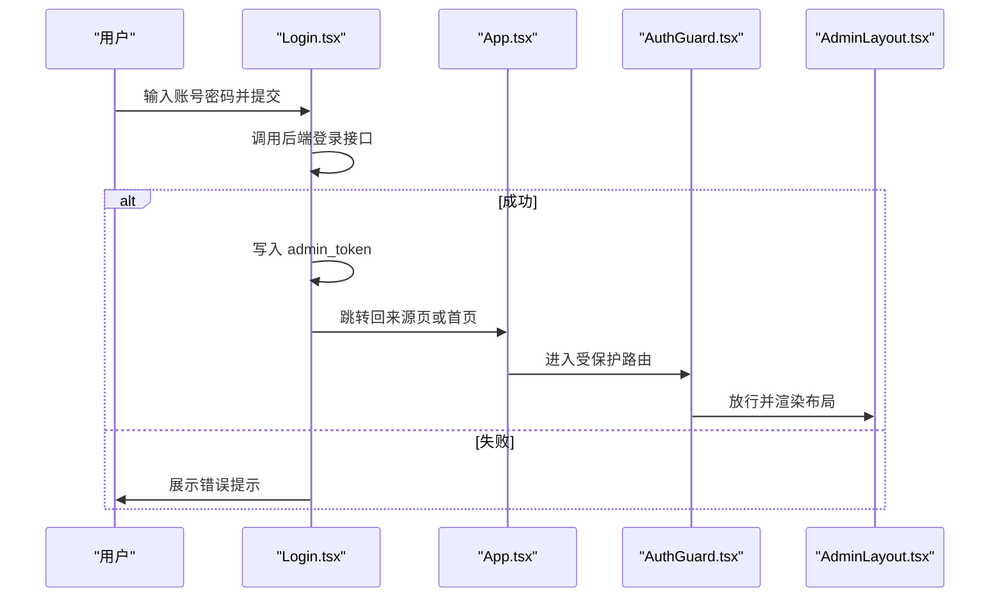
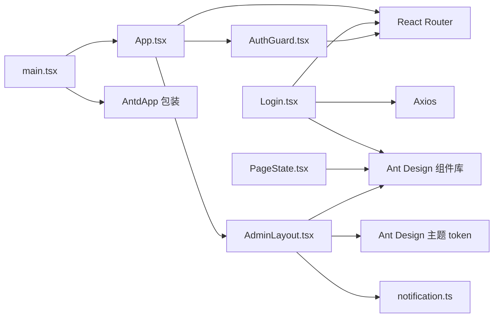

# 组件系统

<cite>
**本文引用的文件**   
- [AdminLayout.tsx](file://admin-ui/src/components/AdminLayout.tsx)
- [AuthGuard.tsx](file://admin-ui/src/components/AuthGuard.tsx)
- [PageState.tsx](file://admin-ui/src/components/PageState.tsx)
- [App.tsx](file://admin-ui/src/App.tsx)
- [main.tsx](file://admin-ui/src/main.tsx)
- [Login.tsx](file://admin-ui/src/pages/Login.tsx)
- [notification.ts](file://admin-ui/src/utils/notification.ts)
- [index.css](file://admin-ui/src/index.css)
- [package.json](file://admin-ui/package.json)
</cite>

## 目录
1. [简介](#简介)
2. [项目结构](#项目结构)
3. [核心组件](#核心组件)
4. [架构总览](#架构总览)
5. [组件详解](#组件详解)
6. [依赖关系分析](#依赖关系分析)
7. [性能考量](#性能考量)
8. [故障排查指南](#故障排查指南)
9. [结论](#结论)
10. [附录](#附录)

## 简介
本文件系统性梳理 React 管理后台的组件体系，重点覆盖以下方面：
- AdminLayout.tsx 布局组件：设计模式、响应式布局、主题定制与通知集成
- AuthGuard.tsx 认证守卫：令牌校验、路由保护与返回路径保留
- PageState.tsx 页面状态管理：加载、错误、空态与重试机制
- 组件设计原则、Props 接口与事件处理
- 复用策略、样式封装与性能优化
- 开发最佳实践、测试策略与维护指南

## 项目结构
该管理后台采用前端单页应用（SPA）架构，基于 React 19、React Router 7、Ant Design 6 与 Vite 构建。核心入口在 main.tsx，路由在 App.tsx 中集中声明；布局、认证守卫与页面状态组件位于 components 目录；页面组件与工具类分别位于 pages 与 utils。

图表来源
- [main.tsx](file://admin-ui/src/main.tsx#L1-L14)
- [App.tsx](file://admin-ui/src/App.tsx#L1-L57)
- [AdminLayout.tsx](file://admin-ui/src/components/AdminLayout.tsx#L1-L180)
- [AuthGuard.tsx](file://admin-ui/src/components/AuthGuard.tsx#L1-L20)
- [PageState.tsx](file://admin-ui/src/components/PageState.tsx#L1-L44)
- [Login.tsx](file://admin-ui/src/pages/Login.tsx#L1-L78)
- [notification.ts](file://admin-ui/src/utils/notification.ts#L1-L84)

章节来源
- [main.tsx](file://admin-ui/src/main.tsx#L1-L14)
- [App.tsx](file://admin-ui/src/App.tsx#L1-L57)
- [package.json](file://admin-ui/package.json#L1-L38)

## 核心组件
- AdminLayout：提供侧边栏导航、顶部操作区与主内容区，集成 Ant Design 主题与通知订阅
- AuthGuard：基于本地令牌进行路由级访问控制
- PageState：统一处理页面加载、错误与空数据场景，支持重试

章节来源
- [AdminLayout.tsx](file://admin-ui/src/components/AdminLayout.tsx#L1-L180)
- [AuthGuard.tsx](file://admin-ui/src/components/AuthGuard.tsx#L1-L20)
- [PageState.tsx](file://admin-ui/src/components/PageState.tsx#L1-L44)

## 架构总览
下图展示了从应用启动到路由渲染、认证守卫拦截与布局装配的关键流程：

图表来源
- [main.tsx](file://admin-ui/src/main.tsx#L1-L14)
- [App.tsx](file://admin-ui/src/App.tsx#L1-L57)
- [AuthGuard.tsx](file://admin-ui/src/components/AuthGuard.tsx#L1-L20)
- [AdminLayout.tsx](file://admin-ui/src/components/AdminLayout.tsx#L1-L180)
- [Login.tsx](file://admin-ui/src/pages/Login.tsx#L1-L78)

## 组件详解

### AdminLayout.tsx 布局组件
- 设计模式
  - 使用 Ant Design Layout/Sider/Header/Content 组合，形成标准后台布局骨架
  - 通过 Outlet 承载子路由内容，实现“布局+页面”的解耦
  - 使用 Ant Design 主题 token 控制背景与圆角，保证一致的主题风格
- 响应式布局
  - 侧边栏可折叠，标题在折叠时显示缩写，适配窄屏设备
  - 内容区域自动填充剩余空间，并设置最小高度以避免布局塌陷
- 主题定制
  - 通过 theme.useToken 获取颜色与圆角变量，应用于容器背景与内容区圆角
  - 侧边栏使用深色主题，配合自定义背景色与分隔线增强视觉层次
- 通知集成
  - 在组件挂载时订阅 notificationManager，将通知推送到 Ant Design 通知组件
  - 支持不同类型通知（信息、成功、警告、错误），并可点击回调
- 交互与导航
  - 顶部触发按钮切换侧边栏折叠状态
  - 顶部右上角显示管理员身份与退出登录按钮
  - 侧边菜单项点击后通过 useNavigate 导航到对应路由

图表来源
- [AdminLayout.tsx](file://admin-ui/src/components/AdminLayout.tsx#L1-L180)
- [notification.ts](file://admin-ui/src/utils/notification.ts#L1-L84)

章节来源
- [AdminLayout.tsx](file://admin-ui/src/components/AdminLayout.tsx#L1-L180)
- [notification.ts](file://admin-ui/src/utils/notification.ts#L1-L84)

### AuthGuard.tsx 认证守卫
- 工作机制
  - 读取本地存储中的 admin_token
  - 若不存在则重定向到登录页，并将当前来源位置作为 state 传入
  - 存在则放行子组件（通常是 AdminLayout）
- 权限验证流程
  - 令牌存在即视为已认证，不涉及后端校验
  - 适合本地令牌型鉴权或轻量安全场景
- 路由保护策略
  - 将 AuthGuard 作为受保护路由的父级包装器
  - 登录成功后根据 state.from 进行精准回跳

图表来源
- [AuthGuard.tsx](file://admin-ui/src/components/AuthGuard.tsx#L1-L20)
- [Login.tsx](file://admin-ui/src/pages/Login.tsx#L1-L78)

章节来源
- [AuthGuard.tsx](file://admin-ui/src/components/AuthGuard.tsx#L1-L20)
- [Login.tsx](file://admin-ui/src/pages/Login.tsx#L1-L78)

### PageState.tsx 页面状态管理
- 功能职责
  - loading：显示大号加载指示器，居中展示
  - error：展示错误结果页，可选重试按钮
  - empty：展示空数据占位
  - children：默认渲染实际页面内容
- Props 接口
  - loading?: boolean
  - error?: string | null
  - empty?: boolean
  - onRetry?: () => void
  - children: React.ReactNode
- 事件处理
  - onRetry 回调用于触发重新加载或刷新逻辑
- 复用策略
  - 作为页面容器组件，统一处理三态与重试，减少页面重复逻辑
  - 可与查询状态管理库（如 React Query、SWR）结合使用

图表来源
- [PageState.tsx](file://admin-ui/src/components/PageState.tsx#L1-L44)

章节来源
- [PageState.tsx](file://admin-ui/src/components/PageState.tsx#L1-L44)

### 登录流程与路由保护联动
- 登录页 Login.tsx
  - 表单提交后调用后端接口，成功后写入 admin_token
  - 使用 message 提示成功或失败
  - 根据 state.from 或默认首页进行回跳
- 路由保护
  - App.tsx 中将 AdminLayout 包裹在 AuthGuard 下
  - 未登录访问受保护路由会被拦截到登录页

图表来源
- [Login.tsx](file://admin-ui/src/pages/Login.tsx#L1-L78)
- [App.tsx](file://admin-ui/src/App.tsx#L1-L57)
- [AuthGuard.tsx](file://admin-ui/src/components/AuthGuard.tsx#L1-L20)
- [AdminLayout.tsx](file://admin-ui/src/components/AdminLayout.tsx#L1-L180)

章节来源
- [Login.tsx](file://admin-ui/src/pages/Login.tsx#L1-L78)
- [App.tsx](file://admin-ui/src/App.tsx#L1-L57)

## 依赖关系分析
- 组件依赖
  - AdminLayout 依赖 Ant Design 布局组件、图标与主题系统，同时依赖 notificationManager 订阅通知
  - AuthGuard 依赖 React Router 的 useLocation 与 Navigate
  - PageState 依赖 Ant Design 的 Spin、Result、Empty 与 Button
- 外部依赖
  - React 19、React Router 7、Ant Design 6、Axios
- 构建与工具
  - Vite、TypeScript、ESLint、Vitest

图表来源
- [AdminLayout.tsx](file://admin-ui/src/components/AdminLayout.tsx#L1-L180)
- [AuthGuard.tsx](file://admin-ui/src/components/AuthGuard.tsx#L1-L20)
- [PageState.tsx](file://admin-ui/src/components/PageState.tsx#L1-L44)
- [Login.tsx](file://admin-ui/src/pages/Login.tsx#L1-L78)
- [App.tsx](file://admin-ui/src/App.tsx#L1-L57)
- [main.tsx](file://admin-ui/src/main.tsx#L1-L14)
- [notification.ts](file://admin-ui/src/utils/notification.ts#L1-L84)
- [package.json](file://admin-ui/package.json#L1-L38)

章节来源
- [package.json](file://admin-ui/package.json#L1-L38)

## 性能考量
- 组件拆分与懒加载
  - 将大型页面按路由拆分，利用 React Router 的动态导入实现按需加载
- 渲染优化
  - 使用 React.memo、useMemo、useCallback 减少不必要的重渲染
  - 对于高频交互的菜单与表格，优先使用虚拟滚动与分页
- 状态管理
  - 页面级状态使用 PageState 统一封装，避免在多处重复处理三态
- 图标与主题
  - Ant Design 图标按需引入，避免打包多余资源
  - 主题 token 仅在需要的容器内使用，降低样式计算开销
- 网络与缓存
  - 登录成功后写入令牌，减少重复登录带来的网络往返
  - 对于频繁访问的数据，考虑本地缓存与失效策略

## 故障排查指南
- 登录后无法进入后台
  - 检查本地是否正确写入 admin_token
  - 确认 AuthGuard 是否包裹在受保护路由上
  - 查看控制台是否有路由重定向异常
- 通知不显示
  - 确认 AdminLayout 是否在挂载时订阅 notificationManager
  - 检查通知类型与参数是否符合通知管理器规范
- 页面空白或布局错乱
  - 检查 AntdApp 是否包裹在 main.tsx 根节点
  - 确认 index.css 中根元素高度与宽度设置
- 错误与空数据处理
  - 使用 PageState 的 error 与 empty 字段快速定位问题
  - 为空时确认数据源是否为空，错误时查看 onRetry 回调是否正确绑定

章节来源
- [AuthGuard.tsx](file://admin-ui/src/components/AuthGuard.tsx#L1-L20)
- [AdminLayout.tsx](file://admin-ui/src/components/AdminLayout.tsx#L1-L180)
- [PageState.tsx](file://admin-ui/src/components/PageState.tsx#L1-L44)
- [index.css](file://admin-ui/src/index.css#L1-L25)

## 结论
本组件系统以 AdminLayout 为核心布局，结合 AuthGuard 实现轻量级路由保护，PageState 统一处理页面状态，notificationManager 提供跨组件通知能力。整体结构清晰、职责明确，具备良好的扩展性与可维护性。建议后续在权限细化、状态持久化与国际化方面进一步完善。

## 附录
- 开发最佳实践
  - 使用 TypeScript 明确 Props 类型，避免运行时错误
  - 为高频组件添加 memo 化与防抖节流
  - 统一错误边界与全局通知，提升用户体验
- 测试策略
  - 单元测试：对 PageState 的三态渲染与 AuthGuard 的条件渲染进行断言
  - 集成测试：模拟登录流程与路由跳转，验证令牌传递与回跳逻辑
  - 端到端测试：覆盖登录、菜单导航与通知弹窗
- 维护指南
  - 定期更新 Ant Design 与 React 版本，关注破坏性变更
  - 对路由与菜单进行集中配置，避免分散硬编码
  - 保持样式隔离，避免全局污染