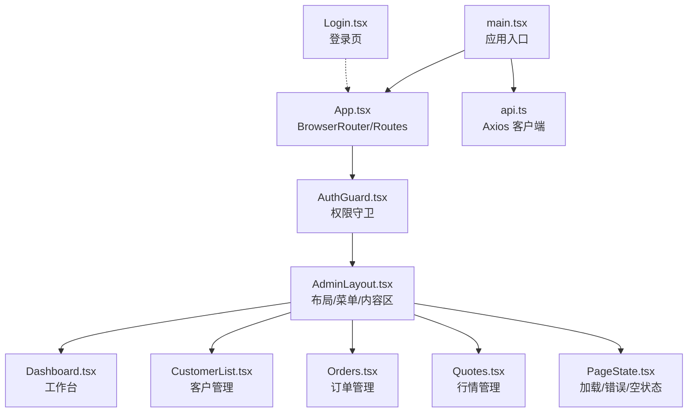
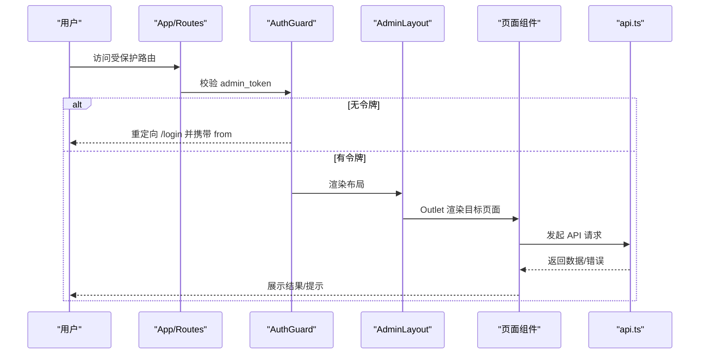
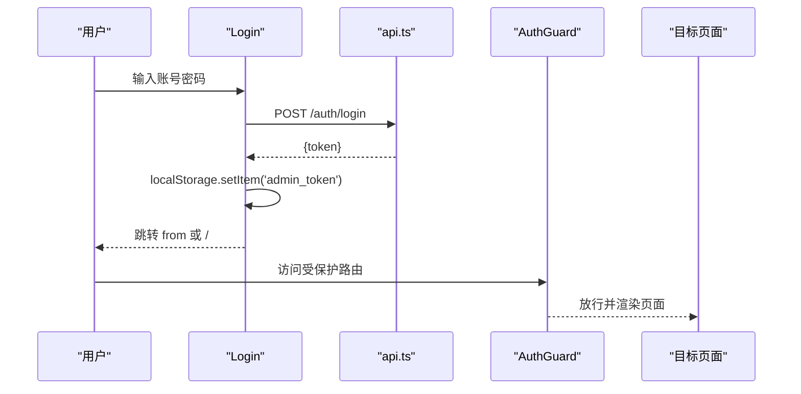
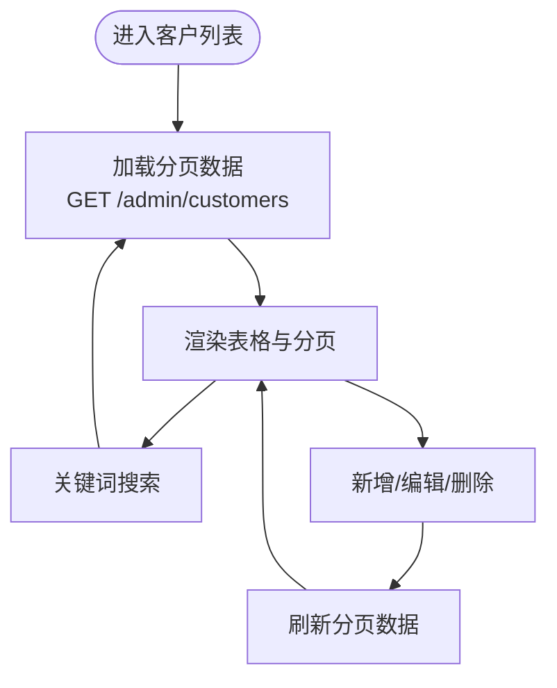
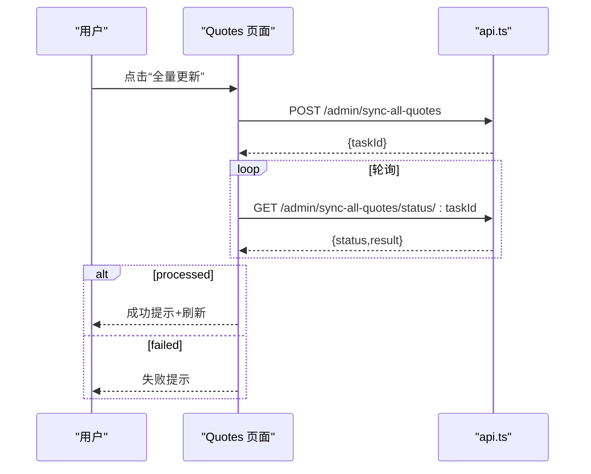
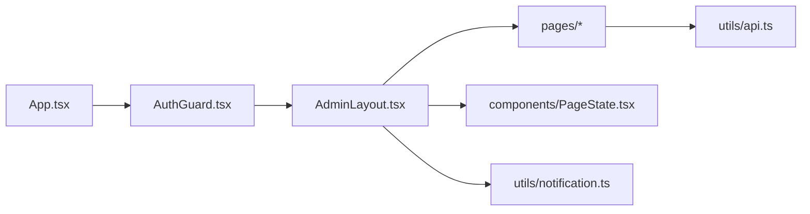

# 路由与导航

<cite>
**本文引用的文件**
- [App.tsx](file://admin-ui/src/App.tsx)
- [main.tsx](file://admin-ui/src/main.tsx)
- [AdminLayout.tsx](file://admin-ui/src/components/AdminLayout.tsx)
- [AuthGuard.tsx](file://admin-ui/src/components/AuthGuard.tsx)
- [Dashboard.tsx](file://admin-ui/src/pages/Dashboard.tsx)
- [Login.tsx](file://admin-ui/src/pages/Login.tsx)
- [CustomerList.tsx](file://admin-ui/src/pages/CustomerList.tsx)
- [Orders.tsx](file://admin-ui/src/pages/Orders.tsx)
- [Quotes.tsx](file://admin-ui/src/pages/Quotes.tsx)
- [api.ts](file://admin-ui/src/utils/api.ts)
- [notification.ts](file://admin-ui/src/utils/notification.ts)
- [PageState.tsx](file://admin-ui/src/components/PageState.tsx)
- [package.json](file://admin-ui/package.json)
</cite>

## 目录
1. [简介](#简介)
2. [项目结构](#项目结构)
3. [核心组件](#核心组件)
4. [架构总览](#架构总览)
5. [详细组件分析](#详细组件分析)
6. [依赖关系分析](#依赖关系分析)
7. [性能考量](#性能考量)
8. [故障排查指南](#故障排查指南)
9. [结论](#结论)
10. [附录](#附录)

## 简介
本文件系统性梳理 React 管理后台的路由与导航体系，覆盖页面组件组织、路由配置、权限守卫、侧边菜单、面包屑与状态保持、参数传递与跳转策略、权限控制、动态菜单生成与响应式适配，并提供页面开发指南、SEO 与用户体验优化建议。目标读者既包括前端开发者，也包括对技术细节感兴趣的非技术用户。

## 项目结构
管理后台采用 React + Vite + TypeScript + Ant Design 技术栈，路由基于 react-router-dom v7，UI 组件库为 Ant Design。应用入口在 main.tsx 中挂载 AntdApp 包装器，根组件 App.tsx 定义路由与权限守卫，AdminLayout.tsx 提供统一布局与侧边菜单，各业务页面位于 pages 目录，通用工具位于 utils 目录。

图表来源
- [main.tsx](file://admin-ui/src/main.tsx#L1-L14)
- [App.tsx](file://admin-ui/src/App.tsx#L1-L57)
- [AdminLayout.tsx](file://admin-ui/src/components/AdminLayout.tsx#L1-L180)
- [AuthGuard.tsx](file://admin-ui/src/components/AuthGuard.tsx#L1-L20)
- [Dashboard.tsx](file://admin-ui/src/pages/Dashboard.tsx#L1-L134)
- [CustomerList.tsx](file://admin-ui/src/pages/CustomerList.tsx#L1-L313)
- [Orders.tsx](file://admin-ui/src/pages/Orders.tsx#L1-L151)
- [Quotes.tsx](file://admin-ui/src/pages/Quotes.tsx#L1-L907)
- [Login.tsx](file://admin-ui/src/pages/Login.tsx#L1-L78)
- [api.ts](file://admin-ui/src/utils/api.ts#L1-L125)
- [PageState.tsx](file://admin-ui/src/components/PageState.tsx#L1-L44)

章节来源
- [main.tsx](file://admin-ui/src/main.tsx#L1-L14)
- [App.tsx](file://admin-ui/src/App.tsx#L1-L57)
- [package.json](file://admin-ui/package.json#L1-L38)

## 核心组件
- 应用入口与渲染
  - main.tsx 使用 createRoot 渲染 AntdApp 包裹的 App，确保全局主题与组件上下文可用。
- 根路由与页面映射
  - App.tsx 定义 BrowserRouter、Routes 与 Route，包含登录页、仪表盘、客户、订单、行情、交易、消息、配置等路由，并通过 AuthGuard 包裹受保护路由。
- 权限守卫
  - AuthGuard 从 localStorage 读取 admin_token，无令牌则重定向至登录页并携带来源路径。
- 布局与导航
  - AdminLayout 提供 Sider 菜单、Header 头部、Content 内容区，使用 Outlet 呈现代理页面；菜单项与路由 key 对齐，点击即导航；支持折叠与登出。
- 页面状态封装
  - PageState 统一处理加载、错误、空数据三种状态，减少重复逻辑。
- API 客户端
  - api.ts 基于 axios 创建客户端，设置 baseURL、超时、请求/响应拦截器，自动注入 Bearer Token，401 自动清理令牌并跳转登录。

章节来源
- [main.tsx](file://admin-ui/src/main.tsx#L1-L14)
- [App.tsx](file://admin-ui/src/App.tsx#L1-L57)
- [AuthGuard.tsx](file://admin-ui/src/components/AuthGuard.tsx#L1-L20)
- [AdminLayout.tsx](file://admin-ui/src/components/AdminLayout.tsx#L1-L180)
- [PageState.tsx](file://admin-ui/src/components/PageState.tsx#L1-L44)
- [api.ts](file://admin-ui/src/utils/api.ts#L1-L125)

## 架构总览
下图展示路由、权限、布局与页面之间的交互关系：

图表来源
- [App.tsx](file://admin-ui/src/App.tsx#L1-L57)
- [AuthGuard.tsx](file://admin-ui/src/components/AuthGuard.tsx#L1-L20)
- [AdminLayout.tsx](file://admin-ui/src/components/AdminLayout.tsx#L1-L180)
- [api.ts](file://admin-ui/src/utils/api.ts#L1-L125)

## 详细组件分析

### 路由与导航配置
- 路由层次
  - 登录路由：/login 与 /admin/login 双入口。
  - 仪表盘：/ 作为首页。
  - 业务路由：
    - 客户管理：/customer/list、/customer/groups
    - 费用管理：/fee/list、/fee/statistics
    - 行情管理：/quotes、/quotes/history、/quotes/boards
    - 交易管理：/trade/orders、/trade/inquiries、/trade/positions
    - 消息管理：/message/list、/message/templates
    - 配置管理：/config/system、/config/users
  - 兼容旧路由：/inquiries、/orders、/users、/settings 映射到新版路径。
- 导航策略
  - AdminLayout 的菜单项与路由 key 一一对应，点击菜单触发 useNavigate(key) 跳转。
  - 仪表盘 index 作为首页，登录页支持返回来源路径。
- 参数与查询
  - 页面内通过 API 客户端传参（如分页、搜索关键词），未见 URL 查询字符串驱动的复杂筛选逻辑，主要依赖 API 参数与分页。

章节来源
- [App.tsx](file://admin-ui/src/App.tsx#L1-L57)
- [AdminLayout.tsx](file://admin-ui/src/components/AdminLayout.tsx#L42-L99)

### 权限控制与登录流程
- 登录页 Login
  - 表单提交调用 /auth/login，成功后写入 admin_token，使用 from 路径回跳。
- 权限守卫 AuthGuard
  - 无令牌则重定向至 /login，并携带来源位置信息。
- API 客户端拦截器
  - 请求自动附加 Authorization: Bearer token。
  - 响应 401 自动清除令牌并跳转登录。

图表来源
- [Login.tsx](file://admin-ui/src/pages/Login.tsx#L1-L78)
- [api.ts](file://admin-ui/src/utils/api.ts#L57-L125)
- [AuthGuard.tsx](file://admin-ui/src/components/AuthGuard.tsx#L1-L20)

章节来源
- [Login.tsx](file://admin-ui/src/pages/Login.tsx#L1-L78)
- [AuthGuard.tsx](file://admin-ui/src/components/AuthGuard.tsx#L1-L20)
- [api.ts](file://admin-ui/src/utils/api.ts#L57-L125)

### 仪表盘 Dashboard
- 功能要点
  - 加载统计数据并展示卡片指标（行情总数、询价总数、待处理询价、成交订单）。
  - 展示最近动态与系统通知。
  - 首次进入即触发一次数据拉取。
- 数据流
  - 调用 /admin/stats 获取统计，异常通过消息提示。

章节来源
- [Dashboard.tsx](file://admin-ui/src/pages/Dashboard.tsx#L1-L134)
- [api.ts](file://admin-ui/src/utils/api.ts#L1-L125)

### 登录页面 Login
- 功能要点
  - 表单校验、提交、错误提示、加载状态。
  - 成功后写入令牌并按来源路径回跳。
- 错误处理
  - 统一通过 getApiErrorMessage 输出用户可读错误。

章节来源
- [Login.tsx](file://admin-ui/src/pages/Login.tsx#L1-L78)
- [api.ts](file://admin-ui/src/utils/api.ts#L35-L55)

### 客户管理 CustomerList
- 功能要点
  - 列表分页、搜索、新增/编辑弹窗、删除确认。
  - 分组标签、状态标签、创建时间格式化。
  - 与分组接口联动，新增/编辑后刷新分组列表。
- 数据流
  - GET /admin/customers 拉取分页数据；DELETE /admin/customers/:id 删除；PUT/POST 管理客户。
  - PageState 统一处理加载/错误/空数据。

图表来源
- [CustomerList.tsx](file://admin-ui/src/pages/CustomerList.tsx#L62-L84)
- [PageState.tsx](file://admin-ui/src/components/PageState.tsx#L1-L44)

章节来源
- [CustomerList.tsx](file://admin-ui/src/pages/CustomerList.tsx#L1-L313)
- [PageState.tsx](file://admin-ui/src/components/PageState.tsx#L1-L44)

### 订单管理 Orders
- 功能要点
  - 管理员可见全部订单，支持刷新与分页。
  - 状态更新通过 PUT /trade/orders/:id/status 触发。
- 数据流
  - GET /trade/orders 拉取订单；PUT 更新状态；异常统一提示。

章节来源
- [Orders.tsx](file://admin-ui/src/pages/Orders.tsx#L1-L151)

### 行情管理 Quotes
- 功能要点
  - 实时/历史/板块管理三级路由。
  - 支持全量同步、快速更新、文件上传预览与确认入库、删除选中/清空。
  - 异步任务轮询进度，支持取消与错误处理。
- 数据流
  - GET /admin/quotes 拉取；POST /admin/sync-quotes、/admin/sync-all-quotes 启动同步；DELETE /admin/quotes 删除；上传/确认入库通过独立接口与轮询。

图表来源
- [Quotes.tsx](file://admin-ui/src/pages/Quotes.tsx#L491-L534)
- [api.ts](file://admin-ui/src/utils/api.ts#L1-L125)

章节来源
- [Quotes.tsx](file://admin-ui/src/pages/Quotes.tsx#L1-L907)

### 通知与消息
- 通知机制
  - notification.ts 提供通知管理器，支持订阅与发送；AdminLayout 在挂载时订阅并通过 Ant Design App.notification 展示。
- 使用场景
  - 询价状态变更与新询价推送，自动根据状态映射标题与颜色。

章节来源
- [AdminLayout.tsx](file://admin-ui/src/components/AdminLayout.tsx#L28-L40)
- [notification.ts](file://admin-ui/src/utils/notification.ts#L1-L84)

### 页面状态保持与错误处理
- PageState 组件
  - 统一处理 loading、error、empty 三态，提供重试按钮。
- API 错误处理
  - getApiErrorMessage 统一解析网络、超时、后端错误与取消请求，输出用户可读提示。
- 401 自动登出
  - 响应拦截器检测 401，清理令牌并跳转登录。

章节来源
- [PageState.tsx](file://admin-ui/src/components/PageState.tsx#L1-L44)
- [api.ts](file://admin-ui/src/utils/api.ts#L35-L125)

## 依赖关系分析
- 组件耦合
  - App.tsx 仅负责路由与守卫，职责清晰；AdminLayout 聚合菜单、头部与内容，通过 Outlet 注入页面。
  - 页面组件与 api.ts 解耦，通过统一客户端访问后端。
- 外部依赖
  - react-router-dom、antd、axios、@ant-design/icons。
- 潜在循环依赖
  - 当前结构无明显循环依赖；若后续在 utils 中引入页面组件需谨慎。

图表来源
- [App.tsx](file://admin-ui/src/App.tsx#L1-L57)
- [AuthGuard.tsx](file://admin-ui/src/components/AuthGuard.tsx#L1-L20)
- [AdminLayout.tsx](file://admin-ui/src/components/AdminLayout.tsx#L1-L180)
- [PageState.tsx](file://admin-ui/src/components/PageState.tsx#L1-L44)
- [api.ts](file://admin-ui/src/utils/api.ts#L1-L125)
- [notification.ts](file://admin-ui/src/utils/notification.ts#L1-L84)

章节来源
- [package.json](file://admin-ui/package.json#L13-L36)

## 性能考量
- 路由懒加载
  - 当前路由为静态导入，建议对大页面启用动态导入以降低首屏体积。
- 请求缓存
  - 对高频只读数据（如分页列表）可增加缓存策略，避免重复请求。
- 图标与样式
  - 使用 @ant-design/icons 按需引入，避免全量引入导致包体增大。
- 进度轮询
  - Quotes 的轮询频率与定时器清理已处理，注意在组件卸载时清理定时器，避免内存泄漏。

[本节为通用指导，不直接分析具体文件]

## 故障排查指南
- 登录后仍被重定向到登录页
  - 检查 localStorage 是否存在 admin_token；确认 AuthGuard 读取逻辑与路由守卫是否生效。
- 401 未授权频繁出现
  - 检查请求拦截器是否正确附加 Authorization；确认响应拦截器 401 处理是否触发。
- 页面空白或加载失败
  - 查看 PageState 的错误态与 API 错误提示；确认网络连通性与 baseURL 配置。
- 询价通知不显示
  - 确认 AdminLayout 是否订阅通知；检查 notificationManager 的 notify 调用链。

章节来源
- [AuthGuard.tsx](file://admin-ui/src/components/AuthGuard.tsx#L1-L20)
- [api.ts](file://admin-ui/src/utils/api.ts#L78-L120)
- [PageState.tsx](file://admin-ui/src/components/PageState.tsx#L1-L44)
- [AdminLayout.tsx](file://admin-ui/src/components/AdminLayout.tsx#L28-L40)
- [notification.ts](file://admin-ui/src/utils/notification.ts#L31-L53)

## 结论
该管理后台采用清晰的路由分层与权限守卫，结合统一的布局与状态封装，实现了良好的可维护性与扩展性。建议后续引入路由懒加载、页面缓存与更完善的面包屑/权限控制，以进一步提升性能与用户体验。

[本节为总结，不直接分析具体文件]

## 附录

### 页面开发指南
- 新增页面
  - 在 pages 下新建组件，按需引入 PageState、api.ts 与 Ant Design 组件。
  - 在 App.tsx 中注册路由，必要时在 AdminLayout 菜单中添加条目。
- 参数与查询
  - 优先通过 API 参数传递（如分页、过滤），避免过度依赖 URL 查询字符串。
- 页面跳转
  - 使用 useNavigate 进行编程式导航；登录成功后使用 from 路径回跳。
- 错误处理
  - 统一使用 getApiErrorMessage 输出用户可读错误；对 401 自动登出。

章节来源
- [App.tsx](file://admin-ui/src/App.tsx#L1-L57)
- [AdminLayout.tsx](file://admin-ui/src/components/AdminLayout.tsx#L42-L99)
- [api.ts](file://admin-ui/src/utils/api.ts#L35-L55)

### SEO 与用户体验优化
- SEO
  - 为每个页面设置语义化的标题与描述（可在页面顶部使用 Helmet 或在 HTML 中配置）。
  - 为静态资源配置缓存策略，提升二次访问速度。
- 用户体验
  - 为长列表启用虚拟滚动与骨架屏；对耗时操作提供进度反馈与取消能力。
  - 为关键操作提供确认对话框，避免误操作。
  - 为弱网场景提供重试与离线提示。

[本节为通用指导，不直接分析具体文件]