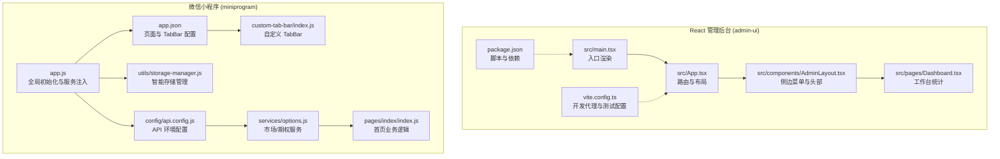
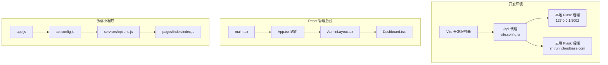
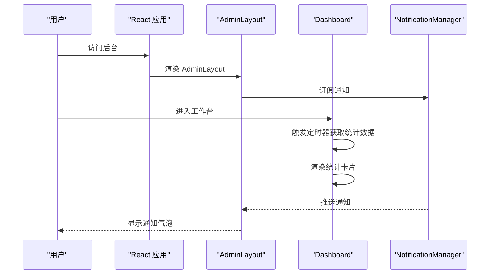
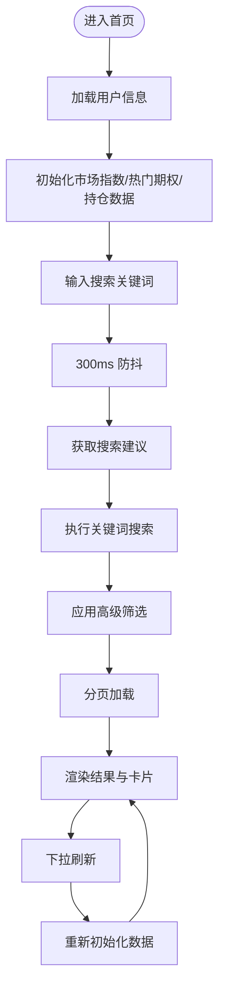
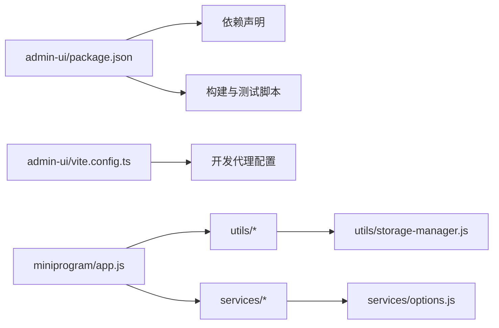

# 前端系统

<cite>
**本文引用的文件**
- [admin-ui/package.json](file://admin-ui/package.json)
- [admin-ui/vite.config.ts](file://admin-ui/vite.config.ts)
- [admin-ui/src/App.tsx](file://admin-ui/src/App.tsx)
- [admin-ui/src/main.tsx](file://admin-ui/src/main.tsx)
- [admin-ui/src/components/AdminLayout.tsx](file://admin-ui/src/components/AdminLayout.tsx)
- [admin-ui/src/pages/Dashboard.tsx](file://admin-ui/src/pages/Dashboard.tsx)
- [admin-ui/src/utils/notification.ts](file://admin-ui/src/utils/notification.ts)
- [miniprogram/app.js](file://miniprogram/app.js)
- [miniprogram/app.json](file://miniprogram/app.json)
- [miniprogram/config/api.config.js](file://miniprogram/config/api.config.js)
- [miniprogram/services/options.js](file://miniprogram/services/options.js)
- [miniprogram/pages/index/index.js](file://miniprogram/pages/index/index.js)
- [miniprogram/custom-tab-bar/index.js](file://miniprogram/custom-tab-bar/index.js)
- [miniprogram/utils/storage-manager.js](file://miniprogram/utils/storage-manager.js)
- [utils/request.js](file://utils/request.js)
</cite>

## 目录
1. [简介](#简介)
2. [项目结构](#项目结构)
3. [核心组件](#核心组件)
4. [架构总览](#架构总览)
5. [详细组件分析](#详细组件分析)
6. [依赖关系分析](#依赖关系分析)
7. [性能考虑](#性能考虑)
8. [故障排查指南](#故障排查指南)
9. [结论](#结论)
10. [附录](#附录)

## 简介
本文件面向“场外期权”项目的前端系统，覆盖两大应用形态：
- React 管理后台（admin-ui）：基于 Vite + React 19 + TypeScript + Ant Design 的现代化后台界面，提供行情、询价、订单、费用、客户等管理功能。
- 微信小程序（miniprogram）：基于原生小程序框架的移动端应用，提供首页、报价、账户、我的等核心页面，内置智能存储、性能优化与通知系统。

文档重点阐述：
- 前端架构设计与组件结构
- 路由与状态管理、数据绑定机制
- UI 组件设计原则、样式系统与响应式布局
- 性能优化策略、缓存机制与用户体验设计
- 开发环境配置、构建流程与部署策略
- 跨平台兼容性、浏览器支持与移动端适配
- 调试技巧、测试策略与维护指南

## 项目结构
前端工程分为两个独立应用：
- admin-ui：现代 Web 应用，采用 React + Ant Design + Vite 构建，路由基于 react-router-dom，开发代理指向 Flask 后端或云端。
- miniprogram：微信小程序，采用原生小程序框架，页面通过 app.json 配置，服务层封装在 services 目录，工具类集中于 utils。

图表来源
- [admin-ui/src/main.tsx](file://admin-ui/src/main.tsx#L1-L14)
- [admin-ui/src/App.tsx](file://admin-ui/src/App.tsx#L1-L57)
- [admin-ui/src/components/AdminLayout.tsx](file://admin-ui/src/components/AdminLayout.tsx#L1-L180)
- [admin-ui/src/pages/Dashboard.tsx](file://admin-ui/src/pages/Dashboard.tsx#L1-L134)
- [admin-ui/vite.config.ts](file://admin-ui/vite.config.ts#L1-L78)
- [admin-ui/package.json](file://admin-ui/package.json#L1-L38)
- [miniprogram/app.js](file://miniprogram/app.js#L1-L225)
- [miniprogram/app.json](file://miniprogram/app.json#L1-L78)
- [miniprogram/config/api.config.js](file://miniprogram/config/api.config.js#L1-L90)
- [miniprogram/services/options.js](file://miniprogram/services/options.js#L1-L231)
- [miniprogram/pages/index/index.js](file://miniprogram/pages/index/index.js#L1-L710)
- [miniprogram/utils/storage-manager.js](file://miniprogram/utils/storage-manager.js#L1-L776)
- [miniprogram/custom-tab-bar/index.js](file://miniprogram/custom-tab-bar/index.js#L1-L31)

章节来源
- [admin-ui/package.json](file://admin-ui/package.json#L1-L38)
- [admin-ui/vite.config.ts](file://admin-ui/vite.config.ts#L1-L78)
- [admin-ui/src/App.tsx](file://admin-ui/src/App.tsx#L1-L57)
- [admin-ui/src/main.tsx](file://admin-ui/src/main.tsx#L1-L14)
- [admin-ui/src/components/AdminLayout.tsx](file://admin-ui/src/components/AdminLayout.tsx#L1-L180)
- [admin-ui/src/pages/Dashboard.tsx](file://admin-ui/src/pages/Dashboard.tsx#L1-L134)
- [miniprogram/app.js](file://miniprogram/app.js#L1-L225)
- [miniprogram/app.json](file://miniprogram/app.json#L1-L78)
- [miniprogram/config/api.config.js](file://miniprogram/config/api.config.js#L1-L90)
- [miniprogram/services/options.js](file://miniprogram/services/options.js#L1-L231)
- [miniprogram/pages/index/index.js](file://miniprogram/pages/index/index.js#L1-L710)
- [miniprogram/utils/storage-manager.js](file://miniprogram/utils/storage-manager.js#L1-L776)
- [miniprogram/custom-tab-bar/index.js](file://miniprogram/custom-tab-bar/index.js#L1-L31)

## 核心组件
- React 管理后台核心组件
  - 应用入口与主题包装：main.tsx 引入 Ant Design App 包装与全局样式。
  - 路由与守卫：App.tsx 定义路由表与 AuthGuard 布局，AdminLayout 提供侧边菜单、头部与通知订阅。
  - 工作台统计：Dashboard.tsx 展示行情、询价、订单等统计指标，并通过 API 获取数据。
  - 通知管理：notification.ts 提供订阅/发布通知机制，支持不同状态类型与未读计数。
- 微信小程序核心组件
  - 全局初始化：app.js 注入云开发、存储、性能优化、UI 增强与通知管理器，预加载关键资源。
  - 页面与 TabBar：app.json 配置页面与 TabBar；custom-tab-bar/index.js 提供自定义 TabBar。
  - API 配置：api.config.js 统一管理开发/生产环境 API 地址，支持云端与本地切换。
  - 服务层：services/options.js 提供市场指数、热门期权、搜索与建议等服务，内置缓存与排序。
  - 存储管理：utils/storage-manager.js 提供智能存储、缓存、压缩、加密、LRU、观察者与同步队列等能力。
  - 首页业务：pages/index/index.js 负责用户信息、搜索、轮播图、快捷功能、持仓案例与下拉刷新等。

章节来源
- [admin-ui/src/main.tsx](file://admin-ui/src/main.tsx#L1-L14)
- [admin-ui/src/App.tsx](file://admin-ui/src/App.tsx#L1-L57)
- [admin-ui/src/components/AdminLayout.tsx](file://admin-ui/src/components/AdminLayout.tsx#L1-L180)
- [admin-ui/src/pages/Dashboard.tsx](file://admin-ui/src/pages/Dashboard.tsx#L1-L134)
- [admin-ui/src/utils/notification.ts](file://admin-ui/src/utils/notification.ts#L1-L84)
- [miniprogram/app.js](file://miniprogram/app.js#L1-L225)
- [miniprogram/app.json](file://miniprogram/app.json#L1-L78)
- [miniprogram/config/api.config.js](file://miniprogram/config/api.config.js#L1-L90)
- [miniprogram/services/options.js](file://miniprogram/services/options.js#L1-L231)
- [miniprogram/pages/index/index.js](file://miniprogram/pages/index/index.js#L1-L710)
- [miniprogram/utils/storage-manager.js](file://miniprogram/utils/storage-manager.js#L1-L776)
- [miniprogram/custom-tab-bar/index.js](file://miniprogram/custom-tab-bar/index.js#L1-L31)

## 架构总览
React 管理后台与微信小程序分别采用不同的技术栈，但共享统一的后端 API 与云托管环境。开发阶段通过 Vite 代理将 /api 请求转发至 Flask 后端或云端目标，小程序通过 api.config.js 判定环境并选择对应 API 基础地址。

图表来源
- [admin-ui/vite.config.ts](file://admin-ui/vite.config.ts#L1-L78)
- [admin-ui/src/main.tsx](file://admin-ui/src/main.tsx#L1-L14)
- [admin-ui/src/App.tsx](file://admin-ui/src/App.tsx#L1-L57)
- [admin-ui/src/components/AdminLayout.tsx](file://admin-ui/src/components/AdminLayout.tsx#L1-L180)
- [admin-ui/src/pages/Dashboard.tsx](file://admin-ui/src/pages/Dashboard.tsx#L1-L134)
- [miniprogram/app.js](file://miniprogram/app.js#L1-L225)
- [miniprogram/config/api.config.js](file://miniprogram/config/api.config.js#L1-L90)
- [miniprogram/services/options.js](file://miniprogram/services/options.js#L1-L231)
- [miniprogram/pages/index/index.js](file://miniprogram/pages/index/index.js#L1-L710)

## 详细组件分析

### React 管理后台组件分析
- 应用入口与主题包装
  - main.tsx 使用 Ant Design App 包裹，确保全局主题与组件样式生效。
- 路由与布局
  - App.tsx 使用 react-router-dom 定义路由表，AdminLayout 提供侧边菜单与头部区域，Outlet 支持嵌套路由渲染。
- 通知系统
  - notification.ts 提供订阅/通知/未读计数，AdminLayout 在挂载时订阅并通过 Ant Design notification 显示。
- 工作台统计
  - Dashboard.tsx 通过 API 获取统计数据并在卡片中展示，错误时使用 Ant Design message 提示。

图表来源
- [admin-ui/src/App.tsx](file://admin-ui/src/App.tsx#L1-L57)
- [admin-ui/src/components/AdminLayout.tsx](file://admin-ui/src/components/AdminLayout.tsx#L1-L180)
- [admin-ui/src/pages/Dashboard.tsx](file://admin-ui/src/pages/Dashboard.tsx#L1-L134)
- [admin-ui/src/utils/notification.ts](file://admin-ui/src/utils/notification.ts#L1-L84)

章节来源
- [admin-ui/src/main.tsx](file://admin-ui/src/main.tsx#L1-L14)
- [admin-ui/src/App.tsx](file://admin-ui/src/App.tsx#L1-L57)
- [admin-ui/src/components/AdminLayout.tsx](file://admin-ui/src/components/AdminLayout.tsx#L1-L180)
- [admin-ui/src/pages/Dashboard.tsx](file://admin-ui/src/pages/Dashboard.tsx#L1-L134)
- [admin-ui/src/utils/notification.ts](file://admin-ui/src/utils/notification.ts#L1-L84)

### 微信小程序组件分析
- 全局初始化与服务注入
  - app.js 初始化云开发、核心服务（存储、性能优化、UI 增强、通知）、预加载关键资源与性能监控。
- API 配置与环境切换
  - api.config.js 通过 __wxConfig 或 wx.getAccountInfoSync 判定环境，返回开发/生产配置，支持 useCloud 参数切换云端地址。
- 服务层与缓存
  - services/options.js 提供 getMarketIndices、getHotOptions、searchOptions、getSuggestions、getOptionChains 等方法，内置 1 分钟缓存与相关性评分排序。
- 首页业务逻辑
  - pages/index/index.js 负责用户信息、搜索建议、关键词搜索、高级筛选、分页加载、下拉刷新、轮播图与快捷功能导航。
- 存储管理
  - utils/storage-manager.js 提供智能存储、压缩/解压、加/解密、LRU、观察者、同步队列、统计与清理等能力，支持批量操作与降级策略。

图表来源
- [miniprogram/pages/index/index.js](file://miniprogram/pages/index/index.js#L1-L710)
- [miniprogram/services/options.js](file://miniprogram/services/options.js#L1-L231)

章节来源
- [miniprogram/app.js](file://miniprogram/app.js#L1-L225)
- [miniprogram/config/api.config.js](file://miniprogram/config/api.config.js#L1-L90)
- [miniprogram/services/options.js](file://miniprogram/services/options.js#L1-L231)
- [miniprogram/pages/index/index.js](file://miniprogram/pages/index/index.js#L1-L710)
- [miniprogram/utils/storage-manager.js](file://miniprogram/utils/storage-manager.js#L1-L776)

### 路由与状态管理
- React 管理后台
  - 路由：App.tsx 定义多级路由与旧路由兼容，AdminLayout 作为受保护布局。
  - 状态：Dashboard 通过 API 获取数据并 setState 更新；AdminLayout 订阅通知管理器。
- 微信小程序
  - 页面路由：app.json 声明 pages 与 tabBar；safeNavigate 统一封装跳转逻辑，区分 tabBar 与普通页面。
  - 状态：Page.data 管理视图状态，Promise.all 并行加载数据，下拉刷新与 Toast 提示。

章节来源
- [admin-ui/src/App.tsx](file://admin-ui/src/App.tsx#L1-L57)
- [admin-ui/src/components/AdminLayout.tsx](file://admin-ui/src/components/AdminLayout.tsx#L1-L180)
- [admin-ui/src/pages/Dashboard.tsx](file://admin-ui/src/pages/Dashboard.tsx#L1-L134)
- [miniprogram/app.json](file://miniprogram/app.json#L1-L78)
- [miniprogram/pages/index/index.js](file://miniprogram/pages/index/index.js#L1-L710)

### 数据绑定与样式系统
- React 管理后台
  - 数据绑定：Ant Design 组件与 React hooks（useState/useEffect/useCallback）结合，API 返回数据直接映射到 UI。
  - 样式系统：Ant Design 主题与 token 控制颜色与圆角；AdminLayout 使用 theme.useToken 获取背景与圆角。
- 微信小程序
  - 数据绑定：Page.data 与 setData 更新视图；wxml/wxss 与 JS 逻辑分离。
  - 样式系统：自定义 TabBar 使用 SVG 图标与样式控制；页面内使用 wxs 或内联样式实现响应式布局。

章节来源
- [admin-ui/src/components/AdminLayout.tsx](file://admin-ui/src/components/AdminLayout.tsx#L1-L180)
- [miniprogram/custom-tab-bar/index.js](file://miniprogram/custom-tab-bar/index.js#L1-L31)

## 依赖关系分析
- React 管理后台
  - 依赖：react、react-dom、react-router-dom、antd、@ant-design/icons、axios。
  - 构建：Vite + TypeScript；开发代理 /api 指向本地或云端 Flask。
- 微信小程序
  - 依赖：原生小程序框架；通过 utils 与 services 解耦业务。
  - 配置：app.json 声明页面与 TabBar；api.config.js 统一 API 地址。

图表来源
- [admin-ui/package.json](file://admin-ui/package.json#L1-L38)
- [admin-ui/vite.config.ts](file://admin-ui/vite.config.ts#L1-L78)
- [miniprogram/app.js](file://miniprogram/app.js#L1-L225)
- [miniprogram/services/options.js](file://miniprogram/services/options.js#L1-L231)
- [miniprogram/utils/storage-manager.js](file://miniprogram/utils/storage-manager.js#L1-L776)

章节来源
- [admin-ui/package.json](file://admin-ui/package.json#L1-L38)
- [admin-ui/vite.config.ts](file://admin-ui/vite.config.ts#L1-L78)
- [miniprogram/app.js](file://miniprogram/app.js#L1-L225)

## 性能考虑
- React 管理后台
  - 代理超时与错误处理：vite.config.ts 配置 proxyTimeout 与自定义错误响应，提升开发体验。
  - 依赖去重：resolve.dedupe 避免重复打包 react 与 react-dom。
  - 测试环境：jsdom 环境配置，便于单元测试。
- 微信小程序
  - 预加载与懒加载：app.js 预加载关键资源，performance-optimizer 支持懒加载模块。
  - 存储优化：storage-manager.js 提供压缩、加密、LRU、观察者与同步队列，降低 IO 压力。
  - 服务缓存：services/options.js 1 分钟缓存与相关性评分，减少网络与计算开销。
  - 内存告警处理：onMemoryWarning 清理低优先级缓存，定期生成性能报告。

章节来源
- [admin-ui/vite.config.ts](file://admin-ui/vite.config.ts#L1-L78)
- [miniprogram/app.js](file://miniprogram/app.js#L1-L225)
- [miniprogram/utils/storage-manager.js](file://miniprogram/utils/storage-manager.js#L1-L776)
- [miniprogram/services/options.js](file://miniprogram/services/options.js#L1-L231)

## 故障排查指南
- React 管理后台
  - 代理失败：检查 vite.config.ts 中代理目标与端口，确认后端服务已启动。
  - 路由跳转：确认 App.tsx 路由表与 AdminLayout 导航键一致。
  - 通知异常：检查 notification.ts 订阅与 AdminLayout 通知显示逻辑。
- 微信小程序
  - API 环境判定：确认 api.config.js 中环境判断逻辑与 __wxConfig 或 wx.getAccountInfoSync 的可用性。
  - 存储异常：storage-manager.js 提供降级策略与统计，可通过 getStorageStats 与 getCacheDetails 定位问题。
  - 页面跳转：safeNavigate 对 tabBar 与普通页面做区分，检查路径与参数传递。

章节来源
- [admin-ui/vite.config.ts](file://admin-ui/vite.config.ts#L1-L78)
- [admin-ui/src/App.tsx](file://admin-ui/src/App.tsx#L1-L57)
- [admin-ui/src/utils/notification.ts](file://admin-ui/src/utils/notification.ts#L1-L84)
- [miniprogram/config/api.config.js](file://miniprogram/config/api.config.js#L1-L90)
- [miniprogram/utils/storage-manager.js](file://miniprogram/utils/storage-manager.js#L1-L776)
- [miniprogram/pages/index/index.js](file://miniprogram/pages/index/index.js#L1-L710)

## 结论
该前端系统在 React 与微信小程序两端实现了清晰的职责划分与可扩展架构。React 管理后台通过 Ant Design 与 Vite 提供现代化开发体验，配合代理与测试配置保障开发效率；微信小程序通过智能存储、服务缓存与性能优化实现流畅的移动端体验。整体具备良好的可维护性与扩展性，适合持续迭代与团队协作。

## 附录
- 开发环境配置
  - React：安装依赖后运行 dev 脚本，访问本地开发服务器；通过 Vite 代理访问后端 API。
  - 小程序：使用微信开发者工具导入 miniprogram 目录，配置云开发环境与 API 地址。
- 构建与测试
  - React：build 脚本先执行 TypeScript 编译再打包；test 脚本运行 Vitest。
  - 小程序：使用微信开发者工具进行构建与预览。
- 部署策略
  - React：构建产物可部署至静态服务器或 CDN；代理目标可在环境变量中切换。
  - 小程序：通过微信公众平台上传与发布；API 地址由 api.config.js 自动识别环境。

章节来源
- [admin-ui/package.json](file://admin-ui/package.json#L1-L38)
- [admin-ui/vite.config.ts](file://admin-ui/vite.config.ts#L1-L78)
- [miniprogram/app.js](file://miniprogram/app.js#L1-L225)
- [miniprogram/config/api.config.js](file://miniprogram/config/api.config.js#L1-L90)