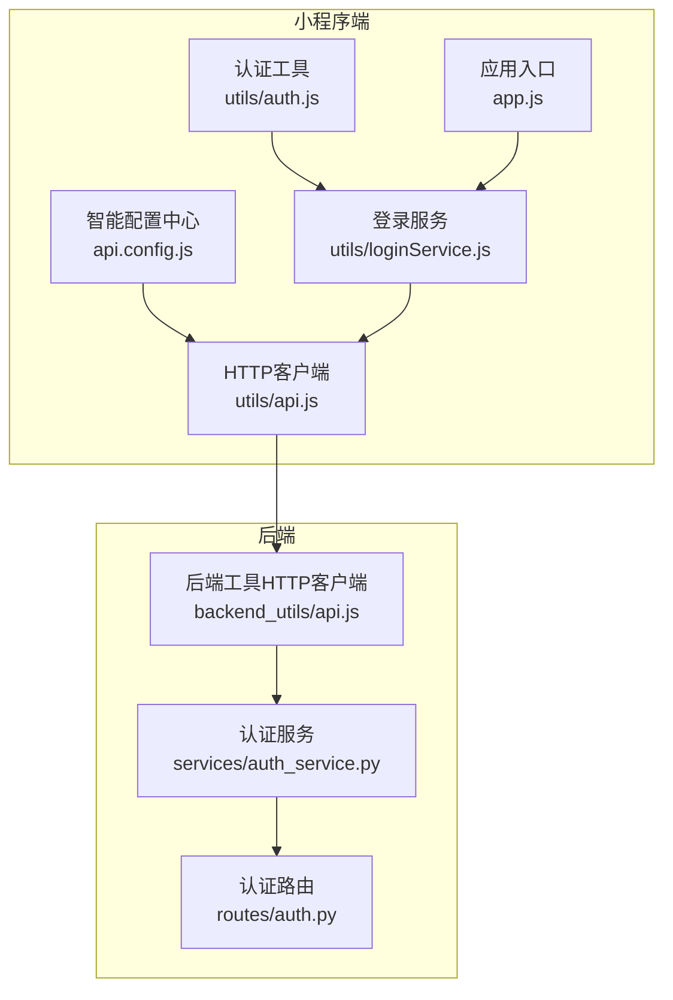
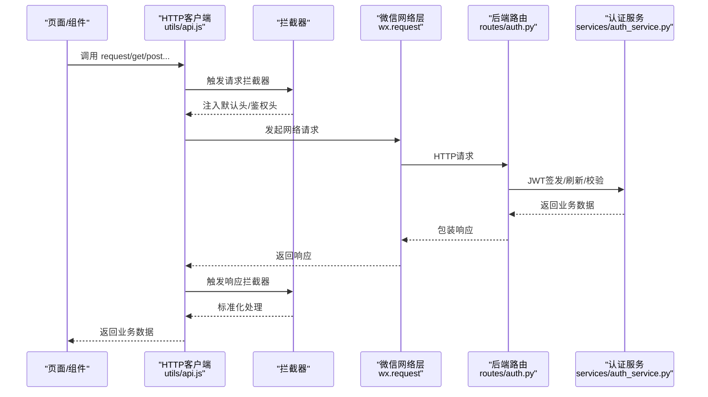
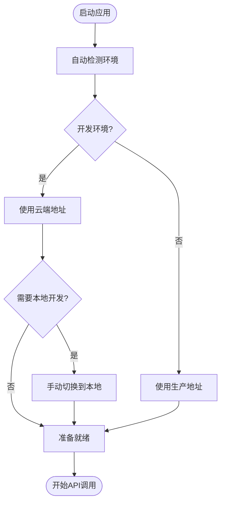
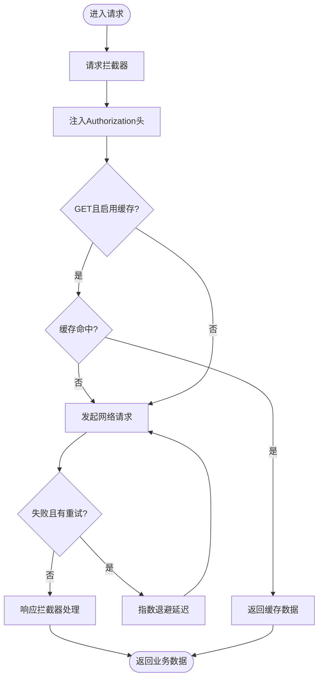
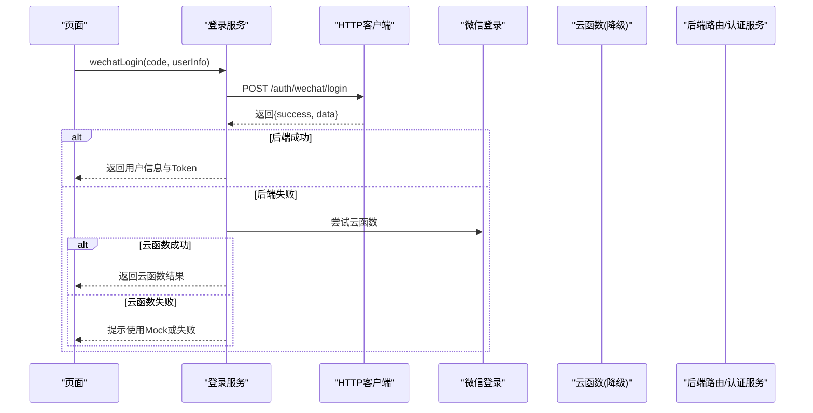
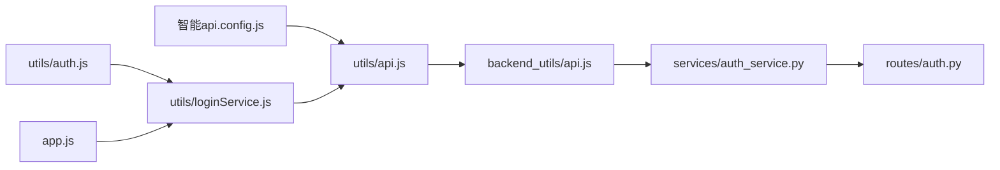

# API调用

<cite>
**本文引用的文件**
- [miniprogram/config/api.config.js](file://miniprogram/config/api.config.js)
- [miniprogram/utils/api.js](file://miniprogram/utils/api.js)
- [miniprogram/utils/loginService.js](file://miniprogram/utils/loginService.js)
- [miniprogram/utils/auth.js](file://miniprogram/utils/auth.js)
- [miniprogram/app.js](file://miniprogram/app.js)
- [backend_utils/api.js](file://backend_utils/api.js)
- [services/auth_service.py](file://services/auth_service.py)
- [routes/auth.py](file://routes/auth.py)
</cite>

## 更新摘要
**变更内容**
- API配置系统从静态配置升级为智能环境检测系统
- 新增自动环境识别功能，支持开发/生产/体验版自动判断
- 新增本地开发自动回退到云端功能，避免127.0.0.1连接问题
- 新增手动强制切换数据源功能（switchToLocal/switchToCloud）
- 新增调试控制台接口，便于开发调试

## 目录
1. [简介](#简介)
2. [项目结构](#项目结构)
3. [核心组件](#核心组件)
4. [架构总览](#架构总览)
5. [组件详解](#组件详解)
6. [依赖关系分析](#依赖关系分析)
7. [性能考量](#性能考量)
8. [故障排查指南](#故障排查指南)
9. [结论](#结论)
10. [附录](#附录)

## 简介
本文件面向微信小程序开发者，系统化梳理项目中的API调用体系，涵盖网络请求机制、HTTP客户端封装、API接口管理、认证令牌管理、请求拦截器、响应处理、错误重试、缓存策略、并发控制、智能环境检测与接口版本控制、与后端服务对接与数据格式处理等。文档同时提供最佳实践、性能优化与调试技巧，帮助团队在复杂场景下稳定、高效地进行前后端交互。

**更新** API配置系统现已升级为智能环境检测系统，具备自动环境识别、本地开发自动回退到云端、手动强制切换等功能。

## 项目结构
围绕API调用的关键文件分布如下：
- 配置中心：统一管理API基础地址与环境切换，支持智能环境检测
- HTTP客户端：封装请求、响应、拦截器、重试、缓存与并发控制
- 登录服务：多渠道登录、Token刷新与校验、离线兜底
- 应用入口：初始化云能力、核心服务与性能监控
- 后端工具：通用HTTP客户端（含拦截器、重试、缓存、统计）
- 后端服务：认证服务（JWT签发/刷新/校验）、路由定义

**图表来源**
- [miniprogram/config/api.config.js](file://miniprogram/config/api.config.js#L1-L174)
- [miniprogram/utils/api.js](file://miniprogram/utils/api.js#L1-L714)
- [miniprogram/utils/loginService.js](file://miniprogram/utils/loginService.js#L1-L492)
- [miniprogram/utils/auth.js](file://miniprogram/utils/auth.js#L1-L53)
- [miniprogram/app.js](file://miniprogram/app.js#L1-L225)
- [backend_utils/api.js](file://backend_utils/api.js#L225-L330)
- [services/auth_service.py](file://services/auth_service.py#L86-L160)
- [routes/auth.py](file://routes/auth.py#L130-L193)

## 核心组件
- 智能配置中心：集中管理开发/生产环境基础地址，支持云端地址切换，提供统一URL拼接与基础地址查询。具备自动环境检测、本地开发自动回退到云端、手动强制切换等功能。
- HTTP客户端：封装wx.request，提供请求拦截器、响应拦截器、重试（指数退避）、缓存（GET请求5分钟TTL）、并发队列控制、去重、加载提示、错误处理与Toast反馈。
- 登录服务：统一封装微信/QQ/手机登录，支持后端API优先、云函数降级、开发模式Mock、Token刷新与校验、离线兜底、自动登录。
- 认证工具：封装微信登录换取后端Token，并持久化用户信息与Token。
- 应用入口：初始化云能力、核心服务、性能监控与自动登录检查。
- 后端工具HTTP客户端：提供与小程序端类似的拦截器、重试、缓存、统计能力，便于后端侧复用。
- 认证服务与路由：后端JWT签发/刷新/校验、用户管理、验证码接口等。

**章节来源**
- [miniprogram/config/api.config.js](file://miniprogram/config/api.config.js#L1-L174)
- [miniprogram/utils/api.js](file://miniprogram/utils/api.js#L1-L714)
- [miniprogram/utils/loginService.js](file://miniprogram/utils/loginService.js#L1-L492)
- [miniprogram/utils/auth.js](file://miniprogram/utils/auth.js#L1-L53)
- [miniprogram/app.js](file://miniprogram/app.js#L1-L225)
- [backend_utils/api.js](file://backend_utils/api.js#L225-L330)
- [services/auth_service.py](file://services/auth_service.py#L86-L160)
- [routes/auth.py](file://routes/auth.py#L130-L193)

## 架构总览
小程序端通过HTTP客户端发起请求，按需携带Authorization头；请求经拦截器处理后到达后端，后端路由接收请求并调用认证服务进行JWT处理，最终返回统一包装的数据结构。登录服务贯穿多渠道登录与Token生命周期管理。智能配置中心提供动态环境检测与地址切换能力。

**图表来源**
- [miniprogram/utils/api.js](file://miniprogram/utils/api.js#L314-L372)
- [miniprogram/utils/api.js](file://miniprogram/utils/api.js#L377-L473)
- [routes/auth.py](file://routes/auth.py#L130-L193)
- [services/auth_service.py](file://services/auth_service.py#L86-L160)

## 组件详解

### 智能配置中心（环境检测与自动切换）

**更新** API配置系统已升级为智能环境检测系统，具备以下特性：

- **自动环境检测**：通过`getEnvVersion()`方法自动检测当前运行环境（development/trial/production）
- **云端自动回退**：开发环境下默认使用云端地址，避免本地127.0.0.1连接问题
- **手动强制切换**：提供`switchToLocal()`和`switchToCloud()`方法，支持运行时切换数据源
- **调试控制台支持**：将切换方法暴露到全局作用域，便于开发调试

**图表来源**
- [miniprogram/config/api.config.js](file://miniprogram/config/api.config.js#L53-L86)
- [miniprogram/config/api.config.js](file://miniprogram/config/api.config.js#L133-L152)

**章节来源**
- [miniprogram/config/api.config.js](file://miniprogram/config/api.config.js#L1-L174)

### HTTP客户端（请求封装与治理）
- 请求拦截器：注入默认头，按需追加Authorization头。
- 响应拦截器：统一业务错误与HTTP状态码处理，标准化返回。
- 重试机制：指数退避，可配置最大重试次数与延迟。
- 缓存策略：GET请求默认缓存5分钟，支持自定义缓存键与清理。
- 并发控制：请求队列+并发上限（默认6），按优先级调度。
- 去重：基于方法+URL+参数的去重键，避免重复请求。
- 加载提示与错误Toast：可静默模式关闭。
- 文件上传/下载：封装upload/download，自动注入Authorization头。
- 统计与可观测：记录总请求数、成功/失败/重试/平均响应时间、缓存大小、队列长度、活跃请求数。

**图表来源**
- [miniprogram/utils/api.js](file://miniprogram/utils/api.js#L154-L192)
- [miniprogram/utils/api.js](file://miniprogram/utils/api.js#L377-L473)
- [miniprogram/utils/api.js](file://miniprogram/utils/api.js#L443-L451)

**章节来源**
- [miniprogram/utils/api.js](file://miniprogram/utils/api.js#L58-L192)
- [miniprogram/utils/api.js](file://miniprogram/utils/api.js#L257-L372)
- [miniprogram/utils/api.js](file://miniprogram/utils/api.js#L377-L473)
- [miniprogram/utils/api.js](file://miniprogram/utils/api.js#L474-L602)
- [miniprogram/utils/api.js](file://miniprogram/utils/api.js#L604-L694)

### 登录服务（多渠道与Token生命周期）
- 微信/QQ/手机登录：优先后端API，失败则云函数降级；开发模式支持Mock与Dev Mode Support。
- Token刷新与校验：支持refreshToken刷新，离线场景下可判定为"离线有效"。
- 自动登录：应用启动时自动校验与刷新Token，失败则清空登录态并引导登录。
- 登出：调用后端登出接口并清除本地存储。
- 短信验证码：发送与验证流程封装。

**图表来源**
- [miniprogram/utils/loginService.js](file://miniprogram/utils/loginService.js#L12-L86)
- [miniprogram/utils/api.js](file://miniprogram/utils/api.js#L377-L473)

**章节来源**
- [miniprogram/utils/loginService.js](file://miniprogram/utils/loginService.js#L12-L86)
- [miniprogram/utils/loginService.js](file://miniprogram/utils/loginService.js#L226-L287)
- [miniprogram/utils/loginService.js](file://miniprogram/utils/loginService.js#L461-L488)

### 认证工具（微信登录与Token持久化）
- 调用微信登录获取code，向后端换取Token与用户信息，统一存储于本地缓存。
- 提供会话检查，辅助登录状态判断。

**章节来源**
- [miniprogram/utils/auth.js](file://miniprogram/utils/auth.js#L3-L33)

### 应用入口（初始化与自动登录）
- 初始化云能力与核心服务实例，预加载关键资源。
- 启动时检查自动登录状态，失败则清理登录态。
- 性能监控：内存告警回调、定期性能报告输出。

**章节来源**
- [miniprogram/app.js](file://miniprogram/app.js#L25-L175)

### 后端工具HTTP客户端（与小程序端对齐的能力）
- 提供与小程序端一致的拦截器、重试、缓存、统计与错误处理能力，便于后端侧复用。
- 支持请求统计与缓存清理，便于运维与调试。

**章节来源**
- [backend_utils/api.js](file://backend_utils/api.js#L225-L330)

### 认证服务与路由（JWT与用户管理）
- JWT签发：Access Token（15分钟）与Refresh Token（7天），支持刷新与轮换。
- 刷新流程：校验Refresh Token、撤销旧会话、签发新Token并持久化。
- 路由：提供用户资料更新、管理员用户管理、验证码生成等接口。

**章节来源**
- [services/auth_service.py](file://services/auth_service.py#L86-L160)
- [routes/auth.py](file://routes/auth.py#L130-L193)

## 依赖关系分析
- 智能配置中心为HTTP客户端提供基础URL，后者负责请求治理。
- 登录服务依赖HTTP客户端与认证工具，贯穿多渠道登录与Token生命周期。
- 应用入口负责初始化登录服务与性能监控。
- 后端工具HTTP客户端与小程序端能力对齐，便于统一治理。
- 后端路由与认证服务共同实现JWT生命周期管理。

**图表来源**
- [miniprogram/config/api.config.js](file://miniprogram/config/api.config.js#L79-L82)
- [miniprogram/utils/api.js](file://miniprogram/utils/api.js#L344-L345)
- [miniprogram/utils/auth.js](file://miniprogram/utils/auth.js#L1-L53)
- [miniprogram/utils/loginService.js](file://miniprogram/utils/loginService.js#L1-L492)
- [miniprogram/app.js](file://miniprogram/app.js#L1-L225)
- [backend_utils/api.js](file://backend_utils/api.js#L225-L330)
- [services/auth_service.py](file://services/auth_service.py#L86-L160)
- [routes/auth.py](file://routes/auth.py#L130-L193)

**章节来源**
- [miniprogram/utils/api.js](file://miniprogram/utils/api.js#L344-L345)
- [miniprogram/utils/loginService.js](file://miniprogram/utils/loginService.js#L12-L33)
- [miniprogram/app.js](file://miniprogram/app.js#L122-L141)

## 性能考量
- 并发控制：默认最大并发6，避免过度竞争导致抖动；高优请求可提升优先级。
- 缓存策略：GET请求默认5分钟TTL，减少重复请求；支持按模式清理缓存。
- 重试机制：指数退避降低后端压力，避免雪崩；可配置重试次数与延迟。
- 加载提示与静默模式：在复杂交互中可关闭加载提示，减少UI抖动。
- 队列与去重：请求队列与去重键避免重复请求，提升整体吞吐。
- 性能监控：应用入口内置性能监控与内存告警回调，便于定位瓶颈。
- **智能环境检测**：自动识别环境并优化连接策略，减少开发调试时间。

**章节来源**
- [miniprogram/utils/api.js](file://miniprogram/utils/api.js#L11-L20)
- [miniprogram/utils/api.js](file://miniprogram/utils/api.js#L144-L152)
- [miniprogram/utils/api.js](file://miniprogram/utils/api.js#L281-L309)
- [miniprogram/app.js](file://miniprogram/app.js#L144-L175)

## 故障排查指南
- 401未授权：自动尝试刷新Token，失败则清除本地认证数据并跳转登录页。
- 网络错误：区分超时与连接失败，给出明确提示；可开启静默模式避免频繁Toast。
- 重试失败：记录重试次数与最后一次错误；可通过统计接口查看成功率与平均响应时间。
- 缓存异常：使用缓存清理接口按模式清理；检查缓存键是否唯一。
- 登录失败：检查后端登录接口可用性与云函数降级策略；开发模式可使用Mock数据快速验证UI。
- 云能力：确认云开发初始化与环境ID配置正确。
- **环境切换问题**：使用`switchToLocal()`和`switchToCloud()`方法进行手动切换；检查本地服务器状态与域名配置。

**章节来源**
- [miniprogram/utils/api.js](file://miniprogram/utils/api.js#L407-L420)
- [miniprogram/utils/api.js](file://miniprogram/utils/api.js#L431-L439)
- [miniprogram/utils/api.js](file://miniprogram/utils/api.js#L454-L472)
- [miniprogram/utils/api.js](file://miniprogram/utils/api.js#L635-L648)
- [miniprogram/utils/loginService.js](file://miniprogram/utils/loginService.js#L24-L86)
- [miniprogram/app.js](file://miniprogram/app.js#L28-L36)

## 结论
本项目在小程序端构建了完善的API调用体系：统一配置、强拦截器、重试与缓存、并发控制与去重、多渠道登录与Token生命周期管理，并与后端的JWT认证服务形成闭环。**智能配置中心的引入使得环境检测更加自动化，本地开发体验得到显著改善。**通过可观测统计与性能监控，能够在复杂场景下保持稳定与高效。建议在后续迭代中持续完善拦截器链路、扩展缓存粒度与清理策略，并加强接口版本化与灰度发布能力。

## 附录

### 智能环境检测系统

**更新** API配置系统已升级为智能环境检测系统，具备以下功能：

- **自动环境识别**：通过`getEnvVersion()`方法自动检测当前运行环境
- **云端自动回退**：开发环境下默认使用云端地址，避免本地连接问题
- **手动强制切换**：提供`switchToLocal()`和`switchToCloud()`方法
- **调试支持**：切换方法暴露到全局作用域，便于开发调试

**章节来源**
- [miniprogram/config/api.config.js](file://miniprogram/config/api.config.js#L1-L174)

### API配置管理与环境切换
- 基础地址：开发/生产自动识别，必要时强制使用云端地址。
- 接口版本控制：可在URL中体现版本前缀，配合配置中心统一管理。
- 环境变量：结合编译期条件编译与运行时环境判断，确保不同环境行为一致。
- **智能切换**：支持运行时手动切换数据源，便于开发调试。

**章节来源**
- [miniprogram/config/api.config.js](file://miniprogram/config/api.config.js#L29-L82)

### 认证令牌管理
- Token存储：本地缓存持久化，支持自动刷新与离线兜底。
- 刷新策略：Refresh Token轮换与撤销，保障安全性。
- 登录降级：云函数与Mock策略，提升开发体验与稳定性。

**章节来源**
- [miniprogram/utils/api.js](file://miniprogram/utils/api.js#L226-L255)
- [miniprogram/utils/loginService.js](file://miniprogram/utils/loginService.js#L226-L287)
- [services/auth_service.py](file://services/auth_service.py#L86-L160)

### 请求缓存策略
- GET请求默认缓存5分钟，支持自定义缓存键与清理。
- 缓存命中直接返回，减少网络与后端压力。
- 支持按模式批量清理，便于灰度与热更新。

**章节来源**
- [miniprogram/utils/api.js](file://miniprogram/utils/api.js#L6-L8)
- [miniprogram/utils/api.js](file://miniprogram/utils/api.js#L154-L167)
- [miniprogram/utils/api.js](file://miniprogram/utils/api.js#L443-L451)
- [miniprogram/utils/api.js](file://miniprogram/utils/api.js#L635-L648)

### 并发控制与请求队列
- 最大并发默认6，支持优先级排序与去重。
- 队列化处理避免瞬时高峰，提升稳定性。

**章节来源**
- [miniprogram/utils/api.js](file://miniprogram/utils/api.js#L10-L14)
- [miniprogram/utils/api.js](file://miniprogram/utils/api.js#L281-L309)
- [miniprogram/utils/api.js](file://miniprogram/utils/api.js#L144-L152)

### 错误重试与拦截器
- 请求拦截器：注入默认头与鉴权头。
- 响应拦截器：统一业务错误与HTTP状态码处理。
- 重试：指数退避，可配置；失败后记录统计并提示用户。

**章节来源**
- [miniprogram/utils/api.js](file://miniprogram/utils/api.js#L322-L328)
- [miniprogram/utils/api.js](file://miniprogram/utils/api.js#L358-L365)
- [miniprogram/utils/api.js](file://miniprogram/utils/api.js#L454-L472)

### 与后端服务对接与数据格式
- 统一响应包装：{ success, code, message, data }，便于前端统一处理。
- JWT：Access Token短时有效，Refresh Token长时有效并支持轮换。
- 路由：提供用户资料、管理员管理、验证码等接口。

**章节来源**
- [miniprogram/utils/api.js](file://miniprogram/utils/api.js#L87-L105)
- [services/auth_service.py](file://services/auth_service.py#L86-L160)
- [routes/auth.py](file://routes/auth.py#L130-L193)

### 智能环境检测最佳实践

**新增** 智能环境检测系统的使用建议：

- **开发阶段**：利用自动环境检测功能，无需手动配置即可使用云端地址
- **调试阶段**：使用`switchToLocal()`方法快速切换到本地开发环境
- **生产环境**：系统自动识别生产环境，使用稳定的云端地址
- **故障排查**：通过`switchToCloud()`方法强制使用云端地址进行问题定位

**章节来源**
- [miniprogram/config/api.config.js](file://miniprogram/config/api.config.js#L133-L152)