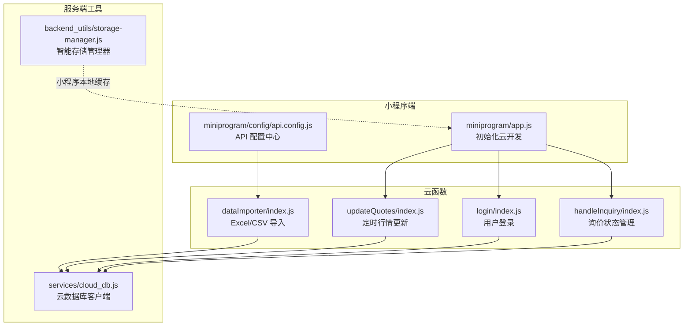
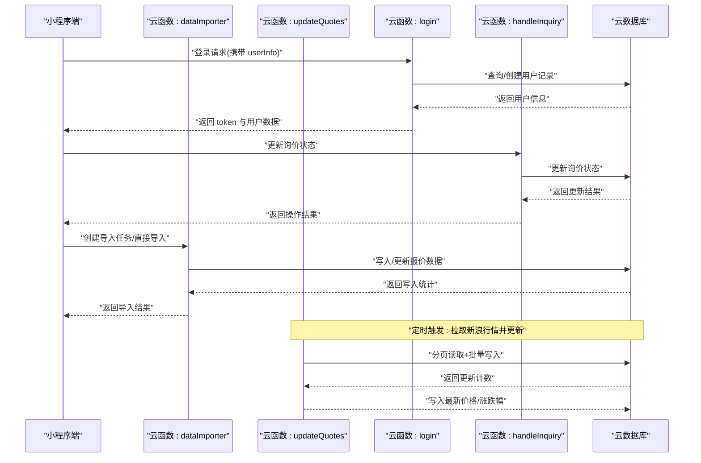
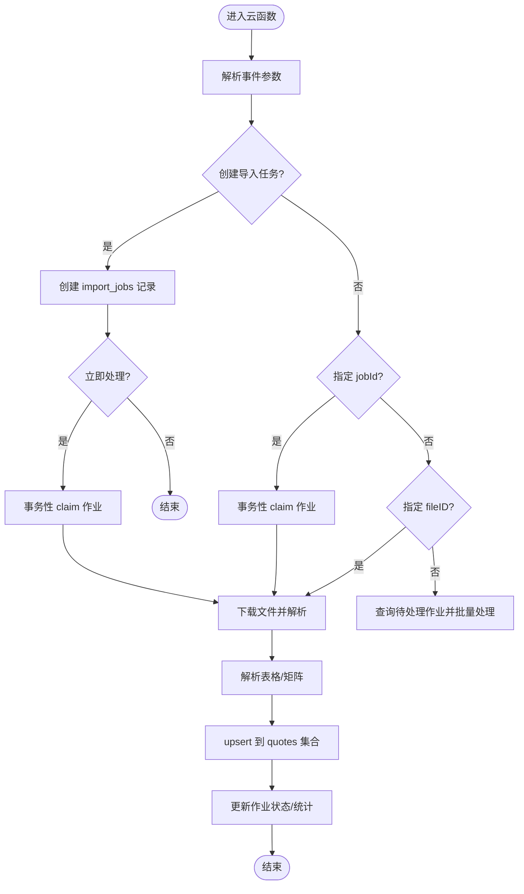
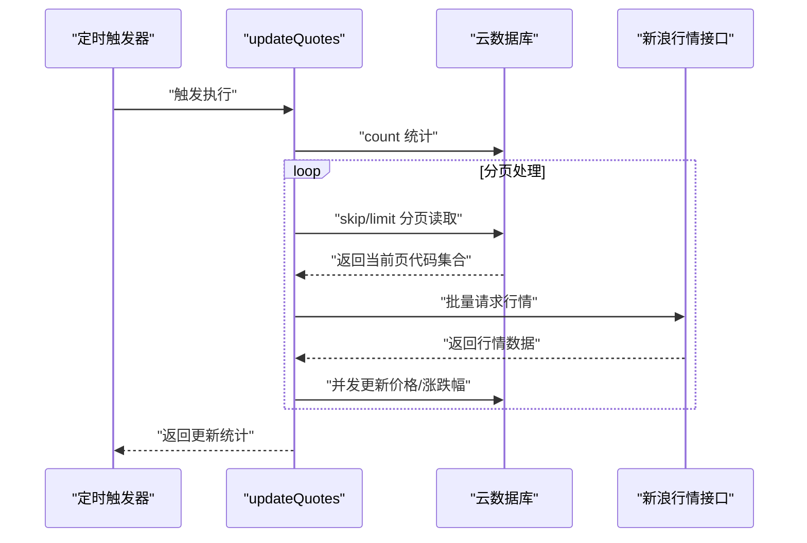
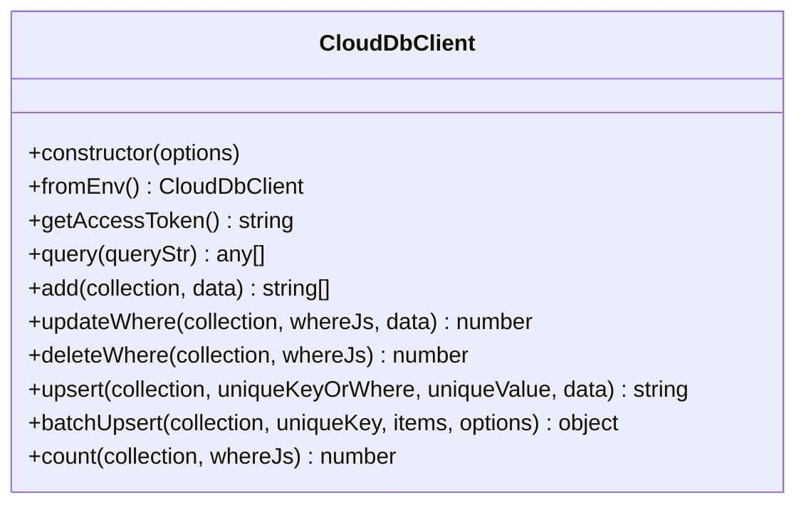
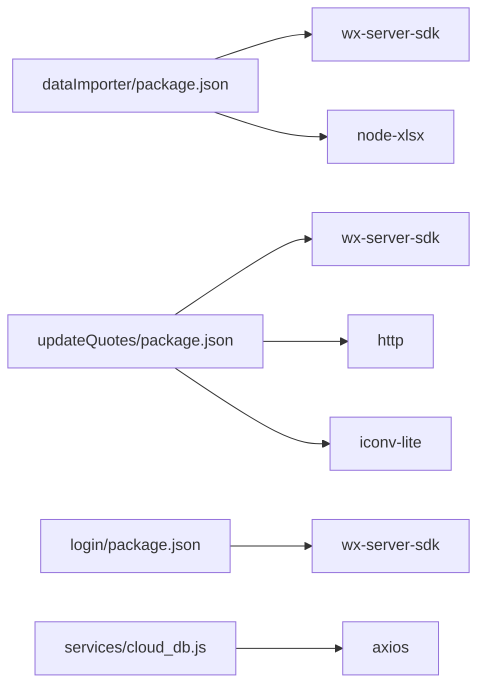

# 云开发集成

<cite>
**本文引用的文件**
- [cloudfunctions/dataImporter/index.js](file://cloudfunctions/dataImporter/index.js)
- [cloudfunctions/dataImporter/config.json](file://cloudfunctions/dataImporter/config.json)
- [cloudfunctions/dataImporter/package.json](file://cloudfunctions/dataImporter/package.json)
- [cloudfunctions/updateQuotes/index.js](file://cloudfunctions/updateQuotes/index.js)
- [cloudfunctions/updateQuotes/config.json](file://cloudfunctions/updateQuotes/config.json)
- [cloudfunctions/login/index.js](file://cloudfunctions/login/index.js)
- [cloudfunctions/login/package.json](file://cloudfunctions/login/package.json)
- [cloudfunctions/handleInquiry/index.js](file://cloudfunctions/handleInquiry/index.js)
- [miniprogram/app.js](file://miniprogram/app.js)
- [miniprogram/config/api.config.js](file://miniprogram/config/api.config.js)
- [services/cloud_db.js](file://services/cloud_db.js)
- [backend_utils/storage-manager.js](file://backend_utils/storage-manager.js)
</cite>

## 目录
1. [简介](#简介)
2. [项目结构](#项目结构)
3. [核心组件](#核心组件)
4. [架构总览](#架构总览)
5. [详细组件分析](#详细组件分析)
6. [依赖关系分析](#依赖关系分析)
7. [性能考量](#性能考量)
8. [故障排查指南](#故障排查指南)
9. [结论](#结论)
10. [附录](#附录)

## 简介
本文件面向微信小程序云开发集成场景，系统性梳理并文档化以下内容：
- 微信云开发架构与运行机制
- 云函数配置、触发机制与异步处理
- 云数据库操作与批量写入策略
- 云存储使用与文件上传下载流程
- 云开发 SDK 的使用、环境变量与错误处理
- 与后端 API 的集成方式与数据同步机制
- 最佳实践、安全配置与性能优化策略

## 项目结构
围绕云开发的关键目录与文件如下：
- 云函数目录：cloudfunctions 下包含 dataImporter、updateQuotes、login、handleInquiry 等函数，每个函数均配有独立的 package.json 与可选的 config.json 触发器配置
- 小程序端：miniprogram 目录包含 app.js 初始化云能力、api.config.js 统一管理 API 地址
- 服务层工具：services/cloud_db.js 提供 Node 端云数据库客户端；backend_utils/storage-manager.js 提供智能存储管理器

图表来源
- [miniprogram/app.js](file://miniprogram/app.js#L25-L42)
- [miniprogram/config/api.config.js](file://miniprogram/config/api.config.js#L11-L57)
- [cloudfunctions/dataImporter/index.js](file://cloudfunctions/dataImporter/index.js#L342-L391)
- [cloudfunctions/updateQuotes/index.js](file://cloudfunctions/updateQuotes/index.js#L95-L179)
- [cloudfunctions/login/index.js](file://cloudfunctions/login/index.js#L11-L91)
- [cloudfunctions/handleInquiry/index.js](file://cloudfunctions/handleInquiry/index.js#L12-L80)
- [services/cloud_db.js](file://services/cloud_db.js#L7-L37)
- [backend_utils/storage-manager.js](file://backend_utils/storage-manager.js#L7-L57)

章节来源
- [miniprogram/app.js](file://miniprogram/app.js#L25-L42)
- [miniprogram/config/api.config.js](file://miniprogram/config/api.config.js#L11-L57)

## 核心组件
- 云函数：负责数据导入、定时行情更新、用户登录、询价状态管理等业务逻辑
- 云数据库客户端：提供 Node 端访问云数据库的能力，支持查询、插入、更新、批量 upsert 等
- 小程序云初始化与 API 配置：统一管理环境 ID、API 基础地址与环境切换
- 智能存储管理器：提供本地缓存、压缩、加密、LRU 淘汰、同步队列等能力

章节来源
- [cloudfunctions/dataImporter/index.js](file://cloudfunctions/dataImporter/index.js#L342-L391)
- [cloudfunctions/updateQuotes/index.js](file://cloudfunctions/updateQuotes/index.js#L95-L179)
- [cloudfunctions/login/index.js](file://cloudfunctions/login/index.js#L11-L91)
- [cloudfunctions/handleInquiry/index.js](file://cloudfunctions/handleInquiry/index.js#L12-L80)
- [services/cloud_db.js](file://services/cloud_db.js#L7-L37)
- [backend_utils/storage-manager.js](file://backend_utils/storage-manager.js#L7-L57)

## 架构总览
下图展示小程序端、云函数与云数据库的整体交互路径，以及定时触发与手动触发的协同工作方式。

图表来源
- [cloudfunctions/login/index.js](file://cloudfunctions/login/index.js#L11-L91)
- [cloudfunctions/handleInquiry/index.js](file://cloudfunctions/handleInquiry/index.js#L12-L80)
- [cloudfunctions/dataImporter/index.js](file://cloudfunctions/dataImporter/index.js#L342-L391)
- [cloudfunctions/updateQuotes/index.js](file://cloudfunctions/updateQuotes/index.js#L95-L179)

## 详细组件分析

### 云函数：dataImporter（Excel/CSV 导入）
- 功能概述
  - 支持 Excel/CSV 解析，构建报价文档并 upsert 到云数据库
  - 支持作业队列（import_jobs）的创建、轮询与去重
  - 并发控制与分页写入，避免 OOM 与写库压力过大
- 关键特性
  - 文件大小限制与 SHA1 去重，防止重复导入
  - 矩阵型报价表解析与字段映射
  - 事务性作业状态变更（claimJob）、失败回滚与进度记录
- 触发机制
  - 通过定时触发器周期性扫描待处理作业
- 异步处理
  - withConcurrency 控制并发写入
  - 分页读取与流式处理，降低内存占用

图表来源
- [cloudfunctions/dataImporter/index.js](file://cloudfunctions/dataImporter/index.js#L273-L318)
- [cloudfunctions/dataImporter/index.js](file://cloudfunctions/dataImporter/index.js#L320-L340)
- [cloudfunctions/dataImporter/config.json](file://cloudfunctions/dataImporter/config.json#L5-L12)

章节来源
- [cloudfunctions/dataImporter/index.js](file://cloudfunctions/dataImporter/index.js#L1-L392)
- [cloudfunctions/dataImporter/config.json](file://cloudfunctions/dataImporter/config.json#L1-L13)
- [cloudfunctions/dataImporter/package.json](file://cloudfunctions/dataImporter/package.json#L1-L11)

### 云函数：updateQuotes（定时行情更新）
- 功能概述
  - 通过定时触发器拉取新浪行情，按页分批读取并并发写入
  - 支持每日收盘后更新昨收价
- 关键特性
  - 分页读取（每页固定大小），避免一次性加载过多数据
  - 内部并发池控制写入并发，提升吞吐
  - 请求超时保护，避免阻塞
- 触发机制
  - 市场交易时段定时更新与每日收盘定时更新

图表来源
- [cloudfunctions/updateQuotes/index.js](file://cloudfunctions/updateQuotes/index.js#L95-L179)
- [cloudfunctions/updateQuotes/config.json](file://cloudfunctions/updateQuotes/config.json#L5-L16)

章节来源
- [cloudfunctions/updateQuotes/index.js](file://cloudfunctions/updateQuotes/index.js#L1-L180)
- [cloudfunctions/updateQuotes/config.json](file://cloudfunctions/updateQuotes/config.json#L1-L17)

### 云函数：login（用户登录）
- 功能概述
  - 获取用户 openid/unionid/appid，查询或创建用户记录
  - 生成简易 token 返回给小程序端
- 安全与错误处理
  - 异常捕获并返回结构化错误信息
  - 建议在生产环境使用 JWT 等更强鉴权方案

章节来源
- [cloudfunctions/login/index.js](file://cloudfunctions/login/index.js#L1-L92)
- [cloudfunctions/login/package.json](file://cloudfunctions/login/package.json#L1-L14)

### 云函数：handleInquiry（询价状态管理）
- 功能概述
  - 支持更新询价状态与统计各状态数量
  - 使用聚合查询进行分组统计
- 错误处理
  - 对异常进行捕获并返回错误信息

章节来源
- [cloudfunctions/handleInquiry/index.js](file://cloudfunctions/handleInquiry/index.js#L1-L81)

### 云数据库客户端：services/cloud_db.js
- 功能概述
  - 提供 Node 端访问云数据库的完整封装，包括查询、新增、更新、删除、upsert、批量 upsert、统计等
  - 支持环境变量注入（环境 ID、AppID、Secret），具备速率限制与指数退避重试
  - 并发限流与等待队列，避免 QPS 抖动
- 环境变量
  - WX_CLOUD_ENV/WX_ENV_ID：云环境 ID
  - WX_APPID/WX_SECRET：微信应用凭证
  - WX_DB_MAX_INFLIGHT/WX_CLOUD_MAX_INFLIGHT：并发上限
  - WX_DB_MAX_RETRIES/WX_CLOUD_MAX_RETRIES：最大重试次数
  - WX_DB_CHUNK_SIZE/WX_CLOUD_CHUNK_SIZE：批量写入块大小
  - WX_DB_MAX_WORKERS/WX_CLOUD_MAX_WORKERS：写并发

图表来源
- [services/cloud_db.js](file://services/cloud_db.js#L7-L327)

章节来源
- [services/cloud_db.js](file://services/cloud_db.js#L1-L327)

### 小程序端：云初始化与 API 配置
- 云初始化
  - 在 App.onLaunch 中初始化云开发，设置环境 ID 与 traceUser
- API 配置中心
  - 通过环境变量判断开发/生产环境，动态选择 API 基础地址
  - 提供 getApiUrl/getBaseUrl 工具，支持强制使用云端地址

章节来源
- [miniprogram/app.js](file://miniprogram/app.js#L25-L42)
- [miniprogram/config/api.config.js](file://miniprogram/config/api.config.js#L11-L57)

### 智能存储管理器：backend_utils/storage-manager.js
- 功能概述
  - 提供本地缓存、压缩、加密、LRU 淘汰、同步队列、观察者模式等能力
  - 支持批量操作、过期清理、统计信息导出
- 适用场景
  - 小程序端离线数据持久化、性能优化与用户体验增强

章节来源
- [backend_utils/storage-manager.js](file://backend_utils/storage-manager.js#L1-L776)

## 依赖关系分析
- 云函数依赖
  - dataImporter：依赖 wx-server-sdk、node-xlsx；通过定时触发器轮询作业
  - updateQuotes：依赖 wx-server-sdk、http、iconv-lite；定时拉取新浪行情
  - login：依赖 wx-server-sdk；无定时触发器
  - handleInquiry：依赖 wx-server-sdk；无定时触发器
- 云数据库客户端依赖
  - axios：用于调用微信云数据库 API
  - 环境变量：WX_CLOUD_ENV/WX_APPID/WX_SECRET 等

图表来源
- [cloudfunctions/dataImporter/package.json](file://cloudfunctions/dataImporter/package.json#L6-L10)
- [cloudfunctions/updateQuotes/package.json](file://cloudfunctions/updateQuotes/package.json#L1-L14)
- [cloudfunctions/login/package.json](file://cloudfunctions/login/package.json#L11-L13)
- [services/cloud_db.js](file://services/cloud_db.js#L1-L19)

章节来源
- [cloudfunctions/dataImporter/package.json](file://cloudfunctions/dataImporter/package.json#L1-L11)
- [cloudfunctions/updateQuotes/package.json](file://cloudfunctions/updateQuotes/package.json#L1-L14)
- [cloudfunctions/login/package.json](file://cloudfunctions/login/package.json#L1-L14)
- [services/cloud_db.js](file://services/cloud_db.js#L1-L19)

## 性能考量
- 云函数侧
  - 分页读取与并发写入：updateQuotes 使用分页与并发池，降低内存峰值与写库压力
  - 事务性作业状态变更：dataImporter 使用事务 claim 作业，保证幂等与一致性
  - 请求超时与重试：updateQuotes 对外部 HTTP 请求设置超时，避免长时间阻塞
- 云数据库客户端
  - 并发限流与等待队列：避免突发流量导致 QPS 抖动
  - 指数退避重试：对限流/频率限制类错误进行自适应等待
- 小程序端
  - 智能存储管理器：压缩、加密、LRU、同步队列，减少网络与 IO 压力
  - 预加载与懒加载：优化首屏与关键路径性能

章节来源
- [cloudfunctions/updateQuotes/index.js](file://cloudfunctions/updateQuotes/index.js#L101-L164)
- [cloudfunctions/dataImporter/index.js](file://cloudfunctions/dataImporter/index.js#L24-L35)
- [services/cloud_db.js](file://services/cloud_db.js#L57-L70)
- [services/cloud_db.js](file://services/cloud_db.js#L127-L132)
- [backend_utils/storage-manager.js](file://backend_utils/storage-manager.js#L118-L185)

## 故障排查指南
- 云函数常见问题
  - 文件过大：dataImporter 对上传文件长度进行限制，超过阈值会直接失败并记录错误
  - 重复导入：基于 SHA1 去重，若检测到相同文件则跳过并记录重复作业
  - 作业状态异常：claimJob 失败通常表示作业已被其他实例处理或状态非 pending
  - 外部接口超时：updateQuotes 对 HTTP 请求设置超时，避免长时间阻塞
- 云数据库客户端
  - 访问令牌失效：自动刷新，但需检查 WX_APPID/WX_SECRET 配置
  - QPS 限流：客户端内置指数退避与等待队列，必要时调整并发上限
- 小程序端
  - 云初始化失败：确认 env 与基础库版本
  - API 地址错误：检查环境变量与 getAccountInfoSync 返回值

章节来源
- [cloudfunctions/dataImporter/index.js](file://cloudfunctions/dataImporter/index.js#L276-L318)
- [cloudfunctions/dataImporter/index.js](file://cloudfunctions/dataImporter/index.js#L251-L261)
- [cloudfunctions/updateQuotes/index.js](file://cloudfunctions/updateQuotes/index.js#L50-L55)
- [services/cloud_db.js](file://services/cloud_db.js#L72-L98)
- [services/cloud_db.js](file://services/cloud_db.js#L127-L139)
- [miniprogram/app.js](file://miniprogram/app.js#L28-L36)

## 结论
本项目在微信云开发框架下，实现了从数据导入、定时行情更新、用户登录到询价管理的完整闭环。通过云函数的定时触发与事务性作业管理、云数据库客户端的并发限流与重试机制、以及小程序端的智能存储与性能优化，整体具备良好的稳定性与扩展性。建议在生产环境中进一步强化鉴权与安全策略，并持续优化数据同步与缓存策略以提升用户体验。

## 附录
- 环境变量清单（云数据库客户端）
  - WX_CLOUD_ENV/WX_ENV_ID：云环境 ID
  - WX_APPID/WX_SECRET：微信应用凭证
  - WX_DB_MAX_INFLIGHT/WX_CLOUD_MAX_INFLIGHT：并发上限
  - WX_DB_MAX_RETRIES/WX_CLOUD_MAX_RETRIES：最大重试次数
  - WX_DB_CHUNK_SIZE/WX_CLOUD_CHUNK_SIZE：批量写入块大小
  - WX_DB_MAX_WORKERS/WX_CLOUD_MAX_WORKERS：写并发
- 云函数触发器配置
  - dataImporter：定时轮询作业
  - updateQuotes：市场交易时段与每日收盘定时更新

章节来源
- [services/cloud_db.js](file://services/cloud_db.js#L27-L51)
- [cloudfunctions/dataImporter/config.json](file://cloudfunctions/dataImporter/config.json#L5-L12)
- [cloudfunctions/updateQuotes/config.json](file://cloudfunctions/updateQuotes/config.json#L5-L16)