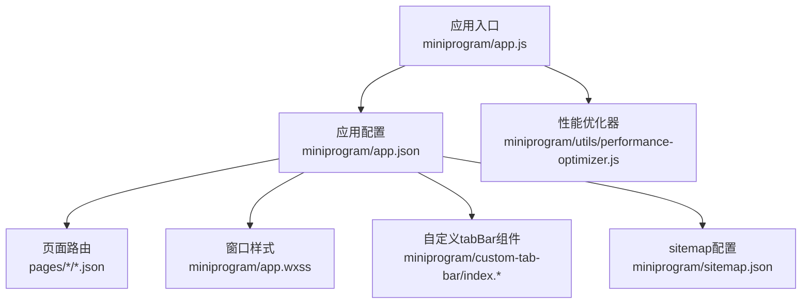
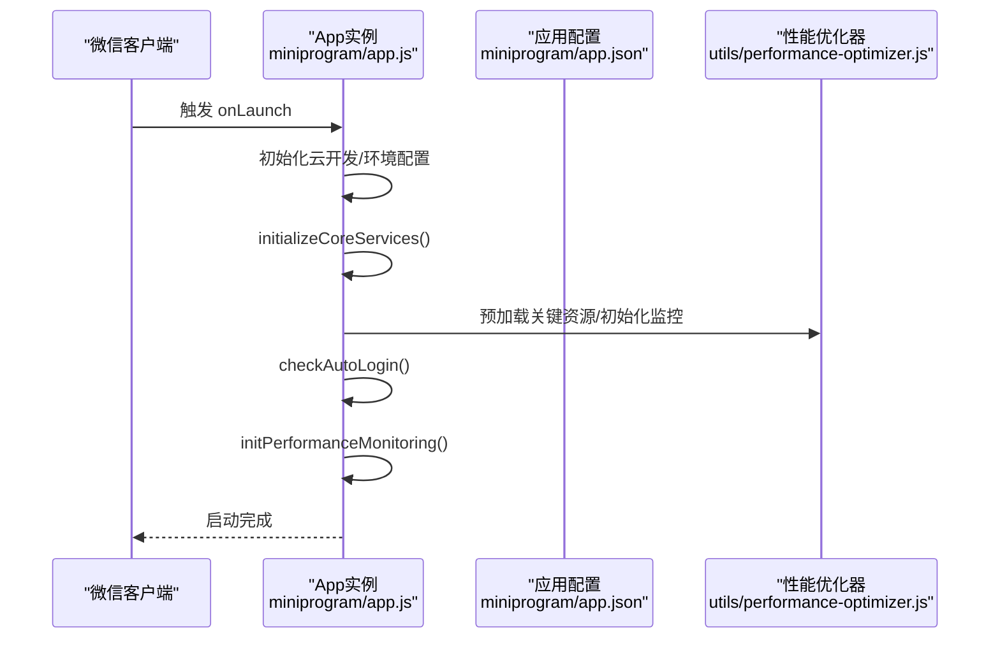
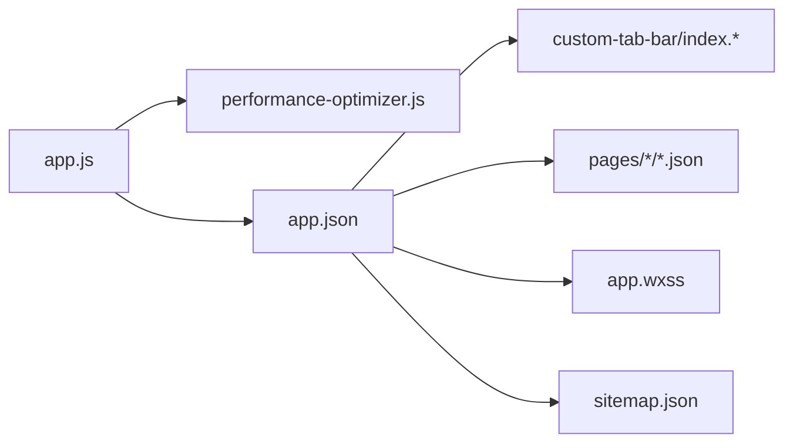

# 应用配置

<cite>
**本文引用的文件**
- [miniprogram/app.json](file://miniprogram/app.json)
- [miniprogram/app.js](file://miniprogram/app.js)
- [miniprogram/app.wxss](file://miniprogram/app.wxss)
- [miniprogram/custom-tab-bar/index.json](file://miniprogram/custom-tab-bar/index.json)
- [miniprogram/sitemap.json](file://miniprogram/sitemap.json)
- [miniprogram/pages/index/index.json](file://miniprogram/pages/index/index.json)
- [miniprogram/pages/quotes/quotes.json](file://miniprogram/pages/quotes/quotes.json)
- [miniprogram/pages/account/account.json](file://miniprogram/pages/account/account.json)
- [miniprogram/pages/profile/profile.json](file://miniprogram/pages/profile/profile.json)
- [miniprogram/pages/chart/chart.json](file://miniprogram/pages/chart/chart.json)
- [miniprogram/pages/login/login.json](file://miniprogram/pages/login/login.json)
- [miniprogram/pages/workspace/workspace.json](file://miniprogram/pages/workspace/workspace.json)
- [miniprogram/pages/option-matrix/option-matrix.json](file://miniprogram/pages/option-matrix/option-matrix.json)
- [project.config.json](file://project.config.json)
- [miniprogram/utils/performance-optimizer.js](file://miniprogram/utils/performance-optimizer.js)
</cite>

## 目录
1. [简介](#简介)
2. [项目结构](#项目结构)
3. [核心组件](#核心组件)
4. [架构总览](#架构总览)
5. [详细组件分析](#详细组件分析)
6. [依赖关系分析](#依赖关系分析)
7. [性能考量](#性能考量)
8. [故障排查指南](#故障排查指南)
9. [结论](#结论)
10. [附录](#附录)

## 简介
本文件面向微信小程序开发者，系统性梳理并解读应用配置，重点覆盖以下方面：
- app.json 的页面路由、窗口样式、tabBar、权限与后台运行、网络超时、调试与 sitemap 等配置项
- 应用启动流程与全局配置选项
- 主题色彩与样式体系
- 背景音乐支持与调试模式设置
- 最佳实践、性能优化建议与常见问题解决方案

## 项目结构
该小程序采用标准的“分包/页面”组织方式，核心配置集中在 miniprogram 目录下，包含应用入口、样式、自定义 tabBar 组件以及各页面的局部配置。

图表来源
- [miniprogram/app.js](file://miniprogram/app.js#L1-L225)
- [miniprogram/app.json](file://miniprogram/app.json#L1-L78)
- [miniprogram/app.wxss](file://miniprogram/app.wxss#L1-L140)
- [miniprogram/custom-tab-bar/index.json](file://miniprogram/custom-tab-bar/index.json#L1-L3)
- [miniprogram/sitemap.json](file://miniprogram/sitemap.json#L1-L7)

章节来源
- [miniprogram/app.json](file://miniprogram/app.json#L1-L78)
- [miniprogram/app.js](file://miniprogram/app.js#L1-L225)
- [miniprogram/app.wxss](file://miniprogram/app.wxss#L1-L140)
- [miniprogram/custom-tab-bar/index.json](file://miniprogram/custom-tab-bar/index.json#L1-L3)
- [miniprogram/sitemap.json](file://miniprogram/sitemap.json#L1-L7)

## 核心组件
- 应用配置中心：通过 app.json 统一声明页面路由、窗口样式、tabBar、权限、后台运行、网络超时、调试开关与 sitemap 位置。
- 启动与生命周期：app.js 提供 onLaunch/onShow/onHide/onError 等生命周期钩子，并初始化云开发、核心服务、性能监控与自动登录。
- 主题与样式：app.wxss 定义全局 CSS 变量与通用样式类，统一主色调、文本与背景色。
- 自定义 tabBar：通过 custom-tab-bar 组件实现自定义底部导航，提升交互一致性。
- Sitemap 与调试：sitemap.json 控制页面可被搜索引擎收录；project.config.json 控制编译与上传行为，包含 sitemap 校验开关。

章节来源
- [miniprogram/app.json](file://miniprogram/app.json#L1-L78)
- [miniprogram/app.js](file://miniprogram/app.js#L1-L225)
- [miniprogram/app.wxss](file://miniprogram/app.wxss#L1-L140)
- [miniprogram/custom-tab-bar/index.json](file://miniprogram/custom-tab-bar/index.json#L1-L3)
- [miniprogram/sitemap.json](file://miniprogram/sitemap.json#L1-L7)
- [project.config.json](file://project.config.json#L1-L81)

## 架构总览
应用启动流程与配置联动如下：

图表来源
- [miniprogram/app.js](file://miniprogram/app.js#L25-L175)
- [miniprogram/app.json](file://miniprogram/app.json#L1-L78)
- [miniprogram/utils/performance-optimizer.js](file://miniprogram/utils/performance-optimizer.js#L1-L817)

章节来源
- [miniprogram/app.js](file://miniprogram/app.js#L25-L175)
- [miniprogram/app.json](file://miniprogram/app.json#L1-L78)
- [miniprogram/utils/performance-optimizer.js](file://miniprogram/utils/performance-optimizer.js#L1-L817)

## 详细组件分析

### 页面路由配置（pages）
- 作用：声明小程序所有页面路径，决定页面栈与导航顺序。
- 关键点：
  - 路径为相对 app.json 的相对路径，如 pages/index/index。
  - 页面顺序影响首次打开的默认页面与页面栈行为。
- 影响范围：影响启动页、页面跳转、分包策略（若启用分包）。

章节来源
- [miniprogram/app.json](file://miniprogram/app.json#L2-L23)

### 窗口样式设置（window）
- 导航栏与背景：
  - 导航栏背景色、文字颜色、标题文本由 window 下字段统一配置。
  - 页面级可通过页面 json 覆盖部分字段（如导航栏标题、背景色）。
- 背景色与风格：
  - backgroundColor 与 backgroundTextStyle 控制页面背景与下拉刷新指示风格。
- 典型值：
  - 导航栏背景色与文字色形成对比，提升可读性。
  - 背景色与业务主题一致，减少视觉割裂。

章节来源
- [miniprogram/app.json](file://miniprogram/app.json#L24-L30)
- [miniprogram/pages/index/index.json](file://miniprogram/pages/index/index.json#L1-L6)
- [miniprogram/pages/quotes/quotes.json](file://miniprogram/pages/quotes/quotes.json#L1-L10)
- [miniprogram/pages/account/account.json](file://miniprogram/pages/account/account.json#L1-L6)
- [miniprogram/pages/profile/profile.json](file://miniprogram/pages/profile/profile.json#L1-L6)
- [miniprogram/pages/chart/chart.json](file://miniprogram/pages/chart/chart.json#L1-L6)
- [miniprogram/pages/login/login.json](file://miniprogram/pages/login/login.json#L1-L10)

### tabBar 配置
- 自定义开关：custom 设为 true 时启用自定义 tabBar 组件。
- 颜色体系：color（未选中）、selectedColor（选中）、backgroundColor、borderStyle。
- 列表项：list 中每个元素对应一个 tab 项，包含 pagePath、text、iconPath、selectedIconPath。
- 注意事项：
  - 自定义 tabBar 与原生 tabBar 不可同时生效。
  - 图标路径需指向实际存在的图片资源。

章节来源
- [miniprogram/app.json](file://miniprogram/app.json#L31-L63)
- [miniprogram/custom-tab-bar/index.json](file://miniprogram/custom-tab-bar/index.json#L1-L3)

### 权限声明（permission）
- 用途：向用户展示申请权限的目的，如地理位置。
- 表达方式：scope.userLocation.desc 说明用途。
- 建议：仅声明必要权限，描述清晰、简洁，遵循最小化原则。

章节来源
- [miniprogram/app.json](file://miniprogram/app.json#L64-L68)

### 后台运行与背景音乐（requiredBackgroundModes）
- 用途：声明应用需要在后台继续运行的能力，如音频播放。
- 值：audio 表示允许后台播放音频。
- 注意：涉及后台运行能力时，需满足平台审核要求与用户授权。

章节来源
- [miniprogram/app.json](file://miniprogram/app.json#L69-L71)

### 网络超时设置（networkTimeout）
- 字段：request、downloadFile。
- 作用：设置网络请求与下载文件的超时时间，避免长时间无响应。
- 建议：结合业务场景调整，兼顾用户体验与稳定性。

章节来源
- [miniprogram/app.json](file://miniprogram/app.json#L72-L75)

### 调试模式与 sitemap
- 调试开关：debug=false，生产环境建议关闭。
- sitemap：sitemapLocation 指向 sitemap.json，规则允许或限制页面被索引。
- 项目配置：project.config.json 中 setting.checkSiteMap=true，构建时会校验 sitemap。

章节来源
- [miniprogram/app.json](file://miniprogram/app.json#L76-L78)
- [miniprogram/sitemap.json](file://miniprogram/sitemap.json#L1-L7)
- [project.config.json](file://project.config.json#L22-L22)

### 应用启动流程与全局配置
- 启动阶段：
  - onLaunch：初始化云开发、核心服务、性能监控、自动登录。
  - onShow/onHide：前台/后台切换时的数据同步与缓存清理。
  - onError：全局错误捕获与统计。
- 全局配置：
  - 全局数据 globalData：userInfo、optionPricing、notificationManager、performance、storageManager、uiEnhancer 等。
  - 性能监控：内存告警监听、定期生成性能报告、页面/API/渲染/交互性能指标采集。

章节来源
- [miniprogram/app.js](file://miniprogram/app.js#L8-L220)
- [miniprogram/utils/performance-optimizer.js](file://miniprogram/utils/performance-optimizer.js#L1-L817)

### 主题色彩与样式体系（CSS 变量）
- 全局变量：定义主色、成功/警告/危险/信息色、背景色、文本色、渐变色等。
- 页面样式：通过 page 选择器应用全局变量，保证整体风格一致。
- 组件样式：提供按钮、卡片、标签、间距与 Flex 工具类，便于复用。

章节来源
- [miniprogram/app.wxss](file://miniprogram/app.wxss#L1-L140)

### 页面级样式与导航
- 页面 json 可覆盖标题、导航样式、背景色与下拉刷新等。
- 示例：
  - quotes 页面使用自定义导航样式，提升沉浸感。
  - login 页面设置导航栏背景与文字色，突出登录主题。

章节来源
- [miniprogram/pages/quotes/quotes.json](file://miniprogram/pages/quotes/quotes.json#L1-L10)
- [miniprogram/pages/login/login.json](file://miniprogram/pages/login/login.json#L1-L10)

## 依赖关系分析
- app.js 依赖 utils/performance-optimizer.js 进行性能监控与资源预加载。
- app.json 决定页面路由与全局样式，间接影响页面级 json 的覆盖效果。
- custom-tab-bar 作为组件参与 tabBar 渲染，需与 app.json 的 custom:true 协同。

图表来源
- [miniprogram/app.js](file://miniprogram/app.js#L1-L225)
- [miniprogram/utils/performance-optimizer.js](file://miniprogram/utils/performance-optimizer.js#L1-L817)
- [miniprogram/app.json](file://miniprogram/app.json#L1-L78)
- [miniprogram/custom-tab-bar/index.json](file://miniprogram/custom-tab-bar/index.json#L1-L3)
- [miniprogram/sitemap.json](file://miniprogram/sitemap.json#L1-L7)
- [miniprogram/app.wxss](file://miniprogram/app.wxss#L1-L140)

章节来源
- [miniprogram/app.js](file://miniprogram/app.js#L1-L225)
- [miniprogram/utils/performance-optimizer.js](file://miniprogram/utils/performance-optimizer.js#L1-L817)
- [miniprogram/app.json](file://miniprogram/app.json#L1-L78)
- [miniprogram/custom-tab-bar/index.json](file://miniprogram/custom-tab-bar/index.json#L1-L3)
- [miniprogram/sitemap.json](file://miniprogram/sitemap.json#L1-L7)
- [miniprogram/app.wxss](file://miniprogram/app.wxss#L1-L140)

## 性能考量
- 启动阶段优化：
  - 异步初始化与延迟执行：使用 setTimeout 延迟关键资源预加载，避免阻塞首屏。
  - 懒加载与缓存：通过性能优化器实现模块懒加载与缓存，降低冷启动时间。
- 运行时监控：
  - 内存告警与缓存清理：监听内存警告，清理低优先级缓存。
  - 性能报告：周期性生成报告，包含页面加载、API 响应、渲染与交互延迟等指标。
- 网络与 IO：
  - 网络超时合理设置，避免长时间等待。
  - 图片懒加载与分包预下载，优化首屏与交互体验。

章节来源
- [miniprogram/app.js](file://miniprogram/app.js#L93-L119)
- [miniprogram/utils/performance-optimizer.js](file://miniprogram/utils/performance-optimizer.js#L1-L817)
- [miniprogram/app.json](file://miniprogram/app.json#L72-L75)

## 故障排查指南
- 启动失败或云开发初始化异常：
  - 检查基础库版本与云开发初始化参数（环境 ID）。
  - 确认 App.onLaunch 中的初始化逻辑未抛出未捕获异常。
- 页面样式不生效：
  - 确认页面 json 是否覆盖了 window 字段导致样式冲突。
  - 检查 app.wxss 中变量名与页面选择器是否正确。
- 自定义 tabBar 不显示：
  - 确认 app.json 的 custom:true 与 custom-tab-bar 组件配置正确。
  - 检查图标路径是否存在且可访问。
- 权限申请无效：
  - 确认 permission.scope.* 描述清晰，且在需要时触发授权。
- 背景音乐无法播放：
  - 确认 requiredBackgroundModes 包含 audio。
- 调试与 sitemap：
  - 若页面未被索引，检查 sitemap.json 规则与 app.json 的 sitemapLocation。
  - 构建时开启 setting.checkSiteMap 校验。

章节来源
- [miniprogram/app.js](file://miniprogram/app.js#L25-L42)
- [miniprogram/app.json](file://miniprogram/app.json#L31-L78)
- [miniprogram/sitemap.json](file://miniprogram/sitemap.json#L1-L7)
- [project.config.json](file://project.config.json#L22-L22)

## 结论
本项目通过 app.json 实现对页面路由、窗口样式、tabBar、权限、后台运行与网络超时的集中配置；配合 app.js 的启动流程与性能优化器，形成从启动到运行的完整配置闭环。建议在生产环境中关闭调试开关、合理设置网络超时、按需声明权限与后台能力，并持续利用性能监控报告进行优化迭代。

## 附录

### 配置最佳实践
- 页面路由：按业务模块归类，避免路径冗长；合理规划首屏页面。
- 窗口样式：统一导航栏配色与背景色，确保可读性与品牌一致性。
- tabBar：自定义时注意图标尺寸与状态色，保证交互一致性。
- 权限与后台：仅声明必要权限与能力，明确用途描述。
- 网络超时：根据接口特性设置合理超时，避免过短导致频繁失败。
- 调试与 sitemap：开发阶段开启调试与 sitemap 校验，发布前确认规则与开关。

### 常见问题与解决方案
- 页面标题/背景色不一致：检查页面 json 是否覆盖 window 字段。
- 自定义 tabBar 图标不显示：核对图标路径与文件名大小写。
- 性能报告缺失：确认性能优化器初始化与定时任务未被拦截。
- sitemap 校验失败：核对 sitemap.json 规则与 app.json 的 sitemapLocation。