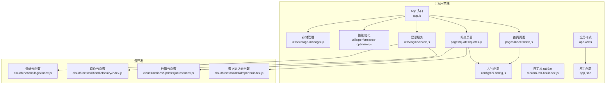
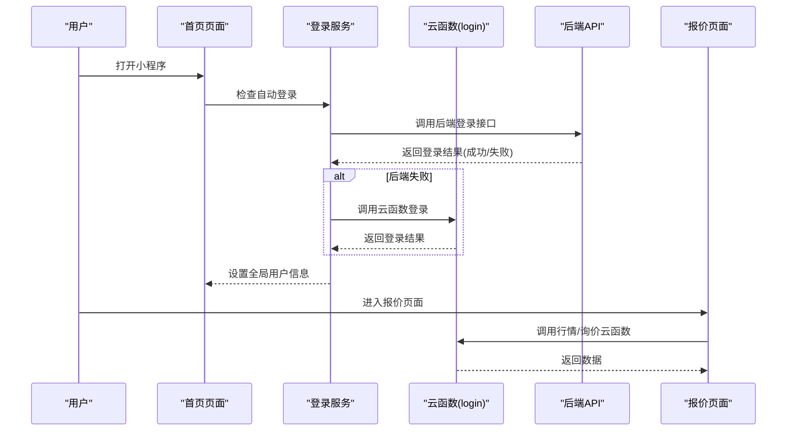
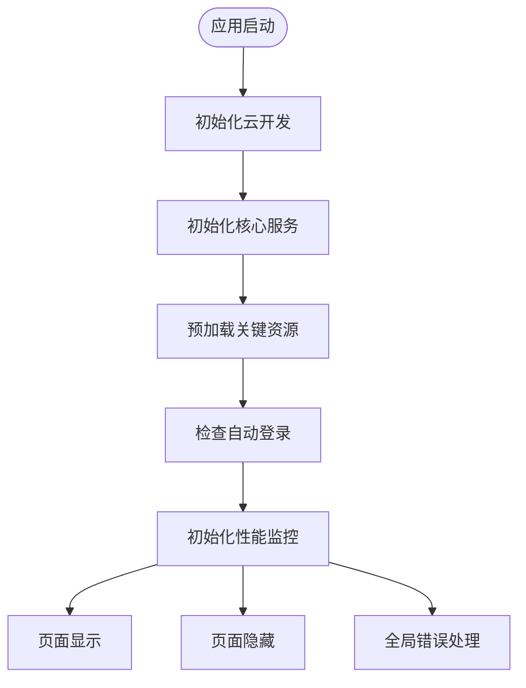
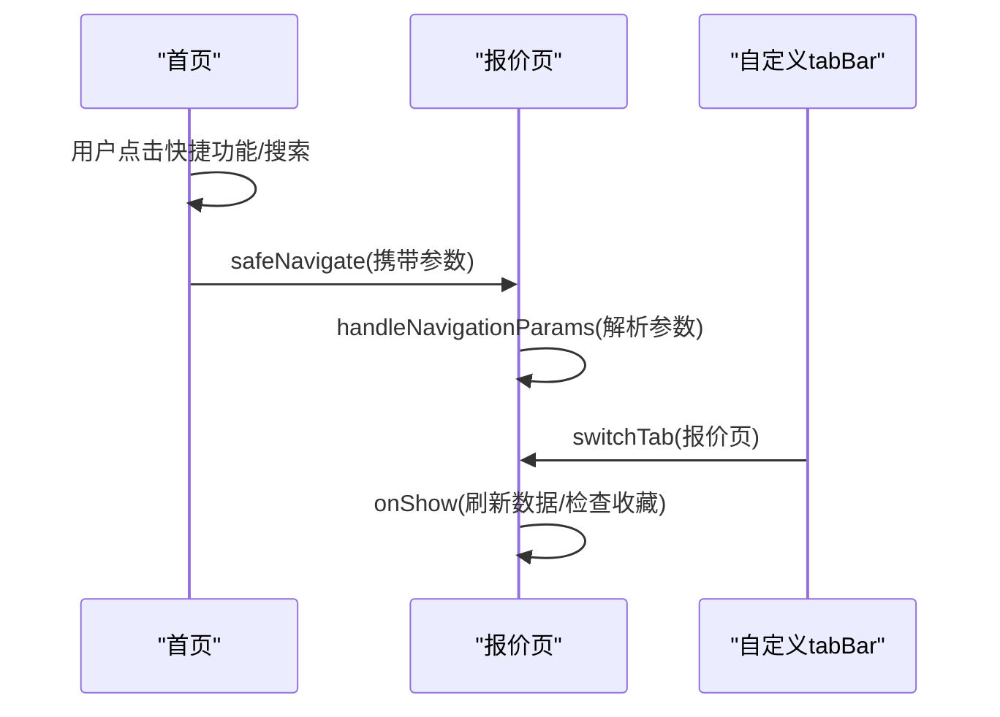
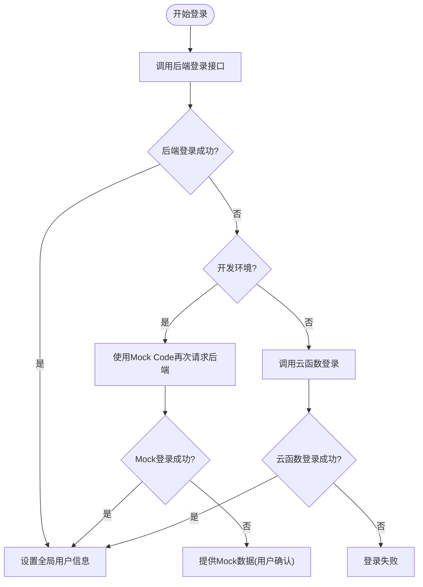
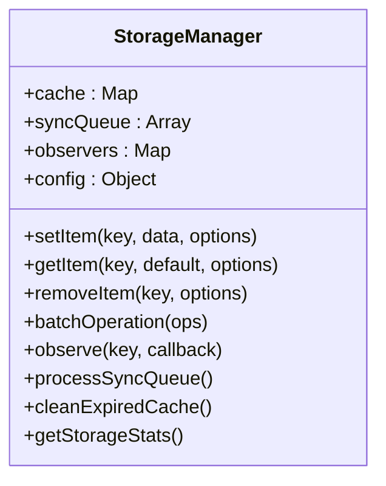
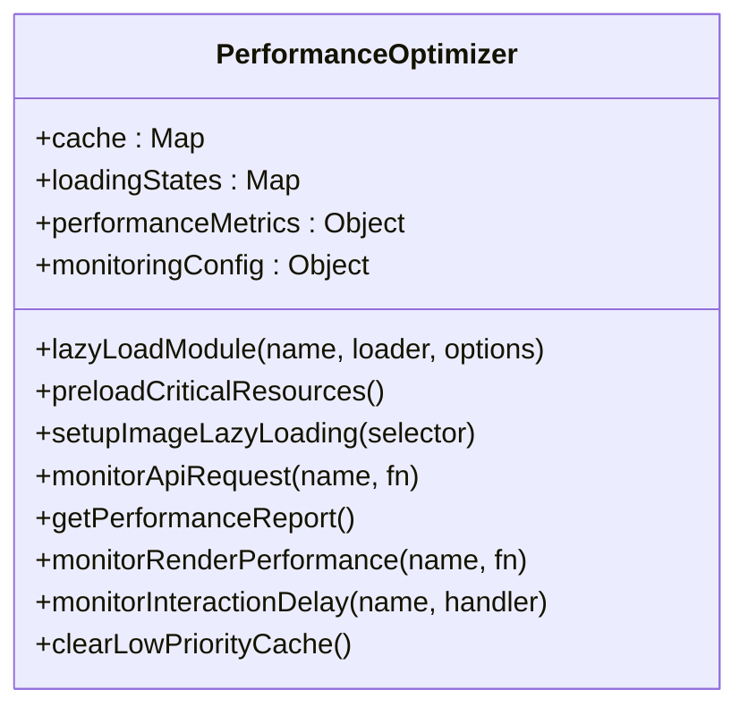
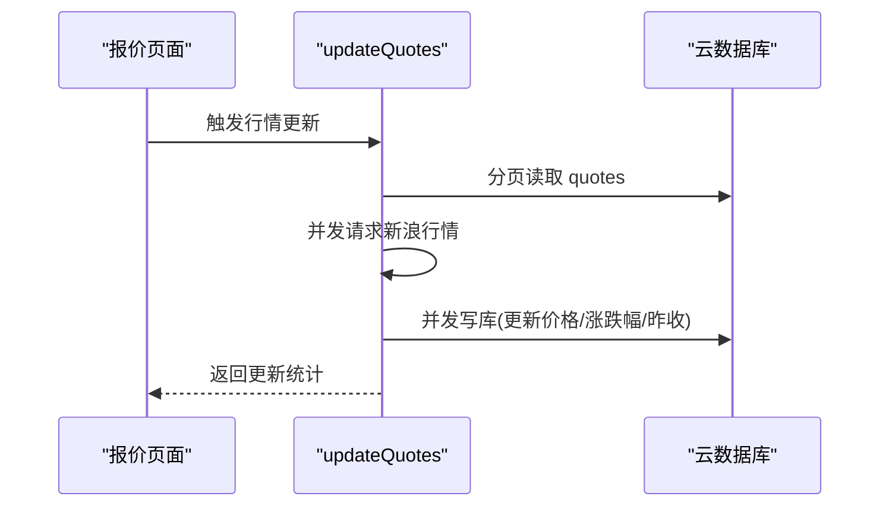
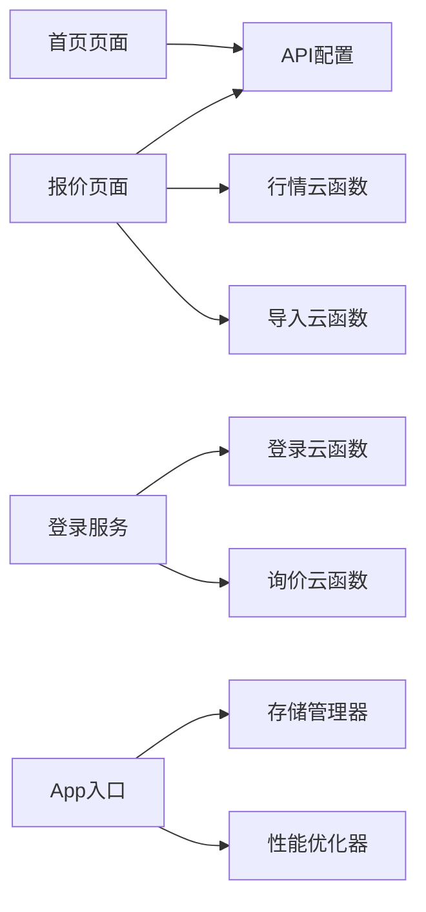

# 微信小程序

<cite>
**本文引用的文件**
- [miniprogram/app.js](file://miniprogram/app.js)
- [miniprogram/app.json](file://miniprogram/app.json)
- [miniprogram/app.wxss](file://miniprogram/app.wxss)
- [miniprogram/config/api.config.js](file://miniprogram/config/api.config.js)
- [miniprogram/pages/index/index.js](file://miniprogram/pages/index/index.js)
- [miniprogram/pages/quotes/quotes.js](file://miniprogram/pages/quotes/quotes.js)
- [miniprogram/utils/loginService.js](file://miniprogram/utils/loginService.js)
- [miniprogram/utils/storage-manager.js](file://miniprogram/utils/storage-manager.js)
- [miniprogram/utils/performance-optimizer.js](file://miniprogram/utils/performance-optimizer.js)
- [miniprogram/custom-tab-bar/index.js](file://miniprogram/custom-tab-bar/index.js)
- [cloudfunctions/login/index.js](file://cloudfunctions/login/index.js)
- [cloudfunctions/handleInquiry/index.js](file://cloudfunctions/handleInquiry/index.js)
- [cloudfunctions/updateQuotes/index.js](file://cloudfunctions/updateQuotes/index.js)
- [cloudfunctions/dataImporter/index.js](file://cloudfunctions/dataImporter/index.js)
</cite>

## 目录
1. [简介](#简介)
2. [项目结构](#项目结构)
3. [核心组件](#核心组件)
4. [架构总览](#架构总览)
5. [详细组件分析](#详细组件分析)
6. [依赖关系分析](#依赖关系分析)
7. [性能考虑](#性能考虑)
8. [故障排查指南](#故障排查指南)
9. [结论](#结论)
10. [附录](#附录)

## 简介
本项目是一个基于微信小程序框架的期权报价与询价平台，提供首页、报价、账户、我的等页面，支持用户登录、收藏、询价、行情展示、期权矩阵视图、自定义分组、工作台跳转等功能。项目采用前后端分离架构，前端通过云开发能力与云函数交互，结合本地存储与性能优化策略，实现稳定高效的用户体验。

## 项目结构
小程序根目录位于 miniprogram，核心文件包括应用入口、页面、工具类、样式与云函数。应用配置 app.json 定义页面列表、导航栏、tabBar、权限与网络超时等；样式 app.wxss 定义主题变量与通用样式；config/api.config.js 提供统一 API 地址管理；utils 下包含登录、存储、性能优化等工具；pages 下为各业务页面；cloudfunctions 下为云函数实现。

**图表来源**
- [miniprogram/app.js](file://miniprogram/app.js#L1-L225)
- [miniprogram/app.json](file://miniprogram/app.json#L1-L78)
- [miniprogram/app.wxss](file://miniprogram/app.wxss#L1-L140)
- [miniprogram/config/api.config.js](file://miniprogram/config/api.config.js#L1-L90)
- [miniprogram/utils/storage-manager.js](file://miniprogram/utils/storage-manager.js#L1-L776)
- [miniprogram/utils/performance-optimizer.js](file://miniprogram/utils/performance-optimizer.js#L1-L817)
- [miniprogram/utils/loginService.js](file://miniprogram/utils/loginService.js#L1-L492)
- [miniprogram/custom-tab-bar/index.js](file://miniprogram/custom-tab-bar/index.js#L1-L31)
- [miniprogram/pages/index/index.js](file://miniprogram/pages/index/index.js#L1-L710)
- [miniprogram/pages/quotes/quotes.js](file://miniprogram/pages/quotes/quotes.js#L1-L800)
- [cloudfunctions/login/index.js](file://cloudfunctions/login/index.js#L1-L92)
- [cloudfunctions/handleInquiry/index.js](file://cloudfunctions/handleInquiry/index.js#L1-L81)
- [cloudfunctions/updateQuotes/index.js](file://cloudfunctions/updateQuotes/index.js#L1-L180)
- [cloudfunctions/dataImporter/index.js](file://cloudfunctions/dataImporter/index.js#L1-L392)

**章节来源**
- [miniprogram/app.json](file://miniprogram/app.json#L1-L78)
- [miniprogram/app.js](file://miniprogram/app.js#L1-L225)
- [miniprogram/app.wxss](file://miniprogram/app.wxss#L1-L140)

## 核心组件
- 应用入口与生命周期：初始化云开发、核心服务、性能监控、自动登录与错误处理。
- 页面与导航：首页、报价、账户、我的等页面，自定义 tabBar 与页面间跳转。
- 登录与鉴权：本地登录服务封装，支持微信登录、云函数降级、Token 管理与自动刷新。
- 存储与缓存：智能存储管理器，提供 TTL、压缩、加密、LRU、观察者、批量操作与同步队列。
- 性能优化：懒加载、图片懒加载、分包预下载、内存告警处理、性能报告生成。
- API 配置：统一管理开发/生产环境 API 地址，支持云端与本地地址切换。
- 云函数：登录、询价状态更新与统计、行情批量更新、Excel 导入与去重。

**章节来源**
- [miniprogram/app.js](file://miniprogram/app.js#L25-L220)
- [miniprogram/utils/loginService.js](file://miniprogram/utils/loginService.js#L12-L33)
- [miniprogram/utils/storage-manager.js](file://miniprogram/utils/storage-manager.js#L118-L185)
- [miniprogram/utils/performance-optimizer.js](file://miniprogram/utils/performance-optimizer.js#L72-L117)
- [miniprogram/config/api.config.js](file://miniprogram/config/api.config.js#L29-L74)
- [cloudfunctions/login/index.js](file://cloudfunctions/login/index.js#L11-L92)
- [cloudfunctions/handleInquiry/index.js](file://cloudfunctions/handleInquiry/index.js#L11-L27)
- [cloudfunctions/updateQuotes/index.js](file://cloudfunctions/updateQuotes/index.js#L95-L180)
- [cloudfunctions/dataImporter/index.js](file://cloudfunctions/dataImporter/index.js#L342-L392)

## 架构总览
小程序前端通过 App 入口初始化全局状态与服务，页面通过 API 配置访问后端或云函数。登录流程优先走本地后端接口，失败时降级到云函数；报价页面通过云函数拉取/更新行情与询价数据；存储管理器负责本地持久化与缓存；性能优化器提供懒加载与监控；自定义 tabBar 提升导航体验。

**图表来源**
- [miniprogram/pages/index/index.js](file://miniprogram/pages/index/index.js#L267-L283)
- [miniprogram/utils/loginService.js](file://miniprogram/utils/loginService.js#L12-L33)
- [cloudfunctions/login/index.js](file://cloudfunctions/login/index.js#L11-L92)
- [miniprogram/pages/quotes/quotes.js](file://miniprogram/pages/quotes/quotes.js#L168-L191)

## 详细组件分析

### 应用入口与生命周期（App）
- 初始化云开发环境与 traceUser。
- 初始化核心服务：存储管理器、性能优化器、UI 增强、通知管理。
- 预加载关键资源（期权定价系统），避免阻塞启动。
- 自动登录与错误上报，应用前后台切换时的存储同步与检查。

**图表来源**
- [miniprogram/app.js](file://miniprogram/app.js#L25-L220)

**章节来源**
- [miniprogram/app.js](file://miniprogram/app.js#L25-L220)

### 页面与导航机制
- 首页页面：用户信息获取、轮播图、快捷功能、热门期权与市场指数展示、搜索与历史记录、下拉刷新。
- 报价页面：自选/指数/ETF 矩阵视图、交易商筛选、期限选择、期权报价展示、下单弹窗、分组管理、工作台跳转。
- 自定义 tabBar：四个 tab，支持图标与选中态切换，统一跳转逻辑。

**图表来源**
- [miniprogram/pages/index/index.js](file://miniprogram/pages/index/index.js#L225-L265)
- [miniprogram/pages/quotes/quotes.js](file://miniprogram/pages/quotes/quotes.js#L222-L229)
- [miniprogram/custom-tab-bar/index.js](file://miniprogram/custom-tab-bar/index.js#L24-L30)

**章节来源**
- [miniprogram/pages/index/index.js](file://miniprogram/pages/index/index.js#L1-L710)
- [miniprogram/pages/quotes/quotes.js](file://miniprogram/pages/quotes/quotes.js#L1-L800)
- [miniprogram/custom-tab-bar/index.js](file://miniprogram/custom-tab-bar/index.js#L1-L31)

### 登录与鉴权（登录服务）
- 微信登录：优先调用本地后端接口，失败时降级到云函数；开发环境支持 mock 与用户确认。
- Token 管理：存储 token、刷新 token、验证 token、登出清理。
- 自动登录：启动时验证 token，失败则尝试刷新，失败则清除状态。

**图表来源**
- [miniprogram/utils/loginService.js](file://miniprogram/utils/loginService.js#L12-L33)
- [cloudfunctions/login/index.js](file://cloudfunctions/login/index.js#L11-L92)

**章节来源**
- [miniprogram/utils/loginService.js](file://miniprogram/utils/loginService.js#L12-L33)
- [cloudfunctions/login/index.js](file://cloudfunctions/login/index.js#L11-L92)

### 存储与缓存（智能存储管理器）
- 数据持久化：setItem/getItem/removeItem，支持 TTL、压缩、加密、优先级、备份。
- 缓存策略：LRU 淘汰、内存缓存命中/未命中统计、过期清理。
- 批量操作：按优先级排序批量 set/get/remove/clear。
- 同步队列：定时批量同步到服务器，失败重试与统计。
- 观察者模式：对指定键或全局变更通知。

**图表来源**
- [miniprogram/utils/storage-manager.js](file://miniprogram/utils/storage-manager.js#L7-L776)

**章节来源**
- [miniprogram/utils/storage-manager.js](file://miniprogram/utils/storage-manager.js#L118-L185)
- [miniprogram/utils/storage-manager.js](file://miniprogram/utils/storage-manager.js#L342-L394)
- [miniprogram/utils/storage-manager.js](file://miniprogram/utils/storage-manager.js#L457-L496)

### 性能优化（性能优化器）
- 懒加载模块：带缓存与加载状态管理，支持 TTL 与优先级。
- 图片懒加载：基于 IntersectionObserver，进入视窗后加载。
- 分包预下载：预加载 charts/advanced-tools 等子包。
- 内存告警处理：清理低优先级缓存，生成性能报告。
- 性能监控：页面加载时间、API 响应时间、渲染时间、交互延迟、网络速度、缓存命中率。
- 数据预处理与缓存：对原始数据进行处理并缓存，支持强制刷新。

**图表来源**
- [miniprogram/utils/performance-optimizer.js](file://miniprogram/utils/performance-optimizer.js#L7-L817)

**章节来源**
- [miniprogram/utils/performance-optimizer.js](file://miniprogram/utils/performance-optimizer.js#L72-L117)
- [miniprogram/utils/performance-optimizer.js](file://miniprogram/utils/performance-optimizer.js#L188-L212)
- [miniprogram/utils/performance-optimizer.js](file://miniprogram/utils/performance-optimizer.js#L217-L262)
- [miniprogram/utils/performance-optimizer.js](file://miniprogram/utils/performance-optimizer.js#L306-L426)

### API 配置与环境切换
- 通过 __wxConfig 或 wx.getAccountInfoSync 判断环境版本，区分开发/生产。
- 支持本地开发与云端 Flask API 的地址切换，提供 getApiUrl/getBaseUrl。

**章节来源**
- [miniprogram/config/api.config.js](file://miniprogram/config/api.config.js#L29-L74)

### 云开发与云函数
- 登录云函数：根据 openid/unionid 查询或创建用户，生成 token 返回。
- 询价云函数：支持更新询价状态与统计查询。
- 行情云函数：分页批量抓取新浪行情，按页并发写库，支持更新昨收。
- 数据导入云函数：Excel 解析、字段映射、去重、UPSERT、事务与作业队列。

**图表来源**
- [miniprogram/pages/quotes/quotes.js](file://miniprogram/pages/quotes/quotes.js#L168-L191)
- [cloudfunctions/updateQuotes/index.js](file://cloudfunctions/updateQuotes/index.js#L95-L180)

**章节来源**
- [cloudfunctions/login/index.js](file://cloudfunctions/login/index.js#L11-L92)
- [cloudfunctions/handleInquiry/index.js](file://cloudfunctions/handleInquiry/index.js#L11-L81)
- [cloudfunctions/updateQuotes/index.js](file://cloudfunctions/updateQuotes/index.js#L95-L180)
- [cloudfunctions/dataImporter/index.js](file://cloudfunctions/dataImporter/index.js#L342-L392)

## 依赖关系分析
- 页面依赖：首页与报价页依赖 API 配置与登录服务；报价页依赖云函数进行数据更新与查询。
- 工具类依赖：App 初始化依赖存储与性能优化器；登录服务依赖 API 配置与云函数。
- 云函数依赖：登录/询价/行情/导入云函数分别依赖数据库与第三方接口。

**图表来源**
- [miniprogram/pages/index/index.js](file://miniprogram/pages/index/index.js#L1-L710)
- [miniprogram/pages/quotes/quotes.js](file://miniprogram/pages/quotes/quotes.js#L1-L800)
- [miniprogram/utils/loginService.js](file://miniprogram/utils/loginService.js#L1-L492)
- [cloudfunctions/login/index.js](file://cloudfunctions/login/index.js#L1-L92)
- [cloudfunctions/handleInquiry/index.js](file://cloudfunctions/handleInquiry/index.js#L1-L81)
- [cloudfunctions/updateQuotes/index.js](file://cloudfunctions/updateQuotes/index.js#L1-L180)
- [cloudfunctions/dataImporter/index.js](file://cloudfunctions/dataImporter/index.js#L1-L392)
- [miniprogram/app.js](file://miniprogram/app.js#L45-L62)

**章节来源**
- [miniprogram/app.js](file://miniprogram/app.js#L45-L62)
- [miniprogram/utils/loginService.js](file://miniprogram/utils/loginService.js#L12-L33)

## 性能考虑
- 懒加载与预加载：对期权定价系统等关键模块进行懒加载与预加载，减少首屏阻塞。
- 图片懒加载：IntersectionObserver 监听可视区域，降低渲染压力。
- 分包预下载：提前加载常用子包，缩短首次使用延迟。
- 内存告警处理：收到内存警告时清理低优先级缓存，避免 OOM。
- 存储与缓存：TTL、压缩、加密、LRU、批量操作与同步队列，平衡性能与可靠性。
- API 监控：记录响应时间与网络速度，生成性能报告并给出优化建议。

**章节来源**
- [miniprogram/utils/performance-optimizer.js](file://miniprogram/utils/performance-optimizer.js#L188-L212)
- [miniprogram/utils/performance-optimizer.js](file://miniprogram/utils/performance-optimizer.js#L217-L262)
- [miniprogram/utils/performance-optimizer.js](file://miniprogram/utils/performance-optimizer.js#L306-L426)
- [miniprogram/utils/storage-manager.js](file://miniprogram/utils/storage-manager.js#L118-L185)

## 故障排查指南
- 登录失败：检查后端接口连通性与微信授权；开发环境可使用 Mock Code 与用户确认；必要时降级到云函数登录。
- 云函数调用失败：检查环境 ID、权限与网络；查看云函数日志与返回错误信息。
- 性能异常：查看性能报告与告警，关注页面加载时间、API 响应时间、缓存命中率与渲染时间。
- 存储异常：检查 TTL、压缩/加密、LRU 淘汰与同步队列状态；清理过期缓存与本地存储。

**章节来源**
- [miniprogram/utils/loginService.js](file://miniprogram/utils/loginService.js#L38-L86)
- [miniprogram/utils/performance-optimizer.js](file://miniprogram/utils/performance-optimizer.js#L695-L715)
- [miniprogram/utils/storage-manager.js](file://miniprogram/utils/storage-manager.js#L580-L613)

## 结论
本项目通过完善的前端架构与云开发能力，实现了从登录鉴权、数据存储、性能优化到云函数调用的完整闭环。首页与报价页提供丰富的交互与数据展示，登录服务与存储管理器保障了用户体验与数据安全，性能优化器持续监控与改进运行效率。配合统一的 API 配置与多云函数支撑，项目具备良好的扩展性与稳定性。

## 附录
- 开发工具与调试：使用微信开发者工具进行联调与真机调试；利用性能面板与网络面板定位问题。
- 发布流程：配置 app.json 与项目配置文件，按需开启分包与子域；构建后上传至微信公众平台审核。
- 版本管理：通过环境变量与 API 配置区分开发/生产；云函数按环境 ID 部署，避免跨环境污染。