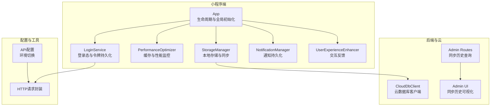
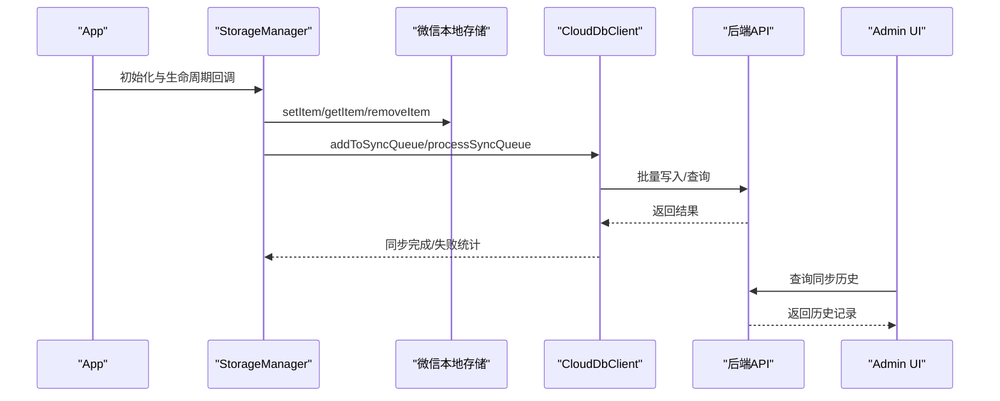
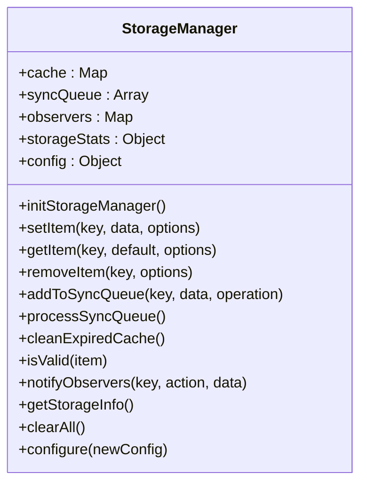
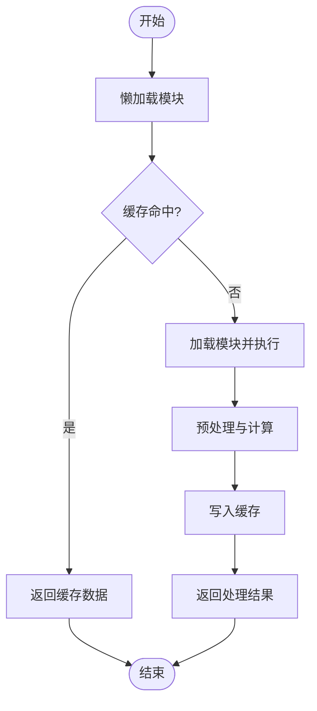
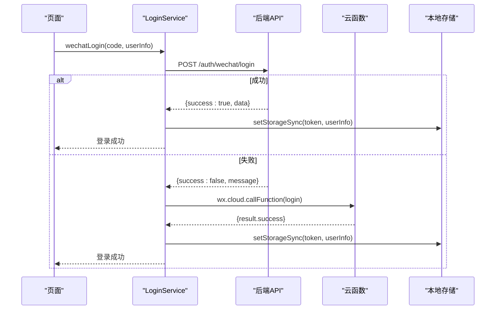
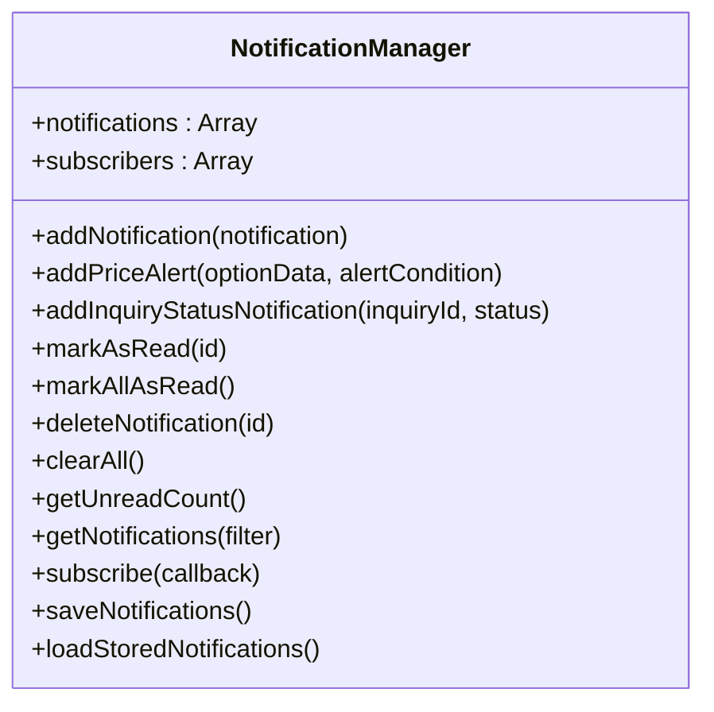
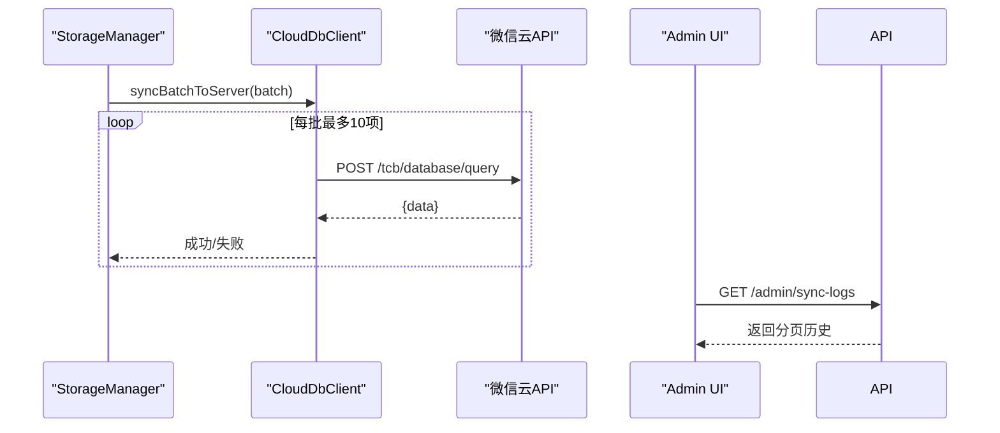
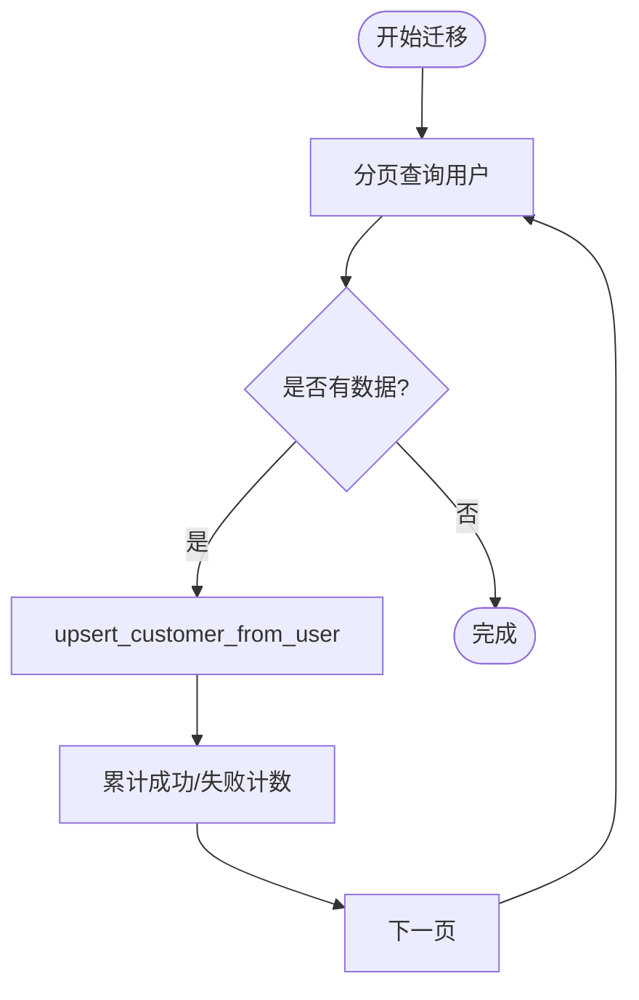
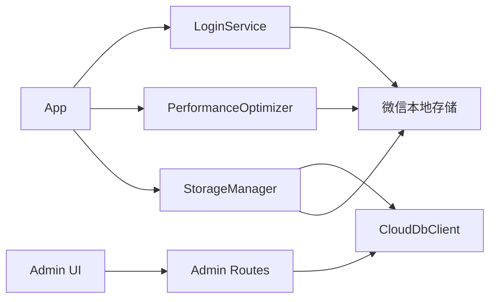

# 数据管理

<cite>
**本文档引用的文件**
- [miniprogram/utils/storage-manager.js](file://miniprogram/utils/storage-manager.js)
- [backend_utils/storage-manager.js](file://backend_utils/storage-manager.js)
- [miniprogram/app.js](file://miniprogram/app.js)
- [miniprogram/utils/performance-optimizer.js](file://miniprogram/utils/performance-optimizer.js)
- [miniprogram/utils/loginService.js](file://miniprogram/utils/loginService.js)
- [miniprogram/utils/notification-manager.js](file://miniprogram/utils/notification-manager.js)
- [miniprogram/utils/user-experience-enhancer.js](file://miniprogram/utils/user-experience-enhancer.js)
- [miniprogram/config/api.config.js](file://miniprogram/config/api.config.js)
- [utils/request.js](file://utils/request.js)
- [services/cloud_db.js](file://services/cloud_db.js)
- [routes/admin.py](file://routes/admin.py)
- [admin-ui/src/pages/Quotes.tsx](file://admin-ui/src/pages/Quotes.tsx)
- [test_cloud_db.js](file://test_cloud_db.js)
- [scripts/migrate_identity.py](file://scripts/migrate_identity.py)
</cite>

## 目录
1. [简介](#简介)
2. [项目结构](#项目结构)
3. [核心组件](#核心组件)
4. [架构总览](#架构总览)
5. [详细组件分析](#详细组件分析)
6. [依赖关系分析](#依赖关系分析)
7. [性能考虑](#性能考虑)
8. [故障排除指南](#故障排除指南)
9. [结论](#结论)
10. [附录](#附录)

## 简介
本文件面向微信小程序场景，系统性阐述数据管理策略与实现，覆盖本地存储机制、缓存策略、持久化、数据同步与一致性、离线处理、冲突解决、数据模型设计、验证与迁移、最佳实践与性能优化、内存管理以及与云数据库的交互与一致性保障。

## 项目结构
围绕数据管理的关键目录与文件如下：
- 小程序端数据层：storage-manager（本地存储）、performance-optimizer（性能与缓存）、loginService（登录态与令牌持久化）、notification-manager（通知持久化）、user-experience-enhancer（交互反馈）
- 后端与云数据库：cloud_db.js（云数据库客户端）、routes/admin.py（同步历史查询）、admin-ui（可视化同步历史）
- 配置与工具：api.config.js（API环境配置）、request.js（HTTP请求封装）

图表来源
- [miniprogram/app.js](file://miniprogram/app.js#L1-L225)
- [miniprogram/utils/storage-manager.js](file://miniprogram/utils/storage-manager.js#L1-L750)
- [miniprogram/utils/performance-optimizer.js](file://miniprogram/utils/performance-optimizer.js#L1-L817)
- [miniprogram/utils/loginService.js](file://miniprogram/utils/loginService.js#L1-L492)
- [miniprogram/utils/notification-manager.js](file://miniprogram/utils/notification-manager.js#L1-L205)
- [miniprogram/utils/user-experience-enhancer.js](file://miniprogram/utils/user-experience-enhancer.js#L1-L452)
- [services/cloud_db.js](file://services/cloud_db.js#L1-L139)
- [routes/admin.py](file://routes/admin.py#L522-L554)
- [admin-ui/src/pages/Quotes.tsx](file://admin-ui/src/pages/Quotes.tsx#L846-L872)
- [miniprogram/config/api.config.js](file://miniprogram/config/api.config.js#L1-L90)
- [utils/request.js](file://utils/request.js#L1-L70)

章节来源
- [miniprogram/app.js](file://miniprogram/app.js#L1-L225)
- [miniprogram/utils/storage-manager.js](file://miniprogram/utils/storage-manager.js#L1-L750)
- [services/cloud_db.js](file://services/cloud_db.js#L1-L139)

## 核心组件
- StorageManager：提供本地存储、内存缓存、LRU淘汰、TTL、压缩、加密、观察者通知、同步队列、过期清理、统计与生命周期联动
- PerformanceOptimizer：懒加载、缓存命中率、内存监控、API/渲染/交互延迟监控、网络状态变化下的缓存清理
- LoginService：登录态与令牌持久化、自动刷新与验证、登出清理
- NotificationManager：通知持久化、订阅与推送
- UserExperienceEnhancer：消息提示、加载指示器、确认对话框等交互反馈
- CloudDbClient：云数据库访问封装、重试与并发控制
- API配置与HTTP封装：环境切换、统一请求处理

章节来源
- [miniprogram/utils/storage-manager.js](file://miniprogram/utils/storage-manager.js#L1-L750)
- [miniprogram/utils/performance-optimizer.js](file://miniprogram/utils/performance-optimizer.js#L1-L817)
- [miniprogram/utils/loginService.js](file://miniprogram/utils/loginService.js#L1-L492)
- [miniprogram/utils/notification-manager.js](file://miniprogram/utils/notification-manager.js#L1-L205)
- [miniprogram/utils/user-experience-enhancer.js](file://miniprogram/utils/user-experience-enhancer.js#L1-L452)
- [services/cloud_db.js](file://services/cloud_db.js#L1-L139)
- [miniprogram/config/api.config.js](file://miniprogram/config/api.config.js#L1-L90)
- [utils/request.js](file://utils/request.js#L1-L70)

## 架构总览
小程序端通过StorageManager统一管理本地与云端数据；PerformanceOptimizer提供缓存与性能监控；LoginService负责登录态持久化；NotificationManager与UserExperienceEnhancer提升用户体验；CloudDbClient对接云数据库，支持批量同步与重试；Admin UI与后端路由提供同步历史可视化与查询。

图表来源
- [miniprogram/app.js](file://miniprogram/app.js#L177-L189)
- [miniprogram/utils/storage-manager.js](file://miniprogram/utils/storage-manager.js#L457-L485)
- [services/cloud_db.js](file://services/cloud_db.js#L106-L139)
- [routes/admin.py](file://routes/admin.py#L522-L554)
- [admin-ui/src/pages/Quotes.tsx](file://admin-ui/src/pages/Quotes.tsx#L846-L872)

## 详细组件分析

### StorageManager 本地存储与同步
- 本地存储：使用微信本地存储API，存储结构包含数据、时间戳、TTL、版本、压缩/加密标记、优先级与备份标志
- 内存缓存：Map结构，支持LRU淘汰与命中率统计
- TTL与过期清理：支持最大缓存年龄与自动清理
- 压缩与加密：按阈值压缩、敏感键加密（atob示例），解压与解密在读取时进行
- 观察者模式：setItem/removeItem后通知订阅者
- 同步队列：批量处理、重试、并发控制、统计成功/失败
- 生命周期联动：App Hide时同步、App Show时检查更新
- 统计与监控：命中/缺失/错误/同步成功/失败计数

图表来源
- [miniprogram/utils/storage-manager.js](file://miniprogram/utils/storage-manager.js#L1-L750)

章节来源
- [miniprogram/utils/storage-manager.js](file://miniprogram/utils/storage-manager.js#L1-L750)
- [miniprogram/app.js](file://miniprogram/app.js#L177-L189)

### 性能优化与缓存策略
- 懒加载与缓存：模块懒加载、缓存命中率统计、优先级缓存
- 内存监控：内存警告触发、低优先级缓存清理
- API/渲染/交互延迟监控：记录耗时、阈值告警、生成性能报告
- 网络状态监控：网络断开时清理API缓存
- 数据预处理缓存：对原始数据进行预处理并缓存

图表来源
- [miniprogram/utils/performance-optimizer.js](file://miniprogram/utils/performance-optimizer.js#L72-L142)

章节来源
- [miniprogram/utils/performance-optimizer.js](file://miniprogram/utils/performance-optimizer.js#L1-L817)

### 登录态与令牌持久化
- 登录流程：优先后端API登录，失败时降级至云函数；开发环境支持Mock与调试
- 令牌管理：存储token、refreshToken、userInfo；自动刷新与验证；登出清理
- 离线验证：网络异常时允许离线验证，避免阻塞

图表来源
- [miniprogram/utils/loginService.js](file://miniprogram/utils/loginService.js#L12-L86)

章节来源
- [miniprogram/utils/loginService.js](file://miniprogram/utils/loginService.js#L1-L492)

### 通知持久化与订阅
- 通知存储：本地存储最近100条通知，支持标记已读/全部已读/删除/清空
- 订阅机制：订阅者接收通知列表与未读计数变更
- 类型与优先级：info/success/warning/error，高优先级用于紧急提醒

图表来源
- [miniprogram/utils/notification-manager.js](file://miniprogram/utils/notification-manager.js#L1-L205)

章节来源
- [miniprogram/utils/notification-manager.js](file://miniprogram/utils/notification-manager.js#L1-L205)

### 云数据库客户端与同步
- CloudDbClient：基于axios封装，支持环境变量注入、并发限制、重试退避、请求体安全序列化
- 同步队列：StorageManager批量写入云数据库，记录成功/失败统计
- 同步历史：后端提供分页查询接口，Admin UI可视化展示

图表来源
- [miniprogram/utils/storage-manager.js](file://miniprogram/utils/storage-manager.js#L472-L485)
- [services/cloud_db.js](file://services/cloud_db.js#L106-L139)
- [routes/admin.py](file://routes/admin.py#L522-L554)
- [admin-ui/src/pages/Quotes.tsx](file://admin-ui/src/pages/Quotes.tsx#L846-L872)

章节来源
- [services/cloud_db.js](file://services/cloud_db.js#L1-L139)
- [routes/admin.py](file://routes/admin.py#L522-L554)
- [admin-ui/src/pages/Quotes.tsx](file://admin-ui/src/pages/Quotes.tsx#L846-L872)

### 数据模型设计、验证与迁移
- 数据模型：StorageManager存储项包含数据、timestamp、ttl、version、compressed、encrypted、priority、backup
- 数据验证：isValid校验timestamp与有效期；过期项自动清理
- 数据迁移：Python脚本将用户数据迁移到客户记录，分页批量处理，记录同步/失败计数

图表来源
- [scripts/migrate_identity.py](file://scripts/migrate_identity.py#L67-L96)

章节来源
- [scripts/migrate_identity.py](file://scripts/migrate_identity.py#L46-L101)

## 依赖关系分析
- StorageManager依赖微信本地存储API与云数据库客户端
- App在onHide/onShow中触发StorageManager的同步与更新检查
- PerformanceOptimizer与StorageManager共同维护缓存与内存使用
- LoginService与StorageManager配合实现登录态持久化
- Admin UI通过后端路由查询同步历史，形成闭环

图表来源
- [miniprogram/app.js](file://miniprogram/app.js#L177-L189)
- [miniprogram/utils/storage-manager.js](file://miniprogram/utils/storage-manager.js#L1-L750)
- [miniprogram/utils/performance-optimizer.js](file://miniprogram/utils/performance-optimizer.js#L1-L817)
- [miniprogram/utils/loginService.js](file://miniprogram/utils/loginService.js#L1-L492)
- [services/cloud_db.js](file://services/cloud_db.js#L1-L139)
- [routes/admin.py](file://routes/admin.py#L522-L554)
- [admin-ui/src/pages/Quotes.tsx](file://admin-ui/src/pages/Quotes.tsx#L846-L872)

章节来源
- [miniprogram/app.js](file://miniprogram/app.js#L1-L225)
- [miniprogram/utils/storage-manager.js](file://miniprogram/utils/storage-manager.js#L1-L750)
- [services/cloud_db.js](file://services/cloud_db.js#L1-L139)

## 性能考虑
- 缓存策略：内存Map缓存+LRU，TTL控制，命中率统计，低优先级缓存定期清理
- 网络优化：批量同步（每批10项）、指数退避重试、并发上限、网络断开清理API缓存
- 内存管理：内存警告触发清理低优先级缓存，定期生成性能报告
- 渲染与交互：监控渲染时间与交互延迟，超阈值告警并给出优化建议
- 数据压缩与加密：超过阈值自动压缩，敏感键加密，读取时解压解密

章节来源
- [miniprogram/utils/performance-optimizer.js](file://miniprogram/utils/performance-optimizer.js#L1-L817)
- [miniprogram/utils/storage-manager.js](file://miniprogram/utils/storage-manager.js#L1-L750)

## 故障排除指南
- 云数据库初始化失败：检查环境变量与占位符，确认环境ID、AppID、Secret
- 同步历史为空：确认集合是否存在，检查分页查询逻辑
- 登录失败：区分后端API失败与云函数降级，开发环境可使用Mock
- 本地存储异常：检查StorageManager统计与错误计数，必要时清空缓存与本地存储

章节来源
- [test_cloud_db.js](file://test_cloud_db.js#L1-L68)
- [routes/admin.py](file://routes/admin.py#L522-L554)
- [miniprogram/utils/loginService.js](file://miniprogram/utils/loginService.js#L12-L86)
- [miniprogram/utils/storage-manager.js](file://miniprogram/utils/storage-manager.js#L1-L750)

## 结论
该数据管理体系通过StorageManager实现本地与云端的统一数据管理，结合PerformanceOptimizer的缓存与性能监控、LoginService的登录态持久化、NotificationManager的通知持久化与UserExperienceEnhancer的交互反馈，形成了完整的小程序数据管理闭环。云数据库客户端提供可靠的后端支撑，并通过Admin UI与后端路由实现同步历史的可视化与审计，确保数据一致性与可追溯性。

## 附录
- API配置：根据环境动态选择后端地址，支持本地开发与云端部署
- HTTP封装：统一请求处理、鉴权头注入、401处理与路由跳转
- 数据序列化：JSON序列化，云数据库请求体安全处理
- 加密存储：敏感键加密（示例为atob），实际项目建议采用更强加密算法

章节来源
- [miniprogram/config/api.config.js](file://miniprogram/config/api.config.js#L1-L90)
- [utils/request.js](file://utils/request.js#L1-L70)
- [services/cloud_db.js](file://services/cloud_db.js#L100-L104)