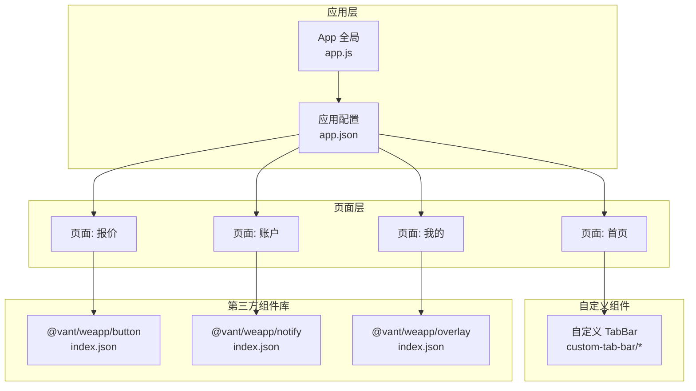
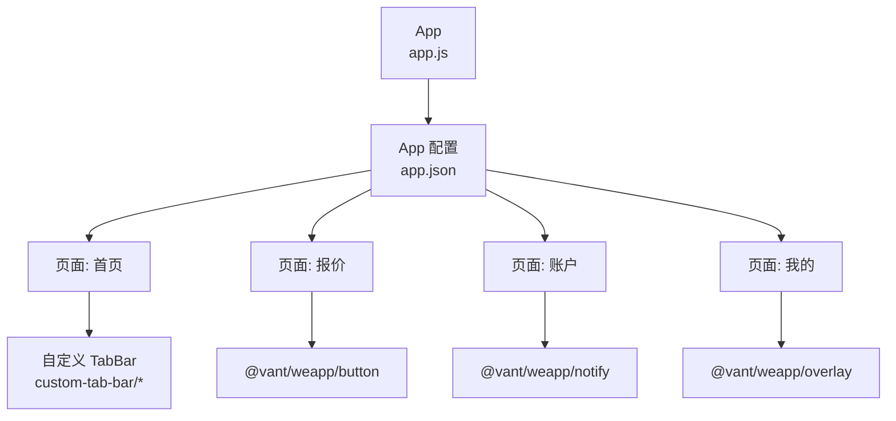
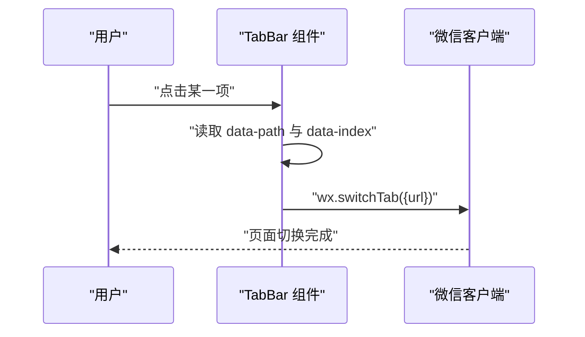
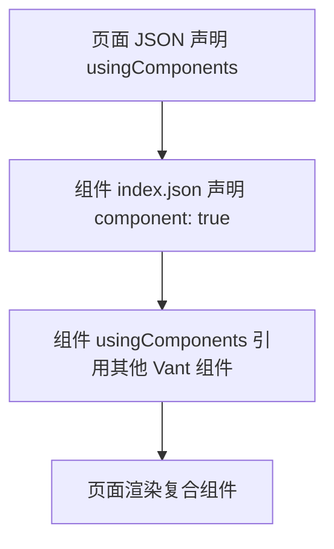
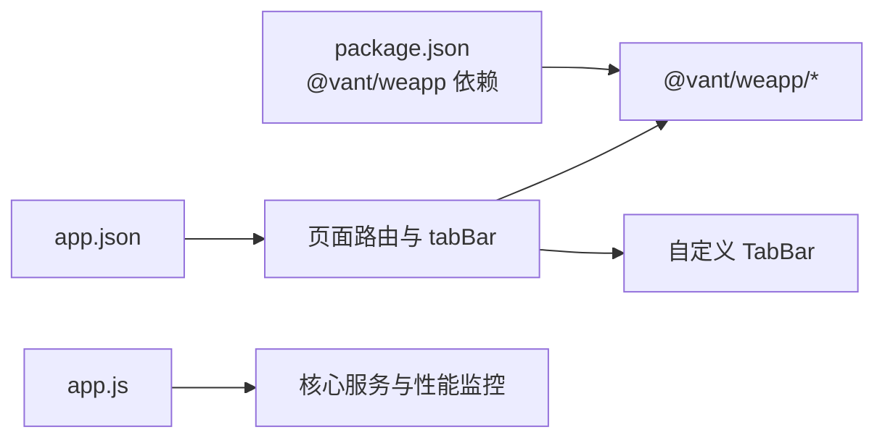

# 组件开发

<cite>
**本文引用的文件**
- [miniprogram/app.js](file://miniprogram/app.js)
- [miniprogram/app.json](file://miniprogram/app.json)
- [miniprogram/package.json](file://miniprogram/package.json)
- [miniprogram/custom-tab-bar/index.js](file://miniprogram/custom-tab-bar/index.js)
- [miniprogram/custom-tab-bar/index.json](file://miniprogram/custom-tab-bar/index.json)
- [miniprogram/custom-tab-bar/index.wxml](file://miniprogram/custom-tab-bar/index.wxml)
- [miniprogram/custom-tab-bar/index.wxss](file://miniprogram/custom-tab-bar/index.wxss)
- [miniprogram/miniprogram_npm/@vant/weapp/common/component.d.ts](file://miniprogram/miniprogram_npm/@vant/weapp/common/component.d.ts)
- [miniprogram/miniprogram_npm/@vant/weapp/definitions/index.d.ts](file://miniprogram/miniprogram_npm/@vant/weapp/definitions/index.d.ts)
- [miniprogram/miniprogram_npm/@vant/weapp/button/index.json](file://miniprogram/miniprogram_npm/@vant/weapp/button/index.json)
- [miniprogram/miniprogram_npm/@vant/weapp/notify/index.json](file://miniprogram/miniprogram_npm/@vant/weapp/notify/index.json)
- [miniprogram/miniprogram_npm/@vant/weapp/overlay/index.json](file://miniprogram/miniprogram_npm/@vant/weapp/overlay/index.json)
</cite>

## 目录
1. [简介](#简介)
2. [项目结构](#项目结构)
3. [核心组件](#核心组件)
4. [架构总览](#架构总览)
5. [组件详解](#组件详解)
6. [依赖关系分析](#依赖关系分析)
7. [性能考量](#性能考量)
8. [故障排查指南](#故障排查指南)
9. [结论](#结论)
10. [附录](#附录)

## 简介
本文件面向微信小程序组件开发，围绕组件系统、生命周期与通信机制进行系统化梳理，并结合项目中的自定义组件与 Vant Weapp 组件库的实际使用情况，给出可操作的开发规范、属性与事件定义、数据传递与父子通信策略、样式定制与性能优化建议，以及常见问题的解决方案与最佳实践。

## 项目结构
本项目采用分层组织：页面层、组件层、第三方组件库层（Vant Weapp）、工具与服务层、应用入口与全局配置。其中：
- 应用入口与全局配置位于根目录，包括应用生命周期、全局状态与性能监控等。
- 自定义组件位于 custom-tab-bar 目录，演示了标准小程序组件的结构与使用。
- Vant Weapp 组件库通过 npm 引入，位于 miniprogram_npm/@vant/weapp 下，各组件以独立目录提供 wxml/wxss/json/js 文件与类型声明。

图表来源
- [miniprogram/app.js](file://miniprogram/app.js#L1-L225)
- [miniprogram/app.json](file://miniprogram/app.json#L1-L78)
- [miniprogram/custom-tab-bar/index.js](file://miniprogram/custom-tab-bar/index.js#L1-L31)
- [miniprogram/miniprogram_npm/@vant/weapp/button/index.json](file://miniprogram/miniprogram_npm/@vant/weapp/button/index.json#L1-L6)
- [miniprogram/miniprogram_npm/@vant/weapp/notify/index.json](file://miniprogram/miniprogram_npm/@vant/weapp/notify/index.json#L1-L6)
- [miniprogram/miniprogram_npm/@vant/weapp/overlay/index.json](file://miniprogram/miniprogram_npm/@vant/weapp/overlay/index.json#L1-L6)

章节来源
- [miniprogram/app.js](file://miniprogram/app.js#L1-L225)
- [miniprogram/app.json](file://miniprogram/app.json#L1-L78)

## 核心组件
本节聚焦于自定义组件与第三方组件库的关键实现要点，帮助快速理解组件的结构、属性、事件与样式。

- 自定义 TabBar 组件
  - 组件定义：在组件文件中声明数据、方法与事件绑定，实现底部导航切换。
  - 视图结构：使用 wx:for 渲染列表项，绑定点击事件触发页面切换。
  - 样式控制：通过内联样式与过渡动画实现图标与文字的颜色变化。
  - 关键路径参考：
    - [组件定义与方法](file://miniprogram/custom-tab-bar/index.js#L1-L31)
    - [组件 JSON 配置](file://miniprogram/custom-tab-bar/index.json#L1-L3)
    - [视图模板](file://miniprogram/custom-tab-bar/index.wxml#L1-L7)
    - [样式定义](file://miniprogram/custom-tab-bar/index.wxss#L1-L52)

- Vant Weapp 组件库
  - 组件声明：每个组件通过独立的 index.json 声明为组件，并可声明 usingComponents 依赖其他组件。
  - 类型支持：通过 @vant/weapp 的类型声明文件提供 VantComponentOptions 与 VantComponentInstance 的类型定义，便于 TS 开发与 IDE 提示。
  - 关键路径参考：
    - [组件类型定义](file://miniprogram/miniprogram_npm/@vant/weapp/common/component.d.ts#L1-L4)
    - [组件实例与选项定义](file://miniprogram/miniprogram_npm/@vant/weapp/definitions/index.d.ts#L1-L29)
    - [按钮组件示例](file://miniprogram/miniprogram_npm/@vant/weapp/button/index.json#L1-L6)
    - [通知组件示例](file://miniprogram/miniprogram_npm/@vant/weapp/notify/index.json#L1-L6)
    - [遮罩组件示例](file://miniprogram/miniprogram_npm/@vant/weapp/overlay/index.json#L1-L6)

章节来源
- [miniprogram/custom-tab-bar/index.js](file://miniprogram/custom-tab-bar/index.js#L1-L31)
- [miniprogram/custom-tab-bar/index.json](file://miniprogram/custom-tab-bar/index.json#L1-L3)
- [miniprogram/custom-tab-bar/index.wxml](file://miniprogram/custom-tab-bar/index.wxml#L1-L7)
- [miniprogram/custom-tab-bar/index.wxss](file://miniprogram/custom-tab-bar/index.wxss#L1-L52)
- [miniprogram/miniprogram_npm/@vant/weapp/common/component.d.ts](file://miniprogram/miniprogram_npm/@vant/weapp/common/component.d.ts#L1-L4)
- [miniprogram/miniprogram_npm/@vant/weapp/definitions/index.d.ts](file://miniprogram/miniprogram_npm/@vant/weapp/definitions/index.d.ts#L1-L29)
- [miniprogram/miniprogram_npm/@vant/weapp/button/index.json](file://miniprogram/miniprogram_npm/@vant/weapp/button/index.json#L1-L6)
- [miniprogram/miniprogram_npm/@vant/weapp/notify/index.json](file://miniprogram/miniprogram_npm/@vant/weapp/notify/index.json#L1-L6)
- [miniprogram/miniprogram_npm/@vant/weapp/overlay/index.json](file://miniprogram/miniprogram_npm/@vant/weapp/overlay/index.json#L1-L6)

## 架构总览
下图展示了应用、页面、自定义组件与第三方组件之间的交互关系，以及组件如何通过 usingComponents 进行组合。

图表来源
- [miniprogram/app.js](file://miniprogram/app.js#L1-L225)
- [miniprogram/app.json](file://miniprogram/app.json#L1-L78)
- [miniprogram/custom-tab-bar/index.js](file://miniprogram/custom-tab-bar/index.js#L1-L31)
- [miniprogram/miniprogram_npm/@vant/weapp/button/index.json](file://miniprogram/miniprogram_npm/@vant/weapp/button/index.json#L1-L6)
- [miniprogram/miniprogram_npm/@vant/weapp/notify/index.json](file://miniprogram/miniprogram_npm/@vant/weapp/notify/index.json#L1-L6)
- [miniprogram/miniprogram_npm/@vant/weapp/overlay/index.json](file://miniprogram/miniprogram_npm/@vant/weapp/overlay/index.json#L1-L6)

## 组件详解

### 自定义 TabBar 组件
- 组件职责
  - 提供底部导航栏，支持图标与文字渲染、选中态颜色切换、点击跳转至对应页面。
- 数据与方法
  - data：包含选中索引、默认颜色、选中颜色、导航列表（含页面路径、文本与图标路径）。
  - methods：switchTab 接收事件对象，读取 data-path 与 data-index，调用 wx.switchTab 切换页面。
- 视图与样式
  - 使用 wx:for 渲染列表，bindtap 绑定点击事件；通过内联样式动态设置图标与文字颜色；添加过渡动画提升交互体验。
- 关键路径参考
  - [组件定义与方法](file://miniprogram/custom-tab-bar/index.js#L1-L31)
  - [组件 JSON 配置](file://miniprogram/custom-tab-bar/index.json#L1-L3)
  - [视图模板](file://miniprogram/custom-tab-bar/index.wxml#L1-L7)
  - [样式定义](file://miniprogram/custom-tab-bar/index.wxss#L1-L52)

图表来源
- [miniprogram/custom-tab-bar/index.js](file://miniprogram/custom-tab-bar/index.js#L24-L30)
- [miniprogram/custom-tab-bar/index.wxml](file://miniprogram/custom-tab-bar/index.wxml#L3-L6)

章节来源
- [miniprogram/custom-tab-bar/index.js](file://miniprogram/custom-tab-bar/index.js#L1-L31)
- [miniprogram/custom-tab-bar/index.json](file://miniprogram/custom-tab-bar/index.json#L1-L3)
- [miniprogram/custom-tab-bar/index.wxml](file://miniprogram/custom-tab-bar/index.wxml#L1-L7)
- [miniprogram/custom-tab-bar/index.wxss](file://miniprogram/custom-tab-bar/index.wxss#L1-L52)

### Vant Weapp 组件使用
- 组件声明与依赖
  - 每个组件通过 index.json 声明 component: true，并可在 usingComponents 中引用其他 Vant 组件，形成复合组件。
- 类型支持
  - 通过 @vant/weapp 的类型声明文件提供的 VantComponentOptions 与 VantComponentInstance，可获得属性、方法、生命周期钩子的类型提示。
- 示例组件
  - 按钮、通知、遮罩等组件均遵循统一的声明与依赖模式，便于在页面中直接使用或二次封装。

图表来源
- [miniprogram/miniprogram_npm/@vant/weapp/button/index.json](file://miniprogram/miniprogram_npm/@vant/weapp/button/index.json#L1-L6)
- [miniprogram/miniprogram_npm/@vant/weapp/notify/index.json](file://miniprogram/miniprogram_npm/@vant/weapp/notify/index.json#L1-L6)
- [miniprogram/miniprogram_npm/@vant/weapp/overlay/index.json](file://miniprogram/miniprogram_npm/@vant/weapp/overlay/index.json#L1-L6)
- [miniprogram/miniprogram_npm/@vant/weapp/common/component.d.ts](file://miniprogram/miniprogram_npm/@vant/weapp/common/component.d.ts#L1-L4)
- [miniprogram/miniprogram_npm/@vant/weapp/definitions/index.d.ts](file://miniprogram/miniprogram_npm/@vant/weapp/definitions/index.d.ts#L1-L29)

章节来源
- [miniprogram/miniprogram_npm/@vant/weapp/button/index.json](file://miniprogram/miniprogram_npm/@vant/weapp/button/index.json#L1-L6)
- [miniprogram/miniprogram_npm/@vant/weapp/notify/index.json](file://miniprogram/miniprogram_npm/@vant/weapp/notify/index.json#L1-L6)
- [miniprogram/miniprogram_npm/@vant/weapp/overlay/index.json](file://miniprogram/miniprogram_npm/@vant/weapp/overlay/index.json#L1-L6)
- [miniprogram/miniprogram_npm/@vant/weapp/common/component.d.ts](file://miniprogram/miniprogram_npm/@vant/weapp/common/component.d.ts#L1-L4)
- [miniprogram/miniprogram_npm/@vant/weapp/definitions/index.d.ts](file://miniprogram/miniprogram_npm/@vant/weapp/definitions/index.d.ts#L1-L29)

### 组件生命周期与通信机制
- 生命周期
  - 自定义组件：通过 Component 构造器定义，包含数据、方法与事件处理；页面通过 WXML 模板挂载组件。
  - 第三方组件：遵循 Vant Weapp 的统一声明与依赖模型，具备一致的生命周期与事件机制。
- 通信机制
  - 父子通信：通过属性传参与事件回调实现；子组件通过 $emit 触发事件，父组件在 WXML 中监听。
  - 组件间通信：通过全局状态或事件总线（如通知组件）实现跨层级通信。
- 关键路径参考
  - [组件实例与选项定义](file://miniprogram/miniprogram_npm/@vant/weapp/definitions/index.d.ts#L1-L29)
  - [组件类型定义](file://miniprogram/miniprogram_npm/@vant/weapp/common/component.d.ts#L1-L4)

章节来源
- [miniprogram/miniprogram_npm/@vant/weapp/definitions/index.d.ts](file://miniprogram/miniprogram_npm/@vant/weapp/definitions/index.d.ts#L1-L29)
- [miniprogram/miniprogram_npm/@vant/weapp/common/component.d.ts](file://miniprogram/miniprogram_npm/@vant/weapp/common/component.d.ts#L1-L4)

### 组件开发规范与最佳实践
- 属性定义
  - 明确属性类型与默认值，避免在组件内部直接修改外部传入的属性。
  - 对复杂属性建议提供校验与转换逻辑，保证数据一致性。
- 事件处理
  - 子组件通过 $emit 触发事件，命名语义化，携带必要上下文数据。
  - 父组件在 WXML 中监听事件，避免在 JS 中重复绑定事件。
- 数据传递与复用
  - 使用单一数据源，减少多处同步带来的副作用。
  - 将通用逻辑抽取为 Mixin 或工具函数，提升组件复用性。
- 样式定制
  - 优先使用 CSS 变量与主题变量，配合第三方组件的主题定制能力。
  - 自定义组件尽量保持样式与行为解耦，便于替换与扩展。
- 性能优化
  - 合理使用 setData 与数据分片，避免频繁触发渲染。
  - 对长列表与复杂布局使用虚拟滚动或懒加载策略。
  - 利用 App 全局性能监控与内存告警回调，及时清理缓存与释放资源。

章节来源
- [miniprogram/app.js](file://miniprogram/app.js#L144-L175)

## 依赖关系分析
- 应用层依赖
  - app.js 作为全局入口，负责初始化服务、性能监控与错误处理。
  - app.json 决定页面路由、导航栏与 tabBar 配置，影响组件的可见性与交互范围。
- 组件层依赖
  - 自定义 TabBar 依赖微信客户端的 wx.switchTab API 实现页面切换。
  - Vant Weapp 组件通过 index.json 声明自身为组件，并在 usingComponents 中引用其他 Vant 组件，形成组件树。
- 第三方依赖
  - 项目通过 package.json 引入 @vant/weapp，版本号固定，确保组件库稳定性。

图表来源
- [miniprogram/package.json](file://miniprogram/package.json#L1-L15)
- [miniprogram/app.js](file://miniprogram/app.js#L1-L225)
- [miniprogram/app.json](file://miniprogram/app.json#L1-L78)
- [miniprogram/custom-tab-bar/index.js](file://miniprogram/custom-tab-bar/index.js#L1-L31)

章节来源
- [miniprogram/package.json](file://miniprogram/package.json#L1-L15)
- [miniprogram/app.js](file://miniprogram/app.js#L1-L225)
- [miniprogram/app.json](file://miniprogram/app.json#L1-L78)

## 性能考量
- 启动与预加载
  - 在 App.onLaunch 中初始化核心服务与关键资源，避免阻塞主线程。
  - 使用延迟与异步方式预加载，降低首屏时间。
- 内存与缓存
  - 监听内存告警，清理低优先级缓存，维持运行时稳定。
- 错误与日志
  - 全局错误捕获与错误计数，定期输出性能报告，辅助定位问题。
- 组件渲染
  - 控制 setData 调用频率，合并更新；对长列表使用分页或虚拟化策略。

章节来源
- [miniprogram/app.js](file://miniprogram/app.js#L92-L119)
- [miniprogram/app.js](file://miniprogram/app.js#L144-L175)
- [miniprogram/app.js](file://miniprogram/app.js#L191-L198)

## 故障排查指南
- 组件无法渲染
  - 检查组件是否正确声明 component: true，且在页面 JSON 的 usingComponents 中注册。
  - 确认组件路径与文件名一致，避免大小写与扩展名错误。
- 事件不生效
  - 确保子组件通过 $emit 正确触发事件，父组件在 WXML 中监听。
  - 检查事件名拼写与数据传递格式。
- 页面切换异常
  - 自定义 TabBar 的 switchTab 方法需读取 data-path 并调用 wx.switchTab，确认路径与页面配置一致。
- 性能问题
  - 查看全局性能监控输出，关注内存告警与错误计数；优化渲染与缓存策略。

章节来源
- [miniprogram/custom-tab-bar/index.js](file://miniprogram/custom-tab-bar/index.js#L24-L30)
- [miniprogram/app.js](file://miniprogram/app.js#L144-L175)

## 结论
本项目在小程序组件体系上提供了清晰的自定义组件示例与第三方组件库集成方案。通过统一的组件声明与依赖模型、明确的生命周期与通信机制、完善的性能监控与错误处理，能够支撑复杂业务场景下的组件化开发。建议在后续迭代中持续完善组件类型定义、统一样式规范与测试覆盖，进一步提升可维护性与可复用性。

## 附录
- 相关文件路径
  - [应用入口与全局状态](file://miniprogram/app.js#L1-L225)
  - [应用配置与页面路由](file://miniprogram/app.json#L1-L78)
  - [第三方组件库依赖](file://miniprogram/package.json#L1-L15)
  - [自定义 TabBar 组件](file://miniprogram/custom-tab-bar/index.js#L1-L31)
  - [Vant Weapp 类型定义](file://miniprogram/miniprogram_npm/@vant/weapp/definitions/index.d.ts#L1-L29)
  - [Vant Weapp 组件类型声明](file://miniprogram/miniprogram_npm/@vant/weapp/common/component.d.ts#L1-L4)