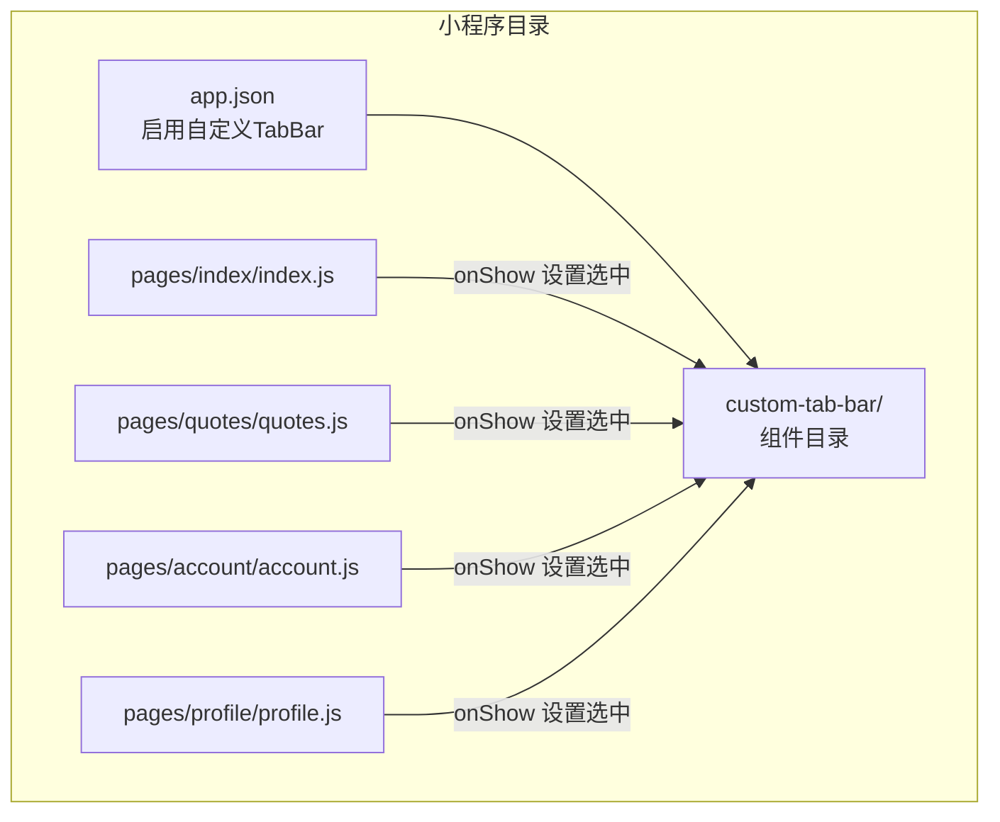
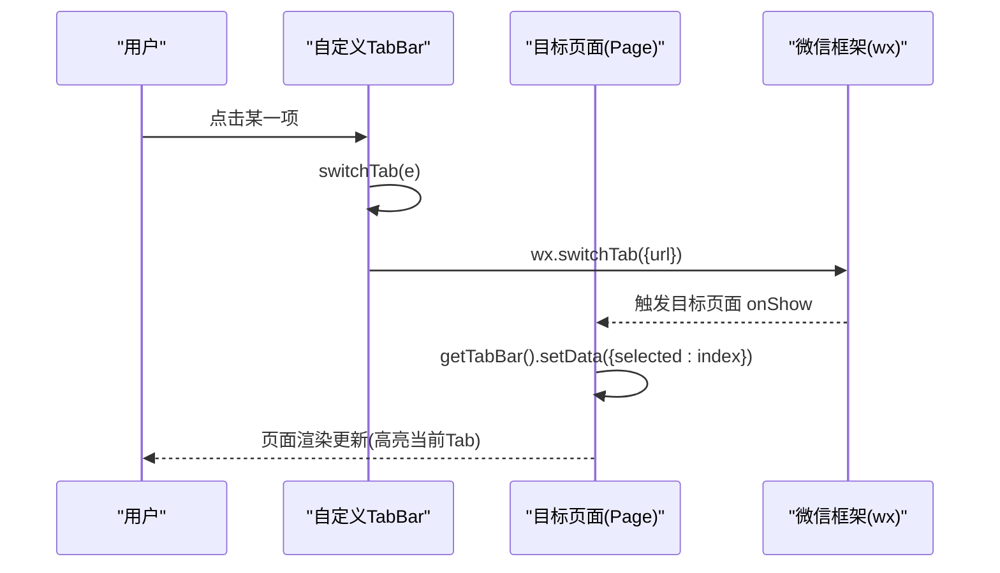
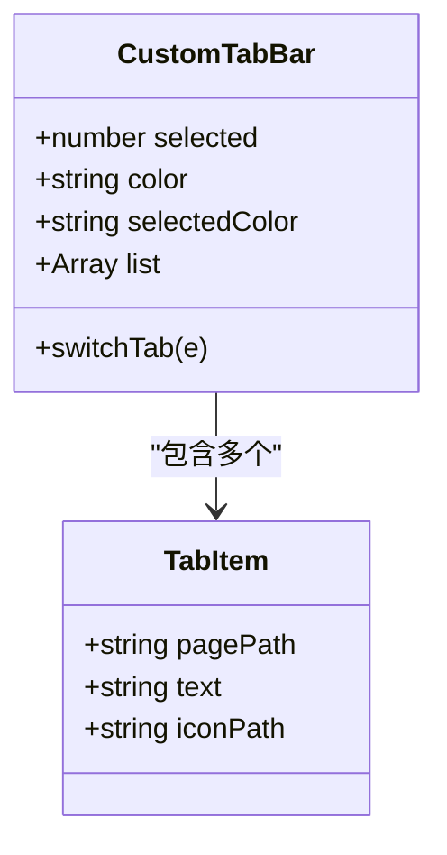
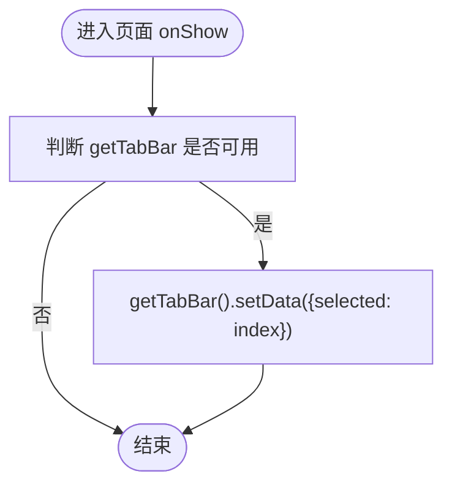
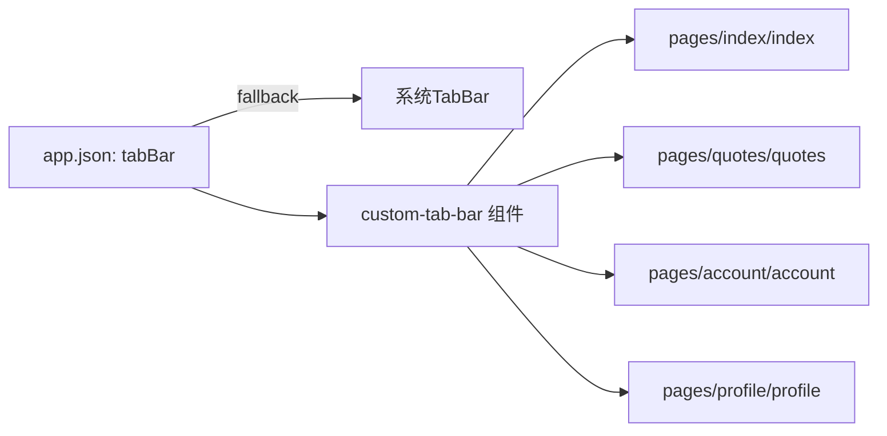

# 自定义TabBar

<cite>
**本文引用的文件**
- [miniprogram/custom-tab-bar/index.js](file://miniprogram/custom-tab-bar/index.js)
- [miniprogram/custom-tab-bar/index.json](file://miniprogram/custom-tab-bar/index.json)
- [miniprogram/custom-tab-bar/index.wxml](file://miniprogram/custom-tab-bar/index.wxml)
- [miniprogram/custom-tab-bar/index.wxss](file://miniprogram/custom-tab-bar/index.wxss)
- [miniprogram/app.json](file://miniprogram/app.json)
- [miniprogram/pages/index/index.js](file://miniprogram/pages/index/index.js)
- [miniprogram/pages/quotes/quotes.js](file://miniprogram/pages/quotes/quotes.js)
- [miniprogram/pages/account/account.js](file://miniprogram/pages/account/account.js)
- [miniprogram/pages/profile/profile.js](file://miniprogram/pages/profile/profile.js)
</cite>

## 目录
1. [简介](#简介)
2. [项目结构](#项目结构)
3. [核心组件](#核心组件)
4. [架构总览](#架构总览)
5. [详细组件分析](#详细组件分析)
6. [依赖关系分析](#依赖关系分析)
7. [性能考量](#性能考量)
8. [故障排查指南](#故障排查指南)
9. [结论](#结论)
10. [附录](#附录)

## 简介
本文件面向微信小程序开发者，系统性阐述项目中自定义 TabBar 的实现原理、配置方法与最佳实践。内容覆盖：
- 自定义 TabBar 组件的结构与样式
- 图标资源管理与颜色切换机制
- 与页面路由的联动、事件处理与状态管理
- 与页面生命周期的配合（onShow 中设置选中态）
- 兼容性与性能优化建议

## 项目结构
自定义 TabBar 位于 miniprogram/custom-tab-bar 目录，采用组件化封装；同时在 app.json 中通过 tabBar.custom=true 启用自定义 TabBar，并在各页面的 Page onShow 生命周期中同步选中态。

图表来源
- [miniprogram/app.json](file://miniprogram/app.json#L31-L63)
- [miniprogram/custom-tab-bar/index.js](file://miniprogram/custom-tab-bar/index.js#L1-L31)
- [miniprogram/pages/index/index.js](file://miniprogram/pages/index/index.js#L274-L283)
- [miniprogram/pages/quotes/quotes.js](file://miniprogram/pages/quotes/quotes.js#L193-L220)
- [miniprogram/pages/account/account.js](file://miniprogram/pages/account/account.js#L25-L33)
- [miniprogram/pages/profile/profile.js](file://miniprogram/pages/profile/profile.js#L61-L71)

章节来源
- [miniprogram/app.json](file://miniprogram/app.json#L31-L63)
- [miniprogram/custom-tab-bar/index.js](file://miniprogram/custom-tab-bar/index.js#L1-L31)

## 核心组件
自定义 TabBar 由四个文件组成：组件定义、模板、样式与声明文件。其核心职责是：
- 渲染 Tab 条目（图标、文字）
- 处理点击事件并触发 wx.switchTab 路由跳转
- 维护选中态 selected 并驱动颜色与图标的切换

关键点：
- 组件数据包含默认颜色、选中颜色与 Tab 列表
- 列表项包含 pagePath、text、iconPath
- 通过 data-path 传递目标页面路径，bindtap 触发 switchTab

章节来源
- [miniprogram/custom-tab-bar/index.js](file://miniprogram/custom-tab-bar/index.js#L2-L23)
- [miniprogram/custom-tab-bar/index.wxml](file://miniprogram/custom-tab-bar/index.wxml#L3-L6)
- [miniprogram/custom-tab-bar/index.wxss](file://miniprogram/custom-tab-bar/index.wxss#L32-L52)

## 架构总览
自定义 TabBar 与页面路由联动的关键流程如下：

图表来源
- [miniprogram/custom-tab-bar/index.js](file://miniprogram/custom-tab-bar/index.js#L24-L30)
- [miniprogram/pages/index/index.js](file://miniprogram/pages/index/index.js#L274-L283)
- [miniprogram/pages/quotes/quotes.js](file://miniprogram/pages/quotes/quotes.js#L193-L220)
- [miniprogram/pages/account/account.js](file://miniprogram/pages/account/account.js#L25-L33)
- [miniprogram/pages/profile/profile.js](file://miniprogram/pages/profile/profile.js#L61-L71)

## 详细组件分析

### 自定义 TabBar 组件类图

图表来源
- [miniprogram/custom-tab-bar/index.js](file://miniprogram/custom-tab-bar/index.js#L2-L23)

章节来源
- [miniprogram/custom-tab-bar/index.js](file://miniprogram/custom-tab-bar/index.js#L1-L31)

### 模板与样式联动
- 模板通过 wx:for 遍历 list，绑定点击事件并传递 data-path
- 样式通过内联 style 控制图标与文字颜色，基于 selected 切换
- 图标通过 mask-image 方案支持动态着色，提升视觉一致性

章节来源
- [miniprogram/custom-tab-bar/index.wxml](file://miniprogram/custom-tab-bar/index.wxml#L3-L6)
- [miniprogram/custom-tab-bar/index.wxss](file://miniprogram/custom-tab-bar/index.wxss#L32-L52)

### 事件处理与路由联动
- 点击事件 switchTab 读取 data-path 并调用 wx.switchTab
- 目标页面在 onShow 中通过 getTabBar().setData 设置选中索引
- 该流程保证 TabBar 与页面当前状态一致

章节来源
- [miniprogram/custom-tab-bar/index.js](file://miniprogram/custom-tab-bar/index.js#L24-L30)
- [miniprogram/pages/index/index.js](file://miniprogram/pages/index/index.js#L274-L283)
- [miniprogram/pages/quotes/quotes.js](file://miniprogram/pages/quotes/quotes.js#L193-L220)
- [miniprogram/pages/account/account.js](file://miniprogram/pages/account/account.js#L25-L33)
- [miniprogram/pages/profile/profile.js](file://miniprogram/pages/profile/profile.js#L61-L71)

### 图标资源管理与颜色切换
- 图标资源可通过两种方式提供：
  - base64 内嵌（适用于小图标，减少请求）
  - 文件路径（便于维护与替换）
- 颜色切换通过内联 style 的 background-color 与 color 实现，具备平滑过渡动画
- mask-image 方案统一图标配色风格，避免多套 PNG/SVG 资源

章节来源
- [miniprogram/custom-tab-bar/index.js](file://miniprogram/custom-tab-bar/index.js#L6-L22)
- [miniprogram/custom-tab-bar/index.wxml](file://miniprogram/custom-tab-bar/index.wxml#L4-L5)
- [miniprogram/custom-tab-bar/index.wxss](file://miniprogram/custom-tab-bar/index.wxss#L32-L52)

### 页面路由与 TabBar 状态同步流程

图表来源
- [miniprogram/pages/index/index.js](file://miniprogram/pages/index/index.js#L274-L283)
- [miniprogram/pages/quotes/quotes.js](file://miniprogram/pages/quotes/quotes.js#L193-L220)
- [miniprogram/pages/account/account.js](file://miniprogram/pages/account/account.js#L25-L33)
- [miniprogram/pages/profile/profile.js](file://miniprogram/pages/profile/profile.js#L61-L71)

## 依赖关系分析
- app.json 中的 tabBar 字段定义了小程序原生 TabBar 的外观与条目（用于兼容与回退），而 custom: true 表示启用自定义实现
- 自定义 TabBar 组件与页面之间通过 getTabBar().setData 建立弱耦合的状态同步
- 图标资源与颜色样式通过组件内部数据与样式控制，降低外部依赖

图表来源
- [miniprogram/app.json](file://miniprogram/app.json#L31-L63)
- [miniprogram/custom-tab-bar/index.js](file://miniprogram/custom-tab-bar/index.js#L1-L31)

章节来源
- [miniprogram/app.json](file://miniprogram/app.json#L31-L63)
- [miniprogram/custom-tab-bar/index.js](file://miniprogram/custom-tab-bar/index.js#L1-L31)

## 性能考量
- 图标资源选择
  - 小图标建议使用 base64 内嵌，减少网络请求
  - 大图标或需要频繁替换的图标建议使用文件路径，便于缓存与更新
- 颜色切换
  - 使用内联 style 控制颜色，避免额外的类名切换开销
  - CSS transition 仅作用于颜色与透明度，避免布局抖动
- 事件处理
  - switchTab 为轻量操作，避免在点击事件中进行复杂计算
- 页面状态同步
  - onShow 中仅做一次 setData，避免重复渲染

## 故障排查指南
- 点击无响应
  - 检查 wxml 中 bindtap 与方法名是否一致
  - 确认 data-path 是否正确传递
- 图标不显示或颜色异常
  - 检查 iconPath 是否有效
  - 确认 mask-image 与 background-color 的组合使用
- TabBar 不随页面切换高亮
  - 确认目标页面 onShow 中是否调用 getTabBar().setData
  - 确认 selected 索引与页面顺序一致
- 路由跳转失败
  - 确认 pagePath 与 app.json 中 pages 对应
  - 确认使用 wx.switchTab 跳转至 Tab 页面

章节来源
- [miniprogram/custom-tab-bar/index.wxml](file://miniprogram/custom-tab-bar/index.wxml#L3-L6)
- [miniprogram/custom-tab-bar/index.js](file://miniprogram/custom-tab-bar/index.js#L24-L30)
- [miniprogram/pages/index/index.js](file://miniprogram/pages/index/index.js#L274-L283)
- [miniprogram/pages/quotes/quotes.js](file://miniprogram/pages/quotes/quotes.js#L193-L220)
- [miniprogram/pages/account/account.js](file://miniprogram/pages/account/account.js#L25-L33)
- [miniprogram/pages/profile/profile.js](file://miniprogram/pages/profile/profile.js#L61-L71)

## 结论
本项目通过自定义 TabBar 实现了高度可定制的底部导航体验。其优势在于：
- 组件化封装，易于扩展与维护
- 图标与颜色的灵活控制，满足品牌化需求
- 与页面生命周期的清晰联动，保证状态一致性

建议在后续迭代中持续关注图标资源的统一管理与性能优化，确保在不同机型与网络环境下的一致体验。

## 附录

### TabBar 配置项详解（来自 app.json）
- custom: true/false，启用自定义 TabBar
- color: 未选中文字与图标颜色
- selectedColor: 选中文字与图标颜色
- backgroundColor: 背景色
- borderStyle: 边框颜色
- list[]: 每一项包含
  - pagePath: 目标页面路径
  - text: 文字
  - iconPath: 未选中图标
  - selectedIconPath: 选中图标

章节来源
- [miniprogram/app.json](file://miniprogram/app.json#L31-L63)