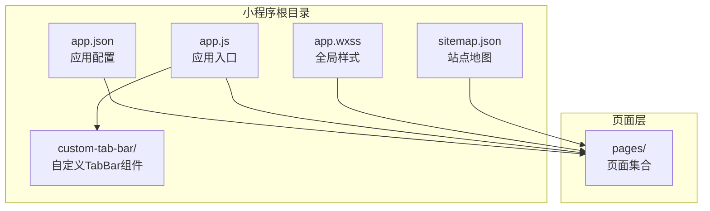
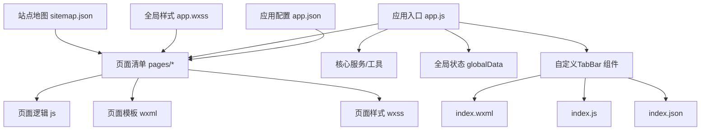
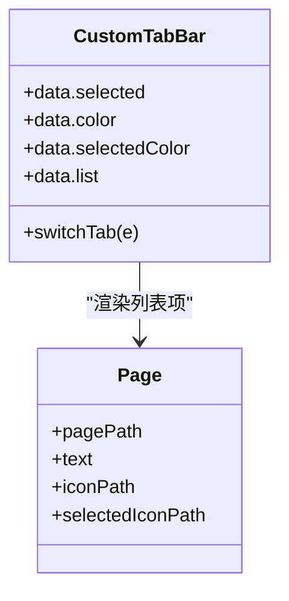
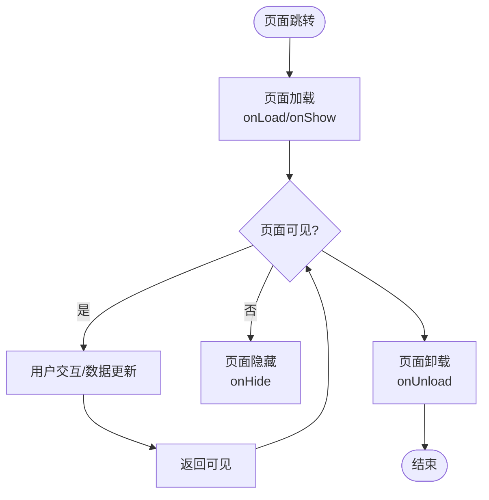
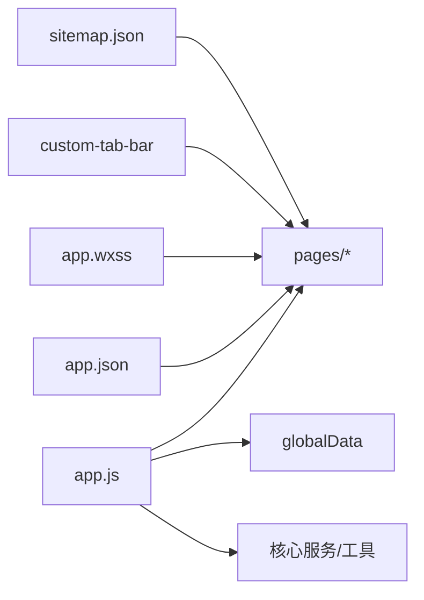

# 页面架构设计

<cite>
**本文引用的文件**
- [miniprogram/app.json](file://miniprogram/app.json)
- [miniprogram/app.js](file://miniprogram/app.js)
- [miniprogram/app.wxss](file://miniprogram/app.wxss)
- [miniprogram/custom-tab-bar/index.json](file://miniprogram/custom-tab-bar/index.json)
- [miniprogram/custom-tab-bar/index.js](file://miniprogram/custom-tab-bar/index.js)
- [miniprogram/custom-tab-bar/index.wxml](file://miniprogram/custom-tab-bar/index.wxml)
- [miniprogram/sitemap.json](file://miniprogram/sitemap.json)
</cite>

## 目录
1. [引言](#引言)
2. [项目结构](#项目结构)
3. [核心组件](#核心组件)
4. [架构总览](#架构总览)
5. [详细组件分析](#详细组件分析)
6. [依赖关系分析](#依赖关系分析)
7. [性能考量](#性能考量)
8. [故障排查指南](#故障排查指南)
9. [结论](#结论)
10. [附录](#附录)

## 引言
本文件面向微信小程序开发者，系统化阐述页面架构设计：从页面配置文件（.json）、页面逻辑文件（.js）、页面模板文件（.wxml）与页面样式文件（.wxss）四要素入手，结合项目中的应用入口与自定义 TabBar 组件，完整梳理页面生命周期、页面间数据传递与状态管理策略，并给出开发规范、命名约定与目录组织原则，以及最佳实践与常见问题解决方案。

## 项目结构
本项目采用“分包/分层”的小程序目录组织方式，核心入口位于 miniprogram 目录，包含应用级配置、全局样式与自定义 TabBar 组件；页面按功能域划分在 pages 子目录下（具体页面文件在仓库中未直接列出，但通过 app.json 的 pages 列表可确认页面清单）。sitemap.json 控制页面索引策略；云开发配置在 app.js 中初始化。



图表来源
- [miniprogram/app.json](file://miniprogram/app.json#L1-L78)
- [miniprogram/app.js](file://miniprogram/app.js#L1-L225)
- [miniprogram/app.wxss](file://miniprogram/app.wxss#L1-L140)
- [miniprogram/custom-tab-bar/index.json](file://miniprogram/custom-tab-bar/index.json#L1-L3)
- [miniprogram/custom-tab-bar/index.js](file://miniprogram/custom-tab-bar/index.js#L1-L31)
- [miniprogram/custom-tab-bar/index.wxml](file://miniprogram/custom-tab-bar/index.wxml#L1-L7)
- [miniprogram/sitemap.json](file://miniprogram/sitemap.json#L1-L7)

章节来源
- [miniprogram/app.json](file://miniprogram/app.json#L1-L78)
- [miniprogram/app.js](file://miniprogram/app.js#L1-L225)
- [miniprogram/app.wxss](file://miniprogram/app.wxss#L1-L140)
- [miniprogram/custom-tab-bar/index.json](file://miniprogram/custom-tab-bar/index.json#L1-L3)
- [miniprogram/custom-tab-bar/index.js](file://miniprogram/custom-tab-bar/index.js#L1-L31)
- [miniprogram/custom-tab-bar/index.wxml](file://miniprogram/custom-tab-bar/index.wxml#L1-L7)
- [miniprogram/sitemap.json](file://miniprogram/sitemap.json#L1-L7)

## 核心组件
- 应用配置与页面清单：通过 app.json 的 pages 数组声明页面路径，window 定义导航栏与背景风格，tabBar 定义底部标签页及其图标与选中态，permission 与 requiredBackgroundModes 声明权限与后台运行需求，networkTimeout 设置网络超时，debug 控制调试开关，sitemapLocation 指定站点地图。
- 应用入口与生命周期：app.js 中的 App() 宿主应用，onLaunch 执行初始化（云开发初始化、核心服务实例化、自动登录检查、性能监控），onShow/onHide 与全局错误处理 onError 提供应用级状态与异常管理。
- 全局样式与主题：app.wxss 定义页面根元素 page 的主题变量与通用工具类，统一颜色体系与排版基线。
- 自定义 TabBar：custom-tab-bar 作为组件实现自定义底部导航，index.json 声明为组件，index.wxml 描述结构，index.js 实现数据与事件绑定，支持切换到对应页面路径。

章节来源
- [miniprogram/app.json](file://miniprogram/app.json#L1-L78)
- [miniprogram/app.js](file://miniprogram/app.js#L8-L220)
- [miniprogram/app.wxss](file://miniprogram/app.wxss#L1-L140)
- [miniprogram/custom-tab-bar/index.json](file://miniprogram/custom-tab-bar/index.json#L1-L3)
- [miniprogram/custom-tab-bar/index.js](file://miniprogram/custom-tab-bar/index.js#L1-L31)
- [miniprogram/custom-tab-bar/index.wxml](file://miniprogram/custom-tab-bar/index.wxml#L1-L7)

## 架构总览
小程序页面架构由“应用配置—应用入口—页面—组件—样式”构成的分层体系。应用配置决定页面清单与全局外观，应用入口负责初始化与全局状态，页面承载业务逻辑与视图，组件复用通用 UI，样式统一视觉与交互体验。



图表来源
- [miniprogram/app.json](file://miniprogram/app.json#L1-L78)
- [miniprogram/app.js](file://miniprogram/app.js#L1-L225)
- [miniprogram/app.wxss](file://miniprogram/app.wxss#L1-L140)
- [miniprogram/custom-tab-bar/index.json](file://miniprogram/custom-tab-bar/index.json#L1-L3)
- [miniprogram/custom-tab-bar/index.js](file://miniprogram/custom-tab-bar/index.js#L1-L31)
- [miniprogram/custom-tab-bar/index.wxml](file://miniprogram/custom-tab-bar/index.wxml#L1-L7)
- [miniprogram/sitemap.json](file://miniprogram/sitemap.json#L1-L7)

## 详细组件分析

### 应用配置（app.json）
- 页面清单 pages：集中声明所有页面路径，小程序根据该列表进行页面注册与路由管理。
- 导航与窗口 window：设置导航栏标题、背景色、文字色、下拉样式等，统一视觉风格。
- 底部标签页 tabBar：启用自定义 tabbar（custom: true），定义各 tab 的 pagePath、文本与图标路径，控制选中态颜色与背景色。
- 权限与后台：permission 声明用户位置授权描述；requiredBackgroundModes 声明需要在后台运行的能力（如音频）。
- 网络超时 networkTimeout：请求与下载文件的超时时间。
- 调试与站点地图：debug 关闭生产调试；sitemapLocation 指向 sitemap.json。

章节来源
- [miniprogram/app.json](file://miniprogram/app.json#L1-L78)

### 应用入口（app.js）
- 生命周期与初始化
  - onLaunch：初始化云开发、核心服务（存储、性能、UI 增强、通知）、预加载关键资源、自动登录检查、性能监控。
  - onShow/onHide：应用显示/隐藏时触发，用于数据更新与同步。
  - onError：全局错误捕获与计数。
- 全局状态与服务
  - globalData：集中存放用户信息、定价系统、通知管理、性能监控、存储管理、UI 增强、跳转参数与性能统计。
  - 服务实例：通过单例模式获取存储、性能、UI 增强与通知管理器。
  - 性能监控：监听内存告警、定期输出性能报告、记录启动时间与页面加载时间。

```mermaid
sequenceDiagram
participant WX as "微信框架"
participant APP as "App"
participant SVC as "核心服务"
participant STORE as "存储管理"
participant OPT as "性能优化器"
WX->>APP : 触发 onLaunch
APP->>APP : 初始化云开发
APP->>SVC : 初始化存储/性能/UI/通知
APP->>OPT : 预加载关键资源
APP->>APP : 自动登录检查
APP->>APP : 初始化性能监控
WX-->>APP : onShow/onHide/onError
```

图表来源
- [miniprogram/app.js](file://miniprogram/app.js#L25-L175)

章节来源
- [miniprogram/app.js](file://miniprogram/app.js#L8-L220)

### 全局样式（app.wxss）
- 主题变量：定义主色、成功/警告/危险/信息色、背景色、文本色、渐变色与图标字体族。
- 通用容器与布局：container 定义高度、弹性布局与内边距；flex 工具类提供方向、对齐与分布。
- 通用组件样式：按钮、卡片、标签等常用组件的通用样式与尺寸规范。
- 字体覆盖：通过 @font-face 覆盖 Vant 图标字体，保证图标一致显示。

章节来源
- [miniprogram/app.wxss](file://miniprogram/app.wxss#L1-L140)

### 自定义 TabBar 组件
- 组件声明：index.json 声明为组件。
- 数据与事件：index.js 维护选中项、颜色、列表（含 pagePath、text、iconPath），methods 中 switchTab 通过 wx.switchTab 跳转。
- 视图结构：index.wxml 使用 wx:for 渲染列表项，bindtap 绑定点击事件，动态设置图标与文字颜色。



图表来源
- [miniprogram/custom-tab-bar/index.js](file://miniprogram/custom-tab-bar/index.js#L1-L31)
- [miniprogram/custom-tab-bar/index.wxml](file://miniprogram/custom-tab-bar/index.wxml#L1-L7)

章节来源
- [miniprogram/custom-tab-bar/index.json](file://miniprogram/custom-tab-bar/index.json#L1-L3)
- [miniprogram/custom-tab-bar/index.js](file://miniprogram/custom-tab-bar/index.js#L1-L31)
- [miniprogram/custom-tab-bar/index.wxml](file://miniprogram/custom-tab-bar/index.wxml#L1-L7)

### 页面生命周期与页面间数据传递
- 页面生命周期（典型流程）
  - 加载：页面首次进入或路由跳转到目标页时触发。
  - 显示：页面可见时触发（onShow）。
  - 隐藏：页面不可见时触发（onHide）。
  - 卸载：页面离开时触发（onUnload）。
- 页面间数据传递
  - 路由传参：通过 navigateTo/reLaunch 等 API 的参数对象携带数据。
  - 全局状态：通过 App.globalData 或存储服务共享跨页面数据。
  - 本地持久化：使用存储管理器（storageManager）进行键值对持久化，避免频繁网络请求。
- 页面状态管理
  - 页面内部状态：在页面 data 中维护视图所需的状态。
  - 应用级状态：在 App.globalData 中维护全局共享状态（如用户信息、定价系统实例）。
  - 性能监控：记录页面加载时间与错误计数，辅助性能优化。



（本图为概念性流程示意，不直接映射具体源码文件）

## 依赖关系分析
- 应用配置依赖页面清单与窗口/标签页配置，决定页面注册与导航行为。
- 应用入口依赖核心服务与全局状态，负责初始化与全局异常处理。
- 页面依赖全局样式与通用组件（如自定义 TabBar），并通过路由与存储进行数据交互。
- 站点地图 sitemap.json 控制页面可被搜索引擎收录范围。



图表来源
- [miniprogram/app.json](file://miniprogram/app.json#L1-L78)
- [miniprogram/app.js](file://miniprogram/app.js#L1-L225)
- [miniprogram/app.wxss](file://miniprogram/app.wxss#L1-L140)
- [miniprogram/custom-tab-bar/index.json](file://miniprogram/custom-tab-bar/index.json#L1-L3)
- [miniprogram/custom-tab-bar/index.js](file://miniprogram/custom-tab-bar/index.js#L1-L31)
- [miniprogram/custom-tab-bar/index.wxml](file://miniprogram/custom-tab-bar/index.wxml#L1-L7)
- [miniprogram/sitemap.json](file://miniprogram/sitemap.json#L1-L7)

章节来源
- [miniprogram/app.json](file://miniprogram/app.json#L1-L78)
- [miniprogram/app.js](file://miniprogram/app.js#L1-L225)
- [miniprogram/app.wxss](file://miniprogram/app.wxss#L1-L140)
- [miniprogram/custom-tab-bar/index.json](file://miniprogram/custom-tab-bar/index.json#L1-L3)
- [miniprogram/custom-tab-bar/index.js](file://miniprogram/custom-tab-bar/index.js#L1-L31)
- [miniprogram/custom-tab-bar/index.wxml](file://miniprogram/custom-tab-bar/index.wxml#L1-L7)
- [miniprogram/sitemap.json](file://miniprogram/sitemap.json#L1-L7)

## 性能考量
- 启动阶段优化
  - 异步初始化：在 onLaunch 中异步初始化存储、性能与 UI 增强服务，避免阻塞主线程。
  - 关键资源懒加载：通过性能优化器延迟加载期权定价系统等高开销模块。
- 运行时优化
  - 内存告警处理：监听内存警告并清理低优先级缓存。
  - 定期性能报告：定时输出性能报告，持续监控页面加载与错误情况。
- 样式与渲染
  - 使用全局样式与工具类减少重复样式定义，降低编译与渲染开销。
  - 合理使用阴影与渐变，平衡视觉效果与渲染性能。

章节来源
- [miniprogram/app.js](file://miniprogram/app.js#L93-L175)
- [miniprogram/app.wxss](file://miniprogram/app.wxss#L47-L53)

## 故障排查指南
- 页面无法访问或白屏
  - 检查 app.json 的 pages 是否包含目标页面路径，路径是否正确。
  - 检查 sitemap.json 的规则是否允许该页面被索引。
- 自定义 TabBar 不生效
  - 确认 custom-tab-bar/index.json 的 component 为 true。
  - 确认 app.json 的 tabBar.custom 为 true，且 list 中的 pagePath 与页面实际路径一致。
- 云开发初始化失败
  - 检查 app.js 中云开发初始化配置与环境 ID 是否正确。
- 性能异常
  - 查看 onLaunch 中的性能监控初始化与内存告警处理逻辑。
  - 检查是否存在大量同步阻塞操作，必要时改为异步或延迟执行。

章节来源
- [miniprogram/app.json](file://miniprogram/app.json#L31-L62)
- [miniprogram/custom-tab-bar/index.json](file://miniprogram/custom-tab-bar/index.json#L1-L3)
- [miniprogram/custom-tab-bar/index.js](file://miniprogram/custom-tab-bar/index.js#L1-L31)
- [miniprogram/app.js](file://miniprogram/app.js#L25-L42)
- [miniprogram/sitemap.json](file://miniprogram/sitemap.json#L1-L7)

## 结论
本项目通过清晰的应用配置、健壮的应用入口与全局样式、以及可扩展的自定义 TabBar 组件，构建了稳定的小程序页面架构。遵循本文的页面生命周期与数据传递策略、开发规范与目录组织原则，可有效提升页面开发效率与运行性能，并降低维护成本。

## 附录

### 页面开发规范与命名约定
- 文件命名
  - 页面：pages/{业务域}/{页面名}/{页面名}（如 pages/index/index）
  - 组件：components/{组件名}/{组件名}（如 components/filter-bar/filter-bar）
- 目录组织
  - 页面按功能域划分，公共组件独立目录，样式与工具函数分层存放。
- 开发流程
  - 先在 app.json 声明页面路径，再编写 .js/.wxml/.wxss/.json 文件，最后在自定义 TabBar 中补充导航项。

章节来源
- [miniprogram/app.json](file://miniprogram/app.json#L2-L23)
- [miniprogram/custom-tab-bar/index.js](file://miniprogram/custom-tab-bar/index.js#L6-L22)