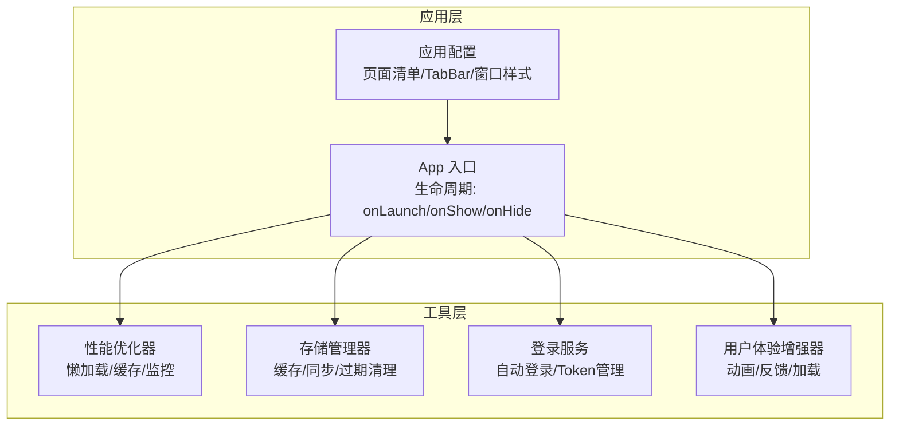
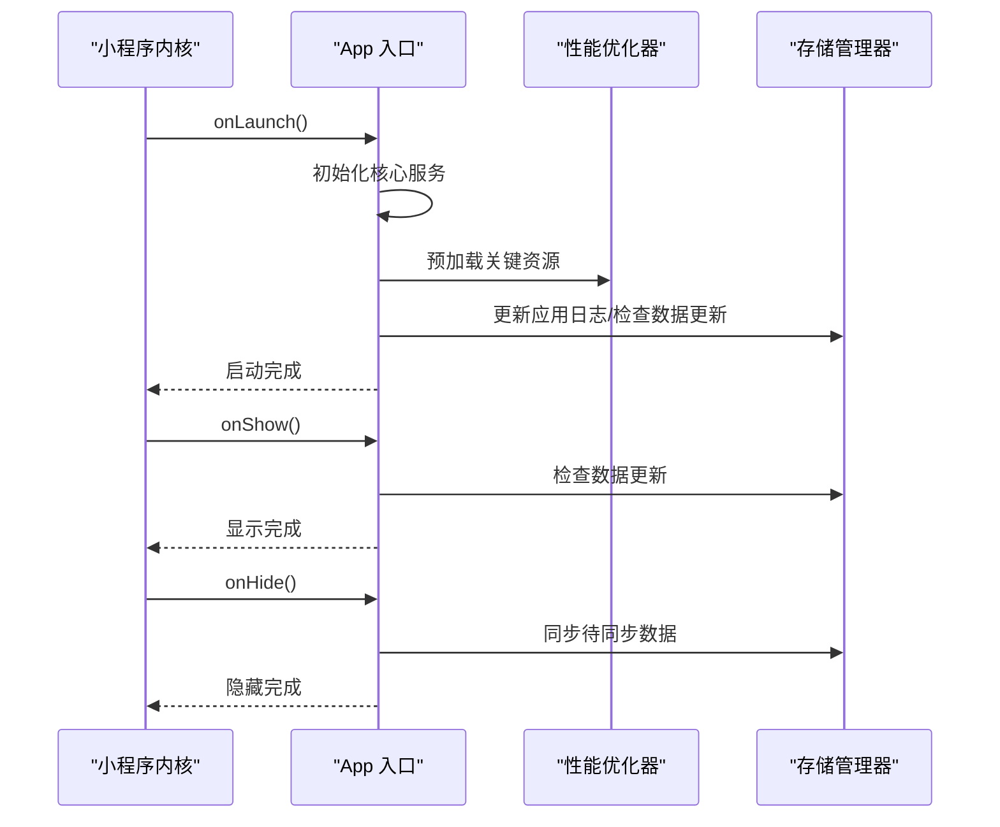
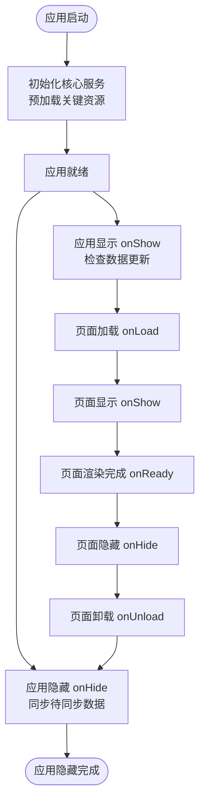
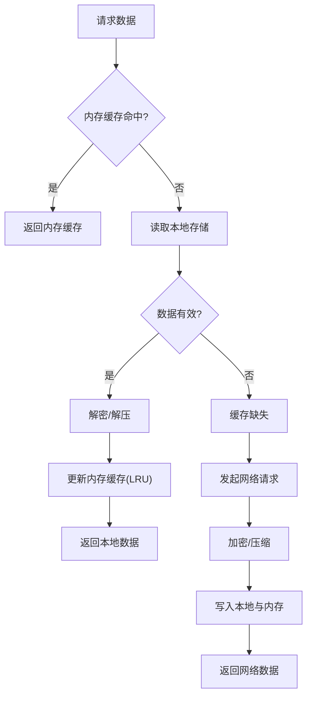
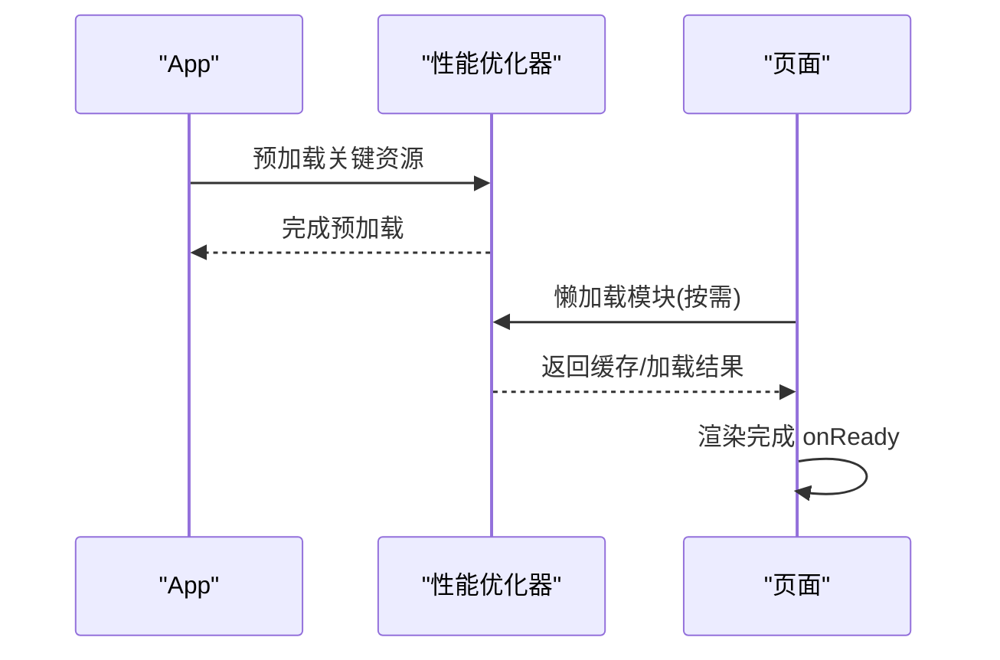
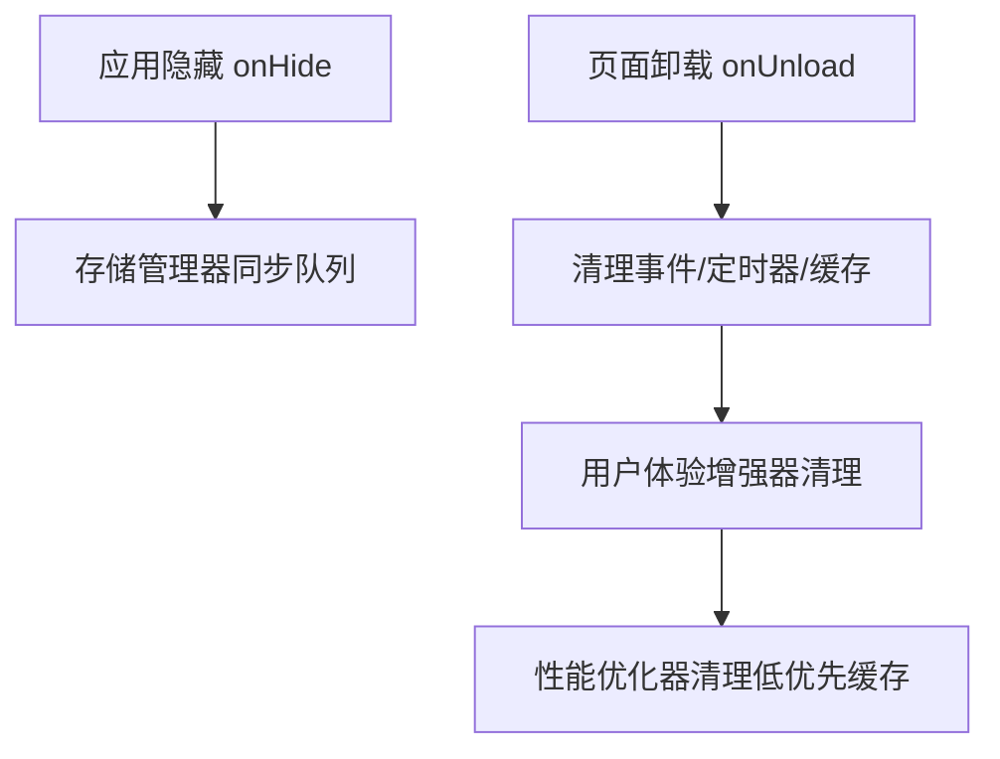
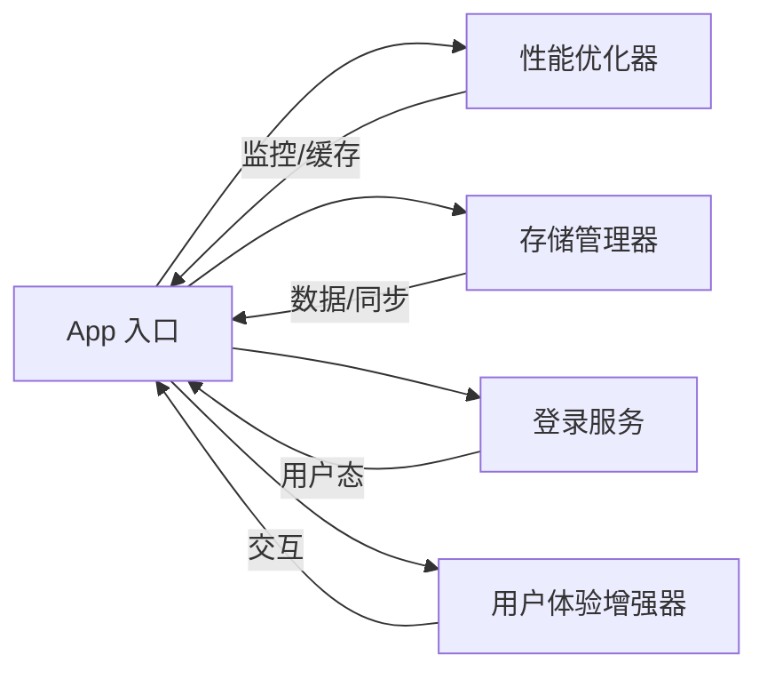

# 页面生命周期

<cite>
**本文引用的文件**
- [miniprogram/app.js](file://miniprogram/app.js)
- [miniprogram/app.json](file://miniprogram/app.json)
- [miniprogram/utils/performance-optimizer.js](file://miniprogram/utils/performance-optimizer.js)
- [miniprogram/utils/storage-manager.js](file://miniprogram/utils/storage-manager.js)
- [miniprogram/utils/loginService.js](file://miniprogram/utils/loginService.js)
- [miniprogram/utils/user-experience-enhancer.js](file://miniprogram/utils/user-experience-enhancer.js)
</cite>

## 目录
1. [简介](#简介)
2. [项目结构](#项目结构)
3. [核心组件](#核心组件)
4. [架构总览](#架构总览)
5. [详细组件分析](#详细组件分析)
6. [依赖关系分析](#依赖关系分析)
7. [性能考量](#性能考量)
8. [故障排查指南](#故障排查指南)
9. [结论](#结论)

## 简介
本文件聚焦于微信小程序页面生命周期的实现与最佳实践，结合仓库中的应用入口与通用工具模块，系统阐述页面生命周期各阶段的执行时机、职责边界、性能优化与调试方法。文档同时覆盖页面缓存策略、数据预加载机制与页面销毁处理，帮助开发者在复杂业务场景中稳定、高效地管理页面状态。

## 项目结构
该小程序采用“应用层 + 工具层”的组织方式：应用入口负责全局生命周期与服务初始化；工具层提供性能优化、存储管理、登录服务与用户体验增强等能力。页面清单由应用配置统一声明，页面间通过路由切换触发应用层生命周期事件。

图表来源
- [miniprogram/app.js](file://miniprogram/app.js#L8-L220)
- [miniprogram/app.json](file://miniprogram/app.json#L1-L78)

章节来源
- [miniprogram/app.js](file://miniprogram/app.js#L8-L220)
- [miniprogram/app.json](file://miniprogram/app.json#L1-L78)

## 核心组件
- 应用入口 App：集中管理全局状态、初始化核心服务、处理应用显示/隐藏与错误事件。
- 性能优化器：提供懒加载、模块缓存、API监控、渲染监控、网络与内存监控等能力。
- 存储管理器：提供智能缓存、数据压缩/加密、LRU淘汰、同步队列与过期清理。
- 登录服务：封装微信/QQ/手机登录、Token刷新与自动登录校验。
- 用户体验增强器：提供动画、消息提示、加载指示器与交互反馈。

章节来源
- [miniprogram/app.js](file://miniprogram/app.js#L8-L220)
- [miniprogram/utils/performance-optimizer.js](file://miniprogram/utils/performance-optimizer.js#L7-L767)
- [miniprogram/utils/storage-manager.js](file://miniprogram/utils/storage-manager.js#L7-L750)
- [miniprogram/utils/loginService.js](file://miniprogram/utils/loginService.js#L4-L491)
- [miniprogram/utils/user-experience-enhancer.js](file://miniprogram/utils/user-experience-enhancer.js#L7-L451)

## 架构总览
应用启动时，App 初始化核心服务并预加载关键资源；页面显示/隐藏时，App 与工具层协同处理数据同步与缓存清理；页面卸载时，工具层负责资源回收与状态清理。页面生命周期与应用生命周期相互配合，形成稳定的运行时环境。

图表来源
- [miniprogram/app.js](file://miniprogram/app.js#L25-L189)
- [miniprogram/utils/performance-optimizer.js](file://miniprogram/utils/performance-optimizer.js#L88-L212)
- [miniprogram/utils/storage-manager.js](file://miniprogram/utils/storage-manager.js#L562-L575)

## 详细组件分析

### 应用生命周期与页面生命周期的关系
- 应用生命周期 onLaunch：应用初始化阶段，执行云开发初始化、核心服务初始化、关键资源预加载、自动登录检查与性能监控初始化。
- 应用生命周期 onShow/onHide：应用显示/隐藏时，驱动存储管理器进行数据更新检查与同步，保障数据一致性。
- 页面生命周期：页面首次加载、显示、渲染完成、隐藏、卸载等阶段由页面自身处理；应用层通过全局服务参与协调。

图表来源
- [miniprogram/app.js](file://miniprogram/app.js#L25-L189)
- [miniprogram/utils/storage-manager.js](file://miniprogram/utils/storage-manager.js#L97-L110)

章节来源
- [miniprogram/app.js](file://miniprogram/app.js#L25-L189)
- [miniprogram/utils/storage-manager.js](file://miniprogram/utils/storage-manager.js#L97-L110)

### 页面生命周期阶段与职责

- onLoad(加载)
  - 时机：页面创建时触发，适合进行参数解析、数据初始化与一次性资源加载。
  - 最佳实践：避免在此阶段进行大量 I/O 或网络请求；如需数据预取，优先使用懒加载与缓存策略。
  - 性能考虑：结合性能优化器的懒加载与缓存，减少首屏阻塞。
  - 常见陷阱：在 onLoad 中执行耗时任务会拉长首屏时间，影响用户体验。

- onShow(显示)
  - 时机：页面显示时触发，适合进行数据刷新、订阅更新与界面激活。
  - 最佳实践：与存储管理器协作，检查远端数据变更并触发增量更新。
  - 性能考虑：避免重复拉取相同数据；利用缓存 TTL 与失效策略。
  - 常见陷阱：频繁全量刷新导致卡顿；未处理网络异常造成白屏。

- onReady(渲染完成)
  - 时机：页面初次渲染完成时触发，适合进行动画播放、焦点设置与首屏埋点。
  - 最佳实践：结合用户体验增强器播放轻量动画，提升过渡体验。
  - 性能考虑：避免在首屏渲染后执行重型计算；合理安排渲染监控。
  - 常见陷阱：在渲染完成后仍执行阻塞任务，影响后续交互。

- onHide(隐藏)
  - 时机：页面隐藏时触发，适合进行数据持久化、停止计时器与释放资源。
  - 最佳实践：与存储管理器协同，将待同步数据加入队列，延时批量上传。
  - 性能考虑：避免在隐藏时进行强 IO 操作；利用应用 onHide 的统一处理。
  - 常见陷阱：忘记持久化导致数据丢失；未清理定时器造成内存泄漏。

- onUnload(卸载)
  - 时机：页面卸载时触发，适合进行彻底清理与资源回收。
  - 最佳实践：清理事件监听、定时器、缓存引用与观察者；调用工具层清理方法。
  - 性能考虑：确保无悬挂引用；避免在卸载时进行异步 I/O。
  - 常见陷阱：未清理导致内存泄漏；清理顺序不当引发异常。

章节来源
- [miniprogram/app.js](file://miniprogram/app.js#L177-L189)
- [miniprogram/utils/storage-manager.js](file://miniprogram/utils/storage-manager.js#L562-L575)
- [miniprogram/utils/performance-optimizer.js](file://miniprogram/utils/performance-optimizer.js#L507-L532)
- [miniprogram/utils/user-experience-enhancer.js](file://miniprogram/utils/user-experience-enhancer.js#L402-L408)

### 页面缓存策略
- 模块级缓存：性能优化器对模块加载进行缓存，支持 TTL 与命中率统计，降低重复加载开销。
- 数据级缓存：存储管理器提供内存缓存与本地存储双层缓存，支持 LRU 淘汰、TTL 过期与压缩/加密。
- 缓存命中与失效：通过缓存命中率监控与过期清理，平衡内存占用与访问效率。

图表来源
- [miniprogram/utils/performance-optimizer.js](file://miniprogram/utils/performance-optimizer.js#L72-L117)
- [miniprogram/utils/storage-manager.js](file://miniprogram/utils/storage-manager.js#L118-L279)

章节来源
- [miniprogram/utils/performance-optimizer.js](file://miniprogram/utils/performance-optimizer.js#L72-L117)
- [miniprogram/utils/storage-manager.js](file://miniprogram/utils/storage-manager.js#L118-L279)

### 数据预加载机制
- 应用启动预加载：App 在 onLaunch 中预加载关键模块与资源，降低页面首屏等待。
- 页面级预加载：页面 onShow 时可结合性能优化器进行按需懒加载与缓存预热。
- 网络与内存监控：性能优化器监控 API 响应时间与内存使用，必要时清理低优先级缓存。

图表来源
- [miniprogram/app.js](file://miniprogram/app.js#L93-L119)
- [miniprogram/utils/performance-optimizer.js](file://miniprogram/utils/performance-optimizer.js#L188-L212)
- [miniprogram/utils/performance-optimizer.js](file://miniprogram/utils/performance-optimizer.js#L72-L117)

章节来源
- [miniprogram/app.js](file://miniprogram/app.js#L93-L119)
- [miniprogram/utils/performance-optimizer.js](file://miniprogram/utils/performance-optimizer.js#L188-L212)

### 页面销毁处理
- 应用 onHide：统一触发存储管理器同步队列，保证数据落盘。
- 页面 onUnload：清理事件监听、定时器与缓存引用；用户体验增强器清理动画与反馈状态。
- 性能优化器：定期清理低优先级缓存与内存，避免长期运行内存膨胀。

图表来源
- [miniprogram/app.js](file://miniprogram/app.js#L184-L189)
- [miniprogram/utils/storage-manager.js](file://miniprogram/utils/storage-manager.js#L562-L567)
- [miniprogram/utils/user-experience-enhancer.js](file://miniprogram/utils/user-experience-enhancer.js#L402-L408)
- [miniprogram/utils/performance-optimizer.js](file://miniprogram/utils/performance-optimizer.js#L288-L301)

章节来源
- [miniprogram/app.js](file://miniprogram/app.js#L184-L189)
- [miniprogram/utils/storage-manager.js](file://miniprogram/utils/storage-manager.js#L562-L567)
- [miniprogram/utils/user-experience-enhancer.js](file://miniprogram/utils/user-experience-enhancer.js#L402-L408)
- [miniprogram/utils/performance-optimizer.js](file://miniprogram/utils/performance-optimizer.js#L288-L301)

### 生命周期调试方法
- 控制台日志：在 App 与工具层的关键节点输出日志，定位生命周期执行顺序与耗时。
- 性能报告：通过性能优化器生成周期性性能报告，识别慢页面与高延迟 API。
- 内存告警：监听内存警告事件，及时清理低优先级缓存与无用对象。
- 存储统计：查看存储管理器的命中率与同步状态，判断缓存策略有效性。

章节来源
- [miniprogram/utils/performance-optimizer.js](file://miniprogram/utils/performance-optimizer.js#L41-L64)
- [miniprogram/utils/performance-optimizer.js](file://miniprogram/utils/performance-optimizer.js#L306-L426)
- [miniprogram/utils/storage-manager.js](file://miniprogram/utils/storage-manager.js#L62-L92)

## 依赖关系分析

图表来源
- [miniprogram/app.js](file://miniprogram/app.js#L44-L62)
- [miniprogram/utils/performance-optimizer.js](file://miniprogram/utils/performance-optimizer.js#L7-L36)
- [miniprogram/utils/storage-manager.js](file://miniprogram/utils/storage-manager.js#L7-L34)
- [miniprogram/utils/loginService.js](file://miniprogram/utils/loginService.js#L4-L11)
- [miniprogram/utils/user-experience-enhancer.js](file://miniprogram/utils/user-experience-enhancer.js#L7-L20)

章节来源
- [miniprogram/app.js](file://miniprogram/app.js#L44-L62)
- [miniprogram/utils/performance-optimizer.js](file://miniprogram/utils/performance-optimizer.js#L7-L36)
- [miniprogram/utils/storage-manager.js](file://miniprogram/utils/storage-manager.js#L7-L34)
- [miniprogram/utils/loginService.js](file://miniprogram/utils/loginService.js#L4-L11)
- [miniprogram/utils/user-experience-enhancer.js](file://miniprogram/utils/user-experience-enhancer.js#L7-L20)

## 性能考量
- 懒加载与缓存：优先使用性能优化器的懒加载与模块缓存，降低首屏与页面切换成本。
- 数据预处理与缓存：对复杂数据进行预处理并缓存，结合 TTL 与命中率统计持续优化。
- 内存与网络：监听内存警告与网络状态变化，动态调整缓存策略与 API 请求频率。
- 渲染与交互：对渲染耗时与交互延迟进行监控，识别瓶颈并优化渲染路径与事件处理。

章节来源
- [miniprogram/utils/performance-optimizer.js](file://miniprogram/utils/performance-optimizer.js#L66-L142)
- [miniprogram/utils/performance-optimizer.js](file://miniprogram/utils/performance-optimizer.js#L584-L618)
- [miniprogram/utils/performance-optimizer.js](file://miniprogram/utils/performance-optimizer.js#L620-L668)

## 故障排查指南
- 页面长时间无响应
  - 检查是否存在 onLoad 中的同步阻塞任务；改用异步与懒加载。
  - 查看性能报告与页面加载时间统计，定位慢点。
- 数据不同步
  - 确认 onShow 中是否调用存储管理器检查数据更新；onHide 是否触发同步队列。
- 内存占用过高
  - 监听内存警告事件，清理低优先级缓存；检查是否存在未清理的定时器与事件监听。
- Token 过期或刷新失败
  - 使用登录服务的自动刷新与验证流程，必要时清除登录状态并引导重新登录。

章节来源
- [miniprogram/utils/storage-manager.js](file://miniprogram/utils/storage-manager.js#L562-L575)
- [miniprogram/utils/performance-optimizer.js](file://miniprogram/utils/performance-optimizer.js#L41-L64)
- [miniprogram/utils/loginService.js](file://miniprogram/utils/loginService.js#L461-L488)

## 结论
通过将应用生命周期与页面生命周期有机结合，并借助性能优化器、存储管理器、登录服务与用户体验增强器等工具层能力，可以在保证稳定性的同时显著提升页面性能与用户体验。建议在实际开发中遵循“懒加载 + 缓存 + 监控”的原则，持续优化页面加载与交互表现，并建立完善的调试与故障排查流程。